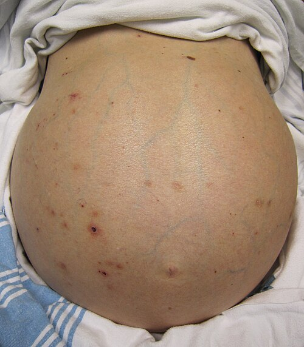

# CIRROSE E COMPLICAÇÕES

Para entender a cirrose, você não pode pensar nela como uma "doença do fígado", mas sim como o desfecho cicatricial de qualquer agressão crônica ao parênquima hepático. Imagine o fígado como uma fábrica altamente organizada. A cirrose é o momento em que a estrutura da fábrica desmorona e é substituída por paredes de concreto (fibrose) que não produzem nada e ainda bloqueiam a passagem dos funcionários (sangue).

O que as bancas de residência querem saber é se você consegue identificar quando essa fábrica parou de produzir (insuficiência hepatocelular) e quando o bloqueio do fluxo está gerando problemas em outros órgãos (hipertensão portal).

## Fisiopatologia: O Porquê da Cicatriz

Tudo começa com a ativação das **células estreladas** (ou células de Ito). Em um fígado saudável, elas apenas armazenam vitamina A. Diante de uma agressão crônica (álcool, vírus, gordura), elas se transformam em miofibroblastos e começam a produzir colágeno freneticamente.

Esse colágeno se deposita no espaço de Disse, "engessando" os sinusoides hepáticos. O resultado? O sangue que deveria passar livremente pelo fígado encontra uma resistência absurda. Isso gera a **Hipertensão Portal**. Ao mesmo tempo, a massa de hepatócitos funcionantes diminui, levando à falência das funções de síntese (albumina, fatores de coagulação) e de detoxificação (bilirrubina, amônia).

*Figura 1 - Ascite maciça: distensão abdominal importante causada por hipertensão portal em paciente com cirrose hepática descompensada. Fonte: James Heilman, MD, CC BY-SA 3.0 | Wikimedia Commons*

## Diagnóstico e Avaliação de Gravidade

O diagnóstico de cirrose é clínico-laboratorial e de imagem. A biópsia hepática, embora seja o padrão-ouro, raramente é necessária se o paciente já apresenta sinais claros de hipertensão portal ou insuficiência hepática.

### Parâmetros de Função Hepática

Cuidado aqui: as transaminases (AST/ALT) não medem função! Elas medem lesão aguda. Para saber se o fígado está "trabalhando", olhamos para:

- **Albumina:** Proteína de síntese exclusiva hepática (meia-vida longa, ~20 dias).

- **TAP/INR:** Avalia fatores de coagulação (meia-vida curta, excelente para ver função aguda).

- **Bilirrubina Direta:** Reflete a capacidade de conjugação e excreção.

### Escores de Gravidade (O que cai na prova)

Você precisa dominar dois escores. As bancas amam trocar os componentes de um pelo outro.

**1. Escala de Child-Pugh:** Prediz sobrevida em 1 e 2 anos.
Componentes (Mnemônico: **B**E**A**T**A**):

- **B**ilirrubina

- **E**ncefalopatia

- **A**scite

- **T**empo de Protrombina (INR)

- **A**lbumina

| Pontos | 1 | 2 | 3 |
| --- | --- | --- | --- |
| Bilirrubina (mg/dL) | < 2 | 2 - 3 | > 3 |
| Albumina (g/dL) | > 3,5 | 2,8 - 3,5 | < 2,8 |
| INR | < 1,7 | 1,7 - 2,3 | > 2,3 |
| Ascite | Ausente | Leve/Moderada | Tensa |
| Encefalopatia | Ausente | Grau 1-2 | Grau 3-4 |

- **Child A:** 5-6 pontos (Bem compensado)

- **Child B:** 7-9 pontos (Comprometimento funcional)

- **Child C:** 10-15 pontos (Descompensado)

**2. Escore MELD (Model for End-Stage Liver Disease):**
Utilizado para priorização na fila de transplante no Brasil. Ele é puramente laboratorial, o que retira a subjetividade da ascite/encefalopatia.
Componentes: **C**reatinina, **B**ilirrubina e **I**NR. (Dica do Dr. Will: Lembre-se de "C-B-I" ou "Cerveja Bem Ingelada" para não esquecer). Recentemente, o Sódio (Na) foi incluído no cálculo oficial (MELD-Na) para aumentar a precisão.

## Hipertensão Portal e Ascite

A ascite é a complicação mais comum da cirrose. Ela ocorre por uma combinação de fatores: a hipertensão portal aumenta a pressão hidrostática, enquanto a hipoalbuminemia reduz a pressão oncótica. Além disso, ocorre uma vasodilatação esplâncnica que "engana" o rim, fazendo-o achar que o corpo está hipovolêmico, ativando o sistema Renina-Angiotensina-Aldosterona (retenção de sódio e água).

### Manejo Inicial da Ascite

O primeiro passo diante de uma ascite nova é a **Paracentese Diagnóstica**.
**Erro clássico:** Achar que não deve puncionar se o INR estiver alargado. A paracentese é segura mesmo com distúrbios de coagulação leves/moderados. Só evite se houver coagulopatia intravascular disseminada (CIVD) ou fibrinólise primária evidente.

No líquido ascítico, o parâmetro mais importante é o **GASA (Gradiente de Albumina Soro-Ascite)**.

- **GASA = Albumina Sérica - Albumina do Líquido Ascítico**

| GASA ≥ 1,1 g/dL | GASA < 1,1 g/dL |
| --- | --- |
| Hipertensão Portal (Cirrose, IC, Budd-Chiari) | Outras causas (Neoplasia, TB, Síndrome Nefrótica) |

Se o GASA for ≥ 1,1 e a **Proteína Total do líquido for baixa (< 2,5 g/dL)**, o diagnóstico de cirrose ganha muita força. Se a proteína for alta (> 2,5 g/dL) com GASA alto, pense em Insuficiência Cardíaca ou Budd-Chiari.

### Tratamento da Ascite Cirrótica

- **Restrição de Sódio:** 2g de sódio por dia (equivalente a 5g de sal de cozinha). Não adianta restringir água, a menos que o sódio sérico esteja < 125 mEq/L.

- **Diuréticos:** O padrão-ouro é a combinação de **Espironolactona** (antagonista da aldosterona) e **Furosemida**.

- Dose inicial: 100 mg de Espironolactona para 40 mg de Furosemida.

- Por que essa proporção? Para manter o potássio em equilíbrio. Podemos titular até 400mg:160mg.

- **Paracentese Terapêutica:** Indicada para ascite tensa ou refratária.

- **Regra de Ouro:** Se retirar mais de 5 litros, você DEVE repor **Albumina** (8g por litro retirado, contando desde o primeiro litro). Isso previne a disfunção circulatória pós-paracentese.

## Peritonite Bacteriana Espontânea (PBE)

A PBE é a infecção do líquido ascítico sem um foco intra-abdominal evidente. O mecanismo é a **translocação bacteriana** (bactérias do intestino atravessam a parede e caem na ascite).

**Diagnóstico:** Polimorfonucleares (PMN) > 250/mm³ no líquido ascítico.
Não espere a cultura! A cultura é negativa em até 40% dos casos (Ascite Neutrocítica). Se tem > 250 PMN, trate.

**Agentes mais comuns:** *E. coli* (1º lugar) e *Klebsiella pneumoniae*.

**Tratamento:**

- Cefalosporina de 3ª geração (Cefotaxima por 5 dias ou Ceftriaxone).

- **Profilaxia de Síndrome Hepatorrenal:** Isso cai em TODA prova. Deve-se administrar Albumina IV (1,5g/kg no 1º dia e 1,0g/kg no 3º dia) se o paciente tiver Creatinina > 1mg/dL, Ureia > 60mg/dL ou Bilirrubina Total > 4mg/dL.

**Profilaxias da PBE:**

- **Aguda (Hemorragia Digestiva):** Todo cirrótico que sangra deve ganhar Ceftriaxone IV (ou Norfloxacino VO) por 7 dias. O sangramento aumenta a translocação bacteriana.

- **Primária (Longo Prazo):** Se a proteína do líquido ascítico for muito baixa (< 1,5 g/dL) + disfunção renal ou hepática grave. Usa-se Norfloxacino 400mg/dia.

- **Secundária:** Após o primeiro episódio de PBE, o paciente deve usar Norfloxacino para o resto da vida (ou até o transplante).

*Figura 2 - Varizes esofágicas: imagem endoscópica mostrando cordões varicosos com sinais de cor vermelha (red wale spots), indicadores de alto risco de sangramento. Fonte: Samir, Domínio Público | Wikimedia Commons*

## Hemorragia Digestiva por Varizes

A hipertensão portal desvia o sangue para colaterais, sendo as varizes esofágicas as mais perigosas.

### Profilaxia Primária (Nunca sangrou)

Quem tratar? Pacientes com varizes de médio/grosso calibre ou varizes pequenas com "red spots" (sinais de cor vermelha) ou Child B/C.
Opções: **Betabloqueador não seletivo** (Propranolol ou Nadolol) OU **Ligadura Elástica por Endoscopia**. Os dois são equivalentes em eficácia.

### Manejo do Sangramento Agudo (Emergência!)

Imagine o cenário: paciente cirrótico chega hematemese volumosa.

- **Estabilização Hemodinâmica:** Cuidado com a reposição excessiva de volume! Se você subir demais a pressão, as varizes voltam a sangrar. Meta de Hemoglobina (Hb) entre 7 e 9 g/dL.

- **Drogas Esplâncnicas:** Octreotida ou Terlipressina (preferencial se disponível). Elas fazem vasoconstrição da artéria esplâncnica, reduzindo o fluxo para a veia porta.

- **Antibioticoprofilaxia:** Ceftriaxone IV (fundamental para reduzir mortalidade).

- **Endoscopia (EDA):** Deve ser feita nas primeiras 12 horas. O tratamento de escolha é a **Ligadura Elástica**. A escleroterapia é segunda linha.

- **Balão de Sengstaken-Blakemore:** É uma medida de "ponte" (máximo 24h) se a endoscopia falhar e o paciente estiver instável.

- **TIPS (Shunt Portossistêmico Intra-hepático Transjugular):** Se o sangramento for refratário. É como um "bypass" dentro do fígado.

## Encefalopatia Hepática (EH)

A EH é uma disfunção cerebral causada pela falência hepática e pelos shunts portossistêmicos. A amônia, que deveria ser convertida em ureia no fígado, vai direto para o cérebro, causando edema astrocitário.

**Clínica:** Alteração do sono (inversão do ciclo vigília-sono), desorientação e o clássico **Flapping** (asterixe).

**Tratamento:**

- **Identificar o gatilho:** EH raramente acontece "do nada". Procure por Constipação, Infecção (PBE!), Hemorragia Digestiva ou uso de Benzodiazepínicos.

- **Lactulose:** É a base do tratamento. Ela acidifica o cólon, transformando NH3 (amônia, absorvível) em NH4+ (amônio, não absorvível) e tem efeito osmótico (laxante). Meta: 2 a 3 evacuações pastosas por dia.

- **Rifaximina:** Antibiótico não absorvível que reduz a flora produtora de amônia. Geralmente associado à lactulose em casos recorrentes.

- **Dieta:** NUNCA restrinja proteínas. O cirrótico já é desnutrido. A restrição piora o prognóstico. Prefira proteínas vegetais ou lácteas se houver intolerância.

## Síndrome Hepatorrenal (SHR)

É uma insuficiência renal funcional (os rins estão sadios, mas "passando fome" de sangue). A vasodilatação esplâncnica extrema da cirrose causa uma vasoconstrição renal reflexa severa.

**Critérios Diagnósticos:**

- Cirrose com ascite.

- Creatinina > 1,5 mg/dL.

- **Ausência de melhora após 48h de retirada de diuréticos e expansão com Albumina (1g/kg/dia).** (Isso é o que diferencia da simples hipovolemia).

- Ausência de choque ou drogas nefrotóxicas.

- Ausência de doença parenquimatosa renal (proteinúria < 500mg/dia e USG normal).

**Tratamento:** Vasoconstritores (Terlipressina ou Noradrenalina) + Albumina. O tratamento definitivo é o transplante hepático.

## Nódulos Hepáticos e Hepatocarcinoma (CHC)

Aqui as bancas adoram confundir lesões benignas com o CHC. No MedEvo, sempre reforçamos o padrão radiológico, que é a chave da questão.

### Lesões Benignas

- **Hemangioma:** O mais comum. Na TC/RM: Captação periférica e **centripeta** (vai preenchendo para o centro) e tardia. Conduta: Observação. **Biópsia é contraindicada** pelo risco de sangramento.

- **Hiperplasia Nodular Focal (HNF):** "Cicatriz central" é a palavra-chave. Lesão benigna que não maligniza.

- **Adenoma:** Associado ao uso de **Anticoncepcionais Orais (ACO)** e anabolizantes. Risco de ruptura (dor aguda + anemia) e de malignização. Conduta: Suspender ACO. Se > 5cm ou persistente, cirurgia.

### Carcinoma Hepatocelular (CHC)

O rastreio deve ser feito em todo cirrótico com **USG de abdome + Alfa-fetoproteína (AFP) a cada 6 meses**.

**Diagnóstico:** Em um fígado cirrótico, se houver um nódulo > 1cm com padrão de **Washout** (captação intensa na fase arterial e clareamento rápido na fase venosa), o diagnóstico está feito. Não precisa de biópsia!

**Critérios de Milão (Para Transplante):**

- Nódulo único < 5cm OU

- Até 3 nódulos, todos < 3cm.

- Ausência de invasão vascular ou metástases.

## Etiologias Específicas: As "Pérolas" de Prova

Nem toda cirrose é álcool ou vírus. Fique atento a estes cenários:

- **Doença de Wilson:** Jovem com cirrose + sintomas psiquiátricos/neurológicos + Anemia hemolítica Coombs-negativa. Procure pelos **Anéis de Kayser-Fleischer** na lâmpada de fenda. Diagnóstico: Ceruloplasmina baixa e Cobre urinário alto.

- **Hemocromatose Hereditária:** "Diabetes bronzeado". Homem com cirrose + hiperpigmentação cutânea + Diabetes + Artralgia. Diagnóstico: Saturação de Transferrina > 45-50% e Ferritina alta. Teste genético (HFE - C282Y).

- **Doença Hepática Gordurosa (MASLD):** Associada à síndrome metabólica. É hoje uma das principais causas de cirrose no Brasil.

- **Abscesso Hepático:**

- **Piogênico:** Geralmente por infecção biliar (E. coli). Febre + dor em hipocôndrio direito. Tratamento: Drenagem + Antibiótico.

- **Amebiano:** Aspecto em "molho de anchova". Tratamento: Metronidazol (raramente drena).

## Tabela Comparativa: Ascite e Líquido Ascítico

| Parâmetro | PBE | Peritonite Secundária | Ascite Quilosa |
| --- | --- | --- | --- |
| **PMN** | > 250/mm³ | > 250/mm³ | Variável |
| **GASA** | Geralmente ≥ 1,1 | Geralmente < 1,1 | Variável |
| **Proteína Total** | Baixa (< 1,5) | Alta (> 2,5) | Alta |
| **Outros** | Monobacteriana | Polimicrobiana; Glicose < 50; LDH alto | Triglicerídeos > 200 mg/dL |
| **Conduta** | Cefotaxima + Albumina | ATB amplo + Cirurgia/Drenagem | Investigar Linfoma/Neoplasia |

## Tabela: Diagnóstico Diferencial de Nódulos Hepáticos

| Lesão | Perfil Típico | Imagem Característica | Conduta |
| --- | --- | --- | --- |
| **Hemangioma** | Mulher, assintomática | Realce centrípeto (periferia para o centro) | Expectante |
| **HNF** | Mulher jovem | Cicatriz central estrelada | Expectante |
| **Adenoma** | Uso de ACO | Captação arterial homogênea | Suspender ACO / Cirurgia se > 5cm |
| **CHC** | Cirrótico / Hep B | Arterialização com **Washout** | Milão (Transplante) ou Ressecção |

## Pontos-Chave para Prova 💡

- **GASA ≥ 1,1:** Hipertensão portal. Se < 1,1, pense em Neoplasia ou TB.

- **PBE:** PMN > 250. Tratar com Cefotaxima. Não esquecer Albumina (dias 1 e 3) se houver risco renal.

- **Profilaxia de PBE no Sangramento:** Obrigatória para todos (Ceftriaxone ou Norfloxacino).

- **Hemorragia por Varizes:** Estabilizar primeiro (Hb 7-9), Terlipressina/Octreotida, ATB e EDA com Ligadura.

- **Síndrome Hepatorrenal:** Diagnóstico de exclusão. Precisa de teste de volume com Albumina por 48h antes de fechar o diagnóstico.

- **Encefalopatia:** Lactulose é a primeira linha. Meta: 2-3 evacuações. Nunca restringir proteína na dieta.

- **Child-Pugh:** Avalia prognóstico (Bilirrubina, Encefalopatia, Ascite, TAP/INR, Albumina).

- **MELD:** Prioridade de transplante (Bilirrubina, Creatinina, INR).

- **Adenoma Hepático:** Risco de ruptura e choque hipovolêmico em mulheres jovens que usam anticoncepcional.

- **Hemangioma:** Lesão benigna mais comum; biópsia é contraindicada pelo risco de sangramento.

- **Doença de Wilson:** Cobre urinário de 24h é o exame inicial mais sensível.

- **Paracentese de Grande Volume (> 5L):** Repor 8g de Albumina por litro retirado.

- **Betabloqueador na Cirrose:** Usado na profilaxia de varizes. **Contraindicação Absoluta:** PBE com instabilidade hemodinâmica ou SHR (pode piorar a perfusão renal).

- **Hiponatremia na Cirrose:** Geralmente é dilucional. Trata-se com restrição hídrica, NÃO com reposição de sal (que pioraria a ascite).

- **Trombocitopenia:** Na cirrose, é causada principalmente pelo hiperesplenismo (sequestro esplênico) devido à hipertensão portal.

 Cópia offline para consulta pessoal.
 Fonte original:
 [https://www.medevo.com.br/material-apoio/ler/d3fc17e6-b1f4-411c-ab92-28ac3b34a09d](https://www.medevo.com.br/material-apoio/ler/d3fc17e6-b1f4-411c-ab92-28ac3b34a09d)
