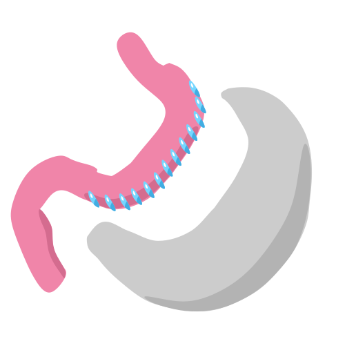

# CIRURGIA METABÓLICA

A cirurgia metabólica não é apenas uma "cirurgia bariátrica para quem é menos gordo". Se você começar a sua prova com esse pensamento, a banca vai te pegar. Enquanto a cirurgia bariátrica foca na perda de peso e no tratamento da obesidade como doença primária, a cirurgia metabólica tem como alvo principal o controle de doenças metabólicas, especialmente o Diabetes Mellitus tipo 2 (DM2), independentemente da perda ponderal ser o objetivo central.

Para o cirurgião e para o clínico, a mudança de paradigma é total: paramos de olhar apenas para a balança e passamos a olhar para a hemoglobina glicada, para a reserva pancreática e para o tempo de diagnóstico da doença.

## Definição e o Conceito de "Cirurgia Metabólica"

Historicamente, percebeu-se que pacientes submetidos ao Bypass Gástrico apresentavam melhora do diabetes muito antes de perderem peso significativo. Isso acendeu um alerta na comunidade científica: havia algo além da restrição calórica.

A cirurgia metabólica é definida como o conjunto de procedimentos cirúrgicos realizados no trato digestivo com o intuito de obter a remissão ou o controle clínico de doenças metabólicas, como o DM2, a hipertensão arterial e a dislipidemia. No Brasil, o Conselho Federal de Medicina (CFM), através da Resolução 2172/2017, estabeleceu critérios rígidos para sua indicação em pacientes com IMC entre 30 e 34,9 kg/m².

**Dica de Prova:** As bancas adoram confundir as indicações. Lembre-se: se o IMC é ≥ 35 kg/m² com comorbidades ou ≥ 40 kg/m², estamos falando de Cirurgia Bariátrica (critérios clássicos). Se o IMC está entre 30 e 34,9 kg/m² e o foco é o DM2 refratário, estamos no terreno da Cirurgia Metabólica.

*Figura 1 - Bypass gástrico em Y de Roux: diagrama mostrando o pouch gástrico, a alça alimentar (Roux) e a exclusão duodenal, mecanismo-chave para o controle metabólico do DM2. Fonte: NIDDK/NIH, Domínio Público | Wikimedia Commons*

## Fisiopatologia: Por que a cirurgia funciona?

Para entender a cirurgia, você precisa entender o intestino como um órgão endócrino. Não é apenas um "cano" de comida. Existem duas teorias principais que explicam por que o paciente sai da sala de cirurgia já com a glicemia melhorando, muitas vezes antes mesmo da primeira refeição líquida.

### Teoria do Intestino Proximal (Foregut Hypothesis)

Esta teoria sugere que a exclusão do duodeno e do jejuno proximal do trânsito alimentar impede a secreção de sinais diabetogênicos (anti-incretinas). Em pacientes com DM2, a passagem do quimo por essa região desencadearia uma resposta hormonal anômala que piora a resistência à insulina. Ao "pular" essa parte do intestino, removemos esse estímulo negativo.

### Teoria do Intestino Distal (Hindgut Hypothesis)

Esta é a mais aceita e cobrada. Ao realizar um Bypass, o alimento chega mais rápido ao íleo distal. Lá, as células L produzem incretinas, principalmente o GLP-1 (Glucagon-like peptide-1) e o PYY (Peptídeo YY).

- O GLP-1 estimula a secreção de insulina de forma dependente da glicose e melhora a sensibilidade periférica à insulina.

- O PYY promove saciedade precoce.

Como dizemos no MedEvo, a cirurgia metabólica é, na verdade, uma "terapia incretínica cirúrgica". O Dr. Will sempre reforça: o aumento do GLP-1 pós-operatório é o grande protagonista da remissão do diabetes.

## Critérios de Indicação (A "Bíblia" da Resolução CFM 2172/2017)

Este é o ponto onde 80% das questões de prova se concentram. Você precisa decorar esses números, pois as bancas não perdoam arredondamentos.

Para um paciente com IMC entre 30 e 34,9 kg/m² ser candidato à cirurgia metabólica, ele deve preencher TODOS os critérios abaixo:

- **Idade:** Entre 30 e 70 anos. (Cuidado: na bariátrica convencional, a idade mínima é 16 anos, mas na metabólica para IMC < 35, a regra é mais restrita).

- **Diagnóstico de DM2:** Deve ter menos de 10 anos de diagnóstico. Por que? Porque após 10 anos, a reserva de células beta do pâncreas costuma estar exaurida, e a cirurgia não terá o substrato necessário para funcionar.

- **Refratariedade Clínica:** Falha no tratamento clínico otimizado por pelo menos 2 anos. Isso inclui mudanças no estilo de vida e uso de medicações em doses máximas toleradas.

- **Parecer de Especialistas:** É obrigatório o parecer de dois endocrinologistas atestando a refratariedade do tratamento clínico.

- **Contraindicações:** Não possuir contraindicações cirúrgicas gerais ou psiquiátricas graves.

**Exemplo Clínico:** Paciente de 28 anos, IMC 32 kg/m², DM2 há 3 anos, sem controle com metformina e liraglutida. Ele pode operar? **Não.** Pela regra do CFM, ele não tem a idade mínima de 30 anos. Em prova, a banca vai tentar te convencer de que, por ele ser jovem e ter DM2 recente, ele é um "ótimo candidato". Tecnicamente ele é, mas legalmente ele não preenche os critérios brasileiros atuais.

## Técnicas Cirúrgicas: O que fazer e por quê?

Embora existam várias técnicas descritas, a Resolução do CFM é clara ao apontar as duas principais permitidas para a finalidade metabólica.

### 1. Bypass Gástrico em Y de Roux (Capella)

É o "padrão-ouro" para o tratamento do diabetes.

- **Como é feito:** Cria-se uma pequena bolsa gástrica (30-50 ml) que é anastomosada ao jejuno (alça alimentar). O restante do estômago e o duodeno ficam exclusos do trânsito alimentar, mas continuam produzindo sucos digestivos que encontram o alimento mais adiante (alça biliopancreática).

- **Por que é melhor para o DM2?** Ele combina as duas teorias (proximal e distal). Exclui o duodeno (teoria proximal) e leva o alimento rápido ao íleo (teoria distal). Além disso, promove uma alteração profunda na microbiota intestinal e nos ácidos biliares, que também ajudam no controle glicêmico.

### 2. Gastrectomia Vertical (Sleeve)

- **Como é feito:** Remove-se cerca de 80% da grande curvatura do estômago, transformando-o em um tubo fino ("manga").

- **Mecanismo:** O principal efeito é a redução drástica da Grelina (hormônio da fome produzido no fundo gástrico) e um esvaziamento gástrico mais rápido, que também acaba estimulando o GLP-1 no íleo, embora de forma menos intensa que o Bypass.

- **Vantagem:** Não mexe na absorção de micronutrientes de forma tão agressiva e não tem risco de hérnias internas.

- **Desvantagem:** Pode piorar ou causar Doença do Refluxo Gastroesofágico (DRGE).

**Pegadinha de Prova:** A alternativa dirá que a Gastrectomia Vertical é a técnica preferencial para o DM2 por ser "mais simples". **Falso.** O Bypass Gástrico em Y de Roux é a técnica preferencial para o controle metabólico do diabetes devido ao seu componente de exclusão duodenal.

*Figura 2 - Gastrectomia vertical (Sleeve): representação da ressecção de aproximadamente 80% da grande curvatura gástrica, transformando o estômago em formato tubular. Fonte: Lina Wolf, CC BY-SA 4.0 | Wikimedia Commons*

## Comparativo de Técnicas

| Característica | Bypass Gástrico (Y de Roux) | Gastrectomia Vertical (Sleeve) |
| --- | --- | --- |
| **Mecanismo Principal** | Misto (Restritivo + Disabsortivo funcional) | Restritivo + Hormonal |
| **Efeito Metabólico** | Muito Alto (GLP-1 ↑↑↑, Anti-incretinas ↓) | Alto (GLP-1 ↑, Grelina ↓↓) |
| **Refluxo (DRGE)** | Melhora o refluxo (Tratamento para DRGE) | Pode causar ou agravar o refluxo |
| **Complexidade** | Maior (duas anastomoses) | Menor (nenhuma anastomose) |
| **Deficiência Nutricional** | Mais comum (B12, Ferro, Cálcio) | Menos comum |

## Avaliação Pré-Operatória e a Equipe Multidisciplinar

O sucesso da cirurgia metabólica não depende apenas da habilidade do cirurgião com o grampeador. O preparo é exaustivo.

### Avaliação da Reserva Pancreática

Antes de indicar a cirurgia, precisamos saber se o pâncreas do paciente ainda "trabalha". Se o paciente tem DM2 mas já está em fase de falência pancreática (comportando-se como um DM1), a cirurgia não trará remissão.

- **Peptídeo C:** É o marcador de escolha. Se estiver muito baixo, indica baixa reserva insulínica.

- **Anti-GAD e Anti-Ilhota:** Devem ser solicitados se houver dúvida se o paciente é realmente DM2 ou um LADA (Latent Autoimmune Diabetes in Adults). Cirurgia metabólica NÃO é indicada para DM1 ou LADA.

### O Papel dos "Dois Endocrinologistas"

Lembre-se da exigência legal: dois pareceres distintos. Eles devem documentar que o paciente tentou de tudo:

- Metas de HbA1c não atingidas (geralmente > 7%).

- Uso de múltiplas drogas (Metformina, iSGLT2, análogos de GLP-1, insulina).

- Acompanhamento regular por pelo menos 24 meses.

## Contraindicações Absolutas

Não decore apenas quem pode operar; decore quem **NÃO PODE** de jeito nenhum:

- Diabetes Mellitus Tipo 1 (DM1).

- Uso de álcool ou drogas ilícitas (mínimo 1 ano de abstinência).

- Doenças psiquiátricas graves não controladas (esquizofrenia, transtorno bipolar grave).

- Risco cirúrgico ASA IV ou doenças terminais.

- Incapacidade de compreender os riscos e a necessidade de acompanhamento vitalício.

## Resultados e Critérios de Sucesso

Como saber se a cirurgia "deu certo"? No mundo da cirurgia metabólica, usamos os critérios de remissão do diabetes.

### Remissão Completa

- Glicemia de jejum < 100 mg/dL.

- Hemoglobina Glicada (HbA1c) < 6,0%.

- **Sem uso de nenhuma medicação antidiabética.**

- Mantido por pelo menos 1 ano.

### Remissão Parcial

- Glicemia de jejum entre 100 e 125 mg/dL.

- HbA1c entre 6,0% e 6,4%.

- Sem medicação por pelo menos 1 ano.

### Melhora Clínica

- Redução significativa nos níveis glicêmicos e na quantidade/dose de medicações, mesmo que os níveis de remissão não sejam atingidos.

**Atenção:** A remissão não significa "cura" definitiva. O diabetes é uma doença crônica. O paciente pode voltar a ter níveis elevados de glicose se houver reganho de peso ou se a doença progredir naturalmente com a idade. Por isso, o termo correto é **remissão**, nunca "cura".

## Complicações Pós-Operatórias: O que cai na prova?

As complicações podem ser precoces (até 30 dias) ou tardias.

### Síndrome de Dumping

Muito comum no Bypass Gástrico. Ocorre porque o estômago não tem mais o piloro para controlar a saída do alimento.

- **Dumping Precoce (15-30 min após comer):** Alimentos osmóticos (açúcares) puxam água para o lúmen intestinal. Sintomas: dor abdominal, diarreia, taquicardia, sudorese.

- **Dumping Tardio (1-3 horas após comer):** Ocorre uma liberação maciça de insulina devido à chegada rápida de glicose ao intestino, gerando uma **hipoglicemia reacional**.

### Fístulas e Deiscências

A complicação precoce mais temida. O local mais comum é o ângulo de Hiss (na transição esofagogástrica) na Gastrectomia Vertical.

- **Sinal de alerta:** Taquicardia persistente (FC > 120 bpm) é o sinal mais precoce de fístula, muitas vezes antes da febre ou dor abdominal.

### Deficiências Nutricionais

- **Vitamina B12:** Precisa de ácido gástrico e fator intrínseco. No Bypass, ambos estão reduzidos.

- **Ferro:** Absorvido principalmente no duodeno (que está excluso no Bypass).

- **Cálcio e Vitamina D:** Também absorvidos no duodeno e jejuno proximal. O risco de osteoporose a longo prazo é real.

## Cirurgia Metabólica vs. Tratamento Clínico Intensivo

Vários estudos (como o STAMPEDE e o MInT) compararam a cirurgia com o melhor tratamento clínico disponível. Os resultados são consistentes:

- A cirurgia é superior ao tratamento clínico na redução da HbA1c.

- A cirurgia reduz a necessidade de insulina em mais de 90% dos casos.

- A cirurgia melhora outros componentes da Síndrome Metabólica (reduz triglicerídeos e aumenta HDL).

- A perda de peso é mais sustentada no grupo cirúrgico.

No entanto, a cirurgia traz riscos inerentes ao procedimento e à má absorção. Por isso, a indicação deve ser sempre individualizada.

## Situações Especiais e Manejo Clínico

### O Paciente Idoso (65-70 anos)

A cirurgia metabólica em idosos exige uma avaliação de fragilidade (frailty). O benefício em termos de anos de vida ganhos é menor do que em um paciente de 40 anos, mas a melhora na qualidade de vida e a redução da polifarmácia podem ser justificativas válidas.

### Gestação Pós-Cirurgia

Recomenda-se evitar a gestação nos primeiros 12 a 18 meses após a cirurgia, período de perda de peso mais intensa e maior instabilidade nutricional. O risco de deficiências vitamínicas para o feto é alto se não houver suplementação rigorosa.

### O Papel da Atividade Física

Não pense que a cirurgia faz tudo sozinha. Para manter a remissão do DM2, o paciente deve realizar pelo menos 150 minutos de atividade física moderada por semana. O exercício aumenta a translocação de receptores GLUT-4 no músculo, potencializando o efeito da cirurgia.

## Diagnóstico Diferencial de Ganho de Peso Pós-Cirurgia

Se o paciente operou e o diabetes voltou junto com o peso, precisamos investigar:

- **Dilatação da anastomose:** No Bypass, se a comunicação entre o estômago e o intestino dilatar, a saciedade diminui.

- **Fístula Gastro-gástrica:** Uma comunicação acidental entre o "pocket" gástrico e o estômago excluso. O alimento volta a passar pelo duodeno, anulando o efeito metabólico (teoria proximal).

- **Erros Alimentares:** O "beliscamento" (grazing behavior) de alimentos hipercalóricos e líquidos (sorvetes, leite condensado) que passam facilmente pela restrição cirúrgica.

## Tabelas Comparativas para Revisão Rápida

### Tabela 1: Critérios de Indicação CFM 2172/2017 (IMC 30-34,9)

| Critério | Valor/Condição |
| --- | --- |
| **Idade** | 30 a 70 anos |
| **Tempo de DM2** | < 10 anos |
| **Tratamento Clínico** | Refratário por ≥ 2 anos |
| **IMC** | 30 a 34,9 kg/m² |
| **Exigência Legal** | Parecer de 2 endocrinologistas |
| **Reserva Pancreática** | Deve estar presente (Peptídeo C normal) |

### Tabela 2: Metas de Remissão do DM2

| Status de Remissão | HbA1c | Glicemia de Jejum | Medicação |
| --- | --- | --- | --- |
| **Completa** | < 6,0% | < 100 mg/dL | Nenhuma |
| **Parcial** | 6,0 - 6,4% | 100 - 125 mg/dL | Nenhuma |
| **Melhora** | Queda ≥ 1% | Redução significativa | Redução de dose/número |

### Tabela 3: Principais Hormônios e Efeitos

| Hormônio | Origem | Efeito na Cirurgia | Resultado Metabólico |
| --- | --- | --- | --- |
| **GLP-1** | Células L (Íleo) | Aumenta (↑↑) | ↑ Insulina, ↑ Sensibilidade |
| **Grelina** | Fundo Gástrico | Diminui (↓↓) | ↓ Fome |
| **PYY** | Células L (Íleo) | Aumenta (↑) | ↑ Saciedade |
| **GIP** | Células K (Duodeno) | Diminui (no Bypass) | Melhora resistência insulínica |

## Pontos-Chave para Prova 💡

- **IMC 30-34,9 kg/m²:** É a faixa exclusiva da cirurgia metabólica regulamentada pela Resolução CFM 2172/2017.

- **Idade 30-70 anos:** Fora dessa faixa, a cirurgia metabólica para IMC < 35 não está autorizada pelo CFM.

- **Tempo de Doença:** DM2 com mais de 10 anos de diagnóstico é um critério de exclusão (ou pelo menos um forte preditor de insucesso).

- **Técnica Preferencial:** O Bypass Gástrico em Y de Roux é superior à Gastrectomia Vertical para o controle do DM2.

- **Teoria Distal:** O aumento do GLP-1 pelo contato rápido do quimo com o íleo é o principal mecanismo de remissão.

- **Peptídeo C:** Deve ser dosado para garantir que o paciente ainda produz insulina.

- **Dumping Tardio:** É uma hipoglicemia reacional mediada por insulina, ocorrendo 1-3h após a refeição.

- **Taquicardia:** É o sinal clínico mais precoce e sensível de uma fístula anastomótica no pós-operatório.

- **Remissão ≠ Cura:** O paciente deve manter acompanhamento para o resto da vida devido ao risco de recidiva.

- **Contraindicação Absoluta:** Diabetes Tipo 1 (DM1) nunca deve ser tratado com cirurgia metabólica.

- **Sucesso Cirúrgico:** HbA1c < 6,0% sem medicação por 1 ano define remissão completa.

- **Tratamento Clínico:** Deve ter sido tentado por pelo menos 2 anos antes da indicação cirúrgica.

- **Bypass e DRGE:** O Bypass é a técnica de escolha se o paciente metabólico também tiver refluxo grave.

- **Sleeve e DRGE:** A Gastrectomia Vertical pode ser considerada contraindicação relativa em pacientes com esofagite grave (Los Angeles C ou D).

- **Suplementação:** Ferro, B12 e Cálcio são as deficiências mais comuns e devem ser monitoradas para sempre.

- **Erro Comum:** Achar que a cirurgia metabólica é indicada para qualquer obeso grau I. Não! Apenas para diabéticos tipo 2 mal controlados.

 Cópia offline para consulta pessoal.
 Fonte original:
 [https://www.medevo.com.br/material-apoio/ler/e4b5e9b0-57e2-4b8e-85be-11849c94c9d4](https://www.medevo.com.br/material-apoio/ler/e4b5e9b0-57e2-4b8e-85be-11849c94c9d4)
