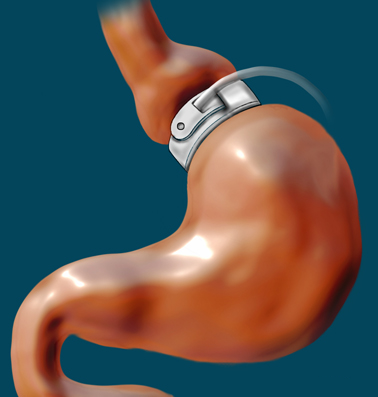
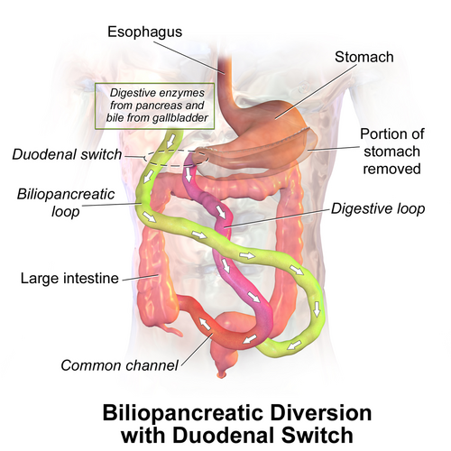

# CIRURGIAS DISABSORTIVAS

Para entender as cirurgias disabsortivas, você precisa primeiro esquecer a ideia de que "comer menos" é o único caminho para tratar a obesidade grave. Na cirurgia bariátrica, trabalhamos com três pilares: restrição (diminuir o volume do estômago), disabsorção (desviar o caminho do alimento para que ele não seja totalmente absorvido) e o componente metabólico (alterações hormonais).

As cirurgias predominantemente disabsortivas são as "armas pesadas" do cirurgião bariátrico. Elas são reservadas, geralmente, para pacientes com IMC muito elevado (superobesos, IMC > 50 kg/m²) ou casos de falha em outras técnicas. Por quê? Porque elas oferecem a maior perda de peso e o melhor controle do diabetes, mas cobram um preço alto em termos de vigilância nutricional.

*Figura 1 - Banda gástrica ajustável: exemplo de técnica restritiva para comparação com as cirurgias disabsortivas. Fonte: James P Gray, CC BY-SA 3.0 | Wikimedia Commons*

## Classificação das Cirurgias Bariátricas

Antes de mergulharmos nas técnicas específicas, vamos organizar a casa. As bancas de residência amam classificar os procedimentos. Segundo a Sociedade Brasileira de Cirurgia Bariátrica e Metabólica (SBCBM) e o Colégio Brasileiro de Cirurgiões (CBC), dividimos as cirurgias em:

- **Restritivas:** Reduzem a capacidade gástrica (ex: Gastrectomia Vertical/Sleeve, Banda Gástrica).

- **Mistas:** Combinam restrição com um desvio intestinal moderado (ex: Bypass Gástrico em Y de Roux).

- **Predominantemente Disabsortivas:** O foco principal é o desvio intestinal extenso, reduzindo drasticamente a área de absorção (ex: Derivações Biliopancreáticas).

Cuidado: no MedEvo, sempre reforçamos que nenhuma cirurgia é "100% uma coisa só". Mesmo o Duodenal Switch tem um componente restritivo (o Sleeve), mas o que define sua categoria na prova é o seu mecanismo de ação principal.

*Figura 2 - Derivação biliopancreática (Scopinaro): ilustração do desvio intestinal extenso com alça alimentar, biliopancreática e canal comum curto. Fonte: BruceBlaus, CC BY-SA 4.0 | Wikimedia Commons*

## A Fisiopatologia da Disabsorção

Por que o paciente perde tanto peso nessas cirurgias? Não é apenas porque ele "absorve menos calorias". Existe uma engenharia intestinal aqui.

Nas cirurgias disabsortivas, criamos três "alças" ou caminhos intestinais:

- **Alça Alimentar:** Por onde passa o alimento mastigado, mas sem contato com as enzimas digestivas.

- **Alça Biliopancreática:** Por onde passam a bile e o suco pancreático, mas sem contato com o alimento.

- **Alça Comum:** É o único trecho onde o alimento se mistura com as enzimas. É aqui que a absorção realmente acontece.

O segredo (e o perigo) das cirurgias disabsortivas está no tamanho da **alça comum**. Quanto menor ela for, menor o tempo de contato entre enzima e nutriente, e maior será a disabsorção. Em técnicas como o Duodenal Switch, essa alça comum costuma ter entre 75 cm e 100 cm. Para você ter uma ideia, o intestino delgado humano tem cerca de 6 metros. Reduzir a área funcional para menos de 1 metro é uma mudança drástica.

## Derivação Biliopancreática: Técnica de Scopinaro

Esta é a técnica "mãe" das disabsortivas, descrita pelo italiano Nicola Scopinaro. Embora menos utilizada hoje devido às suas complicações, ela cai com frequência em provas para testar se você conhece a anatomia cirúrgica.

### Anatomia do Scopinaro

- **Gastrectomia Horizontal:** Retira-se a parte distal do estômago. O estômago remanescente é maior do que no Bypass (cerca de 200-500 ml).

- **Desvio Intestinal:** O intestino é seccionado. A parte distal (íleo) é ligada ao estômago (alça alimentar).

- **Alça Biliopancreática:** O duodeno e o jejuno ficam excluídos do trânsito alimentar, levando apenas bile e suco pancreático para encontrar o alimento lá no final, formando uma alça comum curta (geralmente 50 cm).

**O grande problema do Scopinaro:** Como a gastrectomia é horizontal e o estômago é anastomosado diretamente ao íleo, não há a proteção do piloro. Além disso, o ácido gástrico cai direto em uma alça intestinal que não está preparada para ele, gerando uma incidência altíssima de **úlceras marginais** (úlceras na anastomose).

## Derivação Biliopancreática com Switch Duodenal (BPD/DS)

Esta é a evolução do Scopinaro e, atualmente, a técnica disabsortiva mais cobrada e realizada. Se a prova perguntar qual a cirurgia que mais perde peso ou qual a mais malabsortiva, a resposta é **Duodenal Switch**.

### Por que o Duodenal Switch é "melhor" que o Scopinaro?

O Dr. Hess modificou a técnica de Scopinaro para resolver dois problemas: a úlcera marginal e a síndrome de dumping.

- **Gastrectomia Vertical (Sleeve):** Em vez de cortar o estômago horizontalmente, faz-se um Sleeve. Isso preserva a curvatura menor e, o mais importante, **preserva o piloro**.

- **Preservação do Piloro:** Como o piloro é mantido, o esvaziamento gástrico é fisiológico. Isso reduz drasticamente a incidência de Síndrome de Dumping e de úlceras marginais (já que o bulbo duodenal inicial ainda recebe o quimo).

- **Anastomose Duodeno-ileal:** O desvio intestinal começa após o piloro.

| Característica | Scopinaro (BPD) | Duodenal Switch (BPD/DS) |
| --- | --- | --- |
| **Tipo de Gastrectomia** | Horizontal (Distal) | Vertical (Sleeve) |
| **Piloro** | Excluído/Retirado | Preservado |
| **Úlcera Marginal** | Alta incidência | Baixa incidência |
| **Dumping** | Comum | Raro |
| **Mecanismo Principal** | Disabsorção intensa | Disabsorção intensa |

## Complicações Nutricionais: O Calcanhar de Aquiles

Aqui é onde as bancas de residência fazem a festa. Você precisa entender que a disabsorção não escolhe o que vai "deixar passar". Ela barra calorias, mas também barra nutrientes essenciais.

### 1. Desnutrição Proteico-Calórica

É a complicação mais temida. Como a digestão de proteínas depende fortemente das enzimas pancreáticas e de um tempo de contato prolongado na alça comum, esses pacientes podem evoluir com hipoalbuminemia grave, edema de membros inferiores e ascite.

- **Dica de Prova:** Se o caso clínico mostrar um paciente pós-Duodenal Switch com edema e queda de cabelo, pense em desnutrição proteica antes de qualquer outra coisa.

### 2. Deficiência de Vitaminas Lipossolúveis (A, D, E, K)

A absorção dessas vitaminas depende da formação de micelas com a bile. Como a bile só encontra o alimento no final do intestino, a absorção fica seriamente comprometida.

- **Vitamina A:** Xeroftalmia (olho seco) e cegueira noturna.

- **Vitamina K:** Alterações na coagulação (alargamento do TAP/INR).

- **Vitamina D:** Osteomalácia e osteoporose precoce.

### 3. Deficiência de Tiamina (B1) e Wernicke

Esta é uma emergência médica. A deficiência de tiamina pode ocorrer de forma aguda, especialmente se o paciente apresentar vômitos persistentes no pós-operatório.

- **Tríade Clássica de Wernicke:** Ataxia + Confusão Mental + Oftalmoplegia (ou nistagmo).

- **Pérola Clínica:** Nunca dê glicose para um paciente desnutrido ou pós-bariátrica com sintomas neurológicos sem antes repor Tiamina. A glicose consome o resto de B1 que o paciente tem e precipita a Encefalopatia de Wernicke.

### 4. Hiperoxalúria Entérica e Litíase Renal

Este conceito é figurinha carimbada em provas de cirurgia e nefrologia.

- **O Porquê:** Normalmente, o cálcio se liga ao oxalato no intestino, formando oxalato de cálcio, que é insolúvel e sai nas fezes.

- **Na Disabsorção:** A gordura não absorvida (esteatorreia) se liga ao cálcio (saponificação). O oxalato, agora "solteiro", fica livre para ser absorvido no cólon.

- **Resultado:** O oxalato cai na corrente sanguínea, vai para o rim e forma cálculos de oxalato de cálcio.

- **Resumo para prova:** Cirurgia disabsortiva + Esteatorreia = Risco de Nefrolitíase por Oxalato.

## O Papel do Bypass Gástrico em Y de Roux (Fobi-Capella)

Embora o Bypass seja uma cirurgia **mista**, ele possui um componente disabsortivo que não pode ser ignorado. O desvio do duodeno e do jejuno proximal causa:

- **Deficiência de Ferro:** O ferro é absorvido preferencialmente no duodeno, que está excluído.

- **Deficiência de Cálcio:** Também absorvido no duodeno (risco de hiperparatireoidismo secundário).

- **Deficiência de Vitamina B12:** O estômago reduzido produz menos fator intrínseco, e o pouco que produz demora a encontrar a B12 no íleo distal.

No MedEvo, costumamos dizer: o Bypass é o "equilíbrio", enquanto o Duodenal Switch é o "extremo da disabsorção".

## Indicações e Contraindicações

Segundo a Diretriz Brasileira de Cirurgia Bariátrica:

**Indicações para Técnicas Disabsortivas:**

- IMC > 50 kg/m² (Superobesidade).

- Pacientes com Síndrome Metabólica grave e difícil controle.

- Falha de procedimentos restritivos prévios (cirurgia revisional).

**Contraindicações Específicas:**

- **Cirrose Hepática:** O desvio intestinal altera a circulação entero-hepática dos sais biliares, podendo descompensar um fígado limítrofe.

- **Doença de Crohn:** Pelo risco de exacerbação da má absorção e fístulas em alças desviadas.

- **Instabilidade Psiquiátrica ou Baixa Adesão:** Se o paciente não tomar os suplementos vitamínicos (que serão para a vida toda e em doses altas), ele **vai** morrer de desnutrição ou complicações neurológicas.

## Comparativo de Resultados e Riscos

| Procedimento | Perda de Peso (% excesso) | Resolução de DM2 | Risco Nutricional |
| --- | --- | --- | --- |
| **Sleeve (Restritivo)** | 60-70% | Moderada | Baixo |
| **Bypass (Misto)** | 70-80% | Alta | Moderado |
| **Duodenal Switch (Disabsortivo)** | 80-90% | Muito Alta | Muito Alto |

## Manejo de Complicações no Pronto-Socorro

Imagine que você é o plantonista e chega um paciente que operou um Duodenal Switch há 6 meses. Ele queixa-se de fraqueza extrema, diarreia fétida (esteatorreia) e edema.

- **Primeiro passo:** Avaliar albumina e proteínas totais. A desnutrição proteica é a causa número 1 de reinternação nessas técnicas.

- **Segundo passo:** Checar eletrólitos, especialmente Cálcio, Magnésio e Zinco.

- **Terceiro passo:** Se houver alteração de marcha ou confusão, Tiamina IV IMEDIATA.

Muitos alunos erram ao achar que a diarreia no pós-operatório disabsortivo é sempre infecção. Na verdade, é o mecanismo da cirurgia. Se a alça comum for muito curta ou se o paciente ingerir muita gordura, a esteatorreia será inevitável. O tratamento inicial é ajuste dietético (redução de gordura) e suplementação de enzimas pancreáticas em alguns casos.

## Situações Especiais: Gestação pós-Disabsortiva

A recomendação oficial é evitar a gestação nos primeiros 18 a 24 meses após a cirurgia, que é o período de perda de peso rápida.
Em cirurgias disabsortivas, o risco de restrição de crescimento intrauterino (RCIU) e prematuridade é maior devido às deficiências de micronutrientes. O acompanhamento deve ser rigoroso, com monitoramento de níveis de vitamina A (cuidado: excesso de vitamina A é teratogênico, mas a falta também é prejudicial).

## Diagnóstico Diferencial de Dor Abdominal

Um erro clássico é tratar dor abdominal no pós-bariátrica como "gastrite".

- No **Bypass**, pense em **Hérnia Interna** (Espaço de Petersen). É uma emergência cirúrgica onde o intestino desliza por trás da alça em Y e pode necrosar.

- No **Duodenal Switch**, embora menos comum que no Bypass, a hérnia interna também pode ocorrer.

- Lembre-se: Paciente bariátrico com dor abdominal súbita e vômitos = Tomografia de abdome com contraste (se possível) e avaliação precoce do cirurgião. Não perca tempo com sintomáticos.

## Pontos-Chave para Prova 💡

- **A mais disabsortiva:** A Derivação Biliopancreática (especialmente o Duodenal Switch) é a técnica com maior componente disabsortivo e maior perda de peso.

- **Scopinaro vs. DS:** O Scopinaro faz gastrectomia horizontal e tira o piloro (mais úlcera). O Duodenal Switch faz gastrectomia vertical (Sleeve) e mantém o piloro (menos úlcera).

- **Litíase Renal:** O mecanismo é a hiperoxalúria entérica por saponificação do cálcio com gorduras não absorvidas.

- **Wernicke:** Suspeite sempre em caso de vômitos persistentes + sintomas neurológicos. Reponha Tiamina ANTES da glicose.

- **Alça Comum:** É o local onde ocorre a absorção. Se for menor que 50-75 cm, o risco de desnutrição proteica é altíssimo.

- **Úlcera Marginal:** Mais comum no Scopinaro e no Bypass (na anastomose gastrojejunal). O Duodenal Switch protege contra isso pela preservação do piloro.

- **Esteatorreia:** É esperada em algum grau nas disabsortivas. Se excessiva, indica que a ingestão de gordura está alta ou a alça comum está curta demais.

- **Deficiência de Ferro e Cálcio:** Ocorre principalmente porque o duodeno (principal sítio de absorção) é excluído do trânsito alimentar.

- **Contraindicação:** Cirrose hepática é uma contraindicação importante para desvios intestinais grandes.

- **Dumping:** Muito raro no Duodenal Switch (pelo piloro preservado), mas comum no Bypass e no Scopinaro.

- **Beribéri:** É o nome da deficiência clínica de Tiamina (B1), que pode se manifestar como insuficiência cardíaca (Beribéri úmido) ou polineuropatia (Beribéri seco).

- **Proteínas:** A hipoalbuminemia é a complicação metabólica mais grave e difícil de manejar no pós-operatório tardio das disabsortivas.

- **Suplementação:** Em cirurgias disabsortivas, a suplementação de vitaminas lipossolúveis (A, D, E, K) deve ser em doses muito superiores às doses diárias recomendadas (RDA) para a população geral.

- **O que NÃO fazer:** Nunca ignore uma anemia em paciente pós-disabsortivo achando que é "só ferro". Pode ser deficiência de B12, cobre ou zinco.

- **Bypass Jejunoileal:** Técnica histórica, hoje abandonada devido a complicações severas como cirrose hepática e falência renal (oxalato), mas citada em provas como exemplo de disabsorção extrema e perigosa.

 Cópia offline para consulta pessoal.
 Fonte original:
 [https://www.medevo.com.br/material-apoio/ler/f687f76e-3151-4fa6-9eb6-f0ef07ca1d37](https://www.medevo.com.br/material-apoio/ler/f687f76e-3151-4fa6-9eb6-f0ef07ca1d37)
