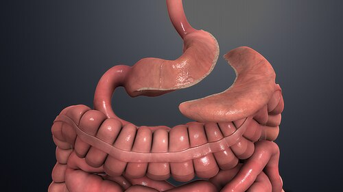
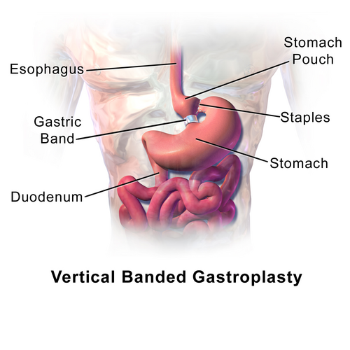

# CIRURGIAS RESTRITIVAS

Para entender as cirurgias restritivas, você precisa primeiro esquecer aquela ideia simplista de que o estômago é apenas um "saco" que estamos diminuindo. Se fosse só isso, o paciente voltaria a engordar assim que aprendesse a comer leite condensado o dia todo. O segredo que as bancas de residência cobram — e que muitos alunos erram — é que as cirurgias ditas "restritivas" possuem um componente neuroendócrino fundamental.

Quando falamos em técnica restritiva na cirurgia bariátrica moderna, o grande protagonista é a **Gastrectomia Vertical**, também conhecida como **Sleeve Gastrectomy**. Embora existam outras, como a Banda Gástrica Ajustável, o Sleeve é o que domina as provas e a prática clínica atual.

*Figura 1 - Gastrectomia vertical (Sleeve): a maior parte do estômago ao longo da grande curvatura é removida cirurgicamente, resultando em formato tubular. Fonte: Manu5/Scientific Animations, CC BY-SA 4.0 | Wikimedia Commons*

## Fisiopatologia da Restrição e o Componente Hormonal

Por que um paciente perde peso com uma cirurgia restritiva? A resposta óbvia é: o estômago ficou menor (restrição mecânica). Mas a resposta que te faz passar na prova é: porque alteramos o eixo fome-saciedade.

O estômago humano tem uma capacidade média de 1,5 a 2 litros. Nas técnicas restritivas, reduzimos esse volume para cerca de 80 a 100 ml. Isso gera uma saciedade precoce por distensão da parede gástrica. No entanto, o "pulo do gato" está na ressecção do **fundo gástrico**.

### O Papel da Grelina

A grelina é conhecida como o "hormônio da fome". Ela é produzida majoritariamente nas células oxínticas do fundo gástrico (fórnice gástrico). Em um estado fisiológico normal, os níveis de grelina sobem antes das refeições e caem após a alimentação.

Na Gastrectomia Vertical, ao removermos o fundo gástrico, os níveis circulantes de grelina despencam drasticamente.
**Dica do Dr. Will:** As bancas adoram perguntar qual o efeito dessa redução. O resultado é um potente efeito anorexígeno (perda de apetite) e uma ação direta no sistema límbico, diminuindo a "recompensa" associada à comida. Portanto, o Sleeve não é "puramente" restritivo; ele é restritivo e metabólico/hormonal.

### Hormônios da Saciedade (Incretinas)

Embora o Sleeve não faça um desvio intestinal (bypass), a passagem rápida do alimento para o duodeno e jejuno inicial também promove um aumento precoce de hormônios como o **GLP-1** e o **PYY**, que sinalizam saciedade ao hipotálamo. Guarde isso: o Sleeve aumenta a saciedade e diminui a fome.

## Gastrectomia Vertical (Sleeve Gastrectomy)

Esta é a técnica restritiva mais realizada no Brasil e no mundo. Ela consiste na ressecção da grande curvatura gástrica, transformando o estômago em um tubo estreito (em formato de "manga" de camisa, por isso o nome *Sleeve*).

### Técnica Cirúrgica e Anatomia

A cirurgia começa com a liberação da grande curvatura gástrica, separando-a do omento e do baço. O cirurgião então insere uma sonda de calibração (chamada de **bougie**) pela boca do paciente até o duodeno. Essa sonda serve como um molde para garantir que o novo estômago não fique nem muito largo, nem muito estreito.

A grampeação começa a cerca de 2 a 6 cm do piloro e segue verticalmente até o **Ângulo de His** (a junção esofagogástrica).
**Cuidado:** Um erro clássico de prova é dizer que o Sleeve retira o piloro. Mentira! O piloro é preservado, o que mantém o esvaziamento gástrico fisiológico e evita a Síndrome de Dumping (que é muito comum no Bypass).

### Indicações e Contraindicações

As indicações seguem os critérios gerais da cirurgia bariátrica (IMC > 40 ou > 35 com comorbidades). Mas quando preferir o Sleeve ao Bypass? O Sleeve é excelente para pacientes com anemias graves, doença inflamatória intestinal ou que precisam de acesso endoscópico fácil às vias biliares no futuro.

No entanto, preste muita atenção nas **contraindicações relativas**, pois elas caem muito:

- **Doença do Refluxo Gastroesofágico (DRGE) grave ou Esofagite Erosiva (Graus C e D de Los Angeles):** O Sleeve aumenta a pressão intragástrica e pode piorar muito o refluxo.

- **Esôfago de Barrett:** Pelo mesmo motivo do risco de refluxo e potencial carcinogênico.

**Exemplo Clínico:** Paciente de 45 anos, IMC 38, com queixa de pirose noturna importante e endoscopia revelando esofagite grau C. Qual a melhor técnica? Se você marcar Sleeve, errou. Para este paciente, o padrão-ouro é o Bypass Gástrico em Y de Roux, que é uma cirurgia antirrefluxo por excelência. O Sleeve, neste caso, seria "jogar gasolina no fogo".

| Característica | Gastrectomia Vertical (Sleeve) | Bypass Gástrico (Y de Roux) |
| --- | --- | --- |
| Mecanismo Principal | Restritivo + Hormonal (↓ Grelina) | Restritivo + Disabsortivo (mínimo) + Hormonal |
| Piloro | Preservado | Excluído do trânsito alimentar |
| Risco de Dumping | Muito baixo | Elevado |
| Efeito no Refluxo | Pode piorar (↑ pressão) | Melhora (padrão-ouro) |
| Acesso ao Duodeno | Mantido (EDA normal) | Impossibilitado por via alta |

## Complicações da Gastrectomia Vertical

Como professor, já vi muitos alunos negligenciarem as complicações específicas do Sleeve. Não cometa esse erro.

### Fístulas: O Pesadelo do Cirurgião

A complicação aguda mais temida é a fístula da linha de grampeamento.
**Pérola de Prova:** O local mais comum de ocorrência de fístulas no Sleeve é o **Ângulo de His** (perto da transição esofagogástrica).
Por que lá? Porque é uma zona de alta pressão, onde a parede gástrica é mais fina e a vascularização é mais delicada. Se o paciente apresentar taquicardia, febre ou dor abdominal súbita no pós-operatório imediato, pense em fístula até que se prove o contrário.

### Refluxo e Estenose

Como transformamos o estômago em um tubo de alta pressão, o refluxo *de novo* (que surge após a cirurgia) ocorre em cerca de 20-30% dos pacientes. Além disso, se o cirurgião usar um bougie muito fino ou "apertar" demais o grampeamento na região da incisura angularis, pode ocorrer uma estenose, levando a vômitos persistentes.

### Deficiências Nutricionais

Muitos acham que, por não haver desvio intestinal, não há desnutrição. Cuidado!
Ao removermos o fundo e o corpo gástrico, reduzimos drasticamente a produção de **Fator Intrínseco** pelas células parietais.
Sem fator intrínseco, não há absorção de Vitamina B12 no íleo terminal.
**Resultado:** Anemia Megaloblástica e alterações neurológicas. O acompanhamento pós-bariátrica deve ser vitalício, independentemente da técnica.

*Figura 2 - Gastroplastia vertical com banda: técnica restritiva histórica que cria uma pequena bolsa gástrica com banda de reforço. Fonte: BruceBlaus/Blausen Medical, CC BY 3.0 | Wikimedia Commons*

## Outras Técnicas Restritivas

### Banda Gástrica Ajustável

Hoje em dia é pouco realizada, mas ainda aparece em provas para testar se você conhece os mecanismos. É uma técnica **puramente restritiva**. Um anel de silicone é colocado ao redor da parte superior do estômago, criando uma pequena bolsa gástrica.
Não há cortes no estômago, não há grampeação e não há alteração hormonal (a grelina não cai). A perda de peso é menor e a taxa de reoperação por complicações do anel (deslizamento, erosão) é alta.

### Balão Intragástrico

Não é tecnicamente uma "cirurgia", mas um procedimento endoscópico restritivo temporário. Ocupa espaço no estômago para gerar saciedade. É usado principalmente como "ponte" para pacientes com superobesidade (IMC > 60) que precisam perder algum peso antes da cirurgia definitiva para reduzir o risco anestésico.

## Manejo da Via Aérea no Paciente Obeso

Este é um tema transversal que as bancas de cirurgia amam misturar com bariátrica. O paciente obeso é, por definição, uma potencial **via aérea difícil**.

Ao realizar a intubação orotraqueal nesses pacientes, frequentemente utilizamos a escala de **Cormack-Lehane** para descrever a visualização da glote durante a laringoscopia. Se a visualização for difícil (Graus 3 ou 4), o uso do **Bougie** (guia elástico) é mandatório.

**Como usar o Bougie corretamente (Cai na Prova!):**

- Realize a laringoscopia.

- Insira o bougie sob visão direta (ou às cegas se Cormack 3/4) sentindo os cliques traqueais.

- Mantenha a laringoscopia enquanto o auxiliar desliza o tubo traqueal sobre o bougie.

- Nunca retire o laringoscópio antes do tubo passar pelas cordas vocais, pois a língua do paciente obeso pode colapsar e impedir a progressão do tubo.

## Aspectos Metodológicos em Estudos de Bariátrica

Nas questões de cirurgia, às vezes aparecem conceitos de epidemiologia clínica aplicados ao tema. Um termo muito comum é o **Viés de Atrito** (ou perda seletiva de seguimento).
Em estudos de longa duração sobre perda de peso, é comum que pacientes que não perderam peso ou que tiveram complicações abandonem o estudo. Se o pesquisador ignorar esses pacientes, os resultados parecerão muito melhores do que a realidade. Isso compromete a **validade interna** do estudo.

## Diagnóstico Diferencial de Dor Pós-Operatória

Imagine um paciente que operou Sleeve há 6 meses e chega ao pronto-socorro com dor retroesternal e queimação, especialmente à noite.
O que você deve investigar primeiro?
A principal hipótese é a **Doença do Refluxo Gastroesofágico (DRGE)** induzida ou piorada pela cirurgia. O exame inicial de escolha é a **Endoscopia Digestiva Alta (EDA)**. Ela serve para avaliar a presença de esofagite, hérnia de hiato ou até mesmo uma estenose do tubo gástrico que esteja represando o conteúdo.

Diferente do Bypass, no Sleeve **não ocorre a Hérnia de Petersen** (uma hérnia interna que acontece pelo espaço criado no mesentério). Se a questão falar em "hérnia interna" ou "sinal do redemoinho na TC" em um paciente bariátrico, ela quase certamente está falando de um Bypass, não de um Sleeve.

| Complicação | Momento | Sintoma Principal | Diagnóstico |
| --- | --- | --- | --- |
| Fístula (Ângulo de His) | Agudo (1-7 dias) | Taquicardia, Febre | TC com contraste / Reoperação |
| Estenose (Incisura) | Subagudo | Vômitos pós-prandiais | EDA / Contrastado |
| DRGE / Esofagite | Crônico | Pirose, Dor retroesternal | EDA |
| Anemia Megaloblástica | Crônico | Fadiga, Parestesia | Dosagem de B12 e Hemograma |

## Cirurgia Metabólica vs. Cirurgia Bariátrica

Embora o tema central seja restrição, você precisa saber a diferença de nomenclatura da MedEvo:

- **Cirurgia Bariátrica:** Foco principal na perda de peso para tratar a obesidade mórbida.

- **Cirurgia Metabólica:** Foco no controle de doenças como o Diabetes Mellitus tipo 2 (DM2).

Segundo a Diretriz Brasileira, a cirurgia metabólica pode ser indicada para pacientes com DM2 não controlado e **IMC entre 30 e 34,9**, desde que o diabetes tenha menos de 10 anos de evolução e o paciente tenha entre 30 e 70 anos. Nesses casos, o Bypass costuma ser preferido ao Sleeve devido ao maior estímulo de incretinas (GLP-1), mas o Sleeve também é uma opção válida.

## Resumo da Fisiologia do Apetite

Para não esquecer mais:

- **Grelina:** Hormônio da FOME. Produzido no fundo gástrico. Diminui no Sleeve.

- **Leptina:** Hormônio da SACIEDADE (longo prazo). Produzido no tecido adiposo. Pacientes obesos têm resistência à leptina.

- **GLP-1 e PYY:** Hormônios da SACIEDADE (curto prazo). Produzidos no íleo distal. Aumentam após cirurgias bariátricas (mesmo no Sleeve, pela chegada rápida do quimo ao intestino).

A Gastrectomia Vertical atua no binômio: **Menos Fome (↓ Grelina) + Mais Saciedade (Restrição mecânica + ↑ GLP-1).**

## Pontos-Chave para Prova 🎯

- **Gastrectomia Vertical (Sleeve):** Técnica predominantemente restritiva que remove cerca de 80% do estômago (grande curvatura).

- **Mecanismo Hormonal:** A remoção do fundo gástrico reduz a produção de **Grelina**, gerando efeito anorexígeno.

- **Contraindicação Relativa:** DRGE grave e Esofagite de Barrett são as principais contraindicações para o Sleeve.

- **Complicação Aguda:** A fístula no **Ângulo de His** é a mais temida; suspeite em caso de taquicardia inexplicada no pós-op.

- **Complicação Crônica:** Deficiência de **Vitamina B12** (anemia megaloblástica) por redução do fator intrínseco.

- **Vantagem do Sleeve:** Preserva o piloro e o acesso endoscópico ao duodeno; não causa hérnia de Petersen.

- **Banda Gástrica:** Técnica puramente restritiva, sem cortes ou alterações hormonais; em desuso.

- **Cirurgia de Scopinaro:** É uma derivação biliopancreática (disabsortiva), não confunda com técnicas restritivas.

- **Bougie:** Sonda de calibração usada no Sleeve (cirurgia) e guia para intubação difícil (anestesia).

- **Dumping:** Muito raro no Sleeve, pois o piloro está presente. Se a questão fala em Dumping, pense em Bypass.

- **IMC para Cirurgia:** > 40 kg/m² ou > 35 kg/m² com comorbidades (Diretriz CFM).

- **Grelina e Sistema Límbico:** A redução da grelina age no cérebro diminuindo o aspecto prazeroso/recompensa da alimentação.

- **Esofagite Pós-Sleeve:** Deve ser sempre investigada com EDA; pode exigir conversão para Bypass em casos graves.

- **Hormônios da Saciedade:** GLP-1 e PYY aumentam após o Sleeve, contribuindo para a perda de peso.

- **Ângulo de His:** Localizado na transição esofagogástrica; ponto crítico para fístulas e refluxo.

- **Anemia Megaloblástica:** Caracterizada por VCM elevado; ocorre pela falta de B12, comum após ressecção gástrica extensa.

- **Via Aérea no Obeso:** Sempre considerar via aérea difícil; escala de Cormack-Lehane avalia a visualização glótica.

- **Viés de Atrito:** Comum em estudos de obesidade quando muitos pacientes abandonam o seguimento a longo prazo.

 Cópia offline para consulta pessoal.
 Fonte original:
 [https://www.medevo.com.br/material-apoio/ler/43cbae6f-e673-45c6-bdd0-dce3310b1f9d](https://www.medevo.com.br/material-apoio/ler/43cbae6f-e673-45c6-bdd0-dce3310b1f9d)
