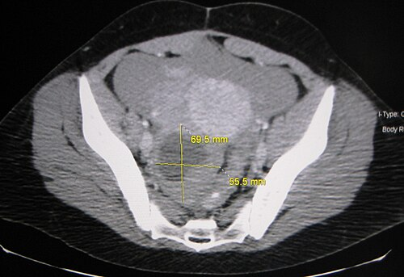
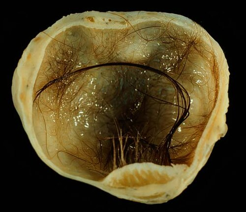

# CISTOS OVARIANOS

Para entender cistos ovarianos, você precisa primeiro esquecer a ideia de que "cisto é igual a cirurgia". Na verdade, se você operar todo cisto que encontrar, vai acabar cometendo iatrogenias e prejudicando a reserva ovariana de muitas pacientes. O segredo aqui, e o que as bancas de residência mais cobram, é saber diferenciar o que é fisiológico do que é patológico, e o que é benigno do que tem "cara" de maldade.

## Fisiologia e Formação: Por que os cistos aparecem?

O ovário é um órgão dinâmico. Todo mês, na mulher em idade fértil, ele cria cistos. O folículo dominante, antes de romper na ovulação, é tecnicamente um cisto. Por definição, chamamos de cisto ovariano qualquer coleção líquida acima de 3 cm. Abaixo disso, em mulheres no menacme, consideramos apenas folículos.

Os cistos funcionais são os mais comuns e ocorrem por um "erro" no processo fisiológico. O cisto folicular surge quando o folículo não rompe ou não regride. Ele é preenchido por líquido seroso e revestido por células da granulosa. Já o cisto de corpo lúteo ocorre após a ovulação, quando o corpo lúteo não regride e se torna maior que 3 cm, podendo acumular sangue no seu interior (corpo lúteo hemorrágico).

Por que isso cai em prova? Porque o examinador quer saber se você sabe que esses cistos são transitórios. Se você encontrar um cisto simples, anecoico, de 4 cm em uma jovem, a conduta não é operar, mas sim repetir o exame em 8 a 12 semanas. Na maioria das vezes, ele terá sumido.

*Figura 1 - TC abdominal evidenciando cisto ovariano hemorrágico volumoso, com sangue visível na porção anterior da lesão. Fonte: James Heilman, MD, CC BY-SA 3.0 | Wikimedia Commons*

## Classificação das Massas Anexiais

Dividimos as massas anexiais em dois grandes grupos para facilitar o raciocínio clínico: as não neoplásicas (funcionais ou inflamatórias) e as neoplásicas (benignas ou malignas).

### Cistos Funcionais

- Cisto Folicular: O mais comum. Geralmente assintomático e regride sozinho.

- Cisto de Corpo Lúteo: Pode causar dor pélvica e atraso menstrual. Se romper, pode causar hemoperitônio (quadro de abdome agudo).

- Cisto Teca-luteínico: Geralmente bilateral e multiloculado. Está associado a níveis altíssimos de Beta-HCG, como na gravidez molar ou em tratamentos de indução da ovulação. Aqui vai uma dica do MedEvo: a conduta no cisto teca-luteínico da mola hidatiforme é tratar a mola. O cisto regride sozinho conforme o HCG cai. Nunca comece operando o ovário nesses casos.

### Neoplasias Benignas

- Teratoma Cístico Maduro (Cisto Dermoide): O tumor ovariano mais comum em jovens. Contém tecidos das três camadas germinativas (cabelo, dente, sebo). Na imagem, ele tem um aspecto clássico de "massa complexa com áreas hiperecogênicas e sombra acústica".

- Endometrioma: O famoso "cisto de chocolate". É o resultado da endometriose no ovário. No ultrassom, ele tem um aspecto de "vidro fosco" (ecos internos finos e homogêneos).

- Cistoadenomas: Podem ser serosos (mais comuns, geralmente uniloculares) ou mucinosos (podem se tornar gigantes, ocupando todo o abdome).

## O Arsenal Diagnóstico: A Ultrassonografia como Padrão-Ouro

Se a prova te perguntar qual o melhor exame inicial para massa anexial, a resposta é sempre Ultrassonografia Transvaginal (USTV) com Doppler. Não é Tomografia, não é Ressonância. A USTV nos dá os detalhes da morfologia que precisamos para aplicar os critérios de malignidade.

### Critérios IOTA (International Ovarian Tumor Analysis)

O grupo IOTA criou as "Simple Rules" (Regras Simples) para classificar o risco de malignidade. Isso despenca em prova.

**Características Benignas (B-rules):**

- B1: Cisto unilocular simples.

- B2: Presença de componentes sólidos com diâmetro < 7 mm.

- B3: Presença de sombra acústica posterior (típico de dermoide).

- B4: Cisto multilocular de paredes lisas com diâmetro < 100 mm.

- B5: Ausência de fluxo ao Doppler (Escore de cor 1).

**Características Malignas (M-rules):**

- M1: Tumor sólido irregular.

- M2: Presença de ascite.

- M3: Pelo menos quatro estruturas papilares.

- M4: Tumor multilocular sólido irregular com diâmetro > 100 mm.

- M5: Fluxo vascular intenso ao Doppler (Escore de cor 4).

### O-RADS (Ovarian-Adnexal Reporting and Data System)

Atualmente, a FEBRASGO recomenda o uso do sistema O-RADS para padronizar os laudos. Ele funciona de forma semelhante ao BI-RADS da mama:

- O-RADS 1: Ovário normal (folículos).

- O-RADS 2: Lesão quase certamente benigna (risco < 1%). Ex: cisto simples < 10 cm.

- O-RADS 3: Baixo risco (1-10%).

- O-RADS 4: Risco intermediário (10-50%).

- O-RADS 5: Alto risco (> 50%).

## Marcadores Tumorais: Quando pedir e como interpretar

Cuidado aqui: marcadores tumorais não servem para rastreamento na população geral. Eles servem para auxiliar no diagnóstico de uma massa já encontrada e para seguimento pós-tratamento.

- **CA-125:** É o marcador clássico do câncer epitelial de ovário. Porém, ele é muito inespecífico em mulheres jovens. Qualquer coisa que irrite o peritônio aumenta o CA-125: endometriose, DIP, mioma, gravidez e até menstruação. Por isso, ele tem muito mais valor na pós-menopausa.

- **CEA e CA 19.9:** Sugerem tumores mucinosos ou origem gastrointestinal (metástases, como o tumor de Krukenberg).

- **Marcadores de Células Germinativas:** Essenciais em crianças e adolescentes com massas anexiais.

- Beta-HCG: Coriocarcinoma.

- Alfa-fetoproteína (AFP): Tumor do seio endodérmico.

- LDH: Disgerminoma.

Imagine uma paciente de 15 anos com uma massa sólida de 10 cm. O que você pede? O Dr. Will sempre lembra: em jovens com massa sólida, o pensamento deve ser tumor de células germinativas. Peça o painel completo (HCG, AFP, LDH, CA-125).

*Figura 2 - Peça cirúrgica de teratoma cístico maduro (cisto dermoide) do ovário com 4 cm, mostrando pelos e tecidos cutâneos — achado incidental em cesariana. Fonte: Ed Uthman, MD, Domínio Público | Wikimedia Commons*

## Diagnóstico Diferencial: Nem tudo que está no anexo é ovário

Este é um ponto onde muitos alunos erram. O examinador coloca uma dor pélvica e uma imagem anexial, e você marca "cisto de ovário". Mas olhe bem os detalhes:

- **Cisto Paratubário / Parauterino:** Localiza-se entre o útero e o ovário, mas é separado do parênquima ovariano. Geralmente são remanescentes do ducto de Wolff.

- **Hidrossalpinge:** A tuba uterina dilatada com líquido. Tem um aspecto de "salsicha" ou "retorta" na imagem, com septos incompletos.

- **Abscesso Tubo-ovariano:** Paciente com dor, febre e sinais de infecção (DIP). A massa é complexa e heterogênea.

- **Bartholinite:** Embora seja uma patologia da vulva, em provas de "massas pélvicas/vaginais", pode aparecer como diagnóstico diferencial de abaulamentos na região inferior. Lembre-se: glândula de Bartholin fica no terço inferior do introito vaginal, às 4h ou 8h.

- **Leiomioma Pediculado:** Pode simular uma massa sólida ovariana. A Ressonância Magnética ajuda muito a diferenciar a origem da lesão nesses casos duvidosos.

## O Fantasma da Malignidade: Quando suspeitar?

A regra de ouro para a prova: **Mulher na pós-menopausa com massa anexial é câncer até que se prove o contrário.**

Claro que existem cistos simples na pós-menopausa que podem ser acompanhados (especialmente se < 5 cm e CA-125 normal), mas qualquer complexidade (septos espessos, vegetações, componente sólido, ascite) nessa faixa etária exige investigação cirúrgica, preferencialmente com um oncoginecologista.

**Sinais de Alerta (Red Flags):**

- Componente sólido (especialmente se irregular).

- Vegetações ou projeções papilares (especialmente se > 3 mm).

- Septos espessos (> 2-3 mm).

- Ascite (líquido livre além do fundo de saco de Douglas).

- Baixa resistência ao Doppler (neovascularização tem pouco músculo liso, logo, o sangue flui fácil).

## Emergências Ginecológicas: Torção e Ruptura

### Torção Ovariana

É uma das emergências mais dramáticas. Geralmente ocorre em ovários com cistos > 5 cm (o peso do cisto favorece a rotação do pedículo).

- Quadro clínico: Dor súbita, intensa, unilateral, frequentemente associada a náuseas e vômitos.

- Diagnóstico: Clínico + USTV com Doppler. O achado clássico é o "sinal do redemoinho" e a ausência de fluxo ao Doppler (embora a presença de fluxo não exclua torção parcial).

- Tratamento: Laparoscopia de urgência. Hoje a tendência é a destorção e preservação do ovário, mesmo que ele pareça "roxo" (isquêmico), pois a recuperação funcional é surpreendente.

### Ruptura de Cisto e Hemoperitônio

Comum no cisto de corpo lúteo hemorrágico.

- Quadro clínico: Dor súbita após relação sexual ou esforço físico.

- Se houver muito sangramento, a paciente apresenta sinais de choque hipovolêmico e irritação peritoneal.

- Conduta: Se estável, observação e analgesia. Se instável ou com queda importante de hemoglobina, cirurgia (geralmente ooforoplastia para parar o sangramento).

## Manejo Clínico e Cirúrgico: O que fazer com cada cisto?

A decisão terapêutica baseia-se em três pilares: idade da paciente, sintomas e características ultrassonográficas.

### Tabela 1: Conduta conforme características do cisto (Menacme)

| Tipo de Cisto | Características USG | Conduta Inicial |
| --- | --- | --- |
| Cisto Simples < 5 cm | Anecoico, parede fina | Expectante (não precisa repetir USG) |
| Cisto Simples 5-10 cm | Anecoico, parede fina | Repetir USG em 8-12 semanas |
| Cisto Hemorrágico | Aspecto reticular ("teia de aranha") | Repetir USG em 6-12 semanas (fase folicular) |
| Endometrioma | Vidro fosco, ecos finos | Clínico (ACO/Dienogeste) ou Cirúrgico se > 6cm/dor |
| Teratoma Maduro | Gordura, calcificação, sombra | Cirúrgico (Cistectomia) pelo risco de torção |
| Suspeita Malignidade | Sólido, papilas, ascite | Cirúrgico (Laparotomia + Congelação) |

### Por que preferir a Cistectomia (Ooforoplastia) à Ooforectomia?

Em mulheres jovens e nulíparas, o objetivo é sempre a preservação da fertilidade. Retirar o ovário inteiro por um teratoma benigno é um erro técnico. Devemos realizar a exérese apenas da cápsula do cisto, preservando o tecido ovariano sadio.

## Situações Especiais

### Massa Anexial na Gestação

A maioria são cistos de corpo lúteo que regridem após o primeiro trimestre (quando a placenta assume a produção de progesterona).

- Se for um cisto simples e assintomático: Conduta expectante.

- Se houver suspeita de malignidade ou risco iminente de torção (> 8-10 cm): A cirurgia é preferencialmente realizada no segundo trimestre (14-22 semanas), período de maior estabilidade fetal.

### Massas Pélvicas em Crianças e Adolescentes

Aqui o diagnóstico diferencial se amplia. Além dos tumores de células germinativas, devemos lembrar de causas obstrutivas:

- **Hímen Imperfurado:** A menina tem dor cíclica, mas não menstrua. O sangue acumula na vagina (hematocolpo) e pode simular uma massa pélvica.

- **Tumores de Células Germinativas:** O teratoma imaturo é a versão maligna do dermoide, caracterizado por tecido neuroepitelial imaturo.

### Distratores de Prova: Nódulos Hepáticos e Síndromes Raras

Algumas questões de ginecologia trazem achados incidentais para testar seu conhecimento geral.

- **Hiperplasia Nodular Focal (HNF):** Massa hepática com "cicatriz estrelada central" em mulher jovem. Conduta: Observação. Não tem relação com ACO.

- **Adenoma Hepático:** Este sim tem relação com ACO. Se > 5 cm, risco de ruptura e malignização. Conduta: Suspender ACO e considerar cirurgia.

- **Síndrome PHACE:** É uma associação de malformações (Fossa posterior, Hemangioma, Anomalias arteriais, Cardíacas e Olho). Pode aparecer em questões de pediatria/dermatologia, mas raramente é o foco principal em cistos ovarianos.

## Pontos-Chave para Prova 🎯

- **Cisto Simples no Menacme:** Se < 5 cm, é funcional. Não precisa de seguimento se for claramente benigno. Se entre 5-10 cm, repetir USG em 8-12 semanas.

- **Cisto Simples na Pós-menopausa:** Se < 3 cm (ou até 5 cm em algumas diretrizes), assintomático e CA-125 normal, pode-se considerar conduta expectante com USG seriada.

- **Marcador CA-125:** Valor de referência normal é até 35 U/mL. Na pós-menopausa, qualquer elevação é suspeita. Na pré-menopausa, só valorizamos se for muito alto (> 200 U/mL) devido aos muitos falsos-positivos.

- **Teratoma Maduro (Dermoide):** Tumor benigno mais comum em jovens. Risco principal é a torção ovariana. Tratamento é cistectomia.

- **Endometrioma:** Aspecto de "vidro fosco". CA-125 costuma estar levemente aumentado (60-100 U/mL).

- **Critérios de Malignidade (IOTA):** Ascite, componente sólido irregular, > 4 papilas, multilocular sólido > 10 cm, Doppler com fluxo intenso (Escore 4).

- **Torção Ovariana:** Emergência cirúrgica. Dor súbita + náuseas + massa anexial. O Doppler pode estar normal (não exclui!).

- **Cisto Teca-luteínico:** Associado a níveis altos de HCG (Mola, Gemelar). Conduta é conservadora em relação ao ovário.

- **Tumores de Células Germinativas:** Pensar em adolescentes com massas sólidas. Marcadores: LDH, AFP, Beta-HCG.

- **O que NÃO fazer:** Não puncionar cisto suspeito de malignidade (risco de disseminação de células neoplásicas pelo trajeto da agulha - *spillage*).

- **Cirurgia de Escolha:** Laparoscopia é preferencial para massas benignas. Laparotomia é indicada se houver forte suspeita de câncer para evitar ruptura da cápsula.

- **Pérola do Dr. Will:** Se a questão mostrar uma massa anexial complexa + ascite + CA-125 alto em uma idosa, o diagnóstico é Cistoadenocarcinoma Seroso de Ovário até que se prove o contrário.

Lembre-se: a prova quer que você seja um médico seguro. Saber quando observar é tão importante quanto saber quando operar. O manejo conservador dos cistos funcionais evita cirurgias desnecessárias e preserva o futuro reprodutivo da sua paciente.

 Cópia offline para consulta pessoal.
 Fonte original:
 [https://www.medevo.com.br/material-apoio/ler/faaa2c72-e310-4ab3-9877-3b49819cca37](https://www.medevo.com.br/material-apoio/ler/faaa2c72-e310-4ab3-9877-3b49819cca37)
