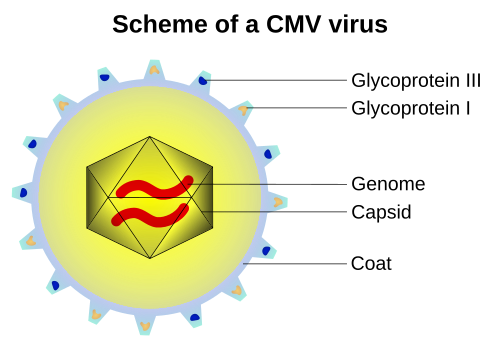
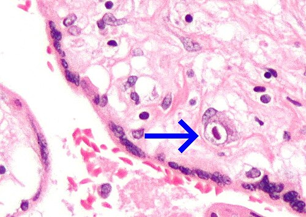

# CITOMEGALOVÍRUS CONGÊNITO

O Citomegalovírus (CMV) é, sem dúvida, o "rei" das infecções congênitas, embora muitas vezes seja negligenciado no pré-natal básico. Se você quer dominar as provas de residência, precisa entender que o CMV é a principal causa de surdez neurossensorial não hereditária e de retardo mental de origem infecciosa na infância.

Diferente da Sífilis, que é um evento sentinela de falha na assistência, o CMV muitas vezes ocorre apesar de um pré-natal bem feito, porque não fazemos o rastreamento sorológico universal no Brasil, conforme as diretrizes do Ministério da Saúde e da FEBRASGO.

## O Cenário Epidemiológico e o "Fator Creche"

Para entender o CMV, você precisa visualizar a paciente típica de prova: uma gestante que já tem um filho pequeno em casa ou que trabalha em creches. O reservatório do vírus são as crianças pequenas. Elas excretam o CMV na urina e na saliva por meses após uma infecção muitas vezes assintomática.

A prevalência da infecção congênita varia de 0,2% a 2% de todos os nascimentos vivos. No Brasil, como temos uma alta taxa de soropositividade na população adulta (muitas mulheres já chegam grávidas com IgG positivo), as reinfecções ou reativações são comuns, mas a infecção primária na gestação é a que realmente tira o sono do obstetra e cai na prova.

*Figura 1 - Esquema estrutural do Citomegalovírus (CMV), mostrando o envelope viral, tegumento e capsídeo com DNA de fita dupla. Fonte: Emmanuel Boutet, CC BY-SA 2.5 | Wikimedia Commons*

## Fisiopatologia: Por que o CMV é tão agressivo?

O CMV é um DNA-vírus da família Herpesviridae. Sua principal característica é a latência. Uma vez infectado, o indivíduo carrega o vírus para sempre. Na gestação, temos dois cenários que você deve diferenciar para a prova:

- Infecção Primária: A gestante era soronegativa (IgG negativo) e adquire o vírus pela primeira vez na gravidez. Aqui o risco de transmissão vertical é alto, em torno de 30% a 40%.

- Infecção Não Primária (Secundária): A gestante já era IgG positivo e sofre uma reativação do vírus latente ou uma reinfecção por uma nova cepa. O risco de transmissão é muito menor, cerca de 1% a 3%, mas como a maioria das brasileiras já é IgG+, em números absolutos, muitos casos de CMV congênito vêm daqui.

O vírus atravessa a placenta e tem um tropismo especial pelo sistema nervoso central (SNC) em desenvolvimento e pelo sistema auditivo. Ele causa vasculite e destruição direta dos tecidos. No SNC, ele ataca preferencialmente a zona germinativa periventricular, o que explica por que as calcificações do CMV são tipicamente periventriculares.

## Diagnóstico Materno: A Armadilha do IgM

Aqui está o ponto onde a maioria dos alunos erra em questões de caso clínico. Muitos acreditam que IgM positivo é sinônimo de infecção aguda. No CMV, isso é uma mentira perigosa.

O IgM para CMV pode permanecer positivo por meses (até mais de um ano) após a infecção inicial. Além disso, ele pode positivar em casos de reativação ou por reação cruzada com outros vírus, como o Epstein-Barr. Portanto, nunca dê o diagnóstico de infecção aguda apenas com um IgM positivo.

### O Teste de Avidez do IgG

Este é o seu melhor amigo no primeiro trimestre. A avidez mede a "força" da ligação entre o anticorpo IgG e o antígeno.

- Baixa Avidez (< 30-35%): Sugere infecção recente (nos últimos 3 a 4 meses).

- Alta Avidez (> 60%): Garante que a infecção ocorreu há mais de 3 ou 4 meses.

Se a paciente está com 10 semanas de gestação e apresenta alta avidez, você pode tranquilizá-la: a infecção ocorreu ANTES da concepção. Como dizemos no MedEvo, o teste de avidez só tem valor se realizado precocemente, idealmente até a 16ª semana de gestação. Após isso, a avidez naturalmente aumenta e perde o poder de datar a infecção para o período pré-concepcional.

| Situação Sorológica | Interpretação | Conduta |
| --- | --- | --- |
| IgG (-) e IgM (-) | Suscetível | Orientar medidas de higiene |
| IgG (+) e IgM (-) | Infecção Remota | Rotina de pré-natal |
| IgG (-) e IgM (+) | Infecção Inicial ou Falso-positivo | Repetir em 2-3 semanas para ver soroconversão de IgG |
| IgG (+) e IgM (+) | Infecção Indeterminada | Solicitar Teste de Avidez (se < 16 semanas) |

## Diagnóstico Fetal: Quando e como investigar o feto?

Se você confirmou uma infecção primária materna ou se o ultrassom (USG) mostrou sinais suspeitos, precisamos saber se o vírus atravessou a placenta.

O padrão-ouro para o diagnóstico de infecção fetal é a Amniocentesis para realização de PCR (Reação em Cadeia da Polimerase) do DNA do CMV no líquido amniótico. Mas atenção ao "timing", que é uma pegadinha clássica de prova:

- A amniocentesis deve ser feita após a 21ª semana de gestação. Por quê? Porque antes disso o rim fetal (principal fonte de excreção do vírus para o líquido amniótico) não está maduro o suficiente.

- Deve haver um intervalo de pelo menos 6 a 8 semanas entre a infecção materna presumida e o procedimento. Se você colher antes, pode ter um falso-negativo porque o vírus ainda não teve tempo de ser excretado na urina fetal.

Lembre-se: PCR positivo no líquido amniótico confirma que o feto está infectado, mas NÃO diz se ele terá sequelas. Para avaliar o prognóstico, usamos o ultrassom e a ressonância magnética fetal.

## Achados Ultrassonográficos: O que procurar?

O USG é nossa janela para o prognóstico. Um feto com PCR positivo no líquido, mas com USG seriado normal, tem um prognóstico muito melhor (cerca de 90% de chance de ser assintomático ao nascer).

Os achados que as bancas amam cobrar são:

- Calcificações intracranianas periventriculares (Diferencie da Toxoplasmose, onde as calcificações são difusas/esparsas pelo parênquima).

- Microcefalia (Sinal de mau prognóstico neurológico).

- Ventriculomegalia.

- Restrição de Crescimento Intrauterino (RCIU).

- Intestino hiperecogênico.

- Hepatoesplenomegalia e ascite.

- Hidropisia fetal (em casos graves).

Cuidado: O USG tem baixa sensibilidade para detectar infecção fetal precocemente. Ele serve para monitorar o feto já sabidamente infectado.

## Manejo e Tratamento na Gestação

Historicamente, não tínhamos o que fazer além de observar ou oferecer a interrupção da gestação (onde legalmente permitido). No entanto, as diretrizes recentes da FEBRASGO e estudos internacionais mudaram o jogo.

O uso de Valaciclovir 2g, via oral, 4 vezes ao dia (dose total de 8g/dia) tem sido indicado em dois cenários:

- Prevenção Secundária: Quando a mãe tem infecção primária no primeiro trimestre ou período periconcepcional, o Valaciclovir pode reduzir a taxa de transmissão vertical de 30% para cerca de 11%.

- Tratamento Fetal: Em fetos infectados com sintomas leves a moderados no USG, o uso materno de altas doses de Valaciclovir pode melhorar o desfecho neonatal.

Muitos alunos confundem: "Professor, não é Ganciclovir?". Não na gestante! O Ganciclovir é altamente teratogênico em estudos animais e é reservado para o tratamento do recém-nascido. Na gestante, usamos Valaciclovir.

*Figura 2 - Micrografia de placentite por CMV mostrando vilosidades coriônicas inflamadas e célula com inclusão intranuclear típica em "olho de coruja". Fonte: Nephron, CC BY-SA 3.0 | Wikimedia Commons*

## O Recém-Nascido com CMV Congênito

Ao nascer, precisamos definir se o RN é sintomático ou assintomático. Apenas 10% dos infectados são sintomáticos ao nascimento, apresentando a clássica "doença de inclusão citomegálica": petéquias (purpura em "muffin de mirtilo"), icterícia colestática, hepatoesplenomegalia e microcefalia.

### Diagnóstico Neonatal

O diagnóstico definitivo no RN deve ser feito nas primeiras 3 semanas de vida.

- Exame de escolha: PCR na urina ou na saliva.

- Por que até 3 semanas? Porque após esse período, se o PCR vier positivo, não conseguimos distinguir se a infecção foi congênita (através da placenta) ou perinatal (pelo canal do parto ou pelo leite materno). A infecção perinatal no RN a termo geralmente não causa sequelas, ao contrário da congênita.

### Investigação Complementar do RN

Todo RN com suspeita ou confirmação de CMV deve passar por:

- Avaliação auditiva: PEATE (Potencial Evocado Auditivo do Tronco Encefálico). O teste da orelhinha simples não basta.

- Avaliação oftalmológica: Fundo de olho para buscar coriorretinite.

- Imagem de SNC: USG transfontanela ou Tomografia/Ressonância para ver as calcificações periventriculares.

- Laboratório: Hemograma (plaquetopenia é comum), transaminases e bilirrubinas.

## Tratamento Neonatal

O tratamento está indicado para RNs sintomáticos ou com evidência de acometimento de órgão-alvo (especialmente SNC e auditivo).

- Droga de escolha: Valganciclovir oral por 6 meses.

- Alternativa (se o RN não puder deglutir): Ganciclovir endovenoso.

O objetivo do tratamento não é "curar" o vírus (lembre-se da latência), mas sim reduzir a carga viral para prevenir a progressão da perda auditiva e melhorar o desenvolvimento neurocognitivo.

## Diagnóstico Diferencial: A Tríade de Sabin e outras TORCH

Na prova, o examinador vai colocar um RN com icterícia e hepatoesplenomegalia e você terá que decidir entre CMV, Toxoplasmose e Sífilis.

| Característica | Citomegalovírus (CMV) | Toxoplasmose | Sífilis Congênita |
| --- | --- | --- | --- |
| Calcificações | Periventriculares | Difusas / Esparsas | Raras |
| Crânio | Microcefalia | Hidrocefalia (Tríade de Sabin) | Normal |
| Olhos | Coriorretinite | Coriorretinite (Tríade de Sabin) | Coriorretinite / Ceratite |
| Outros achados | Surdez neurossensorial | Tríade de Sabin (3º item: calcificações) | Lesões cutâneo-mucosas, periostite |
| Marcador | PCR Urina/Saliva | Sorologia IgM/IgG | VDRL / Teste Treponêmico |

Dr. Will sempre lembra: Se a questão falar em "calcificações periventriculares", marque CMV sem medo. Se falar em "hidrocefalia e calcificações difusas", o diagnóstico é Toxoplasmose.

## Prevenção: O que orientar na consulta?

Como não há vacina e o rastreamento não é universal, a prevenção baseia-se em medidas de higiene. Isso cai muito em provas de Medicina Preventiva e Obstetrícia.

- Não compartilhar talheres, copos ou escovas de dente com crianças pequenas.

- Lavar as mãos rigorosamente após trocar fraldas ou limpar secreções (nariz, saliva) de crianças.

- Evitar beijar crianças pequenas "na boca" ou perto da boca.

Essas orientações devem ser dadas a TODAS as gestantes, independentemente de serem IgG positivo ou negativo, pois a reinfecção por novas cepas é possível.

## Situações Especiais e Pegadinhas

### Aleitamento Materno

Esta é uma "pérola" clássica. O CMV é excretado no leite materno.

- RN a termo: O aleitamento é LIVRE. Mesmo que a mãe tenha tido infecção primária na gestação, o benefício do leite supera o risco de uma infecção perinatal, que costuma ser benigna no bebê a termo.

- Prematuros extremos (< 1.500g ou < 32 semanas): Aqui há risco de uma síndrome "CMV-like" grave pelo leite. Nesses casos, o leite deve ser pasteurizado para inativar o vírus.

### Sífilis como Evento Sentinela

Embora o foco aqui seja CMV, as questões de infecção congênita frequentemente misturam os temas. Lembre-se que a Sífilis Congênita é considerada um "evento sentinela". Isso significa que sua ocorrência denuncia uma falha grave na rede de assistência pré-natal (falta de diagnóstico, tratamento inadequado da gestante ou do parceiro). A notificação é compulsória e imediata.

### Atresia de Esôfago

Uma pegadinha que apareceu em provas recentes: RN com sialorreia excessiva e desconforto respiratório logo após o nascimento. Isso não é CMV! É atresia de esôfago. O examinador coloca isso no meio de um caso de infecção congênita para te confundir. No CMV, o desconforto respiratório geralmente é por pneumonia viral ou por complicações da prematuridade/RCIU.

## Pontos-Chave para Prova 💡

- CMV é a principal causa de surdez neurossensorial não genética na infância.

- Calcificações intracranianas no CMV são tipicamente PERIVENTRICULARES.

- O risco de transmissão vertical é maior no terceiro trimestre, mas a gravidade das sequelas é muito maior no primeiro trimestre.

- IgM positivo isolado NÃO confirma infecção aguda; é obrigatório realizar o Teste de Avidez se a gestação tiver menos de 16 semanas.

- Teste de Avidez > 60% (Alta Avidez) no primeiro trimestre exclui infecção aguda na gestação.

- O diagnóstico fetal é feito por PCR do líquido amniótico colhido por amniocentesis após a 21ª semana.

- O diagnóstico neonatal deve ser feito até o 21º dia de vida (3 semanas) através de PCR na urina ou saliva.

- RN assintomático ao nascer: 10-15% desenvolverão sequelas tardias (principalmente surdez). Por isso, o acompanhamento auditivo rigoroso é mandatório.

- Valaciclovir (8g/dia) é a droga usada na gestante para reduzir a transmissão vertical (uso "off-label" validado por diretrizes).

- Valganciclovir oral por 6 meses é o tratamento de escolha para o RN sintomático.

- Aleitamento materno: Recomendado para RN a termo, mesmo com mãe CMV+. Pasteurizar se prematuro extremo.

- Diferencial: Toxoplasmose tem calcificações difusas e hidrocefalia (Tríade de Sabin).

- Medidas de higiene (lavar mãos após trocar fraldas) são a única forma eficaz de prevenção primária.

- O achado de "intestino hiperecogênico" no USG fetal deve sempre levantar a suspeita de CMV (além de Fibrose Cística e trissomias).

- LCR normal no neonato NÃO afasta o diagnóstico de CMV congênito nem garante ausência de sequelas futuras.

- A coriorretinite do CMV é indistinguível daquela causada pela Toxoplasmose no exame de fundo de olho; o diagnóstico depende de outros achados e sorologias.

 Cópia offline para consulta pessoal.
 Fonte original:
 [https://www.medevo.com.br/material-apoio/ler/6a875efa-184a-4f72-abe5-8e1fbbd10ea0](https://www.medevo.com.br/material-apoio/ler/6a875efa-184a-4f72-abe5-8e1fbbd10ea0)
