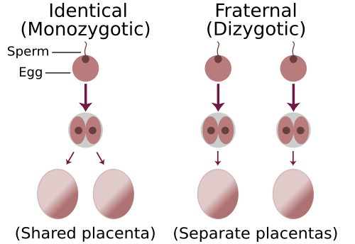
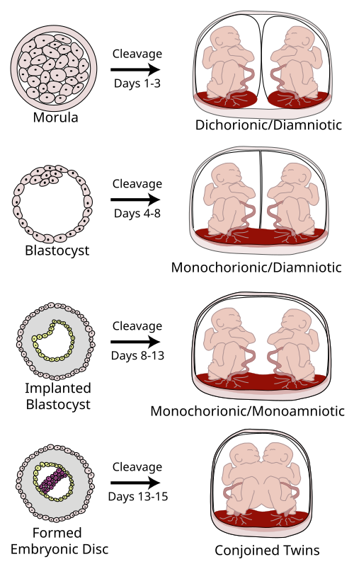

# CLASSIFICAÇÃO E DIAGNÓSTICO DE GEMELARES

Para entender gemelaridade, você precisa esquecer a ideia de que "gêmeos são todos iguais". Na obstetrícia de alto rendimento, o que define a vida da gestante e o seu sucesso na prova não é se os bebês são parecidos fisicamente, mas sim como eles dividem a "casa" e a "comida".

A primeira coisa que você deve fixar é a diferença entre zigoticidade e corionicidade. A zigoticidade é um conceito genético (quantos óvulos e espermatozoides?). A corionicidade é um conceito anatômico e placentário (quantas placentas?). Para o obstetra, a corionicidade é muito mais importante que a zigoticidade, pois é ela que dita o risco de complicações graves.

*Figura 1 - Diagrama comparando a formação de gêmeos monozigóticos (um óvulo, um espermatozoide) e dizigóticos (dois óvulos, dois espermatozoides). Fonte: Trlkly/ChristinaT3, CC BY-SA 3.0 | Wikimedia Commons*

## A Origem: Dizigóticos vs. Monozigóticos

Cerca de dois terços das gestações gemelares espontâneas são dizigóticas. Isso acontece quando a mulher ovula duas vezes no mesmo ciclo e ambos os óvulos são fecundados por espermatozoides diferentes.

Imagine dois irmãos que nasceram no mesmo dia. Eles têm cargas genéticas diferentes, podem ter sexos diferentes e, obrigatoriamente, cada um terá sua própria placenta e sua própria bolsa. Portanto, gêmeos dizigóticos são sempre dicoriônicos e diamnióticos (DCDA).

Já os monozigóticos (um terço dos casos) surgem de um único óvulo fecundado por um único espermatozoide. O zigoto, por algum motivo que a ciência ainda discute, decide se dividir. Aqui mora o perigo e o que as bancas mais cobram: o momento dessa divisão determina tudo.

*Figura 2 - Classificação da placentação gemelar: dicoriônica-diamniótica (DCDA), monocoriônica-diamniótica (MCDA) e monocoriônica-monoamniótica (MCMA), conforme o momento da divisão do zigoto. Fonte: Kevin Dufendach, CC BY 3.0 | Wikimedia Commons*

### A Cronologia da Divisão Monozigótica

Este é o tópico que mais gera questões de "decoreba" com lógica. Se a divisão demora a acontecer, os bebês passam a compartilhar mais estruturas.

- **Divisão entre 0 e 3 dias (estágio de mórula):** Ocorre antes da diferenciação do trofoblasto. O resultado é uma gestação Dicoriônica e Diamniótica (DCDA). Sim, gêmeos idênticos podem ter duas placentas se a divisão for muito precoce.

- **Divisão entre 4 e 8 dias (estágio de blastocisto):** O trofoblasto já se diferenciou, mas o âmnio não. Resultado: Monocoriônica e Diamniótica (MCDA). É o tipo mais comum entre os monozigóticos (cerca de 75%).

- **Divisão entre 8 e 13 dias:** O âmnio já se formou. Eles vão compartilhar a mesma placenta e a mesma bolsa. Resultado: Monocoriônica e Monoamniótica (MCMA). É raro e perigoso.

- **Divisão após 13 dias:** O disco embrionário já começou a se formar. A divisão é incompleta, resultando em gêmeos unidos (siameses).

**Tabela 1: Cronologia da Divisão em Gêmeos Monozigóticos**

| Momento da Divisão | Tipo de Placentação | Frequência (dos MZ) |
| --- | --- | --- |
| 0 a 3 dias | Dicoriônica Diamniótica (DCDA) | ~25 a 30% |
| 4 a 8 dias | Monocoriônica Diamniótica (MCDA) | ~70 a 75% |
| 8 a 13 dias | Monocoriônica Monoamniótica (MCMA) | ~1 a 2% |
| > 13 dias | Gêmeos Unidos (Siameses) | Muito raro |

**Dica de Prova:** A banca vai tentar te confundir dizendo que gêmeos de sexos diferentes podem ser monocoriônicos. Isso é impossível. Se o sexo é diferente, a gestação é obrigatoriamente dizigótica e, portanto, dicoriônica.

## Diagnóstico de Gemelaridade e Corionicidade

O diagnóstico clínico (útero maior que o esperado para a idade gestacional, palpação de múltiplas partes fetais ou ausculta de dois BCFs com ritmos diferentes) é muito impreciso. O padrão-ouro é a ultrassonografia (USG).

O melhor momento para definir a corionicidade é no primeiro trimestre, idealmente entre a 6ª e a 14ª semana. Conforme a gestação avança, as placentas podem se fundir visualmente, tornando o diagnóstico muito mais difícil. Como diz o Dr. Will em suas discussões de caso no MedEvo, "perder o timing da corionicidade no primeiro trimestre é começar o pré-natal no escuro".

### Sinais Ultrassonográficos Cruciais

Existem dois sinais que você deve tatuar na memória para a prova de residência:

- **Sinal do Lambda (ou Twin Peak Sign):** É uma projeção de tecido placentário que entra na base da membrana intergemelar. Ele indica que existem duas placentas (mesmo que estejam encostadas). É o marcador de gestação Dicoriônica.

- **Sinal do T (ou T Invertido):** A membrana intergemelar é fina e se insere abruptamente na placenta, sem projeção de tecido. Isso indica uma única placenta. É o marcador de gestação Monocoriônica.

Além disso, a espessura da membrana intergemelar ajuda: se for maior que 2 mm, reforça a dicorionicidade (são 4 camadas: 2 corios e 2 âmnios). Se for fina, reforça a monocorionicidade (apenas 2 camadas de âmnio).

**Tabela 2: Diferenciação Ultrassonográfica (1º Trimestre)**

| Característica | Dicoriônica (DCDA) | Monocoriônica (MCDA) |
| --- | --- | --- |
| Sinal Patognomônico | Sinal do Lambda (Y) | Sinal do T |
| Número de placentas | Duas (podem estar fundidas) | Uma |
| Espessura da membrana | Grossa (> 2 mm) | Fina (< 2 mm) |
| Risco de STFF | Zero | Elevado |

**Cuidado com a pegadinha:** O Sinal do Lambda pode desaparecer após a 14ª ou 15ª semana devido à compressão das membranas pelo crescimento uterino. Por isso, a USG precoce é mandatória.

## Complicações Específicas: O Porquê do Medo

Por que nos preocupamos tanto se a gestação é monocoriônica? Porque, em placentas únicas, existem anastomoses vasculares. Ou seja, os vasos sanguíneos dos dois bebês estão conectados.

### Síndrome de Transfusão Feto-Fetal (STFF)

Esta é a complicação clássica das gestações monocoriônicas (MCDA). Ocorre em cerca de 10 a 15% dessas gestações. O problema aqui é um desequilíbrio no fluxo sanguíneo através das anastomoses arteriovenosas profundas. Um feto (doador) "doa" sangue para o outro (receptor).

- **Feto Doador:** Fica hipovolêmico. Consequências: oligúria, oligodrâmnio (maior bolsão vertical < 2 cm) e restrição de crescimento (RCIU). Pode ficar "grudado" na parede uterina (stuck twin).

- **Feto Receptor:** Fica hipervolêmico. Consequências: poliúria, polidrâmnio (maior bolsão vertical > 8 cm), insuficiência cardíaca por sobrecarga e hidropisia.

O diagnóstico de STFF é feito pela USG através da discordância de líquido amniótico (sequência oligo-poli). Não se usa apenas o peso para diagnosticar STFF, embora a discordância de peso seja comum.

### Restrição de Crescimento Fetal Seletiva (RCIUs)

Diferente da STFF, na RCIU seletiva o problema não é necessariamente a transfusão de sangue, mas sim uma divisão desigual da massa placentária. Um feto fica com uma "fatia do bolo" muito menor que o outro.

- **Critério:** Discordância de peso estimada > 20 a 25%.

- **Diferencial:** Na RCIU seletiva pura, o líquido amniótico costuma estar normal em ambos os sacos, ou alterado apenas no feto restrito, sem o polidrâmnio compensatório no outro.

### Gêmeo Acárdico (Sequência TRAP)

É uma complicação bizarra e exclusiva de monocoriônicas. Um feto se desenvolve normalmente (feto bomba) e o outro é uma massa malformada sem coração funcional (feto acárdico). O feto bomba mantém a circulação do acárdico através de anastomoses arterio-arteriais superficiais, o que pode levar o feto bomba à insuficiência cardíaca.

### Gestações Monoamnióticas (MCMA)

Aqui o risco é mecânico. Como os dois bebês estão na mesma bolsa, os cordões umbilicais frequentemente se entrelaçam. O risco de óbito fetal súbito é altíssimo, o que justifica o acompanhamento intensivo e o parto prematuro eletivo (geralmente entre 32 e 34 semanas).

## Assistência Pré-Natal e Manejo

O pré-natal de gêmeos não é apenas "fazer tudo em dobro". Existem particularidades fisiológicas e riscos aumentados que exigem condutas específicas.

### Alterações Fisiológicas e Riscos Maternos

A massa placentária em uma gestação gemelar é muito maior. Isso significa níveis mais altos de hCG e progesterona.

- **Hiperêmese Gravídica:** Muito mais comum e severa.

- **Pré-eclâmpsia:** O risco é 2 a 3 vezes maior. Por isso, segundo a FEBRASGO, gestação gemelar é indicação de profilaxia com AAS (100 a 150 mg/dia) e Cálcio (se baixa ingestão), iniciados idealmente antes de 16 semanas.

- **Anemia:** Maior demanda de ferro e ácido fólico. A suplementação deve ser rigorosa.

### Seguimento Ultrassonográfico

A frequência dos exames depende da corionicidade:

- **Dicoriônicas:** USG a cada 4 semanas (foco em crescimento e colo uterino).

- **Monocoriônicas:** USG a cada 2 semanas, iniciando com 16 semanas, para rastreamento precoce de STFF (avaliando sempre o maior bolsão de líquido amniótico e a bexiga fetal).

### Datação da Gestação

Se houver discordância de tamanho no primeiro trimestre, a idade gestacional deve ser calculada pelo Comprimento Cabeça-Nádega (CCN) do **maior** feto. Isso evita que você subestime a idade gestacional caso um dos fetos já esteja sofrendo restrição precoce.

## O Momento e a Via de Parto

Este é um ponto de muita confusão. A via de parto em gemelar não é obrigatoriamente cesariana. A decisão depende da apresentação fetal e da idade gestacional.

### Quando interromper?

Se tudo estiver bem (gestação sem complicações):

- **Dicoriônicas:** Parto entre 37 e 38 semanas.

- **Monocoriônicas Diamnióticas:** Parto entre 36 e 37 semanas.

- **Monocoriônicas Monoamnióticas:** Parto entre 32 e 34 semanas (sempre cesariana).

### Qual a via de parto?

A regra de ouro para a prova:

- **Primeiro feto em Cefálica:** A via vaginal é permitida, independentemente da posição do segundo feto (que pode ser cefálico, pélvico ou transverso). Se o segundo não estiver cefálico, após o nascimento do primeiro, tenta-se a versão interna ou extração pélvica.

- **Primeiro feto NÃO Cefálica (Pélvico ou Transverso):** Cesariana obrigatória.

- **Gêmeos Unidos ou Monoamnióticos:** Cesariana obrigatória.

**Exemplo Clínico:** Paciente, 32 anos, G2P1, 36 semanas de gestação DCDA. Feto A em cefálica e Feto B em pélvica. Colo favorável. Conduta? Você pode oferecer o parto vaginal. A apresentação do segundo feto só importa se o primeiro não for cefálico.

## Aspectos Éticos e Reprodução Assistida

Com o aumento das técnicas de reprodução assistida, o número de gestações múltiplas cresceu. O Conselho Federal de Medicina (CFM) possui regras claras para evitar gestações de alto número de fetos (trigêmeos ou mais):

- Mulheres até 37 anos: máximo de 2 embriões.

- Mulheres acima de 37 anos: máximo de 3 embriões.

- Em caso de doação de óvulos ou embriões, vale a idade da doadora no momento da coleta.

- A redução embrionária (procedimento para eliminar um feto em gestações múltiplas) é **proibida** no Brasil, sendo considerada crime de aborto, exceto nas situações previstas em lei.

## Pontos-Chave para Prova

- **Corionicidade é o fator prognóstico mais importante.** Deve ser definida por USG entre 6 e 14 semanas.

- **Sinal do Lambda = Dicoriônica.** É o tecido placentário entre as membranas.

- **Sinal do T = Monocoriônica.** Membrana fina inserindo-se diretamente na placenta.

- **Gêmeos dizigóticos são SEMPRE dicoriônicos e diamnióticos.**

- **Divisão Monozigótica:** 0-3d (DCDA), 4-8d (MCDA), 8-13d (MCMA), >13d (Siameses). Memorize esses intervalos.

- **STFF é complicação de Monocoriônicas.** Diagnóstico: Polidrâmnio no receptor (MBV > 8cm) e Oligodrâmnio no doador (MBV < 2cm).

- **Via de Parto:** Se o primeiro feto (Feto A) estiver cefálico, pode ser vaginal. Se o primeiro for pélvico, cesariana.

- **Gestações Monoamnióticas:** Cesariana obrigatória entre 32-34 semanas pelo risco de entrelaçamento de cordão.

- **Idade Gestacional:** Em caso de dúvida no 1º trimestre, use o CCN do maior feto.

- **Profilaxia de Pré-eclâmpsia:** Obrigatória com AAS e Cálcio, pois gemelaridade é alto risco.

- **Apresentação mais comum:** Ambos os fetos em cefálica (cerca de 40-45% dos casos).

- **Gêmeo Evanescente:** Quando um saco gestacional deixa de evoluir precocemente. Não costuma prejudicar o sobrevivente se ocorrer no 1º trimestre.

- **Anastomoses Vasculares:** São a causa fisiopatológica das complicações exclusivas das monocoriônicas (STFF, TRAP).

- **RCIU Seletivo:** Discordância de peso > 20% sem os critérios de líquido da STFF.

- **Erro comum:** Achar que gêmeos de sexos diferentes podem ser monozigóticos. Não podem (salvo raríssimas anomalias cromossômicas não cobradas em prova).

- **Conduta na STFF grave:** Fotocoagulação a laser das anastomoses placentárias (procedimento padrão-ouro). 🩺

Este material foi estruturado para que você compreenda a lógica da placentação. Lembre-se: na prova, se a questão falar em "monocoriônica", seu cérebro deve ligar imediatamente o alerta para "anastomoses" e "STFF". Se falar em "primeiro feto pélvico", a resposta é "cesariana". Com essa base, você domina qualquer questão de gemelaridade.

 Cópia offline para consulta pessoal.
 Fonte original:
 [https://www.medevo.com.br/material-apoio/ler/797f5004-98a7-418b-8936-7fa012b183c3](https://www.medevo.com.br/material-apoio/ler/797f5004-98a7-418b-8936-7fa012b183c3)
