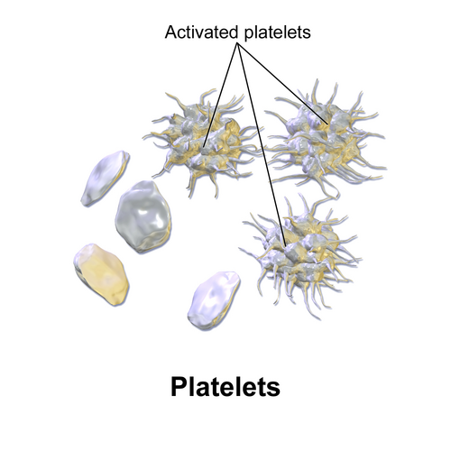

# COAGULOPATIAS

Para entender coagulopatias, você precisa parar de tentar decorar nomes de doenças e começar a enxergar o processo como uma linha de montagem. Se a linha para, o sangue vaza. Se a linha acelera demais, o sangue entope. O segredo para acertar qualquer questão de prova é saber exatamente em qual etapa da montagem o erro aconteceu.

*Figura 1 - Plaquetas (trombócitos): células fragmentadas responsáveis pela hemostasia primária, formando o tampão plaquetário inicial no local da lesão vascular. Fonte: BruceBlaus/Blausen Medical, CC BY 3.0 | Wikimedia Commons*

## O Raciocínio Clínico: Hemostasia Primária vs. Secundária

Imagine que um vaso sanguíneo rompeu. A primeira resposta é o "tampão de emergência" (Hemostasia Primária). As plaquetas correm para o local, grudam na parede (adesão) e umas nas outras (agregação). Se o problema for aqui, o sangramento é **mucocutâneo**: petéquias, equimoses, gengivorragia ou epistaxe.

A segunda etapa é o "cimento" que reforça esse tampão (Hemostasia Secundária). São os fatores de coagulação formando a rede de fibrina. Se o erro for aqui, o sangramento é **profundo**: hemartroses (sangue na articulação) e hematomas musculares.

**Dica de Prova:** Se a questão descreve um paciente com sangramento após extração dentária que para e depois de algumas horas volta a sangrar, o problema é na hemostasia secundária. O tampão plaquetário formou (parou de sangrar), mas a fibrina não o segurou (voltou a sangrar).

### Tabela 1: Diferenciação Clínica e Laboratorial

| Característica | Hemostasia Primária | Hemostasia Secundária |
| --- | --- | --- |
| **Tipo de Sangramento** | Mucocutâneo (Petéquias, Epistaxe) | Profundo (Hemartrose, Hematoma) |
| **Início do Sangramento** | Imediato após trauma | Tardio após trauma |
| **Exame Físico** | Petéquias, Equimoses superficiais | Grandes hematomas, Edema articular |
| **Laboratório Inicial** | Plaquetas, Tempo de Sangramento | TP, TTPA, Fibrinogênio |

*Figura 2 - Púrpura cutânea: manchas hemorrágicas que não desaparecem à vitropressão, achado clínico típico dos distúrbios plaquetários da hemostasia primária. Fonte: Hektor, CC BY-SA 3.0 | Wikimedia Commons*

## Distúrbios da Hemostasia Primária

Aqui o foco são as plaquetas (número ou função) e o Fator de von Willebrand (a "cola" que une a plaqueta ao vaso).

### Púrpura Trombocitopênica Imune (PTI)

A PTI é o "arroz com feijão" das provas. É uma doença autoimune onde anticorpos (geralmente IgG) marcam as plaquetas para serem destruídas no baço.

**O Diagnóstico é de EXCLUSÃO.** Segundo o Protocolo Brasileiro (Ministério da Saúde, 2024), definimos PTI como plaquetopenia isolada (< 100.000/mm³) sem uma causa secundária óbvia (como HIV, Hepatite C ou Lúpus).

- **Quadro Clínico:** Frequentemente é uma criança que teve uma virose há 2 semanas e agora aparece cheia de petéquias, mas está "bem", sem febre e sem baço aumentado. Em adultos, o quadro é mais insidioso e crônico.

- **Mielograma:** Não é rotina! Só pedimos se houver dúvida (ex: anemia ou leucopenia associada) ou se o paciente for idoso/refratário. O que esperamos ver? Medula rica em megacariócitos (tentando compensar a destruição periférica).

**Manejo da PTI:**

- **Plaquetas > 30.000 e assintomático:** Apenas observação. Não trate o número, trate o paciente.

- **Plaquetas < 30.000 ou sangramento:** Primeira linha é **Corticoterapia**.

- Prednisona: 0,5 a 2 mg/kg/dia por 2-4 semanas.

- Pulsoterapia com Dexametasona (40mg/dia por 4 dias) é uma alternativa excelente para resposta rápida.

- **Sangramento Grave/Emergência:** Imunoglobulina Intravenosa (IgIV) + Metilprednisolona EV + Transfusão de Plaquetas (sim, mesmo que elas sejam destruídas, elas ajudam no momento crítico).

**Cuidado:** Muitos alunos erram ao achar que PTI tem esplenomegalia. Se o baço estiver grande, mude o diagnóstico! Pense em hiperesplenismo, linfoma ou hipertensão portal.

### Microangiopatias Trombóticas: PTT e SHU

Aqui o bicho pega. São emergências hematológicas onde ocorre formação de microtrombos que "esmagam" as hemácias (causando hemólise) e consomem plaquetas.

-

**Púrpura Trombocitopênica Trombótica (PTT):** Deficiência da enzima ADAMTS13. Sem ela, o Fator de von Willebrand fica gigante e agrega plaquetas sozinho.

- **Pêntade Clássica:** Plaquetopenia + Anemia Hemolítica Microangiopática (Esquizócitos!) + Febre + Disfunção Renal + Alteração Neurológica.

- **Conduta:** Plasmaférese URGENTE. Não espere a pêntade completa. Viu esquizócitos e plaquetopenia? Chame a nefrologia/hematologia.

-

**Síndrome Hemolítico-Urêmica (SHU):** Típica da pediatria, associada à toxina Shiga (*E. coli* O157:H7).

- **Tríade:** Diarreia sanguinolenta prévia + Insuficiência Renal Aguda + Plaquetopenia/Anemia Hemolítica.

- **Tratamento:** Suporte. Evite antibióticos (podem piorar a liberação de toxinas).

### Doença de von Willebrand (DvW)

É a coagulopatia hereditária mais comum. O Fator de von Willebrand (FvW) tem duas funções: ajudar a plaqueta a grudar no vaso e carregar o Fator VIII no sangue.

- **A pegadinha:** O FvW protege o Fator VIII. Se o FvW cai muito, o Fator VIII também cai. Por isso, na DvW, você pode ter **TTPA prolongado** (pela queda do Fator VIII) e **Tempo de Sangramento prolongado** (pela falha plaquetária).

- **Tratamento:** Desmopressina (DDAVP) nos casos leves (Tipo 1) para liberar estoques de FvW. Em casos graves ou cirurgias, usamos o próprio concentrado de FvW/Fator VIII.

## Distúrbios da Hemostasia Secundária

Aqui o problema é o "cimento". O paciente sangra para dentro: articulações (hemartroses) e músculos.

### Hemofilias A e B

Doenças ligadas ao cromossomo X (quase sempre em homens).

- **Hemofilia A:** Deficiência de Fator VIII (8).

- **Hemofilia B:** Deficiência de Fator IX (9).

**Laboratório:** O TTPA estará prolongado (via intrínseca) e o TP estará NORMAL.
Como diferenciar A de B? Apenas dosando o fator. Clinicamente elas são idênticas.

**Manejo das Hemartroses:**

- Reposição imediata do fator deficiente (meta de 30-50% em sangramentos leves e 80-100% em graves/SNC).

- Gelo, repouso e analgesia. **NUNCA use AAS ou AINEs** (eles estragam a hemostasia primária, que é a única coisa que o hemofílico ainda tem funcionando).

**O "Pulo do Gato" do Dr. Will:** Se você repõe o fator e o TTPA não corrige, o paciente desenvolveu um **Inibidor** (anticorpo contra o fator). Isso é uma complicação temida e exige tratamentos de "bypass" como o Complexo Protrombínico Parcialmente Ativado.

### Tabela 2: Diagnóstico Diferencial dos Exames de Triagem

| TP Prolongado (RNI ↑) | TTPA Prolongado | Ambos Prolongados |
| --- | --- | --- |
| Deficiência de Fator VII | Hemofilias (A, B, C) | Deficiência de Via Comum (X, V, II, I) |
| Início de uso de Varfarina | Heparina Não Fracionada | Insuficiência Hepática Grave |
| Deficiência de Vitamina K | Doença de von Willebrand | CIVD |
| | Lúpus Anticoagulante (Trombose!) | Varfarina (efeito pleno) |

## Coagulopatias Complexas e Adquiridas

### Coagulação Intravascular Disseminada (CIVD)

A CIVD não é uma doença, é uma catástrofe secundária a outra coisa (Sepse, Trauma, Neoplasia). Ocorre uma ativação sistêmica da coagulação: o corpo forma trombos em todo lugar e, ao mesmo tempo, consome todos os fatores e plaquetas, gerando sangramento.

- **Laboratório:** Tudo alterado. Plaquetas baixas, TP/TTPA altos, Fibrinogênio BAIXO e **D-Dímero MUITO ALTO**.

- **Tratamento:** Tratar a causa base (ex: antibiótico na sepse). Reposição de hemocomponentes apenas se houver sangramento ativo ou necessidade de procedimento.

### Trombocitopenia Induzida por Heparina (HIT ou TIH)

Este é o maior paradoxo da hematologia. O paciente usa heparina e, em vez de sangrar, ele faz **TROMBOSE** com plaquetas baixas.

- **Mecanismo:** Anticorpos contra o complexo Heparina-Fator Plaquetário 4 (PF4).

- **Quando suspeitar?** Queda de > 50% das plaquetas após 5-10 dias de uso de heparina.

- **Conduta:** Suspender IMEDIATAMENTE qualquer heparina (incluindo o selo do cateter) e iniciar um anticoagulante de outra classe (como Fondaparinux ou Inibidores Diretos da Trombina).

## Manejo de Anticoagulantes e Reversão

Como professor, vejo muitos alunos se perderem nas metas de RNI e tempos de suspensão. Vamos simplificar com as diretrizes da SBC (2024).

### Varfarina (Antagonista da Vitamina K)

Inibe os fatores II, VII, IX e X (além das proteínas C e S).

- **Monitoramento:** TP/RNI (Meta geralmente 2,0 - 3,0).

- **Reversão:**

- RNI < 4,5 e sem sangramento: Apenas reduzir ou pular dose.

- RNI 4,5 - 10 e sem sangramento: Suspender dose e considerar Vitamina K oral (1-2,5mg).

- Sangramento Grave (independente do RNI): Vitamina K EV + Complexo Protrombínico (mais rápido que plasma).

### Heparinas

- **Não Fracionada (HNF):** Monitorada pelo TTPA. Reversão com **Sulfato de Protamina** (1mg reverte 100UI de HNF).

- **Baixo Peso Molecular (Enoxaparina):** Não precisa de monitoramento rotineiro. Protamina reverte apenas parcialmente (~60%).

### Anticoagulantes Orais Diretos (DOACs - Rivaroxabana, Apixabana)

- Não alteram RNI de forma confiável.

- Em cirurgias de alto risco, suspender 48-72h antes. Em baixo risco, 24h costuma bastar.

## Situações Especiais e Pegadinhas

- **Doença Hepática:** O fígado produz quase todos os fatores, exceto o **Fator VIII** (produzido no endotélio). Em provas, se o paciente tem cirrose e o Fator VIII está baixo, suspeite de CIVD associada, pois na insuficiência hepática isolada o Fator VIII costuma estar normal ou até alto.

- **Pseudotrombocitopenia:** O laboratório avisa "presença de agregados plaquetários". Isso acontece pelo uso do anticoagulante EDTA no tubo de coleta. Conduta: Repetir o exame em tubo com citrato.

- **Aspirina (AAS):** Inibe a COX-1 de forma **irreversível**. O efeito dura a vida da plaqueta (7-10 dias). Para procedimentos de alto risco (ex: neurocirurgia), suspender 7 dias antes. Para a maioria das cirurgias cardíacas, a SBC recomenda manter.

## Pontos-Chave para Prova 💡

- **PTI:** Plaquetopenia isolada (< 100.000) sem baço aumentado. Tratar se < 30.000 ou sangramento. Primeira linha: Corticoide.

- **PTT:** Esquizócitos + Plaquetopenia + Alteração Neurológica. Conduta: Plasmaférese imediata. **NUNCA transfundir plaquetas na PTT** (você "alimenta" o fogo dos microtrombos), a menos que haja sangramento no SNC.

- **Hemofilia:** TTPA prolongado que **corrige com teste do mix** (mistura plasma do paciente com plasma normal). Se não corrigir, há um inibidor.

- **Doença de von Willebrand:** Pode ter TP normal e TTPA prolongado. É o distúrbio hereditário mais comum.

- **Vitamina K:** Fatores II, VII, IX, X. O primeiro a cair é o VII (meia-vida curta), por isso o TP altera antes do TTPA.

- **HIT:** Trombocitopenia + Trombose. Suspenda a heparina e não dê plaquetas.

- **CIVD:** Consumo de fibrinogênio é a marca registrada. D-dímero explode.

- **Esplenectomia na PTI:** Indicada após 12 meses (fase crônica) se falha terapêutica. Vacinar contra germes encapsulados (*S. pneumoniae, H. influenzae, N. meningitidis*) 2 semanas antes.

- **Púrpura de Bernard-Soulier:** Deficiência de GP Ib (adesão). Plaquetas GIGANTES no hemograma.

- **Trombastenia de Glanzmann:** Deficiência de GP IIb/IIIa (agregação). Plaquetas de tamanho normal, mas não funcionam.

- **Meta de Plaquetas para Biópsia Endoscópica:** > 50.000/mm³.

- **Reversão de Varfarina em Emergência:** Complexo Protrombínico é superior ao Plasma Fresco Congelado (menor volume, ação mais rápida).

- **Fator VIII:** NÃO é produzido no fígado. Útil para diferenciar CIVD de Insuficiência Hepática.

- **Dose de Protamina:** 1mg para cada 100 unidades de Heparina Não Fracionada.

- **SHU:** Diarreia sanguinolenta + Insuficiência Renal Aguda. Comum em crianças.

- **AAS no Perioperatório:** Manter em pacientes de alto risco cardiovascular, exceto em cirurgias de "espaço fechado" (neurocirurgia, ressecção transuretral de próstata).

Lembre-se do que sempre digo no MedEvo: a hematologia é lógica. Se você entende quem gruda em quem e quem ativa quem, a questão de prova vira apenas uma história clínica para você aplicar o fluxograma. Não decore condutas, entenda o consumo!

 Cópia offline para consulta pessoal.
 Fonte original:
 [https://www.medevo.com.br/material-apoio/ler/719ca971-884f-478b-9846-581b9788c580](https://www.medevo.com.br/material-apoio/ler/719ca971-884f-478b-9846-581b9788c580)
