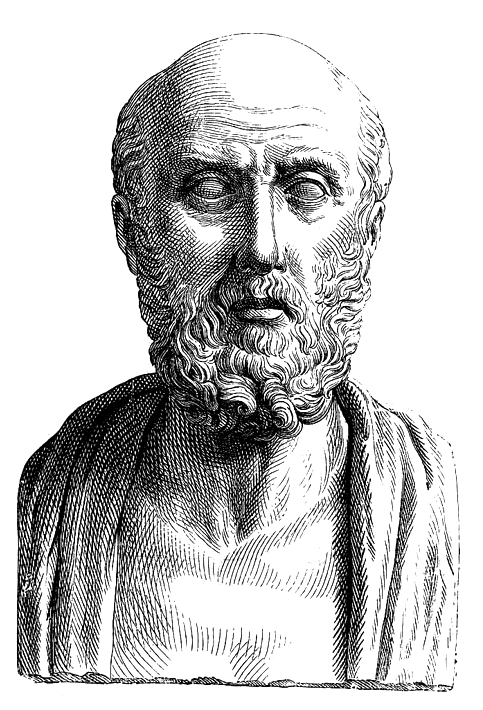

# CÓDIGO DE ÉTICA MÉDICA

O Código de Ética Médica (CEM) não é uma lei votada no Congresso Nacional, mas sim uma Resolução do Conselho Federal de Medicina (atualmente a Resolução CFM nº 2.217/2018). No entanto, ele possui força normativa e serve de base para processos ético-profissionais e até para fundamentar decisões judiciais. Para a prova de residência, você não precisa decorar o número dos 117 artigos, mas sim entender a **lógica** por trás deles.

As bancas não querem apenas saber se você conhece a regra, elas querem saber se você sabe aplicá-la em situações de conflito: o paciente que recusa tratamento, a família que quer esconder o diagnóstico, ou o dilema de quem deve assinar o atestado de óbito.

*Figura 1 - Manuscrito bizantino do séc. XII contendo o Juramento de Hipócrates, fundamento histórico da ética médica que embasa os princípios deontológicos modernos. Fonte: Biblioteca Vaticana, Domínio Público | Wikimedia Commons*

## Princípios Fundamentais: O Norte da Profissão

Os princípios fundamentais são a "alma" do código. Eles não proíbem condutas específicas, mas ditam como o médico deve se posicionar.

O primeiro ponto que você deve fixar é que a Medicina é uma profissão a serviço da saúde do ser humano e da coletividade, e deve ser exercida sem discriminação de qualquer natureza. O médico é o guardião da dignidade do paciente.

Um conceito que aparece muito em provas é a **autonomia**. O médico deve respeitar a vontade do paciente de escolher seus métodos diagnósticos e terapêuticos, desde que sejam aceitáveis e adequados ao caso.

**Cuidado:** A autonomia não é absoluta. O médico não é obrigado a realizar um procedimento que considere tecnicamente inadequado ou que fira sua consciência (objeção de consciência), exceto em situações de urgência e emergência ou quando não houver outro médico disponível.

### A Medicina como Meio, não como Fim

O médico deve utilizar o melhor do progresso científico em benefício do paciente. Aqui entra um conceito importante para o **MedEvo**: a Medicina é uma atividade de **meio**, não de **resultado**. Você se compromete a usar as melhores técnicas e evidências, mas não pode garantir a cura. Prometer resultado em medicina é infração ética.

## Direitos do Médico: O que você PODE e DEVE exigir

Muitos alunos focam apenas nos deveres e esquecem que o médico também tem direitos. As bancas adoram cobrar isso para confundir o candidato que acha que o médico "deve aceitar tudo".

- **Direito de Internar e Assistir:** Você tem o direito de internar e assistir seus pacientes em hospitais privados ou públicos, mesmo que não faça parte do corpo clínico daquela instituição (respeitadas as normas técnicas do local).

- **Objeção de Consciência:** Você pode se recusar a realizar atos médicos que, embora permitidos por lei, contrariem os ditames de sua consciência. Exemplo clássico: o aborto legal. Se você se recusa por consciência, deve encaminhar a paciente a outro colega que o faça.

- **Condições de Trabalho:** É direito do médico recusar-se a exercer sua profissão em instituições onde as condições de trabalho sejam indignas ou possam prejudicar o paciente.

- **Pegadinha de Prova:** Se você decidir suspender suas atividades por falta de condições, deve comunicar imediatamente ao Diretor Técnico, à Comissão de Ética Médica da instituição e ao CRM. Você não pode simplesmente "ir embora" e deixar os pacientes desassistidos.

- **Honorários Justos:** O médico tem o direito de estabelecer seus honorários de forma digna. No entanto, é proibido explorar o trabalho de outro médico como proprietário de serviço ou intermediário.

## Responsabilidade Profissional: Onde moram os processos

Este é o capítulo que define o que é o "erro médico" sob a ótica ética. Para a prova, você precisa diferenciar os três pilares da culpa:

| Conceito | Definição | Exemplo Clínico |
| --- | --- | --- |
| **Negligência** | Omissão. Deixar de fazer o que deveria ser feito. Desleixo. | Não checar sinais vitais de um paciente no pós-operatório imediato. |
| **Imprudência** | Ação precipitada. Fazer algo sem a devida cautela. | Operar um paciente sem ter os exames pré-operatórios necessários em mãos. |
| **Imperícia** | Falta de conhecimento técnico ou habilidade para aquele ato. | Um clínico geral tentar realizar uma neurocirurgia complexa sem treinamento. |

**Erro clássico de prova:** Achar que o médico é responsável pelo erro de outros profissionais. O médico responde por seus atos e pelos atos de quem está sob sua coordenação direta, mas não é o "culpado universal" por tudo o que acontece no hospital.

### Responsabilidade do Residente e do Preceptor

Na relação preceptor-residente, a responsabilidade é compartilhada. O preceptor tem o dever de orientar e supervisionar. O residente não pode recusar atendimento alegando apenas "receio judicial" se houver amparo ético e supervisão. Se o preceptor não estiver presente ou as condições forem inadequadas, o residente deve acionar a COREME (Comissão de Residência Médica).

## Relação com Pacientes e Familiares: Autonomia e Verdade

Aqui o bicho pega nas provas. A tendência moderna é a **Abordagem Centrada na Pessoa**.

### O Dever de Informar

O médico deve informar ao paciente o diagnóstico, o prognóstico, os riscos e os objetivos do tratamento.

- **E se a família pedir para não contar?** Segundo o CEM, você deve informar ao paciente. A vontade da família não se sobrepõe ao direito do paciente de saber sobre sua própria saúde, a menos que a informação possa causar um dano psicológico grave (o que é raro e deve ser muito bem justificado).

- **Incerteza Diagnóstica:** Se você não sabe o que o paciente tem, seja honesto. Diga: "Ainda não temos um diagnóstico fechado, estamos investigando as hipóteses X e Y". Isso gera confiança e evita a medicina defensiva.

### O Consentimento Livre e Esclarecido

Nenhum procedimento pode ser feito sem o consentimento do paciente ou de seu representante legal, exceto em **iminente risco de morte**.

- **Exemplo:** Paciente Testemunha de Jeová que precisa de transfusão de sangue.

- Se não há risco de morte iminente: Respeita-se a autonomia e busca-se alternativas.

- Se há risco de morte iminente: O médico **deve** transfundir, independentemente da vontade do paciente ou da família. A vida é o bem maior tutelado pelo Estado e pelo CEM.

*Figura 2 - Busto de Hipócrates (c. 460-370 a.C.), considerado o pai da Medicina e autor do juramento que estabeleceu o sigilo médico como princípio fundamental. Fonte: Domínio Público | Wikimedia Commons*

## Sigilo Médico: A Regra e as (Poucas) Exceções

O sigilo é um dos pilares mais antigos da medicina. O médico é proibido de revelar segredo de que tenha conhecimento em razão do exercício profissional. O sigilo permanece mesmo que o fato seja de conhecimento público ou que o paciente tenha falecido.

**Quando você PODE (ou deve) quebrar o sigilo?**

- **Dever Legal:** Notificação compulsória de doenças (ex: meningite, sífilis em gestante). Aqui, você comunica à autoridade sanitária, não à polícia.

- **Justa Causa:** Para evitar um crime ou um dano grave a terceiros. Exemplo: Paciente com epilepsia grave e não controlada que insiste em dirigir ônibus escolar.

- **Autorização por Escrito:** O paciente autoriza expressamente a revelação.

**Cuidado com a Polícia:** O médico não pode revelar segredo que possa expor o paciente a processo penal. Se um paciente chega baleado, você deve prestar o atendimento. A notificação de ferimento por arma de fogo é obrigatória à autoridade policial, mas você relata o fato (atendimento de ferimento por arma), não o conteúdo das confidências do paciente.

## Documentos Médicos: Atestados e Prontuários

O prontuário médico é um documento valioso. Ele pertence ao **paciente**, mas fica sob a guarda da instituição ou do médico.

- **Acesso ao Prontuário:** O paciente tem direito a cópia integral do seu prontuário. O médico não pode se negar a entregar.

- **Atestado Médico:** É parte integrante do ato médico.

- **Proibição:** É vedado emitir atestado sem ter examinado o paciente.

- **Retroatividade:** O atestado **NUNCA** pode ter data retroativa. Se você atendeu hoje, a data é de hoje. Se o paciente diz que estava doente ontem, você pode registrar no corpo do texto: "Paciente refere sintomas desde ontem", mas a data do documento é a do exame.

- **Diagnóstico (CID):** Só pode ser colocado no atestado se o paciente ou seu representante legal autorizar expressamente. Sem autorização, o atestado é válido apenas com a afirmação de que o paciente necessita de repouso.

## O Fim da Vida: Morte Encefálica e Cuidados Paliativos

Este é o tema campeão de questões. Você precisa dominar a Resolução CFM nº 2.173/2017.

### Critérios para Diagnóstico de Morte Encefálica (ME)

A morte no Brasil é definida como morte encefálica. Para iniciar o protocolo, o paciente deve apresentar:

- Lesão encefálica de causa conhecida e irreversível.

- Ausência de fatores confundidores (hipotermia < 35°C, drogas depressoras do SNC, distúrbios metabólicos graves).

- Tratamento e observação em hospital por no mínimo 6 horas (se a lesão for hipóxico-isquêmica, o tempo é de 24 horas).

**O Protocolo propriamente dito:**

- **Dois exames clínicos:** Realizados por médicos diferentes, especificamente capacitados (um deles deve ser neurologista, neurocirurgião, intensivista ou emergencista).

- **Intervalo entre os exames:**

- 7 dias a 2 meses incompletos: 24 horas.

- 2 meses a 24 meses incompletos: 12 horas.

- Acima de 2 anos: 1 hora.

- **Teste de Apneia:** Deve ser realizado uma vez (geralmente após o primeiro ou segundo exame clínico) para comprovar a ausência de movimentos respiratórios.

- **Exame Complementar:** Deve demonstrar ausência de perfusão sanguínea, atividade elétrica ou metabólica cerebral (Ex: Arteriografia, EEG, Doppler transcraniano).

**Importante:** Os médicos que diagnosticam a ME **não podem** fazer parte da equipe de transplante/captação de órgãos. Isso evita conflito de interesses.

### Ortotanásia vs. Eutanásia vs. Distanásia

As bancas amam esses conceitos latinos.

- **Eutanásia:** Abreviar a vida do paciente a pedido dele ou da família. **É CRIME** no Brasil e infração ética gravíssima.

- **Distanásia:** Prolongamento fútil da vida e do sofrimento através de tratamentos desproporcionais ("obstinação terapêutica"). O CEM condena a distanásia.

- **Ortotanásia:** Morte no tempo certo. É a suspensão de tratamentos inúteis em pacientes terminais, mantendo-se os **cuidados paliativos** (conforto, analgesia, suporte psicológico). É permitida e incentivada pela Resolução CFM 1.805/2006.

## Doação de Órgãos e Transplantes

No Brasil, a doação de órgãos é **consentida pela família**. Não importa se o paciente escreveu na identidade que era doador; a palavra final é dos familiares de 1º ou 2º grau ou cônjuge.

- **Priorização:** O critério principal para transplante (especialmente o renal) é a **compatibilidade imunológica** (HLA), não apenas a ordem de chegada na fila.

- **Papel do Médico:** Temos o dever de informar à Central de Transplantes sobre todo paciente com morte encefálica confirmada.

## Declaração de Óbito (DO): Quem assina?

Este é o ponto onde os alunos mais erram. Vamos dividir em dois cenários:

### 1. Morte por Causa Externa (Violenta ou Suspeita)

Acidentes, homicídios, suicídios, quedas de idosos, mortes suspeitas.

- **Quem assina?** O médico do **IML (Instituto Médico Legal)**.

- **Cuidado:** Mesmo que o paciente tenha ficado internado 30 dias no hospital após um atropelamento e morra de pneumonia, a causa básica foi o atropelamento (causa externa). O corpo deve ir para o IML. O médico assistente **não** assina.

### 2. Morte por Causa Natural

- **Com assistência médica:** O médico que vinha assistindo o paciente (médico assistente) deve assinar. Se ele não puder, o médico substituto ou o plantonista da instituição assina.

- **Sem assistência médica (morte em casa, por exemplo):**

- Onde houver **SVO (Serviço de Verificação de Óbito)**: O corpo vai para o SVO.

- Onde NÃO houver SVO: O médico do serviço público de saúde mais próximo assina (geralmente o médico do posto de saúde ou o perito da polícia civil, dependendo da localidade).

| Situação | Quem emite a DO? |
| --- | --- |
| Morte Violenta (Trauma/Crime) | IML |
| Morte Natural com Assistência | Médico Assistente / Plantonista |
| Morte Natural sem Assistência (com SVO na cidade) | SVO |
| Morte Natural sem Assistência (sem SVO na cidade) | Médico do Serviço Público / Saúde da Família |

## Resoluções Recentes e Temas Quentes

### Anabolizantes (Resolução CFM 2.333/2023)

Esta é a "bola da vez". O CFM proibiu a prescrição de esteroides anabolizantes para fins **estéticos, ganho de massa muscular ou melhora de performance esportiva**.

- **Por quê?** Baseado no princípio da **não maleficência**. Não há evidência científica que justifique os riscos (cardiovasculares, hepáticos, psíquicos) para fins puramente cosméticos.

- **Pode prescrever quando?** Apenas em casos de deficiência hormonal comprovada (hipogonadismo) ou doenças catabólicas específicas.

### Telemedicina

A telemedicina é permitida e ética, desde que respeitados os mesmos padrões de sigilo e qualidade do atendimento presencial. O médico tem autonomia para decidir se a primeira consulta pode ser remota ou se exige presença física.

### Publicidade Médica

O médico não pode anunciar cura, não pode usar fotos de "antes e depois" (mesmo com autorização do paciente), e não pode anunciar especialidade que não possua (RQE - Registro de Qualificação de Especialidade).

## Pontos-Chave para Prova

- **Autonomia do Paciente:** Prevalece sobre a vontade da família. O paciente tem direito de saber seu diagnóstico e prognóstico.

- **Morte Encefálica:** Exige 2 exames clínicos (médicos diferentes) + 1 teste de apneia + 1 exame complementar.

- **Intervalo ME:** 1 hora para maiores de 2 anos.

- **Atestado de Óbito em Trauma:** Sempre IML, não importa quanto tempo depois do trauma a morte ocorra.

- **Sigilo Médico:** Não pode ser quebrado para depor em processo contra o paciente (se o segredo o expuser criminalmente).

- **Testemunha de Jeová:** Transfunde se houver risco iminente de morte. Se não houver, respeita a recusa.

- **Anabolizantes:** Proibidos para fins estéticos e performance pela Resolução 2.333/2023.

- **Atestado Médico:** Proibido retroagir data. Diagnóstico (CID) exige autorização do paciente.

- **Biópsia:** Ato privativo do médico. Enfermeiro não pode realizar.

- **Ortotanásia:** Permitida (suspensão de tratamentos fúteis em doentes terminais). Eutanásia é proibida.

- **Doação de Órgãos:** Quem decide é a família. O médico do transplante não participa do diagnóstico de morte encefálica.

- **Grupos Balint:** Espaço para médicos discutirem a relação médico-paciente e seus sentimentos, visando prevenir Burnout.

- **Medicina Defensiva:** Solicitar exames desnecessários apenas por medo de processo é infração ética e aumenta custos do sistema.

- **Interrupção de Gestação (Anencefalia):** Não precisa de autorização judicial nem do CRM. Basta o diagnóstico ultrassonográfico assinado por dois médicos. 🩺

 Cópia offline para consulta pessoal.
 Fonte original:
 [https://www.medevo.com.br/material-apoio/ler/75ce2627-46dd-43f0-9da2-eeb204f23526](https://www.medevo.com.br/material-apoio/ler/75ce2627-46dd-43f0-9da2-eeb204f23526)
