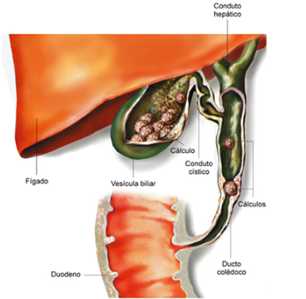
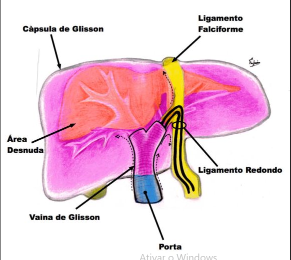
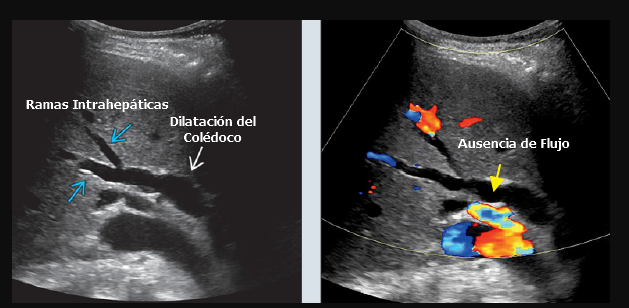
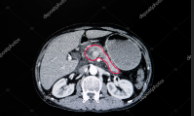
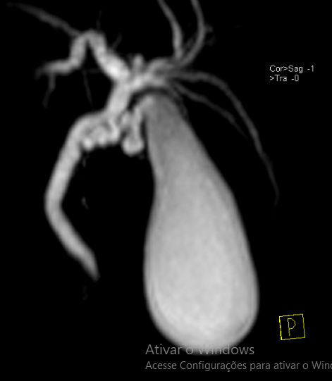
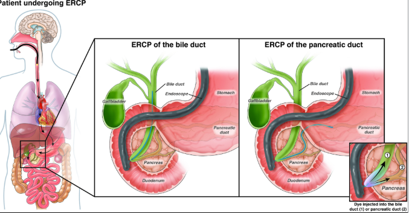

# COLANGITE

## Colangite Aguda: Muito Além de uma Infecção

Para entender colangite, você precisa esquecer a ideia de que ela é "apenas uma infecção". Se você tratar a colangite como se fosse uma "pneumonia da via biliar", focando apenas no antibiótico, você vai errar a questão na prova e, pior, vai perder o paciente na vida real.

A colangite não é um processo puramente inflamatório; ela é um fenômeno mecânico-infeccioso.

Imagine um cano de alta pressão que entope subitamente. O fluido (bile) para de correr e começa a acumular bactérias rapidamente. Mas o problema real é a pressão intrabiliar: ela sobe tanto que vence a barreira defensiva do fígado, "empurrando" bactérias e toxinas diretamente para dentro dos capilares sinusoides e linfáticos.

É o chamado refluxo colangiovenoso. É por isso que o paciente com colangite evolui para choque séptico e disfunção orgânica de forma tão fulminante.

- O Conceito Chave: Obstrução + Infecção

A colangite aguda é a infecção bacteriana ascendente das vias biliares, quase sempre decorrente de uma obstrução (seja por cálculos, estenoses ou tumores).

- Por que isso é uma emergência médica?

Porque enquanto você não "desentupir o cano" (descompressão biliar), o antibiótico sozinho não conseguirá penetrar na via biliar sob alta pressão. Tratar colangite sem drenagem é como tentar apagar um incêndio em um quarto fechado jogando água pela fresta da porta: você pode até resfriar as paredes, mas o fogo continua lá dentro.

## Fisiopatologia: O Segredo está na Pressão

A bile em condições normais é estéril ou contém pouquíssimas bactérias. Para que a colangite ocorra, precisamos de dois fatores simultâneos:

- **Obstrução da via biliar:** Que gera estase.

- **Presença de bactérias na bile (Bacteriobilia):** Geralmente por translocação ascendente do duodeno.

O ponto que as bancas amam cobrar é a **pressão intraductal**. Quando a pressão no colédoco ultrapassa 20 cmH2O, ocorre o chamado refluxo colangiovenoso e colangiolinfático. As bactérias e suas endotoxinas são "empurradas" para o sangue. É por isso que a colangite causa sepse de forma muito mais agressiva que a colecistite aguda (onde a infecção está "presa" dentro da vesícula).

**Dica do Dr. Will:** Na colecistite, o problema é inflamatório/isquêmico da parede da vesícula. Na colangite, o problema é a translocação bacteriana por pressão. Guarde isso para diferenciar as condutas de urgência.

## Etiologia: O que está entupindo o cano?

A causa mais comum, disparada em provas de residência, é a **coledocolitíase** (cálculo que saiu da vesícula e parou no colédoco). Mas não é a única.

*Figura 1 - Obstrução da via biliar: a coledocolitíase é a causa mais frequente de colangite aguda.*

- **Causas Benignas:** Coledocolitíase (nº 1), estenoses benignas (pós-cirúrgicas), parasitas (Ascaris), e a Colangite Esclerosante (CEP).
Lembre-se: CEP é uma doença inflamatória crônica que causa fibrose e estenoses (estreitamentos) nos ductos biliares, tanto dentro quanto fora do fígado.

- **Causas Malignas:** Tumores de cabeça de pâncreas, colangiocarcinoma (Tumor de Klatskin) e tumores de ampola de Vater.

- **Causas Iatrogênicas:** Manipulação da via biliar por CPRE ou estenoses pós-colecistectomia.

**Cuidado com a pegadinha:** A banca vai te dar um paciente com perda de peso e icterícia indolor que subitamente evolui com febre. Pense em tumor obstruindo e infectando secundariamente. Mas, estatisticamente, a resposta da "causa mais comum" continua sendo coledocolitíase.

## Microbiologia: Quem são os vilões?

A bile infectada é polimicrobiana. Como as bactérias sobem do duodeno, os germes são os gram-negativos entéricos e anaeróbios.

- **Escherichia coli** (A mais comum de todas).

- **Klebsiella spp.** (Segunda mais comum).

- **Enterococcus spp.** (Gram-positivo, muito comum em pacientes que já manipularam a via biliar antes).

- **Bacteroides fragilis** (Anaeróbio principal).

Em provas, se perguntarem qual o esquema empírico inicial, você deve cobrir Gram-negativos e anaeróbios.

## Quadro Clínico: A Famosa Tríade e a Pêntade

Aqui é onde o aluno ganha pontos fáceis, mas as bancas estão ficando mais sofisticadas.

### Tríade de Charcot

Presente em cerca de 50-70% dos casos. É o clássico para o diagnóstico clínico:

- **Febre com calafrios** (Sinal de bacteremia).

- **Icterícia** (Sinal de obstrução biliar).

- **Dor em Hipocôndrio Direito** (Sinal de distensão da cápsula de Glisson ou do ducto).

*Figura 2 - Tríade de Charcot: sinais clínicos clássicos da colangite aguda (febre + icterícia + dor em HCD).*

### Pêntade de Reynolds

Indica **Colangite Aguda Supurativa** (Grave). É a Tríade de Charcot somada a:
4. **Hipotensão** (Choque séptico).
5. **Alteração do nível de consciência** (Confusão mental).

**Erro clássico de prova:** Achar que o paciente precisa ter a Pêntade para ser grave. Se ele tiver apenas a Tríade + Hipotensão, ele já é um Tokyo III (Grave) e precisa de intervenção imediata. A Pêntade é apenas a descrição clássica da gravidade extrema.

## Critérios Diagnósticos (Tokyo Guidelines 2018 - TG18)

Esqueça critérios antigos. O que cai na prova (e o que o MedEvo recomenda seguir) são os Critérios de Tóquio 2018. Eles dividem o diagnóstico em três pilares:

| Pilar | Critério | Exemplos |
| --- | --- | --- |
| **A. Inflamação Sistêmica** | A-1. Febre e/ou calafrios | Febre > 38°C |
| | A-2. Dados laboratoriais | Leucocitose, PCR elevada |
| **B. Colestase** | B-1. Icterícia | Bilirrubina Total ≥ 2,0 mg/dL |
| | B-2. Enzimas hepáticas alteradas | FA, GGT, AST, ALT > 1,5x o normal |
| **C. Imagem** | C-1. Dilatação biliar | Dilatação de colédoco ou intra-hepática |
| | C-2. Evidência da etiologia | Cálculo, tumor ou stent na imagem |

- **Suspeita diagnóstica:** Um item em A + um item em B ou C.

- **Diagnóstico definitivo:** Um item em A + um item em B + um item em C.

## Classificação de Gravidade (TG18)

Isso aqui define quem vai para a CPRE agora e quem pode esperar até amanhã.

- **Grau III (Grave):** Disfunção de pelo menos um órgão (Cardiovascular - hipotensão precisando de amina; Neurológico - confusão; Respiratório - PaO2/FiO2 < 300; Renal - Cr > 2,0; Hepático - INR > 1,5; Hematológico - Plaquetas < 100.000).

- **Grau II (Moderada):** Sem disfunção de órgãos, mas com dois dos seguintes: Leucocitose extrema (> 12k ou < 4k), Febre alta (≥ 39°C), Idade ≥ 75 anos, BT ≥ 5 mg/dL ou Hipoalbuminemia.

- **Grau I (Leve):** Não preenche critérios de II ou III. É o paciente que responde bem ao ATB inicial.

## Diagnóstico Diferencial de Icterícia

Não confunda colangite com outras causas de icterícia obstrutiva:

- **Colecistite Aguda:** Tem dor e febre, mas raramente tem icterícia importante (a menos que haja Síndrome de Mirizzi).

- **Hepatite Aguda:** Tem icterícia e dor, mas as transaminases (AST/ALT) estão na casa dos milhares, enquanto na colangite a elevação é discreta perto da FA/GGT.

- **Abscesso Hepático:** Pode ser consequência de uma colangite não tratada. O paciente tem febre e dor, mas a icterícia é menos comum.

## Exames de Imagem: Qual pedir?

- **Ultrassonografia (USG):** É sempre o primeiro exame. Ótimo para ver dilatação de via biliar e cálculos na vesícula. **Porém**, é ruim para ver o colédoco distal (gases intestinais atrapalham).

*Figura 3 - Ultrassonografia abdominal: primeiro exame de imagem na suspeita de colangite, identifica dilatação biliar.*

- **Tomografia (TC):** Excelente para ver tumores (pâncreas/vias biliares) e complicações como abscessos.

*Figura 4 - Tomografia computadorizada: excelente para identificar tumores, abscessos e complicações biliares.*

- **Colangiorressonância (CPRM):** O melhor exame não invasivo para ver a anatomia biliar e localizar o cálculo. **Dica de prova:** A CPRM é apenas diagnóstica, não trata.

*Figura 5 - Colangiorressonância (CPRM): melhor exame não invasivo para mapear a anatomia biliar e localizar cálculos.*

- **CPRE (Colangiopancreatografia Retrógrada Endoscópica):** É o padrão-ouro. É diagnóstica e **terapêutica**. Se o paciente tem alta probabilidade de colangite, vamos direto para ela.

*Figura 6 - CPRE: padrão-ouro para drenagem biliar, permite diagnóstico e tratamento simultâneo.*

## Tratamento: O Tripé da Salvação

O tratamento da colangite baseia-se em: **Suporte Hemodinâmico + Antibioticoterapia + Drenagem Biliar.**

### 1. Suporte e Antibióticos

- Hidratação vigorosa (lembre-se da sepse).

- ATB Empírico: Ceftriaxone + Metronidazol OU Piperacilina/Tazobactam (se risco de Pseudomonas ou ambiente hospitalar).

- Em casos leves, Ciprofloxacino + Metronidazol pode ser usado.

### 2. Drenagem Biliar (O ponto mais cobrado)

A drenagem deve ser feita de acordo com a gravidade:

- **Grau III (Grave):** Drenagem **URGENTE** (o mais rápido possível, após estabilização mínima). Se o paciente está chocado, não adianta só dar noradrenalina; tem que tirar o pus da via biliar.

- **Grau II (Moderada):** Drenagem precoce (nas primeiras 24-48 horas).

- **Grau I (Leve):** Pode ser feita após a melhora do quadro inflamatório inicial, geralmente na mesma internação.

**Métodos de Drenagem:**

-

CPRE com Esfincterotomia: Primeira escolha. Menos invasiva, permite retirar o cálculo ou colocar um stent (prótese).

-

**Drenagem Percutânea Trans-hepática (DPTH):** Reservada para quando a CPRE falha ou quando a obstrução é muito alta (hilar) e o endoscopista não alcança.

-

**Drenagem Cirúrgica (Coledocostomia com Dreno de Kehr):** Hoje é a última opção. Usada apenas se a CPRE e a drenagem percutânea não estiverem disponíveis ou falharem. Em locais com recursos limitados, a descompressão biliar urgente com tubo em T (Kehr) pode salvar vidas.

**Exemplo Clínico:** Paciente de 72 anos, icterícia, febre de 39,5°C, PA 80/40 mmHg e sonolento. Conduta? Estabilização com cristaloide, ATB e **CPRE de urgência**. Não perca tempo pedindo Ressonância aqui!

## Situações Especiais e Anatomia Cirúrgica

### O Triângulo de Calot (ou Callot)

Essencial para a colecistectomia segura. Limites:

- Ducto Cístico (lateral).

- Ducto Hepático Comum (medial).

- Borda inferior do fígado (superior).

- *Conteúdo:* Artéria Cística.

### Cistos de Colédoco (Classificação de Todani)

Cai muito em provas de cirurgia pediátrica e geral.

- **Tipo I:** Dilatação fusiforme do colédoco (Mais comum - 80%).

- **Tipo V (Doença de Caroli):** Dilatação das vias biliares intra-hepáticas. Alto risco de colangite de repetição e colangiocarcinoma.

- *Tratamento:* Geralmente ressecção do cisto + Hepatojejunostomia em Y de Roux (para evitar câncer).

### Hemobilia

Tríade de Sandblom: Dor biliar + Icterícia + Hemorragia digestiva (melena/hematêmese).
Geralmente pós-trauma ou manipulação biliar.

- **Diagnóstico/Tratamento:** Arteriografia com embolização (padrão-ouro).

### Colangiocarcinoma (Tumor de Klatskin)

Tumor na bifurcação dos ductos hepáticos. Classificação de **Bismuth-Corlette**:

- Tipo I: Abaixo da confluência.

- Tipo II: Envolve a confluência.

- Tipo IIIa: Confluência + Hepático Direito.

- Tipo IIIb: Confluência + Hepático Esquerdo.

- Tipo IV: Envolve ambos os hepáticos ou multicêntrico.

**Dica MedEvo:** Para tumores Bismuth IIIb, a cirurgia proposta costuma ser a trissegmentectomia esquerda. Para o IIIa, trissegmentectomia direita.

## Complicações e Prognóstico

A principal complicação da colangite não tratada é o **Abscesso Hepático Piogênico**. Se o paciente tratou a colangite, mas continua fazendo picos febris e tem dor residual, peça uma TC para excluir abscesso.

- Tratamento do abscesso: Drenagem percutânea + ATB por tempo prolongado (4-6 semanas).

Outra complicação importante é a **Estenose Cicatricial** da via biliar, especialmente após colangites de repetição ou manipulação cirúrgica.

| Comparativo | Colecistite Aguda | Colangite Aguda |
| --- | --- | --- |
| **Local da Infecção** | Vesícula Biliar | Ductos Biliares (Colédoco) |
| **Icterícia** | Rara / Leve | Comum / Marcante |
| **Fisiopatologia** | Obstrução do Cístico | Obstrução do Colédoco + Pressão |
| **Risco de Sepse** | Moderado | Muito Alto |
| **Tratamento Principal** | Colecistectomia | Drenagem Biliar (CPRE) |
| **Urgência da Drenagem** | Pode aguardar 24-72h | Pode ser imediata (se grave) |

## Anatomia Alterada (Y de Roux)

Se o paciente tem uma cirurgia prévia com reconstrução em Y de Roux (ex: Bypass gástrico), a CPRE convencional é quase impossível porque o endoscópio não chega na papila.

- **Opções:** CPRE assistida por enteroscopia, drenagem percutânea ou acesso cirúrgico transgástrico para CPRE. Isso é uma pegadinha frequente em provas de residência de alto nível.

## Pontos-Chave para Prova 💡

- **Tríade de Charcot:** Febre, Icterícia, Dor QSD (Diagnóstico clínico).

- **Pêntade de Reynolds:** Charcot + Hipotensão + Confusão Mental (Colangite grave/supurativa).

- **Causa mais comum:** Coledocolitíase.

- **Bactéria mais comum:** *Escherichia coli*.

- **Critérios de Tóquio 2018:** Inflamação sistêmica + Colestase + Imagem.

- **Bilirrubina no TG18:** Valor de corte ≥ 2,0 mg/dL para critério de colestase.

- **Colangite Grau III (Grave):** Presença de disfunção orgânica. Conduta: Drenagem biliar **URGENTE**.

- **Primeira escolha de drenagem:** CPRE com esfincterotomia.

- **Drenagem Percutânea:** Indicada se CPRE falhar ou obstrução for muito alta (hilar).

- **Dreno de Kehr:** Usado na exploração cirúrgica do colédoco (coledocostomia).

- **Tumor de Klatskin:** Colangiocarcinoma hilar. Classificação de Bismuth define a ressecção.

- **Hemobilia:** Tríade de Sandblom (Dor + Icterícia + Melena). Tratar com Arteriografia/Embolização.

- **Cisto de Colédoco Tipo I:** Mais comum, requer ressecção e reconstrução em Y de Roux pelo risco de câncer.

- **Anastomose Biliar:** Preferir fios monofilamentares absorvíveis (ex: Poliglecaprone/Monocryl) para evitar estenose e formação de cálculos sobre o fio.

- **O que NÃO fazer:** Não levar um paciente com Pêntade de Reynolds direto para a sala de cirurgia para fazer colecistectomia. Primeiro estabiliza e drena a via biliar (CPRE). A vesícula você tira depois, quando ele estiver estável.

- **Pegadinha de Imagem:** USG normal NÃO exclui colangite. Se a suspeita for alta, progrida para CPRM ou CPRE.

- **Antibiótico:** Sempre cobrir Gram-negativos e anaeróbios. Enterococcus entra na conta se houver manipulação prévia.

 Cópia offline para consulta pessoal.
 Fonte original:
 [https://www.medevo.com.br/material-apoio/ler/42f2eba7-cac9-4a60-9bcc-fbcf9ad304de](https://www.medevo.com.br/material-apoio/ler/42f2eba7-cac9-4a60-9bcc-fbcf9ad304de)
