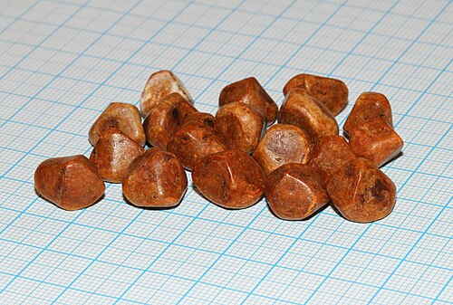
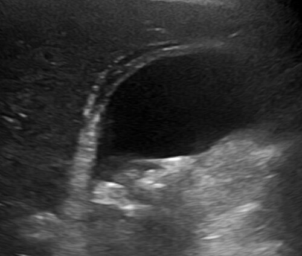

# COLECISTITE AGUDA E CRÔNICA

Para entender as doenças da vesícula biliar, você precisa primeiro visualizar a anatomia cirúrgica. Se você não souber onde está pisando, a cirurgia vira um campo minado. Nas provas de residência, a anatomia não é cobrada de forma teórica pura, mas sim aplicada à segurança do procedimento.

## Anatomia Cirúrgica e o Triângulo de Calot

O **Triângulo de Calot** (ou triângulo cisto-hepático) é a "Terra Santa" da cirurgia biliar. Você precisa conhecer seus limites porque é lá que a mágica — ou a tragédia — acontece.

- **Limite Lateral:** Ducto cístico.

- **Limite Medial:** Ducto hepático comum.

- **Limite Superior:** Borda inferior do fígado (segmento V).

- **Conteúdo:** Artéria cística.

**Cuidado com a pegadinha:** Algumas bancas antigas ou menos rigorosas podem citar a "Artéria Hepática Direita" como limite superior, mas a definição anatômica clássica e mais cobrada atualmente usa a borda hepática. O conteúdo mais importante é a **artéria cística**, que geralmente nasce da artéria hepática direita (ramo da hepática própria, que vem da hepática comum, originada no tronco celíaco).

Por que isso importa? Porque durante a colecistectomia, buscamos a **Visão Crítica de Segurança (VCS)**. Para obtê-la, o cirurgião deve limpar o Triângulo de Calot de todo tecido gorduroso e fibroso, expondo apenas duas estruturas entrando na vesícula: o ducto cístico e a artéria cística. Se você vir três estruturas, pare tudo. Você pode estar prestes a ligar o ducto colédoco por erro.

## Colelitíase: O Ponto de Partida

*Figura 1 - Cálculos biliares humanos de diversos tamanhos e composições, removidos de um mesmo paciente. Escala: 1 mm. Fonte: George Chernilevsky, CC BY-SA 4.0 | Wikimedia Commons*

Antes da inflamação (colecistite), temos a pedra (colelitíase). A maioria dos pacientes é assintomática, e aqui mora a primeira decisão clínica: **operar ou não operar o assintomático?**

A regra geral é: **não operamos colelitíase assintomática**. No entanto, existem exceções que caem em toda prova. Segundo as diretrizes brasileiras e o consenso do Colégio Brasileiro de Cirurgiões (CBC), indicamos colecistectomia profilática em:

- **Vesícula em porcelana:** (Risco aumentado de adenocarcinoma).

- **Cálculos grandes (> 2,5 a 3 cm):** (Risco de fístula e câncer).

- **Pólipos associados a cálculos** ou pólipos > 1 cm.

- **Anemia falciforme** ou outras anemias hemolíticas (para evitar confusão diagnóstica entre crise hemolítica e colecistite).

- **Anomalias congênitas** da vesícula.

- **Pacientes que serão submetidos a cirurgia bariátrica** (conduta individualizada, mas muito comum em provas).

**Erro clássico:** Achar que cirrose ou diabetes, isoladamente, são indicações de cirurgia profilática. Não são. O risco cirúrgico nesses pacientes costuma ser maior que o benefício da profilaxia.

## Colecistite Aguda Calculosa

A colecistite aguda não é apenas "ter pedra". É a inflamação da parede da vesícula, geralmente causada pela obstrução persistente do ducto cístico por um cálculo.

### Fisiopatologia: O "Porquê" da Dor

Diferente da cólica biliar (onde o cálculo obstrui temporariamente e depois "desce" ou volta para o fundo da vesícula), na colecistite a obstrução é fixa. Isso gera aumento da pressão intraluminal, isquemia da mucosa e liberação de mediadores inflamatórios (prostaglandinas). A infecção bacteriana (E. coli, Klebsiella, Enterococcus) é um evento secundário, ocorrendo em cerca de 50-80% dos casos, mas a causa inicial é química/isquêmica.

### Diagnóstico: Critérios de Tokyo (TG18)

As bancas amam os Critérios de Tokyo. Você não precisa decorar a tabela inteira, mas precisa entender a lógica dos três pilares:

| Pilar | Achados |
| --- | --- |
| **A. Sinais Locais de Inflamação** | Sinal de Murphy positivo ou Massa/dor/defesa em hipocôndrio direito (HD). |
| **B. Sinais Sistêmicos de Inflamação** | Febre, PCR elevada ou Leucocitose. |
| **C. Achados de Imagem** | Espessamento da parede (> 4mm), cálculo impactado, líquido perivesicular. |

- **Suspeita diagnóstica:** Um item A + Um item B.

- **Diagnóstico definitivo:** Um item A + Um item B + Um item C.

**O que é o Sinal de Murphy?** É a interrupção súbita da inspiração profunda enquanto o examinador palpa o ponto cístico. Se o paciente apenas sente dor, mas continua inspirando, o Murphy é negativo. Isso é uma "pérola" de exame físico que separa o aluno que leu do aluno que praticou.

### Exames de Imagem

O **Ultrassom (USG) de abdome superior** é o exame de escolha inicial. É barato, rápido e tem excelente sensibilidade.

- **Achados no USG:** Espessamento da parede (> 4mm), sinal de Murphy ultrassonográfico (dor quando o transdutor aperta a vesícula), líquido perivesicular e cálculos.

**E se o USG for inconclusivo, mas a suspeita for alta?** O padrão-ouro (embora raramente usado na prática devido ao custo e tempo) é a **Cintilografia Biliar (HIDA)**. Se a vesícula não "encher" com o contraste radioativo, o ducto cístico está obstruído, confirmando colecistite.

## Tratamento da Colecistite Aguda

Aqui o Dr. Will sempre reforça: o tratamento mudou nos últimos anos. Antigamente, "esfriava-se" o processo para operar depois de 6 semanas. **Hoje, a conduta é Colecistectomia Videolaparoscópica (CVL) precoce.**

### Por que operar cedo?

Estudos mostram que operar nas primeiras 24 a 72 horas reduz o tempo de internação, reduz custos e não aumenta a taxa de complicações em comparação com a cirurgia tardia. Além disso, evita que o paciente tenha uma nova crise ou complicação enquanto espera.

### Classificação de Gravidade (TG18) e Conduta

- **Grau I (Leve):** Paciente hígido, sem falência orgânica.

- *Conduta:* CVL precoce.

- **Grau II (Moderada):** Leucocitose importante (> 18.000), massa palpável, dor > 72h ou inflamação local grave (gangrena, abscesso).

- *Conduta:* CVL precoce em centros experientes. Se a inflamação for muito severa, pode-se considerar drenagem.

- **Grau III (Grave):** Falência de qualquer órgão (Rins, Pulmão, Cardiovascular, SNC, Fígado ou Coagulação).

- *Conduta:* Estabilização clínica + **Colecistostomia Percutânea**.

**Atenção:** A colecistostomia percutânea é a "tábua de salvação" para o paciente grave demais para ser anestesiado. Você drena a vesícula por uma agulha guiada por USG, alivia a pressão e a infecção, e opera o paciente meses depois, quando ele estiver estável.

*Figura 2 - Ultrassonografia abdominal demonstrando colecistite aguda: presença de cálculos, espessamento da parede vesicular e líquido pericolecístico. Fonte: Mikael Häggström, CC0 | Wikimedia Commons*

## Colecistite Aguda Acalculosa (Alitiásica)

Este é o cenário do paciente de UTI. Imagine um paciente vítima de trauma grave, queimado ou em pós-operatório de cirurgia cardíaca, em ventilação mecânica e nutrição parenteral.

- **Fisiopatologia:** Estase biliar + isquemia por baixo débito. A bile fica espessa (lama biliar) e a parede da vesícula sofre isquemia.

- **Gravidade:** É muito mais grave que a calculosa. O risco de gangrena e perfuração é altíssimo.

- **Tratamento:** Colecistectomia imediata se o paciente aguentar, ou colecistostomia percutânea se estiver instável (o que é o comum).

## Colecistite Enfisematosa

Esta é a "queridinha" das provas para testar se você conhece as variações graves.

- **Perfil:** Homens, idosos e, quase sempre, **diabéticos**.

- **Etiologia:** Infecção por germes produtores de gás (*Clostridium perfringens* é o mais citado).

- **Imagem:** Presença de gás na parede ou no lúmen da vesícula (visto no Raio-X ou Tomografia).

- **Conduta:** Emergência cirúrgica. O risco de perfuração é 5x maior que na colecistite comum. Não se espera 48h aqui; opera-se assim que possível.

## Complicações da Colecistite

Se você não tratar a colecistite, o destino pode ser um destes quatro:

### 1. Empiema Vesicular

A vesícula se enche de pus puro. O paciente apresenta febre alta, calafrios e toxemia. O tratamento é cirurgia urgente e antibioticoterapia de amplo espectro.

### 2. Perfuração e Coleperitôneo

A vesícula "estoura".

- **Perfuração Livre:** Causa peritonite biliar generalizada. Emergência total.

- **Perfuração Bloqueada:** O omento e as alças intestinais "grudam" na vesícula, formando um **plastrão**. Se houver abscesso, ele fica localizado.

### 3. Fístula Colecistoentérica e Íleo Biliar

A vesícula inflama tanto que "gruda" no duodeno e cria uma comunicação (fístula). O cálculo passa para o intestino.

- **Íleo Biliar:** O cálculo impacta geralmente na **válvula ileocecal** (o ponto mais estreito).

- **Tríade de Rigler (Clássico de Prova):**

- Obstrução intestinal (níveis hidroaéreos).

- Cálculo biliar ectópico (geralmente na fossa ilíaca direita).

- **Aerobilia** (ar dentro da via biliar, pois o ar do intestino subiu pela fístula).

### 4. Síndrome de Mirizzi

É a obstrução do ducto hepático comum por compressão extrínseca de um cálculo impactado no ducto cístico ou no infundíbulo da vesícula.

- **Clínica:** Colecistite + Icterícia.

- **Classificação de Csendes:** Vai do tipo I (apenas compressão) ao tipo IV (fístula colecistocoledociana completa).

- **Cuidado:** Em provas, se o paciente tem colecistite e está ictericamente amarelado, pense em Mirizzi ou coledocolitíase associada.

## Complicações da Colecistectomia Laparoscópica

A CVL é uma das cirurgias mais realizadas no mundo, mas não é isenta de riscos. No MedEvo, sempre enfatizamos que o pós-operatório deve ser liso. Se o paciente não vai bem, algo está errado.

### Lesão Iatrogênica da Via Biliar (LIVB)

É o maior medo do cirurgião. Ocorre geralmente por erro de identificação da anatomia (confundir o colédoco com o cístico).

- **Suspeita:** Paciente no 2º ou 3º PO com dor abdominal, febre, icterícia ou drenagem biliar excessiva pelo dreno (se houver).

- **Conduta na suspeita:** USG ou Tomografia para ver se há coleções (bilomas). Se houver dilatação ou dúvida, o exame padrão para diagnóstico e planejamento é a **Colangiorressonância**.

- **Tratamento:** Se a lesão for pequena (< 1/4 da circunferência), pode-se tentar reparo primário sobre dreno de Kehr (dreno em T). Lesões maiores exigem reconstrução biliar (Derivação Biliodigestiva em Y de Roux).

### Coleções e Bilomas

Nem toda febre pós-op é lesão de via biliar. Pode ser um clipe que soltou do ducto cístico ou um pequeno canalículo acessório (Ducto de Luschka) que ficou aberto. Se o paciente estiver estável, a drenagem percutânea da coleção costuma resolver.

## Pólipos de Vesícula Biliar

Muitos alunos confundem a conduta em pólipos. Vamos simplificar com base no risco de malignização.

| Característica do Pólipo | Conduta |
| --- | --- |
| < 6 mm e assintomático | Observar (USG anual). |
| 6 - 10 mm | Observar a cada 6 meses. Operar se crescer. |
| > 10 mm (1 cm) | **Colecistectomia**. |
| Qualquer tamanho + Cálculos | **Colecistectomia**. |
| Qualquer tamanho + Sintomas | **Colecistectomia**. |
| Pólipo séssil ou crescimento rápido | **Colecistectomia**. |

**Por que 10 mm?** Porque acima desse tamanho o risco de ser um adenoma com transformação maligna (adenocarcinoma) aumenta drasticamente. Pólipos de colesterol (os mais comuns) raramente passam de 10 mm.

## Situações Especiais e Pegadinhas

### Pancreatite Biliar Leve

O cálculo passou, causou pancreatite e foi embora. Quando operar a vesícula? **Na mesma internação**, assim que os sintomas melhorarem e as enzimas caírem. Se você mandar o paciente para casa, ele tem 25% de chance de voltar com uma pancreatite pior em 30 dias.

### Coledocolitíase Associada

Se o paciente tem colecistite e o USG mostra colédoco dilatado (> 6-8 mm) ou aumento de bilirrubinas:

- **Colangiografia Intraoperatória:** Obrigatória durante a colecistectomia para checar o colédoco.

- **CPRE:** Pode ser feita antes da cirurgia (se a suspeita for muito alta) ou depois.

### Gestante com Colecistite

A colecistite é a segunda causa de abdome agudo não obstétrico na gestação (perde para apendicite).

- **Conduta:** O tratamento cirúrgico (CVL) é preferencial e seguro, idealmente no **segundo trimestre**. No terceiro trimestre, o útero aumentado dificulta a técnica, mas a cirurgia ainda é indicada se houver falha no tratamento clínico.

## Pontos-Chave para Prova 🎯

- **Tríade de Rigler:** Aerobilia, obstrução intestinal e cálculo ectópico. Diagnóstico de íleo biliar.

- **Sinal de Murphy:** Interrupção da inspiração profunda à palpação do ponto cístico. Patognomônico de colecistite aguda.

- **Critérios de Tokyo (TG18):** Baseiam-se em inflamação local, sistêmica e imagem.

- **Colecistectomia Precoce:** Deve ser feita preferencialmente em até 72 horas do início dos sintomas.

- **Colecistostomia Percutânea:** Indicada para pacientes Grau III (falência orgânica) ou sem condições cirúrgicas.

- **Pólipos:** Operar se > 10 mm, se houver cálculos associados ou se forem sintomáticos.

- **Vesícula em Porcelana:** Indicação clássica de colecistectomia profilática pelo risco de câncer.

- **Colecistite Enfisematosa:** Diabéticos, gás na parede da vesícula, *Clostridium*, emergência cirúrgica.

- **Triângulo de Calot:** Ducto cístico, ducto hepático comum e borda hepática. Contém a artéria cística.

- **Visão Crítica de Segurança:** Exposição clara de apenas duas estruturas (ducto e artéria cística) entrando na vesícula.

- **Aerobilia:** Se aparecer na prova, pense em fístula biliodigestiva (íleo biliar) ou colecistite enfisematosa.

- **Lesão de Via Biliar:** Suspeitar se o paciente evoluir com icterícia ou dor excessiva no pós-operatório. O primeiro exame é USG, mas o melhor é a Colangiorressonância.

- **Tratamento Antibiótico:** Para casos leves, Gram-negativos e anaeróbios (ex: Cefalosporina de 3ª geração + Metronidazol ou Ciprofloxacino + Metronidazol).

- **O que NÃO fazer:** Não indicar cirurgia para colelitíase assintomática em diabéticos ou cirróticos sem outros fatores de risco. Não esperar "esfriar" a colecistite Grau I e II se houver condições técnicas de operar.

 Cópia offline para consulta pessoal.
 Fonte original:
 [https://www.medevo.com.br/material-apoio/ler/66b4e5ad-e7ef-4012-bfbb-1493314b0c8d](https://www.medevo.com.br/material-apoio/ler/66b4e5ad-e7ef-4012-bfbb-1493314b0c8d)
