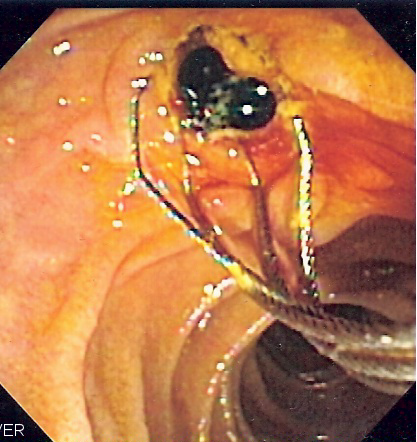

# COLEDOCOLITÍASE

A coledocolitíase é a presença de cálculos no interior do ducto biliar comum (colédoco). Para a sua prova de residência, você precisa entender que não estamos falando apenas de uma "pedra no caminho", mas de uma condição que serve de gatilho para as complicações mais graves da árvore biliar: a colangite aguda e a pancreatite biliar.

Muitos alunos confundem a conduta da colelitíase (pedra na vesícula) com a da coledocolitíase. O Dr. Will sempre reforça nas discussões de caso: a vesícula é um reservatório, mas o colédoco é uma via de trânsito. Se o trânsito para, o sistema inteiro entra em colapso.

## Fisiopatologia e Classificação: O "Porquê" da Origem

*Figura 1 - Imagem fluoroscópica de colangiopancreatografia retrógrada endoscópica (CPRE) demonstrando cálculo impactado no colédoco distal. Fonte: Samir, CC BY-SA 3.0 | Wikimedia Commons*

Para entender o tratamento, você deve saber de onde o cálculo veio. Dividimos a coledocolitíase em duas categorias fundamentais:

### Coledocolitíase Secundária (90% dos casos)

É a mais comum em provas. O cálculo se formou na vesícula biliar, atravessou o ducto cístico e se alojou no colédoco.

- **Composição:** Geralmente são cálculos de colesterol (amarelos).

- **Mecanismo:** Migração. Por isso, quase sempre o paciente tem colelitíase associada.

### Coledocolitíase Primária (10% dos casos)

O cálculo se forma diretamente no colédoco.

- **Composição:** Cálculos de pigmento marrom.

- **Por que eles se formam lá?** Devido à estase biliar e infecção crônica. Pense em pacientes com dilatações císticas, estenoses de via biliar ou infestações parasitárias (como o *Clonorchis sinensis*).

- **Dica de Prova:** Se a questão menciona um paciente que já retirou a vesícula há mais de 2 anos e agora apresenta um cálculo de pigmento marrom no colédoco, a banca está descrevendo uma litíase primária (ou residual tardia).

### Coledocolitíase Residual vs. Recidivante

- **Residual:** Descoberta até 2 anos após a colecistectomia. O cirurgião "esqueceu" o cálculo lá ou ele passou despercebido.

- **Recidivante:** Descoberta após 2 anos da cirurgia. Consideramos que um novo cálculo se formou no colédoco (primário).

## Quadro Clínico: A Icterícia Flutuante

Diferente do câncer de cabeça de pâncreas, onde a icterícia é "colestática, progressiva e indolor", na coledocolitíase a icterícia costuma ser **flutuante**.

O cálculo funciona como uma "válvula": ele obstrui, a pressão sobe, o ducto dilata, o cálculo flutua, a bile passa, a icterícia melhora. Depois, ele impacta de novo.

### O Exame Físico e os Sinais Clássicos

- **Icterícia:** Predomínio de Bilirrubina Direta (BD).

- **Dor em Hipocôndrio Direito:** Semelhante à cólica biliar, mas muitas vezes mais prolongada.

- **Sinal de Courvoisier-Terrier:** Vesícula palpável e indolor em paciente ictérico. **Cuidado:** Isso NÃO costuma acontecer na coledocolitíase. Se a vesícula é palpável, a obstrução é distal e crônica (geralmente neoplásica). Na litíase, a vesícula costuma ser fibrótica e não dilata tanto.

### Laboratório: O Perfil Colestático

Você encontrará o aumento das enzimas canaliculares antes mesmo da subida das bilirrubinas:

- **Gama-GT e Fosfatase Alcalina (FA):** Elevadas precocemente.

- **Bilirrubina Direta:** Elevada.

- **TGO/TGP (AST/ALT):** Podem ter uma elevação transitória e aguda (pico) logo após a migração do cálculo, simulando uma hepatite, mas caem rapidamente.

**Pérola de Prova:** Icterícia obstrutiva crônica leva à deficiência de vitaminas lipossolúveis (A, D, E, **K**). A falta de Vitamina K reduz a síntese dos fatores II, VII, IX e X, o que **alarga o INR**. Se o paciente tem INR alto por colestase, a administração de Vitamina K parenteral costuma corrigir o problema (Prova de Kohler positiva), diferenciando de uma insuficiência hepatocelular grave.

## Diagnóstico e Estratificação de Risco

Este é o tópico mais cobrado. Você não deve pedir CPRE (Colangiopancreatografia Retrógrada Endoscópica) para todo mundo. Por quê? Porque a CPRE tem um risco de 5-10% de complicações, como pancreatite pós-CPRE, sangramento e perfuração.

A estratégia atual baseia-se nos critérios da ASGE (American Society for Gastrointestinal Endoscopy), amplamente adotados no Brasil.

### Tabela 1: Estratificação de Risco para Coledocolitíase

| Risco | Critérios (Preditores) | Conduta Inicial |
| --- | --- | --- |
| **Muito Alto** | Cálculo no colédoco visto no USG **OU** Bilirrubina Total (BT) > 4 mg/dL + Colédoco dilatado no USG **OU** Colangite Aguda | CPRE direta |
| **Alto** | BT entre 1,8 e 4 mg/dL **OU** Colédoco dilatado no USG (> 6mm) | Avaliação adicional (CPRM ou USG Endoscópico) ou CPRE |
| **Intermediário** | Enzimas hepáticas alteradas (FA/GGT/TGO/TGP) **OU** Idade > 55 anos **OU** História de pancreatite biliar | Colangiorressonância (CPRM) ou USG Endoscópico ou Colangiografia Intraoperatória |
| **Baixo** | Nenhum dos preditores acima | Colecistectomia sem exames adicionais de via biliar |

**Atenção ao "Pulo do Gato":** Se o USG mostrou o cálculo dentro do colédoco, o risco é **Muito Alto**. Não perca tempo com Ressonância; vá direto para a CPRE terapêutica. No MedEvo, sempre lembramos: a CPRM é excelente para diagnosticar, mas ela não trata nada.

### Exames de Imagem: Qual escolher?

- **Ultrassonografia (USG):** É o primeiro exame. Ótimo para ver a vesícula e a dilatação do colédoco (> 6mm é suspeito), mas ruim para ver o cálculo no colédoco distal (o gás intestinal atrapalha).

- **Colangiorressonância (CPRM):** É o padrão-ouro não invasivo. Tem sensibilidade > 90%. **Dica de prova:** A CPRM deve ser feita preferencialmente sem contraste para maior segurança e rapidez, pois o próprio líquido biliar serve como contraste natural (sequências pesadas em T2).

- **Ultrassom Endoscópico (USE):** Tão bom quanto a CPRM, mas invasivo. Excelente para cálculos muito pequenos (< 3mm) ou quando a CPRM é contraindicada (marcapasso antigo, claustrofobia).

- **Tomografia (TC):** Frequentemente solicitada na emergência, mas **cuidado**: a TC é ruim para ver cálculos de colesterol (isodensos à bile). Ela serve mais para descartar neoplasias ou ver complicações como pancreatite.

## Tratamento: O Manejo Passo a Passo

O objetivo é um só: limpar a via biliar e, se a vesícula ainda estiver lá, retirá-la para evitar recidiva.

*Figura 2 - Imagem endoscópica mostrando dois cálculos de pigmento extraídos do colédoco após esfincterotomia endoscópica. Fonte: Samir (The Scope), CC BY 2.5 | Wikimedia Commons*

### 1. CPRE (Colangiopancreatografia Retrógrada Endoscópica)

É o tratamento de escolha na maioria dos centros.

- **Como funciona:** O endoscopista acessa a papila duodenal, faz uma papilotomia (corte no esfíncter de Oddi) e retira os cálculos com uma cesta (Dormia) ou balão extrator.

- **Quando fazer?** Preferencialmente **antes** da colecistectomia (se o risco for muito alto) ou no pós-operatório se um cálculo residual for detectado.

### 2. Exploração Cirúrgica da Via Biliar

Se o paciente já vai para a mesa de cirurgia para retirar a vesícula (colecistectomia laparoscópica), o cirurgião pode explorar o colédoco no mesmo ato.

- **Via Transcística:** Para cálculos pequenos e colédoco fino.

- **Coledocotomia:** Abertura direta do colédoco. Indicada para cálculos grandes ou múltiplos. Após abrir o colédoco, pode-se deixar um **Dreno de Kehr (Dreno em T)** para evitar estenose e permitir colangiografias pós-operatórias.

### 3. Derivações Biliodigestivas

Quando o colédoco está muito dilatado (> 1,5 - 2,0 cm) ou existem múltiplos cálculos que não podem ser removidos (litíase primária recorrente), fazemos uma "ponte" entre a via biliar e o intestino.

- **Coledocoduodenostomia (Cirurgia de Maden):** Anastomose látero-lateral entre o colédoco e o duodeno.

- **Coledocojejunostomia em Y de Roux:** Mais complexa, usada em casos de dilatações maiores ou cistos.

**Erro comum em prova:** Achar que todo cálculo de colédoco exige dreno de Kehr. Hoje, com a laparoscopia avançada, a tendência é o fechamento primário do colédoco ou a resolução via CPRE.

## Complicações Específicas e Síndromes Raras

As bancas adoram testar se você conhece as variações da doença litiásica.

### Síndrome de Mirizzi

Ocorre quando um cálculo impactado no ducto cístico ou no infundíbulo da vesícula (Bolsa de Hartmann) causa uma **compressão extrínseca** do ducto hepático comum.

- **Clínica:** Icterícia obstrutiva + Colecystite.

- **Classificação de Csendes:**

- Tipo I: Apenas compressão extrínseca.

- Tipo II: Fístula colecistobiliar envolvendo até 1/3 da circunferência do colédoco.

- Tipo III: Fístula envolvendo até 2/3.

- Tipo IV: Fístula destruindo toda a parede do colédoco.

- Tipo V: Qualquer tipo anterior + fístula colecistoentérica (íleo biliar).

### Íleo Biliar

É uma complicação de uma fístula entre a vesícula e o duodeno. Um cálculo grande (> 2,5 cm) passa para o intestino e impacta geralmente na **válvula ileocecal** (ponto mais estreito).

- **Tríade de Rigler (Clássica em Provas):**

- Obstrução intestinal (níveis hidroaéreos).

- Cálculo biliar ectópico (geralmente na fossa ilíaca direita).

- Aerobilia (ar dentro da via biliar).

- **Tratamento:** Enterolitotomia (retirar o cálculo do intestino). A colecistectomia e o fechamento da fístula podem ser feitos em um segundo tempo, pois o paciente costuma estar grave e inflamado.

### Síndrome de Bouveret

Uma variante rara do íleo biliar onde o cálculo impacta no **bulbo duodenal**, causando uma obstrução gástrica alta.

## Cistos de Colédoco (Classificação de Todani)

Embora sejam malformações congênitas, frequentemente se manifestam com cálculos e icterícia, sendo um tema "quente" em cirurgia biliar.

### Tabela 2: Classificação de Todani

| Tipo | Descrição | Conduta |
| --- | --- | --- |
| **I** | Dilatação fusiforme do colédoco (Mais comum - 80%) | Excisão do cisto + Derivação em Y de Roux |
| **II** | Divertículo sacular na parede do colédoco | Excisão do divertículo |
| **III** | Coledococele (dilatação na porção intraduodenal) | Desbridamento endoscópico ou ressecção |
| **IV** | Múltiplas dilatações intra e extra-hepáticas | Ressecção do extra-hepático + Transplante (se grave) |
| **V** | **Doença de Caroli** (dilatações apenas intra-hepáticas) | Transplante hepático ou hepatectomia parcial |

**Por que operar cistos de colédoco?** Pelo altíssimo risco de **Colangiocarcinoma** (câncer da via biliar). A estase biliar e a junção pancreatobiliar anômala (que permite refluxo de suco pancreático para a bile) são carcinogênicos.

## Colangite Aguda: A Emergência da Coledocolitíase

Se a bile obstruída infectar (geralmente por *E. coli*, *Klebsiella* ou *Enterococcus*), temos uma colangite.

- **Tríade de Charcot:** Dor abdominal + Icterícia + Febre com calafrios. (Presente em 50-70%).

- **Pêntade de Reynolds:** Tríade de Charcot + Hipotensão + Alteração do nível de consciência. Indica colangite supurativa grave e choque séptico.

**Conduta na Colangite:**

- Estabilização hemodinâmica + Antibioticoterapia (ex: Ceftriaxone + Metronidazol).

- **Descompressão biliar de urgência:** Geralmente por CPRE. Se a CPRE falhar, drenagem percutânea ou, em último caso, cirurgia aberta.

## Situações Especiais

### Gestantes

A coledocolitíase na gestação deve ser tratada. A CPRE pode ser realizada com proteção abdominal contra radiação (ou sem fluoroscopia, por profissionais experientes). A colecistectomia é preferencialmente realizada no segundo trimestre.

### Idosos e Comorbidades

Em pacientes muito idosos ou com risco cirúrgico proibitivo, pode-se realizar apenas a CPRE com papilotomia para "limpar" o colédoco e deixar a vesícula lá (colecistectomia *in situ*). O risco de novos eventos biliares existe, mas é pesado contra o risco cirúrgico.

### Coledocolitíase na Infância

Geralmente associada a doenças hemolíticas (cálculos de bilirrubinato de cálcio - pretos). O manejo é semelhante, mas a investigação etiológica da hemólise é obrigatória.

## Pontos-Chave para Prova 🎯

- **Padrão-Ouro Diagnóstico:** Colangiorressonância (CPRM) é o melhor exame não invasivo. CPRE é o padrão-ouro terapêutico.

- **Critério de "Muito Alto Risco":** Cálculo visto no USG ou Bilirrubina Total > 4 + colédoco dilatado. Conduta: CPRE direta.

- **Critério de "Risco Intermediário":** Idade > 55 anos, alteração de enzimas hepáticas ou história de pancreatite. Conduta: CPRM ou Colangiografia Intraoperatória.

- **Cálculo Primário:** Geralmente de pigmento marrom, formado por estase/infecção. Comum em pacientes colecistectomizados há mais de 2 anos.

- **Síndrome de Mirizzi:** Icterícia por compressão extrínseca. O erro clássico é achar que o cálculo está dentro do colédoco; ele está no cístico/infundíbulo.

- **Íleo Biliar:** Tríade de Rigler (Aerobilia + Obstrução Intestinal + Cálculo Ectópico).

- **Todani Tipo I:** É o cisto de colédoco mais comum. Tratamento é ressecção completa pelo risco de câncer.

- **Todani Tipo V:** Doença de Caroli (intra-hepático).

- **Vitamina K:** A icterícia obstrutiva prolongada aumenta o INR. A correção com Vitamina K parenteral (Prova de Kohler) indica que a função hepática está preservada, o problema é a absorção.

- **Dreno de Kehr:** Utilizado após coledocotomia para drenagem de segurança e colangiografia pós-op. Deve permanecer por cerca de 14 a 21 dias.

- **Colangiografia Intraoperatória:** Deve ser feita rotineiramente em muitos serviços ou sempre que houver dúvida sobre a anatomia ou suspeita de cálculo migrado. Se vier normal, a via biliar está limpa.

- **CPRE Pós-Operatória:** Indicada se um cálculo for identificado na colangiografia intraoperatória e o cirurgião não conseguir retirá-lo por via laparoscópica.

- **Contraindicação Absoluta à CPRE:** Obstrução anatômica que impeça o alcance do duodeno (ex: algumas cirurgias bariátricas com Y de Roux, embora existam técnicas de CPRE assistida por enteroscopia).

- **O que NÃO fazer:** Não pedir CPRE para pacientes de baixo risco. Não ignorar um colédoco dilatado no USG, mesmo com bilirrubinas normais (investigar com CPRM).

- **Sinal de Courvoisier-Terrier:** Icterícia + Vesícula palpável = Pense em Câncer (Cabeça de Pâncreas ou Ampuloma), raramente em coledocolitíase.

- **Tratamento da Colangite:** O passo mais importante após estabilizar e iniciar ATB é a **descompressão da via biliar**. Sem drenagem, o ATB não chega ao foco infeccioso devido à alta pressão intraductal.

 Cópia offline para consulta pessoal.
 Fonte original:
 [https://www.medevo.com.br/material-apoio/ler/47909812-f4a6-453c-a6cf-c475f8b45c4b](https://www.medevo.com.br/material-apoio/ler/47909812-f4a6-453c-a6cf-c475f8b45c4b)
