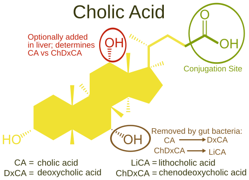
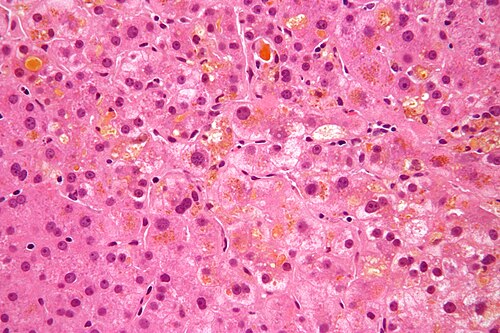

# COLESTASE INTRA-HEPÁTICA DA GESTAÇÃO

A Colestase Intra-Hepática da Gestação, ou CIHG, é um tema que despenca em provas de residência, não apenas pela sua frequência, mas porque ela exige que você saiba diferenciar o que é fisiológico do que é patológico no fígado da gestante. Se você entender o mecanismo por trás do prurido e o risco real para o feto, você nunca mais errará uma questão sobre isso.

Para começar, entenda que a CIHG é a doença hepática específica da gestação mais comum. Guarde bem essa frase: "específica da gestação". Se a prova perguntar qual a causa mais comum de icterícia na gravidez, a resposta costuma ser Hepatite Viral. Mas, se a pergunta focar em doenças que só acontecem por causa da gravidez, a CIHG ganha o troféu de primeiro lugar.

## Fisiopatologia: Por que o fígado "trava"?

*Figura 1 - Estrutura molecular do ácido cólico e sua relação com os demais ácidos biliares humanos, cujo acúmulo sérico é responsável pelo prurido e pela toxicidade fetal na CIHG. Fonte: Mcstrother, CC BY 3.0 | Wikimedia Commons*

Você já se perguntou por que essa doença só aparece, geralmente, no final do segundo ou no terceiro trimestre? A resposta está nos hormônios. Durante a gestação, temos níveis altíssimos de estrogênio e progesterona. Esses esteroides, em mulheres geneticamente predispostas, interferem nos transportadores de ácidos biliares nos hepatócitos.

Imagine o hepatócito como uma casa que precisa colocar o lixo (ácidos biliares) para fora através de portões específicos (transportadores como o ABCB4 e ABCB11). Sob a influência maciça do estrogênio, esses portões param de funcionar direito. O "lixo" acumula dentro da célula e acaba vazando para o sangue.

O acúmulo desses ácidos biliares na circulação sistêmica é o grande vilão. Na pele, eles causam o prurido insuportável. No feto, eles são tóxicos e podem causar o desfecho que todo obstetra teme: a morte súbita fetal.

## Quadro Clínico: O Prurido que não deixa dormir

O sintoma clássico, que aparece em 99% das questões, é o prurido. Mas não é qualquer coceira. O prurido da CIHG tem "sobrenome": ele é predominantemente palmo-plantar e tem piora noturna.

Muitas vezes, a paciente chega ao consultório com escoriações pelo corpo de tanto coçar, mas sem nenhuma lesão cutânea primária (como pápulas ou vesículas). Se houver lesão de pele primária, você deve pensar em outras dermatoses da gestação ou até em escabiose.

Aqui vai uma dica do Dr. Will para a sua prática e para a prova: se a paciente tem prurido intenso nas palmas das mãos e plantas dos pés, sem rash cutâneo, no terceiro trimestre, a sua principal hipótese DEVE ser Colestase Intra-Hepática.

A icterícia é um sinal tardio e menos frequente, ocorrendo em apenas 10 a 25% dos casos. Ela costuma aparecer de 1 a 4 semanas após o início do prurido. Se a paciente já chega ictérica logo de cara, sem prurido prévio, abra o olho para outros diagnósticos diferenciais como hepatites ou colelitíase.

## Diagnóstico Laboratorial: O que pedir e o que esperar

O diagnóstico da CIHG é clínico-laboratorial. Você suspeita pelo prurido e confirma com os exames.

### Ácidos Biliares Séricos

Este é o padrão-ouro. O valor de corte que a maioria das bancas utiliza, baseada na FEBRASGO e em diretrizes internacionais, é de 10 µmol/L.

- Ácidos biliares > 10 µmol/L: Confirma o diagnóstico.

- Ácidos biliares > 40 µmol/L: Indica um risco fetal aumentado.

- Ácidos biliares > 100 µmol/L: Alto risco de morte fetal (colestase grave).

### Transaminases (TGO/AST e TGP/ALT)

Elas podem estar aumentadas em até 70% dos casos, mas a elevação costuma ser leve a moderada (geralmente não ultrapassam 10 vezes o valor de referência). Se você vir transaminases na casa dos 1000 U/L, pense em Hepatite Viral ou Esteatose Hepática Aguda da Gravidez, não em colestase pura.

### Fosfatase Alcalina (FA)

Cuidado aqui! Esta é uma pegadinha clássica de prova. A Fosfatase Alcalina aumenta fisiologicamente na gestação porque a placenta também produz essa enzima. Portanto, uma FA elevada isoladamente na gestante não serve para diagnosticar colestase. Para o diagnóstico de CIHG, focamos nos ácidos biliares e nas transaminases.

### Bilirrubinas

Podem estar aumentadas, principalmente a fração direta, mas raramente ultrapassam 5-6 mg/dL.

### Tabela 1: Perfil Laboratorial na CIHG

| Exame | Comportamento na CIHG | Observação Importante |
| --- | --- | --- |
| Ácidos Biliares | Elevados (> 10 µmol/L) | Exame mais sensível e específico |
| TGO / TGP | Elevadas (leve a moderada) | Podem estar normais em casos iniciais |
| Bilirrubina Direta | Pode estar elevada | Presente em apenas 20% dos casos |
| Fosfatase Alcalina | Elevada | Pouco útil (sobe fisiologicamente na gravidez) |
| Tempo de Protrombina | Geralmente normal | Pode alterar se houver má absorção de Vitamina K |

## Diagnóstico Diferencial: Não confunda as "Icterícias"

Este é o ponto onde os alunos mais erram. A prova vai te dar uma gestante no terceiro trimestre com alteração hepática e você precisa decidir entre CIHG, Síndrome HELLP e Esteatose Hepática Aguda da Gravidez (EHAG).

### CIHG vs. Síndrome HELLP

Na Síndrome HELLP, o quadro é de pré-eclâmpsia grave. A paciente tem hipertensão (na maioria das vezes), dor no quadrante superior direito, plaquetopenia e hemólise (elevação de LDH e esquizócitos). Na CIHG, o prurido é o protagonista e não há hipertensão ou plaquetopenia.

*Figura 2 - Micrografia em grande aumento mostrando colestase hepática com acúmulo de bile nos canalículos (coloração H&E). Fonte: Nephron, CC BY-SA 3.0 | Wikimedia Commons*

### CIHG vs. Esteatose Hepática Aguda da Gravidez (EHAG)

A EHAG é uma emergência catastrófica. Ocorre no terceiro trimestre e a paciente apresenta insuficiência hepática grave. Os sinais cardinais são: hipoglicemia severa, coagulopatia (alargamento de TP e queda de fibrinogênio) e lesão renal aguda. Na CIHG, a função sintética do fígado (glicose e coagulação) costuma estar preservada.

### CIHG vs. Doenças Biliares

Lembre-se das pérolas clínicas: a colecistite aguda é a segunda urgência cirúrgica não ginecológica mais comum na gravidez. Se a paciente tem dor em hipocôndrio direito, sinal de Murphy positivo, febre e leucocitose, o diagnóstico é colecistite, não colestase intra-hepática. A ultrassonografia de abdome é fundamental para diferenciar.

### Tabela 2: Diferencial das Patologias Hepáticas na Gravidez

| Característica | CIHG | Síndrome HELLP | EHAG |
| --- | --- | --- | --- |
| Sintoma Principal | Prurido palmo-plantar | Dor epigástrica / Mal-estar | Náuseas / Vômitos / Icterícia |
| Hipertensão | Ausente | Presente (geralmente) | Variável |
| Ácidos Biliares | Muito elevados | Normais ou leve aumento | Elevados |
| Plaquetas | Normais | Baixas (< 100.000) | Baixas (tardiamente) |
| Glicemia | Normal | Normal | Hipoglicemia (Marcante) |
| Coagulopatia | Rara | Por consumo (CIVD) | Grave (Insuficiência Hepática) |

## Riscos Fetais: O perigo invisível

Por que nos preocupamos tanto com a CIHG se a mãe "apenas" coça? Porque o feto corre risco de morte súbita. Os ácidos biliares elevados causam:

- Vasoconstrição dos vasos da placenta e do cordão umbilical.

- Arritmias cardíacas fetais (efeito tóxico direto no miocárdio fetal).

- Aumento da motilidade intestinal fetal, levando à eliminação de mecônio.

O grande problema é que os métodos tradicionais de avaliação do bem-estar fetal, como a cardiotocografia e o perfil biofísico fetal, não são bons preditores da morte súbita na CIHG. O evento é agudo. Por isso, o manejo baseia-se muito mais nos níveis de ácidos biliares e na idade gestacional do que nos exames de vitalidade.

## Tratamento Farmacológico: Ácido Ursodesoxicólico

O tratamento de primeira escolha é o Ácido Ursodesoxicólico (Ursodiol).

Por que usamos o Ursodiol? Ele é um ácido biliar hidrofílico (não tóxico) que compete com os ácidos biliares endógenos tóxicos. Ele ajuda a "limpar" os ácidos biliares do sangue materno, melhora o prurido e reduz as transaminases. Embora o impacto exato na redução da mortalidade fetal ainda seja debatido em grandes estudos recentes (como o PITCHES trial), ele continua sendo a recomendação padrão das diretrizes brasileiras e internacionais para controle sintomático e bioquímico.

- Dose: 10 a 15 mg/kg/dia, divididos em 2 ou 3 tomadas. Geralmente começamos com 300 mg, 2 a 3 vezes ao dia.

- Objetivo: Alívio do prurido e redução dos níveis de ácidos biliares.

Outras opções (segunda linha ou adjuvantes):

- Colestiramina: É uma resina de troca que se liga aos ácidos biliares no intestino. É menos eficaz que o Ursodiol e pode interferir na absorção de vitaminas lipossolúveis (A, D, E, K). Se usada, deve-se monitorar o tempo de protrombina devido ao risco de deficiência de Vitamina K.

- Anti-histamínicos: Podem ser usados para ajudar no sono (devido ao efeito sedativo), mas não tratam a causa do prurido.

## Manejo Obstétrico: Quando interromper?

Esta é a decisão mais difícil e a que mais cai em prova. O momento do parto depende da gravidade da colestase, medida principalmente pelos ácidos biliares.

Segundo as recomendações atuais (MedEvo segue a tendência das diretrizes mais rigorosas):

- Colestase Leve (Ácidos Biliares 10-39 µmol/L): O risco fetal é baixo. O parto pode ser planejado entre 37 e 39 semanas.

- Colestase Moderada (Ácidos Biliares 40-99 µmol/L): O risco aumenta. Recomenda-se o parto entre 36 e 37 semanas.

- Colestase Grave (Ácidos Biliares ≥ 100 µmol/L): Risco altíssimo de morte fetal. O parto deve ser considerado a partir de 34-36 semanas.

Cuidado: se a paciente apresentar icterícia clínica ou se os ácidos biliares subirem rapidamente apesar do tratamento, a antecipação do parto é mandatória.

### Tabela 3: Momento do Parto na CIHG

| Nível de Ácidos Biliares | Classificação | Idade Gestacional para Parto |
| --- | --- | --- |
| 10 - 39 µmol/L | Leve | 37 a 39 semanas |
| 40 - 99 µmol/L | Moderada | 36 a 37 semanas |
| ≥ 100 µmol/L | Grave | 34 a 36 semanas |

A via de parto é de indicação obstétrica. A CIHG por si só não é indicação de cesariana. No entanto, como muitas vezes precisamos induzir o parto prematuramente com um colo ainda desfavorável, a taxa de cesariana acaba sendo maior.

## Situações Especiais e Complicações

### Recorrência

A CIHG tem uma alta taxa de recorrência em gestações futuras (40 a 90%). Além disso, mulheres que tiveram CIHG têm maior risco de desenvolver cálculos biliares e doenças hepatobiliares ao longo da vida.

### Vitamina K

Como a colestase reduz a chegada de sais biliares ao intestino, a absorção de vitaminas lipossolúveis pode ficar prejudicada. Se o tempo de protrombina estiver alargado, a reposição de Vitamina K (fitomenadiona) 10 mg por via parenteral é indicada para prevenir hemorragia pós-parto.

### Puerpério

A CIHG é uma condição reversível. O prurido costuma desaparecer em 48 a 72 horas após o parto. As transaminases e os ácidos biliares devem ser reavaliados após 6 a 12 semanas para garantir que voltaram ao normal. Se os exames continuarem alterados, você deve investigar uma doença hepática crônica pré-existente que foi "desmascarada" pela gravidez.

## Diagnóstico Diferencial de Prurido na Gestação

Nem toda grávida que coça tem colestase. As bancas adoram colocar outras dermatoses no meio das alternativas.

- Erupção Polimórfica da Gravidez (PEP/PUPPP): São pápulas e placas urticariformes que começam nas estrias abdominais e POUPAM a região periumbilical. Coça muito, mas não altera exames laboratoriais e não traz risco fetal.

- Penfigoide Gestacional: É uma doença autoimune com formação de bolhas. Diferente da PEP, ela ACOMETE a região umbilical.

- Escabiose: Prurido generalizado, mas com lesões características (sulcos, pápulas) e história familiar de coceira. O tratamento é com Permetrina 5% (primeira linha) ou Enxofre 5-10% em casos específicos. Ivermectina deve ser evitada na gestação.

## Casos Clínicos Rápidos para Fixação

Exemplo 1: Gestante, 34 semanas, queixa de prurido intenso em mãos e pés que piora à noite. Sem lesões de pele. Exames: TGO 80, TGP 95, Ácidos Biliares 45 µmol/L.

- Diagnóstico: CIHG moderada.

- Conduta: Iniciar Ursodiol e planejar parto com 36-37 semanas.

Exemplo 2: Gestante, 32 semanas, dor epigástrica, vômitos e icterícia. Exames: Glicemia 45 mg/dL, TP alargado, Fibrinogênio baixo, Creatinina 1.8.

- Diagnóstico: Esteatose Hepática Aguda da Gravidez (EHAG).

- Conduta: Estabilização e interrupção imediata da gestação (emergência!).

Exemplo 3: Gestante, 28 semanas, prurido abdominal sobre as estrias, poupando o umbigo. Transaminases e ácidos biliares normais.

- Diagnóstico: Erupção Polimórfica da Gravidez (PUPPP).

- Conduta: Corticoide tópico e anti-histamínicos. Tranquilizar sobre o risco fetal (zero).

## Pontos-Chave para Prova

- A CIHG é a causa mais comum de prurido sem lesão de pele no 3º trimestre.

- O sintoma clássico é o prurido palmo-plantar com piora noturna.

- O diagnóstico é confirmado por Ácidos Biliares > 10 µmol/L.

- A Fosfatase Alcalina não é confiável para o diagnóstico (sobe fisiologicamente pela placenta).

- O principal risco fetal é a morte súbita, que não é bem prevenida por CTG ou Perfil Biofísico.

- O tratamento de primeira escolha é o Ácido Ursodesoxicólico (10-15 mg/kg/dia).

- Ácidos biliares ≥ 100 µmol/L indicam colestase grave e parto a partir de 34 semanas.

- Diferencial importante: EHAG causa hipoglicemia e coagulopatia; HELLP causa plaquetopenia e hemólise.

- A icterícia na CIHG é obstrutiva (aumento de bilirrubina direta) e ocorre em minoria dos casos.

- A CIHG não é contraindicação para parto vaginal.

- Os sintomas e exames devem normalizar após o parto; se persistirem após 12 semanas, investigar hepatopatia crônica.

- Contraindicação absoluta ao Ursodiol: Hipersensibilidade aos ácidos biliares ou obstrução biliar completa comprovada.

- Erro comum: Achar que a CIHG é a principal causa de icterícia na gravidez (é a Hepatite Viral).

- Pegadinha: A banca diz que a paciente tem prurido e lesões vesiculares no umbigo. Isso é Penfigoide Gestacional, não CIHG.

- Lembre-se: A colecistite aguda no 2º trimestre deve ser tratada preferencialmente com colecistectomia videolaparoscópica. 🩺

 Cópia offline para consulta pessoal.
 Fonte original:
 [https://www.medevo.com.br/material-apoio/ler/c171fee4-4296-4b76-94c2-8a5e8459560a](https://www.medevo.com.br/material-apoio/ler/c171fee4-4296-4b76-94c2-8a5e8459560a)
