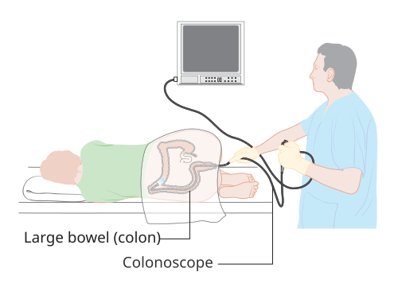
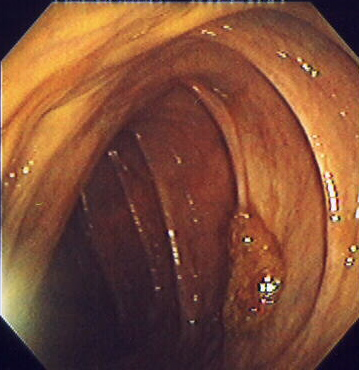

# COLONOSCOPIA E RETOSSIGMOIDOSCOPIA

Para entender a endoscopia colorretal, você precisa parar de ver o exame apenas como um "tubo com câmera" e passar a enxergá-lo como uma ferramenta de decisão clínica e cirúrgica. Nas provas de residência, o examinador não quer saber se você sabe operar o aparelho, mas sim se você sabe **quando indicar**, **quando contraindicar** e **o que fazer** com o que encontrar lá dentro.

## Diferenças Fundamentais: Retossigmoidoscopia vs. Colonoscopia

*Figura 1 - Diagrama ilustrativo do procedimento de colonoscopia, mostrando a inserção do colonoscópio através do cólon até o ceco. Fonte: Cancer Research UK, CC BY-SA 4.0 | Wikimedia Commons*

Muitos alunos confundem as indicações, mas a diferença é anatômica e técnica. A **retossigmoidoscopia flexível** visualiza apenas o reto e o cólon sigmoide (cerca de 60 cm a partir da margem anal). Já a **colonoscopia** visa atingir o ceco e, idealmente, o íleo terminal.

Por que isso importa? Porque se o seu paciente tem um sangramento de origem obscura ou você está fazendo rastreamento de câncer colorretal (CRC), a retossigmoidoscopia pode deixar passar 40-50% das lesões que estão no cólon direito.

**Dica de prova:** A retossigmoidoscopia pode ser feita sem sedação e com preparo apenas por enema (flee-enema), enquanto a colonoscopia exige preparo anterógrado (laxantes orais) e sedação, devido ao desconforto na passagem pelas flexuras hepática e esplênica.

## Indicações e Rastreamento do Câncer Colorretal

Este é o tópico que mais cai. O objetivo principal aqui é interromper a **sequência adenoma-carcinoma**.

Segundo as diretrizes atuais (SBCP e SOBED), o rastreamento para a população de risco habitual deve começar aos **45 anos**. Antigamente falávamos em 50 anos, mas a incidência em pacientes jovens subiu, e as bancas já estão cobrando os 45 anos.

### Estratégias de Rastreamento

- **Colonoscopia:** O padrão-ouro. Se normal, repetimos a cada 10 anos.

- **Pesquisa de Sangue Oculto nas Fezes (PSOF) imunoquímica:** Se positiva, a colonoscopia é obrigatória. Se negativa, repete-se anualmente.

- **Retossigmoidoscopia:** A cada 5 anos (menos usada isoladamente hoje em dia).

**Cuidado com os Tumores Sincrônicos:** Se você encontrar um câncer no sigmoide durante a colonoscopia, você **deve** tentar examinar o restante do cólon. Cerca de 3% a 5% dos pacientes com câncer colorretal apresentam um segundo tumor em outro segmento do cólon ao mesmo tempo. Isso muda completamente o planejamento cirúrgico.

## Preparo de Cólon e Qualidade do Exame

Um exame só é confiável se o preparo for adequado. Usamos a **Escala de Boston** para graduar a limpeza (0 a 9 pontos). Se o preparo for ruim (Boston < 6 ou algum segmento com nota 0-1), o exame deve ser repetido em curto prazo, geralmente em 1 ano ou menos, pois o risco de perder um pólipo plano é altíssimo.

**Erro clássico de prova:** Achar que "preparo ruim" significa apenas que o médico "viu menos". Na verdade, um preparo ruim invalida o intervalo de 10 anos do rastreamento.

## Contraindicações: Onde mora o perigo

Aqui é onde o aluno "perde o braço" na prova. Existe uma contraindicação que é a favorita das bancas: **Diverticulite Aguda**.

**Por que não fazemos colonoscopia na diverticulite aguda?**
Imagine o cólon inflamado, com microperfurações bloqueadas pela gordura pericólica ou pelo epíplon. Se você introduz um aparelho e, pior, insufla ar (pressão positiva), você vai transformar uma microperfuração em uma perfuração livre.

- **Conduta correta:** Na fase aguda da diverticulite, o diagnóstico é por Tomografia (TC). A colonoscopia só deve ser realizada **6 a 8 semanas após** a resolução do quadro inflamatório para excluir neoplasia mascarada pela inflamação.

### Outras Contraindicações Absolutas:

- Perfuração intestinal suspeita ou confirmada.

- Abdome agudo obstrutivo (exceto para fins terapêuticos específicos, como veremos adiante).

- Colite fulminante ou Megacólon tóxico (risco altíssimo de perfuração).

- Infarto agudo do miocárdio recente ou instabilidade hemodinâmica grave.

## Pólipos Colônicos: Diagnóstico e Conduta

O pólipo é o precursor do câncer. Encontrou? Tem que tirar. A conduta padrão é a **polipectomia endoscópica** ou a **mucosectomia**.

### Classificação de Pólipos

Os pólipos podem ser:

- **Pediculados:** Têm uma "haste". São mais fáceis de ressecar com alça diatérmica.

- **Sésseis:** São "achatados" contra a mucosa.

**Pérola Clínica:** Mesmo pólipos pediculados maiores que 1 cm devem ser retirados na mesma colonoscopia, se houver segurança técnica. Não se "deixa para depois" um pólipo que já foi visualizado e é passível de ressecção.

### O que define o seguimento pós-polipectomia?

Não decore tabelas gigantes, entenda os critérios de alto risco para recorrência:

- Número de pólipos (≥ 3 adenomas).

- Tamanho (≥ 10 mm).

- Histologia (Componente viloso ou Displasia de alto grau).

- Pólipos serrilhados sésseis.

Se o paciente tem qualquer um desses, o intervalo para a próxima "colono" cai de 10 anos para 3 anos (ou até menos, dependendo do caso).

| Tipo de Pólipo | Risco de Malignização | Conduta |
| --- | --- | --- |
| Adenoma Tubular | Baixo | Ressecção + Seguimento |
| Adenoma Tubuloviloso | Intermediário | Ressecção + Seguimento rigoroso |
| Adenoma Viloso | Alto | Ressecção + Seguimento rigoroso |
| Pólipo Hiperplásico (Reto) | Desprezível | Ressecção (se >5mm) ou Observação |

## Câncer de Reto e o Papel da Ultrassonografia Endoscópica (EUS)

Aqui o Dr. Will sempre reforça: o reto é "outro mundo" comparado ao cólon. No reto, temos o desafio do espaço extraperitoneal e a necessidade de preservar o esfíncter anal.

Para tumores retais precoces, a colonoscopia diagnóstica não é suficiente. Precisamos saber a profundidade da invasão na parede (T) e se há linfonodos acometidos (N).

- **Ultrassonografia Endorretal (ou EUS):** É o melhor exame para avaliar a invasão da camada submucosa (T1 vs T2).

- **Por que isso importa?** Se o tumor for T1 (restrito à submucosa), sem invasão linfovascular e bem diferenciado, podemos fazer uma **ressecção endoscópica** ou uma microcirurgia endoscópica transanal (TEM/TAMIS), poupando o paciente de uma proctocolectomia com estomia.

*Figura 2 - Imagem endoscópica mostrando a ressecção endomucosa de um pólipo séssil do cólon, técnica utilizada para remoção de lesões neoplásicas precoces. Fonte: Stephen Holland, MD / Kd4ttc, CC BY 2.5 | Wikimedia Commons*

## Colonoscopia de Urgência: Quando o endoscopista salva o cirurgião

Existem três cenários clássicos de urgência que você deve dominar.

### 1. Vólvulo de Sigmoide

Paciente idoso, constipado crônico, chega com distensão abdominal súbita e o clássico sinal do "grão de café" ou "fruto da fava" no Raio-X.

- **Conduta:** Se não houver sinais de peritonite (isquemia/gangrena), a primeira conduta é a **descompressão e detorsão endoscópica** (colonoscopia ou retossigmoidoscopia).

- **Atenção:** A endoscopia resolve a urgência em 80% dos casos, mas o vólvulo recidiva muito. Por isso, após a descompressão, o paciente deve ser internado para realizar uma colectomia eletiva na mesma internação.

### 2. Síndrome de Ogilvie (Pseudo-obstrução Colônica Aguda)

É a distensão maciça do cólon sem obstrução mecânica, comum em pacientes graves, pós-operatórios ou com distúrbios hidroeletrolíticos.

- **Conduta:** Primeiro, medidas conservadoras e correção de eletrólitos. Se o ceco atingir um diâmetro crítico (> 10-12 cm) e não houver resposta à Neostigmina, a **descompressão endoscópica** é indicada para evitar a perfuração cecal.

### 3. Hemorragia Digestiva Baixa (HDB)

A colonoscopia é o exame de escolha tanto para diagnóstico quanto para tratamento (hemostasia com clipes, eletrocoagulação ou adrenalina).

- **Dica MedEvo:** Para fazer colonoscopia na HDB, o paciente deve estar **estabilizado hemodinamicamente**. Se o paciente está chocado e não responde à cristalóide/sangue, a conduta é Angiotomografia ou Arteriografia, não colonoscopia.

## Colite Pseudomembranosa (Clostridioides difficile)

Imagine o cenário: paciente internado há 10 dias tratando pneumonia com ceftriaxone ou clindamicina, começa com diarreia aquosa profusa, fétida, dor abdominal e leucocitose importante.

- **Diagnóstico:** A primeira escolha é a pesquisa das **Toxinas A e B nas fezes** ou o teste de GDH.

- **Onde entra a colonoscopia?** Ela não é a primeira escolha diagnóstica, mas se for feita (em casos de dúvida ou gravidade), encontraremos as **pseudomembranas**: placas amareladas/esbranquiçadas aderidas à mucosa inflamada.

**Tratamento (Diretriz Atual):**

- Vancomicina Oral (125 mg, 6/6h) ou Fidaxomicina.

- Metronidazol agora é reservado apenas para casos leves onde as outras opções não estão disponíveis.

## Estadiamento e o Papel do PET-CT

No câncer colorretal, o estadiamento padrão é feito com TC de Tórax, Abdome e Pelve + CEA.
**Onde entra o PET-CT?** Ele não é um exame de rotina para todos. A diretriz indica o PET-CT principalmente quando há suspeita de **metástases à distância ressecáveis** (especialmente hepáticas) ou quando o CEA está subindo e os exames de imagem convencionais são negativos (recidiva oculta).

**Pegadinha de prova:** Dizer que o PET-CT é "inútil" no câncer colorretal. Falso. Ele é muito útil na avaliação de ressecabilidade de metástases, ajudando a evitar cirurgias desnecessárias se houver doença extra-hepática não detectada pela TC.

## Complicações da Colonoscopia

Nenhum procedimento é isento de riscos. As duas principais complicações são:

- **Sangramento:** Mais comum após polipectomias. Pode ser imediato ou tardio (até 2 semanas depois).

- **Perfuração:** A complicação mais temida.

- Se for uma perfuração pequena, detectada "na hora" em um cólon limpo, pode-se tentar o fechamento com clipes endoscópicos.

- Se o paciente apresentar sinais de peritonite pós-exame, a conduta é **Laparotomia de urgência**.

| Complicação | Momento | Conduta Inicial |
| --- | --- | --- |
| Sangramento Pós-polipectomia | Imediato ou Tardio | Nova endoscopia para hemostasia |
| Perfuração (Sinal de Jobert) | Durante ou Pós-exame | Cirurgia (Laparotomia/Laparoscopia) |
| Síndrome Pós-polipectomia | 1-5 dias após | Jejum, Hidratação, Antibiótico (sem perfuração livre) |

**O que é a Síndrome Pós-polipectomia?** É uma queimadura transmural do cólon pelo bisturi elétrico, sem perfuração livre. O paciente tem dor e sinal de irritação peritoneal, mas o Raio-X **não mostra pneumoperitônio**. O tratamento é conservador. Se houver ar livre, é perfuração e o tratamento é cirúrgico.

## Resumo de Condutas em Pólipos e Lesões

Ao encontrar uma lesão, o endoscopista avalia a **Classificação de Paris** (morfologia) e a **Classificação de Nice ou Kudo** (padrão de vasos e criptas).

Se houver suspeita de **invasão submucosa profunda** (lesão deprimida, padrão de vasos desorganizado), a ressecção endoscópica está contraindicada, pois o risco de metástase linfonodal é alto. Nesse caso, a conduta é biópsia, tatuagem com nanquim (para o cirurgião achar a lesão) e encaminhamento para colectomia com linfadenectomia.

## Pontos-Chave para Prova 🎓

- **Rastreamento Habitual:** Iniciar aos 45 anos (SOBED/SBCP).

- **Diverticulite Aguda:** Contraindicação absoluta para colonoscopia na fase aguda (risco de perfuração). Aguardar 6-8 semanas.

- **Vólvulo de Sigmoide:** Descompressão endoscópica é a conduta inicial de urgência (se não houver peritonite).

- **Colite Pseudomembranosa:** Suspeitar em diarreia pós-antibiótico + leucocitose. Diagnóstico por toxinas nas fezes; pseudomembranas na colonoscopia.

- **Pólipo Pediculado:** Deve ser retirado por polipectomia com alça, mesmo se > 1 cm.

- **Tumor Retal Precoce:** Ultrassonografia Endorretal (EUS) é essencial para avaliar invasão da submucosa (T1).

- **PET-CT:** Indicado na avaliação de metástases colorretais potencialmente ressecáveis ou elevação de CEA com imagem convencional negativa.

- **Síndrome de Ogilvie:** Descompressão endoscópica indicada se falha da Neostigmina ou ceco > 12 cm.

- **Tumores Sincrônicos:** Sempre examinar todo o cólon no diagnóstico de um câncer colorretal para excluir um segundo tumor (3-5% dos casos).

- **Hemorragia Digestiva Baixa:** Colonoscopia é diagnóstica e terapêutica, mas exige estabilidade hemodinâmica e preparo de cólon (mesmo na urgência).

- **Perfuração:** Principal sinal clínico pós-colonoscopia é dor abdominal súbita e pneumoperitônio (Sinal de Jobert - perda da macicez hepática).

- **Pólipos de Alto Risco:** ≥ 3 adenomas, ≥ 10 mm, componente viloso ou displasia de alto grau.

- **Preparo de Cólon:** Escala de Boston < 6 exige repetição precoce do exame.

- **Tatuagem com Nanquim:** Fundamental para marcar lesões pequenas ou locais de polipectomia complexa que precisarão de revisão ou cirurgia futura.

- **Anticoagulantes:** Devem ser manejados conforme o risco trombótico do paciente e o risco hemorrágico do procedimento (polipectomia é alto risco).

- **O que NÃO fazer:** Nunca insuflar ar excessivamente em um paciente com suspeita de colite grave ou obstrução intestinal distal sem válvula ileocecal competente.

 Cópia offline para consulta pessoal.
 Fonte original:
 [https://www.medevo.com.br/material-apoio/ler/20d67d35-68c0-4ddc-9b6a-999937a1ec8b](https://www.medevo.com.br/material-apoio/ler/20d67d35-68c0-4ddc-9b6a-999937a1ec8b)
