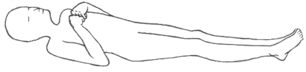
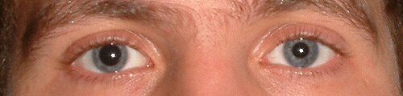

# COMA E ALTERAÇÕES DA CONSCIÊNCIA

Para entender o coma, você não deve pensar nele como uma doença isolada, mas sim como o estágio final de um insulto cerebral grave. Imagine a consciência como uma lâmpada acesa em uma sala. Para que essa lâmpada funcione, você precisa de duas coisas: energia chegando pelo interruptor e uma lâmpada íntegra. Na neurologia, o interruptor é o Sistema Ativador Reticular Ascendente (SARA), localizado no tronco encefálico, e a lâmpada é o córtex cerebral de forma bilateral.

Se o paciente está em coma, ou o interruptor quebrou (lesão de tronco) ou a lâmpada queimou por completo (lesão cortical difusa). Lesões em apenas um hemisfério cerebral, como um AVC isquêmico unilateral pequeno, não causam coma, a menos que gerem tanto edema que comprimam o tronco encefálico. Guarde isso: para haver coma, a lesão deve ser no tronco ou nos dois hemisférios simultaneamente.

## Fisiopatologia e Definições

*Figura 1 - Ilustração da postura de decorticação: flexão dos membros superiores e extensão dos inferiores, indicando lesão acima do núcleo rubro (hemisférica). Fonte: Delldot, Domínio Público | Wikimedia Commons*

A consciência possui dois componentes fundamentais que as bancas adoram confundir. O primeiro é o nível de consciência (despertar ou *arousal*), que depende do SARA. É a capacidade de abrir os olhos e estar acordado. O segundo é o conteúdo da consciência (percepção ou *awareness*), que depende da integridade do córtex. No coma, ambos estão abolidos. O paciente não desperta e não percebe nada.

Existem estados que mimetizam o coma e que aparecem com frequência em provas de residência. O estado vegetativo, hoje chamado de Síndrome de Vigília Sem Resposta, é aquele em que o interruptor voltou a funcionar (o paciente abre os olhos, tem ciclos de sono e vigília), mas a lâmpada continua queimada (não há interação com o meio). Já no estado minimamente consciente, existe um esboço de percepção, como seguir um objeto com o olhar de forma errática.

Um erro comum é confundir o coma com a Síndrome de *Locked-in* (Enclausuramento). Aqui, o paciente está totalmente consciente, mas houve uma lesão na base da ponte que destruiu as vias motoras descendentes. Ele está "preso" dentro do próprio corpo, conseguindo realizar apenas movimentos oculares verticais e piscar. Se você não testar o olhar vertical, vai achar que ele está em coma.

## Avaliação Inicial: O Protocolo de Emergência

Quando um paciente inconsciente chega à emergência, você não começa fazendo um exame neurológico detalhado. Você segue o ABCDE. O cérebro em sofrimento é extremamente sensível a insultos secundários. Hipóxia e hipotensão transformam uma lesão recuperável em dano permanente.

Um ponto que o Dr. Will sempre enfatiza nas discussões do MedEvo é o uso do "Coquetel do Coma". Antigamente, fazíamos para todos. Hoje, a conduta é mais direcionada, mas você deve ter em mente três substâncias:

- Glicose hipertônica: Se houver hipoglicemia (sempre cheque o HGT!).

- Tiamina (Vitamina B1): Fundamental em etilistas ou desnutridos.

- Naloxona: Se houver suspeita de intoxicação por opioides (pupilas puntiformes e bradipneia).

Cuidado: Nunca dê glicose antes da tiamina em um paciente desnutrido ou alcoólatra. A carga de glicose consome as últimas reservas de B1, podendo precipitar uma Encefalopatia de Wernicke aguda. A prova vai te dar um paciente etilista, você vai corrigir a glicemia e ele vai evoluir com oftalmoplegia e ataxia. O erro foi não ter dado a tiamina antes ou junto.

## Escala de Coma de Glasgow (GCS)

A Escala de Glasgow foi criada para trauma, mas hoje a usamos para quase tudo. Em 2018, ela sofreu uma atualização importante que as bancas já incorporaram. Agora, avaliamos a reatividade pupilar (GCS-P), mas para a maioria das questões, a escala clássica de 15 pontos ainda reina.

### Tabela 1: Escala de Coma de Glasgow Atualizada

| Componente | Resposta | Pontuação |
| --- | --- | --- |
| **Abertura Ocular** | Espontânea | 4 |
| | Ao som / ordem | 3 |
| | À pressão (dor) | 2 |
| | Ausente | 1 |
| **Resposta Verbal** | Orientada | 5 |
| | Confusa | 4 |
| | Palavras inapropriadas | 3 |
| | Sons incompreensíveis | 2 |
| | Ausente | 1 |
| **Resposta Motora** | Obedece a comandos | 6 |
| | Localiza a dor | 5 |
| | Flexão normal (retirada) | 4 |
| | Flexão anormal (decorticação) | 3 |
| | Extensão (descerebração) | 2 |
| | Ausente | 1 |

Um detalhe prático: se o paciente está intubado, a resposta verbal é "T". Se ele tem edema bipalpebral, a abertura ocular é "NT" (não testável). A pontuação mínima é 3 e a máxima é 15. Glasgow menor ou igual a 8 é a indicação clássica de intubação orotraqueal para proteção de via aérea.

Lembre-se da pérola clínica: M3 é decorticação (lesão acima do núcleo rubro, no mesencéfalo alto ou hemisférios). M2 é descerebração (lesão mais baixa, no tronco encefálico), o que indica um prognóstico pior. "De-cor-ticação" lembra "cor", o paciente leva as mãos ao coração (flexão).

## O Exame Neurológico do Coma

Aqui é onde o professor separa quem decorou de quem entendeu. No paciente em coma, focamos em quatro pilares: padrão respiratório, pupilas, movimentos oculares e resposta motora.

### Padrões Respiratórios

O padrão da respiração nos diz o nível da lesão.

- **Cheyne-Stokes:** Ciclos de hiperpneia seguidos de apneia. Sugere lesão hemisférica bilateral ou diencefálica. É comum também em insuficiência cardíaca grave.

- **Hiperventilação Neurogênica Central:** Respiração rápida e profunda. Sugere lesão no mesencéfalo ou ponte superior.

- **Apnêustica:** Pausas inspiratórias. Indica lesão na ponte.

- **Atáxica (Biot):** Totalmente irregular. É o prenúncio da parada respiratória. Indica lesão no bulbo.

### Avaliação Pupilar

As pupilas são a janela para o tronco encefálico. Como as vias simpáticas e parassimpáticas passam por ali, o padrão pupilar é um localizador anatômico preciso.

- **Pupilas Isocóricas e Reativas:** O tronco está preservado. Pense em causas metabólicas (hipoglicemia, intoxicações, encefalopatia hepática).

- **Midríase Unilateral e Arreativa:** O "terror" da neurocirurgia. Indica compressão do III par craniano (oculomotor), geralmente por uma herniação uncal. É uma emergência!

- **Pupilas Puntiformes e Reativas:** Clássico de lesão na ponte (hemorragia pontina) ou uso de opioides (embora no opioide a reatividade seja difícil de ver sem uma lupa).

- **Midríase Bilateral Fixa:** Lesão grave de mesencéfalo ou morte encefálica.

### Tabela 2: Diagnóstico Diferencial por Padrão Pupilar

| Padrão Pupilar | Localização / Causa | Significado Clínico |
| --- | --- | --- |
| Puntiformes (miose extrema) | Ponte ou Opioides | Lesão estrutural de tronco ou intoxicação |
| Médias e fixas | Mesencéfalo | Perda de controle simpático e parassimpático |
| Unilateral dilatada (midríase) | III par (Oculomotor) | Herniação uncal (efeito de massa) |
| Bilateral dilatada e fixa | Mesencéfalo dorsal / ME | Isquemia cerebral global ou herniação central |

*Figura 2 - Fotografia demonstrando anisocoria (assimetria pupilar), achado clínico fundamental na avaliação do paciente comatoso, podendo indicar herniação uncal com compressão do III par craniano. Fonte: Radomil, CC BY-SA 3.0 | Wikimedia Commons*

### Reflexos de Tronco Encefálico

Se o paciente está em coma, você deve testar se o tronco ainda "conversa" com o resto do corpo.

- **Reflexo Fotomotor:** Avalia o II e III pares.

- **Reflexo Córneo-palpebral:** Toca-se a córnea com uma gaze. A via aferente é o Trigêmeo (V) e a eferente é o Facial (VII), que fecha a pálpebra.

- **Reflexo Oculocefálico (Olhos de Boneca):** Você gira a cabeça do paciente. Se os olhos girarem para o lado oposto (como se estivessem fixos em um ponto), o tronco está íntegro. Se os olhos acompanharem o movimento da cabeça, há lesão de tronco. *Atenção: Nunca faça isso em pacientes com suspeita de lesão na coluna cervical!*

- **Reflexo Oculovestibular (Prova Calórica):** Injeta-se água gelada no conduto auditivo. O normal é o desvio lento dos olhos para o lado da água.

## Etiologias: Onde está o problema?

Dividimos as causas de coma em estruturais e não estruturais (metabólicas/tóxicas).

### Causas Estruturais

São aquelas que você vê na Tomografia (TC). Exemplos: Hematoma extradural (intervalo lúcido seguido de coma), hematoma subdural, AVC hemorrágico, tumores com edema.
A Tríade de Cushing é o sinal clássico de hipertensão intracraniana (HIC) grave com risco de herniação: Hipertensão Arterial + Bradicardia + Irregularidade Respiratória. Se vir isso na prova, a resposta geralmente envolve medidas para reduzir a PIC (manitol, solução salina hipertônica, cabeceira elevada) e neurocirurgia.

### Causas Metabólicas e Tóxicas

Aqui a TC de crânio costuma ser normal. O paciente tem um coma "limpo" do ponto de vista estrutural.

- **Encefalopatia de Wernicke:** Tríade clássica de confusão mental, ataxia e oftalmoplegia (nistagmo ou paralisia do reto lateral - VI par). O tratamento é Tiamina IV. Se não tratar, evolui para Síndrome de Korsakoff (amnésia anterógrada e confabulação), que é irreversível.

- **Mielinólise Pontina Central (Síndrome de Desmielinização Osmótica):** Ocorre quando você corrige uma hiponatremia de forma muito rápida. O sódio sobe, a água sai dos neurônios da ponte e a mielina "derrete". O paciente desenvolve tetraparesia e paralisia bulbar dias após a correção.

- **Encefalite Herpética:** Febre, cefaleia e alteração de comportamento/consciência. Tem predileção pelos lobos temporais. O diagnóstico é por líquor (PCR para HSV) e o tratamento é Aciclovir IV o mais rápido possível.

## Morte Encefálica (ME)

Este é, sem dúvida, o tema mais cobrado em provas dentro deste capítulo. No Brasil, seguimos a Resolução CFM 2173/2017. A morte encefálica é a cessação irreversível de todas as funções cerebrais e do tronco encefálico.

### Pré-requisitos para iniciar o protocolo

Você não pode abrir o protocolo de ME para qualquer um. O paciente deve ter:

- Lesão encefálica de causa conhecida e irreversível (ex: um TCE grave, não um "coma a esclarecer").

- Ausência de fatores confundidores: Distúrbios hidroeletrolíticos graves, acidose extrema, hipotermia (T < 35°C), uso de drogas sedativas ou bloqueadores neuromusculares.

- Estabilidade hemodinâmica: PAM ≥ 65 mmHg e SatO2 > 94%.

- Período de observação: No mínimo 6 horas (ou 24h se a causa for hipóxia-isquemia, como pós-parada cardíaca).

### O Exame Clínico

Devem ser realizados dois exames clínicos por médicos diferentes, sendo que pelo menos um deles deve ser especialista (neurologista, neurocirurgião, intensivista ou emergencista).

- **Intervalo entre exames:** Para adultos e crianças acima de 2 anos, o intervalo mínimo é de **1 hora**. (Isso mudou na resolução de 2017, antes eram 6 horas).

- **O que testar:** Coma profundo (Glasgow 3), ausência de reflexos de tronco (fotomotor, córneo-palpebral, oculovestibular, oculocefálico e tosse/vômito).

- **Teste da Apneia:** É o último passo do exame clínico. O paciente é pré-oxigenado e desconectado do ventilador (com oxigênio suplementar). Se o PCO2 subir acima de 60 mmHg e o paciente não esboçar nenhum movimento respiratório, o teste é positivo.

### Exame Complementar

No Brasil, a lei exige um exame complementar que demonstre ausência de atividade elétrica (EEG), ausência de fluxo sanguíneo (Arteriografia, Doppler transcraniano ou Cintilografia) ou ausência de metabolismo cerebral. Não existe um "melhor" exame, mas o Doppler e o EEG são os mais práticos.

### Tabela 3: Intervalos para Exame Clínico em ME (CFM 2173/17)

| Faixa Etária | Intervalo entre os 2 exames clínicos |
| --- | --- |
| 7 dias a < 2 meses | 24 horas |
| 2 meses a < 24 meses | 12 horas |
| ≥ 2 anos (inclui adultos) | 1 hora |

Um erro clássico de prova: dizer que a presença de reflexos medulares (como o sinal de Babinski ou reflexos tendinosos) exclui morte encefálica. Falso! A medula espinhal pode estar viva. O que morre é o encéfalo. Movimentos reflexos complexos, como o "Sinal de Lázaro" (flexão dos braços ao estimular o tronco), também podem ocorrer na ME.

## Diagnóstico Diferencial e Pegadinhas

Ao avaliar um paciente em coma, sempre olhe para o todo. Uma causa comum de rebaixamento de consciência em idosos é o Delirium, que é uma alteração aguda e flutuante da atenção, geralmente causada por infecções (ITU, pneumonia) ou distúrbios metabólicos. Diferente do coma, no delirium o paciente está desperto, mas confuso.

Outra situação é a Síndrome de Encefalopatia Posterior Reversível (PRES). Imagine uma gestante com pré-eclâmpsia ou um paciente com crise hipertensiva que subitamente apresenta cefaleia, convulsão e coma. A RM mostra edema vasogênico nas regiões posteriores (occipitais). O tratamento é o controle rigoroso da pressão arterial.

### Tabela 4: Coma Estrutural vs. Coma Metabólico

| Característica | Estrutural (Ex: Hemorragia) | Metabólico (Ex: Hipoglicemia) |
| --- | --- | --- |
| Início | Geralmente súbito | Geralmente gradual |
| Sinais Focais | Presentes (hemiparesia) | Ausentes (simétrico) |
| Pupilas | Frequentemente assimétricas | Geralmente reativas e simétricas |
| Movimentos Oculares | Frequentemente alterados | Geralmente preservados |
| Tomografia | Altera precocemente | Geralmente normal |

## Tratamento e Manejo

O tratamento do coma é o tratamento da sua causa. No entanto, algumas medidas gerais são universais:

- **Proteção Cerebral:** Manter a cabeça a 30 graus, evitar hipertermia (aumenta o consumo de oxigênio cerebral) e manter a normoglicemia.

- **Controle da PIC:** Se houver sinais de herniação, o uso de Manitol (0,5 a 1 g/kg) ou Salina Hipertonica a 3% é indicado. A hiperventilação transitória (baixar o PCO2 para 30-35) pode ser usada como medida de resgate por curto período.

- **Prevenção de Convulsões:** Em casos de TCE grave ou hemorragias, o uso profilático de anticonvulsivantes (como a Fenitoína ou Levetiracetam) pode ser considerado na primeira semana.

Lembre-se: o diagnóstico de morte encefálica não é apenas para doadores de órgãos. É a constatação do óbito do indivíduo. Uma vez confirmado, o suporte ventilatório pode ser desligado, seguindo os protocolos da instituição e comunicando a família, independentemente da doação.

## Pontos-Chave para Prova

- **Glasgow ≤ 8:** Indicação de intubação orotraqueal.

- **Tríade de Wernicke:** Confusão mental + Ataxia + Oftalmoplegia (tratar com Tiamina ANTES da Glicose).

- **Tríade de Cushing:** Hipertensão + Bradicardia + Respiração irregular (indica HIC grave).

- **Herniação Uncal:** Midríase ipsilateral (compressão do III par) + Hemiparesia contralateral.

- **Morte Encefálica (Adulto):** 2 exames clínicos (intervalo de 1h) + 1 teste de apneia + 1 exame complementar.

- **Pré-requisitos ME:** Temperatura > 35°C, SatO2 > 94%, PAM ≥ 65 mmHg.

- **Pupilas Puntiformes:** Pensar em lesão de Ponte ou intoxicação por Opioides.

- **Mielinólise Pontina:** Causada pela correção rápida da hiponatremia.

- **Reflexo Córneo-palpebral:** Via aferente V (Trigêmeo), via eferente VII (Facial).

- **Sinal de Lázaro e Babinski:** Podem estar presentes na Morte Encefálica (são reflexos medulares).

- **Encefalite Herpética:** Predileção pelo lobo temporal; tratar com Aciclovir.

- **Síndrome de Locked-in:** Paciente consciente, mas paralisado; preserva apenas movimentos oculares verticais.

- **Intervalo Lúcido:** Clássico do Hematoma Extradural (lesão da artéria meníngea média).

- **Papiledema:** Indica hipertensão intracraniana crônica ou subaguda; não costuma estar presente na HIC hiperaguda.

- **Teste da Apneia:** Positivo se PCO2 > 60 mmHg e ausência de movimentos respiratórios.

- **Fenobarbital e Sedativos:** Devem ser suspensos e aguardar o tempo de eliminação (geralmente 4 a 5 meias-vidas) antes de abrir protocolo de ME. 🧠

 Cópia offline para consulta pessoal.
 Fonte original:
 [https://www.medevo.com.br/material-apoio/ler/a51839f3-750d-43f8-bc15-aba657dfc6e4](https://www.medevo.com.br/material-apoio/ler/a51839f3-750d-43f8-bc15-aba657dfc6e4)
