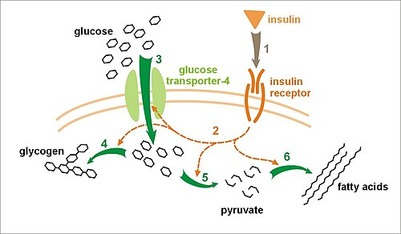
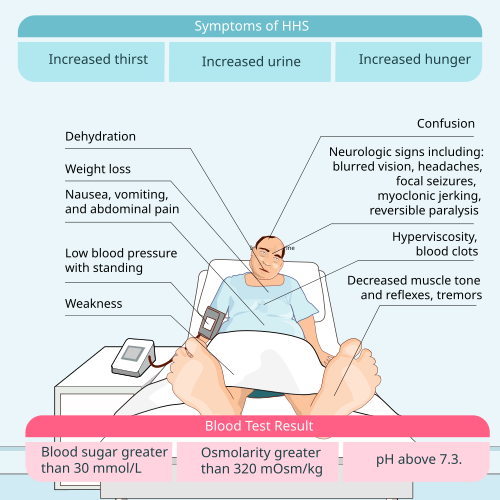

# COMPLICAÇÕES AGUDAS DO DM

Para entender as complicações agudas do Diabetes Mellitus (DM), você precisa parar de tentar decorar protocolos e começar a entender a fisiopatologia. Se você entender o que está acontecendo no sangue e na célula do paciente, as condutas de tratamento — que são o que as bancas de residência mais cobram — tornam-se lógicas.

As três grandes emergências que discutiremos aqui são a Cetoacidose Diabética (CAD), o Estado Hiperosmolar Hiperglicêmico (EHH) e a Hipoglicemia. Embora a CAD e o EHH compartilhem a hiperglicemia, elas são entidades distintas com manejos que possuem nuances críticas.

## Cetoacidose Diabética (CAD)

A CAD é o protótipo da descompensação do DM tipo 1, embora possa ocorrer no DM tipo 2 em situações de estresse extremo. O que você precisa ter em mente é a **fórmula do desastre**: Deficiência Grave de Insulina + Excesso de Hormônios Contrarreguladores (Glucagon, Cortisol, Catecolaminas e GH).

### Fisiopatologia: O "Porquê" da Acidose

*Figura 1 - Fórmula estrutural do ácido beta-hidroxibutírico, o principal corpo cetônico produzido na cetoacidose diabética e marcador laboratorial utilizado para diagnóstico e seguimento. Fonte: Fvasconcellos, Domínio Público | Wikimedia Commons*

Por que o paciente faz acidose? Sem insulina, a glicose não entra na célula. A célula "acha" que está em jejum e ativa a via do glucagon. Isso estimula a lipase hormônio-sensível no tecido adiposo, que quebra triglicerídeos em ácidos graxos livres.

Esses ácidos graxos vão para o fígado e, na ausência de insulina, entram na mitocôndria para sofrer beta-oxidação. O resultado final é a produção de corpos cetônicos (acetoacetato, beta-hidroxibutirato e acetona). Como esses corpos cetônicos são ácidos orgânicos, eles consomem o bicarbonato sérico, gerando uma acidose metabólica com **ânion gap elevado**.

### Critérios Diagnósticos (Decore estes valores!)

Segundo a Diretriz da Sociedade Brasileira de Diabetes (SBD), o diagnóstico de CAD exige a tríade:

- **Glicemia > 200 mg/dL** (embora exista a CAD euglicêmica, especialmente com uso de iSGLT2).

- **Cetonemia** (beta-hidroxibutirato > 3 mmol/L) ou **Cetonúria** (≥ 2+).

- **Acidose Metabólica**: pH arterial < 7,30 ou Bicarbonato < 18 mEq/L.

As bancas adoram classificar a gravidade. Veja a tabela abaixo:

| Parâmetro | Leve | Moderada | Grave |
| --- | --- | --- | --- |
| pH arterial | 7,25 a 7,30 | 7,00 a 7,24 | < 7,00 |
| Bicarbonato (mEq/L) | 15 a 18 | 10 a < 15 | < 10 |
| Cetonúria/Cetonemia | Positiva | Positiva | Positiva |
| Ânion Gap | > 10 | > 12 | > 12 |
| Estado Mental | Alerta | Alerta/Sonolento | Estupor/Coma |

**Dica de Prova:** O ânion gap é fundamental. Ele é calculado por: Na - (Cl + HCO3). O valor normal é entre 8 e 12. Na CAD, ele estará sempre aumentado devido ao acúmulo de cetoácidos.

### Quadro Clínico e Exame Físico

O paciente clássico é o jovem com DM1 que parou a insulina ou teve uma infecção. Ele chega com náuseas, vômitos e dor abdominal (que pode simular abdome agudo cirúrgico!).

Ao exame físico, procure por:

- **Desidratação grave**: Mucosas secas, turgor cutâneo diminuído, taquicardia e hipotensão.

- **Respiração de Kussmaul**: Aquela respiração profunda e rápida, uma tentativa desesperada do centro respiratório de compensar a acidose metabólica "lavando" CO2.

- **Hálito cetônico**: Um cheiro de "maçã podre" ou acetona.

## Estado Hiperosmolar Hiperglicêmico (EHH)

Se a CAD é o drama do jovem, o EHH é a tragédia do idoso com DM2. Aqui, o paciente tem insulina *suficiente* para evitar a lipólise e a cetogênese, mas *insuficiente* para controlar a glicemia.

### Por que não há cetose no EHH?

Essa é uma pergunta clássica de prova. A quantidade de insulina necessária para inibir a lipólise é muito menor do que a necessária para promover o transporte de glicose. No DM2, o pâncreas ainda secreta um "tiquinho" de insulina, o que bloqueia a formação de corpos cetônicos, mas permite que a glicemia suba a níveis astronômicos (muitas vezes > 600 mg/dL).

Como a glicose é um soluto osmoticamente ativo, ela puxa água do compartimento intracelular para o extracelular, causando uma desidratação celular profunda, especialmente no Sistema Nervoso Central. Por isso, a alteração de consciência é muito mais comum e grave no EHH do que na CAD.

### Critérios Diagnósticos do EHH

- **Glicemia > 600 mg/dL**.

- **Osmolaridade plasmática efetiva > 320 mOsm/kg**.

- **pH > 7,30** e **Bicarbonato > 18 mEq/L** (ausência de acidose significativa).

- **Cetonúria ausente ou leve**.

**Cálculo da Osmolaridade Efetiva**: 2 × Na + \frac{Glicose}{18}.
Não esqueça: o sódio que usamos aqui é o sódio medido, mas para avaliar a desidratação real, muitas vezes precisamos do sódio corrigido pela glicemia.

## Manejo Terapêutico: O Protocolo VIP

O tratamento da CAD e do EHH segue os mesmos pilares, mas com intensidades diferentes. Como dizemos no MedEvo, o segredo está na ordem das ações.

### 1. Volume (Hidratação)

Esta é a **prioridade número 1**. O paciente com CAD perde cerca de 5-7 litros de água; no EHH, essa perda pode chegar a 10-12 litros.

- **Conduta Inicial**: Soro Fisiológico (SF) 0,9% — 1.000 mL a 1.500 mL na primeira hora (ou 15-20 mL/kg).

- **Próximas horas**: A escolha do soro depende do sódio corrigido. Se Na+ corrigido estiver normal ou alto, usa-se NaCl 0,45%. Se estiver baixo, mantém-se NaCl 0,9%.

- **Quando mudar para Glicose?** Quando a glicemia atingir **200-250 mg/dL**, você deve adicionar Soro Glicosado 5% ao esquema.

- *Por que?* Porque você precisa continuar dando insulina para desligar a cetogênese (na CAD), mas não quer que o paciente faça hipoglicemia. O objetivo não é "normalizar" a glicemia rápido, mas sim fechar o ânion gap.

### 2. Potássio (O Vilão das Provas)

Aqui é onde a maioria dos alunos erra. Na CAD, o potássio sérico inicial pode estar normal ou até alto (hipercalemia), mas o **estoque corporal total de potássio está sempre baixo**. Isso acontece porque a acidose joga o K+ para fora da célula e a diurese osmótica o joga para fora do corpo.

**A Regra de Ouro do Potássio:**

- **K+ > 5,2 mEq/L**: Não repor agora. Monitorar a cada 2h.

- **K+ entre 3,3 e 5,2 mEq/L**: Repor 20-30 mEq de K+ por litro de soro.

- **K+ < 3,3 mEq/L**: **PARE TUDO**. Não dê insulina. Reponha potássio agressivamente (40 mEq/h) até que ele suba acima de 3,3.

- *Por que?* A insulina joga o potássio para dentro da célula. Se você der insulina com um K+ de 2,8, o paciente terá uma parada cardiorrespiratória por hipocalemia grave.

### 3. Insulina

Só comece a insulina após iniciar a hidratação e garantir que o K+ > 3,3.

- **Dose**: Insulina Regular 0,1 U/kg em bolus (opcional, mas muito cobrado) seguida de 0,1 U/kg/h em infusão contínua.

- **Meta**: Redução da glicemia em 50-70 mg/dL por hora. Se não cair isso, verifique o acesso venoso ou aumente a dose.

- **Cuidado Pediátrico**: Segundo a SBD e a ISPAD, **NÃO se faz bolus de insulina em crianças** devido ao risco aumentado de edema cerebral. Começa-se direto com a infusão contínua de 0,05 a 0,1 U/kg/h.

### 4. Bicarbonato (A Exceção)

O uso de bicarbonato é raríssimo. A própria hidratação e insulina resolvem a acidose ao parar a produção de corpos cetônicos.

- **Indicação**: Apenas se **pH < 6,9**.

- *Por que evitar?* O bicarbonato pode causar acidose paradoxal do SNC, hipocalemia grave e desvio da curva de dissociação da hemoglobina para a esquerda (dificultando a entrega de O2 aos tecidos).

### 5. Fosfato

A reposição de rotina não é indicada. Repomos apenas se **Fosfato < 1,0 mg/dL** ou se houver sinais de disfunção orgânica (insuficiência respiratória, anemia hemolítica ou disfunção cardíaca).

*Figura 2 - Diagrama ilustrando a fisiopatologia do Estado Hiperosmolar Hiperglicêmico (EHH): desidratação grave e hiperosmolaridade sem cetoacidose significativa. Fonte: Hariadhi, CC BY-SA 4.0 | Wikimedia Commons*

## Comparativo: CAD vs. EHH

| Característica | Cetoacidose (CAD) | Estado Hiperosmolar (EHH) |
| --- | --- | --- |
| Paciente típico | DM1, jovem | DM2, idoso |
| Início | Rápido (< 24h) | Insidioso (dias/semanas) |
| Glicemia | > 200 mg/dL | > 600 mg/dL |
| pH | < 7,30 | > 7,30 |
| Bicarbonato | < 18 mEq/L | > 18 mEq/L |
| Osmolaridade | Variável | > 320 mOsm/kg |
| Ânion Gap | Elevado | Normal ou levemente elevado |
| Mortalidade | 1-5% | 10-20% |

## Complicações do Tratamento

Como professor, já vi muitos casos onde o tratamento foi mais perigoso que a doença. Fique atento a:

- **Hipoglicemia e Hipocalemia**: As mais comuns. Evitadas com monitorização rigorosa.

- **Edema Cerebral**: Ocorre principalmente em crianças e adolescentes. Suspeite se houver cefaleia, bradicardia ou alteração súbita de consciência durante o tratamento. Ocorre geralmente 3-12h após o início da terapia. O tratamento é Manitol ou Salina Hipertônica.

- **Acidose Hiperclorêmica**: Comum na fase de recuperação devido ao excesso de Cloro do Soro Fisiológico 0,9%. Geralmente não tem repercussão clínica e o ânion gap já estará normal.

## Critérios de Resolução e Transição para Subcutânea

Você não desliga a bomba de insulina só porque a glicemia baixou de 200. Você desliga quando a **acidose resolveu**.

**Critérios de Resolução da CAD:**

- Glicemia < 200 mg/dL E dois dos seguintes:

- Bicarbonato ≥ 15 mEq/L.

- pH venoso > 7,3.

- Ânion Gap ≤ 12 mEq/L.

**A Transição (Overlap):**
Nunca desligue a bomba e depois aplique a insulina subcutânea (SC). Isso causará rebote da cetose. Aplique a insulina SC (preferencialmente uma dose de basal/NPH + rápida) e **mantenha a bomba ligada por mais 1 a 2 horas**. Esse é o tempo necessário para a insulina SC começar a agir. Dr. Will sempre reforça: esse "overlap" salva vidas e evita reinternações em UTI.

## Hipoglicemia Aguda

Definida como **glicemia plasmática < 70 mg/dL**. É a complicação aguda mais frequente, geralmente iatrogênica (excesso de insulina ou sulfonilureias).

### Tríade de Whipple

Para o diagnóstico clínico de hipoglicemia, usamos a Tríade de Whipple:

- Sintomas compatíveis (tremores, sudorese, confusão).

- Glicemia baixa documentada.

- Melhora imediata dos sintomas após a elevação da glicemia.

### Quadro Clínico

- **Sintomas Neurogênicos (Autonômicos)**: Sudorese, palpitação, tremor, fome, ansiedade. São os primeiros a aparecer (alerta).

- **Sintomas Neuroglicopênicos**: Confusão, fraqueza, tontura, convulsão e coma. Indicam sofrimento cerebral.

### Tratamento da Hipoglicemia

A conduta depende do nível de consciência:

-

**Paciente Consciente**: Regra dos 15g.

- Dar 15g de carboidrato simples (ex: 1 colher de sopa de açúcar na água, 150ml de refrigerante comum).

- Aguardar 15 minutos e retestar. Se < 70, repetir.

- Após normalizar, o paciente deve fazer um lanche com carboidrato complexo e proteína.

-

**Paciente Inconsciente (ou sem via oral segura)**:

- **Ambiente Hospitalar**: Glicose 50% EV (20 a 50 mL). Manter infusão de Glicose 10% se necessário.

- **Ambiente Extra-hospitalar**: Glucagon 1mg IM ou SC. É uma excelente opção para familiares de pacientes com DM1 terem em casa.

**Pegadinha de Prova**: Hipoglicemia por **Sulfonilureias** (ex: Glibenclamida). Elas têm meia-vida longa e estimulam o pâncreas continuamente. O paciente pode precisar de observação hospitalar por 24-48h, pois a hipoglicemia frequentemente recorre após o tratamento inicial.

## Situações Especiais e "Pulos do Gato"

### CAD Euglicêmica

Ocorre principalmente em usuários de inibidores da SGLT2 (dapagliflozina, empagliflozina). O paciente tem acidose e cetose, mas a glicemia está < 200 mg/dL porque o rim está jogando glicose fora.

- **Conduta**: O tratamento é o mesmo (Insulina + Volume), mas você precisará começar o Soro Glicosado muito mais cedo.

### Insuficiência Adrenal Associada

Se você tem um paciente com DM1 que começa a ter hipoglicemias inexplicadas, fadiga extrema e hiperpigmentação, pense em Síndrome Poliglandular Autoimune. A insuficiência adrenal (Doença de Addison) pode estar presente. O screening inicial é com **Cortisol sérico matinal**.

### O Fenômeno do "Falso" Sódio Baixo

A hiperglicemia causa uma hiponatremia dilucional. Para cada 100 mg/dL de glicose acima de 100, o sódio medido cai cerca de 1,6 mEq/L.

- Exemplo: Glicemia 1100 (1000 acima do normal). Sódio medido 130.

- Sódio corrigido: 130 + (1,6 × 10) = 146.

- Esse paciente está, na verdade, hipernatrêmico e muito desidratado!

## Pontos-Chave para Prova

- **Critério Diagnóstico CAD**: Glicemia > 200, pH < 7,30, Bicarbonato < 18 e cetonemia/cetonúria.

- **Critério Diagnóstico EHH**: Glicemia > 600, Osmolaridade > 320, pH > 7,30.

- **Prioridade Zero**: Hidratação com Soro Fisiológico 0,9%.

- **Potássio e Insulina**: NUNCA inicie insulina se K+ < 3,3 mEq/L. Risco de arritmia fatal.

- **Bicarbonato**: Só se pH < 6,9. Não caia na pegadinha de dar bicarb com pH de 7,1.

- **Insulina na CAD**: Preferencialmente Intravenosa (Regular). IM/SC apenas em casos muito leves e se não houver acesso.

- **Cetoacidose Pediátrica**: Proibido bolus de insulina. Risco altíssimo de edema cerebral.

- **Edema Cerebral**: Complicação temida na pediatria, ocorre durante o tratamento. Tratar com Manitol.

- **Fosfato**: Repor apenas se < 1,0 mg/dL ou se houver clínica (fraqueza muscular, hemólise).

- **Transição de Insulina**: Manter a bomba por 1-2 horas após a primeira dose de insulina SC (Overlap).

- **Hipoglicemia**: Glicemia < 70 mg/dL. Tratar com 15g de carbo se consciente ou Glicose 50% EV se inconsciente.

- **Tríade de Whipple**: Sintomas + Glicemia baixa + Melhora com glicose.

- **Sódio Corrigido**: Sempre calcule para decidir o tipo de soro na hidratação de manutenção.

- **Ânion Gap**: Fundamental para o diagnóstico e para definir a resolução da CAD.

- **Fator Precipitante**: Sempre procure por infecção (ITU, pneumonia) ou má adesão ao tratamento. Na prova, se o paciente está "indo bem" e para de melhorar, procure uma infecção escondida. 💡

Este guia cobre o que há de mais essencial e o que é rotineiramente cobrado nas provas de residência médica no Brasil, seguindo as diretrizes da SBD. Entender a lógica por trás da reposição de potássio e do uso criterioso da insulina é o que diferencia o aluno que decora do médico que resolve.

 Cópia offline para consulta pessoal.
 Fonte original:
 [https://www.medevo.com.br/material-apoio/ler/8e3c5825-82a8-4a34-bc86-f5b40510d64a](https://www.medevo.com.br/material-apoio/ler/8e3c5825-82a8-4a34-bc86-f5b40510d64a)
