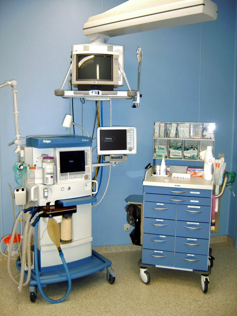

# COMPLICAÇÕES ANESTÉSICAS

As complicações anestésicas são o "divisor de águas" entre o anestesiologista e o passador de gases. Em provas de residência, o examinador não quer saber se você sabe a dose do propofol; ele quer saber se você sabe o que fazer quando o paciente para de ventilar, choca ou entra em uma crise hipermetabólica. Vamos dissecar esses eventos, focando no porquê de cada conduta.

## Hipertermia Maligna (HM): A Crise Hipermetabólica

*Figura 1 - Estação de trabalho anestésica completa (aparelho de anestesia Dräger Primus) com monitores e ventilador, ambiente onde ocorrem as principais complicações anestésicas. Fonte: Paunami, CC BY-SA 2.5 | Wikimedia Commons*

A Hipertermia Maligna é, sem dúvida, o tema mais cobrado em anestesiologia. É uma doença farmacogenética (herança autossômica dominante) que ocorre em indivíduos suscetíveis quando expostos a agentes gatilhos.

### Fisiopatologia: O Problema é o Cálcio

O defeito reside no receptor de rianodina (RYR1) no retículo sarcoplasmático do músculo esquelético. Imagine que esse receptor é uma "torneira" que controla a saída de cálcio. No paciente com HM, essa torneira emperra aberta quando entra em contato com o gatilho.

O excesso de cálcio intracelular causa uma contração muscular sustentada e generalizada. Isso consome ATP de forma insana, gera calor (hipertermia), produz CO2 (acidose respiratória) e lactato (acidose metabólica), além de destruir a célula muscular (rabdomiólise), liberando potássio e mioglobina.

### Gatilhos e Sinais Clínicos

Você precisa decorar os gatilhos: **Anestésicos Inalatórios Halogenados** (Halotano, Sevoflurano, Desflurano, Isoflurano) e o bloqueador neuromuscular despolarizante **Succinilcolina**.

**Cuidado:** O óxido nitroso e os anestésicos venosos (propofol, etomidato, opioides) são SEGUROS.

O sinal mais precoce da HM não é a febre. Guarde isso para a prova: **o aumento súbito e sustentado do ETCO2 (capnografia)** é o primeiro sinal. O paciente começa a produzir tanto CO2 que o ventilador não consegue lavar.

Sinais clássicos:

- Taquicardia inexplicada (o coração tenta compensar a acidose e o calor).

- Rigidez muscular (especialmente o músculo masseter após succinilcolina).

- Acidose mista (pH baixo, CO2 alto, lactato alto).

- Hipertermia (sinal tardio, mas pode chegar a > 40°C rapidamente).

- Hipercalemia e arritmias.

### Tratamento: O Protocolo de Salvação

Se você suspeitar de HM, a primeira conduta é **interromper os gatilhos** e pedir ajuda. Não termine a cirurgia se puder parar imediatamente.

O tratamento específico é o **Dantrolene Sódico**. Ele atua justamente fechando a "torneira" (receptor de rianodina), impedindo a liberação de cálcio.

**Tabela 1: Protocolo de Tratamento da HM**

| Ação | Detalhes Técnicos |
| --- | --- |
| **Dantrolene** | Dose inicial: 2,5 mg/kg IV. Repetir até reversão dos sinais (até 10 mg/kg). |
| **Ventilação** | Hiperventilar com O2 a 100% (fluxo alto > 10L/min) para lavar o CO2. |
| **Resfriamento** | Lavagem gástrica/vesical com soro gelado, compressas frias. Parar se < 38°C. |
| **Hipercalemia** | Insulina + Glicose, Bicarbonato de sódio, Gluconato de Cálcio (se arritmia). |
| **Monitorização** | Gasometria seriada, potássio, CPK, mioglobina urinária. |

**Dica do Dr. Will:** Nunca use bloqueadores de canais de cálcio (como Verapamil) para tratar arritmias na HM. A interação com o Dantrolene causa hipercalemia grave e colapso cardiovascular.

## Complicações Respiratórias: Onde o Aluno Mais Erra

As complicações respiratórias são as mais frequentes no perioperatório. A **atelectasia** é a campeã absoluta no pós-operatório imediato de anestesia geral. Por que? Porque o decúbito dorsal, a paralisia muscular e a ventilação com altas frações de oxigênio (atelectasia de absorção) favorecem o colapso alveolar.

### Aspiração Pulmonar (Síndrome de Mendelson)

A aspiração de conteúdo gástrico ácido (pH < 2,5 e volume > 0,4 ml/kg) causa uma pneumonite química.

**Fatores de risco:** Estômago cheio (emergências), obstrução intestinal, gestação (pela pressão intra-abdominal e relaxamento do esfíncter esofágico), obesidade e doença do refluxo.

Para prevenir, usamos a **Sequência Rápida de Intubação (SRI)**. Aqui entra a **Manobra de Sellick**: pressão firme na cartilagem cricoide para ocluir o esôfago.
*Erro comum de prova:* Achar que a Manobra de Sellick é para visualizar melhor a laringe. Não! Isso é a manobra de BURP. Sellick é para prevenir aspiração.

Se o paciente aspirar e evoluir com pneumonia bacteriana secundária (comum em obstrução intestinal), a escolha empírica frequente em questões é **Amoxicilina-Clavulanato**, visando cobrir anaeróbios e gram-negativos da flora entérica.

### Intubação Seletiva e Esofágica

Imagine o cenário: você intubou uma criança, fixou o tubo e, minutos depois, a SpO2 cai e o murmúrio vesicular some à esquerda.
**Diagnóstico:** Intubação seletiva (geralmente brônquio fonte direito, que é mais verticalizado). O RX mostrará atelectasia à esquerda e hiperinsuflação à direita.

Se após a intubação o paciente apresentar hipoxemia, hipotensão e bradicardia, e você não visualizar a curva de capnografia: **o tubo está no esôfago**. Retire e ventile com máscara.

### Barotrauma e Ventilação Protetora

O barotrauma ocorre por excesso de pressão nos alvéolos (Pressão de Platô > 30 cmH2O). Para prevenir, usamos a estratégia protetora:

- Volume Corrente (VC) baixo: 6 ml/kg de peso predito.

- PEEP adequada.

- Limitação da pressão de platô.

## Toxicidade Sistêmica por Anestésicos Locais (LAST)

Esta é a complicação temida dos bloqueios regionais (raquianestesia, peridural, bloqueios de nervos periféricos). Ocorre por injeção intravascular acidental ou absorção sistêmica rápida.

**Quadro Clínico:**

- **SNC (Primeiro):** Gosto metálico na boca, zumbido, dormência perioral, agitação, evoluindo para convulsões e coma.

- **Cardiovascular (Mais grave):** Bradicardia, arritmias ventriculares (especialmente com Bupivacaína) e assistolia.

**Tratamento:**
Além do suporte básico (ABC), o antídoto é a **Emulsão Lipídica a 20%**. Ela funciona como um "sumidouro" (lipid sink), retirando o anestésico local (que é lipofílico) do receptor cardíaco e levando-o para o compartimento lipídico do sangue.

**Tabela 2: Manejo da LAST**

| Passo | Conduta |
| --- | --- |
| **Suporte** | Via aérea (O2 100%), evitar acidose (piora a toxicidade). |
| **Convulsão** | Benzodiazepínicos ou doses baixas de Propofol. |
| **Emulsão Lipídica** | Bolus de 1,5 ml/kg em 1 min + Infusão de 0,25 ml/kg/min. |
| **Arritmias** | Evitar Vasopressina e Bloqueadores de Canal de Cálcio. Usar doses baixas de Adrenalina (< 1 mcg/kg). |

*Figura 2 - Estrutura química do Dantrolene sódico, antídoto específico da Hipertermia Maligna, que age bloqueando a liberação de cálcio pelo receptor de rianodina no retículo sarcoplasmático. Fonte: Lukáš Mižoch, Domínio Público | Wikimedia Commons*

## Anafilaxia Intraoperatória

Diferente do que muitos pensam, o látex não é mais a causa número um. Segundo as diretrizes atuais, os **Bloqueadores Neuromusculares (BNM)**, como a Succinilcolina e o Rocurônio, são os principais vilões.

**Sinais:** O primeiro sinal costuma ser o colapso cardiovascular (hipotensão súbita e taquicardia) ou o aumento da pressão de via aérea (broncospasmo). O rash cutâneo muitas vezes está escondido sob os campos cirúrgicos.

**Tratamento de escolha:** **Epinefrina (Adrenalina)**. Não perca tempo com corticoide ou anti-histamínico na fase aguda. Eles são adjuvantes, mas a adrenalina é que salva a vida ao estabilizar os mastócitos e reverter a vasodilatação.

## Complicações do Eixo Neuraxial (Raqui e Peridural)

### Cefaleia Pós-Punção Dural (CPPD)

Ocorre pela perda de líquor através do orifício deixado na dura-máter, causando hipotensão liquórica e tração de estruturas sensíveis.

- **Característica clássica:** Cefaleia **ortostática** (piora em pé, melhora deitado). Pode vir com náuseas, fotofobia e zumbido.

- **Fatores de risco:** Mulheres jovens, gestantes, uso de agulhas de ponta cortante (Quincke) e agulhas de maior calibre.

- **Tratamento inicial:** Hidratação, analgésicos simples, cafeína.

- **Tratamento definitivo (se falha do conservador):** *Blood Patch* (Tampão Sanguíneo Peridural). Injeta-se sangue autólogo no espaço peridural para "selar" o furo.

### Bloqueio Espinal Alto

Se o anestésico subir demais (nível de T4 ou acima), ele bloqueia as fibras simpáticas cardíacas.
**Resultado:** Bradicardia e hipotensão (o famoso "choque neurogênico" da anestesia). Se chegar em C3-C5, ocorre paralisia do diafragma e parada respiratória.
**Conduta:** Atropina para bradicardia, vasopressores (Efedrina/Adrenalina) e suporte ventilatório.

## Náuseas e Vômitos Pós-Operatórios (NVPO)

É a complicação que mais gera insatisfação no paciente. Para a MedEvo, você precisa dominar o **Escore de Apfel**, que define o risco e a necessidade de profilaxia.

**Tabela 3: Escore de Apfel (Fatores de Risco)**

| Fator de Risco | Pontuação |
| --- | --- |
| Sexo Feminino | 1 ponto |
| Não fumante | 1 ponto |
| História prévia de NVPO ou Cinetose | 1 ponto |
| Uso de Opioides no pós-operatório | 1 ponto |

**Interpretação:**

- 0-1 ponto: Baixo risco (não precisa de profilaxia ou apenas 1 droga).

- 2 pontos: Risco moderado (2 drogas de classes diferentes).

- 3-4 pontos: Alto risco (3 drogas ou anestesia total venosa - TIVA).

**Dica de Prova:** A cirurgia videolaparoscópica (devido ao pneumoperitônio) e cirurgias ginecológicas/estrábico são fatores de risco cirúrgicos importantes.

## Despertar Intraoperatório e TEPT

O despertar intraoperatório é um evento raro, mas traumático. Ocorre quando a profundidade anestésica é insuficiente para o estímulo cirúrgico.

- **Causas:** Falha no equipamento, subdose intencional (ex: trauma grave onde o paciente não tolera anestésicos), ou resistência farmacológica.

- **Consequência:** Transtorno de Estresse Pós-Traumático (TEPT). O paciente revive o trauma, tem pesadelos e ansiedade.

- **Conduta:** O relato do paciente deve ser sempre acolhido. O acompanhamento psicológico/psiquiátrico precoce é fundamental.

## Hipotermia Intraoperatória

Definida como temperatura central < 36°C. É quase universal se não houver prevenção, pois a anestesia inibe a termorregulação central e causa vasodilatação periférica (redistribuição de calor).

**Consequências:**

- Aumento de infecção de sítio cirúrgico (vasoconstrição reduz oferta de O2 para tecidos).

- Aumento de sangramento (disfunção plaquetária).

- Arritmias cardíacas.

- Prolongamento do efeito de bloqueadores neuromusculares.

**Prevenção:** Aquecimento da sala (ideal 21-24°C), uso de mantas térmicas de ar forçado (mais eficaz) e aquecimento de fluidos venosos.

## Situações Especiais e Drogas Específicas

### Succinilcolina e Potássio

A succinilcolina é um BNM despolarizante. Ela causa uma saída fisiológica de potássio da célula (aumento de ~0,5 mEq/L).
Em pacientes com **upregulation** de receptores nicotínicos (grandes queimados após 24h, pacientes acamados há muito tempo, lesões medulares, AVC crônico ou doenças musculares), essa liberação de potássio é maciça e pode levar à **Parada Cardiorrespiratória por Hipercalemia**.
*Erro clássico:* Achar que pode usar succinilcolina em queimado recente. Nas primeiras 24h pode; após isso, é contraindicação absoluta.

### O Idoso e o Delirium

O idoso tem menor reserva funcional. Complicações como o *Delirium* pós-operatório são frequentes. O manejo envolve evitar drogas anticolinérgicas, benzodiazepínicos e garantir o controle da dor e o retorno rápido de próteses auditivas e óculos.

## Pontos-Chave para Prova

- **Hipertermia Maligna:** O sinal mais precoce é o aumento do ETCO2. O tratamento é Dantrolene (2,5 mg/kg). Gatilhos: Halogenados e Succinilcolina. 🚨

- **Dantrolene:** Atua no receptor de rianodina (RYR1), diminuindo o cálcio intracelular.

- **Atelectasia:** É a complicação respiratória mais comum no pós-operatório de anestesia geral.

- **Síndrome de Mendelson:** Pneumonite química por aspiração de conteúdo gástrico ácido (pH < 2,5).

- **Manobra de Sellick:** Compressão da cricoide para prevenir aspiração (não confunda com BURP).

- **Anafilaxia:** Causa #1 em sala de cirurgia são os Bloqueadores Neuromusculares. Tratamento primário: Adrenalina.

- **LAST (Toxicidade de AL):** SNC primeiro (zumbido, gosto metálico), Cardiovascular depois (arritmias). Antídoto: Emulsão Lipídica 20%.

- **CPPD:** Cefaleia ortostática após raqui. Tratamento definitivo: *Blood Patch*.

- **Succinilcolina:** Contraindicada em queimados (>24h), lesões medulares e doenças neuromusculares pelo risco de hipercalemia fatal.

- **Escore de Apfel:** Mulher, não fumante, história de NVPO, opioide pós-op. Define profilaxia de náuseas.

- **Hipotermia:** Causa disfunção plaquetária (sangramento) e aumenta infecção de sítio cirúrgico.

- **Intubação Seletiva:** Suspeitar em queda de SpO2 súbita pós-posicionamento, especialmente em crianças.

- **Capnografia na Parada:** Se o ETCO2 cair bruscamente, suspeite de queda drástica no débito cardíaco ou embolia pulmonar.

- **Jejum (ASA):** Água/Líquidos claros (2h), Leite materno (4h), Fórmulas/Leite não humano (6h), Refeição leve (6h), Refeição gordurosa (8h).

- **Despertar Intraoperatório:** Risco de TEPT; o relato do paciente deve ser sempre validado.

- **Aracnoidite Adesiva:** Complicação tardia e grave por contaminação do espaço subaracnóideo com antissépticos (clorexidina/álcool). Nunca deixe antisséptico na mesma bandeja das agulhas de raqui.

 Cópia offline para consulta pessoal.
 Fonte original:
 [https://www.medevo.com.br/material-apoio/ler/a137bf5d-5c8f-42f3-af66-d9f6cc8c4dbe](https://www.medevo.com.br/material-apoio/ler/a137bf5d-5c8f-42f3-af66-d9f6cc8c4dbe)
