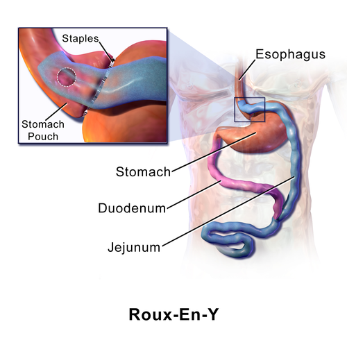
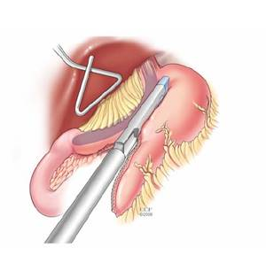

# COMPLICAÇÕES DA CIRURGIA BARIÁTRICA

Para entender as complicações da cirurgia bariátrica, você precisa primeiro pensar como o cirurgião no pós-operatório. O paciente obeso é um paciente de risco: ele tem uma reserva funcional reduzida, um estado pró-inflamatório basal e uma anatomia que dificulta o exame físico.

Nas provas de residência, o examinador não quer apenas que você saiba o nome da complicação, mas que você identifique o **sinal precoce** que salva a vida do paciente. Vamos dividir nosso estudo cronologicamente e por sistemas, focando no que realmente aparece nos editais e no dia a dia do hospital.

## Complicações Respiratórias: O Inimigo das Primeiras Horas

*Figura 1 - Ilustração do Bypass Gástrico em Y-de-Roux, a técnica bariátrica mais associada a complicações como fístulas anastomóticas, hérnias internas e síndrome de dumping. Fonte: BruceBlaus/Blausen Medical, CC BY 3.0 | Wikimedia Commons*

As complicações respiratórias são as mais frequentes no pós-operatório imediato. O obeso tem uma mecânica ventilatória prejudicada pelo peso da parede abdominal e pela posição no leito.

### Atelectasia Pulmonar

Esta é a causa número um de febre nas primeiras 24 a 48 horas de pós-operatório.
**Por que acontece?** O paciente sente dor ao respirar (respiração superficial), o diafragma está elevado e o efeito da anestesia reduz a produção de surfactante. O alvéolo colapsa.

**Dica de Prova:** Se a questão trouxer um paciente com febre baixa, taquipneia e tosse seca no 1º DPO, não pense em infecção. Pense em atelectasia.
**Conduta:** Não precisa de antibiótico! O tratamento é fisioterapia respiratória motora e incentivadora, além de uma analgesia potente para que o paciente consiga expandir o tórax.

### Tromboembolismo Pulmonar (TEP)

Se a atelectasia é a mais comum, o TEP é a **principal causa de morte precoce** em cirurgia bariátrica. O obeso vive em um estado de hipercoagulabilidade.

**Quadro Clínico:** A palavra-chave aqui é **dispneia súbita**. Diferente da fístula, o TEP costuma vir sem dor abdominal importante ou febre alta inicial. O paciente pode apresentar hipoxemia refratária e sinais de sobrecarga de ventrículo direito no ecocardiograma.

**Prevenção e Conduta:** A profilaxia deve ser feita com deambulação precoce e heparina (HBPM ou HNF). Se houver suspeita clínica, o padrão-ouro é a Angio-TC de tórax. Lembre-se: em pacientes com IMC muito elevado, as doses de profilaxia costumam ser maiores do que as padrão de 40mg de enoxaparina.

## Complicações Cirúrgicas Precoces: O Pavor do Cirurgião

Aqui entramos no terreno das fístulas e deiscências. Se você aprender uma coisa hoje, que seja esta: **Taquicardia persistente no pós-operatório de bariátrica é fístula até que se prove o contrário.**

### Fístulas e Deiscências Anastomóticas

A fístula ocorre quando há uma falha na cicatrização da sutura ou do grampeamento, levando ao extravasamento de conteúdo gástrico ou intestinal para a cavidade peritoneal.

- **No Bypass Gástrico (BGYR):** O local mais comum é a anastomose gastrojejunal.

- **Na Gastrectomia Vertical (Sleeve):** O local clássico é a **região de His** (ângulo esofagogástrico), na porção superior da linha de grampeamento. Isso ocorre porque é uma zona de alta pressão e menor vascularização.

**O Sinal de Alerta:** O paciente começa com uma taquicardia inexplicada (FC > 120 bpm). Pode não ter febre, pode não ter leucocitose franca no início. Se o dreno (se houver) apresentar saída de conteúdo purulento ou bilioso, o diagnóstico está dado.

**Dica do Dr. Will:** Muitas bancas colocam o "teste do azul de metileno". Se o paciente ingere o azul e ele sai pelo dreno, confirma a fístula. Mas cuidado: se a urina ficar esverdeada e o paciente estiver bem, isso apenas mostra que o corante foi absorvido pelo intestino e excretado pelo rim — ou seja, a anastomose está íntegra!

**Manejo das Fístulas:**

- **Paciente Estável:** Pode-se tentar tratamento conservador com dieta zero, nutrição parenteral, antibioticoterapia e drenagem radiológica se houver coleção.

- **Paciente Instável (Sepse/Peritonite):** Reintervenção cirúrgica imediata (preferencialmente por laparoscopia).

### Rabdomiólise

Muitos esquecem dessa complicação, mas ela cai em prova associada a pacientes com IMC muito elevado (> 50-60 kg/m²) e tempos cirúrgicos prolongados.
**Fisiopatologia:** O peso do próprio paciente contra a mesa cirúrgica causa isquemia muscular por pressão.
**Diagnóstico:** Elevação de CPK (geralmente > 5.000 ou 10.000 U/L) e urina escura (mioglobinúria).
**Complicação:** Insuficiência Renal Aguda (IRA) por depósito de mioglobina nos túbulos renais.

## Complicações Obstrutivas: O Abdome Agudo Pós-Bariátrica

As obstruções podem ser precoces (edema de anastomose, coágulos) ou tardias. Vamos focar na rainha das provas: a Hérnia Interna.

### Hérnia Interna (Espaço de Petersen)

Esta complicação ocorre quase exclusivamente no **Bypass Gástrico em Y de Roux**, especialmente quando as alças são passadas por via antecólica.

**O que é o Espaço de Petersen?** É o espaço criado entre o mesentério da alça alimentar e o mesocolon transverso. Se o cirurgião não fecha esse espaço, as alças intestinais podem deslizar por ali e encarcerar.

**Quadro Clínico Clássico:**

- Dor abdominal súbita e intensa (muitas vezes em hipocôndrio esquerdo).

- Náuseas e vômitos (que podem ser biliosos se a obstrução for da alça biliopancreática).

- **Amilase elevada:** Cuidado! Isso confunde muita gente com pancreatite. A amilase sobe porque há sofrimento de alça intestinal.

**Diagnóstico por Imagem:** A Tomografia de Abdome com contraste é o exame de escolha. O sinal clássico é o **"Sinal do Redemoinho" (Whirlpool sign)**, que mostra a torção do mesentério.

**Conduta:** A suspeita de hérnia interna com sinais de obstrução ou sofrimento de alça exige **Laparoscopia Exploradora de Urgência**. Não se espera o quadro piorar, pois o risco de necrose intestinal maciça é alto.

### Estenose de Anastomose

Mais comum na gastrojejunoanastomose do Bypass. O paciente apresenta disfagia progressiva e vômitos persistentes alguns meses após a cirurgia.
**Diagnóstico e Tratamento:** Endoscopia Digestiva Alta (EDA). Ela identifica a estenose e já permite o tratamento através da dilatação por balão.

*Figura 2 - Fotografia cirúrgica da realização de gastrectomia vertical (sleeve) com grampeador linear, técnica cuja principal complicação é a fístula na linha de grampeamento. Fonte: Aniceto Baltasar, CC BY-SA 4.0 | Wikimedia Commons*

## Síndrome de Dumping: O Mal-Estar Pós-Prandial

O Dumping não é uma "falha" da cirurgia, mas uma resposta fisiológica à alteração da anatomia gástrica, muito comum no Bypass. Como o esfíncter pilórico é "pulado", o alimento chega muito rápido ao intestino delgado.

### Tabela 1: Diferenciação das Síndromes de Dumping

| Característica | Dumping Precoce | Dumping Tardio |
| --- | --- | --- |
| **Tempo após refeição** | 15 a 30 minutos | 1 a 3 horas |
| **Fisiopatologia** | Distensão do delgado + Mudança osmótica (líquido vai para o lúmen) | Resposta insulínica exagerada (Hipoglicemia reativa) |
| **Sintomas GI** | Dor abdominal, náuseas, diarreia explosiva | Raros |
| **Sintomas Vasomotores** | Taquicardia, sudorese, rubor facial, hipotensão | Sudorese, tremor, fome, síncope (sinais de hipoglicemia) |
| **Tratamento Inicial** | Fracionar dieta, evitar líquidos nas refeições, reduzir carboidratos simples | Reduzir carboidratos de alto índice glicêmico |

**Dica de Prova:** O Dumping precoce é um problema de **volume/osmolaridade**. O Dumping tardio é um problema de **insulina/glicose**.

## Complicações Nutricionais e Neurológicas

A cirurgia bariátrica, especialmente as técnicas disabsortivas (Bypass) e restritivas puras (Sleeve), predispõe a deficiências vitamínicas. No MedEvo, sempre reforçamos que o acompanhamento vitalício é obrigatório.

### Deficiência de Vitamina B12 (Cobalamina)

É a complicação nutricional mais comum no Bypass Gástrico.
**Por que?** A B12 precisa do ácido gástrico para ser liberada do alimento e do **Fator Intrínseco** (produzido pelas células parietais do estômago) para ser absorvida no íleo terminal. No Bypass, o estômago distal e o duodeno são excluídos do trânsito alimentar.
**Clínica:** Anemia megaloblástica e neuropatia periférica (parestesias, perda de sensibilidade vibratória).

### Deficiência de Tiamina (Vitamina B1)

Esta é uma emergência médica! Ocorre geralmente em pacientes com **vômitos incoercíveis** no pós-operatório.
**Clínica:** Encefalopatia de Wernicke (Tríade: Ataxia + Confusão Mental + Oftalmoplegia/Nistagmo).
**Cuidado:** Nunca dê glicose para um paciente desnutrido ou com vômitos sem repor tiamina antes, pois a glicose consome o resto de tiamina e precipita a crise.

### Deficiência de Ferro

Causa anemia ferropriva. O ferro é absorvido principalmente no duodeno, que está excluído no Bypass. É a causa mais comum de anemia no pós-operatório.

## Complicações Hepatobiliares

### Colelitíase (Pedra na Vesícula)

Cerca de 30% a 40% dos pacientes desenvolvem cálculos biliares nos primeiros 6 a 12 meses após a cirurgia.
**Por que?** A perda de peso rápida altera a composição da bile (aumenta a concentração de colesterol e diminui os ácidos biliares), tornando-a litogênica. Além disso, a redução da estimulação da colecistoquinina (CCK) leva à estase biliar.

**Conduta:** Não se faz colecistectomia profilática em todo mundo. Ela é indicada se o paciente já tiver pedras sintomáticas antes da cirurgia ou se desenvolvê-las depois. Alguns serviços utilizam o Ácido Ursodesoxicólico para prevenir essa formação durante a fase de perda rápida de peso.

## Diagnóstico Diferencial de Dor Abdominal Pós-Bariátrica

Quando um paciente chega ao pronto-socorro com dor abdominal e história de bariátrica, você deve ter um algoritmo mental claro.

### Tabela 2: Diagnóstico Diferencial por Cronologia

| Tempo de Pós-Op | Principal Suspeita | Sinais Sugestivos |
| --- | --- | --- |
| **0 - 7 dias** | Fístula Anastomótica | Taquicardia, febre, dor referida no ombro, secreção no dreno. |
| **0 - 30 dias** | TEP | Dispneia súbita, taquipneia, pulmões limpos à ausculta. |
| **Qualquer momento** | Hérnia Interna | Dor em cólica, vômitos, "Sinal do Redemoinho" na TC. |
| **Meses/Anos** | Úlcera de Boca Anastomótica | Dor epigástrica, história de tabagismo ou uso de AINEs. |
| **Meses/Anos** | Colelitíase | Dor em hipocôndrio direito após refeições gordurosas. |

## Situações Especiais e Pegadinhas

### O Estômago Excluso

No Bypass Gástrico, o estômago distal permanece no corpo, mas "desconectado" da boca. Ele continua produzindo suco gástrico, que drena para o duodeno.
**Complicação Rara:** Se houver uma obstrução na alça biliopancreática (por exemplo, uma hérnia interna ou estenose da jejuno-jejunoanastomose), esse estômago excluso pode distender massivamente.
**Risco:** Perfuração e peritonite química grave. O diagnóstico é feito por imagem (estômago gigante cheio de líquido no RX ou TC).

### Reganho de Peso

Não é uma complicação cirúrgica "stricto sensu", mas é o pesadelo do paciente. O principal fator para o reganho de peso é a **não adesão às mudanças de estilo de vida** e a falta de acompanhamento nutricional/psicológico. Fatores anatômicos (como dilatação da anastomose ou do pouch gástrico) são menos comuns do que o erro alimentar.

### Tabela 3: Exames de Imagem na Urgência

| Exame | Indicação Principal | Limitação |
| --- | --- | --- |
| **RX de Abdome** | Ver pneumoperitônio ou distensão de estômago excluso | Baixa sensibilidade para fístulas e hérnias. |
| **TC com Contraste Oral** | Padrão-ouro para fístulas e obstruções | Paciente instável pode não tolerar o decúbito. |
| **EDA** | Estenose de anastomose, úlcera marginal | Risco de perfuração se feita muito precocemente em fístulas. |
| **Angio-TC Tórax** | Suspeita de TEP | Necessita de boa função renal (contraste venoso). |

## Pontos-Chave para Prova

- **Sinal mais precoce de fístula:** Taquicardia persistente (FC > 120 bpm). Não espere a febre!

- **Principal causa de morte precoce:** Tromboembolismo Pulmonar (TEP).

- **Febre nas primeiras 24h:** Pensar primeiro em Atelectasia Pulmonar. Conduta: Fisioterapia.

- **Hérnia de Petersen:** Ocorre no Bypass. Causa dor intensa e pode elevar amilase. O sinal na TC é o "redemoinho".

- **Deficiência de B12:** É a deficiência vitamínica mais comum no Bypass Gástrico em Y de Roux.

- **Wernicke (B1):** Ocorre após vômitos incoercíveis. Tríade: Ataxia + Confusão + Alteração Ocular.

- **Dumping Precoce:** Sintomas GI e vasomotores logo após comer. Causa: Osmolaridade.

- **Dumping Tardio:** Hipoglicemia reativa (1-3h após comer). Causa: Excesso de insulina.

- **Urina Verde:** Após uso de azul de metileno, se o paciente estiver bem, indica que **não há fístula** (o corante foi absorvido e excretado).

- **Local da fístula no Sleeve:** Região de His (ângulo esofagogástrico).

- **Rabdomiólise:** Suspeitar se IMC muito alto + cirurgia longa + urina escura + aumento de CPK.

- **Contraindicação Absoluta:** Não se deve realizar Bypass Gástrico em pacientes com Doença de Crohn com acometimento de delgado (risco de fístulas complexas e má absorção extrema).

- **Estenose de Anastomose:** O tratamento de primeira escolha é a dilatação endoscópica.

- **Colelitíase:** Risco aumentado pela perda de peso rápida. O ácido ursodesoxicólico pode ser usado como profilaxia.

- **O que NÃO fazer:** Não negligencie uma dor abdominal em um paciente bariátrico só porque a TC veio "normal". Se a clínica é soberana e o paciente está taquicárdico/sofrido, a laparoscopia exploradora deve ser considerada.

 Cópia offline para consulta pessoal.
 Fonte original:
 [https://www.medevo.com.br/material-apoio/ler/71dc0a5e-6191-4007-a32c-8ab678d1a5f6](https://www.medevo.com.br/material-apoio/ler/71dc0a5e-6191-4007-a32c-8ab678d1a5f6)
