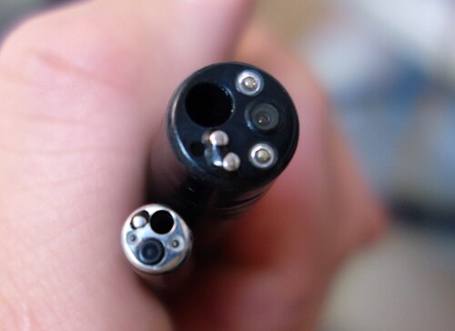
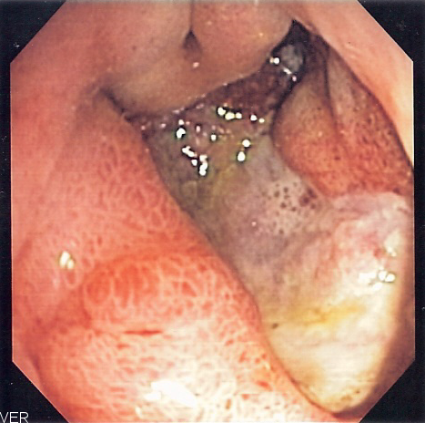

# COMPLICAÇÕES DA ENDOSCOPIA

Para entender as complicações da endoscopia, você precisa primeiro mudar sua mentalidade de "leitor de rodapé" para "médico assistente". Na prova de residência, o examinador não quer apenas que você saiba que uma perfuração existe; ele quer saber se você consegue identificar o momento exato em que o procedimento deixou de ser eletivo e se tornou uma emergência cirúrgica.

A endoscopia digestiva evoluiu de um método puramente diagnóstico para uma especialidade intervencionista complexa. Com isso, a incidência de complicações aumentou proporcionalmente à ousadia dos procedimentos. Vamos dividir nosso estudo nos três grandes pilares que caem em prova: Endoscopia Digestiva Alta (EDA), CPRE e Colonoscopia.

## Complicações da Endoscopia Digestiva Alta (EDA)

*Figura 1 - Comparação das pontas de inserção de endoscópios: endoscópio transnasal (menor calibre) e colonoscópio, instrumentos utilizados nos procedimentos endoscópicos diagnósticos e terapêuticos. Fonte: Melvil, CC BY-SA 4.0 | Wikimedia Commons*

A EDA diagnóstica é extremamente segura, com taxas de complicações globais inferiores a 0,1%. No entanto, quando passamos para a EDA terapêutica (dilatações, retirada de corpos estranhos, mucosectomias), o risco sobe.

### Perfuração Esofágica Iatrogênica

Esta é a complicação mais temida e a causa iatrogênica é, disparada, a etiologia mais comum das perfurações esofágicas em provas. O esôfago é um órgão "frágil" por natureza: não possui camada serosa, o que facilita a disseminação de ar e conteúdo gástrico para o mediastino.

**Onde ocorre?** Geralmente nos pontos de estreitamento anatômico (músculo cricofaríngeo, pinçamento diafragmático) ou em locais com patologia prévia (divertículo de Zenker, estenoses cáusticas).

**Quadro Clínico e Diagnóstico:**
Imagine o cenário: o paciente acaba de realizar uma dilatação esofágica e começa com dor torácica intensa, taquicardia e febre. Ao exame físico, você palpa um enfisema subcutâneo na região cervical.

- **Pérola de Prova:** Dor torácica + hipotensão + pneumomediastino após endoscopia = perfuração esofágica até prova em contrário.

O diagnóstico por imagem começa com a radiografia de tórax/cervical, onde podemos ver o alargamento mediastinal ou pneumomediastino. No entanto, o padrão-ouro para localização e planejamento é a Tomografia de Tórax com contraste hidrossolúvel (não use bário se suspeitar de perfuração, pois causa uma mediastinite química devastadora).

**Manejo:**
Por que alguns casos operamos e outros não?

- **Conservador:** Perfurações pequenas, diagnosticadas precocemente (< 24h), em pacientes estáveis, sem sinais de sepse e com a perfuração "contida" no mediastino.

- **Cirúrgico:** Se houver sinais de sepse, coleção mediastinal volumosa ou extravasamento importante de contraste. A conduta clássica na mediastinite aguda por perfuração é a toracotomia para limpeza, desbridamento e drenagem ampla. Se a lesão for precoce e o tecido estiver viável, tentamos a sutura primária.

### Corpo Estranho Esofágico

A retirada de corpo estranho é uma indicação clássica de EDA de urgência. O risco de perfuração aumenta com objetos pontiagudos ou baterias de disco (que causam necrose por liquefação em poucas horas). Se o paciente apresenta dor após a retirada, a rotina de abdome agudo/tórax é obrigatória para excluir iatrogenia.

## Complicações da CPRE (Colangiopancreatografia Endoscópica Retrógrada)

A CPRE é, tecnicamente, o procedimento endoscópico mais perigoso. Aqui, as bancas focam em dois grandes temas: Pancreatite e Perfuração Duodenal.

### Pancreatite Aguda Pós-CPRE

É a complicação mais comum, ocorrendo em 5% a 10% dos casos.

**Por que acontece?** O mecanismo é multifatorial: trauma mecânico na papila de Vater, edema pós-esfincterotomia, injeção excessiva de contraste no ducto pancreático (hipertensão ductal) ou lesão térmica pelo bisturi elétrico.

**Diagnóstico:** Não confunda a hiperamilasemia transitória (comum após CPRE) com pancreatite. Para o diagnóstico, precisamos de dor abdominal típica (em barra, no andar superior) associada a uma amilase ou lipase pelo menos 3 vezes acima do limite superior da normalidade, geralmente 24h após o procedimento.

**Prevenção (O que a MedEvo destaca como essencial):**
As diretrizes da SOBED e da ESGE recomendam fortemente o uso de **AINEs por via retal** (Diclofenaco ou Indometacina 100mg) imediatamente antes ou após o procedimento em todos os pacientes sem contraindicações. Isso reduz drasticamente a incidência de pancreatite. Outra medida é a hidratação vigorosa com Ringer Lactato.

### Perfuração Duodenal Pós-CPRE

Aqui o aluno costuma errar porque esquece da anatomia. O duodeno é, em grande parte, retroperitoneal. Portanto, uma perfuração aqui não vai gerar necessariamente um pneumoperitônio clássico (ar livre na cavidade), mas sim um **pneumoretroperitônio**.

**Classificação de Stapfer (Fundamental para Provas):**

| Tipo | Localização | Causa Comum | Manejo Típico |
| --- | --- | --- | --- |
| **I** | Parede lateral ou medial do duodeno | Trauma pelo próprio aparelho | **Cirúrgico (Laparotomia)** |
| **II** | Periampular (esfincterotomia) | Lesão pela papilotomia | Inicialmente Conservador |
| **III** | Ducto biliar (distal) | Lesão por fios-guia/stents | Conservador |
| **IV** | Ar retroperitoneal isolado | Ar insuflado (sem perfuração real) | Observação |

**Dica do Dr. Will:** Se a questão descreve um paciente pós-CPRE com dor epigástrica intensa, taquicardia, febre e uma TC mostrando "ar circulando o rim" ou "ar no espaço pararrenal", marque **perfuração duodenal retroperitoneal**. Se houver peritonite generalizada, o tratamento é cirúrgico. Se for uma lesão tipo II (periampular) estável, o tratamento pode ser jejum, antibiótico e vigilância.

*Figura 2 - Imagem endoscópica de úlcera gástrica profunda no antro, exemplo de achado durante EDA que pode complicar com perfuração ou hemorragia durante procedimento terapêutico. Fonte: Samir, CC BY-SA 3.0 | Wikimedia Commons*

## Complicações da Colonoscopia

A colonoscopia é o padrão-ouro para prevenção do câncer colorretal, mas a realização de polipectomias aumenta o risco de eventos adversos.

### Perfuração Colônica

A perfuração pode ser mecânica (pela ponta do aparelho ou pela "alça" de introdução) ou térmica (durante a polipectomia).

**Onde é mais comum?** No **ceco**. Por que? Pela Lei de Laplace. O ceco é o segmento de maior diâmetro do cólon; para uma mesma pressão de insuflação de ar, a tensão na parede é muito maior ali. Além disso, a parede do ceco é a mais fina de todo o intestino grosso.

**Quadro Clínico:**

- **Imediato:** O endoscopista vê a gordura epiploica ou o peritônio durante o exame.

- **Tardio:** Dor abdominal progressiva, distensão, febre e sinais de irritação peritoneal horas após o exame.

**Diagnóstico por Imagem:**
A rotina de abdome agudo (RX de tórax em pé, RX de abdome em pé e deitado) é o primeiro passo. O achado clássico é o **pneumoperitônio** (sinal do crescente subdiafragmático). Se o RX for inconclusivo mas a suspeita for alta, a TC de abdome é o próximo passo.

**Tabela: Manejo da Perfuração Colônica**

| Cenário Clínico | Conduta Sugerida |
| --- | --- |
| Perfuração pequena, cólon limpo, < 6-12h, estável | **Sutura Primária (Colorrafia)** |
| Peritonite generalizada, diagnóstico tardio (> 24h) | Ressecção (Hartmann) ou Exteriorização |
| Perfuração puntiforme vista na hora (estável) | Clipe endoscópico (se disponível) |

**Pérola de Prova:** Paciente com perfuração cecal pós-polipectomia eletiva (cólon estava limpo com preparo) nas primeiras 6 horas, sem sepse grave -> A conduta é a **sutura primária da lesão**. Não precisa de colostomia de rotina se o cólon estiver bem preparado e a lesão for precoce.

### Síndrome Pós-Polipectomia (ou Síndrome da Eletrocoagulação)

Cuidado para não confundir isso com perfuração!
A síndrome pós-polipectomia ocorre quando a corrente elétrica usada para cortar o pólipo atinge a camada serosa, causando uma **queimadura transmural**, mas SEM perfurar o órgão.

- **Clínica:** Dor abdominal localizada, febre baixa e leucocitose.

- **Diferencial:** No RX ou TC **NÃO há pneumoperitônio**.

- **Tratamento:** Conservador (jejum, hidratação e, às vezes, antibióticos). O paciente melhora rápido. Se houver ar livre, deixa de ser síndrome e vira perfuração.

### Hemorragia Pós-Polipectomia

Pode ser imediata ou tardia (até 14 dias após o procedimento, quando a escara da queimadura cai). O tratamento na maioria das vezes é uma nova colonoscopia para hemostasia (clipes, adrenalina ou eletrocoagulação).

## Diagnóstico Diferencial e Imagem: Onde os alunos travam

Um ponto crítico em provas de cirurgia é saber diferenciar os achados de imagem.

- **Pneumoperitônio:** Ar livre na cavidade peritoneal. Visto no RX de tórax como uma linha de ar abaixo do diafragma. Comum em perfurações de vísceras intraperitoniais (estômago, parede anterior do duodeno, cólon transverso, sigmoide).

- **Pneumoretroperitônio (ou Retropneumoperitônio):** Ar delineando estruturas retroperitoniais (rins, psoas, grandes vasos). Comum em perfurações de parede posterior de duodeno (pós-CPRE) ou reto extraperitoneal. No RX, você pode ver o "sinal do rim delineado por ar".

- **Pneumomediastino:** Ar no espaço entre os pulmões. Patognomônico de perfuração esofágica torácica.

**Exemplo Clínico Rápido:**
Paciente, 55 anos, pós-CPRE para retirada de cálculo em colédoco. Seis horas depois, apresenta dor em abdome superior que irradia para as costas. Estável hemodinamicamente. RX de abdome mostra ar ao redor da silhueta renal direita.

- **Diagnóstico:** Perfuração duodenal retroperitoneal (Stapfer II).

- **Conduta inicial:** Jejum, sonda nasogástrica, antibioticoterapia e vigilância rigorosa. Se piorar (febre alta, peritonite), cirurgia.

## Abordagem Cirúrgica de Urgência

Quando a prova diz que o paciente tem "peritonite generalizada" ou "instabilidade hemodinâmica" após qualquer endoscopia, a resposta quase sempre será **Laparotomia Exploradora**.

Na cirurgia, o objetivo é:

- Identificar o sítio de perfuração.

- Avaliar a viabilidade tecidual.

- Decidir entre sutura primária ou ressecção/derivação.

A **sutura primária** (colorrafia ou gastrorrafia) é preferida em:

- Lesões iatrogênicas limpas (paciente estava em preparo de cólon).

- Diagnóstico precoce (< 6-8 horas).

- Ausência de contaminação fecal maciça.

- Estabilidade hemodinâmica.

Se o paciente chega 48 horas depois, com febre de 39°C, abdome em tábua e choque séptico, a sutura primária vai deiscer (abrir). Nesse caso, optamos por ressecção com estoma (ex: Cirurgia de Hartmann no cólon).

## Situações Especiais e Pegadinhas

### O Idoso e a Endoscopia

Idosos têm paredes viscerais mais finas e frequentemente usam antiagregantes ou anticoagulantes. O risco de sangramento pós-polipectomia é maior. Além disso, a sedação (Midazolam/Fentanil) pode causar depressão respiratória mais facilmente. Sempre monitore a oximetria.

### Gestantes

A endoscopia não é contraindicada, mas deve ser evitada no primeiro trimestre se possível. A CPRE em gestantes deve ser feita com proteção de chumbo para o feto e tempo de fluoroscopia minimizado.

### O Papel da Tomografia (TC)

Muitas questões colocam o RX como o primeiro exame, e está correto. Mas se a questão pergunta qual o exame mais **sensível** para detectar pequenas quantidades de ar ou líquido livre, a resposta é **Tomografia Computadorizada de Abdome com Contraste**. Ela consegue diferenciar se o ar está no peritônio ou no retroperitônio com precisão de quase 100%.

## Pontos-Chave para Prova

- **Pancreatite pós-CPRE:** Complicação mais comum (5-10%). Prevenção com AINE retal (Diclofenaco/Indometacina).

- **Perfuração Esofágica:** Causa mais comum é iatrogênica (EDA). O sinal clássico é o enfisema subcutâneo e pneumomediastino.

- **Perfuração Duodenal pós-CPRE:** Suspeite se houver pneumoretroperitônio. Classificação de Stapfer define a conduta (Tipo I é cirúrgico; II e III geralmente conservadores).

- **Perfuração Colônica:** Local mais comum é o ceco (maior diâmetro, parede mais fina).

- **Sutura Primária:** Indicada em perfurações precoces (< 6h), cólon limpo e paciente estável.

- **Síndrome Pós-Polipectomia:** Dor + febre SEM pneumoperitônio. Tratamento é conservador.

- **Pneumoperitônio no RX:** Sinal do crescente subdiafragmático. Indica perfuração de víscera oca intraperitoneal.

- **Laparotomia Exploradora:** Indicada sempre que houver peritonite generalizada ou instabilidade após o procedimento.

- **Mediastinite Aguda:** Complicação grave da perfuração esofágica; exige drenagem ampla e antibioticoterapia.

- **Contraindicação Absoluta à EDA:** Suspeita de perfuração de víscera oca (antes do procedimento) ou instabilidade hemodinâmica não controlada (exceto se a causa for o próprio sangramento digestivo).

- **Aerobilia pós-CPRE:** É um achado esperado (ar na via biliar após papilotomia), não indica necessariamente complicação, a menos que associado a coleções.

- **Tratamento de Escolha na Perfuração de Sigmoide Estável:** Colorrafia primária (sutura).

- **Bário:** NUNCA use em suspeita de perfuração. Use contraste hidrossolúvel (Gastrografin).

- **Pérola MedEvo:** Se a questão citar "dor abdominal crescente" e "pneumoperitônio" após colonoscopia, não perca tempo: a conduta é cirúrgica. 🩺

Este material cobre a lógica por trás das complicações endoscópicas. Lembre-se: a prova quer testar seu discernimento clínico entre o que pode ser observado e o que precisa ser operado imediatamente. O segredo está no tempo de diagnóstico e na estabilidade do paciente.

 Cópia offline para consulta pessoal.
 Fonte original:
 [https://www.medevo.com.br/material-apoio/ler/bdfdf601-40e6-4a09-8ddc-310903b0a00a](https://www.medevo.com.br/material-apoio/ler/bdfdf601-40e6-4a09-8ddc-310903b0a00a)
