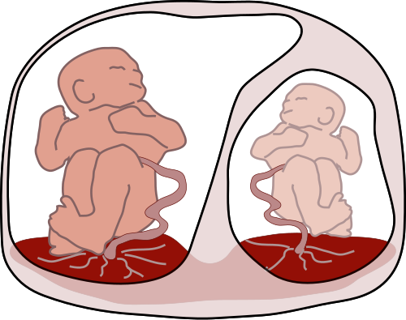

# COMPLICAÇÕES DA GEMELARIDADE

Para entender as complicações da gemelaridade, você precisa primeiro esquecer a ideia de que "gêmeos são apenas dois bebês ao mesmo tempo". Na obstetrícia, tratamos a gestação múltipla como uma condição de alto risco, e o divisor de águas para quase todas as complicações não é o número de fetos, mas sim a corionicidade.

Se você souber se a gestação é monocoriônica (uma placenta) ou dicoriônica (duas placentas), você já resolveu metade das questões de prova. A placenta é o "campo de batalha" onde as principais patologias se desenvolvem.

## O Marco Zero: Corionicidade e Zigoticidade

*Figura 1 - Diagrama ilustrando a Síndrome de Transfusão Feto-Fetal (STFF): anastomoses placentárias em gestação monocoriônica causam desequilíbrio hemodinâmico entre gêmeo doador (oligodramnia) e receptor (polidramnia). Fonte: Kevin Dufendach, CC BY 3.0 | Wikimedia Commons*

Antes de falarmos do que dá errado, precisamos saber como identificar o risco. A corionicidade deve ser definida, preferencialmente, no primeiro trimestre (até 13 semanas e 6 dias).

O sinal do lambda (ou sinal do "Y") indica uma gestação dicoriônica. Imagine que o tecido placentário se projeta para dentro da base das membranas. Já o sinal do "T" indica uma gestação monocoriônica, onde a membrana divisória é fina e se insere abruptamente na placenta.

Por que isso é a primeira coisa que ensino? Porque as complicações mais graves e específicas, como a Síndrome de Transfusão Feto-Fetal (STFF), são exclusivas das monocoriônicas. Se a questão de prova descreve uma gestação dicoriônica e pergunta sobre STFF, você já elimina essa alternativa de imediato.

## Complicações Maternas: O Dobro de Esforço, o Dobro de Risco

A adaptação materna à gestação gemelar é muito mais intensa. O débito cardíaco aumenta mais do que na gestação única, o volume plasmático expande de forma exagerada e a massa placentária é maior. Isso explica o perfil das complicações maternas.

### Pré-eclâmpsia e Hipertensão

O risco de pré-eclâmpsia em gemelares é de 2 a 3 vezes maior. Por que? Porque a maior massa placentária libera mais fatores antiangiogênicos (como o sFlt-1) na circulação materna. Além disso, a pré-eclâmpsia em gemelares tende a aparecer mais cedo e ser mais grave.

### Diabetes Gestacional

Mais placenta significa mais hormônios contrainsulínicos, especialmente o lactogênio placentário humano. O pâncreas materno é testado ao limite. Se a paciente já tiver uma predisposição, o diabetes gestacional aparecerá com quase toda certeza.

### Hiperêmese Gravídica

Os níveis de beta-hCG são significativamente mais altos em gestações múltiplas. Como o hCG compartilha uma subunidade com o TSH e estimula o centro do vômito, essas pacientes sofrem muito mais com náuseas e vômitos incoercíveis.

### Alterações Cardiovasculares Fisiológicas

Cuidado com a pegadinha: o aumento da área cardíaca no raio-X de tórax e a presença de sopros sistólicos leves podem ser fisiológicos na gestação gemelar devido ao aumento do volume e do débito cardíaco. No entanto, fique atento à Miocardiopatia Periparto (CMPP), que é mais comum em gemelares. Se houver insuficiência cardíaca com fibrilação atrial, o manejo envolve digoxina para controle de frequência, mas lembre-se: IECA, BRA e Warfarin são proibidos na gestação.

## Complicações Fetais Gerais: O Fantasma da Prematuridade

A prematuridade é a complicação mais comum da gestação gemelar. Ponto. Mais de 50% dos gêmeos nascem antes das 37 semanas.

O mecanismo é mecânico (sobredistensão uterina que gatilha contrações) e funcional (maior produção de ocitocina e prostaglandinas). Aqui entra um ponto onde muitos alunos erram em provas: o uso de progesterona e cerclagem.

Segundo a FEBRASGO e as principais diretrizes internacionais, o uso rotineiro de progesterona vaginal em gestações gemelares sem colo curto não reduz o risco de parto prematuro. A cerclagem também não deve ser feita de forma profilática apenas por ser gemelar. A indicação de cerclagem permanece restrita a casos de insuficiência istmocervical comprovada (histórico de perdas ou colo < 25mm em pacientes com antecedente de prematuridade).

### Restrição de Crescimento Fetal (RCF)

Em gestações dicoriônicas, a RCF geralmente ocorre por insuficiência placentária "comum", assim como em gestações únicas. Já em monocoriônicas, o buraco é mais embaixo. A Restrição de Crescimento Fetal Seletiva (RCFS) ocorre quando um feto fica com uma porção significativamente menor da placenta compartilhada ou quando as anastomoses vasculares prejudicam seu aporte sanguíneo.

| Característica | Gestação Dicoriônica | Gestação Monocoriônica |
| --- | --- | --- |
| **Sinal Ultrassonográfico** | Sinal do Lambda (Y) | Sinal do T |
| **Complicação mais comum** | Prematuridade | Prematuridade |
| **Risco de STFF** | Zero | Aproximadamente 15% |
| **Risco de RCF** | Comum (insuficiência placentária) | Comum (seletiva/anastomoses) |
| **Mortalidade Perinatal** | Menor | Maior (3 a 4 vezes mais) |

## Complicações Exclusivas das Monocoriônicas: O Pesadelo das Anastomoses

Aqui é onde o Dr. Will e a equipe do MedEvo costumam focar, pois é o que define quem passa e quem fica na prova de residência. Em uma placenta monocoriônica, quase sempre existem anastomoses vasculares que conectam a circulação dos dois fetos. Elas podem ser:

- Arterio-arteriais (AA): Superficiais, geralmente protetoras.

- Veno-venosas (VV): Superficiais, menos comuns.

- Arterio-venosas (AV): Profundas, ocorrem nos cotilédones placentários. São o problema real.

### 1. Síndrome de Transfusão Feto-Fetal (STFF)

A STFF é um desequilíbrio agudo/subagudo de fluxo através das anastomoses AV profundas. Um feto (doador) "doa" sangue para o outro (receptor).

- **O Doador:** Fica hipovolêmico, oligúrico e desenvolve **oligodramnia** (maior bolsão vertical - MBV < 2cm). Ele costuma ser menor, mas a discordância de peso não é o critério diagnóstico principal, e sim o líquido!

- **O Receptor:** Fica hipervolêmico, poliúrico e desenvolve **polidramnia** (MBV > 8cm antes de 20 semanas ou > 10cm após). Ele pode evoluir com sobrecarga cardíaca, insuficiência cardíaca e hidropisia.

**Dica de Prova:** O diagnóstico de STFF exige a sequência polidramnia/oligodramnia em gestação monocoriônica diamniótica. Se a questão falar em dicoriônica, não é STFF!

**Classificação de Quintero (Memorize isso!):**

- Estágio I: Polidramnia/Oligodramnia, mas a bexiga do doador ainda é visível.

- Estágio II: Bexiga do doador não é mais visível ao ultrassom.

- Estágio III: Doppler alterado (fluxo ausente ou reverso na diástole da artéria umbilical, ducto venoso alterado).

- Estágio IV: Hidropisia fetal em um ou ambos.

- Estágio V: Óbito de um ou ambos os fetos.

*Figura 2 - Ilustração esquemática da fetoscopia com fotocoagulação a laser das anastomoses placentárias, tratamento padrão-ouro para STFF a partir do estágio II de Quintero. Fonte: Francois I. Luks, MD, CC BY-SA 3.0 | Wikimedia Commons*

**Tratamento:** A fotocoagulação a laser das anastomoses placentárias é o tratamento de escolha (padrão-ouro) entre 16 e 26 semanas, especialmente a partir do estágio II de Quintero. A amnioredução é apenas paliativa.

### 2. Sequência Anemia-Policitemia (TAPS)

Diferente da STFF, a TAPS é um desequilíbrio crônico através de microanastomoses (diâmetro < 1mm). Não há grande alteração de volume de líquido amniótico. O que temos é um feto anêmico e outro policitêmico.

- **Diagnóstico:** Doppler da Artéria Cerebral Média (ACM).

- Feto Anêmico: Pico de velocidade sistólica (PVS) > 1,5 MoM.

- Feto Policitêmico: PVS < 1,0 MoM.

### 3. Restrição de Crescimento Fetal Seletiva (RCFS)

Ocorre quando há uma discordância de peso > 20-25% e um dos fetos está abaixo do percentil 10.

- **Tipo I:** Doppler normal. Prognóstico bom, conduta expectante.

- **Tipo II:** Fluxo diastólico ausente ou reverso (AREV) persistente na artéria umbilical. É o tipo mais grave, com alto risco de óbito súbito.

- **Tipo III:** Fluxo diastólico intermitente (ora normal, ora reverso). Ocorre por anastomoses AA grandes. É imprevisível.

### 4. Sequência TRAP (Gêmeo Acárdico)

É uma complicação bizarra onde um feto (acárdico) não desenvolve coração e é "alimentado" pelo outro feto (bomba) através de uma anastomose arterio-arterial de fluxo reverso.
O feto bomba faz um esforço hercúleo para manter a circulação de um "bloco de tecido" que não vai sobreviver. O risco aqui é o feto bomba morrer de insuficiência cardíaca de alto débito e polidramnia.

## O Óbito de um Gemelar: O que fazer com o sobrevivente?

Este é um dos temas que mais gera erro em provas. O manejo depende totalmente da corionicidade.

### Em Gestações Dicoriônicas

Se um feto morre, o outro geralmente fica bem. Não há conexão vascular. O risco para a mãe é a Coagulação Intravascular Disseminada (CID) se o feto morto permanecer no útero por muitas semanas (geralmente > 4 semanas). Monitoramos o fibrinogênio e o coagulograma semanalmente, mas não antecipamos o parto do sobrevivente apenas pela morte do irmão, a menos que haja maturidade pulmonar.

### Em Gestações Monocoriônicas

Aqui o cenário é dramático. No momento em que um feto morre, ocorre uma queda súbita da sua pressão arterial. Como há anastomoses, o sangue do feto vivo "foge" para o feto morto (exsanguinação aguda).
Isso causa hipotensão severa, isquemia cerebral e renal no sobrevivente.

**Erro clássico de prova:** Achar que deve fazer uma cesariana de emergência para salvar o sobrevivente. **Não faça isso!** A lesão neurológica ocorre no exato momento do óbito do primeiro feto. Retirar o sobrevivente prematuramente apenas adiciona os riscos da prematuridade a um cérebro que já pode estar lesionado. A conduta é expectante, com acompanhamento rigoroso por imagem (RNM fetal após 4 semanas para avaliar lesões cerebrais).

## Discordância de Peso: Quando se preocupar?

Nem toda discordância de peso é patológica. Consideramos discordância significativa quando a diferença é > 20% a 25%.
O cálculo é simples: (Peso do maior - Peso do menor) / Peso do maior.

Se você encontrar uma gestação dicoriônica com sexos diferentes e pesos diferentes, isso é o esperado de uma gestação dizigótica (dois óvulos, dois espermatozoides). Se a gestação for monocoriônica e houver discordância, você DEVE procurar STFF ou RCF Seletiva.

## Manejo do Parto e Pós-Parto

A via de parto em gemelares ainda gera discussão, mas a regra geral é:

- **Primeiro feto cefálico:** Pode-se tentar o parto vaginal, independentemente da apresentação do segundo feto (que pode ser manobrado após a saída do primeiro).

- **Primeiro feto não-cefálico:** Cesariana eletiva.

- **Gêmeos Monoamnióticos (mesma bolsa):** Cesariana obrigatória entre 32-34 semanas devido ao altíssimo risco de entrelaçamento de cordão.

### Amamentação

Amamentar gêmeos é possível e deve ser estimulado. A dica prática para a mãe (e que cai em prova sobre puericultura) é oferecer o seio simultaneamente. Isso otimiza o tempo de descanso da mãe e mantém o estímulo de prolactina e ocitocina elevado para garantir a produção para ambos.

### Hemorragia Pós-Parto (HPP)

Lembre-se: útero muito esticado não contrai bem. A gemelaridade é um fator de risco clássico para atonia uterina. O manejo preventivo com ocitocina na saída do primeiro ombro é mandatório.

## Tabelas Comparativas para Revisão Rápida

### Tabela 1: Diagnóstico Diferencial de Complicações Monocoriônicas

| Complicação | Critério Principal | Achado no Doppler | Líquido Amniótico |
| --- | --- | --- | --- |
| **STFF** | Sequência Poli/Oligo | Alterado nos estágios III+ | Discordante (Oligo/Poli) |
| **TAPS** | Discordância de PVS na ACM | Anemia (PVS > 1,5) / Policitemia (PVS < 1,0) | Normal em ambos |
| **RCFS** | Peso < P10 em um feto | Alterado na Artéria Umbilical (Tipos II e III) | Geralmente normal |
| **TRAP** | Feto acárdico | Fluxo reverso na artéria do acárdico | Polidramnia no feto bomba |

### Tabela 2: Momento Ideal do Parto (FEBRASGO)

| Tipo de Gestação | Idade Gestacional Recomendada |
| --- | --- |
| Dicoriônica Diamniótica | 37 a 38 semanas |
| Monocoriônica Diamniótica | 36 a 37 semanas |
| Monocoriônica Monoamniótica | 32 a 34 semanas |
| Triamniótica ou mais | Individualizar (geralmente < 35 semanas) |

## Situações Especiais e Pegadinhas

### Colelitíase e Colestase

A gestação gemelar aumenta o risco de doenças biliares. Se a paciente apresentar prurido palmo-plantar, especialmente noturno, sem lesões de pele, pense em **Colestase Intra-hepática da Gestação**. O diagnóstico é pelo aumento dos ácidos biliares. O tratamento é com ácido ursodesoxicólico e a interrupção da gestação por volta de 36-37 semanas, pelo risco de óbito fetal súbito.

Se for uma colecistite aguda, o segundo trimestre é o momento mais seguro para a colecistectomia videolaparoscópica.

### Reprodução Assistida

A Fertilização In Vitro (FIV) é a principal causa do aumento de gestações gemelares. Se forem transferidos dois embriões, a gestação será dicoriônica dizigótica. No entanto, a própria manipulação do embrião na FIV aumenta ligeiramente o risco de um desses embriões se dividir, gerando uma gestação monocoriônica dentro de uma gestação múltipla.

## Pontos-Chave para Prova

- **Corionicidade é tudo:** O sinal do lambda (dicoriônica) e o sinal do T (monocoriônica) definem o prognóstico. O melhor momento para ver é até 13-14 semanas.

- **Prematuridade:** É a complicação mais frequente. Progesterona e cerclagem NÃO são rotina para gemelares sem outros fatores de risco.

- **STFF:** Exclusiva de monocoriônicas. Diagnóstico: Polidramnia (MBV > 8cm) em um e Oligodramnia (MBV < 2cm) no outro.

- **Tratamento STFF:** Fotocoagulação a laser das anastomoses é o padrão-ouro.

- **TAPS:** Diagnóstico pelo Doppler da Artéria Cerebral Média (ACM). Não altera líquido amniótico.

- **RCF Seletiva Tipo II:** É a mais perigosa devido ao fluxo diastólico ausente/reverso persistente.

- **Óbito de um gemelar:** Em monocoriônicas, o risco para o sobrevivente é de lesão neurológica por hipotensão aguda. Não antecipe o parto de emergência.

- **Risco de CID materna:** Existe em qualquer óbito fetal mantido por semanas, mas é raro. Monitorar fibrinogênio.

- **Via de parto:** Se o primeiro for cefálico, pode tentar vaginal. Se o primeiro for pélvico ou transverso, cesariana.

- **Monoamnióticas:** Cesariana sempre (32-34 semanas) pelo risco de nó de cordão.

- **Hemorragia Pós-Parto:** Risco aumentado por atonia uterina (sobredistensão).

- **Diabetes e Pré-eclâmpsia:** Riscos muito aumentados pela maior massa placentária.

- **O que NÃO fazer:** Não indicar repouso absoluto ou cerclagem profilática apenas por ser gemelar. Não há evidência de benefício.

- **Discordância de peso:** Preocupante se > 20-25%. Sempre calcular com base no peso do feto maior.

- **Amamentação:** Estimular oferta simultânea para otimizar tempo e produção.

 Cópia offline para consulta pessoal.
 Fonte original:
 [https://www.medevo.com.br/material-apoio/ler/b2292198-c51e-42ee-b15d-e393d624f637](https://www.medevo.com.br/material-apoio/ler/b2292198-c51e-42ee-b15d-e393d624f637)
