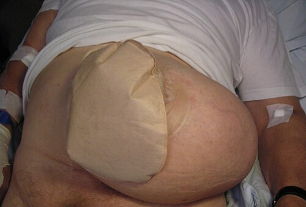

# COMPLICAÇÕES DE OSTOMIAS

Para entender as complicações das ostomias, você precisa primeiro visualizar o que é o procedimento: a exteriorização de uma víscera oca através da parede abdominal. Parece simples, mas estamos subvertendo a anatomia. Quando você cria um estoma, você está criando, tecnicamente, uma "hérnia intencional" e interrompendo a barreira cutânea em um local que agora lidará com efluentes digestivos.

As complicações são extremamente frequentes, atingindo até 50% dos pacientes em algumas séries. Para a sua prova, a primeira coisa que você deve fazer ao ler um enunciado é identificar o **tempo de aparecimento**. Dividimos didaticamente em precoces (até 30 dias de pós-operatório) e tardias (após 30 dias).

## Classificação Temporal e Incidência

*Figura 1 - Ilustração dos diferentes tipos de colostomia (terminal e em alça), procedimentos cujas complicações variam conforme a técnica empregada. Fonte: BruceBlaus/Blausen Medical, CC BY 3.0 | Wikimedia Commons*

A divisão cronológica não é apenas para organização; ela dita a sua suspeita clínica. Se o paciente operou há 3 dias e o estoma está escuro, você pensa em isquemia. Se ele operou há 2 anos e tem um abaulamento, você pensa em hérnia.

### Complicações Precoces ( 30 dias)

Aqui, o problema costuma ser a interface entre a parede abdominal e o intestino, ou a adaptação crônica do paciente.

- **Hérnia Paraestomal:** A complicação tardia mais comum de todas, especialmente em colostomias.

- **Prolapso:** Mais frequente em colostomias em alça (especialmente no transverso).

- **Estenose:** Estreitamento do orifício por cicatrização excessiva ou isquemia prévia.

- **Fístulas:** Muitas vezes associadas à recidiva de Doença de Crohn.

| Complicação | Tempo | Principal Fator de Risco | Conduta Inicial |
| --- | --- | --- | --- |
| Isquemia | Precoce | Tensão no mesentério / Obesidade | Avaliar viabilidade (teste do tubo) |
| Dermatite | Precoce/Tardia | Efluente líquido (ileostomia) | Proteção de pele / Ajuste da bolsa |
| Hérnia Paraestomal | Tardio | Localização fora do reto abdominal | Conservadora (se assintomático) |
| Prolapso | Tardio | Colostomia em alça (Transverso) | Redução manual / Cirurgia se isquemia |

## Complicações Precoces: O Olhar do Cirurgião no Pós-Operatório

### Isquemia e Necrose

Por que isso acontece? Geralmente por um erro na esqueletização do mesentério (cortar vasos demais) ou por tensão excessiva na alça ao ser exteriorizada. O paciente obeso é o maior alvo aqui, pois a parede abdominal é espessa e o mesentério é curto.

**Dica de Prova:** Se a necrose for **acima** da aponeurose (limitada à mucosa visível), a conduta pode ser conservadora e observação. Se a necrose for **abaixo** da aponeurose (intra-abdominal), a reoperação é mandatória para evitar peritonite fecal.

Como avaliar a profundidade na beira do leito? O "teste do tubo de ensaio". Você insere um tubo de vidro transparente (ou um endoscópio, se disponível) no estoma com uma lanterna. Se você vir mucosa rosa lá embaixo, a necrose é superficial. Se estiver tudo preto, prepare o centro cirúrgico.

### Dermatite Periestomal

Aqui está a "queridinha" das bancas quando o assunto é **ileostomia**. Por que a ileostomia causa mais dermatite que a colostomia? Pela fisiologia. O efluente do íleo é rico em enzimas pancreáticas e tem pH alcalino, sendo extremamente corrosivo para a pele.

A dermatite pode ser:

- **Irritativa:** Contato direto das fezes com a pele (falha na adaptação da bolsa).

- **Mecânica:** Trauma ao retirar a placa adesiva de forma brusca.

- **Alérgica:** Reação aos componentes da placa (menos comum).

**Manejo:** O Dr. Will sempre enfatiza que o tratamento não é "pomadinha". É ajuste de técnica. Deve-se usar pós protetores, barreiras cutâneas e garantir que o orifício da placa tenha exatamente o diâmetro do estoma (nem maior, deixando pele exposta; nem menor, garroteando o estoma).

### Obstrução Intestinal Pós-Operatória

Muitos alunos erram questões de obstrução por não diferenciarem o **Íleo Adinâmico** da **Obstrução Mecânica**.

No pós-operatório imediato de uma ostomia, é comum o paciente apresentar distensão, vômitos e ausência de eliminação pelo estoma. Se a tomografia não mostra um ponto de obstrução mecânica (como uma hérnia interna ou torção), o diagnóstico é íleo adinâmico (funcional).

**Conduta de Ouro:** Jejum + Sonda Nasogástrica (SNG) para descompressão + Correção de distúrbios hidroeletrolíticos (hipocalemia é o vilão aqui). A SNG é fundamental se houver vômitos ou alto débito gástrico. Na MedEvo, sempre lembramos: não se opera íleo funcional!

## Complicações Tardias: O Desafio do Ambulatório

*Figura 2 - Fotografia de hérnia paraestomal maciça em paciente idoso com colostomia, a complicação tardia mais frequente das ostomias. Fonte: Mikael Häggström, CC0 | Wikimedia Commons*

### Hérnia Paraestomal

É a complicação mais comum das colostomias terminais. Basicamente, o orifício na aponeurose dilatou e o conteúdo abdominal está saindo ao lado da alça intestinal.

**Fatores de Risco:**

- Obesidade (aumento da pressão intra-abdominal).

- Idade avançada (fraqueza muscular).

- Estoma posicionado fora do músculo reto abdominal (erro técnico clássico).

- DPOC (tosse crônica aumenta a pressão).

**Diagnóstico:** O exame físico é soberano (abaulamento à manobra de Valsalva). Porém, para **programação cirúrgica**, o melhor exame é a Tomografia Computadorizada (TAC) de abdome total com manobra de Valsalva.

**Tratamento:** Se o paciente é assintomático ou tem sintomas leves, a conduta é **conservadora** (uso de cintas abdominais). Por que não operar todo mundo? Porque a taxa de recidiva é altíssima. Reservamos a cirurgia para casos de dor intratável, dificuldade de adaptação da bolsa (o abaulamento impede a colagem) ou complicações agudas (encarceramento/estrangulamento).

### Prolapso de Estoma

O prolapso é a "telescopagem" da alça para fora do abdome. É o intestino saindo para fora além do esperado.

**Onde é mais comum?** Nas **Transversostomias em alça**.
**Por que?** O cólon transverso é extremamente móvel e o orifício criado para uma ostomia em alça é necessariamente maior.

**Cenário Clínico:** O paciente chega com 15 cm de intestino para fora da bolsa.

- Se a alça estiver **viável** (rosa, úmida) e **redutível**: Redução manual (pode-se usar açúcar para reduzir o edema por osmose antes de empurrar), adaptação de uma bolsa maior e encaminhamento para cirurgia eletiva.

- Se a alça estiver **isquêmica** ou **irredutível**: Urgência cirúrgica.

### Estenose

A estenose ocorre quando o orifício cutâneo ou aponeurótico estreita tanto que impede a saída das fezes. O paciente queixa-se de fezes "em fita" ou dor tipo cólica ao evacuar.
Muitas vezes é consequência de uma isquemia leve prévia ou de dermatites de repetição que geraram fibrose. O tratamento inicial pode ser a dilatação digital, mas a correção definitiva costuma ser cirúrgica (revisão do estoma).

| Diferença Crucial | Hérnia Paraestomal | Prolapso |
| --- | --- | --- |
| **Definição** | Saída de conteúdo AO LADO da alça | Saída da PRÓPRIA alça pelo orifício |
| **Localização** | Subcutâneo, adjacente ao estoma | O estoma "cresce" para fora |
| **Tipo de Estoma** | Mais comum em Colostomia Terminal | Mais comum em Colostomia em Alça |
| **Risco Agudo** | Estrangulamento de outra alça | Isquemia da alça prolapsada |

## Situações Especiais e Manejo Clínico

### O Paciente com Alto Débito (Ileostomias)

Uma ileostomia é considerada de "alto débito" quando elimina mais de **1.500 - 2.000 ml em 24 horas**. Isso é uma emergência metabólica oculta.
O paciente evolui rapidamente com:

- Desidratação profunda.

- Hipocalemia (potássio baixo).

- Acidose metabólica (perda de bicarbonato entérico).

- Insuficiência renal pré-renal.

**Manejo:** Reposição volêmica agressiva, uso de loperamida (para lentificar o trânsito) e, às vezes, dieta com restrição de líquidos simples (que aumentam o débito por osmose) e foco em soluções de reidratação oral.

### Planejamento Cirúrgico: A Prevenção

A melhor forma de tratar uma complicação é evitando-a. As diretrizes da Sociedade Brasileira de Coloproctologia enfatizam:

- **Demarcação Pré-operatória:** O estoma deve ser marcado com o paciente sentado, em pé e deitado. Deve passar por dentro do músculo reto abdominal e longe de cicatrizes prévias, pregas cutâneas ou da linha da cintura.

- **Técnica:** Evitar tensão. A alça deve estar bem vascularizada.

- **Uso de Telas:** Em pacientes de alto risco (obesos, idosos), o uso de telas profiláticas na criação do estoma para evitar hérnias paraestomais é uma tendência crescente, embora ainda discutida em termos de custo-benefício universal.

## Diagnóstico Diferencial de Obstrução no Ostomizado

Quando um paciente com ostomia para de funcionar, você deve seguir um algoritmo mental:

- **É precoce (dias)?**

- Pense em Íleo Adinâmico (funcional).

- Pense em Obstrução Mecânica por brida ou torção da alça (hérnia interna).

- **É tardio (meses/anos)?**

- Pense em Hérnia Paraestomal encarcerada.

- Pense em Estenose do estoma.

- Pense em Recidiva da doença de base (ex: tumor voltando no local do estoma).

- Pense em Fitobezoar (comum em ileostomias por ingestão excessiva de fibras mal mastigadas).

**Exemplo Clínico Rápido:**
Paciente, 60 anos, submetido a Ressecção de Sigmoide (Cirurgia de Hartmann) há 2 anos por câncer colorretal. Chega com dor abdominal, vômitos e abaulamento endurecido ao lado da colostomia terminal. Não elimina fezes há 24h.

- **O que é?** Provável Hérnia Paraestomal encarcerada.

- **Primeiro passo?** Estabilização, jejum, SNG e Tomografia para confirmar se há sofrimento de alça.

## Pontos-Chave para Prova

- **Hérnia Paraestomal:** É a complicação mais comum das colostomias terminais. O tratamento é cirúrgico apenas se houver sintomas ou complicações.

- **Prolapso:** É mais comum em colostomias em alça, especialmente no cólon transverso (devido à grande mobilidade do mesocolon).

- **Dermatite Periestomal:** É a complicação mais frequente das ileostomias. O manejo foca na proteção da pele e ajuste da placa, não apenas em cremes.

- **Isquemia de Estoma:** Se for acima da aponeurose, observação. Se for abaixo (profunda), reoperação imediata.

- **Íleo Adinâmico:** Conduta inicial é sempre conservadora (Jejum + SNG + Correção de eletrólitos).

- **Localização Ideal:** O estoma deve ser posicionado através do músculo reto abdominal para reduzir o risco de hérnias e prolapsos.

- **Teste do Tubo de Ensaio:** Usado para avaliar a profundidade da necrose no estoma precocemente.

- **Alto Débito em Ileostomia:** Definição > 1.500-2.000 ml/dia. Risco de hipocalemia e insuficiência renal.

- **Manobra de Valsalva:** Essencial no exame físico e na Tomografia para diagnosticar hérnias paraestomais.

- **Açúcar no Prolapso:** Pode ser usado topicamente para reduzir o edema por osmose e facilitar a redução manual de um prolapso viável.

- **Fator de Risco para Hérnia:** Obesidade, DPOC, desnutrição e técnica cirúrgica (estoma fora do reto abdominal).

- **Contraindicação Absoluta de Irrigação de Colostomia:** Não se faz irrigação em pacientes com ileostomia ou colostomia em alça (risco de desequilíbrio e trauma). É técnica para colostomia terminal de descendente/sigmoide.

- **Fitobezoar:** Causa comum de obstrução em ileostomias; o paciente deve ser orientado a mastigar muito bem os alimentos fibrosos.

- **SNG:** Indicada sempre que houver vômitos, distensão gástrica importante ou íleo adinâmico de alto débito.

- **Tomografia:** É o padrão-ouro para diferenciar complicações mecânicas de funcionais e para planejar a correção de hérnias.

Lembre-se: em provas de residência, a banca quer saber se você sabe diferenciar o que é **urgência** (isquemia profunda, hérnia estrangulada, prolapso isquêmico) do que é **manejo ambulatorial** (dermatite leve, hérnia redutível, estenose leve). Foque no "porquê" de cada complicação e você não errará as questões. Como sempre dizemos na MedEvo, o detalhe técnico salva o paciente, mas o raciocínio clínico salva a sua nota.

 Cópia offline para consulta pessoal.
 Fonte original:
 [https://www.medevo.com.br/material-apoio/ler/141ef493-e46f-48e6-8ef1-79c0c5023a8e](https://www.medevo.com.br/material-apoio/ler/141ef493-e46f-48e6-8ef1-79c0c5023a8e)
