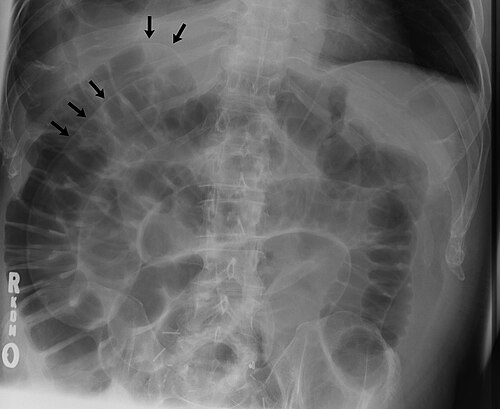

# COMPLICAÇÕES DO PNEUMOPERITÔNIO

Para entender as complicações do pneumoperitônio, você precisa primeiro entender que o corpo humano não foi projetado para ter 12 a 15 mmHg de pressão positiva dentro da cavidade abdominal. Quando o cirurgião insufla CO2, ele cria um novo ambiente fisiológico que força o organismo a se adaptar em tempo real.

As bancas de residência amam esse tema porque ele mistura cirurgia, anestesia e fisiologia. Aqui no MedEvo, sempre reforçamos: não decore a lista de complicações, entenda a cascata de eventos que o aumento da pressão intra-abdominal (PIA) desencadeia.

## A Escolha do Gás: Por que CO2?

*Figura 1 - Radiografia de tórax em pé evidenciando pneumoperitônio: presença de ar livre sob as cúpulas diafragmáticas (sinal do crescente subdiafragmático), achado clássico que pode ser pós-operatório ou indicar perfuração de víscera oca. Fonte: Bill Rhodes, CC BY 2.0 | Wikimedia Commons*

Antes de falarmos do que dá errado, precisamos entender por que usamos o Dióxido de Carbono (CO2). Tecnicamente, poderíamos usar Hélio, Argônio ou Óxido Nitroso, mas o CO2 reina absoluto por três motivos que caem em prova:

- **Alta solubilidade sanguínea:** O CO2 é 20 vezes mais solúvel que o Oxigênio. Se uma bolha entrar no vaso (embolia), ela se dissolve rapidamente.

- **Não combustível:** Essencial para o uso do eletrocautério.

- **Barato e disponível.**

O problema é que essa alta solubilidade é uma faca de dois gumes. O CO2 atravessa o peritônio por difusão simples (lembre-se: trocas gasosas na membrana alvéolo-capilar também são por difusão simples) e cai na corrente sanguínea, gerando a famosa hipercapnia.

## Efeitos Hemodinâmicos: O Coração Sob Pressão

Quando começamos a insuflação, o sistema cardiovascular sofre um impacto imediato. Imagine o abdome como um segundo compartimento que, ao ser pressionado, empurra o sangue e os órgãos.

### O Débito Cardíaco e o Retorno Venoso

Este é um ponto onde muitos alunos erram. O efeito do pneumoperitônio no débito cardíaco (DC) depende da pressão utilizada.

Em pressões baixas (até 10 mmHg), pode haver um aumento transitório do retorno venoso por "espremimento" do sangue esplâncnico para a veia cava inferior. No entanto, o que as provas cobram é o efeito do pneumoperitônio padrão (12-15 mmHg):

- **Aumento da Resistência Vascular Sistêmica (RVS):** A compressão mecânica das artérias e a liberação de catecolaminas e vasopressina aumentam a pós-carga.

- **Redução do Retorno Venoso:** A pressão sobre a veia cava inferior dificulta a subida do sangue, diminuindo a pré-carga.

- **Resultado Final:** Queda do Débito Cardíaco.

**Dica de Prova:** Se a questão falar de um paciente cardiopata, a insuflação deve ser lenta e a pressão mantida entre 10-12 mmHg para minimizar essa queda do DC.

### A Bradicardia e o Reflexo Vagal

Imagine a cena: o cirurgião coloca a agulha de Veress, começa a insuflar e, subitamente, o monitor da anestesia apita: bradicardia severa.

**O Porquê:** A distensão súbita do peritônio estimula mecanorreceptores que ativam o nervo vago. É a complicação arritmogênica mais comum no início da cirurgia.
**Conduta Imediata:** Parar a insuflação e esvaziar o pneumoperitônio imediatamente. Se não resolver, Atropina.

> **Exemplo Clínico:** Um lactente de 8 meses está sendo submetido a uma correção de hérnia inguinal via laparoscópica. Logo após o início da insuflação, a frequência cardíaca cai de 140 para 60 bpm. O que fazer? Como o Dr. Will sempre diz em aula: "Tire o gás primeiro, pergunte depois". A conduta é a descompressão imediata.

| Parâmetro Hemodinâmico | Alteração com Pneumoperitônio |
| --- | --- |
| Débito Cardíaco | Diminui (em pressões > 12 mmHg) |
| Resistência Vascular Sistêmica | Aumenta significativamente |
| Pressão Arterial Média (PAM) | Aumenta (pelo aumento da RVS) |
| Frequência Cardíaca | Pode aumentar (compensatório) ou diminuir (vagal) |
| Pressão Venosa Central (PVC) | Aumenta (falsa leitura por pressão extrínseca) |

## Efeitos Respiratórios: A Luta contra o Diafragma

O pneumoperitônio é um "inimigo" da mecânica respiratória. Ele empurra o diafragma para cima (cefálico), o que reduz o espaço para os pulmões expandirem.

### Alterações de Volumes e Complacência

- **Redução da Capacidade Residual Funcional (CRF):** O pulmão fica "menor" no final da expiração.

- **Redução da Capacidade Vital:** O paciente consegue inspirar e expirar menos ar total.

- **Aumento da Pressão de Pico nas Vias Aéreas:** O ventilador precisa de mais força para empurrar o ar contra um diafragma pressionado.

### Hipercapnia e Acidose Respiratória

Como o CO2 é absorvido pelo peritônio, a pressão parcial de CO2 no sangue (PaCO2) sobe. O anestesista percebe isso pelo aumento do ETCO2 (capnografia).
**Manejo:** Para compensar a hipercapnia, deve-se aumentar a ventilação-minuto (geralmente aumentando o volume corrente ou a frequência respiratória no ventilador).

**Cuidado:** Muitos alunos confundem e acham que a hipoxemia é a regra. Na verdade, a hipercapnia é muito mais frequente. A hipoxemia só ocorre se houver atelectasias importantes ou se o paciente já tiver reserva pulmonar limítrofe.

## Efeitos em Órgãos Alvo: Rim e Cérebro

### O Fluxo Renal

O pneumoperitônio é "nefrotóxico" funcional. O aumento da PIA causa:

- Compressão direta do parênquima renal.

- Compressão da veia renal (dificulta a saída do sangue).

- Redução do fluxo arterial por queda do débito cardíaco.

O resultado é a queda da Taxa de Filtração Glomerular (TFG) e oligúria intraoperatória. **Dica de Prova:** Não se desesperar com oligúria durante a laparoscopia; ela costuma ser reversível logo após a descompressão.

### Pressão Intracraniana (PIC)

Este é um conceito avançado que as bancas adoram. O pneumoperitônio **aumenta** a PIC.
**Por que?**

- A hipercapnia causa vasodilatação das artérias cerebrais.

- O aumento da pressão intratorácica (pelo diafragma elevado) dificulta o retorno venoso das veias jugulares.

Portanto, em pacientes com traumatismo cranioencefálico (TCE) grave ou tumores cerebrais com hipertensão intracraniana, a laparoscopia deve ser evitada ou feita com extrema cautela.

*Figura 2 - Radiografia abdominal em decúbito dorsal demonstrando o sinal da dupla parede (double wall sign): o ar na cavidade peritoneal e no lúmen intestinal acentuam ambos os lados da parede do intestino. Fonte: Mikael Häggström/Scott1751, CC BY-SA 3.0 | Wikimedia Commons*

## Complicações Específicas e Catastróficas

### Embolia Gasosa

Embora rara devido à alta solubilidade do CO2, é a complicação mais temida. Ocorre quando o gás é insuflado diretamente dentro de um vaso calibroso (ex: agulha de Veress na veia cava ou veia porta).

- **Sinais:** Queda súbita do ETCO2 (o gás no ventrículo direito impede o sangue de chegar ao pulmão), hipotensão severa, cianose e o clássico "ruído de moinho de vento" na ausculta cardíaca.

- **Conduta (Posição de Durant):** Colocar o paciente em decúbito lateral esquerdo e Trendelenburg. Isso faz com que a bolha de gás se desloque para o ápice do ventrículo direito, liberando a via de saída da artéria pulmonar.

### Dor Referida no Ombro

Quase todo paciente pós-laparoscopia reclama de dor no ombro direito.

- **Mecanismo:** O CO2 residual irrita o nervo frênico no diafragma. Como o nervo frênico compartilha raízes nervosas (C3-C5) com os nervos que suprem o ombro, o cérebro interpreta a dor como vindo do ombro.

- **Prevenção:** Aspiração cuidadosa do gás ao final da cirurgia e infusão lenta de CO2.

## Hipertensão Intra-abdominal (HIA) e Síndrome Compartimental Abdominal (SCA)

Aqui entramos no território da terapia intensiva e cirurgia de trauma, mas que se conecta diretamente com a fisiologia do pneumoperitônio. A PIA normal em pacientes críticos é de cerca de 5 a 7 mmHg.

### Definições Cruciais

- **Hipertensão Intra-abdominal (HIA):** PIA sustentada ≥ 12 mmHg.

- **Síndrome Compartimental Abdominal (SCA):** PIA sustentada > 20 mmHg associada a uma **nova disfunção de órgãos**.

**Pegadinha de Prova:** Ter PIA de 22 mmHg sem disfunção de órgãos NÃO é síndrome compartimental, é apenas HIA grau III. Para ser SCA, TEM que ter disfunção (ex: queda da diurese, necessidade de droga vasoativa, piora da ventilação).

### Classificação da HIA (WSACS)

| Grau | Pressão Intra-abdominal (PIA) |
| --- | --- |
| Grau I | 12 - 15 mmHg |
| Grau II | 16 - 20 mmHg |
| Grau III | 21 - 25 mmHg |
| Grau IV | > 25 mmHg |

### Pressão de Perfusão Abdominal (PPA)

Assim como temos a Pressão de Perfusão Cerebral, temos a Abdominal.
**Cálculo:** PPA = PAM - PIA.
O objetivo é manter a PPA > 60 mmHg. Se a PPA cair abaixo disso, as vísceras param de receber sangue adequadamente.

> **Exemplo Clínico:** Paciente vítima de trauma abdominal, em pós-operatório de laparotomia, apresenta distensão abdominal importante, oligúria e aumento da pressão de pico no ventilador. A PIA medida via sonda vesical é de 26 mmHg. Qual a conduta? **Resposta:** Estamos diante de uma SCA (PIA > 20 + disfunção renal e respiratória). A conduta é a descompressão abdominal cirúrgica imediata (laparotomia e deixar em peritoneostomia/bolsa de Bogotá).

## Complicações do Acesso: Veress vs. Hasson

Muitas complicações ocorrem antes mesmo do pneumoperitônio estar estabelecido, durante a criação do acesso.

- **Agulha de Veress (Técnica Cega):** Maior risco de lesão vascular (vasos ilíacos, aorta) e lesão de vísceras ocas. Se você aspirar sangue ou conteúdo entérico pela agulha, a lesão está confirmada.

- **Técnica de Hasson (Técnica Aberta):** É mais segura em pacientes com cirurgias prévias (risco de aderências). No entanto, não elimina 100% o risco de lesão intestinal.

**Erro Comum:** Achar que a técnica de Hasson é obrigatória em todos os pacientes. Na verdade, ela é a primeira escolha em pacientes com cicatrizes abdominais prévias ou em crianças, mas a técnica de Veress ainda é amplamente utilizada e segura em mãos experientes.

## Diagnóstico Diferencial de Instabilidade Súbita

Se o paciente chocar durante a laparoscopia, você deve pensar em quatro coisas principais:

| Diagnóstico | Pista Clínica | Conduta |
| --- | --- | --- |
| **Reflexo Vagal** | Bradicardia súbita logo na insuflação | Desinsuflar + Atropina |
| **Embolia Gasosa** | Queda do ETCO2 + Ruído de moinho | Posição de Durant + O2 100% |
| **Pneumotórax Hipertensivo** | Aumento da pressão de via aérea + desvio de traqueia | Toracocentese/Drenagem |
| **Hemorragia Aguda** | Taquicardia + Queda da PAM (lesão de grande vaso) | Conversão imediata para laparotomia |

## Situações Especiais

### Gestantes

A laparoscopia pode ser realizada em gestantes (preferencialmente no 2º trimestre). O cuidado principal é manter a PIA mais baixa (10-12 mmHg) e monitorar o status fetal e a capnografia materna rigorosamente, para evitar que a acidose respiratória materna cause acidose fetal.

### Obesidade Mórbida

O obeso já tem uma PIA basal mais elevada (pode chegar a 9-12 mmHg sem ser patológico). Nesses pacientes, a HIA é comum, mas a progressão para SCA depende da reserva funcional. A ventilação é o maior desafio devido à baixa complacência da parede torácica.

## Pontos-Chave para Prova

- **PIA Normal:** 5 a 7 mmHg em pacientes críticos.

- **Definição de HIA:** PIA ≥ 12 mmHg.

- **Definição de SCA:** PIA > 20 mmHg + Nova Disfunção Orgânica.

- **Tratamento da SCA:** Descompressão cirúrgica (Laparotomia descompressiva).

- **PPA Alvo:** Manter Pressão de Perfusão Abdominal (PAM - PIA) > 60 mmHg.

- **Gás de Escolha:** CO2 (alta solubilidade, não inflamável).

- **Mecanismo da Hipercapnia:** Difusão simples do CO2 através do peritônio.

- **Arritmia mais comum:** Bradicardia por reflexo vagal (estiramento do peritônio).

- **Efeito Renal:** Oligúria por compressão da veia renal e parênquima (reversível).

- **Efeito no SNC:** Aumento da PIC (vasodilatação por CO2 + dificuldade de retorno venoso).

- **Posição de Durant:** Decúbito lateral esquerdo + Trendelenburg (usada na embolia gasosa).

- **Dor no Ombro:** Irritação do nervo frênico (dor referida C3-C5).

- **Contraindicação Absoluta:** Não há muitas absolutas hoje em dia, mas a instabilidade hemodinâmica não corrigível e a hipertensão intracraniana grave são as principais.

- **Técnica de Hasson:** Preferencial em pacientes com cirurgias abdominais prévias (cicatriz umbilical).

- **Capacidade Vital e CRF:** Ambas diminuem durante o pneumoperitônio.

- **O que NÃO fazer:** Não ignore uma bradicardia súbita; a primeira medida é sempre interromper o estímulo (esvaziar o gás).

Lembre-se: o pneumoperitônio é uma ferramenta fantástica, mas exige que o cirurgião e o anestesista falem a mesma língua. Se o ETCO2 subir demais ou a pressão de via aérea estourar, o problema pode estar no excesso de pressão que você está colocando no abdome do paciente. Como dizemos no MedEvo, a fisiologia sempre vence no final.

 Cópia offline para consulta pessoal.
 Fonte original:
 [https://www.medevo.com.br/material-apoio/ler/58f875de-cc5e-473d-957a-b40a530850fa](https://www.medevo.com.br/material-apoio/ler/58f875de-cc5e-473d-957a-b40a530850fa)
