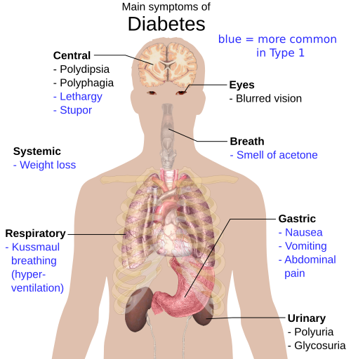

# CONDIÇÕES CRÔNICAS NA APS

Para entender as condições crônicas na Atenção Primária à Saúde (APS), você precisa primeiro mudar a chave do raciocínio clínico de "pronto-socorro" para "continuidade". Na prova de residência, as bancas não querem apenas que você saiba a dose do Enalapril, elas querem saber se você entende como gerenciar um paciente que terá essa doença pelos próximos 30 anos.

O grande desafio da APS, e o que mais cai em prova, é a transição do modelo de atenção às condições agudas para o Modelo de Atenção às Condições Crônicas (MACC). Enquanto na urgência o foco é o sintoma e a cura, na APS o foco é a funcionalidade e o controle.

## O Modelo de Atenção às Condições Crônicas (MACC)

Por que o sistema de saúde tradicional falha com o paciente crônico? Porque ele é reativo. O paciente espera ter uma crise para procurar o serviço. No MACC, proposto por pesquisadores como Edward Wagner e adaptado no Brasil por Eugênio Vilaça Mendes, a lógica é proativa.

O ponto central aqui é o Autocuidado Apoiado. Guarde este termo: o paciente não é um receptáculo passivo de prescrições, ele é o protagonista. O médico atua como um facilitador, ajudando o paciente a desenvolver habilidades para gerenciar sua própria saúde. Isso envolve metas pactuadas e decisão compartilhada. Se a banca perguntar o que aumenta a adesão terapêutica, a resposta quase sempre passa por vínculo, instruções claras e simplificação do tratamento.

Um conceito que as bancas adoram é o das Condições Sensíveis à Atenção Primária (CSAP). São doenças que, se bem manejadas na unidade básica, não deveriam gerar internação hospitalar. Exemplos clássicos: HAS, DM, asma e gastroenterites. Se o número de internações por CSAP está alto em uma região, isso é um indicador de que a APS não está sendo efetiva.

## Hipertensão Arterial Sistêmica (HAS) na APS

*Figura 1 - Diagrama das principais complicações da HAS não controlada: cérebro (AVC), olhos (retinopatia), coração (ICC, IAM), rins (nefropatia) e vasos (aterosclerose). Fonte: Mikael Häggström, Domínio Público | Wikimedia Commons*

A HAS é uma das condições crônicas mais comuns na APS. Pela **Diretriz Brasileira de Hipertensão Arterial – 2025** (Arq. Bras. Cardiol. 2025;122(9):e20250624), o diagnóstico não deve se basear em uma única medida casual, salvo situações de urgência/emergência hipertensiva ou lesão de órgão-alvo evidente. A lógica da APS é confirmar, estratificar risco, acompanhar adesão e evitar complicações como AVC, IAM, insuficiência cardíaca e DRC.

### Diagnóstico e Classificação

Para o diagnóstico no consultório, precisamos de PA ≥ 140 e/ou 90 mmHg em **duas ocasiões diferentes**. Sempre que possível, a diretriz recomenda confirmar e monitorar com medidas fora do consultório: **MAPA** (Monitorização Ambulatorial da PA) ou **MRPA** (Monitorização Residencial da PA). Isso evita dois erros clássicos: hipertensão do avental branco e hipertensão mascarada.

| Categoria | Sistólica (mmHg) | Diastólica (mmHg) |
| --- | --- | --- |
| PA normal | < 120 | e < 80 |
| Pré-hipertensão | 120 - 139 | e/ou 80 - 89 |
| Hipertensão Estágio 1 | 140 - 159 | e/ou 90 - 99 |
| Hipertensão Estágio 2 | 160 - 179 | e/ou 100 - 109 |
| Hipertensão Estágio 3 | ≥ 180 | e/ou ≥ 110 |

Dica de prova: Se o paciente tem PA de 145/85, ele é hipertenso estágio 1. Sempre prevalece a categoria mais alta, seja sistólica ou diastólica. Hipertensão sistólica isolada também conta e é estadiada pela PAS.

### Estratificação de Risco e Metas

Não tratamos apenas números, tratamos risco. Um paciente com PA 142/92 jovem e sem fatores de risco tem manejo diferente de um paciente com a mesma PA que é diabético, tem DRC ou já teve IAM. Na diretriz de 2025, **DM, DRC estágio 3 ou lesão de órgão-alvo** colocam o hipertenso em **alto risco**; doença cardiovascular estabelecida ou DRC estágio ≥ 4 colocam em **muito alto risco**.

A meta pressórica geral para pessoas com HAS é **PA < 130/80 mmHg, se tolerada**. Se não for tolerada, deve-se buscar o menor valor seguro, especialmente em idosos frágeis, hipotensão ortostática ou polifarmácia.

### Tratamento Farmacológico

Todos com PA ≥ 120/80 devem receber medidas não medicamentosas: redução de sódio (< 2 g/dia de sódio, equivalente a < 5 g/dia de sal), padrão alimentar saudável/DASH, atividade física, perda de peso quando indicada, redução de álcool e cessação do tabagismo.

Tratamento medicamentoso na APS:

- **PA ≥ 140/90 mmHg:** iniciar anti-hipertensivo no diagnóstico, junto com medidas não medicamentosas.

- **PA 130-139/80-89 mmHg + alto risco cardiovascular:** considerar medicamento se não controlar após cerca de 3 meses de medidas não medicamentosas.

- **Idosos:** em geral iniciar quando PAS ≥ 140 mmHg, individualizando em ≥ 80 anos, fragilidade e hipotensão ortostática.

Classes preferenciais:

- Diuréticos tiazídicos ou tiazídicos-símiles (hidroclorotiazida, clortalidona, indapamida).

- IECA (enalapril/captopril) ou BRA (losartana/valsartana). **Nunca combine IECA + BRA.**

- Bloqueadores dos canais de cálcio (anlodipino).

A maioria dos pacientes precisará de combinação. A combinação preferida costuma ser bloqueador do SRAA (IECA ou BRA) + bloqueador de canal de cálcio ou diurético tiazídico/tiazídico-símile. Betabloqueador (atenolol, propranolol, carvedilol, metoprolol) não é primeira linha universal para HAS essencial; entra quando há indicação específica, como pós-IAM, angina, fibrilação atrial ou ICFEr.

## Diabetes Mellitus Tipo 2 (DM2)

No DM2, o foco na APS é evitar as complicações microvasculares (retinopatia, nefropatia, neuropatia) e macrovasculares (IAM, AVC).

### Diagnóstico

Os critérios são claros e você precisa decorá-los com as unidades:

- Glicemia de jejum ≥ 126 mg/dL.

- Glicemia 2h após TOTG (75g de glicose) ≥ 200 mg/dL.

- Hemoglobina Glicada (HbA1c) ≥ 6,5%.

- Glicemia aleatória ≥ 200 mg/dL com sintomas clássicos de hiperglicemia (os 4 Ps: poliúria, polidipsia, polifagia e perda de peso).

Atenção: Exceto no caso de sintomas inequívocos, o diagnóstico exige dois exames alterados. Pode ser o mesmo exame repetido ou dois exames diferentes.

### Manejo Terapêutico

A metformina continua sendo uma opção inicial frequente na APS por custo, segurança e experiência de uso, se não houver contraindicação. Mas o tratamento moderno do DM2 não é apenas “baixar glicose”: é reduzir risco cardiovascular, renal e de hospitalização.

Conduta prática atual:

- **Base para todos:** alimentação, atividade física, perda de peso quando indicada, cessação de tabagismo, sono, saúde mental e educação em autocuidado.

- **Meta de HbA1c:** geralmente < 7% para adultos, mas individualize. Em idosos frágeis, múltiplas comorbidades ou risco de hipoglicemia, aceite metas mais flexíveis (por exemplo, < 8% ou < 8,5%).

- **ASCVD, insuficiência cardíaca ou DRC:** considerar **iSGLT2 e/ou agonista de receptor GLP-1 com benefício comprovado**, independentemente da HbA1c inicial ou do uso prévio de metformina, quando disponível e indicado.

- **HbA1c ≥ 1,5% acima da meta:** considerar terapia dupla desde o início.

- **Insulina:** considerar se houver catabolismo, sintomas intensos, cetose, glicemia ≥ 300 mg/dL ou HbA1c ≥ 10%.

No SUS, sulfonilureias ainda aparecem muito em prova e na prática. Elas aumentam secreção de insulina e podem causar hipoglicemia. Em idosos, evite especialmente **glibenclamida**, por meia-vida longa e risco de hipoglicemia prolongada. Se cair na prova idoso com hipoglicemia e polifarmácia, pense em revisão medicamentosa, simplificação do esquema e desprescrição segura.

### O Pé Diabético

Esta é uma das maiores causas de internação sensível à APS. O exame dos pés deve ser anual. Você deve testar a sensibilidade protetora com o monofilamento de 10g. Se o paciente já tem complicações estabelecidas, como retinopatia proliferativa, a APS deve coordenar o cuidado e referenciar para o especialista (oftalmologista), mas o controle metabólico continua na unidade básica.

*Figura 2 - Sinais e sintomas clássicos do diabetes: poliúria, polidipsia, polifagia e perda de peso. Reconhecer precocemente possibilita diagnóstico e controle na APS. Fonte: Mikael Häggström, Domínio Público | Wikimedia Commons*

## Prevenção e Rastreamento: Os Quatro Níveis

Este é o tema favorito das bancas de Preventiva. Você precisa saber onde cada ação se encaixa.

- **Prevenção Primária:** Agir antes da doença existir. Foco em remover fatores de risco. Exemplos: Vacinação, orientação de atividade física (150 min/semana de intensidade moderada), cessação do tabagismo.

- **Prevenção Secundária:** Diagnóstico precoce em pacientes assintomáticos. É aqui que entra o rastreamento (screening). Exemplo: Rastreamento de HIV para todos entre 15 e 65 anos (USPSTF), mamografia, citopatológico de colo de útero.

- **Prevenção Terciária:** Reduzir o impacto de uma doença já estabelecida. Foco em reabilitação e prevenção de complicações. Exemplo: Fisioterapia pós-AVC, uso de IECA para evitar remodelamento cardíaco pós-IAM.

- **Prevenção Quaternária:** Evitar a iatrogenia. É proteger o paciente de intervenções médicas desnecessárias e excesso de medicalização. Exemplo: Não pedir PSA para um homem de 90 anos, não pedir check-up de rotina para jovens assintomáticos sem fatores de risco, propor higiene do sono em vez de benzodiazepínicos para insônia inicial.

Dica do Dr. Will: A prevenção quaternária é um dos pilares da Medicina de Família e Comunidade moderna. Se a questão mostrar um médico evitando um exame que não tem evidência de benefício, ele está praticando prevenção quaternária.

### Rastreamento de Câncer (Ministério da Saúde/INCA - atualização 2025)

| Câncer | População-alvo | Periodicidade/conduta |
| --- | --- | --- |
| Colo do útero | Mulheres e pessoas com colo do útero, 25 a 64 anos, que já tiveram atividade sexual | Onde houver **teste molecular de DNA-HPV oncogênico** implantado: repetir a cada 5 anos se negativo. Onde ainda não houver DNA-HPV: citopatológico/Papanicolau a cada 3 anos após 2 exames anuais normais. |
| Mama | Mulheres de 50 a 74 anos | Mamografia a cada 2 anos. Inclui homens trans e pessoas não-binárias designadas mulher ao nascer que mantêm mamas. |
| Próstata | População masculina assintomática | O Ministério da Saúde/INCA **não recomenda rastreamento populacional** com PSA/toque retal. Se o paciente solicitar, fazer decisão compartilhada explicando falsos positivos, sobrediagnóstico e sobretratamento. |
| Colorretal/intestino | Pessoas de risco médio a partir de 50 anos, se houver capacidade de confirmação diagnóstica e tratamento | Pesquisa de sangue oculto nas fezes como teste de rastreamento possível; colonoscopia/retossigmoidoscopia confirmam e investigam positivos. Alto risco (história familiar, DII, Lynch/PAF) deve ser avaliado em serviço especializado. |

Pegadinha de prova: A banca pode colocar uma mulher de 20 anos querendo fazer preventivo. Se ela não tem sintomas, a conduta é orientar que o rastreamento começa aos 25 anos. Fazer antes disso aumenta o risco de procedimentos desnecessários em lesões que regrediriam sozinhas.

Atualização importante: em 2025, o Brasil aprovou diretrizes para rastreamento organizado do câncer do colo do útero com **DNA-HPV oncogênico** como exame primário. O Papanicolau não “sumiu”: ele continua válido onde o novo teste ainda não estiver implantado.

## Multimorbidade e Polifarmácia

Na APS, raramente você encontrará o "paciente de livro" que tem apenas uma doença. A multimorbidade (duas ou mais condições crônicas no mesmo indivíduo) é a regra, especialmente em idosos.

Isso leva à polifarmácia, definida geralmente como o uso de 5 ou mais medicamentos. A polifarmácia aumenta o risco de interações medicamentosas, quedas e baixa adesão. Aqui entra o conceito de Desprescrição. Desprescrever é um processo clínico deliberado de interromper ou reduzir a dose de medicamentos cujos riscos superam os benefícios.

Exemplo clínico: Um paciente de 70 anos usa Enalapril, Hidroclorotiazida, Metformina, Glibenclamida, Sinvastatina e Diazepam. Ele se queixa de tontura e quedas. O que fazer? Antes de pedir uma tomografia de crânio, revise a medicação. O Diazepam é um culpado clássico por quedas em idosos, e a Glibenclamida pode estar causando hipoglicemias subclínicas.

## Abordagem de Sintomas Comuns na APS

### Lombalgia

A maioria das lombalgias na APS é inespecífica e autolimitada. O segredo aqui é procurar pelos "Red Flags" (sinais de alerta) que indicam patologias graves (câncer, infecção, fratura, síndrome da cauda equina):

- Idade > 50 anos ou < 20 anos.

- História de neoplasia.

- Perda de peso inexplicada.

- Febre.

- Trauma recente.

- Déficit neurológico focal ou perda de controle esfincteriano.

Se não houver Red Flags, não peça imagem! O tratamento é sintomático e, fundamentalmente, manter o paciente ativo. Repouso absoluto é contraindicado e retarda a recuperação.

### Infecção do Trato Urinário (ITU)

Em mulheres jovens, não gestantes e sem comorbidades, a cistite aguda pode ser tratada de forma empírica. As opções de primeira escolha são Nitrofurantoína (100mg 12/12h por 5 dias) ou Fosfomicina (dose única 3g).

Diferença crucial: Na gestante, qualquer bacteriúria (mesmo assintomática) DEVE ser tratada. Por que? Porque a gestante tem maior risco de progressão para pielonefrite, o que pode causar parto prematuro e outras complicações fetais. Sempre peça urocultura de controle após o tratamento na gestante.

### Tuberculose (TB)

A APS é o local de diagnóstico e acompanhamento da TB. O sintoma clássico é a tosse por 3 semanas ou mais (sintomático respiratório). O tratamento é o esquema RIPE (Rifampicina, Isoniazida, Pirazinamida e Etambutol) por 2 meses, seguido de 4 meses de RI.

Critério de cura: O principal critério de cura da tuberculose é a baciloscopia de escarra negativa no acompanhamento mensal, especialmente ao final do tratamento.

## Comunicação e Abordagem Centrada na Pessoa

Como o MedEvo sempre enfatiza, a técnica de comunicação é tão importante quanto a prescrição. O Método Clínico Centrado na Pessoa (MCCP) baseia-se em quatro pilares:

- Explorar a doença (biológico) e a experiência da pessoa com a doença (sentimentos, ideias, expectativas e função).

- Entender a pessoa como um todo (contexto familiar e social).

- Elaborar um plano conjunto (decisão compartilhada).

- Fortalecer a relação médico-pessoa.

Se o paciente não entende por que precisa tomar o remédio ou se o plano de cuidado colide com suas crenças culturais (competência cultural), ele não seguirá o tratamento. A entrevista motivacional é uma ferramenta poderosa aqui, especialmente para mudanças de estilo de vida, como parar de fumar ou perder peso.

## Situações Clínicas Específicas e Pérolas de Prova

### O Caso do Amianto

Imagine um paciente com dor torácica, tosse e emagrecimento que trabalhou anos na indústria de telhas ou freios (exposição ao amianto). A suspeita deve ser Mesotelioma de pleura. Isso cai em prova para testar se você reconhece riscos ocupacionais e a falha na coordenação do cuidado ao longo dos anos.

### Diarreia Aguda Infantil

Erro clássico que reprova: Suspender a alimentação sólida. Na diarreia aguda, deve-se manter a alimentação habitual para evitar desnutrição e piora do prognóstico. A hidratação deve ser feita com Terapia de Reidratação Oral (TRO) de forma fracionada. Vômitos não são contraindicação absoluta à TRO; deve-se oferecer em colheradas pequenas e frequentes.

### COVID-19 Leve na APS

O manejo é sintomático e isolamento. O PCR deve ser colhido preferencialmente a partir do 3º dia de sintomas. O papel da APS é o monitoramento remoto para identificar precocemente sinais de alarme (dispneia, queda da saturação < 94%).

### Dispepsia e Omeprazol

O uso crônico de inibidores de bomba de prótons (Omeprazol) não é isento de riscos. Pode causar má absorção de B12, magnésio e aumentar o risco de fraturas e infecções (como por *C. difficile*). Na APS, devemos sempre tentar a desprescrição ou o uso "se necessário" após o tratamento inicial de 4 a 8 semanas.

## Tabelas Comparativas para Revisão Rápida

### Tabela 1: Diagnóstico e Controle da Hipertensão (Valores de Referência)

| Método | Valor de referência para HAS/controle inadequado |
| --- | --- |
| Consultório | ≥ 140 e/ou ≥ 90 mmHg |
| MAPA 24h | ≥ 130 e/ou ≥ 80 mmHg |
| MAPA vigília | ≥ 135 e/ou ≥ 85 mmHg |
| MAPA sono | ≥ 120 e/ou ≥ 70 mmHg |
| MRPA | ≥ 130 e/ou ≥ 80 mmHg |

Na diretriz de 2025, a meta geral para pessoas com HAS é < 130/80 mmHg se tolerada; MAPA/MRPA ajudam a confirmar diagnóstico, detectar avental branco/mascarada e monitorar controle.

### Tabela 2: Diferenças entre Sulfonilureias no SUS

| Droga | Potência/Risco | Uso em Idosos |
| --- | --- | --- |
| Glibenclamida | Alta potência, meia-vida longa | Evitar (alto risco de hipoglicemia) |
| Glimepirida | Potência moderada, menor risco que Glibenclamida | Usar com cautela |
| Gliclazida MR | Menor risco de hipoglicemia entre as sulfos | Preferível se necessário usar a classe |

### Tabela 3: Níveis de Prevenção - Resumo Prático

| Nível | Foco | Exemplo Clássico |
| --- | --- | --- |
| Primária | Fator de Risco | Vacina, MEV |
| Secundária | Doença Assintomática | Rastreamento (Mamografia) |
| Terciária | Doença Estabelecida | Reabilitação, evitar sequelas |
| Quaternária | Iatrogenia | Evitar exames inúteis, desprescrição |

## Pontos-Chave para Prova

- **HAS 2025:** diagnóstico no consultório exige PA ≥ 140 e/ou 90 mmHg em duas ocasiões diferentes; usar MAPA/MRPA sempre que possível.

- **Classificação HAS:** normal < 120/<80; pré-hipertensão 120-139 e/ou 80-89; estágio 1 140-159/90-99; estágio 2 160-179/100-109; estágio 3 ≥ 180/≥ 110.

- **MAPA/MRPA:** MAPA 24h ≥ 130/80, vigília ≥ 135/85, sono ≥ 120/70 e MRPA ≥ 130/80 sugerem PA fora do alvo/alterada.

- **Meta pressórica:** para HAS, buscar < 130/80 mmHg se tolerado; individualizar em idosos frágeis, hipotensão ortostática e polifarmácia.

- **HAS + DM/DRC:** DM, DRC estágio 3 ou lesão de órgão-alvo = alto risco; DCV estabelecida ou DRC estágio ≥ 4 = muito alto risco.

- **Tratamento HAS:** PA ≥ 140/90 inicia remédio no diagnóstico; PA 130-139/80-89 + alto risco pode iniciar se não controlar após cerca de 3 meses de medidas não medicamentosas.

- **Primeira escolha HAS:** tiazídico/tiazídico-símile, IECA/BRA ou BCC. Betabloqueador não é primeira escolha universal.

- **Nunca combine IECA + BRA.** Essa associação aumenta risco renal/hipercalemia sem ganho cardiovascular.

- **DM diagnóstico:** jejum ≥ 126, HbA1c ≥ 6,5% ou TOTG ≥ 200; confirmar com segundo exame salvo hiperglicemia inequívoca com sintomas.

- **DM2 moderno:** metformina segue útil, mas ASCVD, insuficiência cardíaca ou DRC favorecem iSGLT2/GLP-1 RA com benefício comprovado, quando disponíveis.

- **Meta de HbA1c:** geralmente < 7% em adultos; flexibilizar para < 8% ou < 8,5% em idosos frágeis/múltiplas comorbidades.

- **Glibenclamida:** vilã nos idosos pelo risco de hipoglicemia prolongada.

- **Pé diabético:** monofilamento de 10 g, pulsos, inspeção de pele/calçados e estratificação de risco são prevenção de amputação.

- **Rastreamento de colo 2025:** DNA-HPV oncogênico é exame primário onde implantado, dos 25 aos 64 anos, a cada 5 anos se negativo; onde não implantado, Papanicolau a cada 3 anos após 2 anuais normais.

- **Rastreamento de mama:** 50-74 anos, mamografia a cada 2 anos.

- **Próstata:** Ministério da Saúde/INCA não recomenda rastreamento populacional; se o paciente solicitar PSA, fazer decisão compartilhada.

- **Colorretal:** rastreamento pode usar sangue oculto em pessoas de risco médio a partir de 50 anos se houver retaguarda para colonoscopia/diagnóstico/tratamento; alto risco vai para avaliação especializada.

- **Prevenção quaternária:** proteção contra excesso de intervenção médica; memorize este conceito.

- **Lombalgia:** sem sinais de alerta (red flags), não se pede imagem e não se recomenda repouso absoluto.

- **Bacteriúria assintomática:** tratar apenas gestantes e pacientes que farão procedimentos urológicos invasivos.

- **Adesão:** melhora com vínculo, simplificação de doses e escuta das crenças do paciente.

- **Internações por CSAP:** indicador de qualidade e acesso da Atenção Primária.

- **PICO:** P (População), I (Intervenção), C (Comparação), O (Outcome/Desfecho). Essencial para medicina baseada em evidências.

- **Diarreia infantil:** nunca suspender a alimentação sólida; hidratação oral é a base. 🩺

 Cópia offline para consulta pessoal.
 Fonte original:
 [https://www.medevo.com.br/material-apoio/ler/0fa6310d-ffb5-497b-88ff-c226e8c965d7](https://www.medevo.com.br/material-apoio/ler/0fa6310d-ffb5-497b-88ff-c226e8c965d7)
