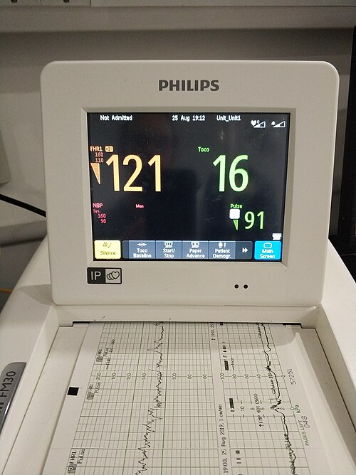

# CONDUTA NO SOFRIMENTO FETAL AGUDO

Para entender o sofrimento fetal agudo, ou como as diretrizes mais recentes da FEBRASGO preferem chamar, o "status fetal não tranquilizador", você precisa primeiro esquecer a ideia de que o feto é apenas um "paciente passivo". O feto é um organismo extremamente resiliente, capaz de redistribuir seu fluxo sanguíneo para sobreviver a insultos hipóxicos.

O sofrimento fetal agudo (SFA) é, em essência, uma perturbação da homeostase fetal que leva à hipóxia e acidose. Se não houver intervenção, isso progride para dano tecidual irreversível ou óbito. Nas provas de residência, o examinador não quer apenas que você saiba que o feto está sofrendo, ele quer que você decida, em segundos, se deve realizar uma manobra de ressuscitação intrauterina ou interromper o parto imediatamente.

*Figura 1 - No sofrimento fetal agudo, a hipoxemia desencadeia redistribuição do fluxo sanguíneo para órgãos nobres (cérebro, coração, adrenais). A cardiotocografia (CTG) é o principal método de monitorização intraparto: desacelerações tardias (DIP II) e variabilidade ausente indicam acidose fetal. Fonte: National Cancer Institute, Domínio Público | Wikimedia Commons*

## Fisiopatologia: O Mecanismo de Defesa Fetal

Por que o feto faz bradicardia? Por que o mecônio aparece? Entender o "porquê" vai te poupar de decorar tabelas infinitas.

Quando a oferta de oxigênio cai (seja por compressão de cordão, hipertonia uterina ou insuficiência placentária), o feto ativa o sistema nervoso simpático inicialmente, gerando taquicardia. Se a hipóxia persiste, entram em cena os quimiorreceptores. Eles detectam o aumento de CO2 e a queda de O2, disparando uma resposta vagal que gera a bradicardia.

Aqui ocorre o famoso efeito "brain-sparing" (centralização da circulação). O feto desvia o sangue dos órgãos periféricos (rins, pulmões, trato gastrointestinal) para os "órgãos nobres": cérebro, coração e adrenais.

**Dica de Prova:** É por causa dessa vasoconstrição periférica e mesentérica que o feto acaba liberando mecônio. A hipóxia aumenta o peristaltismo intestinal e relaxa o esfíncter anal. Portanto, mecônio espesso em um exame físico é sempre um sinal de alerta, embora não seja diagnóstico isolado de sofrimento.

## Diagnóstico: A Cardiotocografia (CTG)

A CTG é a ferramenta soberana nas provas. Você precisa dominar os cinco parâmetros: linha de base, variabilidade, acelerações, desacelerações e contrações.

### Parâmetros de Normalidade

- **Linha de Base:** Entre 110 e 160 bpm.

- **Variabilidade:** Entre 6 e 25 bpm (moderada). Este é o parâmetro isolado mais importante para prever a ausência de acidemia metabólica. Se a variabilidade está normal, o feto está oxigenado.

- **Acelerações:** Presença de pelo menos duas de 15 bpm por 15 segundos em 20 minutos (em fetos > 32 semanas). Sua presença indica bem-estar, mas sua ausência não confirma sofrimento.

- **Desacelerações:** O terror dos alunos. Vamos detalhá-las abaixo.

### Tipos de Desacelerações (DIPs)

| Tipo | Mecanismo | Significado Clínico | Conduta Inicial |
| --- | --- | --- | --- |
| **DIP I (Precoce/Cefálica)** | Compressão do polo cefálico (reflexo vagal) | Fisiológico (coincide com a contração) | Observação |
| **DIP II (Tardia)** | Insuficiência Útero-Placentária | Hipóxia fetal (ocorre após a contração) | Ressuscitação intrauterina / Parto |
| **DIP III (Variável)** | Compressão de cordão umbilical | Pode ser benigna ou grave (padrão em "W" ou "U") | Mudança de decúbito / Avaliar gravidade |

**Cuidado:** Muitos alunos confundem DIP I com DIP II. O segredo está no "decalagem". Se o fundo da desaceleração (nadir) coincide com o pico da contração, é DIP I. Se o nadir ocorre após o pico da contração, o feto está sofrendo (DIP II).

### Classificação das Categorias (Padrão NICHD)

As bancas amam cobrar a conduta baseada nas categorias:

- **Categoria I (Normal):** Linha de base normal, variabilidade moderada, sem DIP II ou III. Conduta: Acompanhamento de rotina.

- **Categoria II (Indeterminada):** Inclui taquicardia, bradicardia com variabilidade mantida, variabilidade mínima ou DIPs variáveis sem outros sinais graves. Conduta: Vigilância rigorosa e manobras de ressuscitação intrauterina.

- **Categoria III (Anormal):** Variabilidade ausente associada a DIP II recorrente, DIP III recorrente ou bradicardia. Ou ainda, o padrão sinusoidal (que indica anemia fetal grave). Conduta: Interrupção imediata do parto.

*Figura 2 - Ressuscitação intrauterina: decúbito lateral esquerdo, suspensão de ocitocina, expansão volêmica com SF 0,9%, O2 em máscara e tocolítico (terbutalina 0,25 mg SC). Se não houver melhora da CTG em 30 min → parto de emergência. Fonte: Domínio Público | Wikimedia Commons*

## Ressuscitação Intrauterina: O que fazer antes de correr para o CC?

Se você detectou um padrão Categoria II ou uma alteração aguda, o primeiro passo não é necessariamente a cesariana. Segundo a FEBRASGO, devemos tentar melhorar o aporte de oxigênio imediatamente:

- **Decúbito Lateral Esquerdo (DLE):** Retira o peso da útero sobre a veia cava, melhorando o retorno venoso e o débito cardíaco materno.

- **Oxigenoterapia:** 5 a 10 litros/min com máscara (embora controverso na literatura recente, ainda é muito cobrado em provas como medida de resgate).

- **Hidratação Venosa Rápida:** Expansão volêmica para melhorar a perfusão placentária.

- **Suspender Ocitocina:** Se a paciente estiver em indução, a primeira coisa a fazer é desligar a bomba. A hiperestimulação uterina (taquissistolia) é a causa mais comum de DIP II.

- **Tocolise de Emergência:** Se houver taquissistolia (> 5 contrações em 10 min) que não resolve com a suspensão da ocitocina, pode-se usar Terbutalina SC.

## Decisão de Parto: Fórcipe ou Cesariana?

Aqui é onde o Dr. Will sempre reforça: a prova vai te dar o plano de DeLee.

Se o feto está em sofrimento agudo (Categoria III ou bradicardia persistente):

- **Dilatação incompleta:** Cesariana de emergência.

- **Dilatação completa + Feto alto (acima de 0 de DeLee):** Cesariana de emergência.

- **Dilatação completa + Feto baixo (+2 ou mais de DeLee):** Parto instrumental (Fórcipe ou Vácuo-extrator).

**Exemplo Clínico:** Paciente em expulsivo, feto em +3 de DeLee, apresenta bradicardia súbita de 80 bpm que não recupera após 2 minutos. Conduta? Não perca tempo montando sala de cirurgia. A solução mais rápida é o fórcipe de alívio (Simpson).

## Situações Especiais e Emergências Obstétricas

### Prolapso de Cordão

Ocorre geralmente após a amniotomia com polo cefálico alto. Ao toque, você sente o cordão pulsando na frente da apresentação.
**Conduta de Prova:** Manter a mão no canal vaginal elevando a apresentação fetal (para não comprimir o cordão) e seguir IMEDIATAMENTE para a cesariana. Não tire a mão até que o obstetra retire o feto por cima.

### Descolamento Prematuro de Placenta (DPP)

Dor abdominal súbita, hipertonia uterina e sangramento vaginal escuro (em 80% dos casos). O sofrimento fetal aqui é agudo e grave.
**Conduta:** Se feto vivo, cesariana imediata. Se feto morto, a via vaginal é preferível, desde que a mãe esteja estável.

## Assistência ao Recém-Nascido: A Reanimação Neonatal

O sofrimento fetal não termina quando o bebê sai. Na verdade, a conduta no RN é o tema que mais gera questões de "pérolas clínicas". O protocolo atual da SBP (Sociedade Brasileira de Pediatria) 2022 é o seu guia.

### O Minuto de Ouro

Ao nascer, você faz três perguntas:

- Termo?

- Respirando ou chorando?

- Tônus muscular bom?

Se a resposta for "NÃO" para qualquer uma delas em um RN a termo, o clampeamento do cordão deve ser **imediato** e o bebê levado para a mesa de reanimação.

**Atenção:** Se o bebê estiver bem (vigoroso), mesmo com líquido meconial, o clampeamento é tardio (1 a 5 minutos) e ele vai para o colo da mãe. O MedEvo destaca: a vitalidade do RN manda mais que a cor do líquido.

### Passos Iniciais (30 segundos)

- Prover calor (berço radiante).

- Posicionar a cabeça (leve extensão).

- Aspirar vias aéreas (SE houver obstrução por secreção ou mecônio que impeça a respiração). **Atenção:** Aspiração traqueal não é mais rotina, mesmo em RN não vigoroso com mecônio.

- Secar.

- Avaliar FC e Respiração.

### A Ventilação com Pressão Positiva (VPP)

Este é o passo mais importante da reanimação. Se após os passos iniciais a FC < 100 bpm ou o RN estiver em apneia/gasping, inicie VPP em até 60 segundos de vida (Minuto de Ouro).

- **Frequência:** 40 a 60 movimentos por minuto ("Aperta, solta, solta").

- **Concentração de O2:** Em RN >= 34 semanas, comece com ar ambiente (FiO2 21%). Em prematuros < 34 semanas, comece com 30%.

- **Monitorização:** Oximetria de pulso no membro superior direito (pré-ductal) e monitor cardíaco (3 eletrodos).

**Pegadinha de Prova:** A FC é o primeiro parâmetro a melhorar se a ventilação estiver eficaz. Se a FC não sobe, verifique a técnica (máscara, posicionamento, pressão) antes de qualquer outra medida.

### Massagem Cardíaca e Drogas

Só iniciamos massagem cardíaca se, após 30 segundos de VPP **EFICAZ** (idealmente com técnica de via aérea avançada/intubação), a FC permanecer abaixo de 60 bpm.

- **Técnica:** Dois polegares no terço inferior do esterno.

- **Relação:** 3 compressões para 1 ventilação (3:1).

- **FiO2:** Aumentar para 100% assim que iniciar a massagem.

- **Adrenalina:** Se após 60 segundos de massagem e ventilação a FC continuar < 60 bpm. Via preferencial: Veia umbilical.

## Tabelas Comparativas para Memorização

### Tabela 1: Metas de Saturação de O2 (SpO2) pré-ductal

| Tempo de Vida | SpO2 Alvo |
| --- | --- |
| Até 5 min | 70 - 80% |
| 5 - 10 min | 80 - 90% |
| > 10 min | 85 - 95% |
| *Nota: Não se assuste com saturações baixas nos primeiros minutos; a transição circulatória é gradual.* | |

### Tabela 2: Escore de Apgar

| Sinal Clínico | 0 Pontos | 1 Ponto | 2 Pontos |
| --- | --- | --- | --- |
| **Frequência Cardíaca** | Ausente | < 100 bpm | > 100 bpm |
| **Esforço Respiratório** | Ausente | Lento/Irregular | Choro forte |
| **Tônus Muscular** | Flácido | Flexão de extremidades | Movimentação ativa |
| **Irritabilidade Reflexa** | Sem resposta | Careta | Espirro/Tosse/Choro |
| **Cor** | Cianose central/Pálido | Acrocianose (corpo rosado) | Totalmente rosado |

**Importante:** O Apgar NÃO é usado para decidir reanimação. Ele serve para avaliar a resposta às manobras e o prognóstico. Ele é calculado no 1º e 5º minutos.

## Diagnóstico Diferencial do Desconforto Respiratório Neonatal

Muitas vezes, o SFA evolui para desconforto respiratório. Você precisa diferenciar as causas na radiografia:

- **Síndrome de Aspiração Meconial (SAM):** RN a termo/pós-termo, história de mecônio. RX: Infiltrado grosseiro, áreas de atelectasia e hiperinsuflação. Complicação grave: Hipertensão Pulmonar Persistente.

- **Taquipneia Transitória do RN (TTRN):** Comum em cesáreas eletivas sem trabalho de parto (falta de absorção do líquido pulmonar). RX: Trama vascular aumentada, congestão hilar, líquido na cisura (cisurite). Autolimitada (24-72h).

- **Doença da Membrana Hialina (SDR):** Prematuros (deficiência de surfactante). RX: Infiltrado reticulogranular fino ("vidro fosco") com broncogramas aéreos.

## Critérios de Asfixia Perinatal (Definição de Encefalopatia Hipóxico-Isquêmica)

Para dizer que um bebê sofreu asfixia grave, não basta um Apgar baixo. Segundo a Academia Americana de Pediatria e o ACOG, são necessários:

- Acidose metabólica profunda (pH < 7,00 ou Déficit de Base >= 16 mmol/L em sangue de cordão).

- Apgar de 0-3 por mais de 5 minutos.

- Manifestações neurológicas (convulsões, coma, hipotonia).

- Disfunção de múltiplos órgãos (renal, cardíaca, gastrointestinal).

## Pontos-Chave para Prova

- **Variabilidade da CTG:** É o melhor indicador de oxigenação cerebral. Se está presente (6-25 bpm), o feto não está em acidemia no momento.

- **DIP II Recorrente:** Indica insuficiência placentária. Se associado a variabilidade ausente, é Categoria III = Parto imediato.

- **Mecônio e RN não vigoroso:** A conduta inicial é calor, posicionar e VPP se necessário. A aspiração traqueal sob visualização direta só é feita se a VPP não for eficaz por obstrução.

- **Principal parâmetro na reanimação:** Frequência Cardíaca. É ela que dita se você avança para VPP, massagem ou drogas.

- **VPP:** Deve ser iniciada no "Minuto de Ouro" (primeiros 60 segundos) se FC < 100 ou apneia.

- **Massagem Cardíaca:** Relação 3:1. Sempre com FiO2 a 100%. Só após VPP com via aérea avançada (IOT) falhar em subir a FC acima de 60.

- **Prolapso de Cordão:** Diagnóstico é clínico (toque). Conduta é elevar a apresentação e cesariana. Nunca tente "empurrar" o cordão de volta.

- **DIP III (Variável):** Sugere compressão de cordão. Se tiver "sinais de alerta" (lenta recuperação, perda de variabilidade), vira sinal de sofrimento.

- **Acrocianose:** Cianose de extremidades no RN é fisiológica nos primeiros minutos. Cianose central (língua e tronco) é que preocupa.

- **Oximetria de Pulso:** Sempre no membro superior DIREITO (pré-ductal).

- **Técnica de Massagem:** A técnica dos dois polegares é superior à técnica dos dois dedos por gerar maior pressão sistólica e perfusão coronariana.

- **Clampeamento do Cordão:** No RN que nasce deprimido (hipotônico/apneico), o clampeamento é imediato para não atrasar a VPP.

- **Adrenalina na Reanimação:** A dose é 0,01 a 0,03 mg/kg (concentração 1:10.000). A via endotraqueal pode ser usada uma única vez enquanto se punciona a veia umbilical, mas a dose traqueal é maior.

- **Hipotermia Terapêutica:** Indicada para RN com Encefalopatia Hipóxico-Isquêmica moderada a grave, iniciada nas primeiras 6 horas de vida para reduzir sequelas neurológicas.

- **Sulfato de Magnésio:** Não é tratamento de sofrimento agudo, mas é usado para neuroproteção fetal em casos de risco de parto prematuro < 32 semanas.

 Cópia offline para consulta pessoal.
 Fonte original:
 [https://www.medevo.com.br/material-apoio/ler/ca10be0b-e15a-45b5-a82a-d7eae5b0721f](https://www.medevo.com.br/material-apoio/ler/ca10be0b-e15a-45b5-a82a-d7eae5b0721f)
