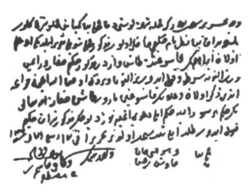

# CONSENTIMENTO INFORMADO

O consentimento informado não é um papel que o paciente assina na recepção do hospital. Se você começar sua prova com essa mentalidade, já está meio caminho à frente dos seus concorrentes. Para o Código de Ética Médica (CEM) e para as bancas de residência, o consentimento é um **processo de decisão compartilhada**.

Antigamente, vivíamos o modelo paternalista. O médico era o "pai" que sabia o que era melhor, e o paciente apenas obedecia. Esqueça isso. Hoje, o modelo vigente é o **deliberativo**. Nele, o médico traz a evidência técnica e o paciente traz seus valores e preferências. A decisão nasce do encontro dessas duas expertises.

## O Processo de Consentimento e seus Pilares

*Figura 1 - Documento otomano de 1539 (Gaziantep, Turquia): primeiro registro histórico de consentimento informado. Um pai autoriza cirurgia para remoção de cálculos urinários do filho, com taxa acordada e isenção de responsabilidade em caso de óbito. Fonte: Domínio Público | Wikimedia Commons*

Para que um consentimento seja considerado válido em uma questão de prova (e na vida real), ele precisa sustentar-se em três pilares fundamentais. Se um deles falhar, o consentimento é nulo.

### 1. Informação (O Dever de Informar)

O médico tem o dever ético de explicar o diagnóstico, o prognóstico, os riscos do tratamento, os benefícios e, algo que as bancas amam: as **alternativas**. Se você propõe uma cirurgia, mas existe um tratamento clínico razoável, você é obrigado a informar isso.

A informação deve ser clara e adaptada ao nível cultural do paciente. Não adianta falar em "neoplasia intraepitelial de alto grau" para quem não sabe o que é uma célula. O erro clássico aqui é o médico achar que, por ter falado termos técnicos, ele cumpriu seu dever. Não cumpriu.

### 2. Capacidade de Decisão

Aqui mora uma pegadinha. Capacidade jurídica (ser maior de 18 anos) é diferente de capacidade de decisão clínica. Um paciente de 80 anos pode ser plenamente capaz de decidir sobre seu tratamento, enquanto um jovem de 20 anos em surto psicótico ou sob efeito de sedação não está.

A capacidade é tarefa-específica. O paciente pode ter capacidade para decidir o que quer comer, mas não para entender os riscos de uma revascularização miocárdica complexa. Na dúvida, a avaliação da capacidade deve ser documentada em prontuário.

### 3. Voluntariedade

O consentimento deve ser livre de coerção. Isso parece óbvio, mas cuidado com a "coerção branda". Dizer ao paciente "se o senhor não operar agora, vai morrer amanhã" quando o risco não é iminente, pode ser interpretado como uma forma de invalidar a autonomia por meio do medo.

## Modelos de Relação Médico-Paciente

As bancas de residência adoram comparar os modelos. Você precisa saber identificar qual deles está sendo descrito no enunciado da questão.

| Modelo | Papel do Médico | Papel do Paciente | Tomada de Decisão |
| --- | --- | --- | --- |
| **Paternalista** | Tutor/Pai | Passivo/Obediente | Médico decide sozinho pelo "bem" do paciente. |
| **Informativo** | Técnico/Perito | Consumidor | Médico fornece dados; paciente decide sozinho. |
| **Interpretativo** | Conselheiro | Em busca de valores | Médico ajuda o paciente a entender o que ele quer. |
| **Deliberativo** | Parceiro/Professor | Ativo/Autônomo | **Decisão Compartilhada** (O padrão-ouro atual). |

Por que o modelo deliberativo é o preferido? Porque ele respeita a autonomia sem abandonar o paciente à própria sorte com uma pilha de informações técnicas. No MedEvo, sempre reforçamos que o médico deve guiar a deliberação, pesando riscos e benefícios junto ao paciente.

## A Recusa Terapêutica e a Resolução CFM 2.232/2019

Este é, sem dúvida, o tópico mais quente de Bioética nos últimos anos. O que fazer quando o paciente diz "não"?

Primeiro mandamento: o paciente capaz tem o direito de recusar qualquer tratamento. O médico não pode impor sua vontade baseada apenas no "melhor interesse clínico". Se o paciente com doença coronariana estável recusa o cateterismo após ser devidamente informado dos riscos, o médico deve respeitar, otimizar o tratamento clínico e manter o acompanhamento.

### O Limite da Autonomia: Risco Iminente de Morte

A autonomia não é absoluta. O Código de Ética Médica (Art. 22) é claro: o médico não pode realizar procedimento sem consentimento, **exceto em caso de iminente risco de morte**.

Cuidado com a pegadinha: o risco deve ser **iminente** (agora, nas próximas horas). Se o paciente tem um câncer que vai matá-lo em seis meses, mas ele recusa a cirurgia hoje, você não pode operar à força. Não há iminência.

### Recusa em Menores e Incapazes

Se os pais de uma criança recusam um tratamento essencial (ex: transfusão em anemia grave por malária ou trauma), o médico deve intervir. O direito à vida da criança prevalece sobre a liberdade religiosa ou convicção dos pais. Em situações de urgência, o médico faz o procedimento e comunica às autoridades depois.

## O Caso Clássico: Testemunhas de Jeová e Transfusão de Sangue

Este tema cai tanto que você deveria saber de cor. Vamos dissecar a conduta correta conforme o CFM e as decisões recentes do STF.

- **Paciente Adulto, Capaz e Consciente:** Se ele recusa a transfusão e **não há risco iminente de morte**, você respeita. Você deve buscar alternativas (ferro endovenoso, eritropoietina, recuperadores de sangue intraoperatórios).

- **Paciente Adulto, Capaz, em Risco Iminente de Morte:** Aqui as bancas costumavam dizer que o médico "deve transfundir". No entanto, o entendimento ético e jurídico atual (STF 2024) reforça que, se o paciente expressou sua vontade de forma clara e informada, ela deve ser respeitada mesmo no risco de morte. **Mas atenção para a prova:** a maioria das bancas ainda segue o CEM literal — se há risco iminente de morte e o paciente está inconsciente ou não há diretiva clara, a vida prevalece e você transfunde.

- **Crianças/Menores:** Não há discussão. Se precisa para salvar a vida, você transfunde, independentemente da vontade dos pais.

*Figura 2 - Médica em consulta com paciente ilustrando o modelo deliberativo contemporâneo: decisão compartilhada com troca de informações técnicas e valores pessoais. Fonte: Seattle Municipal Archives, CC BY 2.0 | Wikimedia Commons*

## Diretivas Antecipadas de Vontade (DAV)

Regulamentadas pela Resolução CFM 1.995/2012, as DAVs são o conjunto de desejos expressos pelo paciente sobre quais tratamentos quer ou não receber caso fique incapacitado de comunicar sua vontade (ex: coma, demência avançada).

**Pontos fundamentais para a prova sobre DAV:**

- Não precisa de registro em cartório para ser válida (embora ajude na prova documental).

- O registro no prontuário médico é suficiente e obrigatório.

- As DAVs prevalecem sobre a vontade dos familiares. Se o paciente deixou escrito que não quer ser intubado em fase terminal, e os filhos imploram pela intubação, o médico deve seguir a vontade do paciente.

- O médico pode se recusar a seguir a DAV se ela for contrária aos preceitos éticos (ex: paciente pede eutanásia — que é crime no Brasil).

## O Direito à Informação Diagnóstica

Imagine um paciente de 70 anos, lúcido, com um nódulo pulmonar suspeito. A família chama o médico no corredor e diz: "Doutor, não conte para ele que é câncer, ele não vai aguentar".

O que você faz? Segundo o CEM Art. 31, é vedado ao médico desrespeitar o direito do paciente de decidir sobre sua saúde. O paciente é o titular do direito à informação. A família não tem o poder de censurar o diagnóstico se o paciente é capaz.

A única exceção é o chamado **"Privilégio Terapêutico"**: quando o médico tem certeza fundamentada de que a informação direta causará um dano psicológico grave e imediato ao paciente (risco de suicídio, por exemplo). Mas isso é raríssimo e deve ser a exceção da exceção.

## Decisão Compartilhada na Prática Clínica

Vamos conectar isso com a Clínica Médica, como o Dr. Will costuma fazer nas discussões de caso.

### Rastreamento de Câncer de Próstata

As diretrizes atuais (como a da SBU e do Ministério da Saúde) não recomendam o rastreamento populacional em massa. A recomendação é a **decisão compartilhada**.

- Paciente idoso (ex: 75-80 anos) com expectativa de vida < 10 anos: o rastreamento geralmente traz mais riscos (biópsias, incontinência, impotência) do que benefícios.

- O médico deve explicar isso. Se o paciente, após entender os riscos de sobrediagnóstico, ainda assim desejar o PSA, a autonomia deve ser considerada, mas a tendência ética é desaconselhar o rastreamento fútil.

### Transfusão de Hemácias em Sepse

A medicina baseada em evidências e a bioética andam juntas aqui. Antigamente, transfundíamos com Hb < 10. Hoje, o gatilho é **Hb < 7 g/dL** para a maioria dos pacientes estáveis.

- Se um paciente com sepse tem Hb 8 g/dL, está com PAM 66 mmHg e saturação venosa central de oxigênio (SvO2) de 80%, ele não tem indicação de transfusão imediata.

- Se ele recusa a transfusão (por motivos religiosos ou pessoais) e está fora desse gatilho de gravidade extrema, o médico deve respeitar e monitorar sinais de hipóxia tecidual.

| Situação Clínica | Conduta Ética/Clínica | Justificativa |
| --- | --- | --- |
| **Recusa de Cirurgia (Risco não iminente)** | Respeitar autonomia + Tratamento clínico | Autonomia do paciente capaz é soberana. |
| **Paciente Inconsciente sem DAV** | Decisão pelo "Melhor Interesse" | Médico e família decidem visando a preservação da vida. |
| **Transferência de Paciente Instável** | **Não transferir** até estabilizar | O dever de cuidado impede o transporte com risco de morte. |
| **Conflito Família vs. DAV** | Seguir a DAV do paciente | A vontade do paciente prevalece sobre a dos herdeiros. |

## Responsabilidade Ética e Transferência Inter-hospitalar

Um erro comum em provas de ética é o cenário do paciente grave em hospital sem recursos. A família, desesperada, assina um "Termo de Responsabilidade" querendo levar o paciente por conta própria para um hospital privado.

**Cuidado:** O médico não pode liberar o paciente. Se há risco iminente de morte ou instabilidade que impeça o transporte seguro, o médico tem o dever de cuidado. O termo assinado pela família não exime o médico de responsabilidade ética e penal se o paciente morrer na ambulância ou no carro particular. A transferência só deve ocorrer quando o benefício do destino supera o risco do trajeto e o paciente está na melhor estabilidade possível.

## Autonomia no Fim de Vida e Cuidados Paliativos

No contexto de cuidados paliativos, o consentimento informado ganha uma camada extra: a **Ordem de Não Ressuscitar (ONR)**.

Muitos alunos confundem Cuidados Paliativos com "não fazer nada". Errado. É uma abordagem ativa. O consentimento aqui foca em evitar a distanásia (prolongamento inútil do sofrimento). Se um paciente com doença terminal e progressiva, em plena posse de suas faculdades, decide que não quer manobras de ressuscitação em caso de parada cardiorrespiratória (PCR), essa decisão é ética e deve ser respeitada.

A Resolução CFM 1.995/2012 dá o suporte legal para que o médico registre essa vontade. Se o paciente não puder decidir, o representante legal assume esse papel, sempre buscando o que seria a vontade presumida do paciente.

## Diagnóstico Diferencial Ético: Consentimento vs. Assentimento

Este é um detalhe que separa quem passa de quem fica no "quase".

- **Consentimento:** Dado por quem tem capacidade legal e clínica (adultos capazes).

- **Assentimento:** É a concordância do menor ou do incapaz.

Mesmo que os pais (representantes legais) deem o consentimento para um procedimento em um adolescente de 15 anos, o médico deve buscar o **assentimento** do jovem. Se o adolescente recusa terminantemente algo que não é de urgência, deve-se abrir um processo de deliberação e não apenas ignorar a vontade dele porque "ele é menor".

## Resumo de Condutas em Situações de Conflito

As bancas amam colocar você em uma saia justa. Use este guia rápido:

- **Paciente quer saber o diagnóstico, família não quer:** Conte ao paciente.

- **Paciente recusa tratamento vital, mas não vai morrer agora:** Respeite a recusa e documente.

- **Paciente Testemunha de Jeová, inconsciente, precisando de sangue urgente:** Transfunda (na dúvida, a vida prevalece na visão clássica das bancas).

- **Filhos querem intubar pai com DAV escrita proibindo:** Não intube. Siga a DAV.

- **Paciente quer tratamento fútil/inútil (ex: cloroquina para COVID ou quimioterapia em fase final de falência orgânica):** O médico não é obrigado a realizar tratamentos sem evidência ou fúteis, mesmo que o paciente peça. Autonomia não dá direito a exigir má prática.

## Pontos-Chave para Prova 🩺

- O modelo de relação médico-paciente ideal e cobrado é o **Deliberativo** (decisão compartilhada).

- O consentimento informado é um **processo**, não apenas a assinatura de um formulário.

- **Capacidade clínica** é diferente de capacidade civil; deve ser avaliada para cada decisão específica.

- O médico tem o **dever de informar** riscos, benefícios e, obrigatoriamente, as alternativas terapêuticas.

- A autonomia do paciente é soberana, exceto em caso de **iminente risco de morte** ou incapacidade de decidir.

- Em menores de idade, se houver conflito entre a vontade dos pais e a vida da criança, a **vida prevalece** (o médico deve intervir).

- **Diretivas Antecipadas de Vontade (DAV)** não precisam de cartório e prevalecem sobre a opinião da família.

- O paciente tem direito à **informação diagnóstica** total; a família não pode impedir o médico de contar a verdade ao paciente lúcido.

- **Testemunhas de Jeová:** Respeite a recusa se não houver risco de morte; em risco iminente e sem alternativas, a conduta de prova ainda é a transfusão (foco na preservação da vida).

- **Sigilo Médico:** O consentimento também envolve o compartilhamento de informações. O médico não pode revelar dados do paciente a familiares sem autorização, a menos que o paciente seja incapaz.

- **Rastreamento de Câncer de Próstata:** Em idosos, deve ser uma decisão compartilhada, explicando que o risco de *overdiagnosis* pode superar o benefício.

- **Transferência:** Nunca transfira paciente instável apenas porque a família assinou um termo de responsabilidade. O risco é do médico.

- **Sepse e Transfusão:** Gatilho restritivo (Hb < 7 g/dL) é a regra, respeitando a autonomia se o paciente estiver estável acima disso.

- **Erro Comum:** Achar que o médico é obrigado a fazer tudo o que o paciente pede. Autonomia é o direito de **recusar**, não o direito de exigir tratamentos inadequados ou fúteis.

- **Resolução CFM 2.232/2019:** É o marco moderno sobre recusa terapêutica. Estude-a para entender os limites da objeção de consciência do médico.

- **Lembre-se:** Na prova, se a questão não mencionar "risco iminente de morte", a resposta quase sempre passará pelo respeito à autonomia do paciente.

 Cópia offline para consulta pessoal.
 Fonte original:
 [https://www.medevo.com.br/material-apoio/ler/0e5883e9-4825-4fcf-a603-757d95847c0e](https://www.medevo.com.br/material-apoio/ler/0e5883e9-4825-4fcf-a603-757d95847c0e)
