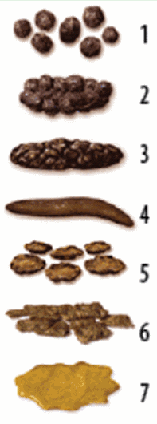
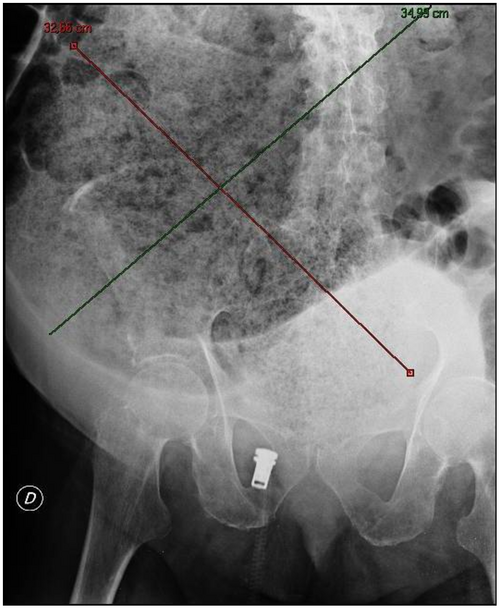

# CONSTIPAÇÃO FUNCIONAL E DOR ABDOMINAL RECORRENTE

Seja muito bem-vindo a esta aula. Se você está aqui, é porque sabe que a Gastroenterologia Pediátrica é um dos pilares das provas de residência. E, dentro dela, nada é mais onipresente do que a constipação e a dor abdominal. Como professor, já vi muitos alunos perderem questões preciosas por tentarem decorar listas infinitas sem entender a lógica por trás do sintoma. Aqui, meu objetivo é que você entenda o "porquê" de cada conduta.

A primeira coisa que você precisa internalizar: constipação não é uma doença, é um sintoma. Na pediatria, 95% das vezes esse sintoma é funcional. Mas são os outros 5%, as causas orgânicas, que as bancas amam cobrar para testar se você sabe identificar os sinais de alerta.

## O Padrão Normal: Onde a Confusão Começa

Antes de falarmos de doença, precisamos falar do normal. O erro clássico de muitos internos e residentes é rotular como constipado um lactente que está apenas exercendo sua fisiologia normal.

### O Lactente em Aleitamento Materno Exclusivo (AME)

Um bebê em AME pode evacuar oito vezes ao dia ou uma vez a cada dez dias. Ambas as situações podem ser normais, desde que as fezes sejam pastosas e o bebê esteja ganhando peso e crescendo bem. Isso acontece porque o leite materno é tão bem absorvido que sobra pouco resíduo para formar o bolo fecal. Chamamos isso de pseudoconstipação do lactente.

### Disquezia do Lactente

Este é um "queridinho" das provas. A mãe chega desesperada dizendo que o bebê de dois meses chora, fica vermelho, espreme-se por 15 minutos e, no final, evacua fezes moles.
Por que isso acontece? É uma falta de coordenação motora. O bebê aumenta a pressão intra-abdominal (o esforço), mas não relaxa o assoalho pélvico simultaneamente.
A conduta? Apenas orientação e tranquilização. Não use supositórios, não faça estimulação retal. O bebê precisa aprender a coordenar esses músculos sozinho.

## Constipação Funcional (CF)

*Figura 1 - Escala de Bristol: tipos 1-2 indicam constipação; tipo 4 é o padrão ideal (macia e lisa); tipos 6-7 sugerem diarreia. Ferramenta essencial para avaliação e seguimento do tratamento. Fonte: Flominator, CC BY-SA 4.0 | Wikimedia Commons*

A Constipação Funcional é um distúrbio da interação intestino-cérebro (DGBI, na nomenclatura do Roma V). Ela não é "coisa da cabeça da criança", mas sim uma desregulação real da motilidade e da sensibilidade retal.

### Fisiopatologia: O Ciclo Vicioso da Retenção

Entender isso é a chave para entender o tratamento. Tudo começa, geralmente, com uma experiência de evacuação dolorosa (uma fezes mais dura, uma fissura anal). A criança, para evitar a dor, contrai o esfíncter anal externo voluntariamente quando sente vontade de evacuar.

O que acontece depois?

- As fezes ficam retidas no reto.

- O reto absorve água dessas fezes, tornando-as ainda mais duras e volumosas.

- O reto se dilata (megacólon funcional), perdendo a sensibilidade. Agora, a criança precisa de um volume muito maior de fezes para sentir vontade de ir ao banheiro.

- Quando ela finalmente evacua, dói muito. Isso reforça o comportamento de retenção.

Como o Dr. Will costuma destacar nas discussões do MedEvo, se você não quebrar esse ciclo de dor, nenhum laxante do mundo resolverá o problema a longo prazo.

### Critérios de Roma V para Constipação Funcional

> **Atualização 2026:** a **Rome Foundation** publicou os **Critérios de Roma V** para os **DGBI** (Distúrbios da Interação Intestino-Cérebro), substituindo o Roma IV. Para constipação funcional pediátrica os critérios essenciais foram **mantidos** (frequência, comportamento retentivo, dor, fezes volumosas, escapes), com pequenas atualizações de redação e maior ênfase no diagnóstico **positivo** baseado em sintomas e impacto, sem depender de "todos os exames normais". Em provas anteriores a 2026 o gabarito ainda costuma seguir Roma IV; na prática os pontos cobrados são praticamente os mesmos.

As bancas exigem que você saiba os critérios de cor. Eles são divididos por idade, pois o comportamento de um bebê é diferente de um escolar.

**Tabela 1: Critérios de Roma V para Constipação Funcional**

| Critério | Lactentes e Crianças < 4 anos | Crianças e Adolescentes ≥ 4 anos |
| --- | --- | --- |
| **Frequência** | ≤ 2 evacuações por semana | ≤ 2 evacuações por semana |
| **Incontinência** | Pelo menos 1 ep./semana (se já treinado) | Pelo menos 1 ep./semana |
| **Retenção** | História de comportamento retentivo | História de comportamento retentivo |
| **Dor/Esforço** | História de evacuações dolorosas/duras | História de evacuações dolorosas/duras |
| **Volume** | Presença de grande massa fecal no reto | Presença de grande massa fecal no reto |
| **Diâmetro** | Fezes de grande diâmetro (obstruem vaso) | Fezes de grande diâmetro (obstruem vaso) |
| **Tempo** | Pelo menos 1 mês de sintomas | Pelo menos 1 mês de sintomas |

*Nota: Para o diagnóstico, são necessários pelo menos 2 critérios dos listados acima.*

### O Exame Físico: A Arte da Palpação

Não se pula o exame físico em gastroenterologia. Na pediatria, a palpação deve ser suave. Comece longe da área de dor relatada. Use a palma da mão e as polpas digitais, nunca apenas as pontas dos dedos.

O que você procura?

- **Massa fecal palpável:** Geralmente em fossa ilíaca esquerda, mas pode ocupar todo o abdome inferior.

- **Toque retal:** É obrigatório em casos de constipação grave ou suspeita de causa orgânica. Na CF, você encontrará a ampola retal cheia de fezes, muitas vezes um fecaloma. Guarde isso: ampola cheia = funcional; ampola vazia = suspeite de Hirschsprung.

## Diagnóstico Diferencial: O Fantasma do Hirschsprung

Se 95% é funcional, como identificar os 5% orgânicos? Você precisa buscar os "Red Flags".

### Sinais de Alarme (Red Flags)

- Atraso na eliminação de mecônio (> 48 horas de vida).

- Início da constipação no período neonatal ou < 6 meses.

- Vômitos biliosos ou fecaloides.

- Distensão abdominal importante.

- Sangue nas fezes (sem fissura anal visível).

- Déficit de crescimento (ganho de peso ou estatura insatisfatórios).

- Alterações na região sacral (fossetas, tufos de pelos).

- Ampola retal vazia ao toque com saída explosiva de fezes e gases.

### Doença de Hirschsprung (Aganglionose Colônica Congênita)

Esta é a causa orgânica mais cobrada. É a ausência congênita dos plexos de Meissner e Auerbach no segmento distal do intestino. Como não há relaxamento desse segmento, ele fica permanentemente contraído, funcionando como uma obstrução.

**Tabela 2: Diferenciação Clínica Crucial**

| Característica | Constipação Funcional | Doença de Hirschsprung |
| --- | --- | --- |
| **Início** | Geralmente após o desfralde ou introdução alimentar | Desde o nascimento (atraso no mecônio) |
| **Escape Fecal** | Comum (encoprese por transbordamento) | Raro |
| **Estado Nutricional** | Geralmente normal | Frequentemente comprometido |
| **Toque Retal** | Ampola cheia de fezes | Ampola vazia (segmento espástico) |
| **Saída de Fezes** | Normal após o toque | Explosiva (sinal do "estouro de champanhe") |
| **Diagnóstico** | Clínico (Roma V / Roma IV) | Biópsia Retal (Padrão-ouro) |

O enema opaco no Hirschsprung mostra a "zona de transição" (o reto estreitado e o cólon proximal dilatado). Mas cuidado: a biópsia retal de sucção, demonstrando a ausência de células ganglionares e o aumento de fibras nervosas acetilcolinesterásicas, é o que confirma o diagnóstico.

*Figura 2 - Radiografia de abdome com fecaloma extenso ocupando todo o cólon. Casos graves como este ilustram a importância de iniciar desimpactação antes da manutenção. Fonte: Di Saverio S et al., PLoS Medicine, CC BY 2.5 | Wikimedia Commons*

## Tratamento da Constipação Funcional

O tratamento não é apenas "dar um remedinho". Ele é dividido em quatro pilares fundamentais (alinhados ao modelo multidisciplinar enfatizado pelo Roma V: dieta, farmacológico, comportamental e psicossocial).

### 1. Educação e Desmistificação

Explique para a família que a criança não "suja a calcinha" porque quer. A incontinência fecal por transbordamento (encoprese) ocorre porque as fezes líquidas passam por volta do fecaloma endurecido e saem sem que a criança sinta, pois o reto está dilatado e insensível. Punir a criança só piora o quadro.

### 2. Desimpactação Fecal

Nunca comece a manutenção sem limpar o reto primeiro. Se você der laxante de manutenção com um fecaloma lá dentro, a criança terá cólicas horríveis e mais escape.

- **Primeira escolha:** Polietilenoglicol (PEG) 4000 sem eletrólitos.

- **Dose de desimpactação:** 1 a 1,5 g/kg/dia por 3 a 6 dias.

- **Alternativa:** Enemas (clisteres) de fosfato ou glicerina, mas são mais invasivos e traumáticos.

### 3. Manutenção Farmacológica

O objetivo é manter 1 a 2 evacuações pastosas (Bristol 4) por dia, sem dor.

- **PEG 4000:** É o padrão-ouro. Não é absorvido, não causa dependência e não perde o efeito com o tempo.

- **Dose de manutenção:** 0,2 a 0,8 g/kg/dia (ajustar conforme a resposta).

- **Lactulose:** Segunda escolha. Pode causar muitos gases e cólicas.

### 4. Mudança de Estilo de Vida (MEV)

- **Fibras:** A recomendação da SBP é a fórmula "Idade + 5 gramas" por dia. Não adianta dar fibras em excesso se a criança não beber água.

- **Hidratação:** Essencial para que as fibras e o laxante osmótico funcionem.

- **Treinamento de Hábito:** Sentar a criança no vaso sanitário por 5 a 10 minutos após as grandes refeições (almoço e jantar) para aproveitar o reflexo gastrocólico. Use um apoio para os pés para que os joelhos fiquem acima da linha do quadril (posição de cócoras).

## Dor Abdominal Recorrente (DAR)

A Dor Abdominal Recorrente é definida como pelo menos três episódios de dor abdominal nos últimos três meses, graves o suficiente para interferir nas atividades da criança.

Assim como na constipação, a maioria das dores abdominais crônicas na infância é funcional. O termo atual preferido pelos **Critérios de Roma V (2026)** é **DGBI — Distúrbios da Interação Intestino-Cérebro** (do inglês *Disorders of Gut-Brain Interaction*). A nomenclatura "funcional" segue valendo na prática clínica, mas a Rome Foundation prioriza DGBI por refletir melhor a fisiopatologia: motilidade, hipersensibilidade visceral, microbiota, eixo intestino-cérebro e fatores centrais.

### Fisiopatologia da Dor Funcional

Envolve hipersensibilidade visceral. O limiar de dor da criança é mais baixo. Estímulos normais (como a distensão do intestino por gases ou fezes) são interpretados pelo cérebro como dor intensa. Fatores psicossociais, como estresse escolar ou conflitos familiares, atuam como gatilhos potentes.

### Classificação dos Distúrbios Funcionais (Roma V, 2026)

- **Dispepsia Funcional:** Dor ou queimação em epigástrio, saciedade precoce ou plenitude pós-prandial. Não melhora com a evacuação.

- **Síndrome do Intestino Irritável (SII):** **Dor OU desconforto abdominal recorrente** associado à evacuação e/ou à mudança na frequência ou na consistência das fezes. **Mudança importante do Roma V:** o termo "desconforto" voltou ao critério (o Roma IV exigia apenas "dor"), porque muitos pacientes descrevem como peso, incômodo ou mal-estar e não exatamente dor.

- **Enxaqueca Abdominal:** Episódios paroxísticos de dor intensa, periumbilical, associada a palidez, náuseas, vômitos ou fotofobia. A criança fica bem entre os episódios. **Novidade do Roma V:** o quadro passou a ser reconhecido também em adultos (antes era restrito à faixa pediátrica).

- **Dor Abdominal Funcional — Sem Outra Especificação (SOE):** Dor que não se encaixa nos critérios acima, mas que claramente não tem causa orgânica.

> **Outras novidades do Roma V que valem para prova:** reconhecimento da **disfunção cricofaríngea retrógrada** (incapacidade de arrotar), da **disfunção sensorial anorretal** e separação explícita entre **critérios de pesquisa** (mais rígidos) e **critérios clínicos** (com mais espaço para julgamento clínico).

### Quando suspeitar de Causa Orgânica na Dor Abdominal?

Aqui estão as pegadinhas de prova. Se a dor tem essas características, pare de pensar em funcional e peça exames:

- Dor que acorda a criança à noite.

- Dor localizada longe da cicatriz umbilical (ex: quadrante superior direito ou fossa ilíaca direita).

- Perda de peso ou parada do crescimento.

- Febre recorrente.

- Artrite ou lesões perianais (pensar em Doença Inflamatória Intestinal).

- História familiar de Doença Celíaca ou DII.

**Tabela 3: Diagnóstico Diferencial da Dor Abdominal Crônica**

| Etiologia | Pistas Clínicas |
| --- | --- |
| **Giardíase** | Diarreia intermitente, distensão, flatulência, náuseas. Comum em creches. |
| **Doença Celíaca** | Distensão, diarreia crônica, anemia ferropriva refratária, baixa estatura. |
| **Infecção Urinária** | Pode se manifestar apenas como dor abdominal em crianças menores. |
| **Apendicite Aguda** | Embora seja aguda, pode ter apresentações atípicas em lactentes (diagnóstico difícil, alta perfuração). |
| **Gastrite/Úlcera** | Dor epigástrica, relação com alimentação, história familiar. |

### Manejo da Dor Abdominal Funcional

O tratamento é baseado no modelo biopsicossocial.

- **Tranquilização:** Explicar que a dor é real, mas não é perigosa.

- **Retorno às atividades:** A criança deve ir à escola mesmo com dor leve. O isolamento piora o quadro.

- **Dieta:** Evitar excesso de cafeína, refrigerantes e alimentos gordurosos. Na SII, a dieta pobre em FODMAPs pode ser tentada.

- **Probióticos:** O *Lactobacillus reuteri* DSM 17938 tem alguma evidência na redução da intensidade da dor funcional.

- **Terapia Cognitivo-Comportamental:** Fundamental para casos onde o estresse é o principal gatilho.

## Situações Especiais e Pegadinhas de Prova

### 1. Constipação e Infecção Urinária (ITU)

Você sabia que a constipação é um dos principais fatores de risco para ITU de repetição em meninas? O reto dilatado pressiona a bexiga, causando resíduo miccional e facilitando a subida de bactérias. Se a questão trouxer uma criança com ITUs de repetição, sempre procure por constipação na história.

### 2. Alergia à Proteína do Leite de Vacas (APLV)

A constipação pode ser a única manifestação de APLV em alguns lactentes. Se a constipação for refratária ao tratamento convencional, uma dieta de exclusão de leite e derivados por 2 a 4 semanas pode ser um teste diagnóstico válido.

### 3. O Erro da Fibra

Muitas bancas colocam "aumento de fibras" como a primeira conduta na constipação com fecaloma. Isso está errado. A primeira conduta é a desimpactação. Dar fibra para quem está entupido é como tentar empurrar mais lixo em um cano já obstruído.

### 4. Hipotireoidismo Congênito

Sempre lembre que o hipotireoidismo causa bradicinesia intestinal. Se o recém-nascido tem icterícia prolongada, fontanela posterior ampla e constipação, o diagnóstico está no Teste do Pezinho.

## Pontos-Chave para Prova

- **Critérios de Roma V (2026):** Pelo menos 2 critérios por 1 mês fecham o diagnóstico de Constipação Funcional. Mantém a maior parte do Roma IV; provas antigas seguem Roma IV.

- **SII no Roma V:** Voltou a aceitar **dor OU desconforto** abdominal (Roma IV exigia apenas "dor").

- **Terminologia atual:** o nome oficial é **DGBI — Distúrbios da Interação Intestino-Cérebro**, em substituição a "distúrbios gastrointestinais funcionais".

- **PEG 4000:** É a primeira escolha tanto para desimpactação (1-1,5 g/kg) quanto para manutenção (0,2-0,8 g/kg). Não causa dependência.

- **Hirschsprung:** Suspeite se houver atraso na eliminação de mecônio (>48h) e ampola retal vazia. O diagnóstico definitivo é a biópsia retal.

- **Disquezia:** Choro e esforço por >10 min antes de evacuar fezes moles em bebês <9 meses. Conduta: apenas orientação.

- **Pseudoconstipação do lactente:** Bebê em AME que fica dias sem evacuar, mas quando faz, as fezes são pastosas. É normal.

- **Encoprese:** É a incontinência por transbordamento. Sinal de constipação crônica grave com reto dilatado, não é problema comportamental primário.

- **Localização da Dor:** Dor funcional costuma ser periumbilical. Dor longe do umbigo (quadrantes) acende o sinal de alerta para causa orgânica.

- **Sinais de Alarme:** Perda de peso, febre, sangue nas fezes, dor noturna e atraso de crescimento exigem investigação imediata.

- **Giardíase:** Criança em creche com dor abdominal e diarreia intermitente. Pensar sempre em parasitoses antes de exames invasivos.

- **Toque Retal:** Fundamental para diferenciar funcional (reto cheio) de Hirschsprung (reto vazio).

- **Fissura Anal:** É a causa e a consequência do ciclo de retenção. Deve ser tratada com banhos de assento e amolecimento das fezes.

- **O que NÃO fazer:** Não use óleos minerais em crianças com risco de aspiração (refluxo, distúrbios neurológicos) pelo risco de pneumonia lipoídica.

- **Anorexia Nervosa:** Lembre-se da pérola clínica: é o transtorno psiquiátrico com maior mortalidade, sendo o suicídio a causa principal.

- **Apendicite em Lactentes:** Diagnóstico difícil, dor inespecífica, alta taxa de perfuração. Sempre um desafio diagnóstico.

- **Probióticos:** Não são tratamento de primeira linha para constipação, mas podem ajudar na dor abdominal funcional. 💡

 Cópia offline para consulta pessoal.
 Fonte original:
 [https://www.medevo.com.br/material-apoio/ler/3b3a189a-bbac-475f-ac9f-bc1eb67f2bb9](https://www.medevo.com.br/material-apoio/ler/3b3a189a-bbac-475f-ac9f-bc1eb67f2bb9)
