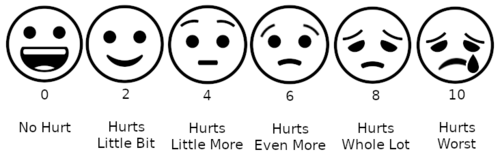

# CONTROLE DA DOR

Para entender o controle da dor, você precisa primeiro parar de enxergar a dor apenas como um sintoma e passar a vê-la como um sistema complexo de sinalização. Nas provas de residência, o examinador não quer apenas que você saiba qual remédio prescrever, mas que você entenda a lógica por trás da escolha. Por que morfina e não fentanil agora? Por que associar um antidepressivo se o paciente não está deprimido?

Vamos construir esse raciocínio do zero, focando no que realmente aparece nas questões e no que você verá no dia a dia do hospital.

## Fisiologia e Vias da Dor: O Caminho do Estímulo

A dor não "nasce" pronta no cérebro. Ela percorre um caminho didaticamente dividido em quatro fases. Entender isso é a base para a **Analgesia Multimodal**, um conceito que a MedEvo sempre reforça: se a dor tem várias etapas, o tratamento deve atacar várias frentes.

- **Transdução:** É a transformação de um estímulo nocivo (térmico, químico ou mecânico) em um impulso elétrico. Isso acontece nos **nociceptores** periféricos. Aqui, substâncias como prostaglandinas e bradicininas "sensibilizam" o receptor. É por isso que usamos AINEs (Anti-inflamatórios Não Esteroidais) aqui: eles bloqueiam a síntese de prostaglandinas via ciclo-oxigenase.

- **Transmissão:** O sinal elétrico viaja da periferia até a medula espinhal (corno posterior) e de lá sobe para o tálamo e córtex. A via principal é o **Trato Espinotalâmico**. Os anestésicos locais agem aqui, bloqueando os canais de sódio e impedindo que o sinal "ande".

- **Modulação:** É o "filtro" da dor. Ocorre principalmente na medula. O corpo tem vias descendentes que liberam endorfinas e serotonina para frear o sinal. **Dica de prova:** Agonistas α₂ (como a clonidina) atuam pré-sinapticamente na medula inibindo a liberação de neurotransmissores excitatórios.

- **Percepção:** É quando o cérebro diz "ai". Ocorre no córtex somatossensorial e sistema límbico (onde entra a carga emocional).

**Cuidado com a pegadinha:** A dor aguda gera uma resposta de estresse neuroendócrino (aumento de cortisol, catecolaminas, glucagon). Embora seja uma resposta fisiológica de "luta ou fuga", em provas de residência, lembre-se: essa resposta metabólica ao estresse **NÃO é benéfica** para o paciente cirúrgico ou crítico, pois aumenta o consumo de oxigênio miocárdico e o catabolismo.

## Classificação da Dor: O Primeiro Passo do Diagnóstico

*Figura 1 - Escala de Faces Wong-Baker: ferramenta visual para avaliação de dor em pediatria e pacientes com dificuldade de comunicação verbal. Graduação de 0 (sem dor) a 10 (pior dor imaginável). Fonte: Belbury, CC BY-SA 4.0 | Wikimedia Commons*

Antes de abrir o receituário, você precisa classificar a dor. As bancas adoram misturar esses conceitos.

### Dor Nociceptiva

É a dor "normal", por lesão tecidual. Divide-se em:

- **Somática:** Bem localizada, em pontada ou latejante. Origina-se na pele, músculos ou ossos. Exemplo: uma fratura ou uma incisão cirúrgica.

- **Visceral:** Mal localizada, profunda, em cólica ou opressão. Frequentemente associada a sintomas autonômicos (náuseas, sudorese). Exemplo: distensão de cápsula hepática por metástase.

### Dor Neuropática

Resulta de lesão ou disfunção do sistema nervoso (central ou periférico). O paciente descreve como queimação, choque, formigamento (parestesia) ou dor lancinante.

- **Alodinia:** Dor com estímulo que normalmente não dói (passar o lençol na pele).

- **Hiperalgesia:** Resposta exagerada a um estímulo pouco doloroso.

### Dor Crônica vs. Aguda

- **Aguda:** Função biológica de alerta. Autolimitada.

- **Crônica:** Dura mais de 3 meses. Perde a função de alerta e passa a ser a própria doença. Aqui, o **Modelo Biopsicossocial** é fundamental: a dor é influenciada por sono, humor e contexto social. Educar o paciente sobre isso eleva o limiar de dor.

## Avaliação da Dor e Escalas

Você não trata o que não mede. Em Cuidados Paliativos, usamos escalas para objetivar o subjetivo.

- **Escala Visual Analógica (EVA) ou Numérica:** 0 a 10.

- 1-3: Dor leve.

- 4-6: Dor moderada.

- 7-10: Dor intensa.

- **Escala de Faces:** Muito usada em pediatria ou pacientes com déficit cognitivo.

- **ECOG Performance Status:** Avalia a funcionalidade do paciente oncológico, o que guia a agressividade do tratamento.

## A Escada Analgésica da OMS: O Coração da Prova

Criada originalmente para o câncer, hoje é aplicada a quase tudo. A regra de ouro é: **suba a escada se a dor persistir, mas você pode "pular" degraus se a dor for intensa desde o início.**

| Degrau | Intensidade | Medicamentos Principais |
| --- | --- | --- |
| **1º Degrau** | Leve (1-3) | Analgésicos simples (Dipirona, Paracetamol) + AINEs |
| **2º Degrau** | Moderada (4-6) | Opioides fracos (Tramadol, Codeína) +/- Degrau 1 |
| **3º Degrau** | Intensa (7-10) | Opioides fortes (Morfina, Fentanil, Metadona) +/- Degrau 1 |
| **4º Degrau** | Refratária | Métodos invasivos (Bloqueios, PCA, Bombas de infusão) |

**Pérola Clínica:** Se o paciente chega com dor oncológica nota 9/10 usando Tramadol, não perca tempo trocando por Codeína. O paciente já falhou no 2º degrau. A conduta correta é iniciar um **opioide forte de curta ação (Morfina VO)** para titulação rápida.

## Farmacologia dos Analgésicos Não-Opioides

### Analgésicos Simples

- **Dipirona e Paracetamol:** São a base. O paracetamol exige cuidado com a hepatotoxicidade (dose máxima 4g/dia).

### AINEs (Anti-inflamatórios Não Esteroidais)

Bloqueiam a COX. São excelentes para dor óssea e inflamatória.

- **Perfil de Segurança:** O **Ibuprofeno** é frequentemente citado como tendo um perfil de segurança cardiovascular e gastrointestinal razoável para uso em dor crônica, se indicado.

- **Contraindicações:** Evite em DRC avançada, úlcera péptica ativa e insuficiência cardíaca grave.

## Opioides: Onde os Alunos Mais Erram

Os opioides agem nos receptores **Mu (μ), Kappa (\kappa) e Delta (δ)** no SNC e medula. O receptor Mu é o principal responsável pela analgesia, mas também pela depressão respiratória e constipação.

### Opioides Fracos (2º Degrau)

- **Tramadol:** Tem mecanismo duplo. Além de agir no receptor Mu, inibe a recaptação de serotonina e noradrenalina (útil em dor neuropática). **Cuidado:** Reduz o limiar convulsivo. Não use com ISRS em doses altas pelo risco de síndrome serotoninérgica.

- **Codeína:** É uma pró-droga convertida em morfina pelo CYP2D6. Se o paciente for um "metabolizador lento", a codeína não fará efeito.

*Figura 2 - Morfina injetável: opioide padrão-ouro para dor intensa. Não possui dose teto em cuidados paliativos - titula-se até alívio ou efeitos colaterais limitantes. Fonte: DanielTahar, CC BY-SA 4.0 | Wikimedia Commons*

### Opioides Fortes (3º Degrau)

- **Morfina:** O padrão-ouro. Não tem "dose teto" para dor oncológica; titulamos até o alívio ou efeitos colaterais proibitivos. Pode ser usada por via VO, IV, SC, Espinal e até retal.

- **Fentanil Transdérmico (Adesivo):** **ERRO CLÁSSICO DE PROVA:** Nunca use fentanil adesivo para dor aguda ou para iniciar titulação. Ele demora 12-24h para atingir o platô. É indicado apenas para **dor crônica estável**.

- **Metadona:** Muito especial. Além do receptor Mu, bloqueia receptores **NMDA**. Isso a torna excelente para dor neuropática e para rotação de opioides. **Vantagem:** É segura na insuficiência renal (não tem metabólitos ativos acumuláveis). **Risco:** Pode prolongar o intervalo QT.

### Manejo de Efeitos Colaterais

- **Constipação:** É o efeito mais comum e o único para o qual **não se desenvolve tolerância**. Se prescreveu opioide, prescreva laxante (ex: óleo mineral, lactulose).

- **Náuseas e Vômitos:** Comuns no início (tolerância em 3-7 dias).

- **Mioclonias:** Sinal de neurotoxicidade por acúmulo de metabólitos (comum com morfina em altas doses ou falência renal). Conduta: Hidratação e **Rotação de Opioide**.

- **Depressão Respiratória:** O medo de muitos, mas raro se a titulação for correta. O antagonista é a **Naloxona**.

## Terapia Adjuvante: Potencializando o Alívio

Adjuvantes são drogas cuja indicação primária não é dor, mas que ajudam no controle.

- **Antidepressivos Tricíclicos (Amitriptilina):** Primeira linha para dor neuropática. Aumentam a oferta de noradrenalina na via descendente inibitória. **Atenção:** Sertralina NÃO funciona para dor neuropática.

- **Anticonvulsivantes (Gabapentina, Pregabalina):** Bloqueiam canais de cálcio pré-sinápticos. Essenciais na dor neuropática e polineuropatia diabética.

- **Corticosteroides (Dexametasona):** Agem via bloqueio do ácido araquidônico. Excelentes para dor por compressão medular, metástases ósseas e distensão de cápsula de órgãos (ex: fígado).

- **Bifosfonatos (Pamidronato):** Específicos para dor por metástases ósseas.

## Situações Especiais e Pérolas de Prova

### Dor Oncológica Refratária

Se o paciente usa doses altas de morfina e a dor não controla ou surgem efeitos colaterais (como prurido intenso ou mioclonias), pensamos em **Rotação de Opioide**. Trocamos por outro (ex: Metadona ou Fentanil) usando tabelas de equianalgesia.

- **Regra de Ouro da Rotação:** Ao trocar, reduza a dose equianalgésica em 25-50% para garantir segurança, pois a tolerância cruzada é incompleta.

### Dose de Resgate

Para pacientes com dor crônica, usamos uma dose basal (horário fixo) e deixamos o "resgate" para a dor irruptiva.

- A dose de resgate costuma ser **10% a 15% da dose total diária** ou **50% da dose de cada tomada** (se o intervalo for de 4h).

### O Paciente com Insuficiência Renal

Evite Morfina e Codeína (metabólitos ativos como a Morfina-6-glucuronídeo acumulam e causam toxicidade).

- **Escolha segura:** Metadona ou Fentanil.

### Dor Neuropática Pós-Herpética (NPH)

O tratamento padrão inclui Gabapentina/Pregabalina, Amitriptilina e pode-se associar **Adesivos de Lidocaína Tópica** para alívio local.

## Tabela 1: Comparativo de Opioides

| Opioide | Potência Relativa (Morfina=1) | Características Úteis | Alerta de Prova |
| --- | --- | --- | --- |
| **Morfina** | 1 | Padrão-ouro, múltiplas vias | Metabólitos ativos (cuidado no rim) |
| **Tramadol** | 0,1 | Ação em Serotonina/Noradrenalina | Risco de convulsão |
| **Fentanil IV** | 100 | Início rápido, curta duração | Rigidez torácica se infundido rápido |
| **Metadona** | Variável (muito potente) | Bloqueio NMDA, meia-vida longa | Risco de acúmulo e prolongamento QT |
| **Codeína** | 0,1 | Tosse, dor leve | Pró-droga (depende do CYP2D6) |

## Tabela 2: Diagnóstico Diferencial da Dor

| Tipo de Dor | Descrição do Paciente | Melhor Adjuvante |
| --- | --- | --- |
| **Óssea (Metástase)** | Localizada, piora ao movimento | AINEs, Corticoides, Bifosfonatos |
| **Neuropática** | Choque, queimação, alodinia | Gabapentinoides, Tricíclicos |
| **Visceral** | Profunda, cólica, mal definida | Anticolinérgicos, Corticoides |
| **Compressão Medular** | Dor em faixa, déficit motor | Dexametasona em altas doses |

## Tabela 3: Manejo de Toxicidade por Opioides

| Sinal/Sintoma | Conduta Imediata |
| --- | --- |
| **Constipação** | Laxantes osmóticos ou estimulantes (Sene, Lactulose) |
| **Mioclonias** | Hidratação + Rotação de Opioide |
| **Depressão Resp. (FR < 8)** | Naloxona diluída (infusão lenta para não reverter analgesia) |
| **Náuseas** | Antidopaminérgicos (Metoclopramida, Haloperidol) |

## Tabela 4: Vias de Administração em Cuidados Paliativos

| Via | Quando usar? | Observação |
| --- | --- | --- |
| **Oral (VO)** | Preferencial sempre | Mais fisiológica, maior autonomia |
| **Subcutânea (SC)** | Alternativa à VO (Hipodermóclise) | Excelente para fim de vida (conforto) |
| **Transdérmica** | Dor estável e crônica | Não serve para titulação aguda |
| **Intravenosa (IV)** | Emergência ou dor aguda intensa | Início de ação mais rápido |

Como o Dr. Will sempre diz nas discussões de caso: "Tratar dor não é receita de bolo, é titulação". No paciente idoso, a regra é *start low, go slow* (comece baixo, progrida devagar), mas progrida! O maior erro no manejo da dor não é o excesso, é a subdose por medo infundado de vício em pacientes terminais.

Lembre-se: **Pentobarbital** e outros barbitúricos são sedativos/hipnóticos. Eles podem apagar o paciente, mas **NÃO têm propriedades analgésicas**. Se o paciente tem dor, ele precisa de analgésico, não apenas de sedação.

## Pontos-Chave para Prova

- **Fentanil Transdérmico:** Indicado apenas para dor crônica estável. Contraindicado em dor aguda ou titulação inicial.

- **Morfina e Rim:** Evite em insuficiência renal avançada devido ao acúmulo de metabólitos neurotóxicos (mioclonias). Use Metadona ou Fentanil.

- **Constipação:** É o efeito colateral mais persistente dos opioides. Não há tolerância. Laxante é obrigatório.

- **Dor Oncológica 9/10:** Inicie direto no 3º degrau da OMS (Opioide forte como Morfina).

- **Metadona:** Única por bloquear receptores NMDA, sendo excelente para dor neuropática e rotação.

- **Tramadol:** Cuidado com o limiar convulsivo e síndrome serotoninérgica.

- **Sertralina:** Não tem evidência para dor neuropática (pegadinha comum, as bancas trocam por Amitriptilina).

- **Dose de Resgate:** Geralmente 10-15% da dose total diária, usada para dor irruptiva.

- **Corticosteroides:** Primeira linha para dor por compressão medular e edema peritumoral.

- **Naloxona:** Antagonista puro de receptores opioides, usado na overdose.

- **Analgesia Multimodal:** Usar drogas de classes diferentes para agir em diferentes pontos da via da dor, reduzindo doses e efeitos colaterais.

- **Dor Aguda:** A resposta neuroendócrina ao estresse (aumento de catecolaminas) NÃO é benéfica ao paciente.

- **Dependência Química:** Pacientes dependentes de opioides que apresentam dor aguda DEVEM receber opioides, geralmente em doses maiores que a população geral.

- **Via de Administração:** A via oral é a preferencial. A via subcutânea é a alternativa de escolha quando a via oral está impedida em cuidados paliativos.

- **Mecanismo dos Anestésicos Locais:** Bloqueio de canais de sódio na membrana neuronal, impedindo a condução (transmissão) do impulso.

- **O que NÃO fazer:** Não usar "se necessário" (SN) para dor oncológica contínua. O esquema deve ser de horário fixo para manter o nível plasmático acima do limiar de dor.

 Cópia offline para consulta pessoal.
 Fonte original:
 [https://www.medevo.com.br/material-apoio/ler/1437b784-c1cc-4eb7-ad09-c0de7440afd6](https://www.medevo.com.br/material-apoio/ler/1437b784-c1cc-4eb7-ad09-c0de7440afd6)
