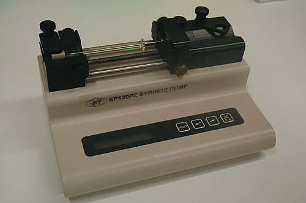
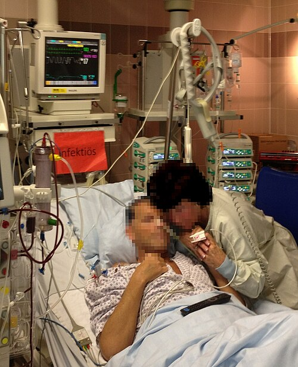

# CONTROLE DE SINTOMAS

Para entender o controle de sintomas em Cuidados Paliativos (CP), você precisa primeiro mudar a "chave" mental da medicina curativa. Aqui, o sucesso não é a cura ou a normalização de exames laboratoriais, mas o alívio do sofrimento. A Organização Mundial da Saúde (OMS) define os Cuidados Paliativos como uma abordagem que melhora a qualidade de vida de pacientes e famílias que enfrentam doenças que ameaçam a continuidade da vida, através da prevenção e alívio do sofrimento.

Um conceito que as bancas de residência amam é o de **Dor Total**, cunhado por Cicely Saunders. Ele diz que o sofrimento do paciente não é apenas físico, mas composto por dimensões psicossociais e espirituais. Se você ignorar isso na prova, vai errar a questão que pergunta por que a morfina não está funcionando em um paciente com câncer metastático e angústia existencial.

## Manejo da Dor em Cuidados Paliativos

A dor é o sintoma mais temido. Para a prova, você deve dominar a **Escada Analgésica da OMS**. Ela foi desenhada para o câncer, mas aplicamos a quase tudo em CP.

### A Escada Analgésica e a Titulação

A lógica é simples: subimos os degraus conforme a intensidade da dor (0 a 10).

- **Degrau 1 (Dor Leve: 1-3):** Analgésicos não opioides (Dipirona, Paracetamol) +/- Adjuvantes.

- **Degrau 2 (Dor Moderada: 4-6):** Opioides fracos (Codeína, Tramadol) + Não opioides +/- Adjuvantes.

- **Degrau 3 (Dor Forte: 7-10):** Opioides fortes (Morfina, Metadona, Fentanil, Oxicodona) + Não opioides +/- Adjuvantes.

**Dica de Ouro do MedEvo:** Se o paciente chega com dor 9/10, você não começa no degrau 1. Você pula direto para o degrau 3. A escada é um guia de intensidade, não um rito de passagem obrigatório.

### Opioides: O que você precisa saber

*Figura 1 - Bomba de seringa para infusão subcutânea contínua. Alternativa ideal quando via oral não é possível, permitindo administração de opioides, antieméticos e sedativos. Fonte: Nmnogueira, CC BY-SA 2.5 | Wikimedia Commons*

A **Morfina** é o padrão-ouro. Por que? É barata, disponível e temos vasta experiência.

- **Dose de Resgate:** Sempre que você prescreve um opioide de horário, deve prescrever um resgate para a **dor irruptiva** (aquele pico de dor que "fura" a analgesia basal). A dose de resgate é geralmente **10% a 15% da dose total diária**.

- **Via de escolha:** Sempre prefira a via oral. Se o paciente não deglute, a **hipodermóclise** (via subcutânea) é a nossa melhor amiga em CP. Ela é segura, permite infusão de fluidos e medicações, mas lembre-se: a absorção pode ser variável em pacientes muito caquéticos.

**Tabela 1: Comparativo de Opioides Comuns**

| Opioide | Potência Relativa (Oral) | Particularidades |
| --- | --- | --- |
| Codeína | 1/10 da Morfina | Efeito teto; muito constipante. |
| Tramadol | 1/10 da Morfina | Risco de síndrome serotoninérgica e convulsão. |
| Morfina | 1 (Referência) | Metabólitos ativos (cuidado na Insuficiência Renal). |
| Metadona | Variável (longa meia-vida) | Ótima para dor neuropática; risco de acúmulo. |
| Fentanil | 75-100x a Morfina | Uso em adesivo (transdérmico) apenas para dor ESTÁVEL. |

**Cuidado com a Insuficiência Renal:** A morfina e a codeína possuem metabólitos ativos que são excretados pelo rim. Se o paciente tem ClCr < 30 ml/min, eles se acumulam e causam neurotoxicidade (mioclonias, confusão, sedação excessiva). Nesses casos, a **Metadona** ou o **Fentanil** são preferíveis, pois o metabolismo é predominantemente hepático.

### Efeitos Adversos dos Opioides

Aqui está a pegadinha clássica de prova: **Constipação**.
Quase todos os efeitos colaterais dos opioides (náuseas, vômitos, sonolência) geram tolerância, ou seja, melhoram após alguns dias de uso. A constipação NÃO. Ela é universal e persistente.
**Regra de ouro:** Prescreveu opioide? Prescreva um laxante (ex: Óleo mineral, Lactulose, Bisacodil). Como diz o Dr. Will, "a mão que prescreve a morfina deve ser a mesma que prescreve o laxativo".

## Dispneia: O "Sufocamento" no Fim da Vida

A dispneia é um sintoma subjetivo. O paciente diz que está com falta de ar, mesmo que a saturação de oxigênio esteja 95%.

### O papel da Morfina na Dispneia

Muitos alunos travam aqui: "Vou dar morfina para quem não está conseguindo respirar? Vai causar depressão respiratória!".
**Erro clássico.** Em doses baixas, a morfina é a droga de escolha para dispneia em pacientes terminais (Câncer, DPOC avançado, IC terminal).
**Por que funciona?** Ela reduz a percepção central da falta de ar, diminui o drive respiratório excessivo e reduz o consumo de oxigênio pelo miocárdio.

### Oxigenoterapia vs. Ventilador

Se o paciente **não está hipoxêmico** (SaO₂ > 90%), o oxigênio suplementar não traz benefício superior ao ar comprimido.
**Dica de Prova:** O uso de um ventilador de mão (leque ou ventilador de mesa) direcionado ao rosto do paciente alivia a dispneia através da estimulação do nervo trigêmeo. As bancas adoram cobrar essa medida não-farmacológica.

### Estertores de Morte (Respiração Ruidosa)

Aquele ruído de "garreio" no final da vida acontece pelo acúmulo de secreções na orofaringe em pacientes que perderam o reflexo de tosse e deglutição.

- **Conduta:** Reposicionamento (decúbito lateral) e anticolinérgicos para secar a secreção (**Escopolamina** ou Butilbrometo de Escopolamina).

- **O que NÃO fazer:** Aspiração traqueal. É invasivo, desconfortável e causa efeito rebote de secreção.

- **Comunicação:** Explique à família que o paciente não está sofrendo ou sufocando; o ruído incomoda quem ouve, não quem sente.

## Sintomas Gastrointestinais

### Náuseas e Vômitos

O tratamento depende da causa (fisiopatologia):

- **Estase gástrica:** Metoclopramida (procinético).

- **Causas metabólicas/químicas (ex: Opioides):** Haloperidol (bloqueador D2 na zona gatilho quimiorreceptora).

- **Hipertensão Intracraniana (Metástases cerebrais):** Dexametasona (reduz edema peritumoral).

- **Quimioterapia:** Ondansetrona (Antagonista 5-HT3).

### Obstrução Intestinal Maligna

Comum em cânceres abdominais e pélvicos.

- **Se obstrução parcial:** Pode-se tentar procinéticos e corticoides.

- **Se obstrução TOTAL:** **CONTRAINDICADO** o uso de Metoclopramida. Por que? Porque você vai estimular o peristaltismo contra uma barreira física, causando cólicas atrozes e risco de perfuração.

- **Manejo:** Haloperidol para náuseas, Escopolamina para cólicas e Dexametasona para reduzir o edema da parede intestinal.

### Nutrição e Hidratação na Terminalidade

Este é um ponto de conflito ético frequente em provas.
Em pacientes em processo ativo de morte ou demência avançada, a **gastrostomia (GTT) ou sonda nasoenteral (SNE) NÃO aumentam a sobrevida**, não previnem pneumonia aspirativa e não melhoram a qualidade de vida.
A orientação é a **conforto-alimentação**: oferecer o que o paciente deseja, na consistência que ele tolera, enquanto houver desejo. Se ele não quer comer, não forçamos. A desidratação natural do fim da vida aumenta a liberação de endorfinas e diminui secreções pulmonares e vômitos.

*Figura 2 - Paciente em leito de UTI com monitorização e bombas de infusão. Em cuidados paliativos, o foco é conforto e qualidade de vida, não prolongamento artificial. Fonte: Pittigrilli, CC BY-SA 4.0 | Wikimedia Commons*

## Delirium e Agitação

O delirium é o sinal de falência orgânica cerebral. Em CP, ele pode ser hiperativo (agitação) ou hipoativo (prostração - muitas vezes confundido com depressão).

- **Primeira linha:** Haloperidol.

- **Benzodiazepínicos:** Devem ser evitados no delirium, pois podem causar efeito paradoxal e piorar a confusão. A exceção é se o delirium for por abstinência alcoólica ou se estivermos em um cenário de **Sedação Paliativa**.

### Sedação Paliativa

Diferente da eutanásia (que visa a morte), a sedação paliativa visa o **alívio de um sintoma refratário** (dor, dispneia ou agitação que não responderam a nada).

- **Drogas:** Midazolam (mais comum) ou Propofol.

- **Monitorização:** Não se monitora saturação ou sinais vitais para titular a dose; monitora-se o nível de conforto. O objetivo é a perda da consciência para que o paciente não sinta o sintoma intolerável.

## Cuidados Paliativos em Doenças Específicas

### Doença Renal Crônica (DRC)

Muitos pacientes idosos e frágeis optam pelo **Tratamento Conservador** (não dialítico).

- **Sintomas Urêmicos:** O prurido é comum (tratar com gabapentina ou colestiramina).

- **Manejo de Fluidos:** Restrição salina e diuréticos para evitar congestão.

### Demência Avançada

O foco é o conforto. Evitar idas à emergência por infecções urinárias ou pneumonias aspirativas que fazem parte da evolução natural da doença. A decisão deve ser compartilhada com a família, focando na dignidade e na não-maleficência.

### Esclerose Lateral Amiotrófica (ELA)

No início, o foco é manter a funcionalidade. No final, o manejo da dispneia e da sialorreia (excesso de saliva) é crucial. A autonomia do paciente sobre o desejo de ventilação mecânica invasiva deve ser respeitada e documentada precocemente.

**Tabela 2: Diagnóstico Diferencial de Sintomas Respiratórios**

| Sintoma | Causa Provável | Conduta de Escolha |
| --- | --- | --- |
| Dispneia (Saturação normal) | Percepção central alterada | Morfina em baixas doses |
| Dispneia (Saturação < 90%) | Hipoxemia | Oxigenoterapia alvo 90-92% |
| Estertores de morte | Secreção em via aérea superior | Escopolamina + Posicionamento |
| Tosse Refratária | Irritação brônquica (Câncer) | Codeína ou Morfina |

## Ferramentas de Prognóstico

Como saber se o paciente está em fase final de vida?

- **PPS (Palliative Performance Scale):** Uma versão da escala de Karnofsky para CP. Avalia deambulação, atividade, autocuidado, ingestão e nível de consciência. PPS < 30-40% indica proximidade da morte.

- **PPI (Palliative Performance Index):** Usa o PPS + sintomas (edema, dispneia em repouso, delirium, anorexia). Um PPI > 6 indica sobrevida menor que 3 semanas.

**Tabela 3: Escala de Performance Paliativa (PPS) - Simplificada**

| PPS % | Deambulação | Autocuidado | Ingestão | Consciência |
| --- | --- | --- | --- | --- |
| 100% | Plena | Completo | Normal | Plena |
| 50% | Sentado/Deitado | Assistência considerável | Normal ou reduzida | Plena ou Confusão |
| 30% | Totalmente no leito | Assistência total | Apenas goles | Plena ou Confusão/Sonolência |
| 10% | Totalmente no leito | Assistência total | Nada por boca | Comatoso |

## Aspectos Éticos e Comunicação

A comunicação em CP é um procedimento médico tão importante quanto uma intubação.

- **Protocolo SPIKES:** Usado para dar más notícias.

- **S**etting (Ambiente): Privacidade.

- **P**erception (Percepção): O que o paciente já sabe?

- **I**nvitation (Convite): O quanto ele quer saber?

- **K**nowledge (Conhecimento): Dar a notícia em doses pequenas, sem jargões.

- **E**mpathy (Empatia): Acolher as emoções.

- **S**trategy/Summary (Estratégia): Plano terapêutico.

**Dica de Prova:** A autonomia do paciente é soberana se ele estiver lúcido. Se ele não estiver, buscamos as **Diretivas Antecipadas de Vontade** ou o representante legal. O objetivo nunca é abreviar a vida (eutanásia) nem prolongar o sofrimento (distanásia), mas permitir a **ortotanásia** (morte no tempo certo, com dignidade).

## Farmacologia Clínica em CP: Pérolas para a Prova

- **Haloperidol:** É o "canivete suíço". Serve para delirium, náuseas, soluços refratários e agitação.

- **Dexametasona:** Excelente para dor óssea (metástases), compressão medular, hipertensão intracraniana e anorexia (estimula o apetite a curto prazo).

- **Clorpromazina:** Usada para soluços persistentes e como alternativa na náusea refratária.

- **Midazolam:** Droga de escolha para sedação paliativa e crises convulsivas em fim de vida.

- **Amitriptilina/Gabapentina:** Adjuvantes essenciais para dor neuropática (aquela em queimação ou choque).

**Exemplo Clínico Rápido:**
Paciente, 72 anos, câncer de próstata com metástases ósseas. Usa Morfina 10mg 4/4h. Queixa-se de dor intensa ao se movimentar (dor incidental).

- **O que fazer?** Prescrever resgate de morfina (1,5 a 2mg) 30 minutos antes de banhos ou trocas de decúbito.

- **E se ele começar com mioclonias?** Suspeite de neurotoxicidade por opioide. Conduta: Hidratação e rotação de opioide (trocar morfina por fentanil ou oxicodona).

## Pontos-Chave para Prova

- **Morfina na Dispneia:** É a primeira escolha, independente da saturação, para alívio do desconforto.

- **Constipação por Opioide:** Não gera tolerância. O tratamento com laxativos deve ser profilático e contínuo.

- **Obstrução Intestinal Completa:** Metoclopramida é contraindicada (risco de cólica e perfuração).

- **Estertores de Morte:** Tratar com reposicionamento e escopolamina; nunca aspirar.

- **Sedação Paliativa:** Indicada apenas para sintomas refratários. Não é eutanásia.

- **Nutrição Artificial em Demência Avançada:** Não traz benefício em sobrevida ou qualidade de vida; priorizar conforto-alimentação.

- **Via de Administração:** Preferência pela via oral; se impossibilitada, usar a hipodermóclise (subcutânea).

- **Escada da OMS:** Pode-se pular degraus conforme a intensidade da dor.

- **Delirium:** Haloperidol é a droga de escolha. Evitar benzodiazepínicos (exceto na sedação terminal).

- **Dor Irruptiva:** Tratar com doses de resgate (10-15% da dose diária total).

- **Oxigenoterapia:** Apenas se SaO₂ < 90%. Se normal, usar ventilador/leque no rosto.

- **Insuficiência Renal:** Evitar Morfina e Codeína (metabólitos ativos). Preferir Fentanil ou Metadona.

- **Hipercalcemia da Malignidade:** Suspeitar em paciente oncológico com confusão mental e desidratação. Tratar com hidratação vigorosa e bifosfonatos (ex: Zoledronato).

- **Princípios dos CP:** Não antecipar nem adiar a morte; oferecer suporte à família inclusive no luto.

- **Escopolamina:** Anticolinérgico usado para reduzir secreções respiratórias e cólicas intestinais.

- **Dexametasona:** Droga de escolha para náuseas por hipertensão intracraniana e dor por compressão nervosa/óssea. 🚫 **Contraindicação Absoluta:** Não há contraindicação absoluta para o uso de opioides em pacientes terminais com dor forte, mesmo se houver DPOC (o benefício do conforto supera o risco de depressão respiratória leve).

 Cópia offline para consulta pessoal.
 Fonte original:
 [https://www.medevo.com.br/material-apoio/ler/b5fad18c-9a1d-4792-bdb4-bad139c9a397](https://www.medevo.com.br/material-apoio/ler/b5fad18c-9a1d-4792-bdb4-bad139c9a397)
