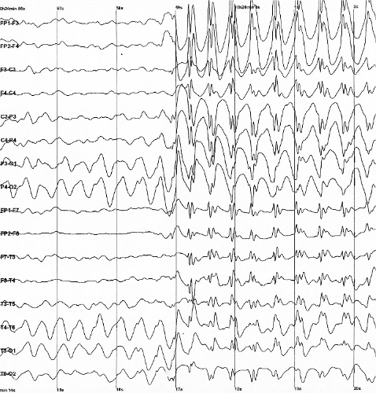
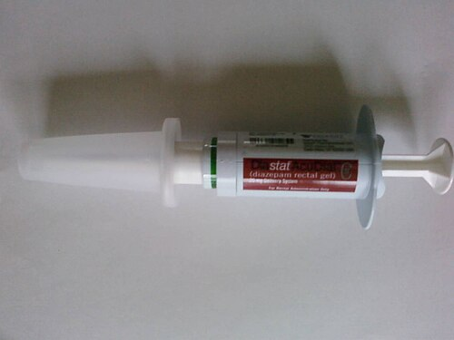

# CONVULSÕES E STATUS EPILEPTICUS

Para começar nossa conversa, precisamos alinhar o que é uma emergência neurológica de verdade. Na pediatria, poucas coisas desesperam tanto os pais (e médicos despreparados) quanto uma criança convulsionando. Mas você, aluno do MedEvo, precisa manter a calma e entender que a convulsão é um sintoma, não o diagnóstico final.

Uma crise convulsiva é o resultado de uma descarga elétrica anormal, excessiva e hipersincrônica de um grupo de neurônios. Quando essa crise se prolonga, entramos no terreno perigoso do Estado de Mal Epiléptico (EME) ou Status Epilepticus.

## Definições e o Cronômetro da Vida

Antigamente, esperávamos 30 minutos para dizer que era um Status Epilepticus. Hoje, a Sociedade Brasileira de Pediatria (SBP) e a ILAE utilizam o conceito de T1 e T2. Isso cai muito em prova porque mudou a forma como manejamos o paciente.

O T1 é o tempo em que a crise provavelmente não vai parar sozinha e você deve iniciar o tratamento farmacológico. Para crises tônico-clônicas generalizadas, esse tempo é de apenas 5 minutos. Se a criança está convulsionando há mais de 5 minutos, você já trata como Status Epilepticus.

O T2 é o tempo em que a atividade convulsiva prolongada pode causar dano neuronal irreversível ou morte neuronal. Para crises generalizadas, estimamos em 30 minutos. Percebe a lógica? Temos uma janela de 25 minutos entre o início do tratamento e o início do dano permanente. É por isso que o manejo precisa ser rápido e protocolado.

## Fisiopatologia: O Cabo de Guerra Cerebral

*Figura 1 - Eletroencefalograma (EEG) com padrão de complexos espícula-onda a 3 Hz, típico de crise de ausência. O EEG é fundamental para classificação das epilepsias e diagnóstico diferencial. Fonte: CC BY-SA 2.0 | Wikimedia Commons*

Por que a convulsão acontece? Imagine o cérebro como um cabo de guerra. De um lado, temos o sistema excitatório (Glutamato agindo nos receptores NMDA). Do outro, o sistema inibitório (GABA agindo nos receptores GABA-A).

Na convulsão, ou temos Glutamato demais, ou GABA de menos. No Status Epilepticus, ocorre um fenômeno perigoso: os receptores GABA-A começam a sofrer "internalização". Eles saem da membrana do neurônio e entram na célula. Por que isso importa para a sua prova? Porque os benzodiazepínicos (nossa primeira linha) precisam do receptor GABA-A na membrana para funcionar. Se você demora muito para tratar, o remédio para de fazer efeito porque não tem onde grudar. É por isso que a refratariedade aumenta a cada minuto que passa.

Além disso, a crise prolongada gera uma acidemia mista. O músculo contraindo sem parar gera ácido lático (acidose metabólica) e a hipoventilação ou apneia durante a crise gera acúmulo de CO2 (acidose respiratória). Se a banca te der uma gasometria de um paciente em Status, espere encontrar um pH baixo, HCO3 baixo e pCO2 alto.

## Etiologia: O Que Está Causando o Incêndio?

Não adianta só apagar o fogo (parar a crise), você precisa saber quem riscou o fósforo. Em pediatria, as causas mudam conforme a idade, e as bancas adoram explorar isso.

### Crise Convulsiva Febril

É a causa mais comum de crise convulsiva na infância (6 meses a 5 anos). O gatilho é a subida rápida da temperatura. Aqui, o Dr. Will sempre alerta: a febre não precisa ser de 40 graus, o que importa é a velocidade da curva térmica.

Dividimos em duas categorias, e você precisa decorar essa tabela:

| Característica | Crise Febril Simples | Crise Febril Complexa |
| --- | --- | --- |
| Duração | < 15 minutos | > 15 minutos |
| Tipo de Crise | Generalizada | Focal ou com início focal |
| Recorrência | Não repete em 24h | Repete em 24h |
| Pós-ictal | Breve, sem déficits | Prolongado ou com déficit (Paralisia de Todd) |

Se a crise for complexa, o sinal de alerta acende. Você precisa investigar infecção do Sistema Nervoso Central (SNC). Se houver abaulamento de fontanela, rigidez de nuca ou alteração persistente do nível de consciência, a punção lombar é obrigatória.

### Distúrbios Metabólicos

Hipoglicemia é um clássico. Toda criança convulsionando deve ter a glicemia capilar testada imediatamente. Outro vilão é o sódio.

Cuidado com a hiponatremia dilucional. Um erro comum em enfermarias pediátricas é o uso de soro muito hipotônico (como o Holliday 100% com apenas 30 mEq/L de Na) em crianças em jejum prolongado ou pós-operatório. Isso leva à intoxicação hídrica e convulsão. Por outro lado, a correção rápida demais de uma hipernatremia (comum em desidratações graves) causa edema cerebral e, consequentemente, convulsões.

### Causas Neonatais

No recém-nascido, a principal causa é a Encefalopatia Hipóxico-Isquêmica (asfixia perinatal). Outras causas incluem hemorragias intracranianas, malformações e erros inatos do metabolismo. Lembre-se: no neonato, o Fenobarbital é a droga de primeira escolha, diferente das crianças maiores.

### Maus-tratos e Trauma

Se você atender um lactente com convulsão, sem febre, e ao exame físico notar hemorragia retiniana e abaulamento de fontanela, pense em Síndrome do Bebê Sacudido (Shaken Baby Syndrome). Isso é uma forma de traumatismo cranioencefálico abusivo. A conduta é estabilizar, notificar o conselho tutelar/IML e realizar TC de crânio.

## O Manejo Inicial: O Protocolo que Salva Vidas

A prova vai te dar um cenário de caos. Sua resposta deve ser organizada. O ABCDE da reanimação não é opcional, é o primeiro passo.

- **A (Vias Aéreas):** Posicione a cabeça, aspire secreções. Não coloque nada na boca da criança.

- **B (Respiração):** Ofereça oxigênio a 100% sob máscara. A hipóxia piora o dano cerebral.

- **C (Circulação):** Acesso venoso periférico (dois, se possível). Se não conseguir acesso em 2 a 5 minutos, não perca tempo: parta para a via Intraóssea (IO) ou use vias alternativas para as drogas.

### Primeira Linha: Benzodiazepínicos (BZD)

O objetivo aqui é parar a crise AGORA.

- **Diazepam:** Dose de 0,3 a 0,5 mg/kg IV. Pode ser feito via retal se não houver acesso. Evite a via IM para o Diazepam, pois a absorção é errática e lenta.

- **Midazolam:** Dose de 0,1 a 0,2 mg/kg IV. A grande vantagem do Midazolam é a versatilidade. Se você não tem acesso venoso, o Midazolam IM é a melhor escolha inicial (dose de 0,2 mg/kg). Também pode ser usado via intranasal ou bucal.

**Dica de Prova:** Se a primeira dose de BZD não funcionar, você pode repetir uma vez após 5 minutos. Se após duas doses (ou 10 minutos de crise) a criança continuar convulsionando, você entrou no Estado de Mal Epiléptico estabelecido.

*Figura 2 - Diazepam retal em seringa pré-preenchida. Opção de primeira linha para tratamento pré-hospitalar de convulsões prolongadas quando acesso IV não está disponível. Fonte: Tatterfly, Domínio Público | Wikimedia Commons*

### Segunda Linha: Anticonvulsivantes de Longa Duração

Aqui o objetivo é manter a crise controlada e evitar a recorrência.

- **Fenitoína:** Dose de ataque de 20 mg/kg IV. Deve ser diluída apenas em Soro Fisiológico (no Glicosado ela precipita) e infundida lentamente (máximo 1 mg/kg/min ou 50 mg/min) para evitar arritmias e hipotensão.

- **Fenobarbital:** Dose de 20 mg/kg IV. É a primeira escolha no neonato. Em crianças maiores, geralmente é usado se a fenitoína falhar. Cuidado com a depressão respiratória, especialmente se já usou BZD.

- **Levetiracetam:** Tem sido cada vez mais cobrado. Dose de 40 a 60 mg/kg. Tem menos efeitos colaterais hemodinâmicos que a fenitoína.

### Terceira Linha: Estado de Mal Epiléptico Refratário

Se a crise persiste após BZD e uma droga de segunda linha (geralmente após 30-60 minutos de crise total), estamos diante de um EME refratário. Este paciente precisa de UTI, monitorização por EEG contínuo e via aérea definitiva (intubação).

As drogas aqui são infusões contínuas:

- **Midazolam (infusão contínua):** Muito usado pela facilidade de titulação.

- **Tiopental:** Um barbitúrico potente para indução de coma barbitúrico. É a droga de escolha em muitos protocolos para refratariedade extrema em lactentes.

- **Propofol:** Deve ser usado com cautela extrema em crianças pequenas devido ao risco de Síndrome da Infusão do Propofol (acidose metabólica, rabdomiólise, insuficiência cardíaca).

## Diagnóstico Diferencial: Nem Tudo que Treme é Convulsão

As bancas amam colocar "pegadinhas" com eventos paroxísticos não epilépticos.

- **Síncope Vasovagal:** Geralmente tem um gatilho (dor, calor, visão de sangue), pródromos (escurecimento visual, sudorese) e recuperação rápida.

- **Crise de Espasmo do Soluço:** A criança chora, entra em apneia em expiração, fica cianótica e pode ter uma breve perda de consciência ou abalo. Ocorre após frustração ou dor.

- **Terror Noturno:** A criança "acorda" gritando, inconsolável, mas está dormindo. Não há memória do evento.

- **Refluxo Gastroesofágico (Síndrome de Sandifer):** Posturas distônicas do pescoço que podem simular crises focais em lactentes.

## Exames Complementares: Quando e O Quê Pedir?

Não peça tudo para todos. O raciocínio clínico deve guiar o pedido.

- **Glicemia Capilar:** Sempre. No primeiro minuto.

- **Eletrólitos (Na, K, Ca, Mg):** Especialmente em crianças com diarreia, desidratação ou em uso de hidratação venosa.

- **Punção Lombar:** Indicada se houver suspeita de meningite, em crises febris complexas em menores de 6-12 meses (ou se o status vacinal for incompleto) e em qualquer criança com sinais de irritação meníngea.

- **Neuroimagem (TC ou RM):** Indicada se houver trauma, déficit focal novo, sinais de hipertensão intracraniana ou se for a primeira crise afebril sem causa óbvia. Em emergência, a TC é mais rápida para ver sangue ou grandes massas.

- **EEG:** Fundamental no Status Epilepticus para confirmar se a crise parou (pode haver o Status Não-Convulsivo, onde o corpo para de tremer, mas o cérebro continua em crise). Não é obrigatório na crise febril simples.

## Particularidades Terapêuticas e Erros Comuns

Um erro clássico que vejo alunos cometerem em simulados é esquecer da dose da Naloxona. Se você atende uma criança com depressão respiratória, miose pupilar e história de uso de opioides (como Fentanil em uma sedação), a Naloxona é o antídoto. Às vezes, a convulsão pode ser hipóxica secundária a uma parada respiratória por intoxicação.

Outro ponto: o uso de antitérmicos na crise febril. O antitérmico serve para o conforto da criança e para baixar a temperatura atual, mas ele **não previne** a recorrência da crise febril. Isso cai muito! A orientação aos pais deve ser clara: tratar a febre não garante que não haverá nova crise.

No manejo do choque associado à convulsão (comum em sepse com foco no SNC), a prioridade é estabilizar a parte hemodinâmica com expansão volêmica e antibióticos de amplo espectro (como Ceftriaxone e Vancomicina) enquanto se controla a crise.

## Tabela de Doses e Vias de Administração (Resumo para Emergência)

| Droga | Via | Dose | Observações |
| --- | --- | --- | --- |
| Diazepam | IV | 0,3 - 0,5 mg/kg | Máximo 10mg por dose. Não fazer IM. |
| Diazepam | Retal | 0,5 mg/kg | Útil se não houver acesso venoso. |
| Midazolam | IV | 0,1 - 0,2 mg/kg | Rápida ação, risco de apneia. |
| Midazolam | IM | 0,2 mg/kg | **Primeira escolha se sem acesso venoso.** |
| Midazolam | Intranasal | 0,2 mg/kg | Seguro e eficaz no pré-hospitalar. |
| Fenitoína | IV | 20 mg/kg | Diluir em SF. Infusão lenta. |
| Fenobarbital | IV | 20 mg/kg | Primeira escolha em neonatos. |

## Situações Especiais: Cuidados Paliativos e Fim de Vida

Às vezes, a convulsão surge em um contexto de terminalidade. Nesses casos, o objetivo não é o diagnóstico etiológico agressivo, mas o conforto. O Midazolam é a droga de escolha para sedação paliativa e controle de sintomas refratários, podendo ser usado em infusão contínua subcutânea (hipodermóclise) se o acesso venoso for difícil.

## O Papel do Acesso Intraósseo

Se você está no carrinho de emergência, a criança está convulsionando, o acesso venoso falhou e você já fez o Midazolam IM, mas a crise não para. Qual o próximo passo? Acesso Intraósseo (IO). É uma via rápida, que não colapsa no choque e permite a infusão de qualquer droga, incluindo a Fenitoína (segunda linha). Não tenha medo da agulha de IO; ela salva vidas no Status Epilepticus refratário.

## Pontos-Chave para Prova 🧠

- **Status Epilepticus (Definição):** Crise > 5 minutos (T1) ou sem recuperação de consciência entre crises. Dano neuronal provável após 30 minutos (T2).

- **Primeira Linha:** Benzodiazepínicos. Diazepam IV ou Midazolam IM (se sem acesso venoso).

- **Segunda Linha:** Fenitoína (20 mg/kg) ou Fenobarbital (especialmente em neonatos).

- **Crise Febril Simples:** 6 meses a 5 anos, < 15 min, generalizada, não repete em 24h. Conduta: suporte e antitérmico.

- **Crise Febril Complexa:** > 15 min, focal ou recorrente em 24h. Investigar infecção do SNC (Punção Lombar).

- **Neonatos:** Fenobarbital é a droga de primeira escolha para crises neonatais.

- **Hiponatremia:** Risco de convulsão se Na < 125 mEq/L ou se houver queda rápida (iatrogenia com soro hipotônico).

- **Síndrome do Bebê Sacudido:** Tríade de hemorragia retiniana, hematoma subdural e encefalopatia. Notificação obrigatória.

- **Via IM:** O Diazepam **NÃO** deve ser feito via IM (absorção errática). O Midazolam **PODE** e deve ser usado IM se não houver acesso venoso.

- **Fenitoína:** Diluir apenas em Soro Fisiológico. Nunca em Soro Glicosado (precipita).

- **Acidemia Mista:** Comum no Status prolongado (Lática + Respiratória).

- **Naloxona:** Antídoto para depressão respiratória e miose por opioides (ex: Fentanil).

- **Glicemia:** Deve ser checada em TODA criança com crise convulsiva.

- **Punção Lombar:** Obrigatória se houver sinais meníngeos, abaulamento de fontanela ou suspeita de meningite bacteriana.

- **Glasgow Pediátrico:** Lembre-se que a resposta verbal muda (sorri, chora, balbucia) para lactentes.

- **O que NÃO fazer:** Não colocar objetos na boca, não tentar segurar a língua, não atrasar o BZD esperando a febre baixar.

- **DVP (Derivação Ventrículo-Peritoneal):** Se a criança tem DVP e convulsiona, pense em disfunção da válvula ou infecção do sistema.

- **Antitérmicos:** Tratam o desconforto da febre, mas **não** previnem novas crises febris.

 Cópia offline para consulta pessoal.
 Fonte original:
 [https://www.medevo.com.br/material-apoio/ler/40d439e3-edf0-4546-a11d-9aba4db9308d](https://www.medevo.com.br/material-apoio/ler/40d439e3-edf0-4546-a11d-9aba4db9308d)
