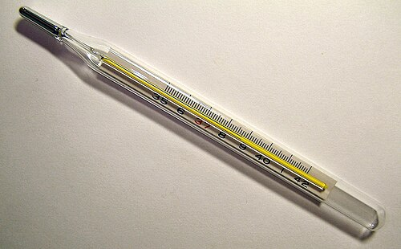
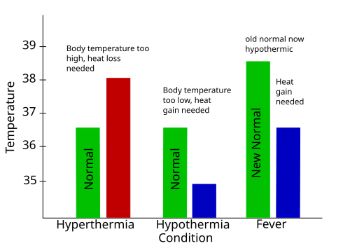

# CONVULSÕES FEBRIS

Imagine que você está no seu plantão de pediatria em uma noite chuvosa. Uma mãe entra desesperada, com o filho de 2 anos nos braços. A criança está rígida, com os olhos virados e apresentando abalos nos quatro membros. A mãe grita que ele está morrendo. Você checa a temperatura: 39,2ºC.

Nesse momento, o seu papel não é apenas médico, é de gestor de crise. Você sabe que, estatisticamente, essa criança tem uma condição benigna, mas para aquela família, é o pior dia da vida deles. Entender a convulsão febril (CF) vai muito além de decorar critérios, é saber quando manter a calma e quando, de fato, o sinal de alerta deve ser ligado.

## O que é, de fato, uma Convulsão Febril?

A primeira coisa que você precisa ter na ponta da língua é a definição. A Sociedade Brasileira de Pediatria (SBP) e a Liga Internacional Contra a Epilepsia (ILAE) definem a crise febril como um evento que ocorre em crianças, geralmente entre **6 meses e 5 anos de idade**, associado a uma doença febril, mas **sem evidência de infecção do Sistema Nervoso Central (SNC)** ou desequilíbrio metabólico agudo, e em crianças sem história prévia de crises afebris.

Cuidado com a pegadinha de prova: se a criança já teve uma crise sem febre antes, o diagnóstico não é crise febril, é epilepsia desencadeada por febre. A crise febril é uma entidade à parte.

### A Janela de Vulnerabilidade

Por que essa faixa etária? Por que não vemos adultos tendo convulsões por causa de uma gripe forte?
A resposta está na fisiopatologia. O cérebro da criança entre 6 meses e 5 anos está em uma "tempestade perfeita" de desenvolvimento. Existe uma imaturidade dos mecanismos de termorregulação e, mais importante, um desequilíbrio entre os sistemas excitatórios (glutamato) e inibitórios (GABA).

Durante a febre, há liberação de citocinas pirogênicas (como a IL-1 beta) que aumentam a excitabilidade neuronal. Em um cérebro maduro, isso é controlado. No lactente, o limiar convulsivo é mais baixo. É por isso que, como o Dr. Will costuma enfatizar nas discussões do MedEvo, a velocidade de subida da temperatura às vezes importa tanto quanto o valor absoluto da febre.

## Classificação: O Divisor de Águas

*Figura 1 - Termômetro de mercúrio indicando 38,7°C (febre). Em crises febris, a velocidade de subida da temperatura pode ser tão importante quanto o valor absoluto. Fonte: Menchi, CC BY-SA 3.0 | Wikimedia Commons*

Se você aprender apenas uma coisa hoje, que seja esta tabela. Ela define sua conduta, seu pedido de exames e o que você vai dizer para os pais.

| Característica | Crise Febril Simples (Benigna) | Crise Febril Complexa (Complicada) |
| --- | --- | --- |
| **Duração** | < 15 minutos | > 15 minutos |
| **Tipo de Crise** | Generalizada (tônico-clônica) | Focal ou com início focal |
| **Frequência** | Única em 24 horas | Recorrente em 24 horas |
| **Pós-ictal** | Curto, sem déficits | Prolongado ou com déficit (ex: Paralisia de Todd) |

**Por que isso cai tanto em prova?**
Porque a crise simples é o "padrão ouro" da benignidade. Ela não aumenta significativamente o risco de epilepsia futura e não exige investigação exaustiva. Já a complexa é o sinal amarelo: ela pode esconder uma malformação, uma infecção ou ser o primeiro sinal de uma síndrome epiléptica.

## Diagnóstico: O Medo da Meningite

O diagnóstico da convulsão febril é **clínico**. Não existe exame de sangue que confirme "é crise febril". O seu trabalho é excluir os diferenciais. E o maior medo de qualquer pediatra (e de qualquer banca de residência) é a Meningite.

### Quando puncionar? (A Indicação do Líquor)

Muitos alunos erram ao achar que toda primeira crise febril precisa de punção lombar (PL). Isso é um erro clássico. Segundo a SBP e a Academia Americana de Pediatria, as indicações de PL são:

- **Sinais meníngeos ou de irritabilidade:** Rigidez de nuca, sinal de Brudzinski ou Kerning (lembre-se que em lactentes esses sinais podem estar ausentes!).

- **Crianças entre 6 e 12 meses com vacinação incompleta:** Especialmente para *Haemophilus influenzae* tipo b e *Streptococcus pneumoniae*. Se você não sabe o status vacinal, o rigor aumenta.

- **Uso prévio de antibióticos:** O antibiótico pode "mascarar" os sinais clínicos de uma meningite, mas não cura a infecção no SNC sem o tratamento adequado.

- **Crise febril complexa:** Especialmente se houver estado de mal epiléptico febril.

**Dica de Professor:** Se a criança tem 2 anos, teve uma crise de 2 minutos, está vacinada e agora está no seu colo sorrindo e aceitando dieta, a chance de ser meningite é próxima de zero. Não puncione por protocolo; puncione por clínica.

### E o EEG e a Tomografia?

Aqui está outra pegadinha. O Eletroencefalograma (EEG) **não deve ser feito de rotina** na crise febril simples. Ele não prevê quem vai ter epilepsia e pode vir com alterações inespecíficas que só servem para deixar os pais mais ansiosos.
A neuroimagem (TC ou RM) também é dispensável na crise simples. Só pedimos se houver suspeita de trauma (Síndrome do Bebê Sacudido), sinais de hipertensão intracraniana ou se a crise for claramente focal e persistente.

*Figura 2 - Representação conceitual da febre: o hipotálamo ajusta o termostato corporal para cima em resposta a pirógenos. Crianças de 6m-5a são vulneráveis por imaturidade dos mecanismos de termorregulação. Fonte: Philip Newton, Domínio Público | Wikimedia Commons*

## Manejo Agudo: O que fazer na hora do "vâmu vê"

A maioria das crises febris dura menos de 5 minutos e já parou quando a criança chega ao hospital. Se ela chegar convulsionando, o protocolo é o ABCDE da emergência pediátrica.

- **Posicionamento e Vias Aéreas:** Decúbito lateral para evitar aspiração, oxigênio se necessário (máscara ou cateter).

- **Acesso Venoso:** Se não conseguir em 2 a 3 minutos, não perca tempo. Vá para vias alternativas.

- **Drogas de Escolha (Benzodiazepínicos):**

- **Diazepam IV:** 0,2 a 0,3 mg/kg (máximo 10 mg). Cuidado: não dilua em soro, ele precipita.

- **Midazolam IM:** 0,2 mg/kg. É excelente porque não precisa de acesso venoso imediato.

- **Diazepam Retal:** 0,5 mg/kg. Muito usado em países desenvolvidos, menos comum no Brasil, mas uma opção válida.

**O Erro que Reprova:** Tentar baixar a febre com antitérmico enquanto a criança convulsiona. O antitérmico não para a crise. Primeiro você para a convulsão com benzodiazepínico, depois você trata a febre.

## O Mito do Antitérmico e a Prevenção

"Doutor, se eu der dipirona de 6 em 6 horas, ele não vai mais ter convulsão?"
A resposta curta e grossa é: **Não.**
Estudos mostram que o uso rigoroso de antitérmicos não previne a recorrência da crise febril. A convulsão muitas vezes acontece no "estirão" térmico, antes mesmo dos pais perceberem que a criança está quente.
O antitérmico serve para o conforto da criança, não para proteger o cérebro da convulsão.

### Profilaxia Medicamentosa

- **Contínua (Fenobarbital ou Ácido Valproico):** Praticamente abandonada para crises febris simples devido aos efeitos colaterais (hiperatividade, distúrbios de aprendizado). Pode ser considerada em casos muito específicos de crises complexas recorrentes, mas sempre com avaliação do neuropediatra.

- **Intermitente (Clobazam ou Diazepam oral):** Pode ser usada apenas durante os dias de febre em crianças com crises muito frequentes que geram extremo estresse familiar. Mas atenção: a diretriz brasileira não recomenda isso como rotina.

## Prognóstico: O que dizer para os pais?

Você precisa ser o porto seguro dessa família. Use estas três verdades:

- **A crise febril simples não causa lesão cerebral nem atraso no desenvolvimento.**

- **O risco de morte é inexistente na crise simples.**

- **O risco de epilepsia futura é apenas ligeiramente maior que o da população geral (cerca de 1% na população geral vs. 2% em quem teve CF simples).**

### Risco de Recorrência

Cerca de 1/3 das crianças que tiveram uma crise terão outra. Os fatores que aumentam esse risco são:

- Idade jovem na primeira crise (< 12-18 meses).

- História familiar de crise febril.

- Febre não muito alta no momento da crise (mostra um limiar muito baixo).

- Curto intervalo entre o início da febre e a crise.

## Diagnóstico Diferencial: Não coma bola!

Nem tudo que vibra com febre é crise febril.

| Diagnóstico | Pista Clínica |
| --- | --- |
| **Meningite/Encefalite** | Fontanela abaulada, vômitos em jato, letargia persistente, sinais meníngeos. |
| **Encefalite Herpética** | Crises focais repetidas, alteração de comportamento, líquor com hemácias. |
| **Distúrbios Metabólicos** | Hipoglicemia (comum em lactentes que param de comer por infecção), hiponatremia (pense em SIADH pós-meningite). |
| **Síndrome de Dravet** | Crises febris muito prolongadas (estado de mal) que começam antes dos 12 meses e evoluem com crises afebris e atraso. |
| **Espasmos Infantis (West)** | Não são crises febris! São contrações súbitas em "sustos", geralmente ao despertar. |

## Pontos-Chave para Prova 🧠

- **Faixa Etária Clássica:** 6 meses a 5 anos (algumas bancas usam 3 a 60 meses, acompanhando atualizações da SBP).

- **Definição de Crise Simples:** Generalizada, < 15 min, única em 24h.

- **Definição de Crise Complexa:** Focal, > 15 min ou recorrente em 24h.

- **Indicação Absoluta de PL:** Sinais de irritação meníngea ou suspeita de infecção do SNC.

- **Indicação Relativa de PL:** Criança < 12 meses com vacinação incompleta para Hib ou Pneumo.

- **Antitérmicos:** NÃO previnem a ocorrência ou recorrência da crise febril.

- **EEG e Neuroimagem:** Não indicados na crise febril simples.

- **Primeira escolha na crise aguda:** Midazolam (IM/IV/Nasal) ou Diazepam (IV).

- **Risco de Epilepsia:** Na crise simples, é muito baixo (aprox. 2%).

- **Fator de risco mais importante para recorrência:** Idade < 12 meses no primeiro episódio.

- **Vacinas:** Algumas vacinas (como a tríplice viral) podem causar febre e, consequentemente, crise febril, mas o benefício da vacinação supera infinitamente o risco da crise benigna.

- **Conduta na Crise Simples:** Observação, tratar a causa da febre, orientar a família e alta. Não precisa internar se a criança estiver bem.

- **Diferencial de ALTE/BRUE:** No BRUE (Evento Breve Inexplicado Resolvido), a criança tem alteração de cor ou respiração, mas não tem febre nem movimentos convulsivos típicos.

- **Fenobarbital:** Primeira escolha para convulsões **neonatais**, mas evitado na crise febril pelo prejuízo cognitivo.

- **O que NÃO fazer:** Não peça TC de crânio para toda criança que teve uma crise febril simples; isso é desperdício de recurso e radiação desnecessária.

Lembre-se: na prova, a banca vai tentar te convencer a ser invasivo em uma criança que teve uma crise simples. Resista! A crise febril simples é o triunfo da observação clínica sobre o excesso de exames. Como dizemos no MedEvo, o melhor tratamento para a crise febril simples é o "tempo e o esclarecimento".

 Cópia offline para consulta pessoal.
 Fonte original:
 [https://www.medevo.com.br/material-apoio/ler/ab347228-db4b-4185-98a7-9d3b77a09950](https://www.medevo.com.br/material-apoio/ler/ab347228-db4b-4185-98a7-9d3b77a09950)
