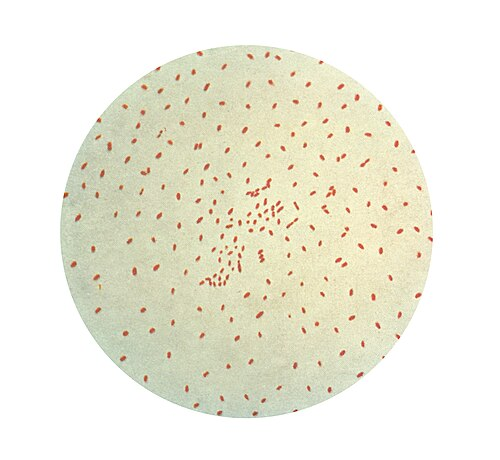
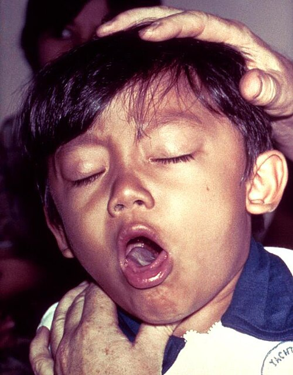

# COQUELUCHE (PERTUSSIS)

A coqueluche, popularmente conhecida como tosse comprida ou tosse das cem noites, é uma daquelas doenças que muitos acreditam estar erradicada, mas que continua aparecendo com força nas provas de residência e, infelizmente, nas nossas emergências pediátricas. Para entender a coqueluche, você precisa esquecer a ideia de que ela é apenas uma "tosse forte". Ela é uma doença mediada por toxinas, e é esse conceito que explica desde a clínica até as complicações graves.

Como professor, vejo muitos alunos errando questões por não perceberem que a apresentação clínica muda radicalmente conforme a idade do paciente. O que cai na prova sobre o escolar não é o mesmo que cai sobre o lactente jovem. Vamos dissecar cada ponto para que você não caia nas pegadinhas das bancas.

## Etiologia e Fisiopatologia

*Figura 1 - Coloração de Gram mostrando a bactéria Bordetella pertussis, cocobacilos Gram-negativos causadores da coqueluche. Fonte: CDC Public Health Image Library, Domínio Público | Wikimedia Commons*
: O Porquê da Gravidade

A culpada é a *Bordetella pertussis*, um cocobacilo gram-negativo, fastidioso e aeróbio estrito. Ela tem um tropismo absoluto pelo epitélio ciliado do trato respiratório. Mas aqui está o segredo: a bactéria em si não invade a corrente sanguínea. O estrago é feito pelas suas toxinas.

A principal delas é a Toxina Pertussis (PT). Ela causa uma série de efeitos sistêmicos, mas o mais característico para a sua prova é a inibição da migração de linfócitos dos vasos para os tecidos. É por isso que o hemograma da coqueluche é clássico: uma leucocitose absurda com linfocitose absoluta. Se você vir um lactente com 50.000 leucócitos e 80% de linfócitos, sem febre, pense em coqueluche antes de pensar em leucemia.

Outra toxina importante é a Adenilato Ciclase, que inibe a função dos fagócitos, permitindo que a bactéria sobreviva inicialmente. A Citotoxina Traqueal causa a paralisia e a destruição dos cílios respiratórios. Imagine o seguinte: sem cílios para movimentar o muco, o corpo precisa de um mecanismo alternativo para limpar as vias aéreas. Esse mecanismo é a tosse paroxística. A tosse não é um "erro" do corpo, é uma tentativa desesperada de clareamento mucociliar em um sistema cujos "vassoureiros" (os cílios) foram demitidos pela bactéria.

## Epidemiologia e Transmissão

A coqueluche é uma doença de notificação compulsória imediata no Brasil. A transmissão ocorre por gotículas respiratórias (contato direto). O período de incubação varia de 7 a 10 dias, podendo chegar a 21 dias.

Um conceito fundamental que o Dr. Will sempre reforça nas discussões de caso: a imunidade, seja pela vacina ou pela própria doença, não é permanente. Ela decai após 5 a 10 anos. Isso explica por que temos um reservatório enorme de adolescentes e adultos com "tosse persistente" que passam a doença para os lactentes que ainda não completaram o esquema vacinal.

A maior gravidade e letalidade ocorrem em lactentes menores de 6 meses, especialmente aqueles com menos de 3 meses que ainda não receberam as primeiras doses da vacina pentavalente.

## Quadro Clínico

*Figura 2 - Menino diagnosticado com coqueluche (pertussis), demonstrando apresentação clínica típica. Fonte: CDC Public Health Image Library, Domínio Público | Wikimedia Commons*
: As Três Fases Clássicas

A coqueluche não começa com o guincho. Ela evolui em fases, e a banca vai tentar te confundir justamente no início da doença.

### 1. Fase Catarral (1 a 2 semanas)

É a fase mais perigosa para a saúde pública porque é a mais infectante e a menos específica. O paciente apresenta sintomas de um resfriado comum: rinorreia leve, espirros, febre baixa (ou ausência de febre) e tosse discreta.
**Dica de prova:** Se o enunciado diz que a criança está com febre alta e prostrada desde o início, provavelmente não é coqueluche. A coqueluche é marcadamente afebril ou com febre muito baixa.

### 2. Fase Paroxística (2 a 6 semanas)

Aqui o diagnóstico clínico se torna evidente. A tosse evolui para paroxismos: acessos súbitos de tosse curta e rápida em uma única expiração, sem que o paciente consiga inspirar entre elas.
Ao final do paroxismo, o paciente faz uma inspiração profunda e forçada contra a glote estreitada, gerando o famoso **guincho inspiratório**.
Após o acesso, é extremamente comum o **vômito pós-tosse** (emetizante) e a exaustão. Durante o acesso, a criança pode apresentar a **fáscies pletórica** (rosto vermelho ou cianótico, olhos saltados, turgência jugular).

### 3. Fase de Convalescença (2 a 6 semanas ou meses)

Os paroxismos diminuem em frequência e intensidade. No entanto, a tosse pode retornar se o paciente tiver outra infecção respiratória viral meses depois, o que chamamos de memória do reflexo da tosse.

### A Grande Pegadinha: O Lactente Jovem (

| Método | Vantagem | Desvantagem |
| --- | --- | --- |
| **Cultura** | Padrão-ouro, 100% específica | Lenta, baixa sensibilidade, exige meio especial |
| **PCR** | Rápido, alta sensibilidade | Pode detectar DNA bacteriano sem viabilidade |
| **Hemograma** | Sugestivo e rápido | Não confirma etiologia (linfocitose pode ser viral) |

## Diagnóstico Diferencial: Não confunda!

Muitas questões do MedEvo trazem cenários onde você deve diferenciar a coqueluche de outras patologias respiratórias.

- **Pneumonia por *Chlamydia trachomatis*:** Ocorre em lactentes jovens (1 a 3 meses). A tosse também é em acessos (tosse "staccato"), mas há uma história de parto vaginal, conjuntivite neonatal prévia, ausência de guincho e, no hemograma, encontramos **eosinofilia**, não linfocitose.

- **Bronquiolite Viral Aguda (BVA):** Ocorre no mesmo grupo etário. A diferença é que na BVA há sibilância, sinais de desconforto respiratório contínuo e pródromos virais mais claros. Na coqueluche, a criança costuma ficar bem entre os acessos de tosse.

- **Adenovírus:** Pode causar uma síndrome coqueluchoide (tosse paroxística e guincho), mas geralmente vem acompanhado de febre alta, faringite e conjuntivite.

- **Corpo Estranho:** Início súbito, sem fase catarral prévia, geralmente em crianças maiores que já manipulam objetos.

## Tratamento: O Tempo é Tudo

Aqui está o ponto onde os alunos mais erram. O antibiótico na coqueluche tem dois objetivos, mas a eficácia depende de quando ele é iniciado.

- **Objetivo Clínico:** Se iniciado na fase catarral, o antibiótico pode atenuar os sintomas e encurtar o curso da doença. Se iniciado na fase paroxística (que é quando a maioria chega ao médico), ele **NÃO** altera o curso da doença. A tosse continuará por semanas.

- **Objetivo Epidemiológico:** Este é o principal. O antibiótico elimina a bactéria da nasofaringe em cerca de 5 dias, interrompendo a cadeia de transmissão. Sem tratamento, o paciente transmite por até 3 semanas.

### Escolha do Antibiótico (Macrolídeos)

A primeira escolha hoje, segundo o Ministério da Saúde e a SBP, é a **Azitromicina**.

- **Azitromicina:** 10 mg/kg/dia (máximo 500 mg) por 5 dias. Em menores de 6 meses, é a droga de escolha absoluta.

- **Claritromicina:** 15 mg/kg/dia (máximo 1g/dia) dividida em 2 doses, por 7 dias. Não recomendada para menores de 1 mês.

- **Eritromicina:** Foi a primeira escolha por muito tempo, mas caiu em desuso devido aos efeitos colaterais gastrointestinais e à associação com **Estenose Hipertrófica de Piloro** em neonatos. Se usada, a dose é 40-50 mg/kg/dia por 7 a 14 dias.

- **Sulfametoxazol-Trimetoprim:** Usado como segunda linha em caso de alergia ou intolerância aos macrolídeos. Contraindicado para menores de 2 meses (risco de kernicterus).

### Tabela 2: Tratamento Farmacológico por Faixa Etária

| Idade | 1ª Escolha | Esquema |
| --- | --- | --- |
| **< 1 mês** | Azitromicina | 10 mg/kg/dia por 5 dias |
| **1 a 5 meses** | Azitromicina | 10 mg/kg/dia por 5 dias |
| **> 6 meses** | Azitromicina | 10 mg/kg no 1º dia, 5 mg/kg do 2º ao 5º dia |
| **Alternativa** | SMZ-TMP | 8 mg/kg/dia (de TMP) por 10 dias (se > 2 meses) |

**Cuidado:** Não use xaropes para tosse, sedativos ou mucolíticos. Eles não funcionam e podem ser perigosos. O tratamento de suporte inclui hidratação, nutrição fracionada (para evitar vômitos) e oxigenoterapia se necessário.

## Critérios de Internação

Nem toda coqueluche precisa de hospital. Mas a banca quer saber se você reconhece o paciente grave. Devem ser internados:

- Lactentes menores de 3 a 6 meses (pelo alto risco de apneia).

- Presença de sinais de desconforto respiratório.

- Apneia ou cianose.

- Incapacidade de manter hidratação ou alimentação oral.

- Complicações (pneumonia, convulsões).

- Leucocitose extrema (> 50.000).

## Complicações: O Que Mata o Paciente?

A complicação mais comum é a **Pneumonia**. Ela pode ser causada pela própria *B. pertussis* ou, mais frequentemente, por uma infecção secundária (S. pneumoniae, S. aureus).

Outras complicações importantes:

- **Neurológicas:** Encefalopatia da coqueluche, convulsões e hemorragias intracranianas (devido ao aumento da pressão intratorácica e venosa durante a tosse).

- **Mecânicas:** Hemorragia conjuntival, epistaxe, hérnias inguinais e umbilicais, pneumotórax e enfisema subcutâneo.

- **Hipertensão Pulmonar Maligna:** É a causa de óbito nos casos de coqueluche grave com hiperleucocitose. Os agregados de linfócitos causam trombos na vasculatura pulmonar, levando a uma falência cardíaca direita aguda.

## Prevenção: A Estratégia de Proteção

A prevenção é o pilar mais cobrado em provas, especialmente a vacinação da gestante.

### Vacinação da Criança (Calendário PNI)

- **Pentavalente (DTP + Hib + HepB):** Aos 2, 4 e 6 meses.

- **DTP (Tríplice Bacteriana):** Reforços aos 15 meses e aos 4 anos.

- **Importante:** A vacina utilizada no PNI para crianças é a de células inteiras (DTP), que é mais imunogênica, porém mais reatogênica (causa mais febre e dor). Em crianças com contraindicação à vacina de células inteiras (ex: episódio hipotônico-hiporresponsivo ou convulsão após dose prévia), utiliza-se a vacina **acelular (DTPa)**.

### Vacinação da Gestante (A Estratégia Vencedora)

Esta é a "menina dos olhos" das bancas. A gestante deve receber a **dTpa (Tríplice bacteriana acelular do tipo adulto)** a partir da **27ª semana de gestação** (idealmente até a 36ª semana).

- **Por que vacinar a gestante?** Para que ela produza anticorpos e os transfira via placenta para o feto. Isso garante proteção passiva ao recém-nascido nos primeiros meses de vida, antes que ele possa completar seu próprio esquema vacinal.

- **E se ela perdeu o prazo?** Deve ser vacinada no puerpério o mais rápido possível (estratégia casulo), embora a transferência de anticorpos via leite materno seja menos eficaz que a transplacentária.

- **Frequência:** A dTpa deve ser feita **em TODA gestação**, independentemente de quando foi a última dose.

### Quimioprofilaxia (Controle de Contatos)

Todos os contatos domiciliares de um caso confirmado de coqueluche devem receber quimioprofilaxia com macrolídeo, independentemente do estado vacinal.

- O objetivo é interromper a transmissão para indivíduos vulneráveis.

- A droga e a dose são as mesmas do tratamento.

### Tabela 3: Resumo da Prevenção

| Público | Intervenção | Observação |
| --- | --- | --- |
| **Crianças** | Pentavalente + DTP | 2, 4, 6 meses + reforços |
| **Gestantes** | dTpa | A partir da 27ª semana, em cada gestação |
| **Contatos** | Azitromicina | Mesma dose do tratamento, para todos os contatos |
| **Prof. Saúde** | dTpa | Reforço a cada 10 anos (ou 5 anos em algumas situações) |

## Pontos-Chave para Prova

- **Agente:** *Bordetella pertussis*, gram-negativo, mediado por toxinas.

- **Hemograma Típico:** Leucocitose importante com linfocitose absoluta (frequentemente > 20.000-50.000 leucócitos).

- **Clínica Clássica:** Fase catarral (resfriado) -> Fase paroxística (tosse em acessos, guincho, vômitos pós-tosse) -> Convalescença.

- **Lactente Jovem (< 3 meses):** Não faz guincho. Apresenta apneia, cianose e bradicardia. É o grupo de maior risco.

- **Diagnóstico de Escolha:** PCR de secreção de nasofaringe (rápido e sensível).

- **Tratamento de Escolha:** Azitromicina (5 dias). Em neonatos, evita-se a Eritromicina pelo risco de estenose hipertrófica de piloro.

- **Efeito do Antibiótico:** Se iniciado tarde, não muda a tosse, mas interrompe a transmissão após 5 dias.

- **Notificação:** Compulsória e imediata.

- **Vacina na Gestante:** dTpa a partir da 27ª semana, em todas as gestações. É a principal medida para proteger o recém-nascido.

- **Quimioprofilaxia:** Indicada para todos os contatos próximos, independente da vacinação prévia.

- **Diagnóstico Diferencial:** *Chlamydia trachomatis* (tosse staccato + eosinofilia + conjuntivite prévia).

- **Complicação mais comum:** Pneumonia bacteriana secundária.

- **Complicação mais temida no lactente:** Hipertensão pulmonar por hiperleucocitose.

- **O que NÃO fazer:** Não prescrever antitussígenos ou sedativos. Não esperar o guincho para suspeitar em bebês pequenos.

- **Imunidade:** Não é permanente. Nem a vacina nem a doença conferem proteção para a vida toda.

- **Isolamento:** O paciente deve ser mantido em isolamento de gotículas até completar 5 dias de antibioticoterapia adequada.

 Cópia offline para consulta pessoal.
 Fonte original:
 [https://www.medevo.com.br/material-apoio/ler/5efa7820-e341-4e0a-b80e-8b9a84b7a01b](https://www.medevo.com.br/material-apoio/ler/5efa7820-e341-4e0a-b80e-8b9a84b7a01b)
