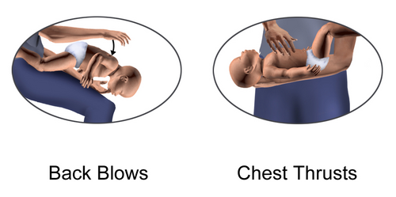
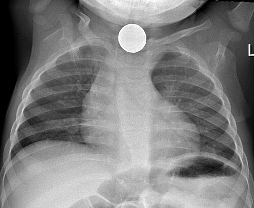

# CORPO ESTRANHO EM VIA AÉREA: ASPIRAÇÃO E DESOBSTRUÇÃO

A aspiração de corpo estranho (ACE) é aquele tema que separa o médico que apenas decorou protocolos do médico que realmente entende a urgência pediátrica. Nas provas de residência, ele é onipresente porque exige raciocínio rápido e diferenciação clara entre via aérea e via digestiva.

Por que as crianças são as vítimas preferenciais? Não é apenas "arte" da idade. Existe uma base fisiológica e anatômica: a curiosidade motora (fase oral) aliada à ausência de dentes molares para trituração eficaz e à imaturidade dos reflexos de deglutição e proteção da via aérea. O pico de incidência ocorre entre 1 e 3 anos de idade, e é aqui que as bancas concentram suas questões.

## Fisiopatologia e Anatomia: O Caminho do Objeto

*Figura 1 - Ilustração da manobra de desobstrução de vias aéreas em lactente (tapotagem + compressões torácicas). Procedimento essencial no engasgo pediátrico. Fonte: BruceBlaus, CC BY-SA 4.0 | Wikimedia Commons*

Quando uma criança aspira algo, o destino do objeto não é aleatório. Lembra das aulas de anatomia? O brônquio fonte direito é mais verticalizado, mais largo e mais curto que o esquerdo. Além disso, a carina (a bifurcação da traqueia) está ligeiramente à esquerda da linha média.

Resultado: a grande maioria dos corpos estranhos (cerca de 60% a 70%) vai parar no pulmão direito. Se a questão de prova descrever um quadro de sibilância unilateral à esquerda, desconfie, mas saiba que pode acontecer. Se for à direita, é o clássico.

### O Mecanismo de Válvula

O que acontece no pulmão após a aspiração depende do tamanho do objeto e do grau de obstrução. Temos três cenários principais que você precisa visualizar para entender o RX:

- **Obstrução Parcial (Válvula de Passagem):** O ar entra e sai, mas com dificuldade. Gera sibilo localizado.

- **Válvula de Retenção (Enfisema Obstrutivo):** O ar entra na inspiração (quando o brônquio expande), mas não consegue sair na expiração (quando o brônquio estreita). Isso causa hiperinsuflação do pulmão afetado. No RX, o pulmão parece "mais preto" e o mediastino é empurrado para o lado oposto.

- **Obstrução Total (Atelectasia):** O ar não entra nem sai. O ar que já estava lá é absorvido, e o pulmão murcha. No RX, vemos uma imagem radiopaca (branca) e o mediastino é puxado para o lado da lesão.

## Quadro Clínico: As Três Fases da Aspiração

*Figura 2 - Radiografia de tórax mostrando corpo estranho (moeda) em esôfago de criança (útil no diagnóstico diferencial). Fonte: Samir, CC BY 3.0 | Wikimedia Commons*

Muitos alunos erram questões porque acham que a criança chegará sempre em insuficiência respiratória aguda. Na vida real e nas provas mais bem elaboradas, a ACE é dividida em fases:

### Fase 1: O Evento Agudo (Episódio de Sufocação)

É o momento do engasgo. Tosse súbita, engasgo, cianose e estridor. Se o objeto for grande e ficar na laringe, a morte pode ser imediata. Se passar para os brônquios, a criança pode ter uma melhora aparente.

### Fase 2: O Período de Acalmia (O Grande Perigo)

Aqui mora a pegadinha. Após o susto inicial, os reflexos de tosse se cansam ou o objeto se acomoda. A criança pode ficar assintomática por horas ou dias. Se você der alta para esse paciente só porque ele "está bem agora", você pode estar assinando uma complicação grave. **Dica do Dr. Will:** História de engasgo súbito com objeto na boca é igual a investigação, mesmo que o exame físico atual esteja normal.

### Fase 3: Complicações

Se o diagnóstico não for feito, o corpo estranho causa inflamação, infecção e formação de tecido de granulação. A criança começa a ter pneumonias de repetição sempre no mesmo lobo ou asma que "não responde ao tratamento".

## Diagnóstico: O que pedir e o que procurar

O diagnóstico é essencialmente clínico. A história de "episódio de sufocação" tem um valor preditivo positivo altíssimo.

### Exame Físico

Procure a tríade clássica:

- Tosse.

- Sibilância localizada (unilateral).

- Diminuição do murmúrio vesicular unilateral.

Cuidado: se o objeto estiver na traqueia, o sibilo pode ser bilateral ou haver um "ruído de bandeira" (o objeto batendo nas paredes da traqueia durante a respiração).

### Radiografia de Tórax

O erro clássico é achar que o RX vai mostrar o objeto. A maioria dos corpos estranhos em pediatria são orgânicos (amendoim, feijão, milho) e, portanto, **radiolucentes** (não aparecem no RX). O que buscamos são os sinais indiretos.

| Achado Radiológico | Significado Clínico | Comportamento do Mediastino |
| --- | --- | --- |
| Hiperinsuflação Unilateral | Válvula de retenção (ar entra, não sai) | Desvio para o lado contralateral |
| Atelectasia | Obstrução total (pulmão murcho) | Desvio para o lado ipsilateral |
| Consolidação Localizada | Pneumonia secundária ao CE | Geralmente centralizado |
| Normal | Não exclui ACE (até 30% dos casos) | N/A |

Para flagrar o aprisionamento de ar, o ideal é o RX em expiração. Como o lactente não colabora, fazemos o **RX em decúbito lateral com raios horizontais**. O lado que está para baixo deveria "murchar" pela gravidade; se ele continuar insuflado, ali está o corpo estranho.

### Broncoscopia: O Padrão-Ouro

Segundo as diretrizes da SBP, a broncoscopia rígida é o procedimento de escolha tanto para o diagnóstico definitivo quanto para o tratamento (remoção).

**Atenção:** Se a suspeita clínica for alta, mesmo com RX normal, a broncoscopia deve ser realizada. No MedEvo, sempre reforçamos: a clínica soberana manda o paciente para a sala de exame.

## Manejo da Obstrução Aguda (OVACE)

Aqui entramos no protocolo do PALS/AHA e SBP. A conduta muda drasticamente conforme a idade e o estado de consciência.

### 1. Obstrução Leve (Tosse Eficaz)

A criança consegue tossir, falar ou chorar.

- **Conduta:** Apenas estimule a tosse. Não bata nas costas, não tente manobras. A intervenção pode transformar uma obstrução parcial em total.

### 2. Obstrução Grave (Tosse Ineficaz, Cianose, Incapacidade de Falar)

Aqui você precisa agir. A técnica depende da idade:

-

**Lactentes (menores de 1 ano):**

- Coloque o bebê de bruços no seu antebraço, inclinado para baixo.

- Aplique **5 golpes dorsais** (entre as escápulas) com a base da mão.

- Vire o bebê de frente, mantendo a cabeça mais baixa que o tronco.

- Aplique **5 compressões torácicas** (no mesmo local da massagem cardíaca).

- Repita o ciclo até o objeto sair ou o bebê desmaiar.

- *Por que não Heimlich?* Porque o fígado e o baço dos bebês são grandes e menos protegidos pelas costelas; a pressão abdominal pode causar ruptura de órgãos sólidos.

-

**Crianças (maiores de 1 ano):**

- **Manobra de Heimlich:** Abraçar a criança por trás, posicionar o punho fechado acima do umbigo (epigástrio) e realizar compressões rápidas para dentro e para cima (movimento em "J").

### 3. Vítima Inconsciente

Se a criança perder a consciência durante as manobras:

- Coloque-a em superfície rígida.

- Inicie a RCP (30 compressões para 2 ventilações se estiver sozinho, ou 15:2 se houver dois socorristas profissionais).

- **Diferença crucial:** Toda vez que for abrir a via aérea para ventilar, olhe a boca. Se vir o objeto, retire-o. **NUNCA faça varredura digital às cegas**, pois você pode empurrar o objeto para a subglote.

## Ingestão de Corpo Estranho: O Trato Digestivo

Embora o tema principal seja via aérea, as bancas adoram misturar com ingestão (esôfago e estômago). Você precisa saber diferenciar as urgências.

### Bateria de Botão (O Vilão Número 1)

Isso é uma emergência médica absoluta se estiver no esôfago. A bateria gera uma corrente elétrica que causa necrose por liquefação em menos de 2 horas. Pode perfurar o esôfago e causar fístula aorto-esofágica (fatal).

- **Sinal Radiológico:** Sinal do "duplo halo" ou "duplo contorno" no AP. No perfil, vemos um degrau.

- **Conduta:** Endoscopia Digestiva Alta (EDA) de emergência (imediata).

### Moedas

São os objetos mais comuns. No RX, a moeda no esôfago aparece de frente (disco) na incidência AP, pois o esôfago é achatado no sentido anteroposterior. Se estiver na traqueia, ela aparece de lado no AP (fina).

- **Conduta:** Se estiver no esôfago e a criança estiver sintomática (sialorreia, dor) -> EDA urgente. Se assintomática, pode-se observar por até 24h para ver se migra para o estômago. Se já estiver no estômago e for assintomática, conduta expectante (geralmente passa em 2-4 semanas).

### Objetos Pontiagudos (Pregos, Alfinetes)

- **No esôfago ou estômago:** Remoção por EDA urgente. O risco de perfuração é alto antes de passar pelo piloro.

- **Abaixo do duodeno:** Se assintomático, acompanhamento com RX diário e observação de sinais de peritonite.

### Ímãs

Um ímã sozinho não costuma ser problema. Dois ou mais ímãs (ou um ímã + um objeto metálico) são perigosíssimos. Eles podem se atrair através de alças intestinais diferentes, causando isquemia, necrose e perfuração.

- **Conduta:** Remoção urgente se estiverem ao alcance da endoscopia.

## Diagnóstico Diferencial: Não confunda!

Muitas vezes a questão vai te dar um quadro de estridor ou sibilância e você terá que decidir entre CE e outras patologias.

| Patologia | Início | Febre | Características |
| --- | --- | --- | --- |
| **Corpo Estranho** | Súbito | Não (inicialmente) | História de engasgo, sibilância unilateral. |
| **Laringotraqueobronquite (Crupe)** | Gradual | Sim (baixa) | Tosse ladrante, estridor, pródromos virais. |
| **Epiglotite** | Rápido | Sim (alta) | Toxemia, sialorreia, posição de tripé. |
| **Asma** | Variável | Não | Sibilância bilateral, história de atopia. |
| **Anafilaxia** | Súbito | Não | Urticária, angioedema, exposição a alérgeno. |

**Exemplo Clínico Rápido:** Lactente de 10 meses, previamente hígido, apresenta subitamente estridor inspiratório e cianose enquanto brincava no chão. Sem febre. Qual a conduta?
*Resposta:* Manobras de desobstrução para lactentes (5 golpes + 5 compressões). Não é crupe (início súbito) e não é epiglotite (falta febre e toxemia).

## Tabelas Comparativas para Memorização

### Tabela 1: Manobras de Desobstrução (OVACE Grave)

| Idade | Manobra Principal | O que NÃO fazer |
| --- | --- | --- |
| **Lactente (< 1 ano)** | 5 golpes dorsais + 5 compressões torácicas | Manobra de Heimlich / Varredura às cegas |
| **Criança (> 1 ano)** | Manobra de Heimlich (compressões abdominais) | Golpes dorsais isolados (se houver alternativa) |
| **Inconsciente (qualquer idade)** | RCP (ênfase em compressões) | Tentar retirar objeto sem visualizar |

### Tabela 2: Localização da Moeda vs. Bateria no RX

| Objeto | Incidência AP | Incidência Perfil | Conduta (Esôfago) |
| --- | --- | --- | --- |
| **Moeda** | Disco circular (frente) | Linha fina | EDA se sintomático ou >24h |
| **Bateria** | Duplo halo (contorno duplo) | Degrau lateral | EDA de Emergência (< 2h) |

## Situações Especiais e Complicações

### O Objeto "Esquecido"

Às vezes, a criança aspira um pequeno pedaço de plástico que não causa obstrução total. Ela pode chegar ao consultório meses depois com:

- Pneumonia que "não cura" ou recorre no mesmo lobo.

- Abscesso pulmonar.

- Bronquiectasias localizadas.

- Hemoptise (rara, mas possível por erosão de mucosa).

Sempre que uma pneumonia for atípica ou localizada sempre no mesmo lugar, a broncoscopia diagnóstica deve ser considerada.

### O Uso de Corticoides e Adrenalina

Na ACE, a adrenalina nebulizada e os corticoides têm papel limitado. Eles podem ser usados **após** a retirada do corpo estranho se houver muito edema glótico ou subglótico pós-procedimento, mas nunca devem atrasar a remoção do objeto.

## Pontos-Chave para Prova

- **Pico de incidência:** 1 a 3 anos (fase oral + imaturidade motora).

- **Localização mais comum:** Brônquio fonte direito (anatomia mais vertical).

- **Tríade clássica:** Tosse, sibilância unilateral e diminuição do murmúrio vesicular.

- **RX Normal:** Não exclui o diagnóstico em até 30% dos casos.

- **Sinal indireto no RX:** Hiperinsuflação (enfisema obstrutivo) é o mais comum.

- **Lactente consciente engasgado:** 5 golpes nas costas + 5 compressões torácicas.

- **Criança consciente engasgada:** Manobra de Heimlich.

- **Vítima inconsciente:** Iniciar RCP. Só retire o objeto se for visível.

- **Bateria no esôfago:** Emergência absoluta. Sinal do duplo halo. Remoção imediata.

- **Moeda no esôfago:** Pode-se aguardar até 24h se assintomático. No estômago, conduta expectante.

- **Objetos pontiagudos:** EDA urgente se estiverem no esôfago ou estômago.

- **Sialorreia súbita:** Sugere obstrução esofágica completa (incapacidade de engolir saliva).

- **Broncoscopia rígida:** É o padrão-ouro para diagnóstico e tratamento da aspiração.

- **O que NÃO fazer:** Varredura digital às cegas ou manobra de Heimlich em menores de 1 ano.

- **Pérola do Dr. Will:** Se a questão fala em "sibilo que não melhora com broncodilatador" em uma criança pequena, pense sempre em corpo estranho.

- **Uva e Salsicha:** São os alimentos mais perigosos por moldarem perfeitamente a via aérea, causando obstrução total. 💡

Este guia cobre o que há de mais cobrado nas provas de residência e títulos de especialista. Lembre-se: na dúvida entre o que o livro diz e o que a segurança do paciente exige, a história clínica de engasgo sempre manda investigar.

 Cópia offline para consulta pessoal.
 Fonte original:
 [https://www.medevo.com.br/material-apoio/ler/3f4fe39a-ed84-41af-a01b-b4a816ebd356](https://www.medevo.com.br/material-apoio/ler/3f4fe39a-ed84-41af-a01b-b4a816ebd356)
