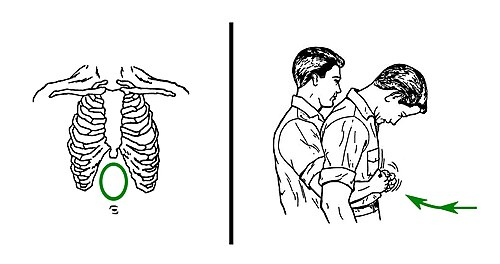
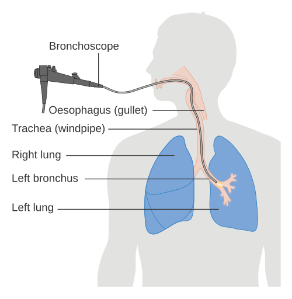

# CORPOS ESTRANHOS EM VIAS AÉREAS

A aspiração de corpo estranho é uma daquelas situações que separa o médico que apenas decorou protocolos do médico que realmente entende a fisiologia e a urgência da cena. Nas provas de residência, o tema é recorrente porque exige do candidato uma capacidade rápida de triagem: quem precisa de intervenção imediata e quem pode aguardar um exame subsidiário?

Para entender este tema, precisamos primeiro olhar para a anatomia e a epidemiologia. A grande maioria dos casos ocorre em crianças, especificamente entre 1 e 3 anos de idade. Por que essa faixa etária? Primeiro, pela curiosidade natural de explorar o mundo com a boca. Segundo, pela ausência dos dentes molares, o que impede a trituração adequada de alimentos sólidos, como amendoins e sementes. Terceiro, pela imaturidade dos reflexos de proteção da glote.

No adulto, a história muda. Geralmente está associada a distúrbios de deglutição, quadros neurológicos, intoxicação alcoólica ou procedimentos odontológicos. Guarde isso: se a questão trouxer um idoso com quadro súbito de tosse, pense em próteses dentárias ou alimentos mal mastigados.

## Fisiopatologia: O Mecanismo da Obstrução

*Figura 1 - Manobra de compressões abdominais (Heimlich) para desobstrução de vias aéreas em adultos, mostrando o ponto de aplicação da força. Fonte: US Army Medical Department, Domínio Público | Wikimedia Commons*

Quando um objeto entra na via aérea, o corpo reage imediatamente com o reflexo da tosse. O destino do objeto depende do seu tamanho e da anatomia. No adulto, o brônquio fonte direito é mais verticalizado, mais largo e mais curto que o esquerdo, o que o torna o destino preferencial de quase tudo que passa pela traqueia. Na criança pequena, essa diferença anatômica é menos pronunciada, mas o lado direito ainda leva uma ligeira vantagem estatística nas questões de prova.

O que acontece após a impactação depende do tipo de obstrução que o objeto causa. Podemos dividir didaticamente em três mecanismos, e entender isso vai te ajudar a interpretar qualquer radiografia de tórax:

- **Mecanismo de Passagem Livre (Bypass Valve):** O objeto está lá, mas o ar consegue entrar e sair. O paciente terá sintomas irritativos (tosse), mas a ventilação está preservada.

- **Mecanismo de Válvula de Retenção (Check Valve):** Este é o mais comum e o preferido das bancas. O objeto permite a entrada do ar durante a inspiração (quando a via aérea se expande), mas bloqueia a saída durante a expiração (quando a via aérea se estreita). O resultado? Hiperinsuflação obstrutiva. O pulmão afetado fica "preso" em inspiração.

- **Mecanismo de Obstrução Total (Stop Valve):** O ar não entra nem sai. O ar que já estava no pulmão é absorvido pela circulação, e o segmento pulmonar colapsa. O resultado é a atelectasia.

A gravidade clínica é diretamente proporcional ao nível da obstrução. Um objeto na laringe representa risco iminente de asfixia; um objeto em um brônquio segmentar pode passar despercebido por semanas.

## Quadro Clínico e a Tríade Clássica

O diagnóstico começa com uma história clínica sugestiva. Em mais de 80% dos casos, há um episódio de engasgo súbito seguido de tosse paroxística. Quando esse episódio é relatado, deve ser valorizado mesmo que a criança chegue ao pronto-socorro parecendo bem.

Aqui entra o conceito do **Período de Latência**. Após o susto inicial e a tosse, o objeto pode se acomodar na via aérea, os receptores de tosse se fadigam e a criança entra em uma fase assintomática que pode durar horas ou dias. É aqui que muitos médicos erram e dão alta para o paciente, que retornará dias depois com uma "pneumonia que não melhora".

A tríade clássica da aspiração de corpo estranho bronquial é composta por:

- Tosse súbita.

- Sibilos localizados.

- Diminuição do murmúrio vesicular unilateral.

Sibilo unilateral deve afastar a interpretação automática de asma. Asma é uma doença sistêmica das vias aéreas e costuma sibilar bilateralmente. Sibilo unilateral em criança é corpo estranho até que se prove o contrário.

### O Valor do Estridor

Um ponto clínico fundamental: estridor indica obstrução de via aérea superior, especialmente laringe ou traqueia alta. O estridor é um som inspiratório, agudo, que indica que o laringoespasmo ou a obstrução física está impedindo a entrada de ar.

Diferença fundamental para a prova:

- **Estridor:** Obstrução alta (acima da glote ou traqueia).

- **Sibilo:** Obstrução baixa (brônquios).

## Avaliação Diagnóstica: Além do Óbvio

O diagnóstico é eminentemente clínico, mas os exames de imagem ajudam a localizar o objeto e avaliar as complicações. No entanto, lembre-se: a maioria dos corpos estranhos aspirados por crianças são orgânicos (amendoim, feijão, milho) e, portanto, **radiolucentes**. O objeto geralmente não será visível no raio-X; os sinais indiretos tornam-se a pista principal.

### Radiografia de Tórax

Para aumentar a sensibilidade do raio-X, não peça apenas a incidência em AP. O segredo está na dinâmica respiratória.

- **Radiografia em Expiração:** Como explicamos no mecanismo de válvula, o ar entra mas não sai. Na expiração, o pulmão normal esvazia e o diafragma sobe. O pulmão com o corpo estranho permanece insuflado e o diafragma fica rebaixado. Isso causa um desvio do mediastino para o lado saudável durante a expiração.

- **Decúbito Lateral (Raio-X com raios horizontais):** Em crianças pequenas que não colaboram com o comando de "solte o ar", deitamos a criança de lado. O pulmão que está "para baixo" deveria ficar menos insuflado pelo peso do mediastino. Se ele continuar insuflado, há aprisionamento aéreo ali.

| Achado Radiológico | Significado Fisiopatológico |
| --- | --- |
| Hiperinsuflação Unilateral | Mecanismo de válvula (ar entra, mas não sai) |
| Atelectasia | Obstrução total do brônquio |
| Desvio do Mediastino | Diferença de pressão entre os hemitórax |
| Consolidação | Pneumonia secundária (quadros crônicos) |

Se a radiografia estiver normal, mas a história clínica for muito sugestiva, a conduta ainda é a investigação endoscópica. Nunca ignore uma história de engasgo súbito baseando-se apenas em um raio-X normal.

## Manejo de Urgência: Conduta Atual no Desengasgo

A conduta depende de três perguntas: a obstrução é parcial ou grave? O paciente está responsivo? Qual é a idade/biotipo?

Obstrução por corpo estranho: decisão inicial

1. Tosse eficaz, fala ou choro preservado
 → não realizar manobras; estimular tosse, observar e preparar avaliação se sintomas persistirem

2. Tosse ineficaz, incapaz de falar/chorar, cianose ou exaustão
 → acionar emergência e iniciar manobras de desobstrução

3. Lactente menor de 1 ano responsivo
 → 5 golpes dorsais entre as escápulas + 5 compressões torácicas, em ciclos

4. Criança maior de 1 ano/adulto responsivo
 → compressões abdominais; em protocolos de primeiros socorros, podem ser alternadas com golpes dorsais

5. Gestante avançada ou pessoa com obesidade importante
 → compressões torácicas em vez de compressões abdominais

6. Inconsciente ou parada cardiorrespiratória
 → iniciar RCP, abrir via aérea para ventilar e retirar apenas objeto claramente visível

### Obstrução Parcial: tosse eficaz, fala ou choro preservado

Se o paciente mantém tosse efetiva, fala, chora ou consegue respirar, a melhor conduta inicial é **não realizar manobras de desobstrução**. A tosse é o mecanismo mais eficiente para expelir o objeto. Intervenção precoce pode transformar obstrução parcial em total ou deslocar o corpo estranho para posição mais perigosa. O paciente deve ser observado, receber oxigênio se necessário e ser encaminhado para avaliação endoscópica quando houver suspeita persistente.

### Obstrução Grave: tosse ineficaz, incapacidade de falar ou cianose

Na obstrução grave, o tempo é determinante. A conduta varia conforme idade e responsividade:

- **Lactentes menores de 1 ano, responsivos:** realizar 5 golpes dorsais firmes entre as escápulas, com o lactente em posição inclinada para baixo, seguidos de 5 compressões torácicas no terço inferior do esterno. Repetir ciclos até expulsão do objeto ou perda de consciência. Compressões abdominais são contraindicadas em lactentes pelo risco de lesão visceral.

- **Crianças maiores de 1 ano e adultos, responsivos:** realizar compressões abdominais subdiafragmáticas, direcionadas para dentro e para cima. Protocolos de primeiros socorros também aceitam alternar golpes dorsais e compressões abdominais quando a obstrução persiste.

- **Gestantes avançadas ou pessoas com obesidade importante:** preferir compressões torácicas, pois as compressões abdominais podem ser ineficazes ou inseguras.

- **Paciente inconsciente:** iniciar reanimação cardiopulmonar. Ao abrir a via aérea para ventilar, inspecionar a cavidade oral e retirar apenas objeto visível e facilmente alcançável. Varredura digital às cegas é contraindicada, pois pode impactar o objeto mais profundamente.

## O Padrão-Ouro: Broncoscopia

*Figura 2 - Diagrama ilustrando o procedimento de broncoscopia para visualização e remoção de corpos estranhos nas vias aéreas. Fonte: Cancer Research UK, CC BY-SA 4.0 | Wikimedia Commons*

Uma vez estabilizado o paciente ou confirmada a suspeita, o tratamento definitivo é a remoção por broncoscopia.

Existem dois tipos principais, com indicações diferentes:

- **Broncoscopia Rígida:** É o padrão-ouro para a retirada de corpo estranho. Por que? Porque ela oferece um canal de trabalho maior, permite a passagem de pinças robustas e, o mais importante, garante o controle da via aérea e a ventilação do paciente durante o procedimento. É realizada sob anestesia geral.

- **Broncoscopia Flexível:** Tem um papel mais diagnóstico. É excelente para visualizar vias aéreas distais onde o tubo rígido não chega, mas é limitada para a retirada de objetos grandes ou pesados. Pode ser usada em casos de dúvida diagnóstica ou quando o objeto é muito pequeno e periférico.

## Corpos Estranhos Esofágicos: O "Vizinho" Perigoso

Embora o tema principal seja via aérea, as bancas adoram misturar com corpos estranhos no esôfago, pois os sintomas podem se sobrepor. Um corpo estranho grande no esôfago pode comprimir a traqueia (que é mole na criança) e causar estridor e desconforto respiratório.

### O Caso Crítico da Bateria de Lítio (Botão)

A ingestão de bateria de botão impactada no esôfago é uma das emergências pediátricas mais importantes. A conduta é **endoscopia digestiva alta de urgência, idealmente em menos de 2 horas**.

Por que tanta pressa? A bateria em contato com a mucosa úmida do esôfago fecha um circuito elétrico. Isso gera a formação de hidróxido de sódio (soda cáustica) na interface do polo negativo, levando a uma necrose de liquefação rápida. Em poucas horas, pode ocorrer perfuração esofágica, fístula traqueoesofágica ou até erosão da artéria aorta (fatal).

**Ponto de atenção:** Como diferenciar uma moeda de uma bateria no raio-X?

- **Moeda:** Imagem radiopaca homogênea. No perfil, é fina.

- **Bateria:** No AP, apresenta o sinal do "duplo contorno" ou "halo". No perfil, apresenta o sinal do "degrau" (um lado é ligeiramente diferente do outro).

| Objeto no Esôfago | Conduta |
| --- | --- |
| Bateria de Botão | Remoção imediata (< 2h) |
| Objeto Pontiagudo | Remoção urgente (risco de perfuração) |
| Moeda (Assintomático) | Pode-se observar por 24h (muitas passam sozinhas) |
| Moeda (Sintomático) | Remoção imediata |

## Complicações e Diagnósticos Diferenciais

Quando o diagnóstico de aspiração de corpo estranho é tardio, o cenário clínico muda. O paciente pode apresentar:

- Pneumonias de repetição no mesmo lobo.

- Abscesso pulmonar.

- Bronquiectasias localizadas.

- Fístulas.

O principal diagnóstico diferencial em crianças é a **Asma**. A diferença é que a asma costuma ter pródromos virais, história familiar de atopia, resposta a broncodilatadores e sibilos difusos. Outro diferencial importante é a **Laringotraqueobronquite (Crupe)**, mas esta apresenta a clássica tosse metálica ("ladrante") e febre, o que não ocorre inicialmente no corpo estranho.

A ausência de febre no início de um quadro de desconforto respiratório súbito é um forte marcador clínico de corpo estranho, especialmente quando há engasgo testemunhado, tosse abrupta, estridor ou sibilo unilateral.

## Situações Especiais e Erros Comuns

### O Idoso e a Aspiração Silenciosa

Em pacientes com sequelas de AVC ou doenças neurodegenerativas (como Parkinson ou Alzheimer), a aspiração pode ser crônica e silenciosa. O paciente não faz o quadro de engasgo súbito porque o reflexo de tosse está diminuído. Nesses casos, o diagnóstico costuma vir após uma pneumonia aspirativa que não responde bem aos antibióticos habituais.

### O erro da varredura digital às cegas

A varredura digital às cegas é contraindicada. Se o objeto não está claramente visível e facilmente alcançável, a tentativa de removê-lo com o dedo pode empurrá-lo da orofaringe para a laringe, transformando uma obstrução parcial em total. A retirada manual só deve ocorrer quando o corpo estranho estiver visível e solto.

### O Uso de Corticoides e Antibióticos

Não há indicação de antibióticos de rotina logo após a retirada de um corpo estranho, a menos que haja sinais claros de infecção secundária (pus na via aérea, febre, infiltrado radiológico). O corticoide pode ser usado para reduzir o edema de mucosa causado pelo objeto ou pelo trauma da retirada, mas a prioridade é sempre a remoção mecânica.

## Resumo do Fluxo de Atendimento

Ao receber um paciente com suspeita de corpo estranho em via aérea, a sequência segura é:

- **Estabilidade clínica:** verificar se há tosse eficaz, fala/choro, ventilação adequada ou sinais de obstrução grave.

- Tosse eficaz: não realizar manobras; observar, oferecer oxigênio se necessário e organizar avaliação.

- Obstrução grave em responsivo: iniciar manobras conforme idade e biotipo.

- Inconsciência: iniciar RCP e remover apenas objeto visível.

- **Exame físico:** pesquisar estridor, disfonia, cianose, sibilo unilateral, assimetria de murmúrio vesicular e sinais de exaustão.

- **Imagem:** radiografia de tórax inspiratória/expiratória ou decúbito lateral quando útil; buscar hiperinsuflação, atelectasia ou objeto radiopaco.

- **Definição terapêutica:** broncoscopia rígida é o procedimento de escolha para retirada de corpo estranho em via aérea quando há suspeita persistente ou confirmação.

A seguir, a comparação entre os locais de impactação.

### Tabela Comparativa: Local de Impactação vs. Clínica

| Local | Sintoma Predominante | Gravidade |
| --- | --- | --- |
| Laringe | Estridor, disfonia, tosse crupal, cianose rápida | Altíssima (Risco de asfixia total) |
| Traqueia | Estridor inspiratório e expiratório, "estalo audível" | Alta (Pode ocluir os dois brônquios) |
| Brônquio Fonte | Sibilo unilateral, diminuição do MV, tosse | Moderada (Geralmente permite ventilação contralateral) |

O "estalo audível" (audible slap) e o "palpável" (palpable thud) são sinais clássicos de corpo estranho móvel na traqueia. O objeto sobe e bate na glote durante a expiração ou tosse. Quando esses sinais aparecem no enunciado, a localização traqueal deve ser fortemente considerada.

## Síntese Clínica

- **Estridor na ausculta:** É o sinal mestre de obstrução de via aérea superior. Não confunda com sibilo.

- **Corpo estranho esofágico (Bateria):** Emergência absoluta. EDA em < 2 horas pelo risco de necrose por liquefação e perfuração.

- **Tríade Clássica:** Tosse súbita, sibilos localizados e murmúrio vesicular diminuído unilateralmente.

- **Raio-X Normal:** Não exclui o diagnóstico. Se a história é positiva, a broncoscopia é mandatória.

- **Sinal Radiológico mais comum:** Hiperinsuflação localizada (devido ao mecanismo de válvula de retenção).

- **Broncoscopia Rígida:** É o padrão-ouro para remoção, pois permite ventilar o paciente e usar pinças maiores.

- **Compressões abdominais:** indicadas para obstrução grave em crianças maiores de 1 ano e adultos responsivos; podem ser alternadas com golpes dorsais em protocolos de primeiros socorros.

- **Lactentes menores de 1 ano:** 5 golpes dorsais + 5 compressões torácicas; não realizar compressões abdominais.

- **Varredura digital às cegas:** contraindicada; retirar manualmente apenas objeto visível e facilmente alcançável.

- **Local mais comum no adulto:** Brônquio fonte direito (devido à anatomia mais verticalizada).

- **Período de Latência:** Fase assintomática que ocorre após o engasgo inicial. É a armadilha que leva ao diagnóstico tardio.

- **Sibilo Unilateral:** Em pediatria, é corpo estranho até que se prove o contrário. Esqueça a asma se o sibilo não for bilateral.

- **Objeto Orgânico:** Geralmente radiolucente. O amendoim é o grande vilão das provas.

- **Complicação Tardia:** Pneumonia de repetição sempre no mesmo segmento pulmonar.

- **Moeda no Esôfago:** Se assintomática, pode-se aguardar 24h. Se na traqueia, remoção imediata.

- **Sinal do Duplo Contorno:** Patognomônico de bateria de botão no raio-X em AP.

Na suspeita de corpo estranho, a história clínica vale mais do que qualquer exame sofisticado. Engasgo testemunhado, tosse súbita ou sibilo unilateral devem ser valorizados e investigados até o fim.

 Cópia offline para consulta pessoal.
 Fonte original:
 [https://www.medevo.com.br/material-apoio/ler/c0589640-8476-4837-bf17-4cd93be3fd8d](https://www.medevo.com.br/material-apoio/ler/c0589640-8476-4837-bf17-4cd93be3fd8d)
