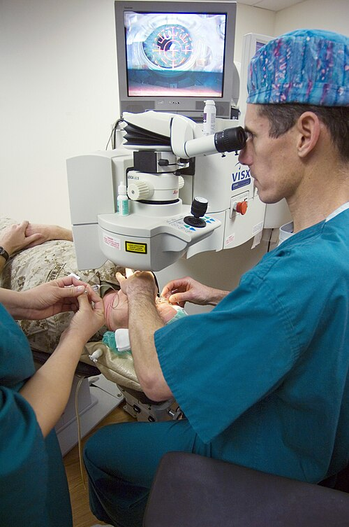

# CORREÇÃO VISUAL E CIRURGIA REFRATIVA

Para entender a cirurgia refrativa, você precisa primeiro dominar a óptica básica do olho humano. Pense no olho como uma câmera fotográfica: temos um conjunto de lentes (córnea e cristalino) que deve focar a luz exatamente sobre um filme (retina). Quando esse foco não cai na retina, temos uma ametropia.

O conceito fundamental aqui é a emmetropia. Um olho emmetrope é aquele que, em repouso (sem usar a acomodação), consegue focar raios paralelos vindos do infinito exatamente na retina. Se o foco cai antes, depois ou em múltiplos pontos, entramos no terreno das questões de prova.

## Ametropias: O Porquê do Desfoco

*Figura 1 - Diagrama ilustrando a miopia (foco formado antes da retina) e sua correção com lente divergente. A lente desloca o foco para a posição correta na retina. Fonte: Gumenyuk I.S., CC BY-SA 4.0 | Wikimedia Commons*

Antes de falarmos em laser, precisamos entender o que estamos corrigindo. As ametropias são divididas basicamente em quatro tipos, e as bancas adoram cobrar a fisiopatologia de cada uma.

### Miopia

Na miopia, o sistema óptico é "forte demais" para o comprimento do olho. O foco da imagem se forma antes da retina. Por que isso acontece? Ou o olho é muito longo (miopia axial, a mais comum) ou a córnea/cristalino têm uma curvatura excessiva (miopia de curvatura).

O paciente míope enxerga mal de longe, mas costuma ter uma visão de perto excelente. Um erro comum de alunos em prova é esquecer que o míope "usa" menos a acomodação para perto. Se ele for um míope de -3,00 dioptrias, o ponto remoto dele está a exatos 33 centímetros. Ele lê sem esforço algum nessa distância.

### Hipermetropia

Aqui o problema é o inverso: o olho é "curto" ou as lentes são "fracas". O foco se formaria, teoricamente, atrás da retina. O hipermetrope vive em um esforço constante. Para enxergar de longe, ele precisa usar o músculo ciliar para aumentar o poder do cristalino (acomodação). Para enxergar de perto, ele precisa de ainda mais esforço.

Cuidado com a pegadinha: nem todo hipermetrope tem visão ruim. Jovens com baixa hipermetropia conseguem compensar o grau totalmente através da acomodação. É por isso que, na residência, você aprenderá que o exame de refração em crianças e jovens deve ser feito SEMPRE sob cicloplegia (paralisia da acomodação). Sem o colírio, você vai prescrever o grau errado.

### Astigmatismmo

No astigmatismo, a córnea não é uma esfera perfeita (como uma bola de futebol), mas sim asférica (como uma bola de rúgbi). Isso significa que ela tem raios de curvatura diferentes em meridianos diferentes. O resultado? A luz não forma um ponto de foco, mas duas linhas focais.

O paciente com astigmatismo reclama de visão borrada para todas as distâncias e, frequentemente, de cefaleia e cansaço visual (astenopia), pois o cérebro tenta, sem sucesso, encontrar um ponto de foco nítido.

### Presbiopia

Não é uma ametropia no sentido estrito de formato do olho, mas sim uma perda fisiológica da amplitude de acomodação. Conforme envelhecemos, o cristalino endurece e o músculo ciliar perde eficiência. Segundo o Conselho Brasileiro de Oftalmologia (CBO), isso começa a se manifestar clinicamente por volta dos 40 a 45 anos.

**Tabela 1: Comparativo das Ametropias Principais**

| Ametropia | Ponto de Foco | Tipo de Lente de Correção | Principal Sintoma |
| --- | --- | --- | --- |
| Miopia | Antes da retina | Divergente (Negativa / Côncava) | Baixa acuidade visual de longe |
| Hipermetropia | Atrás da retina | Convergente (Positiva / Convexa) | Astenopia (cansaço) e visão borrada de perto |
| Astigmatismo | Dois pontos/linhas | Cilíndrica | Visão borrada para todas as distâncias |
| Presbiopia | Dificuldade de foco perto | Adição Positiva (Multifocal) | "Braço curto" para leitura após os 40 anos |

## Meios de Correção: Óculos e Lentes de Contato

Antes de indicar uma cirurgia, o padrão ouro é a correção óptica. Como o Dr. Will sempre reforça nas discussões do MedEvo, a cirurgia refrativa é um procedimento eletivo de conveniência, não uma urgência médica.

As lentes de óculos corrigem a visão alterando a ver gência dos raios de luz antes que eles atinjam a córnea. Já as lentes de contato (LC) ficam em contato direto com o filme lacrimal. Isso traz uma vantagem óptica enorme, especialmente em graus altos.

Por que um míope de -10,00 enxerga melhor de lente de contato do que de óculos? Por causa da distância vértice. O óculos fica a cerca de 12mm do olho, o que causa uma minificação da imagem. A lente de contato elimina essa distância, proporcionando uma imagem de tamanho mais real e um campo visual periférico muito melhor.

### Indicações e Contraindicações de Lentes de Contato

As LC são excelentes, mas não são para todos. As contraindicações absolutas incluem:

- Infecções oculares ativas (ceratites, conjuntivites).

- Olho seco grave (ceratoconjuntivite sicca severa).

- Doenças da superfície ocular que impeçam a oxigenação da córnea.

Um erro clássico em provas é achar que o ceratocone contraindica lente de contato. Pelo contrário! As lentes rígidas gás-permeáveis (RGP) são, muitas vezes, a única forma de dar visão de qualidade para esses pacientes, pois criam uma nova superfície refrativa regular sobre a córnea irregular.

## Cirurgia Refrativa: O Coração da Prova

Aqui é onde a maioria dos alunos se perde. A cirurgia refrativa moderna é baseada, majoritariamente, no Excimer Laser, que realiza a fotoablação do tecido corneano. Em termos simples: o laser "escava" a córnea para mudar sua curvatura.

Se o paciente é míope (córnea muito curva), o laser aplaina o centro. Se é hipermetrope (córnea muito plana), o laser remove tecido da periferia para deixar o centro mais curvo.

### Avaliação Pré-Operatória: O Filtro de Segurança

Você não opera quem quer, você opera quem pode. A segurança da cirurgia refrativa depende de três pilares: estabilidade do grau, espessura da córnea e curvatura da córnea.

- **Estabilidade Refrativa:** O grau deve estar estável por pelo menos 1 a 2 anos. Operar um jovem de 18 anos cujo grau ainda está aumentando é garantia de insucesso e reoperação em breve.

- **Paquimetria (Espessura):** A córnea precisa ter espessura suficiente para que o laser remova tecido e ainda sobre uma margem de segurança (leito residual).

- **Topografia/Tomografia (Curvatura):** Precisamos descartar o ceratocone subclínico. Se você opera uma córnea que já é instável, você causa uma ectasia iatrogênica (a córnea "abaula" para frente, causando perda de visão grave).

### Técnicas Cirúrgicas: PRK vs. LASIK

*Figura 2 - Procedimento de cirurgia LASIK, mostrando o alinhamento do laser sobre o olho do paciente. O procedimento em si dura segundos, proporcionando recuperação visual rápida. Fonte: U.S. Navy, Domínio Público | Wikimedia Commons*

Esta é a comparação preferida das bancas. Entenda a diferença mecânica e você nunca mais errará.

**PRK (Ceratectomia Fotorrefrativa):**
Nesta técnica, o cirurgião remove o epitélio (a camada mais superficial da córnea) e aplica o laser diretamente sobre o estroma superficial.

- **Vantagem:** Não há criação de um "flap" (retalho). É mais segura para pacientes com córneas mais finas ou que praticam esportes de contato (lutas, futebol), pois não há risco de deslocamento do flap no futuro.

- **Desvantagem:** O pós-operatório é doloroso (o epitélio precisa crescer de novo) e a recuperação visual é lenta (de 7 a 15 dias).

**LASIK (Laser-assisted in situ Keratomileusis):**
Aqui, criamos um flap (um disco fino de tecido corneano) usando um microcerátomo (lâmina) ou um laser de femtosegundo. Levantamos esse flap, aplicamos o laser no estroma e voltamos o flap para o lugar.

- **Vantagem:** Recuperação indolor e visão nítida já no dia seguinte. É o "efeito uau" da oftalmologia.

- **Desvantagem:** Risco de complicações relacionadas ao flap (deslocamento, estrias, ceratite lamelar difusa) e maior enfraquecimento da estrutura corneana.

**Tabela 2: PRK vs. LASIK**

| Característica | PRK (Surface Ablation) | LASIK (Lamellar Surgery) |
| --- | --- | --- |
| Manejo do Epitélio | Removido e descartado | Preservado no "flap" |
| Dor Pós-operatória | Moderada a intensa (3-4 dias) | Mínima ou ausente |
| Recuperação Visual | Lenta (semanas) | Rápida (24-48 horas) |
| Risco de Ectasia | Menor | Maior |
| Complicação Típica | Haze (opacidade cicatricial) | Complicações do Flap / Olho Seco |

### SMILE: A Terceira Via

O SMILE (Small Incision Lenticule Extraction) é a técnica mais recente. Em vez de queimar o tecido com Excimer Laser, um laser de femtosegundo esculpe uma "lentícula" dentro da córnea, que é retirada por uma microincisão de 2mm. É menos invasivo que o LASIK e preserva melhor a inervação corneana, reduzindo o risco de olho seco.

## Contraindicações Absolutas e Relativas

Memorize isso. As bancas amam colocar um caso clínico de um paciente que "quer muito operar", mas tem uma dessas condições.

**Contraindicações Absolutas:**

- **Ceratocone ou Ectasias Corneanas:** Operar um ceratocone com laser é erro médico grave.

- **Espessura Corneana Insuficiente:** Se o leito residual estromal (o que sobra de córnea após o laser) for menor que 250-300 micras, o risco de ectasia é altíssimo.

- **Doenças Autoimunes Ativas:** Lúpus, Artrite Reumatóide ou Poliarterite Nodosa podem causar derretimento corneano (melting) após o laser.

- **Expectativas Irreais:** O paciente que acha que nunca mais usará óculos para nada na vida, mesmo após os 50 anos (esquecendo a presbiopia).

- **Herpes Ocular Ativo:** O laser pode reativar o vírus.

**Contraindicações Relativas:**

- **Diabetes Descompensado:** Altera a cicatrização e a refração (a glicemia alta muda o índice de refração do cristalino).

- **Glaucoma:** O aumento da pressão intraocular durante o LASIK (pelo anel de sucção) pode ser perigoso, e os corticoides do pós-operatório podem elevar a pressão.

- **Gestação e Lactação:** As alterações hormonais mudam a curvatura da córnea e a estabilidade do grau. Deve-se esperar pelo menos 3 a 6 meses após o término da amamentação.

## Complicações: O que pode dar errado?

Nenhuma cirurgia é isenta de riscos. No pós-operatório da refrativa, você deve estar atento a:

- **Olho Seco:** A complicação mais comum. O corte dos nervos corneanos (especialmente no LASIK) interrompe o arco reflexo da produção de lágrima.

- **Haze:** Uma opacidade cicatricial que ocorre no PRK. Por isso, usamos Mitomicina C (um antimetabólito) durante a cirurgia de PRK em graus mais altos para prevenir essa fibrose.

- **Ceratite Lamelar Difusa (DLK):** Também chamada de "Areias do Saara". É uma inflamação estéril que ocorre na interface do flap do LASIK. O tratamento é com corticoides tópicos intensivos.

- **Ectasia Iatrogênica:** A complicação mais temida. A córnea perde sua rigidez estrutural e começa a deformar. O tratamento pode envolver Crosslinking (para endurecer a córnea) ou anéis intracorneanos.

## Lentes Intraoculares (LIOs) Fácicas

E se o paciente tem 12 graus de miopia e uma córnea fina? O laser não é seguro. Nesses casos, usamos as Lentes Fácicas (como a ICL).
Diferente da cirurgia de catarata, aqui não removemos o cristalino natural. A lente é implantada dentro do olho, na frente ou atrás da íris, mantendo a capacidade de acomodação do paciente. É uma excelente opção para altas ametropias, desde que o paciente tenha profundidade de câmara anterior suficiente (medida pelo exame de Pentacam ou ultrassonografia).

## Cirurgia de Cristalino com Finalidade Refrativa

Em pacientes mais velhos (geralmente acima de 50-55 anos) que já apresentam presbiopia e sinais iniciais de catarata, a melhor opção pode ser a substituição do cristalino por uma Lente Intraocular Multifocal ou de Foco Estendido (EDOF).
Neste cenário, tratamos o grau de longe e de perto simultaneamente. É importante explicar ao paciente que ele perderá a acomodação natural, mas ganhará uma visão funcional para ambas as distâncias sem depender de óculos na maior parte do tempo.

**Tabela 3: Seleção da Técnica Cirúrgica**

| Perfil do Paciente | Técnica Preferencial | Justificativa |
| --- | --- | --- |
| Jovem, grau baixo/médio, córnea normal | LASIK | Recuperação rápida e indolor |
| Jovem, córnea fina ou esportista de contato | PRK | Maior segurança estrutural, sem flap |
| Jovem, miopia muito alta (> 8-10 dioptrias) | Lente Fácica (ICL) | Preserva a córnea e evita aberrações ópticas |
| > 55 anos, deseja independência de óculos | Facoemulsificação com LIO Multifocal | Trata ametropia e presbiopia definitivamente |

## Diagnóstico Diferencial e Erros Comuns

Um cenário frequente em provas: paciente de 60 anos, previamente emmetrope, que começa a ficar míope ("minha visão de perto melhorou, mas a de longe piorou").
Cuidado! Isso não é uma miopia nova que surgiu do nada. Isso é a **miopização pelo desenvolvimento de catarata nuclear**. O núcleo do cristalino fica mais denso, aumentando seu índice de refração. A conduta aqui não é óculos novos ou laser, mas sim a cirurgia de catarata.

Outro erro: achar que a cirurgia refrativa cura a miopia. A cirurgia corrige o grau na córnea, mas o olho continua sendo um "olho míope" (longo). Isso significa que o risco de descolamento de retina, degeneração macular miópica e glaucoma continua o mesmo. O paciente operado deve continuar fazendo mapeamento de retina anualmente.

## Exame Físico e Exames Complementares

Na prova de residência, se perguntarem qual o exame mais importante para indicar refrativa, a resposta é a **Tomografia de Córnea (ex: Pentacam)**.
Diferente da topografia (que vê apenas a superfície anterior), a tomografia vê a superfície anterior, a posterior e faz um mapa paquimétrico completo. Muitas vezes, o ceratocone começa na face posterior da córnea, sendo invisível na topografia simples.

Valores de referência importantes:

- **Paquimetria central normal:** ~540 micras.

- **Leito estromal residual mínimo:** 250 micras (alguns serviços usam 300).

- **K (Curvatura) máximo:** Córneas acima de 47.00 D são suspeitas de ceratocone.

## Tratamento Farmacológico no Pós-Operatório

Não basta operar bem, tem que conduzir o pós-operatório.

- **Antibióticos Tópicos:** Geralmente quinolonas de 4ª geração (Moxifloxacino ou Gatifloxacino) por 7 a 10 dias para prevenir ceratite infecciosa.

- **Corticoides Tópicos:** Essenciais para controlar a inflamação e a cicatrização. No PRK, o uso é mais prolongado (esquema de desmame por 30-60 dias) para evitar o haze. No LASIK, o uso é curto (7-14 dias).

- **Lubrificantes:** Uso intensivo (sem conservantes) por pelo menos 3 a 6 meses.

## Situações Especiais

### O Paciente com Ceratocone

Se a prova trouxer um paciente jovem com astigmatismo irregular e progressivo, a conduta inicial é óculos. Se não der visão, Lente de Contato Rígida. Se houver progressão documentada, a conduta é o **Crosslinking (CXL)** do colágeno corneano para estabilizar a doença. A cirurgia refrativa a laser é contraindicada.

### A Criança com Ametropia

Crianças não fazem cirurgia refrativa (salvo exceções raríssimas de anisometropia grave não tratável). O foco na infância é a prevenção da **Ambliopia** (o "olho preguiçoso"). Se uma criança tem 4 graus de hipermetropia em um olho e zero no outro, o cérebro vai ignorar a imagem borrada do olho hipermetrope. Se não corrigirmos com óculos e tampão até os 7-8 anos, essa perda de visão será irreversível.

## Estratificação de Risco para Ectasia

Segundo os critérios de Randleman (muito citados em provas de título), devemos pontuar o risco do paciente baseado em:

- Padrão da topografia.

- Leito estromal residual.

- Idade (quanto mais jovem, maior o risco).

- Espessura corneana pré-operatória.

- E equivalente esférico a ser tratado.

Um paciente de 21 anos com córnea de 500 micras é muito mais arriscado do que um de 40 anos com a mesma espessura. A biologia da córnea jovem é mais propensa a deformação.

## Pontos-Chave para Prova

- **Miopia:** Foco antes da retina; corrigida com lentes divergentes (negativas).

- **Hipermetropia:** Foco atrás da retina; corrigida com lentes convergentes (positivas); causa astenopia por excesso de acomodação.

- **Cicloplegia:** Obrigatória em crianças e jovens para paralisar a acomodação e revelar o grau real (especialmente em hipermetropes).

- **PRK:** Sem flap; laser no estroma superficial; indicado para córneas finas; pós-operatório doloroso; risco de haze.

- **LASIK:** Com flap; recuperação rápida e indolor; maior risco de ectasia e olho seco.

- **Contraindicação Absoluta:** Ceratocone, doenças autoimunes ativas, espessura insuficiente.

- **Estabilidade:** O grau deve estar estável por 12-24 meses antes de qualquer cirurgia.

- **Idade Mínima:** Geralmente 18 a 21 anos (pela estabilidade refrativa).

- **Haze:** Opacidade pós-PRK tratada/prevenida com Mitomicina C.

- **DLK (Areias do Sahara):** Inflamação na interface do flap do LASIK; tratada com corticoide tópico.

- **Ectasia:** Complicação grave onde a córnea se deforma; fator de risco principal é topografia alterada pré-op.

- **Presbiopia:** Perda da acomodação por rigidez do cristalino; surge após os 40 anos.

- **Lentes Fácicas:** Opção para altas ametropias onde o laser é contraindicado.

- **Miopização Senil:** Idoso que volta a enxergar de perto pode estar desenvolvendo catarata nuclear.

- **Ambliopia:** Deve ser tratada até os 7-8 anos de idade; a correção óptica precoce é fundamental.

- **Distância Vértice:** Lentes de contato exigem ajuste de grau em relação aos óculos (geralmente reduz-se o poder na miopia acima de 4.00 D).

- **Pentacam:** Exame padrão-ouro (tomografia) para triagem de cirurgia refrativa. 👁️

 Cópia offline para consulta pessoal.
 Fonte original:
 [https://www.medevo.com.br/material-apoio/ler/b615a05a-4d7e-4afa-bcf5-fda6905451a5](https://www.medevo.com.br/material-apoio/ler/b615a05a-4d7e-4afa-bcf5-fda6905451a5)
