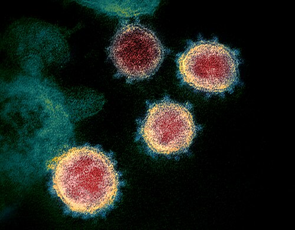
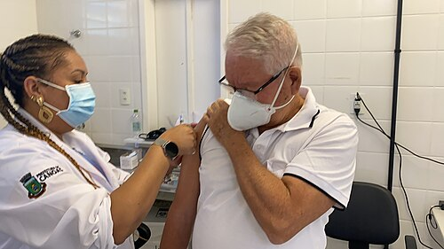

# COVID-19 NA GESTAÇÃO

Para entender a COVID-19 na gestação, você precisa primeiro esquecer a ideia de que a grávida é apenas uma "mulher com uma barriga maior". Na obstetrícia, as alterações fisiológicas ditam a regra do jogo. Se você não compreender por que o corpo da gestante reage de forma diferente ao vírus, você vai errar a conduta na hora da prova e, pior, no plantão.

A gestação é um estado de adaptação imunológica e mecânica constante. O sistema imune da gestante não é "suprimido" de forma simplista, ele é modulado. Existe um desvio da resposta Th1 (pro-inflamatória) para Th2 (anti-inflamatória) para que o corpo não rejeite o feto. O problema é que isso torna a mulher mais suscetível a complicações de infecções virais respiratórias, como vimos no H1N1 e agora na COVID-19.

## Fisiopatologia: O "Porquê" do Risco Aumentado

*Figura 1 - Imagem de microscopia eletrônica de transmissão (colorizada) mostrando o SARS-CoV-2 emergindo de células cultivadas em laboratório. As estruturas proeminentes (proteína Spike) conferem ao vírus sua aparência de "coroa". Fonte: NIAID, CC BY 2.0 | Wikimedia Commons*

Por que a gestante com COVID-19 complica mais rápido? Existem três pilares que você deve ter em mente. Primeiro, a reserva respiratória. Com o crescimento uterino, o diafragma sobe cerca de 4 cm. Isso reduz a capacidade residual funcional. A gestante já vive no limite do consumo de oxigênio, que está aumentado em 20%. Qualquer insulto pulmonar, como a pneumonia pelo SARS-CoV-2, leva à hipoxemia muito mais rápido do que em uma mulher não grávida.

Segundo, temos o estado pró-trombótico. A gravidez, por si só, já aumenta os fatores de coagulação e diminui a fibrinólise (preparando o corpo para o desafio hemorrágico do parto). A COVID-19 causa uma endotelite e uma cascata inflamatória que também é pró-trombótica. Quando você soma os dois, o risco de fenômenos tromboembólicos, como TEP e tromboses placentárias, explode.

Terceiro, o sistema cardiovascular. O débito cardíaco aumenta de 30% a 50% na gestação. Em um quadro de sepse ou síndrome gripal grave, o coração da gestante tem pouca margem para compensar uma demanda ainda maior. É por isso que, como o Dr. Will sempre reforça nas discussões de caso, a monitorização hemodinâmica aqui não é luxo, é sobrevivência.

## Quadro Clínico e o Diagnóstico Diferencial

O quadro clínico da COVID-19 na gestante é muito semelhante ao da população geral: febre, tosse, cefaleia, mialgia e perda de olfato/paladar. No entanto, aqui mora uma das maiores pegadinhas de prova: a dispneia fisiológica da gravidez.

Cerca de 60% a 70% das gestantes sentem falta de ar em algum momento, geralmente no terceiro trimestre, devido à pressão mecânica do útero e ao aumento do drive respiratório pela progesterona. Como diferenciar? A dispneia fisiológica é insidiosa, não vem acompanhada de febre, tosse ou queda na saturação de oxigênio. Se a paciente relata dispneia súbita ou se a saturação em ar ambiente está abaixo de 95%, pare tudo. Isso não é fisiológico.

### Tabela 1: Diagnóstico Diferencial da Dispneia na Gestação

| Condição | Características Clínicas | Achados de Exame |
| --- | --- | --- |
| Dispneia Fisiológica | Gradual, melhora ao repouso, sem sinais sistêmicos | SatO2 > 95%, ausculta limpa |
| COVID-19 | Aguda, febre, tosse, mialgia, contato prévio | SatO2 pode cair, infiltrado em vidro fosco |
| Influenza (H1N1) | Início súbito, febre alta, prostração intensa | Semelhante à COVID-19 (exige teste viral) |
| Embolia Pulmonar | Súbita, dor torácica pleurítica, taquicardia | ECG com taquicardia sinusal, Angio-TC positiva |
| Edema Agudo de Pulmão | Associado à Pré-eclâmpsia, hipertensão, estertores | Hipertensão, proteinúria, edema de membros |

Lembre-se: a gestante com síndrome gripal deve ser testada para COVID-19 (RT-PCR ou teste rápido de antígeno) e, simultaneamente, deve-se considerar a pesquisa para Influenza. As bancas adoram cobrar o manejo da Influenza junto com a COVID. Se houver suspeita de Influenza, o Oseltamivir deve ser iniciado precocemente, sem esperar o resultado do exame.

## Classificação de Gravidade e Manejo

A conduta depende inteiramente de onde a paciente se encaixa na classificação de gravidade. Segundo o Manual do Ministério da Saúde e as diretrizes da FEBRASGO, dividimos assim:

### Casos Leves

A paciente apresenta sintomas gripais (tosse, dor de garganta, febre), mas mantém saturação de oxigênio acima de 95% e não tem sinais de desconforto respiratório.
O manejo é domiciliar. Repouso, hidratação e sintomáticos (Paracetamol é a primeira escolha). A paciente deve receber um atestado para isolamento de 7 a 10 dias e ser orientada sobre sinais de alerta: piora da falta de ar, febre persistente ou redução da movimentação fetal.

### Casos Moderados e Graves

Aqui o jogo muda. Se a paciente apresenta taquipneia (FR > 24 irpm), saturação < 95% em ar ambiente ou sinais de pneumonia no exame físico, a internação é obrigatória.

No hospital, as metas são claras:

- Oxigênio suplementar para manter SatO2 entre 92% e 95%. Cuidado: na gestante, não queremos saturações limítrofes como 90%, pois o feto precisa de uma margem de segurança.

- Corticoterapia: Se a paciente precisa de oxigênio, ela precisa de corticoide. Usamos Dexamethasone 6mg/dia por 10 dias. Mas atenção à pegadinha: se o objetivo for maturação pulmonar fetal (entre 24 e 34 semanas), usamos Betametasona ou Dexametasona em doses obstétricas. O corticoide da COVID serve para a inflamação materna, mas também acaba ajudando o feto se o parto for iminente.

- Anticoagulação: Toda gestante internada com COVID-19 deve receber profilaxia para tromboembolismo venoso com Heparina (Enoxaparina 40mg/dia é o padrão), a menos que haja contraindicação absoluta (sangramento ativo).

## Exames de Imagem: Pode fazer Tomografia?

Este é um ponto que gera muito medo nos alunos e nas pacientes. "Doutor, a radiação não vai afetar o bebê?". A resposta curta é: se a mãe morrer, o bebê morre. A Tomografia de Tórax (TC) pode e deve ser realizada se for necessária para o diagnóstico ou avaliação de complicações (como TEP).

A dose de radiação de uma TC de tórax com proteção abdominal é ínfima e está muito abaixo do limiar teratogênico (que é de cerca de 50 mGy). Portanto, não atrase o diagnóstico por medo da radiação. A segurança fetal é importante, mas a vida materna é prioridade absoluta. Na MedEvo, sempre batemos na tecla de que o manejo da gestante grave segue os princípios do suporte avançado de vida, com as devidas adaptações.

## O Momento do Parto: A Grande Dúvida

Muitos alunos acham que COVID-19 é indicação de cesariana. Errado! A via de parto é de indicação obstétrica. Se a paciente está estável, o trabalho de parto pode seguir normalmente.

A interrupção da gestação só deve ser considerada se:

- Houver deterioração materna grave que não responde às manobras de suporte (a retirada do feto pode melhorar a mecânica respiratória materna no terceiro trimestre).

- Houver sofrimento fetal agudo.

- A paciente estiver em fase terminal (Cesariana Perimortem).

Se a paciente estiver em trabalho de parto prematuro (entre 24 e 34 semanas) e com COVID-19 grave, o manejo deve incluir o corticoide para maturação pulmonar e o sulfato de magnésio para neuroproteção se o parto for iminente (abaixo de 32 semanas).

## Vacinação: A Proteção que Salva Vidas

A vacinação contra COVID-19 em gestantes e puérperas é recomendada em qualquer idade gestacional. No Brasil, a preferência é pelas vacinas de plataforma de RNA mensageiro (Pfizer) ou vírus inativado (CoronaVac). As vacinas de vetor viral (AstraZeneca/Janssen) devem ser evitadas em gestantes devido ao risco (embora raro) de eventos trombóticos com trombocitopenia, sendo reservadas apenas para situações de altíssimo risco onde não há outra opção.

Um ponto fundamental para provas: a vacinação materna gera transferência passiva de anticorpos (IgG) via placenta e via leite materno. Isso confere proteção ao recém-nascido nos primeiros meses de vida, reduzindo drasticamente o risco de hospitalização do bebê.

### Tabela 2: Vacinação na Gestação - O que cai na prova

*Figura 2 - Aplicação de vacina COVID-19 (CoronaVac) no Brasil. A vacinação é recomendada durante a gestação para proteção materna e transferência de anticorpos ao feto. Fonte: Eduardo Gerhardt Martins, CC BY-SA 4.0 | Wikimedia Commons*

| Vacina | Recomendação | Observação |
| --- | --- | --- |
| COVID-19 | Recomendada (Pfizer/CoronaVac) | Qualquer trimestre |
| Influenza | Recomendada | Anual, protege contra H1N1 |
| dTpa | Recomendada | A partir da 20ª semana (protege o RN contra coqueluche) |
| Hepatite B | Recomendada | Se não imunizada previamente |
| Rubéola / Varicela | Contraindicada absoluta | Vírus vivo atenuado |
| Febre Amarela | Contraindicada relativa | Avaliar risco/benefício em áreas de surto |

Cuidado com a pegadinha da vacina de Rubéola: se uma mulher for vacinada inadvertidamente para Rubéola e descobrir que estava grávida, isso NÃO é indicação de interrupção da gestação. O risco teórico existe, mas na prática nunca foi documentado um caso de síndrome da rubéola congênita por vacina. O pré-natal segue normal.

## Puerpério e Aleitamento Materno

O pós-parto da paciente com COVID-19 exige atenção redobrada. O risco trombótico é ainda maior no puerpério. Além disso, temos a questão do manejo do recém-nascido (RN).

A recomendação atual é o alojamento conjunto, desde que a mãe esteja em bom estado geral. A amamentação é estimulada. O vírus não é transmitido pelo leite materno em quantidades infectantes. Os benefícios do aleitamento e do contato pele a pele superam os riscos de transmissão respiratória, desde que as medidas de higiene sejam seguidas:

- Uso de máscara cirúrgica pela mãe durante a amamentação.

- Higiene rigorosa das mãos antes de tocar no bebê.

- Berço com distância de pelo menos 2 metros da cama da mãe quando não estiver amamentando.

Se a mãe estiver muito grave (em UTI, por exemplo), a ordenha do leite deve ser estimulada para manter a lactação e o leite pode ser oferecido ao bebê por um cuidador saudável.

## Outras Infecções e Contextos (O que as bancas misturam)

As questões de prova raramente trazem a COVID-19 isolada. Elas gostam de comparar com outras patologias.

### Tuberculose (TB)

Se a mãe é bacilífera (TB ativa), o RN não deve ser vacinado com BCG ao nascer. Ele deve receber quimioprofilaxia (Isoniazida ou Rifampicina) por 3 meses. Após esse período, faz-se o teste tuberculínico (PPD/TT). Se o teste for negativo, suspende-se a medicação e vacina-se com BCG. Se for positivo, mantém-se o tratamento. Isso é um clássico de prova!

### Varicela

Se a gestante for exposta à varicela e for suscetível (não teve a doença e não é vacinada), ela deve receber a Imunoglobulina Específica (VZIG) em até 96 horas (podendo estender até 10 dias em alguns protocolos, mas 96h é o padrão de prova). Se a mãe desenvolver varicela de 5 dias antes até 2 dias após o parto, o RN deve receber a imunoglobulina imediatamente, pois o risco de varicela neonatal grave é altíssimo.

### Tabagismo e Álcool

Sempre que falarmos de complicações respiratórias, lembre-se que o tabagismo na gestação causa restrição de crescimento intrauterino (RCIU) e aumenta o risco de descolamento prematuro de placenta (DPP). Já o álcool não tem dose segura e pode causar a Síndrome Fetal pelo Álcool, com microcefalia e alterações faciais.

## Parada Cardiorrespiratória (PCR) na Gestante

Se a COVID-19 evoluir para uma PCR, você precisa saber a manobra de ouro: o deslocamento uterino lateral à esquerda. A partir de 20 semanas, o útero comprime a veia cava inferior, reduzindo o retorno venoso e tornando a massagem cardíaca ineficaz.

Se a PCR não for revertida em 4 minutos, deve-se realizar a Cesariana de Emergência (Perimortem) no local onde a paciente estiver. O objetivo é salvar a mãe (ao esvaziar o útero, o retorno venoso melhora drasticamente) e, secundariamente, tentar salvar o feto.

### Tabela 3: Metas Terapêuticas na Gestante Grave

| Parâmetro | Meta | Por que? |
| --- | --- | --- |
| Saturação O2 | 92% - 95% | Garantir oferta de O2 fetal sem toxicidade materna |
| PaCO2 | 28 - 32 mmHg | A gestante vive em alcalose respiratória fisiológica |
| Pressão Arterial | PAM > 65 mmHg | Manter perfusão placentária |
| Posição | Decúbito lateral esquerdo | Evitar compressão da veia cava |

## Pontos-Chave para Prova 🩺

- A dispneia fisiológica da gestação não reduz a SatO2 e não causa febre. SatO2 < 95% é sempre sinal de alerta.

- Oseltamivir deve ser iniciado em toda gestante com síndrome gripal, mesmo na suspeita de COVID-19, para cobrir Influenza.

- COVID-19 não é indicação de cesariana. A via de parto é obstétrica.

- Dexametasona 6mg/dia é para tratamento materno (se precisar de O2). Betametasona 12mg (2 doses) é para maturação pulmonar fetal.

- Alojamento conjunto e amamentação estão autorizados, com máscara e higiene das mãos.

- Vacinas de vírus vivo (Rubéola, Varicela, Tríplice Viral) são contraindicadas na gestação.

- Vacinação inadvertida para Rubéola NÃO indica interrupção da gravidez.

- RN de mãe com TB ativa: Quimioprofilaxia primeiro, BCG só depois do teste tuberculínico negativo.

- Gestante exposta à Varicela (suscetível): Imunoglobulina (VZIG) em até 96 horas.

- PCR em gestante > 20 semanas: Deslocamento uterino para a esquerda e cesárea perimortem se não reverter em 4-5 min.

- Heparina profilática deve ser feita em toda gestante internada com COVID-19, devido ao alto risco trombótico.

- Tomografia de tórax é segura na gestação quando indicada; o risco da radiação é menor que o risco de negligenciar uma complicação grave.

- O uso de corticoides na COVID-19 grave reduz a mortalidade materna, mas pode descompensar o diabetes gestacional (monitore a glicemia!).

- A transmissão vertical do SARS-CoV-2 é rara; a maior preocupação é a transmissão respiratória no pós-parto.

- O uso de Favipiravir é contraindicado na amamentação devido ao risco de toxicidade hepática no lactente.

- A presença de anticorpos IgG no leite materno após vacinação materna é um fator protetor crucial para o recém-nascido.

 Cópia offline para consulta pessoal.
 Fonte original:
 [https://www.medevo.com.br/material-apoio/ler/c1b169a2-8cdb-4cc4-8f1d-1354d3e4aa03](https://www.medevo.com.br/material-apoio/ler/c1b169a2-8cdb-4cc4-8f1d-1354d3e4aa03)
