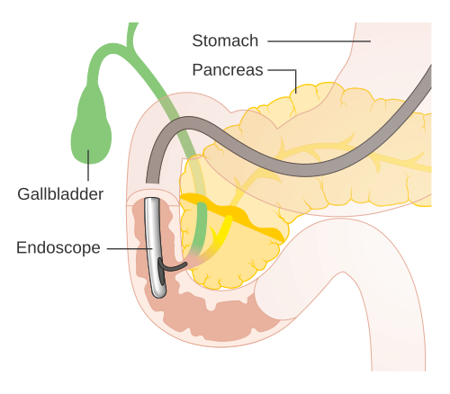
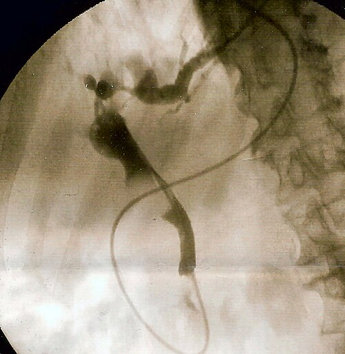

# CPRE E DRENAGEM BILIAR

A Colangiopancreatografia Retrógrada Endoscópica (CPRE) é, sem dúvida, um dos procedimentos mais "temidos" e, ao mesmo tempo, mais fascinantes da gastroenterologia e cirurgia biliar. Se você quer passar em uma residência de ponta, precisa entender que a CPRE deixou de ser um exame puramente diagnóstico para se tornar uma ferramenta essencialmente terapêutica.

Antigamente, usávamos a CPRE para "ver" o cálculo. Hoje, se você pedir uma CPRE apenas para diagnóstico, o examinador vai te tirar pontos. Para ver, usamos a Colangiorressonância (CPRM) ou o Ultrassom Endoscópico (EUS). A CPRE serve para agir.

## Entendendo a Anatomia e o Equipamento

*Figura 1 - Diagrama detalhado da Colangiopancreatografia Retrógrada Endoscópica (CPRE), mostrando o duodenoscópio com visão lateral acessando a papila duodenal maior. Fonte: Cancer Research UK, CC BY-SA 4.0 | Wikimedia Commons*

Para entender por que a CPRE tem tantas complicações e por que é tecnicamente difícil, você precisa visualizar o duodenoscópio. Diferente da endoscopia digestiva alta (EDA) convencional, o duodenoscópio possui **visão lateral**.

Por que visão lateral? Porque a Papila de Vater (ou papila duodenal maior) está localizada na parede medial da segunda porção do duodeno. Se usássemos um aparelho de visão frontal, passaríamos direto por ela ou teríamos um ângulo impossível para canular.

O "pulo do gato" aqui é o **elevador (albarran)**. É uma pequena peça na ponta do aparelho que permite ao endoscopista angular o cateter ou a agulha para cima, entrando no ducto biliar comum (colédoco) ou no ducto pancreático (Wirsung).

### O trajeto do contraste

Quando injetamos contraste na CPRE, o objetivo é desenhar a árvore biliar. Em provas, você verá imagens radiológicas onde deve identificar:

- **Ducto Hepático Comum:** Acima da junção com o cístico.

- **Ducto Cístico:** O "canal" da vesícula.

- **Colédoco:** Da junção do cístico até a papila.

- **Ducto Pancreático:** Frequentemente canulado inadvertidamente (o que aumenta o risco de pancreatite).

## Indicações: Quando intervir?

*Figura 2 - Imagem fluoroscópica de CPRE mostrando cálculo impactado no colédoco distal (coledocolitíase), indicação clássica de CPRE terapêutica. Fonte: Samir, CC BY-SA 3.0 | Wikimedia Commons*

A indicação clássica que despenca em provas é a **Coledocolitíase**. Mas cuidado: nem todo paciente com suspeita de cálculo no colédoco vai direto para a CPRE.

Segundo as diretrizes da SOBED (Sociedade Brasileira de Endoscopia Digestiva) e seguindo a lógica do MedEvo, estratificamos o risco do paciente ter um cálculo no colédoco para decidir a conduta.

### Estratificação de Risco para Coledocolitíase

| Risco | Critérios | Conduta Inicial |
| --- | --- | --- |
| **Alto** | Cálculo visível no USG; Bilirrubina Total > 4 mg/dL; Colangite Aguda. | CPRE Direta |
| **Intermediário** | Idade > 55 anos; Colédoco dilatado (> 6mm); Enzimas hepáticas alteradas. | CPRM ou Ecoendoscopia |
| **Baixo** | Apenas colelitíase; exames laboratoriais normais. | Colecistectomia (± Colangiografia intraop) |

**Dica de Ouro do Dr. Will:** Se a questão trouxer um paciente com icterícia obstrutiva (Bilirrubina Direta alta), febre e dor abdominal (Tríade de Charcot), não perca tempo com ressonância. Esse paciente tem **Colangite Aguda** e precisa de CPRE de urgência para descompressão biliar.

## A Técnica: Esfincterotomia e Extração

Uma vez que o endoscopista consegue canular a papila, o próximo passo geralmente é a **esfincterotomia endoscópica** (ou papilotomia). Usamos um bisturi elétrico (papilótomo) para cortar as fibras do esfíncter de Oddi.

Por que fazemos isso?

- Para ampliar o orifício e permitir a passagem de cálculos.

- Para facilitar a introdução de próteses (stents).

- Para reduzir a pressão na via biliar em casos de fístulas.

Para retirar os cálculos, usamos dois acessórios principais:

- **Balão Extrator:** Ideal para cálculos pequenos e múltiplos. Ele "varre" o colédoco.

- **Cesta (Basket) de Dormia:** Usada para cálculos maiores ou mais endurecidos. Cuidado: se o cálculo for muito grande, ele pode ficar preso na cesta e na papila (cesta impactada), uma complicação dramática que exige litotripsia mecânica.

## Complicações: O "Terror" das Bancas

Se existe um tema que as bancas amam sobre CPRE, são as complicações. Você precisa saber diagnosticar e manejar cada uma delas.

### 1. Pancreatite Pós-CPRE (PEP)

É a complicação mais comum (cerca de 5-10% dos casos).

- **Fisiopatologia:** Trauma mecânico na papila, injeção excessiva de contraste no ducto pancreático ou lesão térmica.

- **Quadro Clínico:** Dor epigástrica intensa em barra, náuseas e vômitos **após** o procedimento.

- **Diagnóstico:** Amilase/Lipase > 3x o limite superior do normal + dor característica.

- **Prevenção (Cai muito!):** Indometacina ou Diclofenaco retal (100mg) imediatamente antes ou após o procedimento e hidratação venosa vigorosa com Ringer Lactato.

**Pegadinha de Prova:** Paciente pós-CPRE com dor, amilase elevada, mas TC de abdome normal. Conduta? É pancreatite aguda leve/moderada. O tratamento é clínico: jejum, analgesia e hidratação. Não precisa de cirurgia nem de antibiótico de rotina, a menos que haja sinais claros de infecção ou necrose infectada.

### 2. Perfuração Duodenal

Menos comum, mas muito mais grave. Geralmente ocorre durante a esfincterotomia.

- **Sinal clássico:** Ar no retroperitônio (retropneumoperitônio) na TC ou RX.

- **Classificação de Stapfer:**

- Tipo I: Parede lateral do duodeno (cirúrgico).

- Tipo II: Periampular (geralmente conservador).

- Tipo III: Via biliar (conservador/dreno).

- Tipo IV: Ar retroperitoneal isolado (conservador).

### 3. Hemorragia

Geralmente ocorre após a papilotomia. Pode ser imediata ou tardia (até 2 semanas depois).

- **Manejo:** A maioria para com adrenalina local ou clipes endoscópicos. Se for maciça e refratária, a Radiologia Intervencionista com embolização é a salvação.

## Icterícia Obstrutiva e Tumores Periampulares

Quando a icterícia é progressiva, associada a emagrecimento e sinal de Courvoisier-Terrier (vesícula palpável e indolor), pensamos em neoplasia (Cabeça de Pâncreas, Ampoloma, Colangiocarcinoma distal).

Nesses casos, a CPRE tem papel fundamental na **paliação**.

- **Próteses Plásticas:** Baratas, mas entopem rápido (3 meses). Usadas se a expectativa de vida for curta ou como ponte para cirurgia.

- **Próteses Metálicas Autoexpansíveis (SEMS):** Mais caras, mas ficam pérvias por muito mais tempo (6-12 meses). Ideais para pacientes sem proposta cirúrgica curativa.

**Atenção ao CA 19.9:** Ele é um marcador importante. Se estiver muito elevado em um idoso com dilatação biliar, a suspeita de tumor periampular sobe drasticamente.

## Síndrome de Mirizzi: O "Desvio" no Caminho

A Síndrome de Mirizzi ocorre quando um cálculo impactado no ducto cístico ou no infundíbulo da vesícula causa uma compressão extrínseca do ducto hepático comum.

As bancas adoram a classificação de Csendes:

- **Tipo I:** Apenas compressão extrínseca (sem fístula).

- **Tipo II:** Fístula colecistobiliar envolvendo até 1/3 da circunferência do colédoco.

- **Tipo III:** Fístula envolvendo até 2/3 da circunferência.

- **Tipo IV:** Fístula que destrói toda a parede do colédoco.

- **Tipo V:** Qualquer tipo anterior + fístula colecistoentérica (íleo biliar).

**Por que isso importa?** Porque no Tipo I você pode tentar resolver com colecistectomia simples. Nos tipos II, III e IV, o risco de lesão de via biliar é altíssimo, e muitas vezes precisamos de uma derivação biliodigestiva (Y de Roux).

## Hemobilia: A Tríade de Quinke

Imagine o cenário: Paciente submetido a uma drenagem de abscesso hepático ou biópsia hepática. Dias depois, ele apresenta:

- Dor no quadrante superior direito.

- Icterícia.

- Hemorragia Digestiva Alta (melena ou hematêmese).

Essa é a **Tríade de Quinke**, patognomônica de Hemobilia. O sangue está saindo da árvore biliar para o duodeno.

- **Conduta inicial:** Estabilização.

- **Diagnóstico e Tratamento de escolha:** Arteriografia com embolização da artéria hepática. Se o paciente tiver um dreno biliar e começar a sangrar por ele, a primeira manobra é retirar ou tracionar o cateter, mas a embolização é a resposta definitiva de prova.

## Drenagem Biliar Percutânea (Trans-hepática)

Nem sempre conseguimos fazer a CPRE. Às vezes o paciente tem uma anatomia alterada (cirurgia de Y de Roux prévia) ou o tumor obstrui completamente a entrada da papila.

Nesses casos, entra a **Drenagem Biliar Percutânea (DBP)**, realizada pela Radiologia Intervencionista.

- **Indicação:** Falha da CPRE, obstruções altas (Tumor de Klatskin - colangiocarcinoma hilar) ou necessidade de acesso trans-hepático.

- **Complicações:** Sangramento (hemobilia), fístula biliar e coleções peri-hepáticas.

## Situações Pós-Operatórias e Fístulas

Você operou uma vesícula e o paciente volta no 5º dia de pós-operatório com dor abdominal e icterícia. O que pode ser?

- **Cálculo residual:** Aquele que "fugiu" para o colédoco durante a cirurgia.

- **Lesão de Via Biliar:** O pesadelo do cirurgião.

- **Fístula do cístico:** O grampo soltou.

A CPRE aqui é diagnóstica e terapêutica. Ao realizar a papilotomia e colocar um stent (prótese), o endoscopista diminui a resistência na papila. O caminho de menor pressão passa a ser o ducto, e não a fístula. Isso permite que a fístula feche espontaneamente.

Se a lesão for complexa (secção total do colédoco), a CPRE mostrará a interrupção do contraste, e o tratamento será cirúrgico (Derivação Biliodigestiva).

## Tabelas Comparativas para Fixação

### Diagnóstico Diferencial de Obstrução Biliar

| Causa | Clínica Típica | Imagem (USG/TC) | Marcadores |
| --- | --- | --- | --- |
| **Coledocolitíase** | Dor em cólica, icterícia flutuante. | Cálculo hiperecogênico com sombra. | Bilirrubina Direta ↑ |
| **Câncer de Pâncreas** | Icterícia progressiva, indolor, perda de peso. | Massa em cabeça de pâncreas. | CA 19.9 ↑↑ |
| **Colangite Aguda** | Tríade de Charcot / Pêntade de Reynolds. | Dilatação biliar + espessamento de parede. | Leucocitose + PCR ↑ |
| **Mirizzi** | Icterícia obstrutiva + colelitíase crônica. | Cálculo impactado no cístico comprimindo o hepático. | Bilirrubina Direta ↑ |

### CPRE vs. Drenagem Percutânea (DBP)

| Característica | CPRE | Drenagem Percutânea |
| --- | --- | --- |
| **Via de Acesso** | Endoscópica (Natural) | Trans-hepática (Percutânea) |
| **Melhor para** | Obstruções distais (colédoco) | Obstruções hilares (Klatskin) |
| **Anatomia** | Difícil em Y de Roux | Independente da anatomia gástrica |
| **Principal Risco** | Pancreatite | Hemobilia / Sangramento |

## Casos Clínicos Rápidos

**Caso 1:** Paciente de 70 anos, colecistectomizada há 10 anos, chega com icterícia flutuante e colúria. USG mostra colédoco de 12mm com imagem de falha de enchimento.

- **Diagnóstico:** Coledocolitíase residual (ou primária de colédoco).

- **Conduta:** CPRE com esfincterotomia e extração de cálculos.

**Caso 2:** Paciente com dor epigástrica súbita 6 horas após CPRE para retirada de cálculo. Amilase de 2.000 U/L.

- **Diagnóstico:** Pancreatite Pós-CPRE.

- **Conduta:** Internação, jejum, hidratação venosa agressiva e analgesia.

**Caso 3:** Durante uma colecistectomia difícil, o cirurgião faz uma colangiografia intraoperatória e nota que o contraste não progride para o duodeno e há uma falha de enchimento no colédoco distal.

- **Diagnóstico:** Coledocolitíase.

- **Conduta:** Pode-se tentar a exploração transcística ou, o mais comum em provas, terminar a cirurgia e indicar CPRE no pós-operatório imediato.

## Pontos-Chave para Prova

- **CPRE Diagnóstica:** Praticamente abandonada. Se a questão pedir "melhor exame diagnóstico inicial", pense em USG. Se pedir "padrão-ouro diagnóstico não invasivo", é CPRM. CPRE é para tratar.

- **Indicação de CPRE na Pancreatite Biliar:** Apenas se houver **Colangite associada** ou obstrução biliar persistente (icterícia que não melhora). Pancreatite biliar isolada NÃO é indicação de CPRE de urgência.

- **Tríade de Charcot:** Dor abdominal, Icterícia, Febre com calafrios. Indica Colangite Aguda.

- **Pêntade de Reynolds:** Charcot + Hipotensão + Alteração do nível de consciência. Indica Colangite Tóxica Grave (urgência médica!).

- **Prevenção de Pancreatite Pós-CPRE:** AINE retal (Indometacina/Diclofenaco) é a medida com maior evidência em provas.

- **Perfuração Retroperitoneal:** Suspeitar se houver dor intensa e crepitação (enfisema subcutâneo - raro) ou ar retroperitoneal na TC após o procedimento.

- **Hemobilia:** Tríade de Quinke (Dor, Icterícia, HDA). Tratamento é Arteriografia com Embolização.

- **Cisto de Colédoco:** Deve ser ressecado cirurgicamente devido ao alto risco de degeneração para Colangiocarcinoma.

- **Dreno de Kehr:** A colangiografia pelo dreno de Kehr é feita no pós-operatório para garantir que não há cálculos residuais antes de retirar o dreno (geralmente após 14-21 dias).

- **Contraindicação Absoluta de CPRE:** Recusa do paciente ou falta de condições clínicas mínimas para sedação/anestesia. Anatomia alterada (como Y de Roux) é uma contraindicação relativa (exige aparelhos especiais).

- **Sinal de Courvoisier-Terrier:** Vesícula palpável e indolor em paciente ictérico = Câncer de cabeça de pâncreas até que se prove o contrário.

- **Cálculo Impactado na Papila:** Causa icterícia súbita e pode causar pancreatite. A CPRE com papilotomia é salvadora.

- **CA 19.9:** Não serve para rastreio populacional, mas ajuda muito no diagnóstico diferencial de massas pancreáticas e colangiocarcinomas.

- **Icterícia Flutuante:** Marca registrada da coledocolitíase (o cálculo funciona como uma válvula) ou do tumor de ampola de Vater (que sofre necrose central e permite a passagem temporária de bile). 💡

Lembre-se: na prova de residência, o examinador quer saber se você sabe identificar a complicação e se você sabe quem deve ir para a CPRE e quem deve ir para a Ressonância. Se houver sinal de infecção (Colangite), a resposta quase sempre será intervir (CPRE). Se for apenas investigação, seja conservador e peça a CPRM.

 Cópia offline para consulta pessoal.
 Fonte original:
 [https://www.medevo.com.br/material-apoio/ler/ee03098c-8747-4466-9c3f-dda7f3752c58](https://www.medevo.com.br/material-apoio/ler/ee03098c-8747-4466-9c3f-dda7f3752c58)
