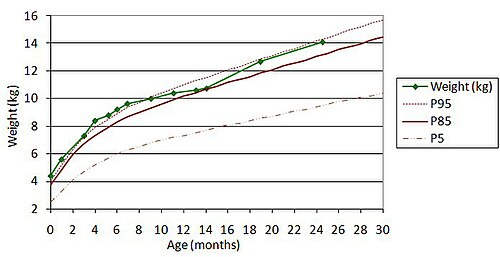
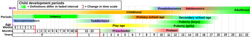

# CRESCIMENTO E DESENVOLVIMENTO INFANTIL

Crescimento e desenvolvimento são conceitos diferentes, mas avaliados juntos na puericultura.

- **Crescimento:** fenômeno quantitativo, medido por peso, comprimento/estatura, perímetro cefálico e IMC.

- **Desenvolvimento:** fenômeno qualitativo, ligado à maturação neurológica e à aquisição progressiva de habilidades motoras, cognitivas, sociais e de linguagem.

Na avaliação infantil, o mais importante não é um ponto isolado na curva, mas a **tendência ao longo do tempo**. Cruzar canais de crescimento, perder velocidade de crescimento ou apresentar regressão de marcos do desenvolvimento sempre exige atenção.

## Roteiro completo da consulta de puericultura

Uma avaliação completa deve integrar crescimento, desenvolvimento e contexto familiar. O registro longitudinal evita conclusões precipitadas e permite detectar desvio de trajetória antes de ocorrer desnutrição, baixa estatura importante ou atraso funcional.

Consulta de puericultura: sequência prática

1. Antropometria
 → peso, comprimento/estatura, perímetro cefálico, IMC e plotagem nas curvas adequadas

2. Tendência
 → velocidade de crescimento, cruzamento de canais e comparação com medidas anteriores

3. Desenvolvimento
 → marcos motores, linguagem, interação social, cognição, brincadeira e autonomia

4. Alimentação e suplementação
 → aleitamento, alimentação complementar, ferro, vitamina D e risco nutricional

5. Prevenção
 → vacinas, sono seguro, saúde bucal, telas, acidentes, violência e saúde familiar

6. Sinais de alerta
 → perda de habilidades, estagnação ponderoestatural, alterações neurológicas ou suspeita de negligência

Em prematuros, a interpretação dos marcos e do crescimento deve considerar a **idade corrigida**, especialmente nos primeiros 2 anos. Sem essa correção, há risco de classificar como atraso uma criança que segue evolução compatível com sua idade gestacional ao nascimento.

## Crescimento: medidas principais

*Figura 1 - Exemplo de curva de crescimento (peso) de uma menina plotada nas curvas de referência da OMS 2006. A tendência do crescimento ao longo do tempo é mais importante que um ponto isolado. Fonte: Michielvd, CC BY-SA 3.0 | Wikimedia Commons*

O crescimento é um dos melhores indicadores globais de saúde infantil. Deve ser acompanhado em toda consulta de puericultura, com registro na Caderneta da Criança.

### Peso

O peso é o parâmetro mais sensível a alterações agudas. Costuma ser o primeiro a cair diante de doença, ingestão inadequada ou erro alimentar, e também o primeiro a recuperar após correção do problema.

Referências práticas:

- O peso **dobra** por volta do 4º ao 5º mês.

- O peso **triplica** ao redor de 1 ano.

- O peso **quadruplica** por volta de 2 anos.

Ganho ponderal médio no primeiro ano:

- 1º trimestre: 25 a 30 g/dia.

- 2º trimestre: cerca de 20 g/dia.

- 3º trimestre: cerca de 15 g/dia.

- 4º trimestre: cerca de 10 g/dia.

Estimativas úteis após 1 ano:

- 1 a 6 anos: peso aproximado = **idade x 2 + 8 kg**.

- 7 a 12 anos: peso aproximado = **idade x 3 + 7 kg**.

Essas fórmulas são apenas estimativas rápidas. Para diagnóstico nutricional, deve-se usar a curva adequada por idade e sexo.

### Comprimento e estatura

Até 2 anos, mede-se **comprimento** com a criança deitada. A partir de 2 anos, mede-se **estatura** em pé.

No primeiro ano, o lactente cresce cerca de 25 cm:

- 1º semestre: cerca de 15 cm.

- 2º semestre: cerca de 10 cm.

Referências práticas:

- Nascimento: cerca de 50 cm.

- 1 ano: cerca de 75 cm.

- 2 anos: cerca de 87 cm.

- 4 anos: cerca de 100 cm, aproximadamente o dobro do comprimento ao nascer.

Após os 4 anos, a velocidade de crescimento costuma ficar em torno de **5 a 7 cm/ano** até o início da puberdade. Crescimento menor que **4 cm/ano** em idade escolar é sinal de alerta e deve motivar investigação.

Estimativa rápida de estatura entre 2 e 12 anos:

- Estatura aproximada = **idade x 6 + 77 cm**.

A estatura reflete a história nutricional e de saúde em longo prazo. Baixa estatura geralmente sugere processo crônico, especialmente quando associada a baixa velocidade de crescimento.

### Perímetro cefálico

O perímetro cefálico reflete o crescimento craniano e cerebral, especialmente nos primeiros anos de vida.

Crescimento médio no primeiro ano:

- 0 a 3 meses: cerca de 2 cm/mês.

- 3 a 6 meses: cerca de 1 cm/mês.

- 6 a 12 meses: cerca de 0,5 cm/mês.

Referências aproximadas:

- Nascimento: 34 a 35 cm.

- 3 meses: cerca de 40 cm.

- 6 meses: cerca de 43 cm.

- 12 meses: cerca de 46 cm.

- 2 anos: cerca de 48 cm.

Após os 2 anos, o crescimento do perímetro cefálico é mais lento e perde importância como medida rotineira de rastreamento nutricional, embora continue relevante em suspeitas neurológicas.

Microcefalia é definida, de forma geral, por perímetro cefálico abaixo de **-2 escores-Z** para idade, sexo e idade gestacional. Microcefalia grave corresponde a valores abaixo de **-3 escores-Z**.

A fontanela anterior costuma fechar entre 9 e 18 meses. Fechamento precoce isolado não significa doença se o perímetro cefálico cresce adequadamente e a criança se desenvolve bem. Se houver desaceleração do perímetro cefálico, atraso do desenvolvimento ou alteração do formato craniano, deve-se investigar.

## Avaliação nutricional e curvas de crescimento

A avaliação nutricional deve ser feita com os índices antropométricos da OMS, em escore-Z, considerando idade e sexo.

Principais índices:

| Índice | O que avalia | Interpretação principal |
| --- | --- | --- |
| Peso/idade | Massa corporal total para a idade | Não diferencia desnutrição aguda de crônica. |
| Estatura/idade | Crescimento linear | Baixo escore-Z sugere agravo crônico ou pregresso. |
| Peso/estatura | Proporção entre peso e estatura | Útil para magreza ou excesso de peso em menores de 5 anos. |
| IMC/idade | Relação entre peso e estatura por idade e sexo | Principal índice para sobrepeso e obesidade em crianças maiores e adolescentes. |

### Classificação pelo IMC/idade

Em menores de 5 anos:

- Z < -3: magreza acentuada.

- Z ≥ -3 e < -2: magreza.

- Z ≥ -2 e ≤ +1: eutrofia.

- Z > +1 e ≤ +2: risco de sobrepeso.

- Z > +2 e ≤ +3: sobrepeso.

- Z > +3: obesidade.

De 5 a 19 anos:

- Z < -3: magreza acentuada.

- Z ≥ -3 e < -2: magreza.

- Z ≥ -2 e ≤ +1: eutrofia.

- Z > +1 e ≤ +2: sobrepeso.

- Z > +2 e ≤ +3: obesidade.

- Z > +3: obesidade grave.

Ponto de atenção: uma criança de 8 anos com IMC acima de +2 escores-Z tem **obesidade**, não apenas sobrepeso.

### Como interpretar a curva na prática

A curva deve ser interpretada com três perguntas:

- **Onde a criança está hoje?** Avaliar escore-Z ou percentil para idade e sexo.

- **Como ela chegou até aqui?** Verificar se manteve canal, cruzou percentis ou reduziu velocidade.

- **O achado combina com o contexto?** Considerar prematuridade, altura dos pais, puberdade, doença crônica, alimentação, medicamentos e condições sociais.

Sinais que exigem investigação incluem queda sustentada de percentis, peso que cai antes da estatura, perímetro cefálico acelerando ou desacelerando de forma anormal, discrepância entre peso e estatura e qualquer regressão do desenvolvimento associada.

## Baixa estatura

Baixa estatura é definida, em geral, como estatura abaixo de **-2 escores-Z** para idade e sexo, ou abaixo do percentil 3.

A avaliação deve considerar:

- Estatura atual.

- Velocidade de crescimento.

- Altura dos pais e altura-alvo.

- Estágio puberal.

- Idade óssea.

- Sinais de doença crônica, desnutrição, hipotireoidismo, doença celíaca, síndromes genéticas ou uso crônico de corticoide.

### Altura-alvo

Fórmulas práticas:

- Meninos: **(altura do pai + altura da mãe + 13) / 2**.

- Meninas: **(altura do pai + altura da mãe - 13) / 2**.

Aceita-se variação aproximada de **± 8,5 cm** em relação à altura-alvo.

### Variantes normais

As duas principais variantes normais são:

- **Baixa estatura familiar:** pais baixos, velocidade de crescimento normal, idade óssea compatível com a cronológica.

- **Atraso constitucional do crescimento e puberdade:** crescimento mais lento, puberdade tardia, idade óssea atrasada e tendência a estatura final adequada ao potencial genético.

Sinal de alerta importante: criança que cruza percentis para baixo ou cresce menos que o esperado para a idade deve ser investigada, mesmo que ainda esteja dentro da curva.

### Velocidade de crescimento e quando investigar

A velocidade de crescimento é mais útil que uma medida isolada. A desaceleração sustentada sugere que algo está interferindo no eixo de crescimento, mesmo quando a estatura ainda não caiu abaixo de -2 escores-Z.

Pontos que aumentam a suspeita de causa patológica:

- Altura muito abaixo da altura-alvo familiar.

- Velocidade de crescimento baixa para idade e estágio puberal.

- Idade óssea muito atrasada ou incompatível com a história clínica.

- Baixo peso associado, diarreia crônica, dor abdominal, anemia ou sinais de doença sistêmica.

- Cefaleia, alteração visual, hipoglicemia, micropênis ou outros sinais endócrinos.

- Fenótipo sindrômico, assimetrias corporais ou história de restrição de crescimento intrauterino sem recuperação.

Na investigação inicial, costumam ser considerados hemograma, função tireoidiana, avaliação de doença celíaca, função renal/hepática, marcadores inflamatórios conforme contexto, idade óssea e avaliação endocrinológica quando há sinais de alerta.

## Desenvolvimento neuropsicomotor

*Figura 2 - Períodos aproximados do desenvolvimento humano pós-natal, desde a infância até a idade adulta. Cada fase tem marcos de desenvolvimento específicos a serem avaliados. Fonte: Mikael Häggström, Domínio Público | Wikimedia Commons*

O desenvolvimento segue dois padrões principais:

- **Céfalo-caudal:** primeiro sustenta a cabeça, depois senta, engatinha e anda.

- **Próximo-distal:** primeiro controla ombros e braços, depois mãos e dedos.

Marcos são referências, não datas rígidas. Atrasos persistentes, perda de habilidades já adquiridas ou assimetrias devem ser valorizados.

### Marcos importantes

| Idade | Motor grosseiro | Motor fino/adaptativo | Linguagem | Social |
| --- | --- | --- | --- | --- |
| 2 meses | Eleva a cabeça em prono | Segue objetos | Vocaliza | Sorriso social |
| 4 meses | Sustenta melhor a cabeça | Leva mãos à boca | Emite sons | Ri alto |
| 6 meses | Senta com apoio | Transfere objetos | Balbucia | Reconhece cuidadores |
| 9 meses | Senta sem apoio | Pinça imatura | “Mamã/papá” inespecífico | Brinca de “cadê” |
| 12 meses | Fica em pé/anda com apoio | Pinça fina | 1 a 3 palavras com significado | Dá tchau, imita gestos |
| 18 meses | Anda bem, sobe degraus com ajuda | Rabisca, empilha blocos | 10 a 20 palavras | Usa colher, aponta interesse |
| 24 meses | Corre, sobe e desce escadas com ajuda | Torre de blocos | Frases de 2 palavras | Brincadeira simbólica simples |

Sinais de alerta:

- Ausência de sorriso social aos 3 meses.

- Não sustentar a cabeça aos 4 meses.

- Não sentar sem apoio por volta de 9 meses.

- Não andar sem apoio até 18 meses.

- Ausência de palavras com significado aos 16 meses.

- Ausência de frases de duas palavras aos 2 anos.

- Perda de qualquer habilidade já adquirida.

### Marcos por idade: visão integrada

| Idade aproximada | Motor grosso | Motor fino/cognição | Linguagem/social |
| --- | --- | --- | --- |
| 2 meses | Sustenta brevemente a cabeça em prono | Observa faces e segue objetos | Sorriso social, vocaliza |
| 4 meses | Bom controle cervical, rola parcialmente | Leva mãos à boca, alcança objetos | Ri, interage mais |
| 6 meses | Senta com apoio, rola | Transfere objetos entre mãos | Balbucia, reconhece familiares |
| 9 meses | Senta sem apoio, engatinha ou se desloca | Pinça radial, procura objeto | Estranha desconhecidos, responde ao nome |
| 12 meses | Fica em pé com apoio, pode dar passos | Pinça fina, aponta | Uma ou poucas palavras, imita gestos |
| 18 meses | Anda bem, sobe degraus com ajuda | Rabisca, usa colher com sujeira | Vocabulário crescente, aponta para mostrar interesse |
| 24 meses | Corre, chuta bola | Torre simples, brincadeira simbólica inicial | Junta duas palavras, segue comandos simples |
| 3 anos | Pedala triciclo, sobe escadas alternando | Copia círculo, brinca de faz de conta | Frases, fala mais compreensível |
| 4 a 5 anos | Pula em um pé, melhor coordenação | Copia cruz/quadrado, veste-se com ajuda variável | Conta histórias, interação social complexa |

A idade exata pode variar, mas perda de habilidade previamente adquirida é sempre sinal de alerta.

### Sinais de alerta do desenvolvimento

- Ausência de sorriso social por volta de 2 meses.

- Não sustentar a cabeça por volta de 4 meses.

- Não sentar sem apoio por volta de 9 meses.

- Não andar de forma independente por volta de 18 meses.

- Ausência de palavras com significado por volta de 16 meses.

- Não formar frases simples por volta de 2 anos.

- Ausência de resposta ao nome, pouco contato visual ou perda de linguagem/socialização.

- Assimetria persistente de movimentos, hipertonia, hipotonia importante ou convulsões.

- Regressão em qualquer idade.

## Reflexos primitivos

Reflexos primitivos estão presentes ao nascimento e desaparecem progressivamente, permitindo o controle motor voluntário.

Reflexos mais cobrados:

- **Moro:** presente ao nascimento, desaparece até 4 a 6 meses. Persistência após 6 meses sugere alteração neurológica. Assimetria ao nascimento pode sugerir fratura de clavícula ou lesão de plexo braquial.

- **Preensão palmar:** desaparece por volta de 4 a 6 meses.

- **Preensão plantar:** pode persistir até 9 a 12 meses.

- **Reflexo tônico-cervical assimétrico:** desaparece por volta de 4 a 6 meses.

- **Babinski:** pode ser fisiológico até cerca de 2 anos, pela imaturidade do trato corticoespinhal.

### Puberdade e estirão puberal

A puberdade modifica a interpretação da curva de crescimento. O estirão puberal ocorre mais cedo nas meninas e mais tarde nos meninos; por isso, duas crianças com a mesma idade cronológica podem ter velocidades de crescimento diferentes se estiverem em estágios puberais distintos.

Pontos essenciais:

- Nas meninas, o primeiro sinal puberal geralmente é telarca.

- Nos meninos, o primeiro sinal puberal é aumento do volume testicular.

- Puberdade precoce, atraso puberal e queda de velocidade de crescimento devem ser avaliados em conjunto com idade óssea e padrão familiar.

- Baixa estatura com atraso puberal pode ser variante constitucional, mas baixa velocidade de crescimento ou sintomas sistêmicos sugerem causa patológica.

## Obesidade infantil

A obesidade infantil é doença crônica, multifatorial e associada a maior risco cardiometabólico. Deve ser diagnosticada pelo IMC/idade e sempre avaliada junto com hábitos alimentares, atividade física, sono, saúde mental e contexto familiar.

Na criança com sobrepeso ou obesidade, pesquisar:

- Pressão arterial elevada.

- Acantose nigricans, marcador clínico de resistência insulínica.

- Dislipidemia.

- Alterações glicêmicas.

- Esteatose hepática associada à disfunção metabólica.

- Apneia obstrutiva do sono.

- Sofrimento psicossocial e bullying.

A pressão arterial deve ser medida com manguito adequado. Entre 1 e 13 anos, a interpretação depende de idade, sexo e estatura:

| Classificação | Critério |
| --- | --- |
| Normal | PAS e PAD < percentil 90 |
| PA elevada | PAS ou PAD ≥ p90 e < p95 |
| HAS estágio 1 | PAS ou PAD ≥ p95 e < p95 + 12 mmHg |
| HAS estágio 2 | PAS ou PAD ≥ p95 + 12 mmHg |

Em adolescentes a partir de 13 anos, usam-se pontos de corte semelhantes aos de adultos.

### Abordagem da obesidade na puericultura

A abordagem deve ser familiar e longitudinal, evitando estigma. O objetivo inicial é melhorar hábitos, reduzir risco cardiometabólico e acompanhar trajetória de IMC, não apenas buscar perda rápida de peso.

Elementos importantes:

- História alimentar, bebidas açucaradas, ultraprocessados e tamanho das porções.

- Sono, tempo de tela, atividade física e rotina familiar.

- Pressão arterial, acantose nigricans, puberdade, sinais de esteatose hepática e saúde mental.

- Avaliação de comorbidades conforme idade, gravidade e fatores de risco.

- Envolvimento de cuidadores e metas pequenas, sustentáveis e mensuráveis.

## Desnutrição grave

Desnutrição grave pode ser identificada por magreza acentuada, escore-Z < -3, edema nutricional ou sinais clínicos de marasmo/kwashiorkor.

Diferenças principais:

| Característica | Marasmo | Kwashiorkor |
| --- | --- | --- |
| Deficiência predominante | Energética global | Proteica, com edema |
| Edema | Ausente | Presente |
| Aparência | Emagrecimento intenso, fácies senil | Edema, apatia, lesões de pele |
| Fígado | Geralmente sem hepatomegalia | Esteatose hepática e hepatomegalia |
| Apetite | Frequentemente preservado | Frequentemente reduzido |

A fase inicial do tratamento é a **estabilização**. O erro clássico é tentar recuperar peso rapidamente no início.

Prioridades da estabilização:

- Tratar e prevenir hipoglicemia.

- Tratar e prevenir hipotermia.

- Corrigir desidratação com cautela.

- Tratar distúrbios hidroeletrolíticos.

- Iniciar antibioticoterapia quando indicada, lembrando que a criança gravemente desnutrida pode não fazer febre.

- Iniciar alimentação cuidadosa, fracionada e progressiva.

- Não iniciar ferro na primeira semana, pois pode piorar estresse oxidativo e favorecer infecção.

A recuperação nutricional intensa fica para a fase de reabilitação, após estabilização clínica.

### Desnutrição: sinais de gravidade e risco de realimentação

Na desnutrição grave, a estabilização clínica precede recuperação nutricional acelerada. Hipoglicemia, hipotermia, desidratação, infecção, distúrbios eletrolíticos e anemia grave devem ser procurados ativamente.

Pontos de segurança:

- Edema bilateral sugere desnutrição edematosa e aumenta gravidade.

- Apatia, letargia, hipotermia ou hipoglicemia indicam risco imediato.

- A realimentação deve ser cuidadosa em quadros graves para evitar síndrome de realimentação.

- O acompanhamento após alta deve incluir recuperação ponderal, vacinação, vínculo familiar e investigação de insegurança alimentar ou negligência.

## Puericultura e prevenção

A puericultura inclui avaliação de crescimento, desenvolvimento, alimentação, sono, vacinas, saúde bucal, prevenção de acidentes, visão, audição e orientação familiar.

### Suplementação de ferro

Para recém-nascidos a termo, adequados para a idade gestacional, a suplementação profilática de ferro costuma ser iniciada aos 6 meses, junto da alimentação complementar, conforme recomendação adotada pelo serviço.

Uma forma prática usada em protocolos recentes é:

- Termo AIG: 10 a 12,5 mg/dia de ferro elementar em ciclos profiláticos.

- Prematuros ou baixo peso: iniciar aos 30 dias de vida, com dose por peso, geralmente entre 2 e 4 mg/kg/dia, conforme peso ao nascer e orientação do protocolo.

Em provas, atenção ao enunciado: Ministério da Saúde, SBP e protocolos locais podem variar em dose e duração. O mais importante é reconhecer que prematuros e crianças de baixo peso começam mais cedo e precisam de doses maiores.

### Sono

A privação de sono é causa comum de sonolência diurna em escolares e adolescentes.

Referências úteis:

- Pré-escolares: cerca de 10 a 13 horas por dia.

- Escolares: cerca de 9 a 12 horas por dia.

- Adolescentes: cerca de 8 a 10 horas por dia.

Conduta inicial diante de sonolência por hábitos inadequados: higiene do sono, rotina regular, redução de telas à noite, evitar cafeína e organizar horários.

### Visão e audição

O teste do reflexo vermelho deve ser feito na maternidade e repetido nas consultas de puericultura nos primeiros anos de vida.

Achados que exigem encaminhamento oftalmológico urgente:

- Reflexo vermelho ausente.

- Reflexo branco, leucocoria.

- Reflexo assimétrico.

- Suspeita de catarata congênita, glaucoma congênito ou retinoblastoma.

A triagem auditiva neonatal deve ser realizada preferencialmente no primeiro mês de vida. Falha na triagem, atraso de linguagem ou ausência de resposta a sons devem motivar investigação auditiva.

### Saúde bucal, sono e segurança

A puericultura também deve revisar temas preventivos que frequentemente ficam incompletos:

- Higiene oral desde a erupção dos primeiros dentes e orientação sobre cárie precoce da infância.

- Evitar mamadeira noturna com líquidos açucarados.

- Sono seguro no lactente: posição supina, superfície firme e ambiente sem objetos soltos.

- Prevenção de acidentes por faixa etária: quedas, queimaduras, intoxicações, afogamento, trânsito e engasgo.

- Orientação sobre telas, leitura, brincadeira ativa e rotina familiar.

- Identificação de violência, negligência, insegurança alimentar e sofrimento psíquico dos cuidadores.

## Síntese Clínica

- Crescimento é quantitativo; desenvolvimento é qualitativo.

- Avalie a criança pelo seguimento longitudinal, não por um ponto isolado.

- Peso dobra aos 4 a 5 meses, triplica com 1 ano e quadruplica com 2 anos.

- Comprimento aumenta cerca de 25 cm no primeiro ano.

- Referências úteis: 75 cm com 1 ano, 87 cm com 2 anos e 100 cm com 4 anos.

- Após 4 anos, crescimento esperado é cerca de 5 a 7 cm/ano. Menos de 4 cm/ano é sinal de alerta.

- Fórmulas rápidas: peso 1 a 6 anos = idade x 2 + 8 kg; estatura 2 a 12 anos = idade x 6 + 77 cm.

- Baixa estatura familiar tem idade óssea compatível com a idade cronológica.

- Atraso constitucional do crescimento e puberdade tem idade óssea atrasada.

- IMC/idade > +2 em 5 a 19 anos define obesidade; > +3 define obesidade grave.

- Em menores de 5 anos, IMC/idade > +2 indica sobrepeso e > +3 indica obesidade.

- Perímetro cefálico cresce cerca de 12 cm no primeiro ano.

- Microcefalia é perímetro cefálico abaixo de -2 escores-Z para idade, sexo e idade gestacional.

- Reflexo de Moro deve desaparecer até 4 a 6 meses.

- Babinski pode ser fisiológico até cerca de 2 anos.

- Perda de marcos do desenvolvimento sempre é sinal de alerta.

- Na desnutrição grave, a primeira fase é estabilização, não ganho ponderal acelerado.

- Ferro não deve ser iniciado na primeira semana de tratamento da desnutrição grave.

- Acantose nigricans sugere resistência insulínica em crianças com obesidade.

- Sonolência diurna em adolescentes frequentemente decorre de sono insuficiente e uso inadequado de telas.

 Cópia offline para consulta pessoal.
 Fonte original:
 [https://www.medevo.com.br/material-apoio/ler/33fa7b62-be39-4d86-9226-0c425dbcf356](https://www.medevo.com.br/material-apoio/ler/33fa7b62-be39-4d86-9226-0c425dbcf356)
