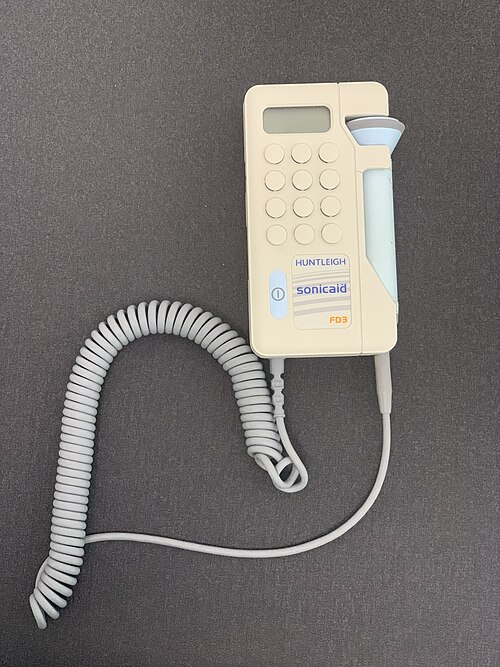

# CRESCIMENTO INTRAUTERINO RESTRITO

Para começar nossa conversa, preciso que você esqueça a ideia de que Crescimento Intrauterino Restrito (RCF ou CIUR) e Pequeno para a Idade Gestacional (PIG) são sinônimos. Esse é o erro número um nas provas de residência e, infelizmente, na prática clínica.

Um feto PIG é aquele cujo peso estimado está abaixo do percentil 10 para a idade gestacional. Ponto. Isso é uma descrição estatística. Já a Restrição de Crescimento Fetal (RCF) é um conceito dinâmico e patológico: é o feto que não atingiu seu potencial genético de crescimento devido a algum insulto, geralmente de origem placentária.

Imagine um feto que deveria pesar no percentil 70, mas, por uma insuficiência placentária, nasce no percentil 15. Ele não é PIG (está acima do p10), mas ele sofreu restrição de crescimento. Por outro lado, temos o "PIG constitucional", que é o feto pequeno, filho de pais pequenos, com Doppler normal e vitalidade preservada. Ele é apenas o "baixinho saudável" da turma. Entender essa distinção é o que separa quem acerta a questão de quem cai na pegadinha da banca.

## Fisiopatologia: O Porquê da Restrição

*Figura 1 - Imagem de ultrassonografia 3D de um feto. A biometria fetal por USG é fundamental para o diagnóstico e acompanhamento da restrição de crescimento intrauterino. Fonte: Biagio Azzarelli, CC BY-SA 2.0 | Wikimedia Commons*

A grande vilã da história, na maioria das vezes, é a placenta. Para que uma gestação evolua bem, as células do citotrofoblasto extravilositário precisam invadir as artérias espiraladas maternas. Esse processo transforma vasos de alta resistência e baixo fluxo em vasos de baixa resistência e alto fluxo.

Quando essa invasão falha, temos a insuficiência uteroplacentária. O feto começa a receber menos oxigênio e nutrientes. Como ele reage? Ele prioriza. É o que chamamos de "Brain Sparing" ou centralização fetal. O sangue é desviado dos órgãos periféricos (rins, pulmões, intestino, membros) para os órgãos nobres: cérebro, coração e adrenais.

É por isso que, no ultrassom, a circunferência abdominal (CA) é a primeira a cair. O fígado perde seus depósitos de glicogênio e o feto para de crescer "de lado". Se o insulto for muito precoce (no primeiro trimestre), o feto não consegue nem começar a crescer direito, resultando no padrão simétrico. Se for mais tardio, temos o padrão assimétrico.

## Classificação: Simétrico vs. Assimétrico

*Figura 2 - Monitor Doppler fetal portátil (Sonicaid). A Dopplerfluxometria é essencial para avaliar a vitalidade fetal e o grau de insuficiência placentária no CIUR. Fonte: Whispyhistory, CC BY-SA 4.0 | Wikimedia Commons*

As bancas adoram cobrar a diferença entre o Tipo I (Simétrico) e o Tipo II (Assimétrico). Vamos organizar isso de forma definitiva.

### RCF Simétrico (Tipo I)

Ocorre em cerca de 20% dos casos. O insulto acontece precocemente, na fase de hiperplasia celular. Se o dano ocorre quando as células estão se multiplicando, o feto inteiro será menor.

- **Causas:** Cromossomopatias (Trissomia do 18, por exemplo), infecções congênitas do primeiro trimestre (TORCH) ou drogas lícitas/ilícitas.

- **Relação CC/CA:** Normal (já que tudo está reduzido proporcionalmente).

- **Prognóstico:** Geralmente reservado, pois a causa é intrínseca ao feto.

### RCF Assimétrico (Tipo II)

É o mais comum (80%). O insulto ocorre no segundo ou terceiro trimestre, na fase de hipertrofia celular. O feto já tinha um número adequado de células, mas elas não cresceram por falta de "combustível" (nutrientes).

- **Causas:** Insuficiência placentária, frequentemente associada à Hipertensão Arterial ou Pré-eclâmpsia.

- **Relação CC/CA:** Aumentada (o perímetro cefálico é preservado enquanto a barriga é pequena).

- **Prognóstico:** Melhor, se manejado corretamente, pois o problema é o aporte externo.

### Tabela 1: Comparativo dos Tipos de RCF

| Característica | Simétrico (Tipo I) | Assimétrico (Tipo II) |
| --- | --- | --- |
| Momento do Insulto | Início da gestação (1º tri) | Final da gestação (2º/3º tri) |
| Proporcionalidade | Proporcional (CC, CA e CP baixos) | Desproporcional (CA muito baixo) |
| Fisiopatologia | Redução do número de células | Redução do tamanho das células |
| Causa Principal | Genética, Infecções, Drogas | Insuficiência Placentária (DHEG) |
| Relação CC/CA | Mantida | Aumentada |

## Diagnóstico e Rastreamento

Como suspeitar? Na consulta de pré-natal, o rastreamento é feito com a medida da Altura Uterina (AU). Se a AU estiver 3 cm ou mais abaixo do esperado para a idade gestacional, o sinal de alerta deve acender.

O diagnóstico de certeza, porém, é ultrassonográfico. Utilizamos o Peso Fetal Estimado (PFE). Segundo a FEBRASGO e os critérios de Hadlock, o diagnóstico de RCF é feito quando:

- Peso Fetal Estimado < Percentil 3.

- Peso Fetal Estimado entre o Percentil 3 e 10, associado a alterações no Doppler (Artéria Umbilical ou Cerebral Média).

Cuidado: se o feto está no percentil 8, mas o Doppler é rigorosamente normal, ele pode ser apenas um PIG constitucional. Mas, se o Doppler da artéria umbilical mostrar resistência aumentada, ele é um RCF.

## A Ferramenta de Ouro: Dopplerfluxometria

Se você quer passar na residência, precisa dominar o Doppler. Ele não serve apenas para diagnóstico, mas principalmente para definir o momento do parto. Como o Dr. Will sempre reforça em suas discussões no MedEvo, o Doppler nos diz como o feto está "se sentindo" diante da escassez.

### 1. Artérias Uterinas

Avaliam a circulação materna. Elas não diagnosticam RCF, elas predizem o risco.

- **Incisura Protodiastólica:** É normal até 24-26 semanas. Se persistir após esse período, indica que a invasão trofoblástica foi incompleta. Isso aumenta muito o risco de RCF e Pré-eclâmpsia no futuro.

### 2. Artéria Umbilical

Avalia a placenta. É um vaso que deve ter baixa resistência (muito sangue indo para a placenta na diástole).

- **Resistência Aumentada:** A placenta está "entupida".

- **Diástole Zero:** Situação grave. Mais de 70% dos vasos placentários estão comprometidos.

- **Diástole Reversa:** Situação crítica. O sangue volta para o feto durante a diástole. Risco iminente de morte.

### 3. Artéria Cerebral Média (ACM)

Avalia a resposta fetal (centralização). Normalmente, a ACM é um vaso de alta resistência (o cérebro é protegido).

- **Centralização:** Quando o feto percebe a hipóxia, ele dilata a ACM para receber mais sangue. O Índice de Pulsatilidade (IP) da ACM cai.

- **Relação Cérebro-Placentária (RCP):** É a divisão do IP da ACM pelo IP da Umbilical. É o marcador mais sensível e precoce de centralização. Se RCP < 1, temos centralização.

### 4. Ducto Venoso

É o "último suspiro" antes da falência cardíaca. Ele avalia o átrio direito.

- **Onda A:** Representa a contração atrial.

- **Onda A ausente ou reversa:** Indica que o coração não está mais aguentando a sobrecarga. É indicação de parto imediato, independente da idade gestacional (respeitando os limites de viabilidade), pois o risco de morte súbita é altíssimo.

## Estadiamento e Conduta (Classificação de Barcelona)

Atualmente, a conduta na RCF é guiada pelo estadiamento. Isso evita partos prematuros desnecessários e evita mortes evitáveis.

### Estágio I (Insuficiência Placentária Leve)

- **Critérios:** PFE < p3 OU RCP < p5 OU IP da Artéria Umbilical > p95.

- **Significado:** O feto está começando a se adaptar.

- **Conduta:** Vigilância semanal. Parto com 37 semanas.

### Estágio II (Insuficiência Placentária Grave)

- **Critérios:** Diástole Zero na Artéria Umbilical.

- **Significado:** Grande comprometimento placentário.

- **Conduta:** Vigilância a cada 48-72h. Parto com 34 semanas.

### Estágio III (Acidose Fetal Suspeita)

- **Critérios:** Diástole Reversa na Umbilical OU IP do Ducto Venoso > p95.

- **Significado:** O feto está entrando em sofrimento.

- **Conduta:** Vigilância a cada 12-24h. Parto com 30 semanas.

### Estágio IV (Acidose Fetal Grave / Risco de Morte)

- **Critérios:** Onda A reversa no Ducto Venoso OU Cardiotocografia (CTG) computadorizada com variabilidade reduzida.

- **Significado:** Morte iminente.

- **Conduta:** Parto imediato (acima de 26 semanas).

### Tabela 2: Resumo de Condutas por Doppler

| Achado Doppler | Significado Clínico | Idade Gestacional para Parto |
| --- | --- | --- |
| Doppler Normal (PIG) | Feto constitucional | 40 semanas |
| Alteração de RCP ou Art. Uterina | RCF Estágio I | 37 semanas |
| Diástole Zero (Art. Umbilical) | RCF Estágio II | 34 semanas |
| Diástole Reversa (Umbilical) | RCF Estágio III | 30 semanas |
| Ducto Venoso (Onda A reversa) | RCF Estágio IV | Imediato (>26 sem) |

## Situações Especiais e Pegadinhas de Prova

### O Mistério da RCF Tardia

A RCF que ocorre após 32-34 semanas é traiçoeira. Diferente da precoce, ela raramente apresenta diástole zero na umbilical. O feto morre com Doppler de umbilical normal! Por quê? Porque a placenta não está tão destruída, mas o feto tem baixa reserva. Nesses casos, a **Relação Cérebro-Placentária (RCP)** e o Doppler da **Artéria Cerebral Média** são muito mais importantes que a umbilical. Se a prova trouxer um feto de 36 semanas, peso no p8 e RCP alterada, a conduta é interrupção.

### Corticoterapia e Sulfato de Magnésio

Se você decidir interromper a gestação antes de 34 semanas, a corticoterapia antenatal (Betametasona ou Dexametasona) é obrigatória para maturação pulmonar e redução de hemorragia intraventricular. Se for antes de 32 semanas, o Sulfato de Magnésio para neuroproteção fetal também deve ser administrado.

Cuidado: em casos de Estágio IV (Ducto Venoso reverso), não se espera 48h pelo efeito do corticoide. O feto vai morrer se você esperar. O parto é imediato.

### Oligoidrâmnio

A redução do líquido amniótico na RCF é um sinal de redistribuição de fluxo. O feto manda menos sangue para os rins para poupar o cérebro, logo, urina menos. O ILA (Índice de Líquido Amniótico) < 5 cm ou o Maior Bolsão Vertical (MBV) < 2 cm são marcadores de sofrimento fetal crônico.

### Tabela 3: Diagnóstico Diferencial de Crescimento Fetal

| Parâmetro | PIG Constitucional | RCF Assimétrico | RCF Simétrico |
| --- | --- | --- | --- |
| Doppler Umbilical | Normal | Alterado (Resistência alta) | Geralmente Normal |
| Líquido Amniótico | Normal | Frequentemente reduzido | Normal ou Alterado |
| Curva de Crescimento | Segue o percentil | Queda de percentil | Segue o percentil (baixo) |
| Malformações | Ausentes | Raras | Frequentes |

## Manejo do Recém-Nascido (Pós-Natal)

O sofrimento não acaba no parto. O RN que sofreu restrição de crescimento tem uma série de desafios metabólicos. Como ele viveu em um ambiente de restrição, ele consumiu suas reservas.

- **Hipoglicemia:** Não há estoque de glicogênio hepático.

- **Hipotermia:** Falta gordura marrom para termogênese.

- **Policitemia:** O feto produz mais hemácias para tentar carregar o pouco oxigênio que chega. Isso aumenta a viscosidade sanguínea e pode causar icterícia neonatal.

- **Hipocalcemia:** Comum por distúrbios metabólicos agudos.

Além disso, temos as complicações respiratórias. A Síndrome do Pulmão Úmido (Taquipneia Transitória do RN) é comum em cesáreas eletivas sem trabalho de parto. Já a Síndrome do Desconforto Respiratório (SDR) por deficiência de surfactante é o grande medo no prematuro.

## Prevenção: O que podemos fazer antes?

Se uma paciente chega na primeira consulta de pré-natal com história de RCF anterior ou fatores de risco (hipertensão, lúpus, tabagismo), podemos intervir.

- **AAS (Aspirina) 100-150 mg/dia:** Deve ser iniciado idealmente antes de 16 semanas (segundo a FEBRASGO, a partir de 12 semanas) para pacientes com Doppler de artérias uterinas alterado ou alto risco clínico. O AAS ajuda na placentação.

- **Cálcio:** Se a ingestão dietética for baixa, a suplementação de cálcio reduz o risco de pré-eclâmpsia e, consequentemente, de RCF.

## Pontos-Chave para Prova

- **Definição de RCF:** Peso Fetal Estimado < p3 OU Peso < p10 com Doppler alterado.

- **PIG Constitucional:** Peso < p10, mas Doppler normal, líquido normal e pais pequenos. Conduta: vigilância e parto com 40 semanas.

- **Medida mais sensível no USG:** Circunferência Abdominal (CA). É a primeira a sofrer na restrição assimétrica.

- **Incisura Protodiastólica:** Normal até 24-26 semanas. Se persistir, indica risco de RCF e Pré-eclâmpsia.

- **Centralização Fetal:** IP da Artéria Cerebral Média baixo (vasodilatação) e IP da Artéria Umbilical alto (vasoconstrição placentária).

- **Relação Cérebro-Placentária (RCP):** Marcador mais precoce de centralização. Valor de corte < 1 ou < p5.

- **Diástole Zero na Umbilical:** Indica interrupção com 34 semanas.

- **Diástole Reversa na Umbilical:** Indica interrupção com 30 semanas.

- **Ducto Venoso com Onda A Reversa:** Indica parto imediato (acima de 26 semanas), risco de morte em 24-48h.

- **RCF Simétrico (Tipo I):** Insulto precoce, causas genéticas ou infecciosas. Pior prognóstico neurológico.

- **RCF Assimétrico (Tipo II):** Insulto tardio, causa placentária (DHEG). Mais comum em provas.

- **Complicações Neonatais:** Hipoglicemia, Hipotermia, Policitemia e Hipocalcemia.

- **Prevenção:** AAS 100mg iniciado antes de 16 semanas para pacientes de alto risco.

- **Oligoidrâmnio:** Sinal de redistribuição de fluxo (feto prioriza cérebro e reduz perfusão renal).

- **Erro clássico:** Achar que diástole zero é indicação de cesárea imediata em qualquer idade gestacional. Se o feto tiver 24 semanas, a conduta pode ser conservadora para tentar viabilidade, a menos que o ducto venoso altere.

- **Corticoterapia:** Indicada entre 24 e 34 semanas para acelerar maturidade pulmonar.

- **Sulfato de Magnésio:** Indicado para neuroproteção se parto iminente abaixo de 32 semanas. 🧠

 Cópia offline para consulta pessoal.
 Fonte original:
 [https://www.medevo.com.br/material-apoio/ler/543619e2-ce17-43f5-b5c5-ae516a78ff23](https://www.medevo.com.br/material-apoio/ler/543619e2-ce17-43f5-b5c5-ae516a78ff23)
