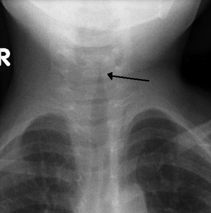
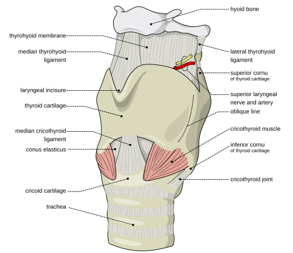

# CRUPE, LARINGOTRAQUEÍTE E ESTRIDOR AGUDO

Para começar nossa conversa, você precisa entender que o estridor não é um diagnóstico, mas um sinal clínico. Ele é o som audível da turbulência do fluxo de ar passando por uma via aérea superior estreitada. Como professor, vejo muitos alunos se desesperarem ao ouvir um estridor, mas a chave aqui é a sistematização.

*Figura 2 - Raio-X AP do pescoço de criança com crupe demonstrando o característico "sinal do campanário" (steeple sign), com estreitamento da coluna de ar subglótica. Fonte: Frank Gaillard/Radiopaedia, CC BY-SA 3.0 | Wikimedia Commons*

O estridor pode ser inspiratório, expiratório ou bifásico. Guarde esta regra de ouro para a sua prova e para a sua vida prática: se o estridor é puramente inspiratório, a obstrução está acima das cordas vocais ou na laringe (extratorácica). Se ele é expiratório, a obstrução é intratorácica (traqueia distal ou brônquios). Se for bifásico, o problema geralmente está no nível da glote ou subglote.

Por que as crianças são as maiores vítimas? Por causa da anatomia. A via aérea da criança é curta, em formato de funil e, o mais importante, o diâmetro é reduzido. De acordo com a Lei de Poiseuille, a resistência ao fluxo de ar é inversamente proporcional à quarta potência do raio. Isso significa que apenas 1 mm de edema na subglote de um lactente aumenta a resistência em 16 vezes e reduz a área de seção transversal em 75%. É por isso que uma laringite leve no adulto vira uma insuficiência respiratória grave na criança.

## Fisiopatologia e Anatomia Aplicada

*Figura 1 - Vista anterolateral da laringe, mostrando as cartilagens tireóide, cricóide e os músculos externos. A região subglótica (abaixo das cordas vocais) é o ponto mais estreito da via aérea pediátrica. Fonte: Olek Remesz (Orem), CC BY-SA 2.5 | Wikimedia Commons*

A região subglótica é o ponto mais estreito da via aérea pediátrica, circundada pelo anel cricóide. Como esse anel é cartilaginoso e completo, ele não expande. Se houver inflamação e edema da mucosa ali, o único caminho para o inchaço é para dentro, reduzindo o lúmen.

No Crupe Viral, que é a nossa famosa laringotraqueíte, o vírus (geralmente o Parainfluenza) invade a mucosa respiratória, causando infiltração de glóbulos brancos e edema. Isso gera a tríade clássica que as bancas amam: tosse ladrante (tosse de cachorro), rouquidão e estridor inspiratório.

Muitas vezes, o aluno confunde o Crupe Viral com o Crupe Espasmódico. O "porquê" da diferença é clínico: o viral tem pródromos catarrais (febre baixa, coriza) e dura dias. O espasmódico é súbito, geralmente noturno, sem febre, e a criança melhora rapidamente com o ar úmido ou frio. É como se fosse uma "asma da laringe", uma reação alérgica ou irritativa súbita.

## Crupe Viral (Laringotraqueíte Aguda)

Esta é a causa mais comum de obstrução aguda das vias aéreas superiores em crianças entre 6 meses e 3 anos. O agente etiológico número um, disparado em qualquer prova de residência, é o vírus Parainfluenza (tipos 1, 2 e 3). Outros agentes incluem o Influenza A e B, o Vírus Sincicial Respiratório (VSR) e o Adenovírus.

O quadro clínico costuma começar com uma infecção de vias aéreas superiores (IVAS) inespecífica. Após 12 a 48 horas, surge a tosse metálica, a rouquidão e o estridor. Um detalhe que o Dr. Will sempre reforça nas discussões de caso: o estridor no crupe leve só aparece quando a criança chora ou fica agitada. Se o estridor está presente em repouso, o quadro já é, no mínimo, moderado.

### Diagnóstico e Exames Complementares

O diagnóstico do crupe é eminentemente clínico. Você não precisa de raio-x para diagnosticar uma laringotraqueíte viral típica. Na verdade, levar uma criança com estridor para a sala de radiologia pode ser perigoso se ela descompensar lá.

No entanto, as bancas adoram cobrar o sinal radiológico clássico: o "Sinal da Torre" ou "Sinal do Lápis". Na radiografia em AP do pescoço, observa-se um estreitamento da coluna de ar subglótica. Cuidado: 50% das crianças com crupe têm raio-x normal, então o exame serve mais para excluir outros diagnósticos (como corpo estranho ou epiglotite) do que para confirmar o crupe.

Outra "pérola" de prova: o sinal da "Vela de Barco" no raio-x de tórax de um lactente. Isso não tem nada a ver com obstrução, é apenas o timo normal. Se aparecer na sua prova, a conduta é expectante.

### Classificação de Gravidade (Escore de Westley)

Para tratar, você precisa classificar. O Escore de Westley é o padrão-ouro, mas na hora da prova, você pode simplificar mentalmente:

| Classificação | Achados Clínicos |
| --- | --- |
| **Leve** | Tosse ladrante, rouquidão, mas SEM estridor em repouso. |
| **Moderada** | Estridor em repouso, retrações leves a moderadas (tiragem subcostal/intercostal). |
| **Grave** | Estridor acentuado em repouso, retrações graves, agitação ou letargia (sinal de hipóxia). |
| **Insuficiência Respiratória Iminente** | Cianose, consciência deprimida, murmúrio vesicular diminuído, estridor que "some" (porque o fluxo de ar é quase zero). |

## Manejo Terapêutico do Crupe

Aqui é onde a maioria dos alunos erra por querer "economizar" medicação. Segundo as diretrizes da Sociedade Brasileira de Pediatria (SBP), o tratamento baseia-se em dois pilares: Corticoides e Epinefrina.

### 1. Corticosteroides

Todo paciente com crupe, mesmo o leve, deve receber corticoide. Por quê? Porque ele reduz a taxa de hospitalização e a necessidade de intervenções posteriores.

- **Dexametasona:** É a droga de escolha devido à sua longa meia-vida (36 a 72 horas).

- **Dose:** 0,6 mg/kg (dose única), via oral ou intramuscular. A dose máxima costuma ser 16 mg.

- **Alternativa:** Se a criança estiver vomitando muito, pode-se usar a via IM ou EV, mas a absorção oral é excelente.

### 2. Epinefrina (Adrenalina) Nebulizada

Indicada apenas para casos moderados a graves (estridor em repouso).

- **Mecanismo:** Age nos receptores alfa-1 adrenérgicos causando vasoconstrição das arteríolas da mucosa subglótica, reduzindo o edema rapidamente (em 10 a 30 minutos).

- **Dose:** Epinefrina padrão (1:1000) na dose de 0,5 ml/kg (máximo de 5 ml). Não precisa diluir se o volume for suficiente.

- **Observação Importante:** O efeito da adrenalina é fugaz (dura cerca de 2 horas). Existe o "efeito rebote", onde o edema volta após o fim da ação da droga. Por isso, toda criança que recebe adrenalina deve ficar em observação por, no mínimo, 3 a 4 horas. Se após esse tempo ela não tiver estridor em repouso, pode ir para casa (desde que tenha tomado o corticoide).

### 3. Oxigenoterapia e Suporte

Só ofereça oxigênio se a saturação estiver abaixo de 92%. Tente fazer isso de forma não invasiva (cateter nasal ou máscara), evitando agitar a criança. Lembre-se: criança chorando = mais turbulência = mais obstrução. No MedEvo, sempre enfatizamos: "colo de mãe" é terapêutico no crupe.

## Diagnóstico Diferencial: Onde moram as pegadinhas

Aqui é onde o examinador separa quem decorou de quem entende. Vamos analisar os principais diferenciais do estridor agudo.

### Epiglotite Aguda (Supraglotite)

Antigamente era causada pelo *Haemophilus influenzae* tipo B (HiB). Com a vacinação, tornou-se rara, mas ainda cai muito em prova.

- **Quadro:** Início súbito, febre alta, toxemia, dor de garganta intensa e sialorreia (a criança não deglute a própria saliva).

- **Postura:** Posição de tripé (sentada, inclinada para frente, pescoço estendido e boca aberta).

- **O que NÃO fazer:** Nunca use abaixador de língua ou tente visualizar a garganta se suspeitar de epiglotite. Isso pode causar um laringoespasmo reflexo e parada respiratória total.

- **Raio-X:** Sinal do polegar (edema da epiglote).

- **Conduta:** Emergência médica. A prioridade absoluta é garantir a via aérea (intubação em centro cirúrgico). Depois, antibiótico (Ceftriaxona).

### Traqueíte Bacteriana

Pense nela como uma complicação do crupe viral ou uma infecção primária por *Staphylococcus aureus*.

- **Quadro:** A criança parece ter um crupe, mas não melhora com adrenalina e evolui com febre alta e aspecto toxêmico. Há produção de secreção purulenta espessa que obstrui a traqueia.

- **Conduta:** Intubação (frequentemente necessária devido aos plugues de secreção) e antibioticoterapia IV.

### Aspiração de Corpo Estranho

- **Quadro:** História de início súbito de engasgo e tosse enquanto a criança brincava ou comia. Geralmente sem febre e sem pródromos virais.

- **Exame Físico:** MV diminuído unilateralmente ou estridor se o corpo estranho estiver na laringe.

- **Diagnóstico:** Broncoscopia é o padrão-ouro (diagnóstica e terapêutica). O raio-x pode mostrar aprisionamento de ar (hipertransparência localizada).

### Laringomalácia (A causa congênita)

Se a questão fala de um lactente de 2 semanas a 2 meses com estridor desde o nascimento, pare tudo. É laringomalácia até que se prove o contrário.

- **Fisiopatologia:** Imaturidade da cartilagem laríngea, que colapsa para dentro da via aérea durante a inspiração.

- **Clínica:** Estridor inspiratório que piora quando a criança está agitada, chorando ou em decúbito dorsal. Melhora significativamente em posição pronada (de bruços).

- **Diagnóstico:** Videofibronasolaringoscopia (mostra a epiglote em ômega e o colapso das aritenoides).

- **Conduta:** Na maioria dos casos (90%), é conservadora. O quadro regride espontaneamente até os 18-24 meses.

| Doença | Etiologia | Início | Febre | Sinal Marcante |
| --- | --- | --- | --- | --- |
| **Crupe Viral** | Parainfluenza | Gradual | Baixa | Tosse ladrante / Sinal da Torre |
| **Epiglotite** | Bacteriana (HiB) | Súbito | Alta | Sialorreia / Posição de Tripé |
| **Traqueíte** | S. aureus | Variável | Alta | Resposta ruim à adrenalina |
| **Corpo Estranho** | Acidental | Súbito | Ausente | História de engasgo |
| **Laringomalácia** | Congênita | Semanas | Ausente | Melhora em decúbito ventral |

## Estridor e Insuficiência Respiratória: Quando Internar?

Muitos alunos me perguntam: "Professor, quando eu mando para casa?". A resposta depende da resposta terapêutica.

De acordo com os protocolos vigentes, os critérios para internação (enfermaria ou UTI) são:

- Estridor em repouso persistente após corticoide e adrenalina.

- Desconforto respiratório moderado a grave (tiragens persistentes).

- Hipoxemia (SatO2 < 92% em ar ambiente).

- Alteração do nível de consciência (agitação ou letargia).

- Dificuldade de ingestão oral ou sinais de desidratação.

- Crianças com menos de 6 meses (limiar de internação mais baixo).

- Fatores sociais (pais que moram longe ou não conseguem observar a criança).

Se a criança recebeu adrenalina, ela deve ficar em observação por 3 a 4 horas. Se após esse período ela estiver sem estridor em repouso, com boa entrada de ar e os pais forem confiáveis, ela pode receber alta com orientações.

## Complicações e Prognóstico

O crupe viral é, na imensa maioria das vezes, uma doença autolimitada com excelente prognóstico. A complicação mais comum é a extensão da infecção para os brônquios (laringotraqueobronquite) ou a pneumonia viral.

A complicação bacteriana secundária mais temida é a traqueíte bacteriana, que já discutimos. Por isso, se um paciente com crupe "ia bem" e de repente "piora muito" com febre alta, você deve mudar sua suspeita diagnóstica.

No caso da Laringomalácia, a principal complicação é o baixo ganho ponderal e a dificuldade de alimentação (disfagia). Se a criança não ganha peso ou tem episódios de apneia e cianose, o tratamento deixa de ser conservador e passa a ser cirúrgico (supraglotoplastia).

## Situações Especiais e Erros Comuns

Um erro clássico que vejo em provas é a indicação de antibióticos para o crupe viral. Lembre-se: é viral. Antibiótico não tem papel, a menos que haja suspeita de traqueíte bacteriana ou pneumonia associada.

Outro ponto: a nebulização com vapor de água (inalação fria ou úmida). Embora seja uma prática comum e ajude no crupe espasmódico, as evidências científicas para o crupe viral são fracas. Não é proibido, mas nunca deve atrasar o uso da Dexametasona ou da Adrenalina.

Sobre a via de administração da Dexametasona: a via oral é tão eficaz quanto a intramuscular para casos leves e moderados. Reserve a IM/EV para crianças que estão vomitando ou em insuficiência respiratória grave, onde você não quer perder tempo ou arriscar uma broncoaspiração.

## Pontos-Chave para Prova

- **Agente Etiológico:** Parainfluenza (tipos 1, 2 e 3) é o principal causador do Crupe Viral.

- **Tríade do Crupe:** Tosse ladrante, rouquidão e estridor inspiratório.

- **Tratamento Base:** Corticoide (Dexametasona 0,6 mg/kg) para TODOS os casos, inclusive leves.

- **Estridor em Repouso:** Indica gravidade moderada/grave. Conduta: Adrenalina nebulizada (0,5 ml/kg) + Corticoide.

- **Observação Pós-Adrenalina:** Mínimo de 3 a 4 horas pelo risco de efeito rebote.

- **Epiglotite Aguda:** Emergência! Sialorreia, posição de tripé, febre alta. NÃO examine a orofaringe. Conduta: Garantir via aérea (intubação).

- **Laringomalácia:** Causa mais comum de estridor congênito. Melhora em decúbito ventral (prono) e piora em decúbito dorsal (supino).

- **Sinal da Torre (ou Lápis):** Estreitamento subglótico no raio-x de pescoço (sugestivo de crupe).

- **Sinal do Polegar:** Edema de epiglote no raio-x lateral (sugestivo de epiglotite).

- **Corpo Estranho:** Início súbito, sem febre, história de engasgo. Padrão-ouro: Broncoscopia.

- **Traqueíte Bacteriana:** Crupe que não melhora com adrenalina + febre alta + toxemia.

- **Contraindicação Absoluta:** Não use sedativos em crianças com obstrução de via aérea superior, pois isso mascara a agitação (sinal de hipóxia) e deprime o drive respiratório.

- **Dose de Adrenalina:** 0,5 ml/kg de adrenalina 1:1000, máximo de 5 ml por nebulização.

- **Dose de Dexametasona:** 0,15 a 0,6 mg/kg. A maioria das bancas usa 0,6 mg/kg como padrão.

- **Diagnóstico Diferencial de Estridor:** Inspiratório (extratorácico), Expiratório (intratorácico), Bifásico (glote/subglote).

- **Sinal da Vela de Barco:** Achado normal do timo em raio-x de tórax de lactentes; não confunda com patologia. 🩺

 Cópia offline para consulta pessoal.
 Fonte original:
 [https://www.medevo.com.br/material-apoio/ler/57282ec8-31ea-4cc8-9724-92e67471b60e](https://www.medevo.com.br/material-apoio/ler/57282ec8-31ea-4cc8-9724-92e67471b60e)
