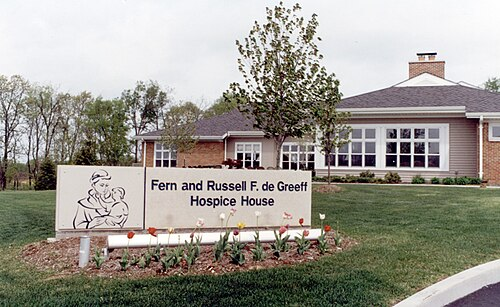

# CUIDADOS DE FIM DE VIDA

Para entender cuidados de fim de vida, você precisa primeiro desconstruir um mito que as bancas de residência adoram explorar: a ideia de que Cuidados Paliativos (CP) são sinônimos de "não há mais nada a fazer" ou que se aplicam apenas aos últimos dias de vida.

Na verdade, segundo a Organização Mundial da Saúde (OMS) e a Academia Nacional de Cuidados Paliativos (ANCP), os CP devem ser integrados precocemente no curso de qualquer doença que ameace a continuidade da vida. O "fim de vida" é apenas uma fase — a fase final — desse espectro. Aqui, o foco deixa de ser a modificação da doença e passa a ser, quase exclusivamente, o alívio do sofrimento e a preservação da dignidade.

## Definições e Princípios Bioéticos

*Figura 1 - St. Christopher's Hospice em Londres, fundado em 1967 por Dame Cicely Saunders, considerado o berço do movimento moderno de cuidados paliativos e hospice. Fonte: Stephen Craven, CC BY-SA 2.0 | Wikimedia Commons*

Antes de falarmos de doses de morfina, precisamos alinhar os conceitos éticos. No Brasil, o Código de Ética Médica (CEM) e as resoluções do Conselho Federal de Medicina (CFM) são as bases para as questões de prova.

### A Quadrilogia da Morte

*Figura 2 - De Greeff Hospice House (Missouri, EUA), exemplo de unidade de cuidados paliativos integrada a um centro médico. O ambiente busca proporcionar conforto e dignidade aos pacientes em fase final de vida. Fonte: Kevin McDaniel/SAMCSTL, CC BY 3.0 | Wikimedia Commons*

Este é o tópico que mais gera confusão. Entenda a diferença fundamental entre as quatro terminologias:

- **Eutanásia:** Abreviar a vida do paciente a pedido dele ou de terceiros. É **crime** no Brasil. A intenção é a morte.

- **Distanásia:** É o prolongamento fútil do processo de morrer através de tratamentos desproporcionais. É o "obstinação terapêutica". Gera sofrimento sem benefício.

- **Ortotanásia:** É a morte no tempo certo. Significa não acelerar nem prolongar artificialmente o processo de morrer, garantindo conforto. É o que defendemos nos Cuidados Paliativos.

- **Mistanásia:** É a "morte social". Ocorre por falta de assistência, por negligência do Estado ou por desigualdade de acesso à saúde.

**Dica de Prova:** A banca vai colocar um cenário de um paciente terminal e perguntar se suspender um ventilador mecânico fútil é eutanásia. A resposta é **NÃO**. Isso é ortotanásia e é um dever ético do médico evitar a distanásia.

### O Princípio do Duplo Efeito

Muitos alunos têm medo de prescrever opioides em doses altas por receio de "matar o paciente". O Princípio do Duplo Efeito diz que, se você realiza uma ação com uma intenção boa (aliviar a dor), mas essa ação tem um efeito colateral indesejado, porém previsto (como a depressão respiratória), a ação é eticamente aceitável, desde que o objetivo principal não seja a morte e que a dose seja proporcional ao sintoma.

Na prática clínica e nas provas da MedEvo, lembre-se: a intenção define a ética da conduta.

## Comunicação e Tomada de Decisão

Em fim de vida, a comunicação é um procedimento médico tão importante quanto uma intubação em uma emergência.

### Diretivas Antecipadas de Vontade (DAV)

As DAVs (ou Testamento Vital) são documentos onde o paciente registra quais tratamentos deseja ou não receber caso perca a capacidade de decidir.

- **Hierarquia:** A vontade do paciente expressa na DAV prevalece sobre o desejo da família.

- **Validade:** No Brasil, não é obrigatório o registro em cartório para que a DAV seja válida, embora seja recomendável para evitar conflitos jurídicos.

### Decisão Compartilhada

Quando o paciente não tem DAV e está incapaz, a decisão deve ser compartilhada entre a equipe multi e a família (ou representante legal). O foco deve ser sempre o "melhor interesse do paciente" e a "vontade presumida" (o que ele diria se pudesse falar?).

## Manejo de Sintomas no Fim de Vida

Aqui entramos na parte prática. O paciente em fase ativa de morte (últimas horas ou dias) apresenta sintomas específicos que exigem manejo agressivo.

### 1. Dor e Dispneia

A morfina é a droga de escolha para ambos.

- **Por que morfina para dispneia?** Ela reduz a percepção de "fome de ar" ao agir nos receptores opioides centrais e reduz a pré-carga cardíaca.

- **Mito de Prova:** "Morfina causa depressão respiratória fatal em pacientes terminais". **Falso**. Em doses tituladas, ela melhora o padrão respiratório ao reduzir a ansiedade e o esforço.

**Tabela 1: Manejo Farmacológico Inicial**

| Sintoma | Droga de Escolha | Via Preferencial | Observação |
| --- | --- | --- | --- |
| Dor Moderada/Grave | Morfina | SC ou IV | Iniciar com doses baixas (1-2mg) e titular. |
| Dispneia | Morfina | SC ou IV | Dose costuma ser 25-50% da dose usada para dor. |
| Ansiedade/Agitação | Midazolam | SC ou IV | Útil para sedação paliativa se refratário. |
| Secreção Ruidosa | Escopolamina (Buscopan) | SC ou IV | Age reduzindo a produção de secreção (anticolinérgico). |

### 2. Secreção Ruidosa ("Estertor Terminal")

Aquele ruído de "garreio" que a família ouve e acha que o paciente está sufocando.

- **Conduta:** Posicionamento (decúbito lateral) e anticolinérgicos (Butilbrometo de Escopolamina).

- **Erro Clássico:** Aspirar o paciente. **NÃO ASPIRE**. A aspiração é traumática, causa tosse, aumenta a produção de secreção e gera desconforto. O ruído incomoda a família, não o paciente que está em rebaixamento de consciência.

### 3. Delirium e Agitação

O delirium terminal é comum. Primeiro, exclua causas reversíveis (bexigoma, impactação fecal, dor). Se for refratário e causar sofrimento, usamos neurolépticos (Haloperidol) ou benzodiazepínicos (Midazolam) se houver componente de ansiedade importante.

## Sedação Paliativa vs. Euthanasia

Este é o "pulo do gato" das provas de residência. Você precisa saber diferenciar os dois conceitos perfeitamente.

**Sedação Paliativa:** É a redução intencional da consciência (podendo chegar ao coma) para aliviar um **sintoma refratário** (dor, dispneia ou sofrimento existencial que não respondeu a nada).

- **Intenção:** Aliviar sofrimento.

- **Desfecho:** A morte ocorre pela evolução natural da doença.

- **Monitorização:** Não se monitora saturação ou sinais vitais para ajustar a dose, mas sim o nível de conforto (Escala de Richmond - RASS).

**Tabela 2: Diferenças Cruciais**

| Característica | Sedação Paliativa | Eutanásia |
| --- | --- | --- |
| **Objetivo** | Aliviar sintoma refratário | Causar a morte |
| **Dose** | Titulada conforme o conforto | Letal (dose única e alta) |
| **Resultado** | Alívio do sofrimento | Óbito imediato |
| **Legalidade (Brasil)** | Ética e Legal | Ilegal (Crime) |

## Via de Administração: A Hipodermóclise

No fim de vida, o acesso venoso costuma ser difícil (edema, fragilidade capilar). A **hipodermóclise** (via subcutânea) é a nossa melhor amiga.

- **Vantagens:** Baixo risco de infecção, pode ser mantida por até 7 dias, permite infusão de fluidos (até 1500ml/24h por sítio) e diversas medicações.

- **O que NÃO pode fazer via SC:** Eletrólitos concentrados (KCl > 20mEq/L), fenitoína, diazepam (irrita o tecido).

- **O que PODE:** Morfina, Midazolam, Haloperidol, Escopolamina, Metoclopramida, Ceftriaxona.

Como o Dr. Will sempre reforça nas discussões de caso, a hipodermóclise preserva a dignidade do paciente ao evitar múltiplas punções venosas dolorosas em um momento de fragilidade.

## Situações Específicas: Demência e DPOC

### Demência Avançada

Em pacientes com Alzheimer em estágio terminal (GDS 7), a disfagia é um processo natural.

- **Pérola Clínica:** A passagem de sonda nasoenteral (SNE) ou gastrostomia (GTT) **não previne pneumonia aspirativa**, não aumenta a sobrevida e não melhora a qualidade de vida. O foco deve ser "confort feeding" (oferta de alimento por prazer, na consistência que o paciente tolera) e hidratação de mucosas.

### DPOC Avançada

O manejo da dispneia é o pilar. Além da morfina, o uso de oxigênio só é indicado se houver hipoxemia documentada e se trouxer alívio subjetivo. Se o paciente está em fim de vida e a VNI (Ventilação Não Invasiva) está causando mais angústia do que alívio, ela deve ser retirada.

## O Processo de Morte e o Atestado de Óbito

O médico tem obrigações legais após o falecimento. O preenchimento da Declaração de Óbito (DO) é uma competência frequentemente cobrada.

### Quem deve assinar a DO?

- **Morte por Causa Natural com Assistência Médica:** O médico assistente (que acompanhava o paciente).

- **Morte por Causa Natural sem Assistência Médica (em cidades com SVO):** Serviço de Verificação de Óbitos.

- **Morte por Causa Natural em local sem SVO:** O médico do serviço público de saúde local (ou o médico da família).

- **Morte por Causa Externa (Violenta ou Suspeita):** SEMPRE o IML (Instituto Médico Legal), independentemente do tempo de internação.

**Tabela 3: Preenchimento da DO (Parte I)**

| Linha | Conteúdo | Exemplo |
| --- | --- | --- |
| **A (Causa Terminal)** | Doença/estado que causou a morte direta | Insuficiência Respiratória Aguda |
| **B (Causa Intermediária)** | O que levou à linha A | Pneumonia Aspirativa |
| **C (Causa Intermediária)** | O que levou à linha B | Demência de Alzheimer Avançada |
| **D (Causa Básica)** | A doença que iniciou tudo | (Pode ser a mesma da C ou deixada em branco se C for a básica) |

**Parte II:** Doenças preexistentes que contribuíram para a morte, mas não entraram na sequência direta (ex: Hipertensão Arterial, Diabetes).

## Luto e Suporte Familiar

O cuidado paliativo não termina com o óbito; ele se estende ao suporte ao luto. Elizabeth Kübler-Ross descreveu as 5 fases do luto, que você deve conhecer para identificar em qual momento a família se encontra:

- **Negação:** "Os exames devem estar errados".

- **Raiva:** "Por que com ele? A culpa é do médico".

- **Barganha:** "Se ele viver até o Natal, eu farei tal promessa".

- **Depressão:** Tristeza profunda, isolamento.

- **Aceitação:** Compreensão da finitude e paz.

Lembre-se: essas fases não são lineares. O paciente ou a família podem oscilar entre elas.

## Cuidados Paliativos Pediátricos

Diferente do adulto, onde muitas vezes focamos na terminalidade, na pediatria os CP são indicados para crianças com condições limitantes da vida (como malformações congênitas graves ou doenças genéticas progressivas) desde o diagnóstico.

- **Ponto Chave:** A equipe deve validar as emoções da família e pode demonstrar empatia. O choro da equipe, se controlado e humano, não é sinal de falta de profissionalismo, mas de humanização.

## Retirada de Suporte de Vida (Desmame de Conforto)

Quando se decide que uma medida é fútil (ex: ventilação mecânica em paciente com câncer metastático sem proposta terapêutica e em falência de múltiplos órgãos), a retirada deve ser planejada.

- Assegurar analgesia e sedação (Morfina + Midazolam) **antes** de reduzir os parâmetros do ventilador.

- Extubação paliativa ou apenas redução de parâmetros (desmame terminal).

- Presença da família deve ser estimulada.

Isso não é "desistir do paciente", é permitir que a morte ocorra sem a barreira tecnológica que impede o toque e a despedida.

## Pontos-Chave para Prova 🩺

- **Ortotanásia é o objetivo:** Morte digna, sem abreviar (eutanásia) e sem prolongar futilmente (distanásia).

- **Morfina na Dispneia:** É a droga de primeira escolha. Age no centro respiratório e nos receptores periféricos, reduzindo a sensação de sufocamento.

- **Sedação Paliativa:** Só é indicada para **sintomas refratários**. O objetivo é conforto, não a morte. O midazolam é o fármaco mais usado.

- **Diretivas Antecipadas (DAV):** Têm valor legal e ético superior ao desejo da família.

- **Hipodermóclise:** Via preferencial no fim de vida domiciliar ou hospitalar para conforto. Evitar diazepam e eletrólitos concentrados.

- **Demência Avançada:** Sondas alimentares (SNE/GTT) são contraindicadas por futilidade e risco de danos.

- **Atestado de Óbito:** Morte por causa externa (queda, acidente, crime) é **sempre IML**, mesmo que o paciente morra 1 mês depois no hospital.

- **Princípio do Duplo Efeito:** Justifica o uso de doses altas de opioides para controle de dor, mesmo que haja risco de depressão respiratória.

- **Secreção Ruidosa:** Tratar com posicionamento e escopolamina. **Nunca aspirar**.

- **Comunicação:** O protocolo SPIKES é a ferramenta padrão para comunicação de más notícias.

- **Luto:** As fases de Kübler-Ross não são obrigatórias nem lineares.

- **Nutrição/Hidratação:** No fim de vida (fase ativa de morte), a desidratação pode ser benéfica (menos secreção pulmonar, menos edema, efeito anestésico natural pela cetose). Não force hidratação vigorosa.

- **O que NÃO fazer:** Não solicitar exames laboratoriais de rotina, não aferir sinais vitais de forma invasiva e não manter antibióticos em pacientes em processo ativo de morte sem benefício clínico claro.

- **Morfina e Miose:** Se um paciente em paliação apresentar miose e apneia por opioide, mas ainda houver benefício em mantê-lo vivo (ex: espera de um familiar), o Naloxone pode ser usado em doses baixas e tituladas para reverter a depressão respiratória sem reverter toda a analgesia.

- **Cuidados Paliativos Gerais vs. Especializados:** O generalista (você na enfermaria ou UBS) deve saber manejar sintomas básicos. O especialista entra em casos de sintomas refratários ou conflitos familiares graves.

 Cópia offline para consulta pessoal.
 Fonte original:
 [https://www.medevo.com.br/material-apoio/ler/a6d0b14b-cd3b-4b19-aba7-f9684c504ab5](https://www.medevo.com.br/material-apoio/ler/a6d0b14b-cd3b-4b19-aba7-f9684c504ab5)
