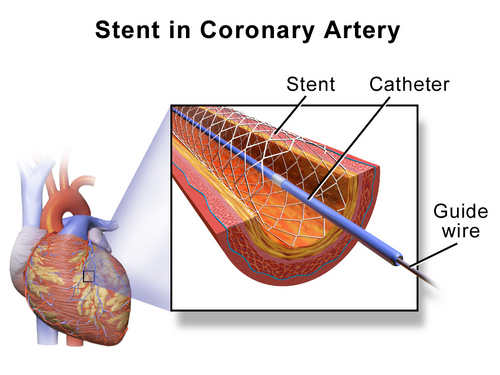

# DAC CRÔNICA E PREVENÇÃO SECUNDÁRIA

A Doença Arterial Coronariana (DAC) crônica não é um evento estático, mas um processo inflamatório contínuo. Para a prova de residência, você deve entender que a aterosclerose é uma doença inflamatória crônica da camada íntima das artérias. O que define a estabilidade da placa não é apenas o tamanho da obstrução, mas a sua composição.

*Figura 1 - Ilustração de placa aterosclerótica na artéria coronária, mostrando o acúmulo de lipídios e células inflamatórias na parede arterial. Fonte: Blausen.com staff, CC BY 3.0 | Wikimedia Commons*

Por que alguns pacientes com 90% de obstrução nunca infartam, enquanto outros com 30% chegam ao pronto-socorro com IAM com supra? A resposta está na biologia da placa. Mecanismos protetores aumentam o tecido matricial (colágeno) para estabilizar a capa fibrótica. Quando linfócitos inflamatórios entram em cena, eles liberam citocinas que reduzem essa formação e degradam a matriz, tornando a placa vulnerável. É por isso que tratamos a inflamação, não apenas o "entupimento".

## Fisiopatologia e Fatores de Risco

A base de tudo é a disfunção endotelial. O endotélio doente permite a entrada de partículas de LDL na camada íntima, onde são oxidadas e fagocitadas por macrófagos, formando as células espumosas (foam cells).

O Diabetes Mellitus (DM) é um dos protagonistas aqui. Ele é um fator de risco cardiovascular independente que aumenta de 2 a 4 vezes a probabilidade de DAC em ambos os sexos. O Dr. Will sempre lembra nas discussões do MedEvo: o DM "envelhece" o sistema vascular em cerca de 15 anos. Para homens acima de 40 anos e mulheres acima de 50, o risco de um evento cardiovascular maior ultrapassa 2% ao ano. Nas mulheres diabéticas, o risco relativo é significativamente maior do que em homens, embora não chegue a ser 10 vezes maior como algumas alternativas de prova tentam sugerir.

Outro fator que as bancas adoram é a homocisteína. Níveis elevados de homocisteína, muitas vezes causados pela deficiência de folato ou vitamina B12, são considerados fatores de risco independentes para aterosclerose. Embora a suplementação de vitaminas não tenha provado reduzir eventos em grandes ensaios, o conceito biológico cai em prova.

## Quadro Clínico e Classificação da Angina

A dor torácica é o sintoma cardinal, mas cuidado com as apresentações atípicas. A angina clássica tem três características:

- Dor ou desconforto retroesternal.

- Desencadeada por esforço físico ou estresse emocional.

- Aliviada por repouso ou nitratos em poucos minutos.

Se o paciente tem as três, é angina típica. Se tem duas, atípica. Se tem uma ou nenhuma, dor não cardíaca.

**Tabela 1: Classificação de Gravidade da Angina (CCS - Canadian Cardiovascular Society)**

| Classe | Descrição Clínica |
| --- | --- |
| I | Atividade física ordinária não causa angina. Dor apenas em esforços extenuantes ou prolongados. |
| II | Leve limitação da atividade ordinária. Angina ao caminhar rápido, subir escadas após refeições ou no frio. |
| III | Marcada limitação da atividade física ordinária. Angina ao caminhar um ou dois quarteirões no plano. |
| IV | Incapacidade de realizar qualquer atividade sem desconforto. Angina pode estar presente ao repouso. |

Um erro clássico de prova é ignorar os "equivalentes anginosos", como dispneia de esforço, especialmente em idosos e diabéticos. Além disso, fique atento à Insuficiência Mesentérica Crônica, a famosa "angina abdominal". O paciente apresenta dor abdominal pós-prandial e medo de comer, o que leva à perda de peso. É a aterosclerose manifestando-se em outro território.

## Diagnóstico e Estratificação de Risco

Antes de pedir qualquer exame, você deve avaliar a probabilidade pré-teste. Um jovem de 25 anos com dor atípica tem probabilidade baixíssima. Pedir um Teste Ergométrico (TE) aqui é um erro de prevenção quaternária, pois o valor preditivo positivo será baixo, gerando alarmes falsos e procedimentos invasivos desnecessários.

### Teste Ergométrico (TE)

O TE avalia não apenas a isquemia, mas a repercussão cardiovascular global e a eficácia terapêutica. O critério primário de isquemia é o infradesnivelamento do segmento ST, que deve ser horizontal ou descendente e ≥ 1mm em pelo menos duas derivações contíguas.

Cuidado: se o paciente já tem o ECG basal alterado (como um bloqueio de ramo esquerdo ou uso de digital), o TE perde acurácia para isquemia, mas ainda serve para avaliar resposta hemodinâmica.

### Métodos de Imagem

Se o paciente não pode exercitar-se ou o ECG é inconclusivo, partimos para exames de imagem.

- **Ecocardiografia com Dobutamina:** Usamos atropina associada para aumentar a frequência cardíaca, o que reduz testes ineficazes e aumenta a acurácia do método.

- **Escore de Cálcio Coronariano (CAC):** Muito útil em adultos jovens com risco intermediário para reestratificar o paciente. Um CAC zero tem um alto valor preditivo negativo para eventos.

- **Cineangiocoronariografia (CAT):** É o padrão-ouro anatômico. Indicações na DAC estável incluem: angina refratária ao tratamento clínico, sintomas de insuficiência cardíaca associados ou exames não invasivos de alto risco.

### Disfunção Microvascular Coronariana (DMC)

Muitos pacientes (especialmente mulheres) têm angina e isquemia comprovada, mas o CAT mostra artérias epicárdicas "lisas". Isso é a DMC. O problema está nos pequenos vasos. O diagnóstico envolve a medida da Reserva de Fluxo Coronariano (RFC), que é a razão entre o fluxo em hiperemia máxima e o fluxo em repouso. Uma RFC reduzida com artérias normais confirma o diagnóstico.

## Tratamento Farmacológico: O "Pulo do Gato"

Aqui é onde as bancas mais cobram. Você precisa separar os medicamentos que melhoram sintomas dos que reduzem mortalidade.

### Fármacos que Reduzem Mortalidade

- **Antiplaquetários:** O AAS inibe irreversivelmente a COX-1 plaquetária, reduzindo o Tromboxano A2 (TXA2). É o pilar da prevenção secundária. Se houver contraindicação, o Clopidogrel é a alternativa.

- **Estatinas:** Essenciais para todos, independentemente do nível basal de LDL, se houver DAC estabelecida.

- **IECA ou BRA:** Reduzem eventos mesmo em pacientes normotensos, especialmente se houver disfunção ventricular, DM ou DRC.

### Fármacos Anti-isquêmicos (Sintomáticos)

- **Betabloqueadores:** São a primeira linha. Eles reduzem a frequência cardíaca e a contratilidade, diminuindo o consumo de oxigênio pelo miocárdio (MVO2).

- **Bloqueadores de Canais de Cálcio:** Usados se os BB forem contraindicados ou como terapia adjunta.

- **Nitratos de longa duração:** Melhoram a tolerância ao esforço, mas não mudam o desfecho de morte.

### Metas lipídicas e estratificação de risco — atualização SBC 2025

A **Diretriz Brasileira de Dislipidemias e Prevenção da Aterosclerose 2025 (ABC Cardiol/SBC)** atualizou a estratificação para cinco categorias: baixo, intermediário, alto, muito alto e **risco extremo**. Em DAC crônica/prevenção secundária, isso muda a forma de classificar o paciente e a intensidade do tratamento.

| Categoria de risco cardiovascular | Quem entra / exemplos de prova | Meta de LDL-c | Meta de não-HDL-c | Redução mínima do LDL-c |
| --- | --- | --- | --- | --- |
| **Baixo** | Risco calculado < 5% em 10 anos, sem agravantes de risco e sem DM2 | < 115 mg/dL | < 145 mg/dL | ≥ 30% |
| **Intermediário** | Risco 5 a < 20% sem agravantes; ou risco < 5% com agravante; DM2 jovem sem EAR/EMAR; LDL-c 160–189 mg/dL | < 100 mg/dL | < 130 mg/dL | ≥ 30% |
| **Alto** | Risco ≥ 20%; risco intermediário com agravante; aterosclerose subclínica não obstrutiva (ex.: CAC >100 a 300 UA, placa carotídea <50%, aneurisma de aorta abdominal); LDL-c ≥190 mg/dL; DM2 mais velho ou com 1–2 EAR; Lp(a) >180 mg/dL | < 70 mg/dL | < 100 mg/dL | ≥ 50% |
| **Muito alto** | Doença aterosclerótica significativa coronária/cerebrovascular/periférica com obstrução ≥50% **ou evento aterosclerótico prévio manifesto**; CAC >300 UA; DM2 com EMAR ou ≥3 EAR | < 50 mg/dL | < 80 mg/dL | ≥ 50% |
| **Extremo** | **Múltiplos eventos cardiovasculares ateroscleróticos maiores** ou **1 evento maior + ≥2 condições de alto risco** | **< 40 mg/dL** | **< 70 mg/dL** | ≥ 50% |

**Critérios de risco extremo (SBC 2025):**

- **Eventos cardiovasculares ateroscleróticos maiores:** síndrome coronariana aguda recente (últimos 12 meses), histórico de IAM, histórico de AVC isquêmico, ou doença arterial periférica sintomática (claudicação com ITB <0,85, revascularização ou amputação prévia).

- **Condições de alto risco:** idade ≥65 anos, hipercolesterolemia familiar, revascularização miocárdica prévia ou ICP fora do evento maior, diabetes mellitus, hipertensão arterial, DRC com TFGe 15–59 mL/min/1,73 m², tabagismo atual, LDL-c persistentemente ≥100 mg/dL apesar de estatina em dose máxima tolerada + ezetimiba, ou evento agudo aterosclerótico há menos de 2 anos.

**Exemplos que a banca pode cobrar:**

- **IAM prévio isolado** ou DAC obstrutiva ≥50%: em geral, **muito alto risco** → LDL-c <50 mg/dL.

- **IAM recente (<12 meses)** + **DM** + **HAS**: 1 evento maior + 2 condições de alto risco → **risco extremo** → LDL-c <40 mg/dL.

- **IAM prévio + AVC isquêmico** ou IAM + DAP sintomática: múltiplos eventos maiores → **risco extremo**.

- **DAC crônica revascularizada** + tabagismo atual + DRC: se houver evento maior associado, enquadra como **risco extremo**; se apenas DAC significativa/revascularização sem critérios adicionais suficientes, permanece ao menos **muito alto risco**.

**Conduta prática:** em alto, muito alto e extremo risco, não espere monoterapia falhar por meses. A diretriz 2025 favorece tratamento intensivo e combinado: estatina de alta intensidade + ezetimiba desde cedo; em muito alto risco pode ser necessário anti-PCSK9; em **risco extremo**, recomenda-se terapia inicial com estatina de alta intensidade + ezetimiba + anti-PCSK9 para atingir a meta. Ácido bempedoico é alternativa/complemento em intolerância ou necessidade de redução adicional.

> Fonte verificada nesta revisão: *Diretriz Brasileira de Dislipidemias e Prevenção da Aterosclerose – 2025*, Arquivos Brasileiros de Cardiologia/ABC Cardiol, 2025;122(9):e20250640.

## Manejo das Estatinas e Efeitos Adversos

As estatinas são seguras, mas você deve saber manejar as queixas.

- **Miopatia:** A Sinvastatina é a que mais causa dores musculares difusas. Se o paciente tem mialgia e a CPK está < 5x o limite superior da normalidade (LSN), você mantém a medicação e monitora. Se > 10x LSN ou sintomas graves, suspende.

- **Hepatotoxicidade:** Monitoramos TGO/TGP. Só suspendemos se os níveis estiverem > 3x o LSN de forma persistente.

- **Interação Perigosa:** Nunca combine Fibrato (especialmente o Genfibrozila) com Estatina sem cautela extrema, pois isso aumenta drasticamente o risco de rabdomiólise. Se precisar baixar triglicerídeos muito altos (> 500 mg/dL) para evitar pancreatite, o Ciprofibrato ou Fenofibrato são preferíveis, mas a prioridade inicial costuma ser o controle do LDL.

Lembre-se da Fórmula de Friedewald para o cálculo do VLDL: **VLDL = Triglicerídeos / 5**. Esta fórmula só é válida se os TG forem menores que 400 mg/dL.

## Doença Arterial Periférica (DAP)

A DAP é a "irmã" da DAC. Se o paciente tem uma, provavelmente tem a outra. A manifestação clássica é a claudicação intermitente: dor na panturrilha que surge ao caminhar e melhora com o repouso. Se a dor é na panturrilha, a oclusão costuma ser na artéria femoral superficial.

O diagnóstico clínico é feito pelo Índice Tornozelo-Braquial (ITB). Um ITB < 0,9 confirma DAP. Se o ITB for < 0,5, a doença é grave.

**Tratamento da Claudicação:**

- **MEV:** Cessação do tabagismo é inegociável.

- **Exercício:** Caminhada supervisionada é o tratamento inicial de escolha. Melhora a circulação colateral.

- **Farmacoterapia:** AAS + estatina de alta intensidade (meta LDL-c conforme risco: <50 mg/dL se muito alto risco; <40 mg/dL se risco extremo) + Cilostazol (para melhorar a distância de caminhada, se não houver contraindicação como insuficiência cardíaca).

- **Revascularização:** Reservada para casos de isquemia crítica (dor em repouso, úlceras) ou falha do tratamento clínico.

Cuidado com a Oclusão Arterial Aguda: dor súbita, palidez, ausência de pulsos, parestesia e paralisia (os 6 Ps). Isso é uma emergência cirúrgica, diferente da claudicação crônica.

## Revascularização na DAC Estável

*Figura 2 - Procedimento de angioplastia coronária com colocação de stent, técnica de revascularização percutânea utilizada no tratamento da DAC. Fonte: Blausen.com staff, CC BY 3.0 | Wikimedia Commons*

A revascularização (seja por Angioplastia ou Cirurgia - CRM) na DAC estável visa primordialmente a melhora da qualidade de vida e dos sintomas. No entanto, em alguns cenários, ela melhora a sobrevida:

- Lesão de Tronco de Coronária Esquerda > 50%.

- Doença multiarterial com disfunção ventricular (FE < 35%).

- Lesão proximal de Descendente Anterior (DA) associada a outra artéria.

Em diabéticos multiarteriais, a cirurgia (CRM) costuma ser superior à angioplastia (stents), conforme demonstrado pelo Syntax Score. No entanto, em diabéticos assintomáticos, a revascularização guiada por imagem não se mostrou superior ao manejo clínico otimizado. O foco deve ser o controle agressivo dos fatores de risco.

## Prevenção Primária e o Uso do AAS

Este é um ponto de muita confusão. O AAS é excelente na prevenção secundária (quem já teve evento). Na prevenção primária (quem nunca teve), o benefício é incerto e o risco de sangramento gastrointestinal é alto.
Atualmente, as diretrizes recomendam individualizar. Não se usa AAS de rotina para todos os idosos ou todos os diabéticos. Ele pode ser considerado em pacientes de alto risco cardiovascular (Escore de Risco Global > 20% em homens ou > 10% em mulheres) que tenham baixo risco de sangramento.

Já as estatinas na prevenção primária têm indicação clara se o LDL-C for ≥ 190 mg/dL. Nesses casos, iniciamos estatina de alta potência imediatamente, pois o risco de eventos ao longo da vida é altíssimo.

## Estilo de Vida e Reabilitação

Não subestime o tratamento não-farmacológico. A reabilitação cardíaca aumenta a sobrevida e a adesão melhora com a insistência da equipe multidisciplinar.

- **Atividade Física:** Recomenda-se treinamento aeróbico associado a exercícios de força, flexibilidade e equilíbrio. O treinamento da musculatura inspiratória também traz benefícios em cardiopatas.

- **Tabagismo:** Use o Teste de Fagerström para avaliar a dependência. O tempo até o primeiro cigarro ao acordar é o melhor preditor.

- **Dieta:** Foco em gorduras insaturadas e redução de sódio.

**Tabela 3: Diagnóstico Diferencial da Dor Torácica na Emergência**

| Diagnóstico | Pistas Clínicas | Exame Chave |
| --- | --- | --- |
| DAC Estável | Dor ao esforço, melhora com repouso | Teste Ergométrico / AngioTC |
| Dissecção de Aorta | Dor "em rasgo", irradia para dorso, assimetria de pulsos | AngioTC de Tórax |
| Tromboembolismo Pulmonar | Dispneia súbita, dor pleurítica, taquicardia | AngioTC de Pulmão / D-dímero |
| Pericardite | Dor que melhora ao inclinar para frente, supra de ST difuso | ECG / Ecocardiograma |
| Espasmo Esofágico | Dor retroesternal, pode melhorar com nitrato (pegadinha!) | Manometria / EDA |

## Situações Especiais

### Mulheres

As doenças cardiovasculares são a principal causa de morte em mulheres. Elas frequentemente apresentam sintomas atípicos e DMC. O risco relativo conferido pelo DM é maior nelas do que nos homens.

### Idosos

A dislipidemia no idoso deve ser tratada, mas com cautela quanto a efeitos colaterais e polifarmácia. Em pacientes acima de 75-80 anos em prevenção primária, a decisão de iniciar estatina deve ser muito bem individualizada.

### Disfunção Erétil

A disfunção erétil de causa vascular é frequentemente um "sentinela" da DAC. O Dr. Will sempre enfatiza: se o paciente tem disfunção erétil, investigue o coração, pois as artérias penianas são menores e entopem antes das coronárias.

## Pontos-Chave para Prova

- **Meta de LDL em Prevenção Secundária:** < 50 mg/dL (Muito Alto Risco).

- **Indicação Direta de Estatina (Prev. Primária):** LDL-C ≥ 190 mg/dL (Alta potência: Atorva 40-80 ou Rosuva 20-40).

- **Critério de Isquemia no TE:** Infradesnivelamento de ST ≥ 1mm, horizontal ou descendente.

- **DAP e Exercício:** Caminhada supervisionada é o tratamento inicial para claudicação intermitente.

- **Índice Tornozelo-Braquial (ITB):** Normal entre 0,9 e 1,4. < 0,9 confirma DAP. < 0,5 indica gravidade.

- **Fibrato + Estatina:** ↑ Risco de rabdomiólise. Evite a combinação, especialmente com Genfibrozila.

- **Miopatia por Estatina:** Se CPK < 5x LSN e assintomático, mantenha a droga.

- **Hepatotoxicidade:** Suspender estatina se TGO/TGP > 3x LSN de forma persistente.

- **AAS na Prevenção Primária:** Não é para todos. Risco de sangramento muitas vezes supera o benefício.

- **Diabetes e DAC:** DM equivale a um risco de 15 anos a mais de idade vascular.

- **Tratamento da Claudicação:** AAS + Estatina + Exercício + Cilostazol.

- **Angina de Microcirculação:** Isquemia presente com coronárias epicárdicas normais (RFC reduzida).

- **Fórmula de Friedewald:** VLDL = TG/5. Só use se TG < 400 mg/dL.

- **Contraindicação Absoluta ao TE:** IAM recente (até 2 dias), angina instável de alto risco, arritmias sintomáticas, estenose aórtica grave sintomática.

- **Cessação do Tabagismo:** Teste de Fagerström avalia dependência nicotínica.

- **Prevenção Quaternária:** Não pedir exames de rastreio isquêmico em jovens assintomáticos de baixo risco. 🏆

 Cópia offline para consulta pessoal.
 Fonte original:
 [https://www.medevo.com.br/material-apoio/ler/c338f4e6-4189-4b76-bff1-e6dd283b9498](https://www.medevo.com.br/material-apoio/ler/c338f4e6-4189-4b76-bff1-e6dd283b9498)
