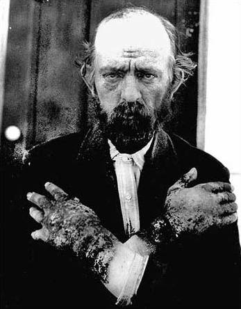
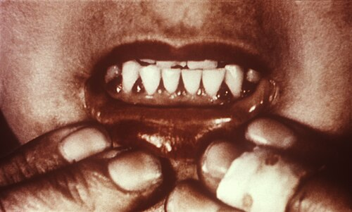

# DEFICIÊNCIAS VITAMÍNICAS

Para entender deficiências vitamínicas, você precisa parar de tentar decorar uma lista infinita de sintomas e começar a entender a **fisiopatologia do trajeto**. As vitaminas não "somem" do corpo por mágica; ou elas não entram (dieta), ou não são absorvidas (má absorção/cirurgias), ou são consumidas excessivamente (álcool/doenças críticas).

Nas provas de residência, o examinador raramente vai te perguntar "o que a vitamina B1 faz?". Ele vai te apresentar um paciente pós-bariátrica que está vomitando há duas semanas e agora começou com nistagmo e marcha atáxica. Se você souber que a vitamina B1 é cofator da piruvato desidrogenase e que o vômito impede sua absorção, você mata a questão.

## Vitaminas Hidrossolúveis: O Complexo B e a Vitamina C

As vitaminas hidrossolúveis não são armazenadas em grandes quantidades (exceto a B12). Por isso, quadros de carência surgem mais rápido do que nas lipossolúveis.

### Vitamina B1 (Tiamina)

A tiamina é o "combustível" do metabolismo de carboidratos. Sem ela, o ciclo de Krebs para. Onde falta B1, falta energia para o neurônio e para o miócito.

**Etiologia e Fatores de Risco:**
O álcool é o grande vilão aqui, pois inibe o transporte intestinal de tiamina. Mas atenção: a **cirurgia bariátrica** (especialmente se houver vômitos persistentes no pós-operatório) e a hiperêmese gravídica são causas frequentes em provas modernas.

**Manifestações Clínicas:**

- **Beribéri Seco:** Polineuropatia periférica simétrica (motora e sensitiva).

- **Beribéri Úmido:** Insuficiência cardíaca de alto débito, com edema e congestão.

- **Encefalopatia de Wernicke:** Esta é a "menina dos olhos" das bancas. A tríade clássica é: **Ataxia + Confusão Mental + Alterações Oculomotoras (Nistagmo/Oftalmoplegia)**.

- **Psicose de Korsakoff:** Quando o Wernicke não é tratado, evolui para amnésia anterógrada e **confabulação** (o paciente inventa histórias para preencher os vazios da memória).

**Cuidado, erro clássico:** Nunca, jamais, dê glicose para um paciente desnutrido ou etilista antes de dar Tiamina. A glicose vai "puxar" o resto de tiamina que o paciente tem para ser metabolizada, precipitando um Wernicke agudo. Como dizemos no MedEvo, "Tiamina antes, Glicose depois".

**Tratamento:**
Na suspeita de Wernicke, a dose é alta e parenteral: Tiamina 500mg IV, 3 vezes ao dia, por 2 a 3 dias, seguido de manutenção oral.

### Vitamina B3 (Niacina)

*Figura 1 - Paciente com pelagra, evidenciando a dermatite fotossensível característica em áreas expostas ao sol (deficiência de vitamina B3/niacina). Fonte: Dr James W Babcock, Domínio Público | Wikimedia Commons*

A deficiência de B3 causa a **Pelagra**. Você vai guardar o número 3. Três Ds para a Vitamina B3.

**A Tríade da Pelagra (Os 3 Ds):**

- **Dermatite:** Lesões fotossensíveis, simétricas, em áreas expostas ao sol. O "Colar de Casal" (lesão ao redor do pescoço) é o sinal clássico.

- **Diarreia:** Por má absorção e inflamação da mucosa.

- **Demência:** Alterações cognitivas, desorientação e depressão.

**Dica de Prova:** A niacina pode ser sintetizada a partir do triptofano. Portanto, dietas baseadas quase exclusivamente em milho (pobre em triptofano biodisponível) ou a Síndrome Carcinóide (que desvia o triptofano para produzir serotonina) podem causar Pelagra.

### Vitamina B9 (Ácido Fólico) vs. Vitamina B12 (Cobalamina)

Aqui mora a maior confusão dos alunos. Ambas causam **Anemia Megaloblástica** (VCM alto, neutrófilos hipersegmentados). Como diferenciar?

**A Diferença Fundamental:**

- **B12:** Tem sintomas **neurológicos** (parestesias, perda de sensibilidade vibratória e propriocepção - degeneração combinada subaguda da medula).

- **B9:** **NÃO** tem sintomas neurológicos.

**Fisiopatologia da B12:**
A B12 precisa do **Fator Intrínseco (FI)**, produzido pelas células parietais do estômago, para ser absorvida no **Íleo Terminal**.

- **Gastrectomia Total:** Sem estômago = sem FI = deficiência de B12. É a complicação metabólica mais comum a longo prazo.

- **Ressecção Ileal (Doença de Crohn):** Tem FI, mas não tem onde absorver.

- **Anemia Perniciosa:** Doença autoimune contra as células parietais ou contra o FI.

- **Metformina:** O uso crônico pode reduzir a absorção de B12. Fique atento a idosos diabéticos com anemia e neuropatia; pode não ser "só do diabetes".

**Tabela 1: Diagnóstico Diferencial de Anemias Macrocíticas**

| Achado | Deficiência de B12 | Deficiência de B9 (Folato) |
| --- | --- | --- |
| **VCM** | Elevado (> 100-110) | Elevado (> 100-110) |
| **Neutrófilos** | Hipersegmentados | Hipersegmentados |
| **Sintomas Neuro** | Presentes (Ataxia, Parestesia) | Ausentes |
| **Ácido Metilmalônico** | Elevado | Normal |
| **Homocisteína** | Elevada | Elevada |

**Tratamento da B12:** Se houver má absorção (gastrectomia, Crohn), a reposição deve ser parenteral (IM). 1000mcg diários por 1 semana, depois semanal por um mês, e mensal para o resto da vida. **Atenção:** Ao iniciar B12, pode ocorrer **hipocalemia** (o potássio entra nas novas células sanguíneas que estão sendo produzidas rapidamente).

### Vitamina C (Ácido Ascórbico)

*Figura 2 - Gengivas escorbúticas com hemorragia e inflamação, manifestação típica da deficiência de vitamina C (escorbuto). Fonte: CDC, Domínio Público | Wikimedia Commons*

A deficiência causa o **Escorbuto**. A vitamina C é essencial para a hidroxilação da prolina e lisina na síntese do **colágeno**. Sem colágeno estável, os vasos sanguíneos "vazam".

**Quadro Clínico:**

- Hemorragias perifoliculares (pelos em "saca-rolhas").

- Gengivite hemorrágica e perda de dentes.

- Equimoses e petéquias.

- Dificuldade de cicatrização.

Imagine um idoso que mora sozinho, come apenas chá e torradas (dieta do "chá e torrada"). Ele chega com manchas roxas nas pernas e gengiva sangrando. Não é plaquetopenia, é escorbuto.

## Vitaminas Lipossolúveis: A, D, E, K

Essas vitaminas dependem da absorção de gorduras. Qualquer doença que cause **esteatorreia** (insuficiência pancreática, doença celíaca, ressecção biliar) levará à deficiência dessas quatro.

### Vitamina A (Retinol)

Fundamental para a visão e integridade epitelial.

- **Cegueira Noturna:** É o sintoma mais precoce.

- **Manchas de Bitot:** Placas esbranquiçadas e secas na conjuntiva. **Sinal patognomônico** em provas.

- **Xeroftalmia:** Secura ocular grave que pode levar à ceratomalácia (derretimento da córnea) e cegueira irreversível.

**Toxicidade:** O Dr. Will sempre lembra que o excesso de Vitamina A (hipervitaminose A) é teratogênico e pode causar **Pseudotumor Cerebral** (hipertensão intracraniana idiopática).

### Vitamina D (Calcidiol/Calcitriol)

A vitamina D é, na verdade, um hormônio. A maior parte vem da síntese cutânea via raios UVB.

**Diagnóstico:**
O exame correto para avaliar o status nutricional é a **25(OH)D (Calcidiol)**, pois tem meia-vida longa. A 1,25(OH)2D (Calcitriol) só deve ser dosada em insuficiência renal crônica.

**Valores de Referência (Sociedade Brasileira de Endocrinologia):**

- Desejável para população geral: > 20 ng/mL.

- Grupos de risco (idosos, osteoporose, gestantes): 30 a 60 ng/mL.

- Deficiência: < 20 ng/mL.

**Manifestações:**

- Crianças: **Raquitismo** (atraso no fechamento de fontanelas, rosário raquítico, pernas arqueadas).

- Adultos: **Osteomalácia** (dor óssea difusa e fraqueza muscular).

**Laboratório na Deficiência Grave:** ↓ Cálcio, ↓ Fósforo, ↑ PTH (hiperparatireoidismo secundário) e **↑ Fosfatase Alcalina**.

### Vitamina K

Essencial para a gama-carboxilação dos fatores de coagulação **II, VII, IX e X** (além das proteínas C e S).

**Causas de Deficiência:**

- Uso de antibióticos de amplo espectro (destroem a flora bacteriana que produz Vit K).

- Recém-nascidos (intestino estéril e leite materno pobre em K - por isso fazem a profilaxia ao nascer).

- Uso de Varfarina (antagonista da Vitamina K).

**Manifestação:** Coagulopatia com aumento do **TAP/RNI**. O TTPa pode alterar em casos graves, mas o TAP é o primeiro a subir.

## Situações Especiais e Cirurgia Bariátrica

As bancas de residência amam o paciente pós-bariátrica. Você precisa saber qual técnica foi usada.

- **Bypass em Y de Roux (Disabsortivo/Restritivo):** Exclui o duodeno e jejuno proximal. É onde se absorve Ferro, Cálcio e B12.

- **Sleeve (Restritivo):** Reduz o estômago, diminuindo o Fator Intrínseco (risco de B12).

**Tabela 2: Deficiências Comuns Pós-Bariátrica**

| Nutriente | Por que falta? | Clínica de Prova |
| --- | --- | --- |
| **Ferro** | Acloridria e desvio do duodeno | Anemia microcítica, pica, queilose |
| **Vitamina B12** | Falta de Fator Intrínseco | Anemia megaloblástica + Neuropatia |
| **Tiamina (B1)** | Vômitos persistentes | Wernicke (Ataxia/Confusão/Nistagmo) |
| **Zinco** | Má absorção jejunal | Queda de cabelo, alteração de paladar (hipogeusia), má cicatrização |
| **Cobre** | Má absorção | Quadro idêntico à deficiência de B12 (mieloneuropatia) |

**Atenção ao Zinco:** A deficiência de zinco causa a **Acrodermatite Enteropática** (lesões periorificiais e acrais) e é fundamental para a cicatrização de feridas. Por outro lado, o **excesso de Zinco** pode causar deficiência de Cobre por competição na absorção.

## Nutrição no Paciente Crítico: O Escore NUTRIC

Em UTIs, não usamos o IMC para definir risco nutricional, pois o edema (balanço hídrico positivo) mascara o peso real. O **Escore NUTRIC** é a ferramenta validada.

**Componentes do NUTRIC:**

- Idade.

- APACHE II.

- SOFA.

- Número de comorbidades.

- Dias de internação pré-UTI.

- IL-6 (opcional).

**Importante:** O IMC **NÃO** faz parte do NUTRIC. Pacientes com NUTRIC alto (≥ 5 ou ≥ 6 sem IL-6) são os que mais se beneficiam de terapia nutricional agressiva e precoce.

## Diagnóstico Diferencial: A "Zona de Confusão"

Muitas vezes, os sintomas se sobrepõem. Use esta tabela para não cair em pegadinhas.

**Tabela 3: Diferenciando Síndromes Neurológicas Nutricionais**

| Sintoma | Wernicke (B1) | Pelagra (B3) | B12 / Cobre |
| --- | --- | --- | --- |
| **Cognição** | Confusão Aguda | Demência Crônica | Lentificação / Depressão |
| **Marcha** | Ataxia (Cerebelar) | Normal até fases tardias | Ataxia Sensorial (Propriocepção) |
| **Pele** | Normal | Dermatite em áreas solares | Palidez / Glossite |
| **Olhos** | Nistagmo / Oftalmoplegia | Normal | Normal |

## Pontos-Chave para Prova

- **Wernicke-Korsakoff:** Tríade de Wernicke (Ataxia, Confusão, Oftalmoplegia). Korsakoff é a fase crônica com confabulação. Tratamento: Tiamina 500mg IV 8/8h.

- **B12 vs. Ácido Fólico:** Ambos dão anemia megaloblástica. Apenas a B12 dá sintomas neurológicos (degeneração do cordão posterior da medula).

- **Anemia Perniciosa:** É uma causa de deficiência de B12 por autoimunidade contra células parietais/fator intrínseco.

- **Vitamina A:** Manchas de Bitot e Cegueira Noturna. É a principal causa de cegueira evitável no mundo.

- **Vitamina C:** Escorbuto. Pense em colágeno. Sangramento gengival, petéquias e pelos em saca-rolhas.

- **Vitamina D:** Dosar 25(OH)D. Deficiência < 20 ng/mL. Raquitismo (criança) e Osteomalácia (adulto).

- **Pelagra:** 3 Ds (Dermatite, Diarreia, Demência). Deficiência de B3 (Niacina).

- **Bariátrica:** A deficiência de Ferro é a mais comum, mas a de B12 é a mais clássica em questões de "complicação metabólica".

- **Metformina:** Causa clássica de deficiência de B12 em idosos.

- **Zinco:** Essencial para cicatrização. Deficiência causa hipogeusia (perda de paladar) e acrodermatite.

- **Cobre:** A deficiência mimetiza a de B12 (anemia + neuropatia). Pode ser causada por excesso de zinco.

- **Veganos:** Devem suplementar B12 obrigatoriamente. A dieta vegetal não fornece níveis adequados.

- **Síndrome da Alça Aferente:** Ocorre após cirurgia de Billroth II. Ocorre estase biliar e superproscimento bacteriano, que consome a B12, causando deficiência.

- **Fosfatase Alcalina:** Estará **elevada** no raquitismo/osteomalácia por deficiência de Vitamina D.

- **Contraindicação Absoluta:** Nunca repor Glicose antes de Tiamina em pacientes de risco para Wernicke. 🧠

Este guia cobre o núcleo duro do que é cobrado nas provas de residência no Brasil. Ao encontrar uma questão sobre o tema, identifique primeiro o **contexto clínico** (Alcoolismo? Bariátrica? Dieta restritiva?) e depois busque o **sinal patognomônico** (Bitot? Colar de Casal? Nistagmo?). O sucesso na Nutrologia vem de conectar a fisiologia da absorção com a clínica da carência.

 Cópia offline para consulta pessoal.
 Fonte original:
 [https://www.medevo.com.br/material-apoio/ler/54e22b45-29d3-41e7-8cea-a67a032a5873](https://www.medevo.com.br/material-apoio/ler/54e22b45-29d3-41e7-8cea-a67a032a5873)
