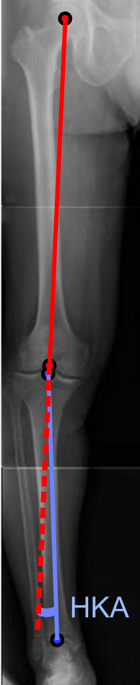
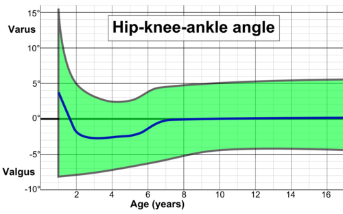

# DEFORMIDADES ANGULARES DOS MEMBROS

Para entender as deformidades angulares na infância, você precisa primeiro aceitar uma verdade fundamental: a criança não é um adulto em miniatura. O que seria uma deformidade grave em um homem de 30 anos pode ser perfeitamente normal em uma criança de 2 anos. O segredo para não errar questões de prova e, principalmente, para não angustiar pais desnecessariamente no consultório, é dominar a cronologia do alinhamento fisiológico.

*Figura 1 - Radiografia do membro inferior com medição do ângulo quadril-joelho-tornozelo (HKA), utilizado para avaliação de deformidades angulares como geno valgo e geno varo. Fonte: Mikael Häggström, CC BY 2.0 | Wikimedia Commons*

## O Alinhamento Fisiológico: A Evolução Natural

A maioria das crianças nasce com os joelhos "para fora" (genu varo), passa por uma fase de joelhos "para dentro" (genu valgo) e finalmente estabiliza no alinhamento do adulto. Se você decorar essa sequência, já resolve 50% das questões sobre o tema.

### A Cronologia do Desenvolvimento

- **Do nascimento aos 2 anos (Genu Varo Fisiológico):** O bebê nasce com um varismo que pode chegar a 15 ou 20 graus. Isso ocorre devido à posição intrauterina. É simétrico e esperado.

- **Dos 2 aos 4 anos (Transição para o Valgo):** Entre os 18 e 24 meses, as pernas se "alinham" e começam a pender para o valgo.

- **Dos 4 aos 7 anos (Genu Valgo Fisiológico):** É o pico do valguismo. A criança parece "X". O ápice ocorre por volta dos 3 a 4 anos.

- **Dos 7 anos em diante (Alinhamento Adulto):** O valgo diminui gradualmente até atingir os valores do adulto (cerca de 5 a 7 graus de valgo em homens e um pouco mais em mulheres).

**Dica de Prova:** As bancas adoram colocar uma criança de 18 meses com genu varo simétrico e perguntar a conduta. A resposta é sempre observação e orientação familiar. O erro clássico é solicitar radiografias desnecessárias ou indicar botas ortopédicas (que, inclusive, caíram em desuso na ortopedia moderna).

## Genu Varo: Quando Deixa de ser Fisiológico?

O genu varo é a deformidade onde os joelhos estão afastados e os tornozelos próximos. No MedEvo, sempre reforçamos: o "varo" faz um "O" com as pernas.

### Critérios de Suspeita para Patologia

Como saber se aquele varismo de uma criança de 18 meses é normal ou se estamos diante de algo grave? Você deve suspeitar de patologia se:

- A deformidade for unilateral ou nitidamente assimétrica.

- O varismo for muito acentuado (ângulo metáfise-diáfise > 11 graus).

- A criança estiver abaixo do percentil 5 de altura (pensar em displasias ou raquitismo).

- O varismo persistir ou piorar após os 2 anos de idade.

### Doença de Blount (Tibia Vara)

Esta é a principal "pegadinha" das provas. A Doença de Blount é uma alteração do crescimento da parte medial da fise (placa de crescimento) da tíbia proximal. O peso excessivo sobre uma fise vulnerável causa uma parada de crescimento localizada.

Existem duas formas:

- **Infantil (precoce):** Surge antes dos 3 anos. Frequentemente associada à deambulação precoce e obesidade. É difícil diferenciar do varo fisiológico no início.

- **Juvenil/Adolescente (tardia):** Surge após os 10 anos. Geralmente menos grave que a infantil, mas associada a dor e instabilidade.

**O Pulo do Gato no Diagnóstico:** O ângulo de Drennan (ou ângulo metáfise-diáfise). Traçamos uma linha pela metáfise da tíbia e outra perpendicular ao eixo da diáfise.

- Se o ângulo for **menor que 11 graus**, a chance de ser fisiológico é enorme.

- Se for **maior que 16 graus**, o diagnóstico de Blount é praticamente certo.

- Entre 11 e 16 graus, temos uma zona cinzenta que exige acompanhamento rigoroso.

### Raquitismo

Não pense no raquitismo apenas como falta de sol. Nas provas de residência, ele aparece conectado a outras patologias. Por exemplo, uma criança com atrésia biliar que evolui com falha na cirurgia de Kasai terá colestase crônica. Isso leva à má absorção de vitaminas lipossolúveis (A, D, E, K). A deficiência de vitamina D resulta em raquitismo, que se manifesta com deformidades angulares (varo ou valgo), rosário raquítico e fraturas patológicas.

## Genu Valgo: O Joelho em "X"

No genu valgo, os joelhos se tocam e os tornozelos se afastam. Lembre-se: "Valgo" não combina com "G" de "Gente junta" (os joelhos se juntam).

### Avaliação Clínica

O parâmetro clínico mais importante aqui é a **distância intermaleolar** (distância entre os tornozelos com os joelhos encostados).

- Até 8 cm é considerado dentro da normalidade para crianças entre 2 e 7 anos.

- Acima de 8 cm, ou se a deformidade for unilateral, precisamos investigar.

### Causas Patológicas de Genu Valgo

Diferente do varo, o valgo patológico costuma estar associado a:

- **Trauma prévio:** Fratura da metáfise proximal da tíbia (Fratura de Cozen). Curiosamente, essa fratura pode cicatrizar perfeitamente, mas a hiperemia local estimula o crescimento excessivo da fise medial, gerando um valgo progressivo.

- **Displasias ósseas.**

- **Insuficiência renal crônica (Osteodistrofia renal):** O distúrbio do cálcio e fósforo enfraquece a placa de crescimento.

| Característica | Genu Varo Fisiológico | Doença de Blount |
| --- | --- | --- |
| Idade de início | < 2 anos | Geralmente < 3 anos (infantil) |
| Simetria | Sempre simétrico | Frequentemente assimétrico |
| Ângulo de Drennan | < 11 graus | > 16 graus |
| Progressão | Melhora espontânea | Piora progressiva |
| Obesidade | Não relacionada | Fortemente relacionada |

## Exame Físico e Propedêutica

Como o Dr. Will sempre diz nas discussões de caso, o exame físico em ortopedia pediátrica começa com a criança andando.

- **Ângulo de Progressão da Marcha:** É o ângulo entre o eixo do pé e a linha de progressão da marcha. O normal é entre 0 e 15 graus para fora (positivo). Se a criança anda com os pés "para dentro", o ângulo é negativo.

- **Alinhamento em Decúbito:** Meça a distância intercondilar (para varo) e intermaleolar (para valgo) com uma régua ou fita métrica.

- **Eixo Mecânico:** Em uma radiografia panorâmica (escanometria), traçamos uma linha do centro da cabeça do fêmur ao centro do tornozelo. Essa linha deve passar pelo centro do joelho. Se passar por dentro, é varo; por fora, é valgo.

**Cuidado:** Muitos alunos confundem rotação com angulação. Uma criança pode ter os joelhos alinhados, mas andar com os pés para dentro por causa de uma anteversão femoral aumentada. Isso não é uma deformidade angular do joelho, mas sim uma deformidade rotacional.

*Figura 2 - Gráfico do ângulo quadril-joelho-tornozelo (HKA) por idade, mostrando a evolução fisiológica do geno varo ao geno valgo durante o crescimento, com intervalo de predição de 95%. Fonte: Mikael Häggström, CC0 | Wikimedia Commons*

## Diagnósticos Diferenciais e Pérolas Clínicas

As provas misturam temas de ortopedia pediátrica para confundir o candidato. Vamos conectar os pontos:

### Dor do Crescimento vs. Patologia Grave

A "dor do crescimento" é um diagnóstico de exclusão, mas tem características muito específicas que caem sempre:

- **Localização:** Bilateral, geralmente em coxas e panturrilhas. Nunca é articular.

- **Horário:** Vespertino ou noturno. A criança acorda chorando, mas está ótima de manhã.

- **Sinais de Alerta (Red Flags):** Se a dor for unilateral, se houver febre, perda de peso ou se a criança claudicar (mancar) durante o dia, **esqueça dor do crescimento**. Pense em Leucemia (dor óssea noturna + febre + citopenias) ou Osteomielite.

### Osgood-Schlatter

Se a questão descreve um adolescente atleta com dor na frente do joelho (infrapatelar), que piora ao saltar ou subir escadas, e ao exame físico há um aumento de volume doloroso na tuberosidade anterior da tíbia: o diagnóstico é Doença de Osgood-Schlatter. É uma apofisite de tração. O tratamento é conservador (gelo, alongamento e redução relativa da carga).

### Sinovite Transitória vs. Artrite Séptica

Criança que começa a mancar (claudicação aguda) após um quadro viral:

- **Sinovite Transitória:** Afebril, bom estado geral, exames laboratoriais (VHS/PCR) pouco alterados. Tratamento é repouso e AINE.

- **Artrite Séptica:** Febre alta, dor intensa à mobilização, recusa-se a apoiar o pé no chão, exames laboratoriais muito alterados. É uma emergência cirúrgica!

## Tratamento das Deformidades Angulares

Por que fazemos cirurgia em alguns e apenas observamos outros? Porque a placa de crescimento (fise) é um "motor" que podemos manipular.

### Tratamento Não Cirúrgico

- **Observação:** É a conduta para 90% dos casos fisiológicos.

- **Órteses (Braces):** Podem ser usadas na Doença de Blount inicial (estágios I e II de Langenskiöld) em crianças menores de 3 anos. Se não houver melhora em 1 ano, a cirurgia é indicada.

### Tratamento Cirúrgico

-

**Hemiepifisiodese (Crescimento Guiado):** Esta é a técnica "queridinha" do momento. Colocamos uma pequena placa em "oito" ou um parafuso em apenas um lado da placa de crescimento.

- Se a criança tem valgo, "grampeamos" o lado medial. O lado lateral continua crescendo e "desentorta" a perna.

- **Vantagem:** É minimamente invasiva, permite carga imediata e usa o próprio crescimento da criança para corrigir a deformidade.

- **Requisito:** A criança precisa ter pelo menos 1 a 2 anos de crescimento restante.

-

**Osteotomia:** Cortamos o osso e o fixamos na posição correta. É uma cirurgia muito mais agressiva, reservada para casos graves, deformidades agudas ou quando a placa de crescimento já fechou.

| Condição | Conduta Inicial | Quando Operar |
| --- | --- | --- |
| Genu Varo Fisiológico | Observação | Nunca (resolve sozinho) |
| Doença de Blount | Órtese (se < 3 anos) | Falha do tratamento clínico ou > 3 anos |
| Genu Valgo Fisiológico | Observação | Se persistir > 10 anos com distância > 10 cm |
| Raquitismo | Tratamento Metabólico (Vit. D/Cálcio) | Apenas se a deformidade persistir após cura metabólica |

## Complicações e Prognóstico

Se não tratarmos um genu varo ou valgo patológico, o que acontece?
O eixo de carga do corpo passará apenas por um compartimento do joelho (medial no varo, lateral no valgo). Isso causa uma sobrecarga mecânica absurda, levando à degeneração precoce da cartilagem e artrose severa antes dos 40 anos. Além disso, as deformidades angulares podem causar instabilidade ligamentar e dor crônica.

No caso da Doença de Blount, a falta de tratamento leva a uma deformidade em "degrau" na tíbia, muito difícil de corrigir tardiamente.

## Situações Especiais e Pegadinhas

### A Fratura de Cozen

Cuidado com a questão que mostra uma criança que fraturou a tíbia proximal, o gesso foi retirado e, 6 meses depois, ela apresenta um genu valgo progressivo. O examinador quer saber se você conhece o fenômeno de Cozen. A conduta aqui é observação, pois a maioria desses casos de valgo pós-traumático melhora espontaneamente em 1 ou 2 anos. Não saia operando de imediato!

### Pseudoparalisia de Parrot

Se a questão mencionar um recém-nascido que não movimenta um membro e chora muito à manipulação, sem história de trauma de parto, pense em Sífilis Congênita. A osteocondrite sifilítica causa tanta dor que a criança para de mexer o membro (pseudoparalisia). O diagnóstico é clínico-laboratorial (VDRL) e o tratamento é Penicilina Cristalina.

### Paralisia de Erb-Duchenne

Diferente da anterior, aqui há história de distocia de ombro. A lesão é no plexo braquial superior (C5-C6). A criança tem a postura clássica de "gorjeta de garçom" (braço aduzido, rodado internamente, cotovelo estendido e preensão palmar preservada). É um tema recorrente que as bancas misturam com deformidades ósseas.

## Pontos-Chave para Prova

- **Genu Varo Fisiológico:** Comum até os 2 anos. Sempre simétrico. Conduta: Observação.

- **Genu Valgo Fisiológico:** Pico entre 3 e 4 anos. Normal até 8 cm de distância intermaleolar.

- **Doença de Blount:** Suspeitar se varo assimétrico, obeso ou deambulação precoce. Ângulo de Drennan > 16° confirma.

- **Raquitismo:** Pensar em causas secundárias como atrésia biliar (má absorção de Vit. D).

- **Dor do Crescimento:** Noturna, bilateral, sem claudicação, melhora com massagem. Exame físico é NORMAL.

- **Sinal de Alerta:** Toda deformidade angular UNILATERAL deve ser investigada com radiografia.

- **Osgood-Schlatter:** Adolescente, dor na tuberosidade da tíbia, piora com esforço.

- **Osteomielite:** Inicia-se na METÁFISE dos ossos longos devido à rica vascularização e fluxo lento.

- **Hemiepifisiodese:** Técnica de escolha para correção de deformidades em crianças com fise aberta (crescimento guiado).

- **Ângulo de Drennan (Metáfise-Diáfise):** Valor de corte para Blount é > 16 graus.

- **Fratura de Cozen:** Valgo após fratura de tíbia proximal; conduta inicial é observação.

- **Leucemia:** Pode mimetizar dor ortopédica, mas apresenta sinais sistêmicos (febre, palidez, perda de peso).

- **Pronação Dolorosa:** Criança puxada pelo braço; tratamento é manobra de redução (supinação + flexão ou hiperpronação).

- **Osteogênese Imperfeita:** Fragilidade óssea extrema; imobilização prolongada piora o quadro por causar osteopenia por desuso.

- **Não fazer:** Nunca indique botas ortopédicas ou palmilhas para genu varo/valgo fisiológico. É erro grave de conduta. 💡

 Cópia offline para consulta pessoal.
 Fonte original:
 [https://www.medevo.com.br/material-apoio/ler/f164d602-29d4-4cd7-b9d0-7cf7f9018a04](https://www.medevo.com.br/material-apoio/ler/f164d602-29d4-4cd7-b9d0-7cf7f9018a04)
