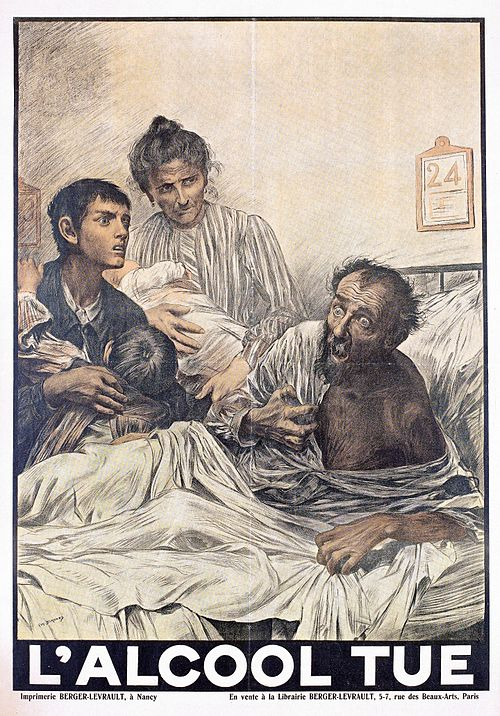
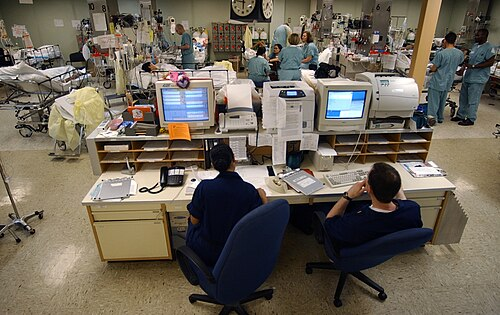

# DELIRIUM

O delirium não é uma doença, mas sim uma síndrome. Se você entender isso agora, metade das questões de prova já estão garantidas. Imagine o cérebro como um computador: a demência seria um problema no "hardware" (o disco rígido está estragando), enquanto o delirium é um erro no "software" ou uma oscilação na "energia" (um insulto sistêmico impedindo o processamento correto).

Muitos alunos confundem delirium com demência ou até com psicose primária. O erro clássico é achar que, porque o paciente está confuso, ele tem Alzheimer. Lembre-se: o delirium é a manifestação cerebral de uma doença que, muitas vezes, está acontecendo longe da cabeça, como uma pneumonia ou uma infecção urinária.

*Figura 1 - Ilustração histórica de paciente em estado de delirium, demonstrando a confusão mental aguda e alteração comportamental características da síndrome. Fonte: Wellcome Collection, CC BY 4.0 | Wikimedia Commons*

## Definição e Critérios Diagnósticos

A definição oficial, baseada no DSM-5, descreve o delirium como uma perturbação da atenção e da consciência que se desenvolve em um curto período de tempo. Mas vamos traduzir isso para o "mediquês" de prova.

Para o diagnóstico, precisamos de quatro pilares fundamentais:

- Início agudo (horas ou dias) e curso flutuante (o paciente melhora e piora ao longo do dia, a famosa "piora noturna").

- Perturbação da atenção (o paciente não consegue focar em uma conversa ou seguir um comando simples).

- Alteração na cognição (memória, orientação, linguagem) ou percepção (alucinações).

- Evidência de que a alteração é causada por uma condição médica, substância ou intoxicação.

### O Método CAM (Confusion Assessment Method)

Se existe algo que você precisa decorar para a residência, é o CAM. Ele é o padrão-ouro para triagem à beira do leito. Para dizer que o paciente tem delirium pelo CAM, ele precisa obrigatoriamente dos itens 1 e 2, somados ao 3 OU ao 4.

| Critério CAM | Descrição |
| --- | --- |
| 1. Início Agudo e Curso Flutuante | Mudança súbita no estado mental basal? O comportamento oscila? |
| 2. Desatenção | O paciente se distrai facilmente? Tem dificuldade em manter o foco? |
| 3. Pensamento Desorganizado | Discurso incoerente, fuga de ideias, conversa sem nexo? |
| 4. Alteração do Nível de Consciência | Qualquer coisa diferente de "alerta" (vigilante, letárgico, estupor)? |

**Dica de prova:** A banca vai te dar um caso de um idoso que ficou confuso "ontem para hoje". Se ele estiver desatento, você já tem 90% do diagnóstico. Sem desatenção, dificilmente será delirium.

## Epidemiologia e Fatores de Risco

O delirium é extremamente comum. Em enfermarias de geriatria, até 50% dos pacientes podem apresentar a síndrome. Na UTI, esse número sobe para 80%. Por que isso importa? Porque o delirium aumenta a mortalidade, o tempo de internação e o risco de declínio funcional permanente.

Para entender quem terá delirium, usamos o modelo de Inouye: a interação entre a **Vulnerabilidade do Paciente** (fatores predisponentes) e o **Insulto Agudo** (fatores precipitantes).

### Fatores Predisponentes (O "Terreno")

São características que o paciente já traz consigo. Quanto mais predisponentes, menor precisa ser o insulto para causar o delirium.

- Idade avançada (principal fator não modificável).

- Déficit cognitivo prévio ou Demência (o principal fator de risco isolado).

- Deficiências sensoriais (o idoso que não enxerga ou não ouve bem se desorienta mais fácil).

- Histórico de depressão ou abuso de álcool.

### Fatores Precipitantes (O "Gatilho")

É o que aconteceu agora para descompensar o paciente.

- Infecções (Pneumonia e ITU são as campeãs em provas).

- Medicamentos (Anticolinérgicos, benzodiazepínicos, opioides).

- Distúrbios eletrolíticos (Hiponatremia é figurinha carimbada).

- Cirurgias (Principalmente ortopédicas e cardíacas).

- Dor não controlada e retenção urinária/fecaloma.

**Exemplo Clínico:** Imagine dois pacientes. Um jovem de 20 anos sem doenças e um idoso de 85 anos com Alzheimer. Para o jovem ter delirium, ele precisa de uma sepse grave (insulto enorme). Para o idoso, uma simples mudança de quarto ou uma dose de prometazina (insulto pequeno) já é suficiente. Como diz o Dr. Will, "o cérebro do idoso é uma corda bamba; qualquer vento o derruba".

## Fisiopatologia: O Porquê da Confusão

Por que uma infecção no pulmão faz o paciente parar de reconhecer a filha? A explicação mais aceita envolve o desequilíbrio de neurotransmissores e a neuroinflamação.

- **Déficit Colinérgico:** A acetilcolina é o neurotransmissor da atenção e do aprendizado. No delirium, seus níveis despencam. É por isso que drogas anticolinérgicas (como a amitriptilina ou a escopolamina) são venenos para o idoso.

- **Excesso Dopaminérgico:** A dopamina está aumentada, o que explica a agitação e as alucinações. É por isso que usamos bloqueadores dopaminérgicos (antipsicóticos) para tratar os sintomas.

- **Neuroinflamação:** Citocinas periféricas (TNF-alfa, IL-1) aumentam a permeabilidade da barreira hematoencefálica e ativam a microglia, causando disfunção neuronal direta.

## Quadro Clínico e Subtipos

O delirium não é apenas o paciente gritando e tentando sair do leito. Na verdade, o tipo mais perigoso é o que ninguém percebe.

### 1. Delirium Hiperativo

É o mais fácil de diagnosticar. O paciente apresenta agitação psicomotora, alucinações, agressividade e desorientação. É o que mais gera chamados para a enfermagem.

### 2. Delirium Hipoativo

Este é a "pegadinha" das provas e da vida real. O paciente está quietinho, sonolento, letárgico, com movimentos lentos. Muitas vezes é confundido com depressão ou apenas "o cansaço da doença". É o subtipo com pior prognóstico, pois o diagnóstico é tardio e as complicações (como pneumonia aspirativa e escaras) são frequentes.

### 3. Delirium Misto

O paciente oscila entre os dois estados ao longo do dia.

| Característica | Hiperativo | Hipoativo |
| --- | --- | --- |
| Atividade Motora | Aumentada | Diminuída |
| Humor | Irritável, ansioso | Apático, retraído |
| Risco | Quedas, retirada de sondas | Aspiração, escaras, TEP |
| Reconhecimento | Fácil | Difícil (subdiagnosticado) |

## Diagnóstico Diferencial

A principal dúvida é: Delirium ou Demência? No MedEvo, sempre ensinamos a olhar para o relógio e para a atenção.

- **Início:** Delirium é súbito (dias); Demência é insidioso (anos).

- **Atenção:** Delirium tem atenção muito prejudicada; na Demência inicial, a atenção costuma estar preservada.

- **Consciência:** No delirium, o nível de consciência flutua; na demência, o paciente está alerta até fases muito avançadas.

Outro diferencial importante é a **Depressão**. O idoso deprimido pode ter uma "pseudodemência", mas ele geralmente responde "não sei" às perguntas, enquanto o paciente com delirium dá respostas incoerentes ou desorientadas.

## Investigação Etiológica: Onde procurar o culpado?

Se você diagnosticou delirium, sua próxima pergunta DEVE ser: "O que está causando isso?". Não se contente em dar um antipsicótico e ir embora.

A investigação deve ser sistemática:

- **Anamnese e Revisão de Prontuário:** Olhe a lista de medicamentos (Beers Criteria). Algum benzodiazepínico foi iniciado? O paciente está sem evacuar há 4 dias?

- **Exame Físico Completo:** Procure por sinais de infecção (mesmo sem febre!), sinais de desidratação, globo vesical (retenção urinária) ou sinais focais neurológicos.

- **Exames Laboratoriais Iniciais:**

- Hemograma (infecção).

- Eletrólitos (Sódio, Cálcio, Magnésio).

- Função renal e hepática.

- Urina 1 e Urocultura (ITU é causa clássica).

- Glicemia capilar (hipoglicemia mata neurônio rápido).

- Saturação de O2 e Gasometria (hipóxia).

**Quando pedir Tomografia de Crânio?**
Muitos alunos erram achando que todo delirium precisa de TC. Errado! Segundo as diretrizes da SBGG, pedimos imagem apenas se:

- Houver déficit neurológico focal novo.

- História de trauma craniano recente.

- Delirium sem causa óbvia após investigação clínica inicial.

- Paciente em uso de anticoagulantes.

## Tratamento Não Farmacológico (A Primeira Linha)

*Figura 2 - Sistema de monitoramento em UTI. O ambiente de terapia intensiva é um fator de risco importante para delirium, exigindo medidas preventivas específicas. Fonte: US Navy, Domínio Público | Wikimedia Commons*

A diretriz é clara: o tratamento do delirium é tratar a causa base e implementar medidas ambientais. O uso de remédios é para controle de sintomas graves, não para a cura da síndrome.

Medidas que reduzem a incidência e a duração:

- **Reorientação constante:** Calendários, relógios e presença de familiares.

- **Higiene do sono:** Luz acesa de dia, silêncio e escuro à noite. Evitar coletas de sangue às 3 da manhã se possível.

- **Mobilização precoce:** Tirar o paciente do leito, caminhar no corredor.

- **Auxílios sensoriais:** Devolver os óculos e o aparelho auditivo para o paciente.

- **Hidratação e Nutrição:** Evitar jejum prolongado.

- **Evitar contenção física:** Amarrar o paciente aumenta a agitação e o risco de lesões. Só deve ser usada em último recurso para evitar autoagressão ou retirada de dispositivos vitais.

## Tratamento Farmacológico

Quando as medidas não farmacológicas falham e o paciente apresenta agitação que coloca em risco a si mesmo ou ao tratamento (ex: tentando arrancar um acesso central ou tubo), usamos medicamentos.

### 1. Antipsicóticos (A Escolha de Ouro)

O **Haloperidol** (antipsicótico de 1ª geração) continua sendo a droga de escolha na maioria das diretrizes para agitação aguda.

- **Dose:** Baixas doses! No idoso, começamos com 0,5 mg a 1,0 mg (VO, IM ou EV).

- **Por que Haloperidol?** Tem poucos efeitos anticolinérgicos e não causa muita sedação ou hipotensão.

- **Efeitos Adversos:** Cuidado com o prolongamento do intervalo QT (risco de Torsades de Pointes) e sintomas extrapiramidais (acatisia, parkinsonismo). Se o paciente ficar inquieto após o halo, suspeite de acatisia e suspenda a droga.

Antipsicóticos atípicos (Quetiapina, Risperidona, Olanzapina) podem ser usados, especialmente se houver necessidade de uso prolongado, mas o Haloperidol é o "rei" da urgência.

### 2. Benzodiazepínicos (Os Vilões, com Exceções)

Em regra geral, **EVITE** benzodiazepínicos no delirium. Eles pioram a confusão mental e aumentam o risco de quedas e depressão respiratória.
**As duas exceções onde o benzo é a primeira linha:**

- Delirium Tremens (abstinência alcoólica).

- Abstinência de benzodiazepínicos.

### 3. Outras Opções

- **Dexmedetomidina (Precedex):** Muito usada em UTI. É um agonista alfa-2 que promove sedação sem depressão respiratória importante e parece reduzir a duração do delirium em pacientes ventilados.

| Medicamento | Dose Inicial (Idoso) | Observação |
| --- | --- | --- |
| Haloperidol | 0,5 - 1,0 mg VO/IM/EV | Padrão-ouro. Monitorar QT no ECG. |
| Risperidona | 0,25 - 0,5 mg VO | Atípico. Menos extrapiramidal que o halo. |
| Quetiapina | 12,5 - 25 mg VO | Boa para quem precisa de sedação leve à noite. |
| Lorazepam | 0,5 - 1,0 mg | APENAS se abstinência de álcool/benzo. |

## Situações Especiais e Pegadinhas de Prova

### Hiponatremia e Delirium

O idoso que usa diurético tiazídico (Hidroclorotiazida) e chega com sonolência e náuseas. A banca quer que você pense em AVC, mas o diagnóstico é Hiponatremia. A correção deve ser lenta para evitar a Síndrome de Desmielinização Osmótica (antiga mielinólise pontina).

### Delirium Pós-Operatório

Muito comum em cirurgias de quadril. Antes de achar que o paciente "enlouqueceu", verifique:

- Ele está com dor? (Dor causa delirium).

- Ele está com bexigoma? (Sonda entupida causa agitação).

- Ele está hipoxêmico?

### O Papel da Família

A presença de um acompanhante familiar é uma das intervenções não farmacológicas mais eficazes. O rosto familiar ajuda na ancoragem da realidade.

## Prognóstico e Complicações

O delirium não é um evento benigno que "passa e pronto".

- Aumenta o risco de demência futura (lesão neuronal direta).

- Aumenta a mortalidade em até 2 anos após o evento.

- Gera perda de independência funcional (o idoso que andava passa a precisar de cadeira de rodas).

## Pontos-Chave para Prova

- **Diagnóstico é CLÍNICO:** Não se faz diagnóstico de delirium por TC ou RM. O CAM é a ferramenta principal.

- **A tríade clássica:** Início agudo, curso flutuante e desatenção.

- **Fator de risco nº 1:** Déficit cognitivo prévio (Demência).

- **Causa Farmacológica:** Drogas anticolinérgicas (antidepressivos tricíclicos, anti-histamínicos de 1ª geração, antiespasmódicos).

- **Delirium Hipoativo:** É o mais comum no idoso e o mais negligenciado. Pior prognóstico.

- **Tratamento Inicial:** Identificar e tratar o fator precipitante (ex: tratar a pneumonia, retirar a sonda).

- **Contenção Física:** NUNCA deve ser a primeira medida. Aumenta a agitação e o risco de morte.

- **Haloperidol:** Primeira escolha para agitação severa. Dose baixa (0,5-1mg). Monitorar intervalo QT.

- **Benzodiazepínicos:** Contraindicados no delirium, EXCETO se a causa for abstinência de álcool ou de próprios benzos.

- **Exames de Imagem:** Solicitar apenas se houver trauma, sinais focais ou dúvida diagnóstica após exames clínicos.

- **Acatisia:** Se o paciente piorar a agitação motora após o Haloperidol, não aumente a dose! Ele pode estar tendo um efeito colateral.

- **Infecção Oculta:** Idoso pode ter sepse urinária ou pneumonia SEM febre e SEM leucocitose. O delirium pode ser o único sinal.

- **Metas:** A meta não é o paciente dormir 24h, mas sim garantir a segurança e permitir que o cérebro se recupere do insulto sistêmico.

- **Prevenção:** A melhor estratégia é a prevenção multifatorial (sono, hidratação, orientação, mobilização). 💡

 Cópia offline para consulta pessoal.
 Fonte original:
 [https://www.medevo.com.br/material-apoio/ler/89c8af1f-c45b-4d43-a194-a650e1b8692a](https://www.medevo.com.br/material-apoio/ler/89c8af1f-c45b-4d43-a194-a650e1b8692a)
