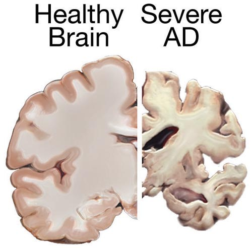
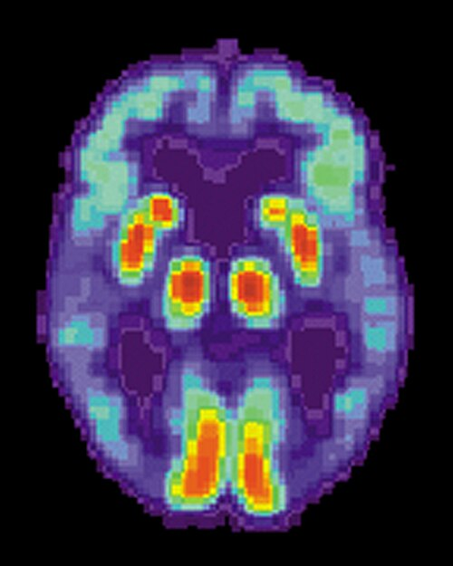

# DEMÊNCIAS

Para começar nossa conversa, você precisa entender que demência não é um diagnóstico fechado, mas sim uma síndrome. Quando você está no ambulatório ou diante de uma questão de prova, o seu primeiro passo nunca é dizer "isso é Alzheimer". O seu primeiro passo é confirmar que o paciente tem uma Síndrome Demencial.

A definição atual, baseada no DSM-5, utiliza o termo Transtorno Neurocognitivo Maior. Para o aluno MedEvo, o conceito fundamental é: declínio cognitivo em um ou mais domínios (memória, linguagem, função executiva, atenção, percepto-motor ou cognição social) que seja grave o suficiente para interferir na independência do indivíduo. Se o paciente tem esquecimento, mas continua pagando suas contas, dirigindo e cuidando da casa sozinho, ele não tem demência; ele tem, possivelmente, um Comprometimento Cognitivo Leve (CCL).

A perda de funcionalidade é o divisor de águas. Guarde isso: Declínio Cognitivo + Perda de Funcionalidade = Síndrome Demencial.

*Figura 1 - Comparação entre cérebro saudável (esquerda) e cérebro afetado pela Doença de Alzheimer (direita), demonstrando a atrofia cortical e ventricular características. Fonte: NIH, Domínio Público | Wikimedia Commons*

## Epidemiologia e Fatores de Risco

O principal fator de risco para demência é a idade. Com o aumento da longevidade da população brasileira, a prevalência de Alzheimer e outras demências disparou. No Brasil, a ordem de prevalência que você encontrará nas provas é: Doença de Alzheimer (responsável por mais de 50 a 60% dos casos), seguida pela Demência Vascular e pela Demência por Corpos de Lewy.

Existem fatores de risco modificáveis que as bancas adoram cobrar, pois refletem a prevenção na atenção primária. Diabetes mellitus, hipertensão, obesidade, sedentarismo, baixa escolaridade e perda auditiva são os principais. O diabetes, especificamente, acelera o envelhecimento cerebral e a disfunção cognitiva, dificultando o autocuidado do paciente com a própria doença, criando um ciclo vicioso.

## O Roteiro Diagnóstico: Onde a maioria erra

Muitos alunos erram questões por quererem "pular etapas". Na geriatria, seguimos um rito. Antes de rotular um idoso com uma doença neurodegenerativa irreversível, você tem a obrigação ética e técnica de afastar causas reversíveis.

### Passo 1: Anamnese e Avaliação Funcional

A história deve ser colhida com o paciente e, obrigatoriamente, com um informante. O paciente com Alzheimer frequentemente apresenta anosognosia, ou seja, ele não tem consciência do seu déficit. Se o idoso diz que a memória está ótima, mas a filha diz que ele se perdeu no mercado, acredite na filha.

Nesta fase, avaliamos as Atividades de Vida Diária (AVDs). Elas são divididas em:

- Atividades Instrumentais (AIVDs): Usar o telefone, gerenciar dinheiro, usar transporte, cozinhar. São as primeiras a serem perdidas.

- Atividades Básicas (ABVDs): Tomar banho, vestir-se, higiene pessoal, continência e alimentação. Quando estas são afetadas, a demência já está em estágio moderado a grave.

### Passo 2: Rastreio Cognitivo

O Mini-Exame do Estado Mental (MEEM) é o queridinho das provas. Mas atenção: o ponto de corte depende da escolaridade. Um erro clássico é usar 24 para todo mundo. No Brasil, as referências variam, mas geralmente aceitamos:

- Analfabetos: 19-20

- Baixa/Média escolaridade: 24

- Alta escolaridade: 28

Se um paciente com alta escolaridade chega com queixa e faz 25 no MEEM, isso é um sinal de alerta vermelho, mesmo estando acima do "corte" padrão de 24. Nesses casos, ferramentas como o MoCA (Montreal Cognitive Assessment) são superiores por avaliarem melhor as funções executivas.

O Teste do Relógio é outra pérola de prova. Ele avalia funções executivas e visuoespaciais. Pedir para o paciente desenhar um relógio com os ponteiros marcando "11 horas e 10 minutos" exige planejamento cortical complexo. Se ele falha aqui, a suspeita de declínio cognitivo ganha muita força.

### Passo 3: Excluir Causas Reversíveis (O "Checklist" Obrigatório)

Você não pode diagnosticar Alzheimer sem pedir exames laboratoriais. Segundo a Academia Brasileira de Neurologia e as diretrizes de Geriatria, o rastreio básico inclui:

- Hemograma completo (pensando em anemia perniciosa/VCM alto).

- TSH (hipotireoidismo é causa clássica de pseudodemência).

- Vitamina B12 e Folato (a deficiência de B12 causa confusão e sintomas piramidais como o sinal de Babinski).

- Bioquímica (Cálcio, função renal e hepática).

- Sorologias (VDRL para neurossífilis e HIV).

- Neuroimagem (TC ou RM de crânio).

A neuroimagem serve para excluir tumores, hematomas subdurais crônicos e a famosa Hidrocefalia de Pressão Normal (HPN).

## Diagnóstico Diferencial: As "Armadilhas" da Prova

Aqui é onde o Dr. Will sempre reforça: cuidado com o Delirium e a Depressão.

### Delirium vs. Demência

O Delirium é uma alteração aguda e flutuante da consciência e da atenção. Se um idoso com demência prévia apresenta uma agitação súbita ou sonolência excessiva de um dia para o outro, ele tem um Delirium sobreposto à demência. A causa geralmente é orgânica: infecção urinária, pneumonia, desidratação ou polifarmácia. Nunca trate agitação aguda no idoso apenas com antipsicóticos sem antes procurar um foco infeccioso.

### Depressão (Pseudodemência)

A depressão no idoso pode mimetizar demência. O paciente apresenta anedonia, queixas somáticas e, nos testes cognitivos, ele costuma responder "não sei" com frequência, demonstrando falta de esforço, ao contrário do paciente com Alzheimer que tenta acertar e erra. Na depressão, o início costuma ser mais datado e o MEEM pode estar normal ou levemente alterado por falta de atenção.

| Característica | Demência (Alzheimer) | Depressão (Pseudodemência) | Delirium |
| --- | --- | --- | --- |
| Início | Insidioso, meses/anos | Semanas/meses | Agudo, horas/dias |
| Consciência | Preservada até fases tardias | Preservada | Alterada (flutuante) |
| Atenção | Preservada inicialmente | Pode estar reduzida | Globalmente afetada |
| Esforço nos testes | Tenta responder, usa estratégias | Desiste fácil ("não sei") | Incapaz de realizar |
| Reversibilidade | Irreversível/Progressiva | Reversível com tratamento | Reversível (tratar causa) |

## As Grandes Etiologias

### 1. Doença de Alzheimer (DA)

*Figura 2 - PET scan demonstrando hipometabolismo cerebral na Doença de Alzheimer, com redução da captação de glicose em áreas temporoparietais. Fonte: US National Institute on Aging, Domínio Público | Wikimedia Commons*

É a causa mais comum. A fisiopatologia envolve o acúmulo de placas neuríticas (proteína beta-amiloide) e emaranhados neurofibrilares (proteína tau hiperfosforilada).

- Quadro Clínico: Perda de memória episódica (fatos recentes) é o sintoma cardinal. O paciente esquece o que almoçou, mas lembra detalhes da infância. A progressão é lenta e contínua (não é em degraus).

- Imagem: Atrofia hipocampal é o achado mais característico na Ressonância Magnética.

### 2. Demência Vascular (DV)

Segunda causa mais comum. Está intimamente ligada a fatores de risco cardiovascular.

- Quadro Clínico: Classicamente descrita como um declínio "em degraus" (o paciente tem um evento isquêmico, piora, estabiliza, tem outro evento, piora novamente). No entanto, pode ser insidiosa em casos de doença de pequenos vasos.

- Dica de Prova: Frequentemente associada a sinais focais no exame físico e alterações de marcha precoces.

### 3. Demência por Corpos de Lewy (DCL)

Esta é a favorita das bancas para testar se o aluno conhece a tríade clássica.

- Quadro Clínico:

- Flutuação cognitiva (o paciente está ótimo de manhã e confuso à tarde).

- Alucinações visuais complexas (vê pessoas ou animais detalhados que não existem).

- Parkinsonismo (rigidez e bradicinesia que surgem junto ou após o declínio cognitivo).

- Bônus: Distúrbio comportamental do sono REM (o paciente "atua" os sonhos, grita e se debate).

- Cuidado: Esses pacientes têm hipersensibilidade a neurolépticos. Se você der haloperidol, ele pode travar ou ter uma reação grave.

### 4. Demência Frontotemporal (DFT)

Ocorre em pacientes mais jovens (50-60 anos). Aqui, a memória costuma estar preservada no início.

- Variante Comportamental: Mudança de personalidade, desinibição social (faz comentários inadequados, tira a roupa em público), hiperoralidade (come compulsivamente) e perda de empatia.

- Variante Linguagem: Afasias progressivas.

- Imagem: Atrofia seletiva dos lobos frontais e temporais.

### 5. Hidrocefalia de Pressão Normal (HPN)

Uma das causas "reversíveis" (ou tratáveis) mais cobradas. Lembre-se da Tríade de Hakim-Adams:

- Apraxia da marcha (marcha magnética, parece que o pé está grudado no chão).

- Incontinência urinária (precoce).

- Demência (geralmente subcortical, lentificação).

- Diagnóstico: Imagem mostrando ventrículos dilatados desproporcionais à atrofia cortical. O "Tap Test" (retirada de líquor com melhora da marcha) ajuda a confirmar a indicação de derivação ventrículo-peritoneal.

## Tratamento Farmacológico: O que e quanto prescrever

O tratamento da demência não cura, mas lentifica a perda funcional e melhora os sintomas comportamentais.

### Inibidores da Acetilcolinesterase (IACE)

Indicados para Alzheimer leve a moderado e também usados na Demência de Lewy e Vascular.

- Donepezila: Dose inicial 5mg/dia, podendo chegar a 10mg/dia após 4-6 semanas. Principal efeito colateral: náuseas, diarreia e bradicardia.

- Galantamina: 8mg a 24mg/dia (apresentações de liberação prolongada).

- Rivastigmina: Disponível em adesivo (patch), o que reduz efeitos gastrointestinais. Doses de 4,6mg, 9,5mg e 13,3mg/24h.

### Antagonistas do Receptor NMDA

- Memantina: Indicada para Alzheimer moderado a grave. Pode ser usada em monoterapia ou associada aos IACE. Dose inicial 5mg/dia, progredindo 5mg por semana até a dose alvo de 20mg/dia (10mg 2x ao dia). Ela protege o neurônio contra o excesso de glutamato.

### Manejo de Sintomas Comportamentais e Psicológicos (SCPD)

Esta é a parte mais difícil do manejo. Antes de medicar, tente medidas não farmacológicas: rotina, iluminação adequada, evitar confrontos.

- Depressão e Ansiedade: Prefira ISRS (Sertralina, Citalopram). Evite Tricíclicos pelo efeito anticolinérgico (que piora a cognição).

- Insônia e Perda de Peso: Mirtazapina (7,5mg a 30mg à noite) é excelente, pois abre o apetite e ajuda no sono.

- Agitação e Psicose: Se as medidas não farmacológicas falharem, use antipsicóticos atípicos em doses baixas (Quetiapina 12,5-25mg ou Risperidona 0,25-0,5mg). Evite o uso prolongado pelo risco de eventos cardiovasculares.

- Trazodona: Muito útil na DFT e para controle de agitação noturna em idosos, com perfil de segurança favorável.

## Situações Especiais e Cuidados Paliativos

Um tema recorrente em provas de residência modernas é a terminalidade na demência. A demência avançada é uma doença terminal.

Pérola de Prova: O uso de Sonda Nasoenteral (SNE) ou Gastrostomia (GTT) em pacientes com demência avançada e disfagia NÃO melhora a sobrevida, não previne pneumonia por broncoaspiração e não melhora a qualidade de vida. A recomendação é o conforto e a alimentação assistida (conforto oral).

Além disso, em fases muito avançadas (CDR 3), deve-se considerar a suspensão de medicamentos como estatinas e, às vezes, até os próprios inibidores da colinesterase, focando exclusivamente no controle de sintomas como dor, dispneia e agitação.

## Tabelas Comparativas para Revisão Rápida

### Tabela 1: Causas Reversíveis e Investigação

| Causa Reversível | Achado Clínico/Laboratorial | Conduta Inicial |
| --- | --- | --- |
| Hipotireoidismo | TSH elevado, lentificação, pele seca | Reposição de Levotiroxina |
| Deficiência de B12 | VCM > 100, anemia, parestesias | Reposição de Vitamina B12 |
| Neurossífilis | VDRL/FTABS +, pupilas de Argyll-Robertson | Penicilina Cristalina EV |
| HPN | Tríade: Marcha + Incontinência + Demência | Tap Test / Derivação (DVP) |
| Depressão | Anedonia, "não sei" nos testes | Antidepressivos (ISRS) |

### Tabela 2: Diferenciação das Demências Degenerativas

| Doença | Clínica Marcante | Neuroimagem |
| --- | --- | --- |
| Alzheimer | Memória episódica, início insidioso | Atrofia de Hipocampo |
| Vascular | Degraus, sinais focais, fatores de risco CV | Infartos, leucoencefalopatia |
| Lewy | Alucinação visual, flutuação, Parkinsonismo | Atrofia cortical difusa |
| Frontotemporal | Mudança de comportamento/personalidade | Atrofia Frontal e Temporal |

### Tabela 3: Metas e Doses Farmacológicas

| Droga | Classe | Dose Inicial | Dose Alvo |
| --- | --- | --- | --- |
| Donepezila | IACE | 5 mg/dia | 10 mg/dia |
| Rivastigmina | IACE | 1,5 mg 2x/dia (ou patch 4,6) | 6 mg 2x/dia (ou patch 9,5) |
| Memantina | Antiglumamatérgico | 5 mg/dia | 20 mg/dia |
| Quetiapina | Antipsicótico Atípico | 12,5 - 25 mg | Menor dose eficaz |
| Mirtazapina | Antidepressivo | 7,5 - 15 mg | 30 mg |

## Pontos-Chave para Prova 🧠

- A demência é um diagnóstico clínico e funcional. Não se diagnostica demência apenas com um MEEM alterado se o paciente for funcionalmente independente.

- O primeiro passo na investigação é sempre excluir causas reversíveis: TSH, B12, VDRL e Imagem são obrigatórios.

- A tríade de Hakim-Adams (HPN) é: Demência + Incontinência Urinária + Ataxia de Marcha (magnética).

- Na Doença de Lewy, as alucinações visuais são precoces e há extrema sensibilidade a antipsicóticos típicos (Haloperidol).

- O Teste do Relógio avalia principalmente funções executivas e visuoespaciais.

- Deficiência de B12 pode causar demência com VCM elevado e sinal de Babinski presente (degeneração combinada subaguda).

- A depressão no idoso (pseudodemência) cursa com muitas respostas do tipo "não sei" e melhora com tratamento específico.

- Delirium é agudo e flutuante; Demência é crônica e progressiva. Delirium sobreposto à demência é comum em infecções.

- Mirtazapina é a droga de escolha para o idoso deprimido, com insônia e perda de peso.

- Sonda enteral em demência avançada NÃO previne pneumonia aspirativa nem aumenta sobrevida.

- Contraindicação absoluta para IACE: Bradicardia grave ou bloqueios atrioventriculares sem marcapasso (pelo risco de síncope e piora da condução).

- A causa básica de óbito em um paciente com Alzheimer que morre de pneumonia é a Doença de Alzheimer.

- Escolaridade influencia diretamente o ponto de corte do MEEM.

- A Doença de Alzheimer tem progressão contínua; a Vascular costuma ser em degraus.

- Em casos de alta escolaridade com queixa cognitiva, o MoCA é mais sensível que o MEEM.

- O tratamento farmacológico da DA visa lentificar a progressão, não a cura.

- A anosognosia (falta de percepção da doença) é comum no Alzheimer e ajuda a diferenciar de queixas subjetivas de memória por ansiedade.

- A polifarmácia é um fator de risco importante para confusão mental e deve ser sempre revisada.

Ao estudar demências, lembre-se sempre do que o MedEvo preconiza: olhe para o paciente como um todo. A perda de memória é apenas a ponta do iceberg de um processo que envolve família, funcionalidade e qualidade de vida. Se você dominar a diferenciação entre as quatro grandes causas e souber excluir o que é reversível, você acertará qualquer questão de residência sobre o tema.

 Cópia offline para consulta pessoal.
 Fonte original:
 [https://www.medevo.com.br/material-apoio/ler/aad80d0a-cecb-465b-99ba-f15e9346cdb2](https://www.medevo.com.br/material-apoio/ler/aad80d0a-cecb-465b-99ba-f15e9346cdb2)
