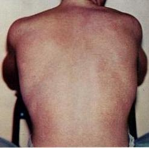

# DENGUE NA GESTAÇÃO: CLASSIFICAÇÃO, MANEJO E INDICAÇÃO DE INTERRUPÇÃO

A dengue na gestação não é apenas uma "virose comum". Para o obstetra e para quem presta prova de residência, ela deve ser encarada como uma condição de alto risco potencial. O grande desafio aqui é que a fisiologia da gestante mascara os sinais iniciais de gravidade, e quando o choque aparece, ele costuma ser abrupto e catastrófico.

Nesta aula, vamos dissecar como o Ministério da Saúde e a FEBRASGO orientam o manejo dessas pacientes. Esqueça a decoreba pura, vamos entender o porquê de cada conduta.

*Figura 1 - Fêmea do mosquito Aedes aegypti durante repasto sanguíneo, vetor responsável pela transmissão da dengue, Zika e Chikungunya. Fonte: James Gathany/CDC, Domínio Público | Wikimedia Commons*

## Fisiopatologia: Por que a Gestante é um Grupo Especial?

Para entender o manejo, você precisa entender o que a dengue faz no corpo. A marca registrada da dengue grave é o aumento da permeabilidade vascular. O líquido sai de dentro do vaso e vai para o terceiro espaço.

Na gestante, temos um cenário peculiar. Ela já possui um aumento fisiológico do volume plasmático (cerca de 40 a 50%). Isso significa que ela pode perder muito líquido para o terceiro espaço antes de demonstrar uma queda na pressão arterial. Quando a pressão cai, ela já está em um estágio de choque muito avançado.

Além disso, a plaquetopenia e a leucopenia, achados clássicos da dengue, podem se confundir com outras patologias obstétricas, como a Síndrome HELLP. Como o Dr. Will sempre enfatiza em suas discussões clínicas, na dúvida entre dengue e uma complicação hipertensiva em área endêmica, você deve investigar ambas simultaneamente, pois o manejo da hidratação é radicalmente diferente.

## Diagnóstico Clínico e Diferencial das Arboviroses

As bancas adoram colocar um caso clínico de uma gestante com exantema e pedir para você diferenciar entre Dengue, Zika e Chikungunya. Se você souber as "palavras-chave" de cada uma, não erra nunca mais.

### Dengue

*Figura 2 - Exantema maculopapular típico da dengue, geralmente aparecendo após a febre começar a ceder entre o 3º e 7º dia de doença. Fonte: United States Military, Domínio Público | Wikimedia Commons*

O quadro costuma ser de febre alta de início súbito, associada a cefaleia, dor retro-orbitária (clássico!), mialgia e prostração. No hemograma, a marca é a leucopenia e a plaquetopenia.

### Zika Vírus

Aqui a febre é baixa ou ausente. O que manda é o exantema maculopapular pruriginoso que começa no rosto e desce, associado a uma conjuntivite não purulenta (olho vermelho que não sai secreção).
Dica de prova: O Zika tem um tropismo pelo sistema nervoso central do feto. O maior risco de malformações, como a microcefalia e calcificações periventriculares, ocorre no primeiro trimestre. Além disso, lembre-se da pérola clínica: o RT-PCR para Zika na urina é mais sensível e permanece positivo por mais tempo que no sangue.

### Chikungunya

A palavra-chave aqui é artralgia intensa e incapacitante. A paciente chega "dobrada" de dor nas articulações. Na gestante, o perigo maior é a transmissão vertical intraparto (cerca de 50% de chance se a mãe estiver virêmica no momento do parto), o que pode causar formas graves de Chikungunya neonatal, com manifestações cardíacas e neurológicas.

### Tabela 1: Diferencial Clínico das Arboviroses na Gestação

| Característica | Dengue | Zika | Chikungunya |
| --- | --- | --- | --- |
| Febre | Alta e súbita | Baixa ou ausente | Alta e súbita |
| Exantema | Presente (3 a 6 dia) | Precoce e muito pruriginoso | Presente (2 a 5 dia) |
| Artralgia | Leve/Moderada | Leve | Intensa e incapacitante |
| Conjuntivite | Rara | Frequente (não purulenta) | Rara |
| Plaquetopenia | Marcante | Leve ou ausente | Leve |
| Risco Fetal | Aborto, DPP, Prematuridade | Microcefalia, RCIU | Transmissão intraparto (grave) |

## Classificação de Risco: O Pulo do Gato para a Prova

O Ministério da Saúde classifica a dengue em grupos (A, B, C e D). Aqui está o erro clássico de quem não estuda por materiais focados como os do MedEvo: achar que toda gestante começa no Grupo A.

Atenção: A gestação, por si só, é uma condição clínica especial. Portanto, nenhuma gestante com suspeita de dengue é Grupo A. Toda gestante sem sinais de alarme é, no mínimo, Grupo B.

### Sinais de Alarme (Grupo C)

Estes sinais indicam que o líquido está saindo do vaso. Você precisa memorizá-los, pois eles definem a internação imediata:

- Dor abdominal intensa e contínua (muitas vezes confundida com contração ou DPP).

- Vômitos persistentes.

- Acúmulo de líquidos (ascite, derrame pleural, derrame pericárdico).

- Hipotensão postural ou lipotimia (pérola clínica: indica falha nos mecanismos compensatórios).

- Hepatomegalia dolorosa.

- Sangramento de mucosa.

- Letargia ou irritabilidade.

- Aumento repentino do hematócrito (hemoconcentração).

### Sinais de Choque (Grupo D)

- Pulso rápido e fino.

- Extremidades frias e úmidas (cianose).

- Enchimento capilar lento (> 2 segundos).

- Hipotensão arterial (sinal tardio na gestante).

- Oligúria (menos de 0,5 ml/kg/h).

## Diagnóstico Laboratorial

Não espere o resultado do exame para começar a hidratar! O tratamento da dengue é clínico. Porém, para a prova, você precisa saber qual exame pedir dependendo do tempo de sintomas:

- Até o 5 dia (Fase Virêmica): Pesquisa de Antígeno NS1, Isolamento Viral ou RT-PCR.

- Após o 6 dia (Fase de Resposta Imune): Sorologia IgM e IgG (Elisa).

No hemograma, o hematócrito é o seu melhor amigo. Ele é o GPS da hidratação. Se o hematócrito está subindo, falta líquido no vaso. Se está caindo após a hidratação, estamos no caminho certo (ou a paciente está sangrando, cuidado!).

## Manejo Clínico: Hidratação é a Única Salvação

O tratamento da dengue é suporte hídrico. Não existe antiviral. O uso de AAS e anti-inflamatórios não esteroidais (AINEs) é terminantemente proibido pelo risco de sangramento e, no caso dos AINEs, pelo risco de fechamento precoce do ducto arterioso fetal.

### Grupo B (Gestante sem sinais de alarme)

Essas pacientes podem, em teoria, ser acompanhadas em regime ambulatorial com reavaliação diária, mas a maioria dos protocolos recomenda observação ou internação abreviada devido ao risco obstétrico.

- Hidratação Oral: 60 ml/kg/dia.

- Composição: 1/3 de Soro de Reidratação Oral (SRO) e 2/3 de líquidos claros (água, sucos, chá).

- Monitoramento: Hemograma diário até 48 horas após o desaparecimento da febre.

### Grupo C (Gestante com sinais de alarme)

Internação obrigatória. O objetivo é impedir que ela evolua para o choque.

- Hidratação Venosa: 10 ml/kg de cristaloide (Soro Fisiológico ou Ringer Lactato) na primeira hora.

- Reavaliação: Se não houver melhora, repetir a fase de expansão. Se houver melhora, iniciar manutenção.

### Grupo D (Gestante em choque)

Emergência médica. UTI.

- Hidratação Venosa: 20 ml/kg de cristaloide em 20 minutos. Repetir até 3 vezes se necessário.

- Se não responder: Avaliar uso de aminas vasoativas e hemoderivados (se houver sangramento ou coagulopatia).

### Tabela 2: Resumo do Manejo de Hidratação

| Grupo | Perfil | Conduta Inicial | Local de Manejo |
| --- | --- | --- | --- |
| B | Gestante, sem sinais de alarme | 60 ml/kg/dia (VO) | Ambulatorial / Observação |
| C | Sinais de alarme presentes | 10 ml/kg (IV) em 1h | Internação (Leito de enfermaria) |
| D | Sinais de choque / Falência orgânica | 20 ml/kg (IV) em 20 min | UTI |

## Indicações de Interrupção da Gestação

Este é o ponto onde muitos alunos erram. A dengue, por si só, NÃO é indicação de interrupção da gestação. Na verdade, o ideal é que o parto não ocorra durante a fase aguda da doença (especialmente na fase crítica de extravasamento plasmático), devido ao altíssimo risco de hemorragia materna e instabilidade hemodinâmica.

A interrupção só deve ser considerada por indicações obstétricas ou fetais:

- Sofrimento fetal agudo não compensado.

- Descolamento Prematuro de Placenta (DPP).

- Deterioração grave da saúde materna que não responde às medidas de suporte.

Se o parto for inevitável (ex: trabalho de parto prematuro avançado), a via de escolha é preferencialmente a vaginal, para minimizar o risco de sangramento cirúrgico. Se a cesárea for necessária, deve-se ter reserva de hemoderivados (plaquetas, plasma fresco congelado e concentrado de hemácias).

Lembre-se: O uso de Plasma Fresco Congelado está indicado na dengue grave quando há choque associado a coagulopatia (INR elevado e plaquetopenia acentuada com sangramento ativo).

## Diagnóstico Diferencial com Patologias Obstétricas

A dengue pode mimetizar ou coexistir com doenças próprias da gestação. Isso é uma pegadinha frequente.

### Pré-eclâmpsia e Síndrome HELLP

Ambas podem apresentar dor abdominal, plaquetopenia e aumento de enzimas hepáticas.

- Como diferenciar? Na Pré-eclâmpsia, esperamos hipertensão e proteinúria. Na Dengue, a pressão tende a ser baixa ou normal, e há febre (que não é comum na HELLP). Além disso, o hematócrito na Dengue sobe (hemoconcentração), enquanto na HELLP ele pode cair por hemólise.

### Tabela 3: Dengue vs. Síndrome HELLP

| Achado | Dengue | Síndrome HELLP |
| --- | --- | --- |
| Febre | Comum | Rara |
| Pressão Arterial | Tendência a hipotensão | Hipertensão (geralmente) |
| Hematócrito | Elevado (hemoconcentração) | Reduzido (hemólise) |
| Plaquetas | Reduzidas | Reduzidas |
| Enzimas Hepáticas | Elevadas | Elevadas |
| LDH | Normal ou levemente aumentada | Muito elevada (hemólise) |

## Complicações e Riscos Adicionais

A dengue na gestação aumenta o risco de:

- Abortamento e óbito fetal.

- Restrição de Crescimento Intrauterino (RCIU).

- Trabalho de parto prematuro.

- Hemorragia pós-parto (devido à plaquetopenia e distúrbios de coagulação).

Um ponto importante extraído das pérolas clínicas: o tabagismo materno potencializa o risco de RCIU, o que pode complicar ainda mais o desfecho de uma gestante com arbovirose.

## Prevenção e Orientações no Pré-Natal

Como não há vacina liberada para gestantes no Programa Nacional de Imunizações (a vacina da dengue disponível atualmente é de vírus vivo atenuado, sendo contraindicada na gestação), o foco é a proteção vetorial.

- Repelentes: Devem ser usados conforme a orientação do fabricante (DEET, Icaridina ou IR3535 são seguros).

- Barreiras Físicas: Roupas claras e longas, telas em janelas e uso de ar-condicionado.

- Transmissão Sexual (Zika): Em áreas de surto, orientar o uso de preservativo, pois o vírus Zika permanece nos fluidos sexuais por períodos prolongados.

No trauma gestacional, que também pode ocorrer em pacientes com dengue (por síncope/lipotimia), lembre-se da prioridade: estabilizar a mãe primeiro (ABCDE) para depois avaliar o feto. O monitoramento do Batimento Cardiofetal (BCF) é essencial a partir de 20 a 24 semanas.

## Situações Especiais: Outras Infecções

Durante o manejo da gestante com febre e exantema, você pode se deparar com outros diagnósticos:

- Parvovírus B19: Suspeitar se houver contato com crianças com "cara esbofeteada" e artralgia. Solicitar IgM/IgG. O risco é a hidropisia fetal.

- Malária: Em áreas endêmicas, a febre na gestante deve sempre levantar a suspeita. O tratamento para P. vivax é feito com Cloroquina (segura na gestação).

- Varicela: Se a gestante for exposta e for suscetível, deve receber a Imunoglobulina (VZIG) em até 96 horas. Se o RN nascer de uma mãe que teve varicela entre 5 dias antes e 2 dias após o parto, ele também deve receber VZIG pelo alto risco de varicela neonatal grave.

## Pontos-Chave para Prova

- Toda gestante com suspeita de dengue é, no mínimo, Grupo B. Nunca Grupo A.

- Sinais de alarme (Grupo C) exigem internação e hidratação venosa imediata (10 ml/kg na 1 hora).

- A prova do laço é dispensável se a paciente já apresenta sangramento espontâneo (petéquias), pois isso já é um sinal de alarme.

- O hematócrito elevado é o principal marcador de extravasamento plasmático e gravidade.

- Contraindicação absoluta na dengue: AAS e Anti-inflamatórios (AINEs).

- Zika na gestação: O maior risco de microcefalia é no primeiro trimestre. O RT-PCR na urina é o exame de escolha pela maior janela de detecção.

- Chikungunya: O maior risco para o RN é a transmissão no momento do parto (intraparto), podendo causar encefalite e miocardite neonatal.

- A dengue não causa malformações congênitas estruturais (como agenesia renal ou holoprosencefalia). O risco é de perda gestacional e prematuridade.

- Hipotensão postural e lipotimia em gestantes com dengue são sinais de alarme precoces.

- No choque por dengue (Grupo D), o pulso é rápido e fino, e a pele é fria e úmida. Cuidado com a pegadinha de "pulso lento" ou "pele seca".

- A via de parto na gestante com dengue deve ser, preferencialmente, vaginal. A cesárea aumenta o risco de complicações hemorrágicas.

- Notificação de dengue, Zika e Chikungunya deve ser feita imediatamente (em até 24 horas) em casos suspeitos, conforme as normas de vigilância epidemiológica.

- Vacina da Dengue (vírus vivo): Contraindicada para gestantes e lactantes.

- Uso de repelentes: Altamente recomendado e seguro com substâncias aprovadas (DEET, Icaridina).

- Diagnóstico diferencial: Sempre considerar Síndrome HELLP em gestantes com plaquetopenia e dor abdominal no terceiro trimestre. 🩺

Este material cobre os pontos fundamentais exigidos pelas principais bancas do país. Ao ler um caso clínico de gestante com febre, pense primeiro na estabilização hemodinâmica e na classificação correta de risco. A hidratação precoce é o que salva vidas e garante a aprovação.

 Cópia offline para consulta pessoal.
 Fonte original:
 [https://www.medevo.com.br/material-apoio/ler/965e8b60-ce16-4ed8-a1a9-53cdbe3aabc4](https://www.medevo.com.br/material-apoio/ler/965e8b60-ce16-4ed8-a1a9-53cdbe3aabc4)
