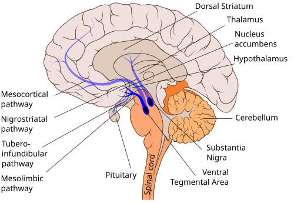
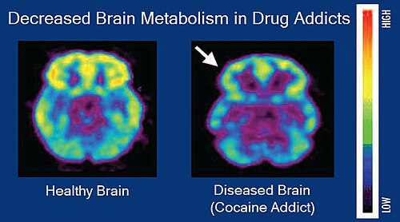

# DEPENDÊNCIA QUÍMICA

Para entender dependência química em nível de prova de residência, você precisa abandonar a ideia de que o dependente é apenas alguém "sem força de vontade". Como médico, você deve enxergar a dependência como uma doença crônica e recorrente, fundamentada em alterações neurobiológicas estruturais.

O ponto central que as bancas exploram é o **sistema de recompensa mesolímbico**. Quase todas as substâncias de abuso convergem para um caminho comum: o aumento da liberação de dopamina no **núcleo accumbens**. Com o uso crônico, o cérebro sofre uma neuroadaptação. Ele "aprende" que aquela substância é vital para a sobrevivência, tanto quanto comer ou beber água. É por isso que o paciente apresenta o *craving* (fissura) e a negligência de outras atividades.

*Figura 1 - A via mesolímbica dopaminérgica no cérebro, conectando a Área Tegmental Ventral (VTA) ao Núcleo Accumbens, o sistema central de recompensa envolvido na dependência. Fonte: Slashme, CC BY-SA 4.0 | Wikimedia Commons*

## Critérios Diagnósticos: O DSM-5 e a Unificação

Antigamente, separávamos "abuso" de "dependência". Esqueça isso. O DSM-5 unificou os conceitos no **Transtorno por Uso de Substância (TUS)**. Agora, avaliamos um espectro de gravidade baseado em 11 critérios que podem ser agrupados em quatro grandes domínios:

- **Perda de controle:** Uso em quantidades maiores que o pretendido, desejo persistente de reduzir sem sucesso, muito tempo gasto para conseguir a substância e a presença de *craving*.

- **Prejuízo social:** Descumprimento de obrigações (trabalho/escola), problemas interpessoais e abandono de atividades sociais ou recreativas.

- **Uso de risco:** Uso em situações fisicamente perigosas (ex: dirigir embriagado) e continuidade do uso mesmo sabendo que ele causa problemas físicos ou psicológicos.

- **Indicadores farmacológicos:** Tolerância (precisar de mais para o mesmo efeito) e Abstinência.

**Dica de Prova:** A presença de apenas **2 critérios** nos últimos 12 meses já fecha o diagnóstico de Transtorno por Uso de Substância.

| Gravidade | Número de Critérios |
| --- | --- |
| Leve | 2 a 3 critérios |
| Moderado | 4 a 5 critérios |
| Grave | 6 ou mais critérios |

*Figura 2 - PET scan comparando metabolismo cerebral entre cérebro normal e de dependente químico, mostrando a disrupção do funcionamento saudável causada pelo uso de substâncias. Fonte: NIH/NIDA, Domínio Público | Wikimedia Commons*

Cuidado com a pegadinha: a tolerância e a abstinência, isoladamente, não definem dependência se o paciente estiver usando a medicação sob supervisão médica adequada (como um paciente oncológico usando opioides). O que define a doença é o comportamento compulsivo e o prejuízo funcional.

## Transtorno por Uso de Álcool (TUA)

O álcool é o tema campeão de questões. Você precisa dominar desde o rastreamento na Atenção Primária até o manejo do *Delirium Tremens* na UTI.

### Rastreamento e Diagnóstico

Na prática e na prova, muitas vezes o paciente não admite o consumo. Aqui entra a importância da relação médico-paciente. Como ensinamos no MedEvo, perguntas sobre o desejo de mudança (ex: "Você já pensou em deixar de beber?") costumam ser mais eficazes do que perguntar "Quanto você bebe?".

O questionário **CAGE** é o clássico das bancas (4 perguntas):

- **C** (Cut down): Já sentiu que deveria diminuir a bebida?

- **A** (Annoyed): As pessoas te irritam criticando seu modo de beber?

- **G** (Guilty): Já se sentiu culpado por beber?

- **E** (Eye-opener): Já bebeu logo cedo para reduzir o nervosismo ou a ressaca?

**Pérola Clínica:** 2 ou mais respostas positivas no CAGE indicam alta probabilidade de dependência.

### Síndrome de Abstinência Alcoólica (SAA)

Por que o paciente entra em abstinência? O álcool é um depressor do SNC que potencializa o GABA (inibitório) e antagoniza o NMDA/Glutamato (excitatório). Quando você retira o álcool abruptamente, o cérebro fica em um estado de **hiperexcitabilidade**.

A SAA começa de 6 a 12 horas após o último gole. O quadro clássico inclui tremores de extremidades, ansiedade, irritabilidade, náuseas e taquicardia.

**O temido Delirium Tremens (DT):**
O DT é a forma mais grave, ocorrendo geralmente após 48-72 horas de abstinência. Caracteriza-se por:

- Rebaixamento do nível de consciência e desorientação.

- Alucinações (frequentemente visuais ou táteis - zoopsias).

- Instabilidade autonômica grave (hipertensão, taquicardia, febre, sudorese profusa).

**Tratamento da Abstinência:**
O padrão-ouro são os **Benzodiazepínicos (BDZ)**. Eles fazem uma "tolerância cruzada" com o álcool, ocupando os receptores GABA e acalmando o cérebro.

- **Diazepam (10-20mg)** ou **Clordiazepóxido** são preferidos pela meia-vida longa (autodesmame).

- **Exceção de Prova:** Se o paciente tiver **hepatopatia grave** ou for idoso, use o "LOT" (Lorazepam, Oxazepam, Temazepam), pois eles não têm metabólitos ativos e o metabolismo hepático é mais simples (glicuronidação). O Lorazepam IV é a escolha no DT com agitação.

**Atenção:** Nunca use antipsicóticos (como Haloperidol) isoladamente na abstinência. Eles reduzem o limiar convulsivo. Se houver agitação psicomotora grave que não cede ao BDZ, você pode associar o antipsicótico, mas o BDZ é a base.

### Encefalopatia de Wernicke

É uma emergência neurológica por deficiência de **Tiamina (Vitamina B1)**. A tríade clássica é: **Ataxia + Confusão Mental + Alterações Oculomotoras (oftalmoplegia/nistagmo)**.

**Regra de Ouro:** Em qualquer paciente etilista ou desnutrido no pronto-socorro, administre Tiamina (500mg IV/IM) **ANTES** de qualquer infusão de glicose. A glicose consome as reservas escassas de tiamina como cofator metabólico, podendo precipitar ou piorar a encefalopatia.

### Tratamento Farmacológico Crônico do Alcoolismo

Muitos alunos acham que só existe o Dissulfiram. Errado.

- **Naltrexona (1ª linha):** Antagonista opioide. Reduz o *craving* e o prazer associado ao álcool. É excelente porque não exige abstinência total para começar; ela ajuda o paciente a beber menos (reduz o consumo pesado).

- **Acamprosato (1ª linha):** Modula a transmissão glutamatérgica. É melhor para manter a abstinência em quem já parou de beber. Contraindicado se Insuficiência Renal grave.

- **Dissulfiram (2ª linha):** Inibe a aldeído desidrogenase. Se o paciente beber, acumula acetaldeído e ele passa muito mal (efeito antabuse). Exige alta motivação e supervisão, pois o risco de morte por arritmia existe se ele beber muito sobre o efeito do remédio.

## Tabagismo: A Doença Pediátrica

Dizemos que o tabagismo é uma doença pediátrica porque a imensa maioria começa antes dos 19 anos. Como o Dr. Will costuma enfatizar, o cérebro adolescente possui maior plasticidade e um córtex pré-frontal incompleto, tornando-o extremamente vulnerável à dependência de nicotina.

### Avaliação do Tabagista

O primeiro passo é avaliar o grau de dependência pela **Escala de Fagerström**. Duas perguntas são fundamentais:

- Quanto tempo após acordar você fuma o primeiro cigarro? (Se < 5 min, a dependência é altíssima).

- Quantos cigarros fuma por dia? (Se > 20, dependência alta).

Um escore de Fagerström **≥ 5** indica que o paciente provavelmente precisará de suporte farmacológico.

### Estágios de Mudança (Prochaska e DiClemente)

Isso cai em toda prova de Medicina de Família e Psiquiatria:

- **Pré-contemplação:** Não vê o fumo como problema. Não quer parar.

- **Contemplação:** Sabe que é problema, mas está ambivalente ("Eu quero, mas não agora").

- **Preparação:** Decidiu parar nos próximos 30 dias. Já tentou reduzir.

- **Ação:** Parou de fumar (até 6 meses).

- **Manutenção:** Parou há mais de 6 meses.

### Tratamento do Tabagismo

O tratamento combina **Abordagem Cognitivo-Comportamental (TCC)** e Farmacoterapia. No SUS, a TCC em grupo é frequentemente pré-requisito para a medicação.

**1. Terapia de Reposição de Nicotina (TRN):**
Disponível em adesivos (liberação lenta) e gomas/pastilhas (liberação rápida para fissura).

- **Dica de Ouro:** O adesivo deve ser iniciado na **DATA DO PARAR (Dia D)**. Nunca oriente o paciente a usar o adesivo e continuar fumando, pois há risco de toxicidade aguda por nicotina.

- O desmame do adesivo geralmente é feito reduzindo a dose (ex: 21mg -> 14mg -> 7mg) a cada poucas semanas.

**2. Bupropiona:**
Antidepressivo que inibe a recaptação de dopamina e noradrenalina, reduzindo os sintomas de abstinência.

- **Contraindicações Absolutas:** Histórico de convulsões, epilepsia, traumatismo cranioencefálico grave, e transtornos alimentares (bulimia/anorexia), pois reduz o limiar convulsivo.

- Inicia-se 7 dias antes do "Dia D".

**3. Vareniclina:**
Agonista parcial do receptor nicotínico. É o medicamento isolado mais eficaz. Ele ocupa o receptor (reduz a fissura) e, se o paciente fumar, ele não sente prazer (bloqueia o efeito da nicotina externa).

| Medicamento | Dose Típica | Principal Contraindicação/Cuidado |
| --- | --- | --- |
| Adesivo Nicotina | 21mg, 14mg, 7mg | Doença cardiovascular instável (IAM recente) |
| Bupropiona | 150mg a 300mg/dia | **Convulsão**, Bulimia, Anorexia |
| Vareniclina | 0,5mg a 1mg 2x/dia | Insuficiência renal (ajustar dose) |

**Falha Terapêutica:** Define-se como a não interrupção total do uso de nicotina ao final do tratamento proposto. Lembre-se: o desejo do paciente é o fator preditor mais importante para o sucesso.

## Cocaína e Estimulantes

Diferente do álcool, a abstinência de cocaína não costuma ser uma emergência médica fatal (não causa convulsões ou delirium), mas gera um sofrimento psíquico intenso.

### Intoxicação Aguda

O paciente chega com midríase, taquicardia, hipertensão, agitação e, às vezes, dor torácica (vasoespasmo coronariano).

- **Tratamento:** Benzodiazepínicos são a primeira linha para acalmar o paciente e reduzir a pressão/frequência.

- **Cuidado:** Evite Beta-bloqueadores isolados (como Propranolol) pelo risco de estimulação alfa-adrenérgica sem oposição, o que pode piorar drasticamente a hipertensão e o vasoespasmo.

### Abstinência de Cocaína

Ocorre em "ondas". Após o uso pesado (binge), o paciente entra no *crash*: depressão profunda, hipersonia, hiperfagia e anedonia. Não há tratamento farmacológico específico aprovado com a mesma força que para o álcool/tabaco. O manejo é suporte e TCC. Se houver psicose induzida, usamos antipsicóticos de curto prazo.

## Benzodiazepínicos: A Dependência Iatrogênica

Muito comum em idosos com insônia crônica. O uso por mais de 4 semanas gera tolerância e dependência física.

- **Manejo:** Nunca interrompa abruptamente (risco de convulsões e insônia rebote). A conduta é o **desmame gradual** (redução de 10-25% da dose a cada 1-2 semanas) e higiene do sono. Se o paciente usa um BDZ de meia-vida curta (Alprazolam), pode-se trocar por um de meia-vida longa (Diazepam) para facilitar o desmame.

## Redução de Danos

Este conceito aparece muito em provas de Saúde Coletiva. Redução de danos não exige a abstinência imediata. O foco é diminuir as consequências negativas do uso (ex: troca de seringas para evitar HIV/Hepatite, oferta de abrigo, uso de substâncias menos lesivas). É uma estratégia ética que respeita a autonomia do paciente que não consegue ou não quer parar o uso no momento.

## Diagnóstico Diferencial e Comorbidades

É a regra, não a exceção. Pacientes com dependência química frequentemente têm "Diagnóstico Dual" (ex: Depressão + Alcoolismo, Esquizofrenia + Tabagismo).

- Se o paciente tem uma psicose apenas durante o uso ou abstinência de cocaína, o diagnóstico é **Psicose Induzida por Substância**.

- Se os sintomas psicóticos persistem por muito tempo após a desintoxicação, investigamos um transtorno psicótico primário.

## Pontos-Chave para Prova 🧠

- **Critérios DSM-5:** 2 critérios em 12 meses fecham diagnóstico de Transtorno por Uso de Substância.

- **Wernicke:** Tiamina ANTES da Glicose. Sempre.

- **Delirium Tremens:** Diazepam ou Lorazepam (se hepatopata) são a 1ª linha. Evite antipsicóticos isolados.

- **CAGE:** ≥ 2 respostas positivas indicam problema com álcool.

- **Fagerström:** ≥ 5-6 pontos indica alta dependência de nicotina e necessidade de medicação.

- **Bupropiona Contraindicação:** NUNCA prescrever para quem tem histórico de convulsão ou transtorno alimentar.

- **TRN (Adesivo):** Iniciar apenas no dia em que parar de fumar totalmente.

- **Naltrexona:** Excelente para reduzir o "prazer" do álcool e o consumo pesado; não exige abstinência prévia.

- **Vulnerabilidade Jovem:** Adolescentes viciam mais rápido em nicotina devido à plasticidade cerebral.

- **Abstinência de Cocaína:** É predominantemente psíquica (depressão, fissura, fadiga), sem risco de morte por convulsão como no álcool.

- **Intoxicação por Cocaína:** Evite Beta-bloqueadores puros; use Benzodiazepínicos.

- **Estágio de Preparação:** Paciente que quer parar nos próximos 30 dias.

- **Hepatopata em Abstinência:** Use Lorazepam ou Oxazepam (metabolismo mais seguro).

- **Tolerância:** Necessidade de doses maiores para o mesmo efeito.

- **Abstinência Alcoólica Grave:** CIWA-Ar > 10 ou sintomas de disautonomia exigem tratamento agressivo com BDZ.

- **Frotteurismo:** Prazer sexual por atrito genital em pessoas não-consensuais (cai como diagnóstico diferencial de parafilias).

- **Uso Nocivo:** Padrão de consumo com consequências negativas, mas sem preencher critérios de dependência física/compulsão.

 Cópia offline para consulta pessoal.
 Fonte original:
 [https://www.medevo.com.br/material-apoio/ler/a8cf7f8c-7880-4665-a157-eff6b45d000a](https://www.medevo.com.br/material-apoio/ler/a8cf7f8c-7880-4665-a157-eff6b45d000a)
