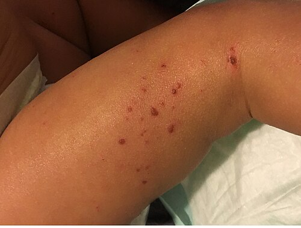
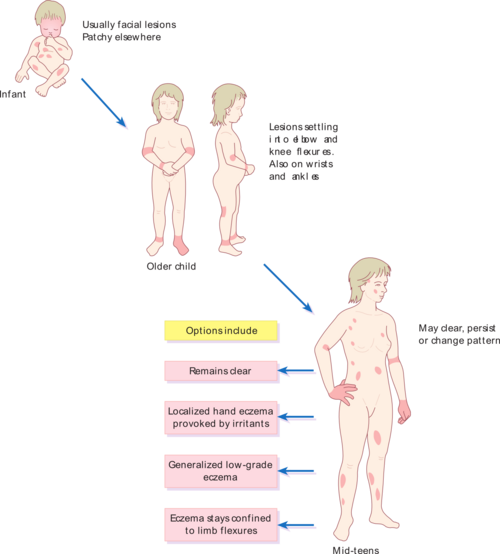

# DERMATITE ATÓPICA

A Dermatite Atópica (DA) não é apenas uma "alergia na pele". Se você entender que ela é uma doença de barreira, você acerta 80% das questões. O que as bancas de residência querem saber é se você consegue diferenciar o lactente com DA do lactente com dermatite seborreica, se você sabe prescrever o corticoide certo para o local certo e se você entende a "Marcha Atópica".

Aqui no MedEvo, sempre reforçamos: a DA é uma doença inflamatória crônica, recidivante, que cursa com um prurido que não é apenas um sintoma, é o cerne da patologia. Como dizemos na prática clínica, "a dermatite é o prurido que erupciona, não a erupção que coça".

*Figura 1 - Criança apresentando a pele seca e irritada característica da dermatite atópica, condição que afeta cerca de 30% das crianças. Fonte: NIAID, CC BY 2.0 | Wikimedia Commons*

## Fisiopatologia: O Porquê da Pele Seca

Para entender a DA, imagine a pele como um muro de tijolos. Os tijolos são os corneócitos e o cimento é composto por lipídios (cerâmicas, colesterol e ácidos graxos). Na DA, temos dois problemas principais:

- **Defeito Estrutural (O Cimento Rachado):** Existe uma mutação no gene da **filagrina**. A filagrina é uma proteína fundamental para a agregação dos filamentos de queratina e para a formação do fator de hidratação natural. Sem filagrina, a pele perde água (aumento da perda transepidérmica de água - TEWL) e permite a entrada de alérgenos e irritantes.

- **Desregulação Imunológica (O Alarme Falso):** O sistema imune do atópico é "desviado" para uma resposta **Th2**. Isso significa excesso de interleucinas IL-4, IL-5 e IL-13, que estimulam a produção de IgE e inibem ainda mais a produção de proteínas da barreira cutânea.

**Dica de Prova:** As bancas adoram relacionar a deficiência de filagrina com a gravidade da doença e o início precoce. Se a questão mencionar "defeito na barreira cutânea", marque Dermatite Atópica sem medo.

## Epidemiologia e a Marcha Atópica

*Figura 2 - Distribuição típica das lesões da dermatite atópica conforme a faixa etária: face e extensoras no lactente, flexuras em crianças maiores. Fonte: Madhero88, CC BY-SA 3.0 | Wikimedia Commons*

A DA atinge até 20% das crianças em áreas urbanas. É a primeira manifestação da **Marcha Atópica**. Guarde esta sequência, pois ela cai muito em provas de Pediatria:

- Dermatite Atópica (geralmente nos primeiros meses de vida).

- Alergia Alimentar.

- Asma Brônquica.

- Rinite Alérgica.

Muitas questões apresentam um lactente com eczema e perguntam qual o risco futuro dele. A resposta quase sempre envolve o desenvolvimento de asma ou rinite.

## Quadro Clínico: A Localização é a Chave

O diagnóstico da DA é essencialmente **clínico**. Não existe exame de sangue que confirme DA (o aumento de IgE ajuda, mas não é patognomônico). O que define a fase da doença na prova é a localização das lesões.

### Fase Lactente (até 2 anos)

As lesões são agudas: eritematosas, papulovesiculares, exsudativas ("com mel") e crostosas.

- **Localização clássica:** Face (principalmente bochechas, poupando o sulco nasolabial), couro cabeludo e superfícies extensoras dos membros.

- **O Pulo do Gato:** A área das fraldas geralmente é **poupada**. Por que? Porque a umidade da fralda mantém a hidratação local, protegendo a barreira. Se a questão mostrar lesão na área da fralda, pense em Dermatite de Fraldas ou Candidíase, não em DA.

### Fase Infantil (2 a 12 anos)

As lesões tornam-se menos exsudativas e mais secas.

- **Localização clássica:** Dobras (flexuras) antecubitais e poplíteas, pescoço, punhos e tornozelos.

- **Liquenificação:** Aqui começa a aparecer o espessamento da pele devido ao ato crônico de coçar.

### Fase Adolescente e Adulto (> 12 anos)

Predomina a xerose (pele seca) generalizada e a liquenificação.

- **Localização:** Áreas flexurais, mãos, pálpebras e região perioral.

### Estigmas Atópicos (As "Pérolas" do Exame Físico)

Existem sinais que, embora não sejam exclusivos, gritam "Atopia" na sua cara:

- **Sinal de Dennie-Morgan:** Uma prega extra de pele abaixo da pálpebra inferior.

- **Sinal de Hertoghe:** Rarefação do terço distal das sobrancelhas (pelo ato de coçar).

- **Pitiríase Alba:** Manchas hipocrômicas com descamação fina, geralmente na face e braços. Erro comum: achar que é "verme" ou micose. É apenas uma manifestação de pele seca.

- **Dermatose Plantar Juvenil:** Eritema e descamação das polpas digitais e plantas dos pés (aspecto de "pé brilhante").

## Critérios Diagnósticos

Embora existam os critérios de Hanifin e Rajka (clássicos, mas longos), para a prova você deve focar nos critérios do **UK Working Party**, que são mais práticos.

Para o diagnóstico, o paciente **DEVE** ter:

- **Prurido** (obrigatório).

E mais **3 ou mais** dos seguintes:

- História de envolvimento de dobras (ou bochechas em < 10 anos).

- História pessoal de asma ou rinite (ou familiar de 1º grau em < 4 anos).

- História de pele seca generalizada no último ano.

- Eczema flexural visível.

- Início antes dos 2 anos de idade.

## Diagnóstico Diferencial: Onde o Aluno Erra

Esta é a parte favorita dos examinadores. Eles vão colocar uma foto ou descrição e você terá que excluir a DA.

| Patologia | Diferencial Chave para a Prova |
| --- | --- |
| **Dermatite Seborreica** | Início mais precoce (primeiras semanas), crostas lácteas (gordurosas), **atinge área das fraldas** e axilas. Geralmente NÃO coça tanto. |
| **Escabiose** | Prurido noturno intenso, história familiar de coceira, lesões em espaços interdigitais, genitália e palmo-plantar (em lactentes). |
| **Dermatite de Fraldas** | Localizada na área de contato com a fralda. Se poupar as pregas, é irritativa. Se atingir as pregas com lesões satélites, é Candidíase. |
| **Psoríase** | Placas eritematosas bem delimitadas com descamação prateada, predileção por superfícies extensoras (cotovelos e joelhos) e couro cabeludo. |
| **Acrodermatite Enteropática** | Deficiência de Zinco. Lesões vesicobolhosas e psoriasiformes simétricas periorificiais (boca, ânus) e acrais. |

**Exemplo Clínico:** Lactente de 3 meses com crostas amareladas e gordurosas no couro cabeludo e vermelhidão nas dobras das coxas, sem prurido importante. Diagnóstico? Dermatite Seborreica. Se tivesse prurido intenso e poupasse as fraldas, seria DA.

## Tratamento: O Passo a Passo

O tratamento da DA é baseado em quatro pilares. Como o Dr. Will costuma dizer, não adianta dar o melhor corticoide se a mãe dá banho quente de 20 minutos no bebê.

### 1. Cuidados com a Pele e Controle Ambiental (Não-farmacológico)

- **Banho:** Curto (5 a 10 minutos), morno (quase frio), uma vez ao dia.

- **Sabonete:** Apenas do tipo **Syndet** (sem detergente) ou com pH levemente ácido. Evitar sabonetes em barra comuns e perfumados.

- **Hidratação (O mais importante):** Aplicar hidratantes sem fragrância imediatamente após o banho (em até 3 minutos) com a pele ainda úmida. Isso "sela" a umidade. Quantidade: em adultos, cerca de 250g por semana.

- **Roupas:** Algodão. Evitar lã e tecidos sintéticos.

- **Ambiente:** Evitar poeira, tapetes e cortinas. Lavar roupas de cama semanalmente a > 60°C para matar ácaros.

### 2. Tratamento Tópico (Para as Crises)

- **Corticosteroides Tópicos:** São a primeira linha para as exacerbações.

- **Baixa potência (ex: Hidrocortisona 1%):** Usar na face, dobras e área de fraldas (áreas de pele fina).

- **Média/Alta potência (ex: Mometasona, Betametasona):** Usar no tronco e membros.

- **Regra de Ouro:** Usar por curto período (7 a 14 dias) e desmamar. O uso prolongado causa atrofia cutânea e estrias.

- **Inibidores da Calcineurina (Tacrolimo e Pimecrolimo):**

- São excelentes porque não causam atrofia cutânea.

- Indicados para áreas sensíveis (face, pálpebras) e para manutenção (terapia proativa).

- **Cuidado:** Não usar em crianças < 2 anos (segundo bula, embora na prática use-se off-label).

### 3. Controle do Prurido

- **Anti-histamínicos:** Aqui está uma pegadinha de prova. Os anti-histamínicos de 2ª geração (Loratadina, Cetirizina) **NÃO** funcionam bem para o prurido da DA, pois este não é mediado puramente por histamina.

- Usamos os de 1ª geração (Hidroxizina, Dexclorfeniramina) pelo seu **efeito sedativo**, ajudando a criança a dormir e parar de coçar à noite.

### 4. Tratamento Sistêmico (Casos Graves)

Reservado para casos refratários ao tratamento tópico bem feito.

- **Fototerapia (UVB de banda estreita):** Ótima opção antes de ir para drogas sistêmicas.

- **Imunossupressores:** Ciclosporina (mais usada para resgate rápido), Metotrexato, Azatioprina.

- **Biológicos:** **Dupilumabe** (anti-IL-4 e anti-IL-13). É o novo padrão-ouro para DA moderada a grave em crianças acima de 6 meses.

- **Inibidores da JAK (Upadacitinibe, Abrocitinibe):** Opções orais recentes para casos graves.

**Atenção:** Corticoide sistêmico (Prednisona) deve ser evitado ao máximo na DA. Ele causa uma melhora espetacular, mas o "rebote" ao suspender é terrível, podendo levar à eritrodermia.

## Complicações: Quando a Coisa Piora

A pele do atópico é colonizada por **Staphylococcus aureus** em mais de 90% dos casos (na pele normal é < 5%).

- **Infecção Bacteriana Secundária (Impetiginização):** Presença de pústulas, melicericose (crostas cor de mel) e piora súbita do eczema. Tratamento: Cefalexina oral ou Mupirocina tópica (se lesão localizada).

- **Eczema Herpético (Erupção Varicelliforme de Kaposi):** É uma emergência dermatológica. O vírus Herpes Simples se dissemina na pele com DA.

- **Quadro:** Vesículas umbilicadas disseminadas, febre e dor.

- **Tratamento:** Aciclovir sistêmico IMEDIATO.

- **Molusco Contagioso e Verrugas:** Mais comuns e disseminados em atópicos devido à falha na barreira e na imunidade local.

## Tabelas Comparativas para Revisão Rápida

### Tabela 1: Potência dos Corticoides Tópicos

| Potência | Exemplo Comum | Indicação Principal |
| --- | --- | --- |
| **Baixa** | Hidrocortisona 1%, Desonida | Face, dobras, lactentes pequenos |
| **Média** | Mometasona, Valerato de Betametasona | Tronco e membros em crianças |
| **Alta** | Dipropionato de Betametasona | Áreas liquenificadas, palmas e plantas |
| **Muito Alta** | Clobetasol 0,05% | Uso muito restrito, placas muito grossas |

### Tabela 2: DA vs. Dermatite Seborreica no Lactente

| Característica | Dermatite Atópica | Dermatite Seborreica |
| --- | --- | --- |
| **Idade de início** | Geralmente > 3 meses | Primeiras semanas de vida |
| **Prurido** | Intenso, irritabilidade | Ausente ou leve |
| **Localização** | Face (poupa sulco), extensores | Couro cabeludo, dobras, área da fralda |
| **Aspecto** | Eczema seco ou exsudativo | Crostas gordurosas, amareladas |
| **História Familiar** | Comum para atopia | Irrelevante |

## Pontos-Chave para Prova

- **Diagnóstico é CLÍNICO.** Não perca tempo pedindo biópsia ou testes alérgicos para fechar diagnóstico de DA.

- **Prurido é o sintoma cardinal.** Se não coça, dificilmente é Dermatite Atópica.

- **Localização no Lactente:** Bochechas e superfícies extensoras. **POUPA** a área das fraldas.

- **Localização no Escolar:** Dobras (flexuras) antecubital e poplítea.

- **Tratamento de base:** Hidratação constante, banhos mornos e curtos. Hidratar com a pele ainda úmida.

- **Crises:** Corticoide tópico. Baixa potência na face e dobras; média/alta no corpo.

- **Marcha Atópica:** DA -> Alergia Alimentar -> Asma -> Rinite.

- **Complicação Bacteriana:** S. aureus é o principal agente. Pensar em impetiginização se houver crostas melicéricas.

- **Eczema Herpético:** Vesículas umbilicadas + DA = Aciclovir urgente.

- **Pitiríase Alba:** Não é verme! É sinal de pele seca/atopia. Tratamento é hidratar e fotoproteção.

- **Língua Geográfica:** Condição benigna associada à atopia. Não precisa de tratamento, apenas tranquilizar a família.

- **Ureia:** Cuidado! Hidratantes com ureia > 10% podem causar ardência e são contraindicados em crianças pequenas (especialmente < 2 anos) com pele inflamada.

- **Anti-histamínicos:** Os de 1ª geração (sedativos) são usados para o sono, não para bloquear a fisiopatologia da coceira.

- **Dupilumabe:** Primeira escolha de biológico para casos moderados a graves refratários.

- **O que NÃO fazer:** Não usar corticoide sistêmico de rotina. Não orientar dietas restritivas sem comprovação de alergia alimentar (isso piora a nutrição e não cura a pele).

 Cópia offline para consulta pessoal.
 Fonte original:
 [https://www.medevo.com.br/material-apoio/ler/f71788a3-86b4-472b-9d00-5169518d1643](https://www.medevo.com.br/material-apoio/ler/f71788a3-86b4-472b-9d00-5169518d1643)
