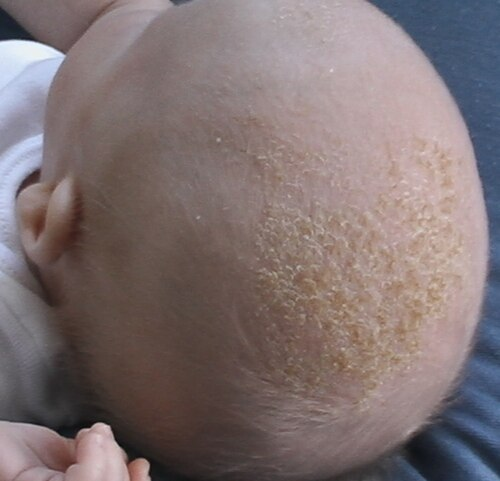
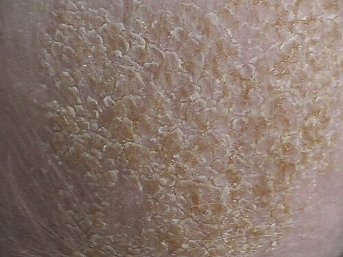

# DERMATITE SEBORREICA

A dermatite seborreica é uma das condições mais frequentes na prática do pediatra e do dermatologista, sendo um tema onipresente em provas de residência médica. Como professor, vejo muitos alunos perderem questões por não saberem diferenciar o "paciente de livro" do "paciente de prova". Nas próximas linhas, vamos dissecar essa patologia para que você entenda a lógica por trás de cada sinal clínico e de cada conduta.

A dermatite seborreica (DS) é uma dermatose inflamatória crônica, recorrente e geralmente benigna. Ela se manifesta em áreas com grande densidade de glândulas sebáceas. No lactente, o quadro é classicamente conhecido como crosta láctea, enquanto no adolescente e no adulto, manifesta-se como a popular caspa ou placas eritemato-escamosas na face e tronco.

*Figura 1 - Lactente apresentando crosta láctea (dermatite seborreica infantil), com escamas aderentes ao couro cabeludo, manifestação típica nos primeiros meses de vida. Fonte: CC BY-SA 3.0 | Wikimedia Commons*

## Epidemiologia e Fatores de Risco

A DS apresenta uma distribuição bimodal muito característica, o que facilita o diagnóstico apenas pela idade do paciente. O primeiro pico ocorre nos primeiros meses de vida, geralmente surgindo na 2ª ou 3ª semana e resolvendo-se espontaneamente até os 6 a 12 meses. O segundo pico surge na puberdade e se estende pela vida adulta, atingindo o ápice entre os 30 e 50 anos.

Por que essa distribuição? A resposta está nos hormônios. No recém-nascido (RN), há uma influência direta dos hormônios maternos que atravessaram a placenta, estimulando as glândulas sebáceas do bebê. Na puberdade, é o próprio corpo do adolescente que começa a produzir andrógenos, reativando essas glândulas.

Em termos de prevalência, estima-se que até 10% dos lactentes apresentem alguma forma de DS. Não há predileção por raça, mas nos adultos, observa-se uma leve predominância no sexo masculino. Um ponto fundamental para provas: se você encontrar um quadro de dermatite seborreica muito extenso, grave e refratário ao tratamento, deve sempre suspeitar de imunodeficiências, especialmente a infecção pelo HIV ou a síndrome de Leiner (uma deficiência do componente C5 do complemento).

## Fisiopatologia: O Papel da Malassezia

*Figura 2 - Detalhe das escamas gordurosas e amareladas aderentes ao couro cabeludo, características da dermatite seborreica infantil. Fonte: CC BY-SA 3.0 | Wikimedia Commons*

Muitos alunos confundem a DS com uma infecção fúngica. Cuidado: a DS não é uma micose no sentido estrito da palavra. Ela é uma resposta inflamatória à presença de leveduras do gênero Malassezia (antigamente chamadas de Pityrosporum ovale).

A Malassezia é um fungo lipofílico que faz parte da microbiota normal da pele humana. Ela se alimenta dos triglicerídeos presentes no sebo. Ao degradar esses lipídios, a levedura libera ácidos graxos insaturados (como o ácido oleico) que são irritantes para a barreira cutânea de indivíduos suscetíveis.

Essa irritação desencadeia uma cascata inflamatória que resulta em:

- Hiperproliferação de queratinócitos (gerando a descamação).

- Vasodilatação local (gerando o eritema).

- Alteração na composição do sebo.

Portanto, o tratamento foca em dois pilares: reduzir a população do fungo e controlar a inflamação. É por isso que usamos antifúngicos e corticoides, e não apenas um deles.

## Quadro Clínico no Lactente (Crosta Láctea)

O cenário clássico de prova é um lactente de 1 a 3 meses, saudável, cujos pais estão desesperados com "cascas" na cabeça do bebê.

### Couro Cabeludo

A manifestação mais comum é a crosta láctea. São escamas amareladas, gordurosas (oleosas), aderentes e espessas, localizadas principalmente no vértice e na fronte. Diferente da tinea capitis, na DS não há perda de cabelo (alopecia) e os fios atravessam as crostas normalmente.

### Face e Tronco

As lesões podem se estender para as sobrancelhas, sulcos nasolabiais, pálpebras (blefarite seborreica) e região retroauricular. No tronco, as lesões costumam ser placas eritematosas com descamação fina em áreas intertriginosas (dobras).

### Área das Fraldas

Aqui mora uma pegadinha frequente. A DS na área das fraldas atinge preferencialmente as pregas inguinais. Ela se apresenta como um eritema brilhante, bem delimitado, com pouca descamação devido à umidade do local. Diferente da dermatite de fraldas irritativa, que poupa as pregas, a DS as "adora".

Um detalhe clínico vital: a dermatite seborreica infantil geralmente NÃO coça. Se o bebê estiver extremamente irritado, com prurido intenso e dificuldade para dormir, mude sua suspeita diagnóstica para dermatite atópica. Como costumo dizer nas aulas do MedEvo, o prurido é o divisor de águas entre essas duas condições.

## Quadro Clínico no Adolescente

Na puberdade, o quadro se assemelha ao do adulto. A descamação fina do couro cabeludo (caspa ou pitiríase capitis) é a forma mais leve. Casos mais acentuados apresentam placas eritematosas com escamas amareladas na glabela, sulcos nasolabiais, conduto auditivo externo e região pré-esternal.

Dica de prova: a blefarite seborreica manifesta-se como um eritema na borda palpebral com pequenas crostas amareladas entre os cílios. Muitas vezes é confundida com conjuntivite bacteriana, mas a ausência de secreção purulenta e a presença de lesões em outras áreas seborreicas fecham o diagnóstico.

## Diagnóstico Diferencial: Onde os Alunos Erram

Esta é a parte mais importante para quem quer passar na residência. As bancas amam colocar fotos de bebês com "rash" e pedir para você diferenciar.

### Dermatite Atópica (DA)

A DA costuma surgir um pouco mais tarde (após os 3 meses). A característica principal é o prurido intenso. As lesões na DA são mais secas (xerose) e localizam-se preferencialmente nas superfícies extensoras (em lactentes) e nas faces. A DS é gordurosa e prefere as dobras e o couro cabeludo.

### Psoríase

A psoríase infantil pode ser muito parecida com a DS (chamamos de sebopsoríase quando os quadros se sobrepõem). No entanto, as placas de psoríase são mais bem delimitadas, as escamas são branco-prateadas e mais secas. Se você remover a escama e houver sangramento puntiforme (sinal de Auspitz), o diagnóstico é psoríase.

### Candidíase de Fraldas

A candidíase (monilíase) também afeta as dobras, mas apresenta lesões satélites (pequenas pápulas ou pústulas eritematosas além da borda da placa principal). Além disso, é comum encontrar monilíase oral associada (sapinho).

### Histiocitose de Células de Langerhans

Esta é a "zebra" que você não pode deixar passar. Suspeite se o quadro de "dermatite seborreica" for purpúrico (com petéquias), houver erosões, linfadenopatia, hepatoesplenomegalia ou se o bebê não estiver ganhando peso. É uma condição neoplásica grave.

### Tabela Comparativa de Diagnósticos Diferenciais

| Condição | Localização Preferencial | Características das Lesões | Prurido |
| --- | --- | --- | --- |
| **Dermatite Seborreica** | Couro cabeludo, dobras, face | Escamas amareladas, gordurosas | Ausente ou leve |
| **Dermatite Atópica** | Face, superfícies extensoras | Eczema, xerose, crostas hemáticas | Intenso (obrigatório) |
| **Psoríase** | Couro cabeludo, cotovelos, joelhos | Placas bem definidas, escamas prateadas | Variável |
| **Candidíase** | Áreas de dobras (períneo) | Eritema vivo, lesões satélites | Presente (ardência) |
| **Dermatite Irritativa** | Áreas convexas (fralda) | Eritema brilhante, poupa pregas | Variável |

## Diagnóstico

O diagnóstico da dermatite seborreica é eminentemente clínico. Não há necessidade de exames laboratoriais na imensa maioria dos casos.

Em situações de dúvida diagnóstica ou refratariedade, o médico pode lançar mão de:

- **Micológico direto:** Para descartar tinea capitis (fungos dermatófitos) ou confirmar a presença de Malassezia (embora esta última faça parte da flora).

- **Biópsia cutânea:** Raramente indicada em pediatria, mas pode mostrar paraceratose focal, espongiose leve e infiltrado inflamatório perivascular.

- **Avaliação imunológica:** Se houver sinais de alarme (infecções de repetição, eritrodermia).

Lembre-se da pérola clínica: RN com pápulas brancas no palato são Pérolas de Ebstein; no nariz são Milium sebáceo. Ambos são benignos e não devem ser confundidos com infecções ou dermatites.

## Tratamento: Estratégias e Doses

O tratamento deve ser individualizado de acordo com a idade e a extensão das lesões. O objetivo não é a "cura" definitiva (já que é uma condição crônica), mas o controle dos sintomas e a melhora estética.

### Conduta no Lactente (Crosta Láctea)

A primeira linha é sempre o tratamento conservador e não farmacológico.

- **Remoção das crostas:** Aplicação de óleo mineral, óleo de amêndoas ou azeite de oliva morno no couro cabeludo 30 a 60 minutos antes do banho. Isso amolece as escamas.

- **Higiene suave:** Lavagem com xampu infantil suave e remoção delicada das escamas com uma escova de cerdas macias ou pente fino. Nunca force a remoção, pois pode causar sangramento e infecção secundária.

- **Corticoides de baixa potência:** Se houver muito eritema ou se as medidas acima falharem, pode-se usar Hidrocortisona a 1% (creme ou loção) uma vez ao dia por no máximo 5 a 7 dias.

- **Antifúngicos tópicos:** Cetoconazol 2% em creme pode ser usado em áreas de dobras se houver suspeita de colonização fúngica importante.

### Conduta no Adolescente e Adulto

Aqui o tratamento é mais vigoroso, pois a pele é menos sensível e a produção de sebo é maior.

- **Xampus terapêuticos:** Devem ser usados 2 a 3 vezes por semana, deixando agir por 5 a 10 minutos.

- Cetoconazol 2% (Primeira escolha).

- Piritionato de zinco.

- Sulfeto de selênio 2,5%.

- Ácido salicílico (ceratolítico para remover escamas espessas).

- **Inibidores da calcineurina:** Pimecrolimus ou Tacrolimus podem ser usados na face como alternativa aos corticoides para evitar efeitos colaterais como atrofia cutânea e telangiectasias. Dr. Will sempre lembra: esses medicamentos são excelentes para áreas de pele fina.

### Tabela de Opções Terapêuticas

| Classe | Medicamento | Indicação | Frequência |
| --- | --- | --- | --- |
| **Emoliente** | Óleo mineral / Amêndoas | Crosta láctea (RN) | Pré-banho |
| **Antifúngico Tópico** | Cetoconazol 2% (creme/xampu) | DS moderada a grave | 1-2x ao dia / 3x semana |
| **Corticoide Baixa Potência** | Hidrocortisona 1% | Inflamação aguda | 1x ao dia (curto prazo) |
| **Ceratolítico** | Ácido Salicílico 3% | Escamas muito espessas | Conforme tolerância |

## Situações Especiais e Complicações

### Doença de Leiner (Eritrodermia Seborreica)

É uma complicação rara e grave. O lactente apresenta uma dermatite seborreica generalizada (eritrodermia), diarreia intratável e infecções recorrentes (especialmente por Gram-negativos e Candida). Está associada a uma disfunção do sistema complemento (C5). O tratamento requer hospitalização e suporte intensivo.

### Infecção Secundária

O rompimento da barreira cutânea e o ato de "cutucar" as lesões podem levar à impetiginização (infecção por Staphylococcus aureus ou Streptococcus pyogenes). Se houver melicericose (crostas cor de mel), dor ou calor local, o uso de antibióticos tópicos (Mupirocina) ou sistêmicos (Cefalexina) pode ser necessário.

### Dermatite de Fraldas e pH Fecal

Lembre-se que a dermatite de fraldas pode ser exacerbada por diarreia aguda. A intolerância transitória à lactose, comum após quadros de gastroenterite, reduz o pH fecal, tornando as fezes mais ácidas e irritantes para a pele, o que pode mimetizar ou agravar uma dermatite seborreica na região.

## Prognóstico e Orientações aos Pais

É fundamental tranquilizar a família. A dermatite seborreica infantil tem um excelente prognóstico e, na maioria das vezes, desaparece sozinha conforme os níveis hormonais maternos caem no organismo do bebê.

Oriente a evitar banhos muito quentes, pois o calor estimula a produção sebácea e piora o eritema. O uso de roupas de algodão, que permitem a ventilação da pele, é preferível aos tecidos sintéticos.

## Pontos-Chave para Prova

- **Idade de Início:** A DS infantil surge geralmente entre a 2ª e 10ª semana de vida. Se surgir no primeiro dia, pense em outras condições.

- **Localização Patognomônica:** Couro cabeludo (crosta láctea) e pregas (axilas, pescoço, região inguinal).

- **Diferencial Crucial:** Dermatite atópica tem prurido intenso; Dermatite seborreica não tem ou é mínimo.

- **Área das Fraldas:** A DS acomete o fundo das pregas; a dermatite irritativa poupa as pregas (formato em W).

- **Etiologia:** Resposta inflamatória à Malassezia spp. (não é uma infecção contagiosa).

- **Tratamento Inicial (RN):** Óleo mineral para amolecer crostas e higiene suave.

- **Corticoides:** Usar apenas de baixa potência (Hidrocortisona 1%) e por curto período (evitar atrofia).

- **Sinal de Alarme:** Se houver petéquias ou púrpura associada, suspeite de Histiocitose de Células de Langerhans.

- **Pérola de Ebstein e Milium:** São cistos de inclusão benignos, comuns no RN, e não requerem tratamento.

- **Tinea Corporis:** Diferencia-se por ser uma lesão anular com borda elevada e centro claro (disseminação centrífuga).

- **HIV:** DS grave, extensa e súbita em adolescentes ou adultos é marcador de imunodeficiência.

- **O que NÃO fazer:** Não usar corticoides de alta potência (como Clobetasol) em face ou área de fraldas de bebês devido ao risco de absorção sistêmica e supressão do eixo adrenal.

- **Diagnóstico:** É clínico. Biópsia é exceção da exceção.

- **Prognóstico:** Autolimitado no lactente; crônico e recidivante no adolescente/adulto. 💡

 Cópia offline para consulta pessoal.
 Fonte original:
 [https://www.medevo.com.br/material-apoio/ler/545fef0b-f8e5-4a43-8ca4-8913c9bd4228](https://www.medevo.com.br/material-apoio/ler/545fef0b-f8e5-4a43-8ca4-8913c9bd4228)
