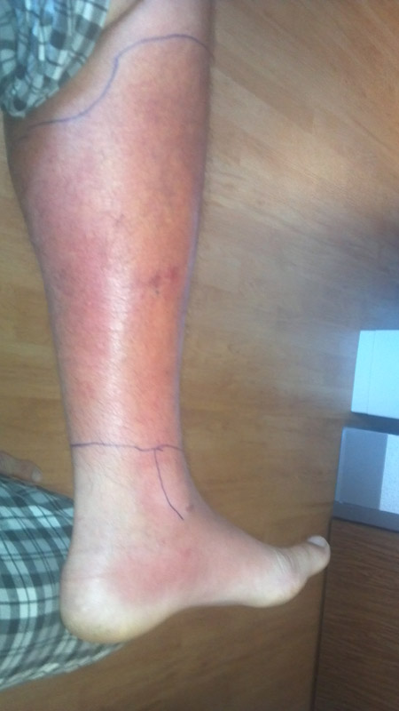

# DERMATOSES INFECCIOSAS

Para dominar as dermatoses infecciosas em provas de residência, você não precisa decorar uma lista telefônica de nomes. Você precisa entender a **camada da pele** atingida e o **perfil do hospedeiro**. As bancas adoram testar se você sabe diferenciar uma infecção superficial de uma profunda e se você reconhece os sinais de alerta que exigem tratamento sistêmico.

## Infecções Bacterianas (Piodermites)

As piodermites são causadas principalmente por *Staphylococcus aureus* e *Streptococcus pyogenes*. O segredo aqui é a profundidade.

### Impetigo

*Figura 1 - Caso de impetigo mostrando as lesões crostosas características (crostas melicéricas), infecção bacteriana superficial comum em crianças. Fonte: James Heilman, MD, CC BY-SA 3.0 | Wikimedia Commons*

É a infecção bacteriana mais superficial. Ocorre muito em crianças.

- **Impetigo Não Bolhoso:** Causado por ambos os agentes. Caracteriza-se pelas clássicas **crostas melicéricas** (cor de mel). Geralmente surge sobre uma pele previamente lesada (picada de inseto, arranhadura).

- **Impetigo Bolhoso:** Causado exclusivamente pelo *S. aureus*. O motivo? O estafilococo produz uma toxina esfoliativa que cliva a desmogleína 1 (a mesma do pênfigo foliáceo), gerando bolhas efêmeras que deixam uma base eritematosa.

**Tratamento:** Se poucas lesões, usamos antibiótico tópico (Mupirocina ou Ácido Fusídico). Se lesões disseminadas ou em surtos escolares, partimos para o sistêmico (Cefalexina).

### Erisipela vs. Celulite

*Figura 2 - Celulite em membro inferior, demonstrando edema e eritema com bordas mal definidas, diferenciando-se da erisipela que apresenta bordas nítidas e elevadas. Fonte: Pshawnoah, CC BY-SA 3.0 | Wikimedia Commons*

Este é o "arroz com feijão" das provas. Se você errar isso, perde pontos preciosos.

- **Erisipela:** Infecção da derme superficial com comprometimento linfático. A margem é **nítida e elevada**. O paciente costuma ter febre alta e calafrios de início súbito. O agente principal é o *Streptococcus pyogenes*.

- **Celulite:** Infecção da derme profunda e tecido subcutâneo. A margem é **imprecisa/mal delimitada**. O agente pode ser o *S. pyogenes* ou *S. aureus*.

**Dica de Ouro do Dr. Will:** Na prova, se a descrição fala em "placa eritematosa com bordas bem definidas e pele em casca de laranja", marque Erisipela. Se falar em "edema e eritema mal delimitado, sem porta de entrada clara", pense em Celulite.

| Característica | Erisipela | Celulite |
| --- | --- | --- |
| **Profundidade** | Derme superficial + Linfáticos | Derme profunda + Subcutâneo |
| **Bordas** | Nítidas, elevadas | Mal definidas |
| **Agente principal** | *S. pyogenes* (Estrepto) | *S. aureus* e *S. pyogenes* |
| **Tratamento (Hígido)** | Cefalexina ou Penicilina | Cefalexina ou Oxacilina |

### Hidradenite Supurativa

Embora hoje seja considerada uma doença inflamatória do folículo piloso, ela entra no diferencial das infecções por formar abscessos e fístulas recorrentes em áreas de dobras (axilas, virilhas).

- **Perfil:** Obesos e tabagistas.

- **Tratamento:** Higiene local, perda de peso, cessação do tabagismo e, em casos graves, antibióticos sistêmicos (Clindamicina + Rifampicina) ou biológicos.

### Piodermites e Sinais de Gravidade que Faltam nas Revisões Rápidas

Além de impetigo, erisipela e celulite, as bancas cobram variações clínicas e quando mudar a conduta:

- **Ectima:** “impetigo profundo”, com úlcera recoberta por crosta aderente. Diferente do impetigo superficial, costuma deixar cicatriz e requer antibiótico sistêmico.

- **Foliculite, furúnculo e carbúnculo:** infecções do folículo piloso. Furúnculo/abscesso flutuante exige drenagem; antibiótico sistêmico entra se houver febre, celulite extensa, imunossupressão, extremos de idade, múltiplas lesões ou risco de MRSA.

- **Erisipela x celulite:** erisipela é mais superficial, elevada e bem delimitada; celulite é mais profunda, difusa e mal delimitada. Procure porta de entrada, edema/linfedema, tinea pedis e insuficiência venosa.

- **Sinais de alarme:** dor desproporcional, bolhas hemorrágicas, necrose, crepitação, toxicidade sistêmica, rápida progressão ou imunossupressão sugerem infecção necrosante e exigem avaliação cirúrgica/urgência.

- **Cobertura antimicrobiana:** cefalexina/amoxicilina-clavulanato são opções frequentes para estreptococo/MSSA; suspeita de MRSA ou abscesso muda a escolha conforme epidemiologia local.

## Hanseníase: O Tema que Define sua Aprovação

No Brasil, Hanseníase não é apenas um tema de dermatologia; é uma questão de saúde pública onipresente em provas. O *Mycobacterium leprae* tem tropismo por pele e nervos periféricos.

### O Raciocínio Diagnóstico

O diagnóstico é clínico. Você precisa de pelo menos UM dos três sinais cardinais:

- Lesão de pele com alteração de sensibilidade (térmica -> dolorosa -> tátil).

- Espessamento de nervo periférico com alteração sensitiva/motora.

- Baciloscopia positiva (embora a baciloscopia negativa não exclua a doença).

**Cuidado:** Muitos alunos acham que toda hanseníase tem mancha. Erro clássico! Existe a **Hanseníase Neural Primária**, onde o paciente tem dor neuropática, perda de força ou sensibilidade, espessamento de nervo, mas **zero** lesões na pele.

### Classificação Operacional e Tratamento Atual no Brasil (PQT-U)

Para fins de tratamento na APS, a classificação operacional continua simples:

- **Paucibacilar (PB):** até 5 lesões de pele, sem baciloscopia positiva.

- **Multibacilar (MB):** mais de 5 lesões de pele **ou** baciloscopia positiva.

**Correção importante e muito cobrada:** no Brasil, o Ministério da Saúde utiliza **Poliquimioterapia Única (PQT-U)**, composta por **rifampicina + dapsona + clofazimina**. Portanto, **PB não “exclui clofazimina”**. A diferença prática entre os esquemas PB e MB é principalmente a **duração**:

- **PB:** PQT-U por **6 meses**.

- **MB:** PQT-U por **12 meses**.

Pontos de prova/APS:

- O tratamento é gratuito pelo SUS e a doença deixa de ser importante fonte de transmissão após início da PQT.

- Contatos domiciliares e sociais próximos devem ser examinados; BCG para contatos segue avaliação da situação vacinal e orientação programática.

- Baciloscopia negativa não exclui hanseníase; baciloscopia positiva classifica como MB.

- Gestação e aleitamento não contraindicam PQT-U; doses devem ser ajustadas em crianças/pessoas < 30 kg.

### Reações Hansênicas

As reações são episódios inflamatórios agudos que ocorrem antes, durante ou após o tratamento.

- **Tipo 1 (Reversa):** Imunidade celular atacando o bacilo. As lesões antigas "acordam", ficam inchadas e eritematosas. Pode haver neurite aguda. Tratamento: **Corticoides (Prednisona)**.

- **Tipo 2 (Eritema Nodoso Hansênico):** Imunocomplexos. Surgem nódulos subcutâneos dolorosos, febre e mal-estar. Tratamento: **Talidomida** (droga de escolha, exceto em mulheres em idade fértil pelo risco de teratogenia).

**Pérola Clínica:** O paciente com hanseníase deixa de ser infectante logo após o início da poliquimioterapia (PQT-U). Isso cai muito para testar se você sabe orientar o paciente: **não há indicação de isolamento social** quando o tratamento foi iniciado e há acompanhamento adequado.

## Infecções Virais

### Herpes Simplex (HSV) e Zoster (VZV)

O HSV causa vesículas agrupadas sobre base eritematosa ("buquê de flores"). O diagnóstico é clínico.
O **Herpes Zoster** é a reativação do vírus da varicela.

- **Quadro:** Vesículas que seguem um **dermátomo**, nunca cruzando a linha média.

- **A dor:** A neuralgia pode preceder as lesões cutâneas em 2 a 3 dias. Isso confunde o médico desatento, que pode achar que é uma dor muscular ou infarto.

- **Tratamento:** Aciclovir (ou Valaciclovir) deve ser iniciado idealmente em **< 72 horas**. Por que? Para reduzir a duração das lesões e, principalmente, o risco de **Neuralgia Pós-Herpética**, que é a complicação mais temida, especialmente em idosos.

### HPV e Molusco Contagioso

- **HPV (Condiloma):** Lesões exofíticas, couve-flor. Tratamento com Ácido Tricloroacético (ATA) 80-90% ou crioterapia. Lembre-se: o tratamento remove a lesão, mas não erradica o vírus do corpo.

- **Molusco Contagioso:** Pápulas umbilicadas, cor da pele, comuns em crianças ou imunocomprometidos (HIV). Em crianças hígidas, a conduta pode ser a observação, pois há resolução espontânea, mas a curetagem é o tratamento padrão para evitar autoinoculação.

## Micoses: Do Couro Cabeludo aos Pés

### Micoses Superficiais

- **Pitiríase Versicolor:** Causada pela *Malassezia spp*. Manchas hipo ou hipercrômicas com descamação fina (Sinal de Zileri - descamação ao estiramento da pele). Tratamento: Antifúngicos tópicos (Cetoconazol).

- **Tinea Capitis:** Muito comum em crianças. Placas de alopecia com "pontos pretos" (pelos quebrados). **Atenção:** Tinea capitis SEMPRE exige tratamento **sistêmico** (Griseofulvina é a primeira escolha). Antifúngico tópico não penetra no folículo piloso do couro cabeludo.

### Micoses Subcutâneas: Esporotricose

A "doença do jardineiro" ou, atualmente no Brasil urbano, a "doença do arranhão do gato".

- **Quadro:** Nódulo inicial que ulcera (cancro de inoculação) seguido de **disseminação linfangítica ascendente** (nódulos em cordão no braço).

- **Tratamento:** Itraconazol por tempo prolongado (até 1 mês após a cura das lesões).

## Infestações e Parasitoses

### Escabiose (Sarna)

O sintoma cardinal é o **prurido noturno**. Por que à noite? Porque o ácaro (*Sarcoptes scabiei*) se movimenta mais no calor do leito.

- **Lesões:** Sulcos lineares, vesículas e pápulas em áreas de dobras, espaços interdigitais, punhos e genitália.

- **Tratamento:** Permetrina 5% aplicada do pescoço para baixo, retirando após 8-12h. Repetir em 7-14 dias. **Tratar todos os contactantes**, mesmo os assintomáticos. Em surtos (como em asilos), a Ivermectina oral é a melhor estratégia.

### Larva Migrans Cutânea (Bicho Geográfico)

Causada pelo *Ancylostoma braziliense* (fezes de cães/gatos na areia).

- **Quadro:** Lesão serpiginosa, linear, extremamente pruriginosa, que "anda" alguns milímetros por dia.

- **Tratamento:** Tiabendazol tópico (se poucas lesões) ou Albendazol/Ivermectina oral (se múltiplas).

### Leishmaniose Tegumentar Americana (LTA)

Suspeite em viajantes ou moradores de áreas endêmicas com uma **úlcera de bordas elevadas (em moldura)**, fundo granuloso, indolor e linfonodomegalia regional.

- **Diagnóstico:** contexto epidemiológico + exame direto/histopatologia/cultura/PCR quando disponível; a intradermorreação de Montenegro avalia imunidade celular, mas não substitui confirmação quando a apresentação é atípica.

- **Tratamento:** antimonial pentavalente ainda é referência em muitos cenários, mas idade, cardiopatia, nefropatia, gestação, coinfecções e forma mucosa podem exigir alternativas como anfotericina B, conforme protocolo/local de referência.

- **Forma mucosa/mucocutânea:** obstrução nasal, epistaxe, lesões orais ou destruição de septo podem surgir meses/anos após lesão cutânea; sempre investigue mucosa em suspeita de LTA.

| Doença | Agente | Lesão Característica | Tratamento Escolha |
| --- | --- | --- | --- |
| **Escabiose** | *Sarcoptes scabiei* | Sulcos interdigitais, prurido noturno | Permetrina 5% |
| **Larva Migrans** | *Ancylostoma* | Trajeto serpiginosa/eritematoso | Albendazol |
| **Tungíase** | *Tunga penetrans* | Pápula com ponto preto central (pés) | Remoção mecânica |
| **Esporotricose** | *Sporothrix schenckii* | Nódulos em trajeto linfático | Itraconazol |

## Diagnóstico Diferencial de Úlceras Genitais

Este é um ponto onde a MedEvo foca muito, pois as bancas misturam as etiologias.

- **Sífilis Primária (Cancro Duro):** Úlcera ÚNICA, INDOLOR, base limpa e bordas endurecidas. Desaparece sozinha (o que engana o paciente).

- **Herpes Genital:** Múltiplas vesículas que ulceram, MUITO DOLOROSAS, base eritematosa. Recorrente.

- **Cancro Mole:** Múltiplas úlceras, DOLOROSAS, fundo sujo/purulento. Agente: *Haemophilus ducreyi*.

- **Donovanose:** Úlcera crônica, "carne viva" (vermelho vivo), indolor, sem adenopatia. Presença de corpos de Donovan na biópsia.

## Raciocínio Clínico e Erros Comuns

Um erro que vejo muitos residentes cometerem é usar corticoide tópico em qualquer "mancha vermelha que coça". Se for uma **Tinea incognita**, o corticoide vai mascarar a inflamação, mas o fungo vai proliferar livremente, mudando o aspecto da lesão e dificultando o diagnóstico posterior. **Nunca use corticoide se houver suspeita de infecção fúngica.**

Outro ponto: a **Celulite** em membros inferiores é quase sempre unilateral. Se o paciente chega com as duas pernas vermelhas, inchadas e com descamação crônica, pense em **Dermatite de Estase** (insuficiência venosa), não em infecção bilateral simultânea (que é raríssima).

## Pontos-Chave para Prova

- **Hanseníase Paucibacilar:** até 5 lesões e sem baciloscopia positiva. Tratamento atual no Brasil: **PQT-U com rifampicina + dapsona + clofazimina por 6 meses**.

- **Hanseníase Multibacilar:** > 5 lesões ou baciloscopia positiva. Tratamento atual no Brasil: **PQT-U com rifampicina + dapsona + clofazimina por 12 meses**.

- **Pegadinha:** PB não exclui clofazimina no esquema brasileiro atual; a diferença central para MB é a duração do tratamento.

- **Eritema Nodoso Hansênico:** Reação Tipo 2. Droga de escolha é Talidomida (100-400mg/dia). **Contraindicação Absoluta:** Gravidez (teratogenia).

- **Escabiose em Lactentes:** Pode acometer couro cabeludo, palmas e plantas (diferente do adulto).

- **Tinea Capitis:** O tratamento é obrigatoriamente sistêmico (Griseofulvina ou Terbinafina). Tópico não cura.

- **Herpes Zoster:** Iniciar antiviral em até 72h para prevenir neuralgia pós-herpética.

- **Sinal de Zileri:** Estiramento da pele na Pitiríase Versicolor revela descamação fina (furfurácea).

- **Sinal de Besnier:** Raspagem da lesão na Pitiríase Versicolor também gera descamação.

- **Erisipela:** Bordas nítidas, febre alta, agente é o *S. pyogenes*.

- **Sífilis Primária:** Úlcera única e indolor (Cancro Duro).

- **Esporotricose:** Disseminação linfangítica ascendente ("em rosário").

- **Leishmaniose:** Úlcera em moldura, indolor, em área endêmica.

- **Impetigo Bolhoso:** Sempre causado por *S. aureus* devido à toxina esfoliativa.

- **Tungíase (Bicho de pé):** Pápula com ponto preto central. Tratamento é remoção e profilaxia antitetânica.

- **Larva Migrans:** Tratamento de escolha para múltiplas lesões é Albendazol 400mg/dia por 3 dias.

- **Vitropressão:** Diferencia eritema (some à pressão) de púrpura (não some). Essencial em vasculites e doenças infecciosas febris. 💡

 Cópia offline para consulta pessoal.
 Fonte original:
 [https://www.medevo.com.br/material-apoio/ler/7dcf728a-4469-4ffe-ae7f-4848d90f5da9](https://www.medevo.com.br/material-apoio/ler/7dcf728a-4469-4ffe-ae7f-4848d90f5da9)
